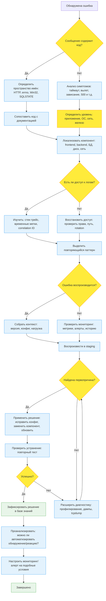

# Диагностика и обработка системных ошибок

<div class="article-tags">
  <span class="tag tag-required">ОБЯЗАТЕЛЬНО</span>
  <span class="tag tag-beginner">ДЛЯ НОВИЧКОВ</span>
</div>

<span class="complexity-badge">Разработчику</span>
<span class="complexity-badge">Архитектору</span>
<span class="complexity-badge">Инженеру</span>

## Обработка ошибок

Ошибка — это отклонение от ожидаемого состояния системы, вызванное нарушением одного или нескольких условий корректного функционирования на любом уровне вычислительного стека: аппаратном, физическом, сетевом, программном, логическом или человеческом. В системном администрировании ошибка не рассматривается как «поломка» в бытовом смысле — это сигнал, несущий информацию о несоответствии текущего поведения системы её проектному или временному целевому состоянию.

Ошибки неизбежны. Любая вычислительная система работает в условиях конечных ресурсов, неопределённого внешнего воздействия и несовершенства реализации. Задача состоит в том, чтобы обеспечить **предсказуемость**, **локализуемость** и **управляемость** ошибок: их появление не должно приводить к непредсказуемым последствиям, их источник должен быть идентифицируем, а реакция на них — нормирована и автоматизирована по возможности.

---

### Что такое ошибка

В контексте системного администрирования ошибка — это **состояние**, при котором компонент системы не может завершить операцию в рамках заданных ограничений: по времени, по ресурсам, по входным данным, по логическим правилам или по внешним зависимостям. Это состояние фиксируется и выражается на одном из уровней абстракции:

- **на аппаратном уровне** — как физическая неисправность или нештатный сигнал (например, parity error, machine check exception);
- **на уровне ядра ОС** — как исключение процессора, сбой системного вызова или внутренняя ошибка драйвера;
- **на уровне пользовательского пространства** — как возврат ненулевого кода из системного вызова, выброс исключения, аварийное завершение процесса;
- **на уровне сетевого взаимодействия** — как таймаут, несоответствие протокола, отказ в обслуживании;
- **на уровне прикладного ПО** — как логическая ошибка, необработанное исключение, сбой валидации или нарушение бизнес-правила.

Важно понимать: *ошибка существует до её обнаружения*. Её можно не зафиксировать, проигнорировать, подавить, но она всё равно была. Система с «нулевыми ошибками в логе» не означает безошибочную работу — это часто признак недостаточного логгирования или подавления сигналов. Профессиональная эксплуатация требует **трансляции** ошибок в понятную форму с сохранением контекста.

---

### Виды ошибок

Ошибки классифицируются по уровню возникновения, степени предсказуемости и способу восстановления.

#### 1. Аппаратные ошибки  

Возникают в результате физических нарушений: перегрев, отказ компонента (ОЗУ, диска, питания), нестабильность тактовой частоты, повреждение шин. Они могут проявляться как:

- **Корректируемые ошибки (CE — Correctable Errors)** — например, однобитовые ошибки ECC-памяти, исправляемые контроллером ОЗУ без участия ОС. Фиксируются в счётчиках аппаратного мониторинга (IPMI, SMART, EDAC), но не приводят к сбою системы.
- **Некорректируемые ошибки (UE — Uncorrectable Errors)** — повреждение нескольких бит, сбой контроллера, потеря сигнала. Приводят к прерыванию выполнения, machine check exception, kernel panic или hard reset.
- **Граничные ошибки (marginal errors)** — нестабильные, повторяющиеся сбои при предельных нагрузках (разгон, высокая температура). Трудно диагностируются, часто проявляются как «случайные» вылеты.

#### 2. Системные ошибки ядра  

Происходят внутри ядра операционной системы при выполнении привилегированных операций. Включают:

- Сбой драйвера устройства (например, обращение к недоступному регистру);
- Нарушение целостности структур ядра (list corruption, use-after-free в пространстве ядра);
- Невозможность выделить память в критической секции (например, при обработке прерывания);
- Ошибки виртуальной памяти (page fault в режиме ядра без страницы подкачки, double fault, triple fault).

Результат — **kernel oops** (в Linux), **bug check** (в Windows, синий экран), **kernel panic** (в Unix-подобных системах). Такие ошибки останавливают систему или переводят её в ограниченный режим диагностики.

#### 3. Ошибки пользовательского пространства  

Наиболее часто встречаются в повседневной практике. Включают:

- Возврат ошибочного кода из системного вызова (`errno` в POSIX, `GetLastError()` в Windows);
- Исключения (в языках с поддержкой исключений — C#, Java, Python);
- Аварийное завершение процесса (segfault/SIGSEGV, abort/SIGABRT, bus error/SIGBUS);
- Нормальное, но нежелательное завершение (например, с кодом 1 из-за неверного аргумента).

Эти ошибки изолированы от ядра: сбой одного процесса не должен повлиять на другие (если не задействованы общие ресурсы без защиты).

#### 4. Сетевые ошибки  

Возникают при обмене данными между узлами. Классифицируются по OSI-уровням:

- Уровень 1 (физический): обрыв, шум, перегрузка линии;
- Уровень 2 (канальный): CRC error, frame loss, MAC-конфликты;
- Уровень 3 (сетевой): недоступность маршрута, TTL expiry, fragmentation failure;
- Уровень 4 (транспортный): таймауты TCP, RST-пакеты, переполнение буфера приёма;
- Уровень 5–7 (сессионный и выше): протокольные нарушения (например, несоответствие HTTP-заголовков), отказ сервера, невалидный сертификат.

#### 5. Логические (семантические) ошибки  

Наиболее коварны: система работает, никаких сигналов сбоя нет, но результат неверен. Примеры:

- Переполнение целого числа без проверки;
- Гонка данных (data race) в многопоточном коде;
- Неправильная сериализация/десериализация;
- Некорректная обработка временных зон;
- Случайное использование тестовых данных в production.

Обнаруживаются только валидацией результата — логами, мониторингом метрик, тестированием гипотез.

---

### Исключения

Исключение — **управляемый механизм передачи управления** при возникновении ошибочного состояния в программной среде, поддерживающей такую модель (например, C++, Java, C#, Python, JavaScript). Исключение не равно ошибке — это способ *реагировать* на ошибку в рамках одного процесса.

Суть механизма: при обнаружении условия, которое не может быть обработано локально, создаётся объект исключения, содержащий контекст (тип, сообщение, стек вызовов), и выполнение немедленно передаётся ближайшему обработчику (`catch`, `except`, `try/except`), ищущему подходящий по типу. Если обработчик не найден, исключение «всплывает» до верхнего уровня и приводит к аварийному завершению.

Важные особенности:

- Исключения — *дорогая* операция: раскрутка стека, выделение памяти под объект, поиск обработчика. Их не следует использовать для управления потоком выполнения (например, вместо `if`).
- В языках с автоматической сборкой мусора (Java, C#, Python) исключения могут содержать ссылки на объекты из стека, что влияет на время жизни этих объектов.
- В системном коде (драйвера, ядро) исключения не используются — только коды возврата и проверки условий.
- Не все исключения — ошибки. В Python, например, `StopIteration` — штатное исключение для завершения итерации.

Исключения — инструмент *программиста*, а не системного администратора напрямую. Однако администратор сталкивается с их последствиями: аварийными завершениями, логами с трейсбэками, необходимостью настройки логгирования и мониторинга исключений на уровне приложения.

---

### Вылеты

«Вылет» — разговорное обозначение **аварийного завершения процесса**, вызванного некорректной ситуацией, которую программа не смогла (или не пыталась) обработать. Технически — получение процессом сигнала, не имеющего установленного обработчика, либо явный вызов `_exit()`, `abort()`, `Environment.FailFast()` и т.п.

Типичные причины:

- Обращение к недопустимому адресу памяти (`SIGSEGV`);
- Ошибка шины (`SIGBUS`);
- Арифметическое переполнение или деление на ноль (в некоторых архитектурах/языках);
- Нарушение ограничений ОС (например, превышение лимита памяти);
- Явный вызов аварийного завершения после обнаружения критической внутренней ошибки (assertion failure).

Вылет не означает сбой системы в целом (в отличие от kernel panic), но может нарушать бизнес-процесс. Его диагностика зависит от:

- Наличия **core dump** (Linux/macOS) или **minidump** (Windows) — дампа памяти и состояния процесса в момент падения;
- Настройки логгирования до момента сбоя;
- Возможности воспроизведения.

В современных системах вылеты часто перехватываются менеджерами процессов (systemd, supervisor, Docker), которые могут перезапускать службу, но без анализа причины это лишь откладывает проблему.

---

### Зависания

Зависание — состояние, при котором процесс продолжает существовать (занимает ресурсы, отображается в `ps`, `top`, Диспетчере задач), но не реагирует на внешние воздействия: не отвечает на запросы, не завершается по сигналу `SIGTERM`, не освобождает ресурсы.

Причины зависаний:

- **Бесконечный цикл без уступки управления** (например, `while (true) { }` без `sleep`);
- **Взаимная блокировка (deadlock)** — два или более потока/процесса удерживают ресурсы, ожидая освобождения друг друга;
- **Голодание (starvation)** — процесс не получает CPU или I/O из-за приоритетов или конкуренции;
- **Ожидание внешнего события, которое никогда не произойдёт** (например, `read()` из разорванного сокета без таймаута, ожидание lock’а от упавшего процесса);
- **Блокирующие системные вызовы без таймаутов** (например, `accept()`, `connect()`, `flock()`);
- **Ошибки в реализации конечных автоматов** — переход в «мёртвое» состояние без выхода.

Зависание опаснее вылета: оно не производит явного сигнала, но постепенно исчерпывает ресурсы (дескрипторы, память, потоки), приводя к каскадному отказу.

Диагностика: анализ стека всех потоков (`gdb attach`, `jstack`, `procdump`, `pstack`), мониторинг блокировок, профилирование I/O и CPU.

---

### Тормоза, лаги, троттлинг и фризинг

Эти термины часто используют как синонимы, однако в диагностике важно различать их по причинам, проявлениям и последствиям. Все они описывают **снижение отклика системы**, но механизмы и уровни контроля — разные.

#### Тормоза

Тормоза — устойчивое, но не катастрофическое падение производительности. Система продолжает функционировать, однако время отклика на операции превышает ожидаемое в разы или на порядки. Это не аварийное состояние, но сигнал о перегрузке или деградации.

Причины:

- **Насыщение ресурсов**:  
  — 100 % загрузка CPU (ограничение по вычислительной мощности);  
  — нехватка свободной памяти → активная подкачка (swap thrashing);  
  — исчерпание файловых дескрипторов или сокетов;  
  — перегрузка дисковой подсистемы (высокий `await`, `util%` в `iostat`).

- **Неоптимальные алгоритмы или конфигурации**:  
  — отсутствие индексов в СУБД при частых запросах;  
  — однопоточная обработка в многопользовательской среде;  
  — избыточное логгирование на медленный носитель;  
  — неправильная настройка очередей (очередь растёт быстрее, чем обрабатывается).

- **Внешние зависимости**:  
  — медленные сторонние API без таймаутов;  
  — синхронные вызовы внутри асинхронного контекста;  
  — блокировка на сетевом уровне (например, DNS-резолв без кэширования).

Тормоза выявляются через **мониторинг метрик**: увеличение latency, рост очередей, снижение throughput при фиксированной нагрузке. Ключевой признак — *линейное или экспоненциальное ухудшение отклика при росте нагрузки*, в отличие от внезапного обвала при ошибках.

#### Лаги

Лаг (от англ. *lag* — задержка) — кратковременная задержка в отклике, не приводящая к полной потере связи или зависанию. Часто проявляется в интерактивных системах: пользователь нажимает кнопку — реакция следует через 2–3 секунды; видеопоток «подвисает» на кадр; звук «скачет».

От тормозов лаг отличается **кратковременностью и эпизодичностью**. Он указывает на **неравномерность обработки** — кратковременные пики нагрузки, блокировки или прерывания.

Типичные источники:

- **Паузы сборщика мусора** (в JVM, .NET, Node.js) — особенно при full GC на куче в несколько гигабайт;
- **Сброс буферов на диск** (`fsync`, `journal commit` в ext4/XFS, checkpoint в PostgreSQL);
- **Переключение контекста при высокой конкуренции потоков**;
- **Пакетная обработка** — например, отправка уведомлений раз в минуту, забирающая 5 секунд CPU;
- **Джит-компиляция** в интерпретируемых средах (V8, PyPy, .NET Native).

Лаги особенно критичны в real-time системах (голос, видеоконференции, игры, HFT), где даже 100 мс задержки нарушают пользовательский опыт.

#### Троттлинг

Троттлинг (throttling — дросселирование) — **сознательное ограничение пропускной способности** на уровне приложения, ОС или сети. Это *защитный механизм*, предотвращающий перегрузку. Однако если он срабатывает слишком часто, это указывает на неправильную балансировку ресурсов.

Примеры:

- ОС ограничивает IOPS процесса через `cgroups`/`systemd` (slice `CPUQuota`, `IOWeight`);
- Браузер замедляет `setTimeout`/`setInterval` во вкладке, находящейся в фоне;
- API возвращает `429 Too Many Requests` — клиент должен снизить частоту запросов;
- СУБД отклоняет новые соединения при достижении `max_connections`;
- Сетевой шейпер (`tc`, `pf`) ограничивает bandwidth по правилам QoS.

Троттлинг полезен: он превращает катастрофический сбой (например, OOM-kill) в предсказуемое замедление. Однако если система постоянно работает в режиме троттлинга, это означает, что **ресурсы выделены недостаточно**, либо **нагрузка распределена нерационально** (например, все запросы идут на один инстанс вместо балансировки).

Диагностика: поиск сообщений вида *throttled*, *rate limited*, *backpressure*, *queue full*, *dropped* в логах; анализ метрик `cgroup` (`cpu.stat`, `memory.pressure`); мониторинг `netstat -s` на dropped packets.

#### Фризинг

Фризинг (freezing — «заморозка») — состояние, при котором **отдельные компоненты интерфейса или функции перестают отвечать**, но основной процесс продолжает работать. От зависания отличается **частичностью**: например, перестаёт обновляться UI, но фоновые задачи выполняются; или сетевой стек отвечает, но диск не пишет.

Часто встречается в:

- Графических приложениях с блокирующим UI-потоком (например, долгая операция в основном потоке Electron-приложения);
- Виртуальных машинах при нехватке ресурсов хоста («stun» в KVM);
- Системах с изолированными доменами (например, завис браузерный рендер-процесс, но основной процесс жив).

Фризинг — признак **плохой архитектуры разделения ответственности**: критические пути не изолированы, блокирующие операции выполняются в интерактивных контекстах.

Диагностика: профилирование потоков по времени CPU и I/O, анализ `strace`/`dtrace` на предмет долгих системных вызовов в UI-потоке.

---

### Коды ошибок и непонятный набор символов

Когда система сообщает об ошибке, она почти всегда использует **стандартизированный идентификатор**, а не просто текстовое пояснение. Это необходимо для автоматической обработки: скрипты, мониторинги, CI/CD-конвейеры должны однозначно реагировать на тип сбоя.

Однако для человека «код ошибки» часто выглядит как бессмысленный набор цифр и букв: `0x80070005`, `ECONNRESET`, `502 Bad Gateway`, `HRESULT 0x80040154`. Чтобы интерпретировать его, нужно понимать **пространство имён**, в котором он определён.

#### Что такое код ошибки

Код ошибки — целочисленное (реже — строковое) значение, возвращаемое функцией, системным вызовом или протоколом для указания причины неудачи. Его основные свойства:

- **Уникальность в рамках контекста** (например, `errno` в POSIX имеет одно значение для `EACCES`, но Windows может использовать другой код для той же семантики);
- **Сохранение в регистрах/памяти** после операции (в POSIX — в глобальной переменной `errno`; в Windows — через `GetLastError()` или возвращаемое значение HRESULT);
- **Сопоставимость с документацией** — каждому коду соответствует описание в спецификации или man-странице.

Код ошибки — **симптом**. Например, `EIO` (Input/Output error) означает, что операция ввода-вывода не удалась, но *почему* — нужно выяснять отдельно: сбой диска, отключение кабеля, повреждение файловой системы.

#### Почему «непонятный набор символов»

То, что кажется «мусором», на деле — компактное кодирование:

- Префикс `0x` означает шестнадцатеричную запись. Это стандарт для низкоуровневых кодов, так как удобно отображает битовые поля.
- В Windows `HRESULT` — 32-битное значение, где старший бит указывает на ошибку (`1` = failure), следующие 4 бита — facility (подсистема: COM, Win32, RPC), младшие 16 — код.
- В Linux `errno` — просто номер, но часто сопровождается макросом (например, `13` = `EACCES`), что делает код читаемым в исходниках.
- В HTTP коды трёхзначные: первая цифра — класс (4xx — клиентская ошибка, 5xx — серверная), остальные — конкретика.

Если видите `0xC0000005` — это конкретный код STATUS_ACCESS_VIOLATION в NTSTATUS, эквивалентный `SIGSEGV`.

#### Утилита `certutil -decodehex` и чтение ошибок

В Windows часто приходится сталкиваться с дампами ошибок в шестнадцатеричном виде — например, в Event Viewer или логах драйверов. Утилита `certutil` позволяет интерпретировать такие последовательности:

```cmd
certutil -decodehex input.txt output.bin
```

Но прямое декодирование редко даёт читаемый текст. Гораздо полезнее:

- Для `HRESULT`: использовать `format` в PowerShell:
  ```powershell
  [System.Runtime.InteropServices.Marshal]::GetExceptionForHR(0x80070005)
  ```
  Вернёт: `Access is denied.`

- Для `NTSTATUS`: онлайн-таблицы (например, `ntstatus.h` из WDK) или `err` от Microsoft (устаревшая, но рабочая утилита).

- Для `errno` в Linux: `errno 11` → `Resource temporarily unavailable (EAGAIN)` (если установлен пакет `moreutils`), либо `perror` в C-коде.

Главный принцип: **никогда не интерпретируйте код «на глаз»**. Всегда сверяйтесь с официальной спецификацией для конкретной платформы и версии.

---

### Коды ошибок в разных языках программирования

Языки не вводят собственные коды ошибок, но предоставляют **обёртки и абстракции** над системными.

#### C / POSIX  
- Использует глобальную переменную `errno` (thread-local в современных реализациях).  
- После неудачного системного вызова (`open`, `read`, `connect`) проверяют `errno`:  
  ```c
  int fd = open("/root/secret", O_RDONLY);
  if (fd == -1) {
      if (errno == EACCES) { /* отказано в доступе */ }
  }
  ```
- Коды определены в `<errno.h>`, с макросами: `EACCES`, `ENOENT`, `ECONNREFUSED`.

#### Windows API (C/C++)  
- Функции возвращают `BOOL`, `HANDLE`, `HRESULT`.  
- При неудаче вызывают `GetLastError()` для получения кода Win32 (`ERROR_ACCESS_DENIED = 5`).  
- Для COM — `HRESULT`: `S_OK` (0), `E_FAIL` (0x80004005), `E_ACCESSDENIED` (0x80070005).  
- Преобразование: `HRESULT_FROM_WIN32(GetLastError())`.

#### Java  
- Не использует коды напрямую — бросает исключения:  
  `FileNotFoundException` (обёртка над `ENOENT`),  
  `SecurityException` (над `EACCES`),  
  `ConnectException` (над `ECONNREFUSED`).  
- Коды ОС доступны через `IOException.getCause()` или JNI, но редко нужны администратору.

#### Python  
- Исключения: `FileNotFoundError`, `PermissionError`, `ConnectionRefusedError`.  
- Доступ к `errno`:  
  ```python
  try:
      open('/root/x')
  except PermissionError as e:
      print(e.errno)  # 13
      print(e.strerror)  # 'Permission denied'
  ```

#### C# / .NET  
- `Win32Exception` содержит `NativeErrorCode` (Win32);  
- `IOException` — `HResult` (HRESULT);  
- `SocketException` — `SocketErrorCode` (перечисление, соответствует `errno` в POSIX-совместимых системах).

Важно: язык лишь *транслирует* системную ошибку. Администратор должен уметь проследить цепочку:  
`HTTP 500` → `IOException` в логе .NET → `HRESULT 0x80070057` → `ERROR_INVALID_PARAMETER` → ошибка валидации пути к файлу.

---

### Как читать ошибки по стеку

Стек-трейс (stack trace) — это запись последовательности вызовов функций, приведших к возникновению ошибки. Он отражает **цепочку причинно-следственных связей** от точки входа (например, HTTP-запроса) до места сбоя. Умение читать стек — ключевой навык системного администратора при диагностике прикладных сбоев.

#### Структура типичного стек-трейса

В большинстве сред (Java, .NET, Python, Node.js) стек выводится в виде списка строк, каждая из которых содержит:

1. **Имя метода/функции** — с указанием класса (если есть) и сигнатуры;
2. **Имя файла исходного кода** — если отладочная информация доступна;
3. **Номер строки** — строка в файле, откуда был сделан вызов (не обязательно строка с ошибкой!);
4. (Опционально) **Адрес в памяти**, хэш фрейма, параметры.

Пример (Java):
```
java.lang.NullPointerException: Cannot invoke "String.length()" because "s" is null
    at com.example.UserValidator.validateName(UserValidator.java:42)
    at com.example.UserService.createUser(UserService.java:87)
    at com.example.ApiController.register(ApiController.java:23)
    at java.base/jdk.internal.reflect.NativeMethodAccessorImpl.invoke0(Native Method)
    ...
```

Важно: **самая верхняя строка — ближайшая к месту сбоя**, самая нижняя — точка входа. Читать нужно *сверху вниз*, но *анализировать — снизу вверх*: сначала понять контекст (какой запрос, откуда), затем — цепочку вызовов, и лишь в конце — конкретную операцию.

#### Почему номера строк в тексте ошибок не соответствуют коду

Это частая причина раздражения: в логе указана строка 42, а в актуальном коде на строке 42 — комментарий. Причины:

1. **Разница между версиями кода и запущенного приложения**  
   — Приложение собрано из ветки `feature/x`, а администратор смотрит `main`;  
   — Задержка деплоя: ошибка возникла вчера, а сегодня код изменился.

2. **Отсутствие отладочной информации в сборке**  
   — В production-сборках часто отключают `debug symbols` (`.pdb` в Windows, `-g` в GCC, `sourceMap` в JavaScript), чтобы уменьшить размер и повысить безопасность. Тогда номера строк могут быть искажены или вовсе отсутствовать.

3. **Препроцессинг и транспиляция**  
   — TypeScript → JavaScript, SASS → CSS, C# с `#if DEBUG` — исходные строки не совпадают с исполняемыми;  
   — Минификация JavaScript: весь код в одну строку, номера теряют смысл.

4. **Инлайнинг и оптимизации компилятора**  
   — JIT-компиляторы (.NET, JVM, V8) могут встраивать функции, переупорядочивать инструкции, удалять «мертвый» код. Тогда стек указывает на *ближайшую точку останова*, а не на точную инструкцию.

5. **Асинхронные вызовы**  
   — В JavaScript, Python (`async/await`), C# (`async/await`) стек может «обрываться» на границе `await`. Современные среды поддерживают *long stack traces*, но не все их включают.

**Как с этим работать:**  
- Всегда сверяйте **версию приложения** в логе (например, `Build: v2.3.1-rc4+7a8b9c0`) с исходным кодом;  
- Используйте `.pdb`, `.map`-файлы или `sourceLink` для сопоставления;  
- Включайте `detailed stack traces` в staging-среде;  
- При сборке production-образов сохраняйте артефакты (например, в Nexus/Artifactory) вместе с исходниками на момент сборки.

---

### Заголовок ошибки и тело ошибки

Сообщение об ошибке состоит из двух логических частей:

#### Заголовок (summary, headline)

Краткое, стандартизированное описание типа ошибки. Предназначен для автоматической классификации.

Примеры:
- `java.lang.OutOfMemoryError: Java heap space`  
- `System.IO.IOException: The process cannot access the file because it is being used by another process.`  
- `ERROR 1045 (28000): Access denied for user 'root'@'localhost'`

Заголовок содержит:
- Тип исключения/ошибки (часто с пространством имён);
- Краткую причину (категорию: `heap space`, `file in use`, `access denied`);
- (Опционально) код — например, `1045` в MySQL.

#### Тело (detail, stack trace, context)

Дополнительная информация: стек-трейс, параметры, состояние окружения, локальные переменные (если включено), временные метки.

Важно: **тело не должно попадать в клиентский ответ** (например, в HTTP-500), так как может содержать секреты (пути, имена файлов, переменные окружения). Оно логируется на сервере, но не возвращается пользователю.

Профессиональная практика:
- Заголовок — для пользователя (если он технически грамотен) и мониторинга;
- Тело — только для администратора и разработчика, в защищённом хранилище логов;
- Все сообщения — на английском (даже в русскоязычной системе), чтобы избежать проблем с кодировками и обеспечить совместимость с инструментами анализа.

---

### Ошибки сети

Сетевые ошибки — особый класс, так как возникают на границе систем. Администратор не управляет удалённой стороной, но должен уметь отличить *локальную* проблему от *удалённой*.

#### Типичные признаки

| Симптом | Вероятная причина |
|--------|------------------|
| `Connection timed out` | Пакеты не доходят до получателя (файрвол, маршрутизация, выключен сервер) |
| `Connection refused` | Сервер получил SYN, но нет слушающего сокета (порт закрыт, сервис не запущен) |
| `No route to host` | Локальная система не знает, как добраться до адреса (отсутствует маршрут, интерфейс down) |
| `Сеть is unreachable` | Нет активного сетевого интерфейса для нужной подсети |
| `Broken pipe` (`EPIPE`) | Удалённая сторона закрыла соединение, а локальная попыталась писать |
| `Connection reset by peer` (`ECONNRESET`) | Удалённая сторона аварийно разорвала соединение (RST-пакет) |

#### Диагностика

1. **Проверка доступности**:  
   — `ping` — базовая IP-доступность (но ICMP может быть заблокирован);  
   — `telnet host port` / `nc -vz host port` — проверка открытости TCP-порта;  
   — `curl -v http://host` — детальный HTTP-диалог.

2. **Анализ трассировки**:  
   — `traceroute` / `mtr` — где обрывается маршрут;  
   — `tcpdump` / `Wireshark` — какие пакеты уходят и приходят.

3. **Проверка локальной конфигурации**:  
   — `ip route get <addr>` — какой маршрут используется;  
   — `ss -tuln` — какие порты слушает локальная система;  
   — `iptables -L -n -v` / `nft list ruleset` — правила фильтрации.

Сетевая ошибка — почти всегда **симптом**. Например, `ECONNRESET` может быть следствием OOM-kill на удалённом сервере.

---

### Коды ошибок HTTP

HTTP-коды — стандарт (RFC 7231, RFC 9110), понятный любому компоненту веб-стека: браузеру, обратному прокси, WAF, мониторингу. Они делятся на классы:

- **1xx (Informational)** — промежуточные (редко видны администратору);
- **2xx (Success)** — операция выполнена;
- **3xx (Redirection)** — требуется дополнительное действие;
- **4xx (Client Error)** — ошибка на стороне клиента;
- **5xx (Server Error)** — ошибка на стороне сервера.

#### Наиболее важные для администратора

| Код | Значение | Типичная причина |
|-----|----------|------------------|
| `400 Bad Request` | Некорректный синтаксис запроса | Невалидный JSON, отсутствующий заголовок, слишком длинный URL |
| `401 Unauthorized` | Требуется аутентификация | Отсутствует `Authorization`, просрочен токен |
| `403 Forbidden` | Доступ запрещён | Права недостаточны, IP заблокирован, политика WAF |
| `404 Not Found` | Ресурс не существует | Опечатка в пути, сервис не зарегистрирован в роутере |
| `405 Method Not Allowed` | Метод не поддерживается для ресурса | `POST` на endpoint, принимающий только `GET` |
| `408 Request Timeout` | Клиент не отправил запрос вовремя | Медленное соединение, клиентский таймаут |
| `429 Too Many Requests` | Превышен лимит запросов | Rate limiting сработал |
| `500 Internal Server Error` | Неизвестная ошибка сервера | Необработанное исключение, сбой БД, отсутствие файла |
| `502 Bad Gateway` | Прокси получил недопустимый ответ от upstream | Backend упал, вернул не HTTP, таймаут |
| `503 Service Unavailable` | Сервис временно недоступен | Перегрузка, maintenance mode, отсутствие здоровых инстансов |
| `504 Gateway Timeout` | Прокси не дождался ответа от upstream | Backend «завис», не отвечает вовремя |

**Важно:**  
- `500` — сигнал к немедленному анализу логов backend’а;  
- `502/504` — проблема между прокси (nginx, HAProxy) и backend’ом;  
- `4xx` — чаще всего не требуют вмешательства администратора (это клиентская ошибка), но массовые `4xx` могут указывать на изменение API или атаку.

---

### Основные общепринятые ошибки

Некоторые ошибки встречаются повсеместно — вне зависимости от ОС, языка или стека. Их стоит знать наизусть.

| Код / Имя | Описание | Где встречается |
|-----------|----------|----------------|
| `EACCES` / `EPERM` | Отказ в доступе | Файловые операции, сокеты, `bind()` на привилегированный порт |
| `ENOENT` | Файл или каталог не существует | `open()`, `exec()`, `chdir()` |
| `EEXIST` | Файл уже существует | `mkdir()`, `link()`, `bind()` на занятый порт |
| `ECONNREFUSED` | Соединение отклонено | `connect()` к закрытому порту |
| `ETIMEDOUT` | Таймаут операции | Сетевые вызовы, `accept()`, `read()` без данных |
| `EADDRINUSE` | Адрес уже используется | `bind()` на занятый порт/IP |
| `ENOMEM` | Недостаточно памяти | `malloc()`, `fork()`, выделение буферов |
| `EPIPE` | Разорван канал | Запись в закрытый сокет/pipe |
| `ENOSPC` | Нет свободного места | Запись на диск, создание файла |

Эти коды стандартизированы в POSIX и реализованы одинаково в Linux, macOS, BSD. В Windows есть эквиваленты через `Win32 error codes`.

---

### Коды ошибок Windows

Windows использует несколько пространств имён:

1. **Win32 Error Codes** (32-битные, из `winerror.h`)  
   — `5`: `ERROR_ACCESS_DENIED`  
   — `2`: `ERROR_FILE_NOT_FOUND`  
   — `10060`: `WSAETIMEDOUT` (сетевой таймаут)  
   Получить: `GetLastError()`, `net helpmsg <code>` в командной строке.

2. **NTSTATUS** (из ядра, 32-битные)  
   — `0xC0000022`: `STATUS_ACCESS_DENIED`  
   — `0xC0000034`: `STATUS_OBJECT_NAME_NOT_FOUND`  
   Используются драйверами, Event Log, `!analyze` в WinDbg.

3. **HRESULT** (COM, 32-битные)  
   — `0x80070005`: `E_ACCESSDENIED` (Win32 5, обёрнутый)  
   — `0x80040154`: `REGDB_E_CLASSNOTREG` (класс не зарегистрирован в реестре)  
   Структура: `SEVERITY (1b) | FACILITY (12b) | CODE (16b)`.

Для диагностики:
- `whoami /priv` — проверка привилегий;
- `wevtutil qe System /q:"*[System[Level=2]]"` — критические ошибки из Event Log;
- `dxdiag` — диагностика DirectX (часто при графических сбоях);
- `sfc /scannow` — проверка целостности системных файлов.

---

### Другие важные коды ошибок

Помимо универсальных (POSIX, HTTP, Win32), в эксплуатации постоянно встречаются коды, специфичные для популярных подсистем. Администратор должен уметь их распознавать.

#### PostgreSQL

Ошибки возвращаются в формате **SQLSTATE** — пятизначный код по стандарту SQL (ANSI/ISO). Первые два символа — класс, остальные — уточнение.

| Код | Класс | Пример сообщения |
|-----|-------|------------------|
| `08006` | Connection Exception | `connection to server was lost` |
| `23505` | Integrity Constraint Violation | `duplicate key value violates unique constraint` |
| `53300` | Too Many Connections | `sorry, too many clients already` |
| `57014` | Query Canceled | `canceling statement due to user request` |
| `XX000` | Internal Error | `could not write to file "base/pgsql_tmp/pgsql_tmp12345": No space left on device` |

Диагностика:  
— `pg_stat_activity` — текущие запросы и их состояние (`waiting`, `active`);  
— `log_min_messages = error`, `log_error_verbosity = verbose` — детальные логи;  
— `pg_controldata` — состояние кластера при старте.

#### MySQL / MariaDB

Аналогично — числовой код + SQLSTATE.

| Код | SQLSTATE | Описание |
|-----|----------|----------|
| `1045` | `28000` | `Access denied for user` |
| `1049` | `42000` | `Unknown database` |
| `1213` | `40001` | `Deadlock found when trying to get lock` |
| `2002` | `HY000` | `Can't connect to local MySQL server` |
| `2013` | `HY000` | `Lost connection to MySQL server during query` |

Особенность: коды до 1000 — клиентские, 1000+ — серверные. `SHOW ENGINE INNODB STATUS` — ключевой инструмент при deadlock’ах.

#### Docker

Ошибки Docker CLI и демона имеют текстовый формат, но часто содержат стандартные системные коды внутри.

| Сообщение | Причина |
|-----------|---------|
| `Cannot connect to the Docker daemon` | `dockerd` не запущен, сокет `/var/run/docker.sock` недоступен |
| `no space left on device` | Заполнена `overlay2`-директория или `devicemapper`-пул |
| `bind: address already in use` | Порт, проброшенный через `-p`, занят другим процессом |
| `OCI runtime create failed` | Ошибка в `runc` — часто из-за неподдерживаемых capability или seccomp-профиля |
| `exec user process caused: no such file or directory` | Бинарный файл в `ENTRYPOINT` отсутствует или имеет неверный `#!`-заголовок (например, `#!/bin/sh` в alpine без `sh`) |

Диагностика:  
— `docker system df` — использование диска;  
— `journalctl -u docker` — логи демона;  
— `docker inspect <container>` — детали окружения.

#### systemd

Службы, управляемые `systemd`, при сбое возвращают код выхода + дополнительную информацию.

| Состояние | Описание |
|-----------|----------|
| `failed` | Процесс завершился с ненулевым кодом |
| ` activating (auto-restart)` | systemd пытается перезапустить (согласно `Restart=`) |
| `start-limit-hit` | Достигнут лимит перезапусков (`StartLimitIntervalSec`, `StartLimitBurst`) |

Ключевые команды:  
— `systemctl status <service>` — текущее состояние, последние логи;  
— `journalctl -u <service> -f` — поток логов;  
— `systemctl show <service>` — параметры юнита (таймауты, зависимости, лимиты).

---

### Как исправлять проблемы с железом

Аппаратные ошибки требуют иного подхода, чем программные: **нельзя «перезапустить компонент» — только заменить или изолировать**.

#### Диагностика

1. **Сбор аппаратных логов**:  
   — `dmesg -T | grep -i "error\|fail\|ecc\|mce"` — ошибки ядра, включая machine check;  
   — `edac-util --status` — статистика ECC-ошибок в памяти;  
   — `smartctl -a /dev/sda` — SMART-статус диска (Reallocated_Sector_Ct, Pending_Sectors, UDMA_CRC_Error_Count);  
   — `ipmitool sel list` — системный журнал сервера через IPMI (ошибки питания, температуры, вентиляторов);  
   — `lspci -vvv` — статус PCI-устройств, ошибки AER (Advanced Error Reporting).

2. **Наблюдение за счётчиками**:  
   — `cat /sys/devices/system/edac/mc/mc*/ce_count` — корректируемые ошибки памяти;  
   — `grep -i "temperature" /var/log/syslog` — перегрев;  
   — `iostat -x 1` — ошибки ввода-вывода (`errs`, `fail` в выводе `sar -d`).

#### Типичные сценарии и действия

| Симптом | Вероятная причина | Действие |
|--------|------------------|----------|
| Случайные вылеты, kernel panic | Нестабильная память (UE) | Запустить `memtest86+` на 4+ часа; заменить модуль |
| Падение производительности диска, `I/O error` | Физический износ SSD/HDD | Проверить SMART; заменить носитель; восстановить данные из резервной копии |
| Перегрев CPU, троттлинг | Забиты радиаторы, вышел из строя вентилятор | Очистка системы охлаждения; мониторинг `sensors` |
| Потеря сетевого соединения, CRC errors | Проблемы с кабелем, портом, драйвером | Замена кабеля; проверка `ethtool -S eth0`; обновление драйвера |
| Неожиданное выключение питания | Сбой ИБП, блока питания | Проверка ИБП (`apcaccess status`); замена PSU |

**Важно:**  
- При подозрении на аппаратную ошибку — **немедленно резервное копирование** критичных данных;  
- Не пытайтесь «дожать» нестабильное оборудование — это рискует целостностью данных;  
- В кластерных системах — переведите узел в режим обслуживания (`node drain`) перед диагностикой.

---

### Утечка памяти

Утечка памяти — постепенное накопление неиспользуемых, но недоступных для сборки мусора или освобождения блоков памяти. Это **деградация**, которая проявляется через часы, дни, недели.

#### Признаки

- Постепенный рост RSS (Resident Set Size) процесса при неизменной нагрузке;
- Увеличение использования swap;
- Рост времени GC (в JVM/.NET) или частоты `malloc`/`free`;
- Внезапные OOM-kill’и после длительной работы.

#### Диагностика по ОС

1. **Мониторинг**:  
   — `ps aux --sort=-%mem | head` — топ процессов по памяти;  
   — `pmap -x <pid>` — детальное распределение памяти процесса;  
   — `cat /proc/<pid>/status` — `VmRSS`, `VmSize`, `Threads`.

2. **Сравнение во времени**:  
   Запуск скрипта каждые 5 минут:
   ```bash
   while true; do
     date >> mem.log
     ps -p <pid> -o pid,vsz,rss,comm >> mem.log
     sleep 300
   done
   ```

3. **Выявление OOM**:  
   — `dmesg -T | grep -i "killed process"`;  
   — `journalctl -k --since "1 hour ago" | grep -i "oom\|kill"`.

#### Диагностика по приложению

- **Java**: `jstat -gc <pid> 5s`, `jmap -histo:live <pid>`, `jcmd <pid> GC.run`; heap dump через `jmap -dump:live,file=heap.hprof <pid>` → анализ в Eclipse MAT.
- **.NET**: `dotnet-dump collect`, анализ в Visual Studio или PerfView.
- **C/C++**: `valgrind --leak-check=full`, `AddressSanitizer` (`-fsanitize=address`).
- **Node.js**: `heapdump` модуль, `--inspect` + Chrome DevTools.

Утечка — не всегда ошибка кода. Может быть вызвана:
- Кэшированием без ограничения размера;
- Подпиской на события без отписки;
- Хранением сессий в памяти без TTL;
- Неправильной работой пулов соединений.

**Профилактика**:  
— Настройка лимитов памяти (`-Xmx`, `ulimit -v`, `MemoryLimit` в systemd);  
— Мониторинг RSS и GC-метрик;  
— Регулярные «холодные» рестарты служб (rolling restart).

---

### Как быстро и безопасно прекращать работу приложений, сервера, СУБД

Аварийное завершение — последнее средство. Цель — **минимизировать повреждение данных** и обеспечить восстанавливаемость.

#### Последовательность сигналов (POSIX)

1. **`SIGTERM` (15)** — вежливый запрос на завершение.  
   Приложение должно:  
   — остановить приём новых запросов;  
   — завершить текущие транзакции;  
   — освободить ресурсы (сокеты, файлы, локи);  
   — выгрузить кэши;  
   — завершиться.  
   Таймаут: обычно 30–120 секунд (`TimeoutStopSec` в systemd).

2. **`SIGKILL` (9)** — немедленное уничтожение процесса.  
   Никаких обработчиков, никакого освобождения. Используется **только** если `SIGTERM` не сработал. Рискует:  
   — повреждением данных (незаписанные буферы);  
   — оставлением «мёртвых» локов;  
   — необходимостью восстановления при старте (например, WAL replay в PostgreSQL).

**Правило:** всегда пробовать `SIGTERM` → ждать таймаут → только потом `SIGKILL`.

#### Для СУБД

- **PostgreSQL**: `pg_ctl stop -m fast` (отменяет новые подключения, завершает активные, делает checkpoint); `-m immediate` — аналог `SIGKILL`, требует восстановления.
- **MySQL**: `mysqladmin shutdown` — штатное завершение; `kill -9` — только в крайнем случае.
- **Redis**: `SHUTDOWN SAVE` / `SHUTDOWN NOSAVE` — управляемое завершение с/без сохранения.

#### Для сервера (хоста)

1. **Остановка служб**:  
   ```bash
   systemctl stop nginx postgresql docker
   ```
2. **Синхронизация дисков**:  
   ```bash
   sync; echo 3 > /proc/sys/vm/drop_caches  # (опционально, для чистоты)
   ```
3. **Выключение**:  
   ```bash
   shutdown -h now
   ```
   Или перезагрузка: `shutdown -r now`.

**В виртуальной среде:**  
— Используйте `acpi shutdown` через гипервизор (VMware Tools, QEMU guest agent), а не `power off`;  
— Это генерирует `SIGTERM` для всех служб, как при физическом выключении.

---

### Польза перезагрузки

Перезагрузка — не «лечение от всех болезней», но **валидный инструмент восстановления состояния**, если:

- Накопились неисправимые состояния ядра (например, утечки в драйверах);
- Изменена конфигурация, требующая перезагрузки (новый `sysctl`, ядро, модули);
- Система находится в неопределённом состоянии (например, после аппаратного сбоя).

Однако:

- Перезагрузка **не заменяет диагностику**. Если сервис падает каждые 6 часов — перезагрузка скрывает проблему, но не решает её.
- В production-средах перезагрузка должна быть:  
  — запланированной;  
  — проведённой в режиме обслуживания (drain);  
  — сопровождаемой мониторингом после старта.

**Когда перезагрузка оправдана:**  
— После обновления ядра;  
— При стабильном росте `slab`/`dentry` cache без освобождения;  
— При неустранимом `hung_task` (процесс в состоянии `D` — uninterruptible sleep).

---

### Ошибки, связанные с аппаратными неполадками

Это ошибки, которые **не могут быть исправлены программно**, но проявляются на программном уровне.

| Программный симптом | Аппаратная причина |
|---------------------|--------------------|
| `Input/output error` при чтении файла | Повреждённый сектор на диске |
| `Bus error (core dumped)` | Ошибка шины, нестабильная ОЗУ |
| `Machine check exception` | Перегрев CPU, повреждение кэша |
| Случайные битфлипы в данных | Космическое излучение, неисправная ECC-память |
| Потеря пакетов без объяснения | Проблемы с сетевой картой, кабелем, коммутатором |
| `Thermal throttling` в `dmesg` | Неисправная система охлаждения |

**Золотое правило:** если одна и та же ошибка повторяется на разных ОС, с разными драйверами, на «чистой» установке — вероятно, причина аппаратная.

---

### Самые страшные ошибки для сервера

Эти ошибки угрожают **целостности данных** и **доступности сервиса**. Их нельзя игнорировать.

1. **`Out of memory: Kill process` (OOM-killer)**  
   — Ядро принудительно завершает процессы, чтобы выжить.  
   — Риск: убит критичный процесс (например, СУБД), данные не сохранены.  
   — Профилактика: лимиты (`cgroups`), мониторинг `memory.pressure`, настройка `vm.overcommit_memory`.

2. **`Filesystem is read-only`**  
   — Ядро перевело ФС в режим «только чтение» из-за ошибок (например, `EXT4-fs error`).  
   — Сервисы перестают писать логи, обновлять данные.  
   — Причина: аппаратная ошибка диска, повреждение метаданных.  
   — Действие: немедленный бэкап, проверка `fsck` после выключения.

3. **`RAID array degraded` / `failed`**  
   — Потеря избыточности. Один отказ — потеря данных.  
   — Мониторинг: `megacli`, `smartctl -d megaraid`, `cat /proc/mdstat`.  
   — Обязательно: замена диска *до* второго отказа.

4. **`Clock skew detected` / `NTP sync lost`**  
   — В распределённых системах (Kafka, Cassandra, Kerberos) рассинхронизация времени на `>`1 сек убивает работу.  
   — Причина: нестабильный NTP-сервер, виртуальная машина без `chrony`/`systemd-timesyncd`.

5. **`Transaction log full` (в СУБД)**  
   — Например, `The transaction log for database 'X' is full`.  
   — Запись останавливается, сервис «зависает».  
   — Профилактика: мониторинг размера лога, настройка `autogrowth`, резервное копирование логов.

6. **`Split-brain` в кластере**  
   — Два узла считают себя мастером. Записи конфликтуют, данные расходятся.  
   — Требует немедленного вмешательства: останов одного узла, ручное восстановление.

---

## Приложение 1. Сводная таблица кодов ошибок

Таблица охватывает наиболее часто встречающиеся коды в повседневной эксплуатации. Приведены эквиваленты между системами, где они существуют.

| Код / Имя | POSIX (`errno`) | Win32 | HTTP | SQLSTATE (PostgreSQL) | Описание | Типичный контекст |
|-----------|-----------------|--------|------|------------------------|----------|-------------------|
| **Доступ** | `EACCES` (13) | `5` (`ERROR_ACCESS_DENIED`) | `403 Forbidden` | `42501` | Отказ в доступе: недостаточно прав | Открытие файла, `bind()` на порт `<`1024, запрос к API без прав |
| **Не найден** | `ENOENT` (2) | `2` (`ERROR_FILE_NOT_FOUND`) | `404 Not Found` | `42P01` | Ресурс отсутствует | `open()`, `exec()`, обращение к несуществующему endpoint’у |
| **Уже существует** | `EEXIST` (17) | `183` (`ERROR_ALREADY_EXISTS`) | — | `42P07` | Попытка создания уже существующего объекта | `mkdir()`, `bind()` на занятый порт, `CREATE TABLE IF NOT EXISTS` без `IF NOT` |
| **Адрес используется** | `EADDRINUSE` (98) | `10048` (`WSAEADDRINUSE`) | — | — | Порт или сокет уже занят | Запуск двух экземпляров сервиса на одном порту |
| **Таймаут** | `ETIMEDOUT` (110) | `10060` (`WSAETIMEDOUT`) | `408 Request Timeout`, `504 Gateway Timeout` | `57014` | Операция не завершилась вовремя | Сетевой запрос, `accept()`, `read()` без данных |
| **Соединение отклонено** | `ECONNREFUSED` (111) | `10061` (`WSAECONNREFUSED`) | `502 Bad Gateway` (часто) | — | Удалённая сторона отвергла соединение | `connect()` к неработающему сервису |
| **Разорван канал** | `EPIPE` (32) | `109` (`ERROR_BROKEN_PIPE`) | — | — | Запись в закрытое соединение | Клиент закрыл сокет, сервер пытается писать |
| **Нет памяти** | `ENOMEM` (12) | `14` (`ERROR_OUTOFMEMORY`) | `503 Service Unavailable` (косвенно) | `53200` | Не хватает оперативной памяти | `fork()`, `malloc()`, выделение буфера |
| **Нет места** | `ENOSPC` (28) | `112` (`ERROR_DISK_FULL`) | `507 Insufficient Storage` | `53100` | Закончилось место на диске/в quota | Запись файла, `CREATE INDEX`, логирование |
| **Deadlock** | — | `145` (`ERROR_LOCK_VIOLATION`) | — | `40001` | Взаимная блокировка | Транзакции в СУБД, многопоточные приложения |
| **Недопустимый параметр** | `EINVAL` (22) | `87` (`ERROR_INVALID_PARAMETER`) | `400 Bad Request` | `22023` | Некорректный аргумент функции | `ioctl()`, `setsockopt()`, вызов API с битым JSON |

> **Примечание**:  
> — `—` означает, что код не стандартизирован в этой системе (но может возникать как следствие);  
> — SQLSTATE одинаков для всех СУБД, совместимых со стандартом (PostgreSQL, MySQL, Oracle);  
> — HTTP-коды 4xx — проблема клиента, 5xx — сервера, но *интерпретация администратором* зависит от роли (если вы运维 backend’а, то `502` — ваша зона ответственности).

---

## Приложение 2. Чек-лист диагностики типовых сценариев

Чек-лист построен по принципу **«от общего к частному»**, без предположений о стеке. Каждый шаг — проверка или действие; переход — по результату.

### Сценарий 1. Сервис не отвечает (HTTP 5xx, таймаут, connection refused)

1. **Проверить доступность хоста**:  
   ```bash
   ping <host>
   ```
   → Если недоступен: проблема сети/хоста → перейти к *Сценарию 3*.  
   → Если доступен: продолжить.

2. **Проверить порт**:  
   ```bash
   nc -vz <host> <port>   # или telnet <host> <port>
   ```
   → `Connection refused`: сервис не слушает порт → проверить статус службы (`systemctl status <service>`).  
   → `Connection timed out`: брандмауэр/маршрутизация → `iptables -L`, `ss -tuln`, `tcpdump`.

3. **Если служба «активна», но не отвечает**:  
   — Посмотреть логи: `journalctl -u <service> -f`;  
   — Проверить потребление ресурсов: `top`, `htop`, `iotop`;  
   — Проверить блокировки: `lsof -p <pid>`, `strace -p <pid>`.

4. **Если процесс «завис» (D-state)**:  
   — `ps aux | grep ' D '` — процессы в uninterruptible sleep;  
   — Причина почти всегда — I/O (диск, NFS). Проверить `dmesg`, SMART.

---

### Сценарий 2. Сервис медленно работает (высокий latency, лаги)

1. **Измерить baseline**:  
   — `curl -w "Time: %{time_total}s\n" -o /dev/null -s http://...`  
   — Сравнить с историей (Grafana, Prometheus).

2. **Разделить компоненты**:  
   — Frontend → Backend → БД → Диск.  
   — Использовать трассировку (OpenTelemetry, Jaeger) или логи с correlation ID.

3. **Проверить ресурсы хоста**:  
   — CPU: `mpstat 1`; высокий `iowait` → дисковая подсистема;  
   — Память: `free -h`, `vmstat 1`; рост `si`/`so` → свопинг;  
   — Диск: `iostat -x 1`; высокий `await`, `%util` `>` 90%;  
   — Сеть: `iftop`, `nethogs`.

4. **Проверить приложение**:  
   — GC-паузы (Java: `jstat -gc`, .NET: PerfMon `GC % Time`);  
   — Блокирующие вызовы (`strace`, `perf record`);  
   — Очереди (RabbitMQ `queue.length`, Redis `llen`).

---

### Сценарий 3. Хост недоступен (не пингуется, нет SSH)

1. **Проверить физический/виртуальный статус**:  
   — В дата-центре: индикаторы питания, консоль (IPMI/iLO);  
   — В облаке: статус инстанса в консоли провайдера.

2. **Если хост «жив», но нет сети**:  
   — Проверить интерфейсы: `ip link show`;  
   — Маршруты: `ip route`;  
   — ARP-таблица: `arp -an`.

3. **Если ядро «упало» (kernel panic)**:  
   — Настроить `kdump` заранее — единственный способ получить дамп;  
   — После перезагрузки: `cat /var/crash/*/vmcore-dmesg.txt`.

4. **Если OOM-kill**:  
   — `dmesg -T | grep -i "killed process"`;  
   — Настроить `vm.panic_on_oom = 1` + `kdump`, чтобы избежать частичной деградации.

---

## Приложение 3. Схема принятия решений при сбое (flowchart)

Ниже — Mermaid-диаграмма, описывающая алгоритм действий системного администратора при обнаружении ошибки. Упор сделан на **логику диагностики**, а не на конкретные команды.



> **Пояснение к схеме**:  
> — Все решения (`{...}`) требуют сбора данных, а не предположений;  
> — Цикл `P → R → P` отражает итеративную природу диагностики;  
> — Шаг `U` обязателен: каждая ошибка — возможность улучшить observability;  
> — Шаг `W` превращает реактивное администрирование в проактивное.

---

