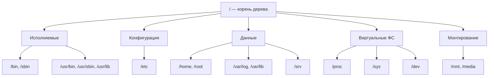

# Администрирование Linux-систем

<div class="article-tags">
  <span class="tag tag-required">ОБЯЗАТЕЛЬНО</span>
  <span class="tag tag-beginner">ДЛЯ НОВИЧКОВ</span>
</div>

<span class="complexity-badge">Разработчику</span>
<span class="complexity-badge">Архитектору</span>
<span class="complexity-badge">Инженеру</span>

---

## Работа с Linux

Linux - экосистема, объединяющая ядро, инструменты, философию проектирования и сообщество разработчиков. В контексте системной инженерии, разработки и эксплуатации современных сервисов Linux — основа инфраструктуры: от встраиваемых устройств до кластеров высокой доступности. 

Linux включает в себя ядро, среду рабочего стола, пакетный менеджер, предуставленное ПО.

Официальный сайт с документацией по ядру - https://www.kernel.org/

В Lunix, "bash" – это командный интерпретатор, а gcc - компилятор. Почти всё остальное - определённые программы, которые можно вызвать через командную строку, используя тот самый bash.

---

### История и терминология

Современный Linux берёт начало в традициях, заложенных ещё в 1969 году в Bell Labs — с появлением Unix. Unix задал стандарты, которые сохранили актуальность до сих пор:  
- единое древовидное пространство имён для файлов и устройств;  
- "всё — файл" как фундаментальный принцип;  
- модульность и композиция через потоки данных;  
- скриптовая автоматизация как естественный способ управления системой.

В 1983 году Ричард Столлман начал проект GNU — попытку создать полностью свободную Unix-подобную ОС. К середине 1990-х GNU уже имел компилятор (GCC), библиотеки (glibc), утилиты (coreutils: `ls`, `cp`, `grep` и пр.), интерпретаторы, даже графическую среду (X11), — но **не хватало ядра**.  

В 1991 году Линус Торвальдс представил на публику свой экспериментальный монолитный многозадачный Unix-клон для i386 — **Linux Kernel**. Он не входил в состав GNU, но быстро был объединён с инструментами GNU — и возникла **GNU/Linux-система**.  

Сегодня термин *Linux* употребляется в двух смыслах:  
1. **Ядро Linux** — программный компонент уровня 0, напрямую взаимодействующий с оборудованием: управляет процессорами, памятью, устройствами ввода-вывода, планирует процессы, обеспечивает многопользовательский режим. Официальный репозиторий ядра и его документация размещены на [kernel.org](https://www.kernel.org/).  
2. **Операционная система Linux** — полный дистрибутив: ядро + пользовательское пространство (GNU coreutils, systemd, драйверы, библиотеки, графические среды, приложения).

Важно различать: когда речь идёт о поведении конкретной команды `cp` — мы говорим о GNU coreutils; когда о работе планировщика задач — о ядре Linux; когда о сборке системы в целом — о дистрибутиве.

---

### Дистрибутивы

Дистрибутив — это **сборка** компонентов (ядра, инструментов, библиотек, приложений), объединённая пакетным менеджером, политикой обновлений и философией сопровождения. Различия между дистрибутивами выходят далеко за рамки набора предустановленного ПО — они затрагивают:  
- модель управления пакетами и зависимостями;  
- политику стабильности (стабильные релизы vs rolling release);  
- настройки безопасности по умолчанию;  
- сопровождение жизненного цикла (LTS vs кратковременные релизы);  
- культуру сообщества и корпоративную поддержку.

Рассмотрим ключевые семейства.

---

#### Debian и производные (Ubuntu, Linux Mint, Kali, Astra Linux, ОС "ЭЛАЙ")

Debian — проект, управляемый сообществом, с чётко определёнными стадиями разработки: `unstable` (sid), `Тестирование`, `stable`. Его отличает строгая проверка пакетов, консервативность в обновлениях и неукоснительное соблюдение DFSG (Debian Free Software Guidelines). Пакетная база строится на формате `.deb` и инструментах `dpkg`/`apt`.

Ubuntu — коммерчески поддерживаемый форк Debian от Canonical. Он берёт пакетную базу из `unstable`/`Тестирование`, дополняет собственными патчами, обеспечивает регулярные релизы (каждые 6 месяцев) и LTS-версии (поддержка 5 лет). Ubuntu ввела ряд практик, ставших стандартом де-факто: отключённый root, активное использование `sudo`, интеграция Snap. Именно Ubuntu легла в основу Mint, Pop!_OS, Zorin, а также российских защищённых систем: Astra Linux и ОС "ЭЛАЙ" наследуют от неё пакетную систему APT и многие системные решения (например, `systemd` как init-система, `NetworkManager` как сетевой менеджер).

---

#### Red Hat и производные (Fedora, RHEL, CentOS Stream, openSUSE в части инструментов)

Red Hat Enterprise Linux (RHEL) — коммерческая серверная ОС с долгосрочной поддержкой и гарантией стабильности. Её upstream — Fedora — служит экспериментальной площадкой для новых технологий (Wayland, PipeWire, `dnf5`, `podman`). Пакеты в RHEL-семействе используют формат `.rpm` и пакетные менеджеры `yum` (устаревший), `dnf` (современный). Важной особенностью является **SELinux** — механизм принудительного контроля доступа, включённый по умолчанию и требующий осознанного управления.

openSUSE, хотя и использует `.rpm`, представляет независимую ветвь развития: у него собственный пакетный менеджер `zypper`, собственный пакетный билд-сервис (OBS), и два релизных канала: Leap (стабильный, синхронизированный с SLE) и Tumbleweed (rolling release с автоматическим тестированием).

---

#### Arch и производные (Manjaro)

Arch Linux — воплощение принципа *do-it-yourself*. Минимальная установка даёт лишь ядро, базовые утилиты и пакетный менеджер `pacman`. Всё остальное — от драйверов до рабочего стола — пользователь собирает самостоятельно. Arch следует философии "rolling release": обновления поступают сразу после стабилизации, без привязки к версиям дистрибутива. Пакеты собираются из исходных кодов по рецепту — `PKGBUILD`, хранящимуся в AUR (Arch User Repository). Manjaro берёт Arch за основу, но добавляет тестирование обновлений, преднастроенные среды и упрощённый установщик — делая Arch-подход доступнее.

---

#### Другие линейки

- **ALT Linux** — российский дистрибутив с собственным пакетным деревом *Sisyphus*, использующим `.rpm`, но со своим фронтендом (`apt-rpm`, `urpmi`). Имеет версии для образования, серверов, рабочих станций, включая специализированные сборки (например, "Школьный сервер").
- **SteamOS** — узкоспециализированная сборка на базе Debian, ориентированная на запуск игр. Под капотом — стандартный Linux-стек: ядро, `systemd`, `apt`, Mesa, Proton для совместимости с Windows-играми.
- **FreeBSD** — отдельная Unix-подобная ветвь (не Linux): ядро и базовая система проекта FreeBSD, прикладное ПО — через **ports** и **pkg**. Серверные сценарии здесь встречаются чаще десктопа; при этом окружения вроде **KDE 2** в 2000-х собирали из портов как обычный пакет, без "секретного патча". Поэтому ироничная фраза **"как пропатчить KDE2 под FreeBSD?"** стала маркером раздутой сложности, а не реального барьера в админской практике. Культурный контекст — в [Основах интернет-культуры](/encyclopedia/9-spinoff/9-10-internet-kultura/1).

Выбор дистрибутива — **техническое решение**, зависящее от задачи:  
- серверная инфраструктура — RHEL/CentOS Stream, Debian stable;  
- разработка и CI/CD — Ubuntu LTS, Fedora;  
- обучение и домашнее использование — Linux Mint, Zorin;  
- безопасные среды — Astra Linux, ОС "ЭЛАЙ";  
- максимальная гибкость и контроль — Arch, Gentoo.

### В рунет-дискурсе

**Linux** в форумах и чатах — и серьёзная серверная ОС, и объект "войн дистрибутивов". Ярлык [линуксоид](/glossary/Л#линуксоид) описывает фанатичный тон в споре, а не профессию администратора. Отсылка **"как пропатчить KDE2 под FreeBSD?"** — про рутину сборки портов, а не про магию (см. абзац про FreeBSD выше). **GNOME, KDE, Wayland** — [96 — рабочие столы](./96).

**Android** для инфраструктурного админа — это в первую очередь **ядро Linux** в мобильных устройствах: AOSP, обновления OEM, `adb` для диагностики. В быту "андроид" часто смешивают с брендом телефона и магазином приложений; в мемах — с фрагментацией версий и формулой "всё гуглит". Справочник команд — [Android](/encyclopedia/2-system-network/2-01-operatsionnaya-sistema/81#в-рунет-дискурсе); указатели — [Неолурк (Linux)](https://neolurk.org/wiki/Linux), [Android](https://neolurk.org/wiki/Android), [Google](https://neolurk.org/wiki/Google).

**GNOME** и **KDE** в спорах "какой рабочий стол лучше" — часть "войн дистрибутивов", а не отдельная профессия. В админстве важнее политика обновлений, Wayland/X11 и поддержка железа. Формула "пропатчить KDE2 под FreeBSD" — [интернет-культура](/encyclopedia/9-spinoff/9-10-internet-kultura/1), [131](/encyclopedia/9-spinoff/9-10-internet-kultura/131). Указатель — [Неолурк (GNOME)](https://neolurk.org/wiki/GNOME).

---

### Установка Linux

Установка Linux начинается с выбора образа дистрибутива (обычно `.iso`). Современные дистрибутивы предоставляют **Live-систему** — полностью работоспособную ОС, запускаемую без установки на диск. Это позволяет:  
- проверить совместимость оборудования (видео, Wi-Fi, звук);  
- провести предустановочную диагностику;  
- сохранить данные с неисправного диска;  
- выполнить установку с "чистого листа".

Создание загрузочного носителя осуществляется через инструменты вроде `Rufus` (Windows), `balenaEtcher` (кроссплатформенно) или `dd` (в Unix-среде):
```bash
sudo dd if=ubuntu-24.04.iso of=/dev/sdX bs=4M status=progress oflag=sync
```
> ⚠️ Важно: `of=` должен указывать на **устройство**, а не на раздел (например, `/dev/sdb`, а не `/dev/sdb1`). Ошибка приведёт к перезаписи диска.

На этапе загрузки BIOS/UEFI управление передаётся загрузчику — чаще всего **GRUB 2** (Grand Unified Bootloader). GRUB загружает ядро и начальный RAM-диск (`initramfs`), который содержит драйверы для доступа к корневой файловой системе.

---

#### Разметка диска

Линукс не требует жёсткой привязки к "дискам C:, D:" — вместо этого применяется концепция **точек монтирования** в едином иерархическом дереве. Разметка может быть выполнена как автоматически (рекомендуется новичкам), так и вручную — для тонкой настройки.

Основные разделы и их назначение:

| Точка монтирования | Минимум | Рекомендуемо | Комментарий |
|-------------------|---------|---------------|-------------|
| `/boot`           | 500 МБ   | 1 ГБ          | Ядра, initramfs, конфиг GRUB. Обязателен при UEFI (иначе `/boot/efi`). |
| `/` (корень)      | 15 ГБ    | 20–50 ГБ      | System, `/usr`, `/etc`, `/var` (если не вынесены). |
| `swap`            | = объём RAM | 1–2×RAM (до 8 ГБ), затем =RAM | При гибернации — ≥ RAM. В SSD-эпоху часто заменяется `zram`. |
| `/home`           | — | всё оставшееся | Изоляция пользовательских данных — простейший способ сохранить их при переустановке. |
| `/var`            | — | 10–30 ГБ      | Логи, кэши, базы данных (если не в `/opt`). Вынос повышает отказоустойчивость. |
| `/tmp`            | — | tmpfs (в RAM) | Современные системы монтируют `/tmp` как tmpfs — быстрее и безопаснее. |


Типы таблиц разделов:  
- **MBR (Master Boot Record)** — устаревший, поддерживает до 4 первичных разделов, диски ≤ 2 ТБ.  
- **GPT (GUID Partition Table)** — современный стандарт, поддерживает до 128 разделов, диски > 2 ТБ, обязательна при UEFI.

После разметки производится **форматирование** — создание файловой системы на разделе. Наиболее распространённые:
- `ext4` — стандарт де-факто: стабильна, поддерживает journaling, ACL, extended attributes;
- `btrfs` — копируемый при записи (CoW), поддержка снапшотов, сжатие, RAID в файловой системе;
- `xfs` — оптимизирована под большие файлы и высокую пропускную способность (часто для `/var/lib/docker`);
- `vfat` — для `/boot/efi` (требование UEFI).

Установщик копирует файлы системы, настраивает загрузчик, создаёт учётные записи и завершает процесс. После перезагрузки система готова к работе.

---

### Терминал и командная оболочка

Графический интерфейс — лишь один из возможных способов взаимодействия. Фундамент Linux — **командная строка**. Она обеспечивает:  
- детальный контроль над системой;  
- воспроизводимость действий (через скрипты);  
- удалённое администрирование (SSH);  
- интеграцию в CI/CD-пайплайны.

---

#### Что такое shell?

Shell — **интерпретатор команд**, мост между пользователем и ядром. Он принимает текстовые команды, разбирает их, запускает соответствующие программы и управляет потоками ввода/вывода. Шелл — это **программа**, как и любая другая: её можно заменить, настроить, запускать вложенно.

Наиболее распространённые оболочки:
- **Bash (Bourne-Again SHell)** — стандарт по умолчанию в большинстве дистрибутивов. Расширяет оригинальный Bourne Shell (`sh`) переменными окружения, автодополнением, историей, псевдонимами. Скобки и конструкции скриптов — [напоминалка](/encyclopedia/2-system-network/2-05-terminal/11#napominalka-bash).
- **Zsh (Z Shell)** — надмножество Bash с продвинутой автодополнением (включая опции флагов), темами (например, через Oh My Zsh), расширенной настройкой подсказок.
- **Fish (Friendly Interactive SHell)** — ориентирована на удобство: подсветка синтаксиса в реальном времени, интерактивные подсказки, отсутствие непонятного синтаксиса ("для людей").
- **Dash** — минималистичная, быстрая оболочка, используемая в системных скриптах (`/bin/sh` в Debian/Ubuntu — это symlink на `dash` для производительности).

Пользователь может сменить оболочку:
```bash
chsh -s /bin/zsh
```

Каждый шелл загружает **конфигурационные файлы** при запуске:
- для интерактивного логина: `~/.bash_profile`, `~/.zprofile`;
- для интерактивного не-логина (например, терминал в GUI): `~/.bashrc`, `~/.zshrc`;
- для глобальных настроек: `/etc/profile`, `/etc/bash.bashrc`.

Эти файлы задают переменные окружения (`PATH`, `LANG`), псевдонимы (`alias ll='ls -lh'`), функции, автодополнение.

---

#### Первые команды

Любая работа начинается с понимания *где вы находитесь* и *что вокруг*.

- `whoami` — имя текущего пользователя  
- `pwd` — *print working directory*: путь к текущей директории  
- `ls` — *list*: показать содержимое каталога  
  - `ls -l` — подробный формат (права, владелец, размер, дата)  
  - `ls -a` — включая скрытые файлы (начинаются с `.`)  
  - `ls -lh` — размеры в человекочитаемом виде (K, M, G)

- `cd` — *change directory*: перейти в другую директорию  
  - `cd ~` — домашний каталог (`/home/username`)  
  - `cd ..` — на уровень выше  
  - `cd -` — вернуться в предыдущую директорию  
  - `cd` (без аргументов) — в домашний каталог

- `man команда` — открыть руководство (manual page) по команде  
- `whatis команда` — краткое описание  
- `which команда` — путь к исполняемому файлу  
- `type команда` — где и как реализована команда (встроенная, alias, внешняя программа)

<div class="callout callout--tip">
  <div class="callout-title">Напоминалка по командам</div>

  <div class="callout-body">
  <p>Таблицы по файлам, сети, процессам, правам, пакетам и справке — в <a href="/encyclopedia/2-system-network/2-05-terminal/101#napominalka">справочнике «Основные команды в Linux»</a> (каталоги — <a href="/encyclopedia/2-system-network/2-05-terminal/101#fhs-katalogi">блок FHS</a>); ниже в этой статье — разбор FHS, конвейеры и углублённая практика.</p>
</div>
  </div>


---

<span id="fhs-napominalka"></span>

### Иерархия файловой системы

Структура `/` регламентирована **Filesystem Hierarchy Standard (FHS)**. Программы и администраторы опираются на соглашение: конфиги в `/etc`, изменяемые данные в `/var`, личные файлы в `/home`.

От корня `/` расходятся ветви с разными ролями. **Исполняемые файлы** — в `/bin`, `/sbin` и в дереве `/usr` (основная масса пакетов дистрибутива). **Конфигурации**, управляющие поведением системы и служб, — в `/etc` (текстовые файлы, часто с именем службы в пути: `/etc/nginx/nginx.conf`). **Пользовательские данные** — в `/home`; у root свой домашний каталог `/root`, не путать с корнем файловой системы `/`. **Изменяемые данные** служб — в `/var` (логи, очереди, состояние БД). **Виртуальные каталоги** `/proc`, `/sys`, `/dev` отражают процессы, железо и устройства, а не обычные файлы на диске. **Точки монтирования** — `/mnt` и `/media`; **данные сетевых сервисов** по классической схеме — в `/srv`.



<div class="callout callout--tip">
  <div class="callout-title">Напоминалка — куда смотреть в первую очередь</div>

  <div class="callout-body">
  <ul>
  <li><code>/etc</code> — системные конфигурации (<code>nginx</code>, <code>ssh</code>, <code>fstab</code>); правки обычно требуют root.</li>
  <li><code>/var</code> — логи (<code>/var/log</code>), кэши, очереди, данные служб (<code>/var/lib</code>).</li>
  <li><code>/home</code> — домашние каталоги пользователей; настройки в скрытых файлах (<code>~/.bashrc</code>).</li>
  <li><code>/usr</code> — большинство установленных программ и библиотек; <code>/opt</code> — отдельные пакеты «в стороне» от дистрибутива.</li>
  </ul>
  <p>Компактная таблица всех корневых каталогов — в <a href="/encyclopedia/2-system-network/2-05-terminal/101#fhs-katalogi">справочнике команд Linux</a>.</p>
</div>
  </div>

| Каталог | Назначение | Особенности |
|--------|------------|-------------|
| `/` | Корень — начало всего дерева | В корне лежат только каталоги, не «случайные» файлы |
| `/boot` | Загрузчик и файлы ядра | `vmlinuz`, `initramfs`, конфиг GRUB; при UEFI часто рядом `/boot/efi` |
| `/bin` | Базовые исполняемые файлы | `ls`, `cp`, `bash` — нужны даже в однопользовательском режиме |
| `/sbin` | Системные исполняемые файлы | `fdisk`, `ip`, `reboot` — чаще для администратора |
| `/lib`, `/lib64` | Библиотеки для `/bin` и `/sbin` | `/lib64` — 64-битные shared libraries на x86_64 |
| `/usr` | Unix System Resources | `/usr/bin`, `/usr/lib` — основная масса ПО и библиотек |
| `/etc` | Конфигурационные файлы | Текстовые; путь часто совпадает с именем службы (`/etc/nginx/nginx.conf`) |
| `/var` | Переменные данные | Логи (`/var/log`), кэши (`/var/cache`), состояние служб (`/var/lib`) |
| `/tmp` | Временные файлы | Часто очищается при перезагрузке; на серверах иногда монтируют как tmpfs |
| `/run` | Данные текущей загрузки | PID-файлы, сокеты; очищается при выключении |
| `/home` | Домашние каталоги пользователей | `/home/timur` — личные проекты и настройки |
| `/root` | Домашний каталог root | Отдельно от `/home` |
| `/dev` | Устройства как файлы | `/dev/sda`, `/dev/null` |
| `/proc` | Виртуальная ФС — процессы и ядро | `/proc/cpuinfo`, `/proc/1/` |
| `/sys` | Виртуальная ФС — железо и драйверы | `/sys/class/net/`, `/sys/block/` |
| `/media` | Точки монтирования съёмных носителей | USB-диски, оптические приводы |
| `/mnt` | Временная точка монтирования | Администратор вешает раздел или сетевой ресурс вручную |
| `/srv` | Данные, отдаваемые службами | Каталоги веб-сервера, FTP, git-зеркала; на части дистрибутивов роль берёт на себя `/var/www` |
| `/opt` | Стороннее ПО вне пакетного менеджера | Проприетарные SDK, крупные стеки «одной папкой» |

#### Дерево `/usr` и `/var`

Каталог `/usr` (Unix System Resources) хранит **переносимые, в основном read-only** программы и данные дистрибутива. В корне `/bin` и `/sbin` часто остаются минимум команд, нужных до монтирования полного `/usr` или в аварийном режиме; на современных дистрибутивах многие имена в `/bin` — символические ссылки в `/usr/bin`.

| Путь | Содержимое |
|------|------------|
| `/usr/bin` | Пользовательские команды из пакетов |
| `/usr/sbin` | Системные команды из пакетов |
| `/usr/lib` | Shared libraries для `/usr/bin` |
| `/usr/local` | Софт, установленный вручную (`make install`, собственные бинарники) |
| `/usr/share` | Документация, man-страницы, иконки, шрифты, локали |

Каталог `/var` — **переменные** данные: то, что растёт и меняется при работе системы.

| Путь | Содержимое |
|------|------------|
| `/var/log` | Текстовые журналы (`syslog`, `auth.log`, логи приложений) |
| `/var/lib` | Состояние служб (PostgreSQL, Docker, списки пакетов) |
| `/var/cache` | Кэши пакетного менеджера и приложений |
| `/var/tmp` | Временные файлы с более длинным сроком жизни, чем в `/tmp` |
| `/var/lock` | Файлы блокировок (один экземпляр службы или задачи) |

<div class="callout callout--info">
  <div class="callout-title">Монтирование вместо «диска C:»</div>

  <div class="callout-body">
  <p>В Windows буква диска (<code>C:</code>) — это устройство. В Linux раздел или NAS монтируют <strong>в каталог</strong> дерева: <code>/home</code> на SSD, <code>/var/log</code> на HDD, <code>/tmp</code> в RAM (tmpfs). Список точек монтирования — <code>findmnt</code> или <code>/proc/mounts</code>; постоянные — в <code>/etc/fstab</code>.</p>
</div>
  </div>

Абсолютный путь начинается с `/` (`/home/timur/docs`), относительный — от текущей директории (`docs/report.md`). Текущая директория обозначается `.` (редко используется явно), родительская — `..`.

Скрытые файлы и каталоги начинаются с точки: `.bashrc`, `.ssh/`. Именно там хранятся настройки программ — это **конфигурация пользователя**.

---

### Права доступа и управление пользователями

Linux — многопользовательская система. Каждый процесс запускается **от имени пользователя**, каждому файлу принадлежит **владелец и группа**, и для каждого определены **права доступа**.

---

#### Владельцы и группы

- Каждый файл имеет:  
  - **владельца** (user)  
  - **группу** (group)  
  - **других** (others)

- Права на чтение (`r`), запись (`w`), выполнение (`x`) задаются независимо для каждой категории.

Пример вывода `ls -l`:
```text
-rw-r--r-- 1 timur users 1024 May 10 12:30 file.txt
```
- `-` — тип файла (`-` = обычный, `d` = директория, `l` = ссылка)  
- `rw-` — владелец (timur): чтение+запись  
- `r--` — группа (users): только чтение  
- `r--` — остальные: только чтение

Для директорий смысл прав иной:  
- `r` — можно получить список содержимого (`ls`)  
- `w` — можно создавать/удалять файлы **внутри** (но не переименовывать саму директорию)  
- `x` — можно *войти* в директорию (`cd`) и получить доступ к файлам внутри (даже без `r`)

---

<span id="linux-prava-rwx"></span>

#### rwx, восьмеричный код и расчёт прав

После символа типа файла в `ls -l` идут **девять символов** — три тройки подряд: **владелец** (user), **группа** (group), **остальные** (others). Пример `rwxrw-r-x`:

| Категория | Символы | Смысл |
| :--- | :--- | :--- |
| владелец | `rwx` | чтение, запись, выполнение |
| группа | `rw-` | чтение и запись |
| остальные | `r-x` | чтение и выполнение |

Каждая буква в тройке — отдельный бит. Веса при подсчёте восьмеричной цифры:

| Символ | Право | Значение |
| :--- | :--- | :--- |
| `r` | чтение (read) | 4 |
| `w` | запись (write) | 2 |
| `x` | выполнение (execute) | 1 |
| `-` | нет права | 0 |

Сумма трёх бит даёт **одну цифру** от 0 до 7. Три цифры подряд — полный режим, который передают в `chmod` (например, `chmod 765 file`).

| Двоично | Восьмерично | Строка | Права |
| :--- | :--- | :--- | :--- |
| `000` | 0 | `---` | нет |
| `001` | 1 | `--x` | выполнение |
| `010` | 2 | `-w-` | запись |
| `011` | 3 | `-wx` | запись + выполнение |
| `100` | 4 | `r--` | чтение |
| `101` | 5 | `r-x` | чтение + выполнение |
| `110` | 6 | `rw-` | чтение + запись |
| `111` | 7 | `rwx` | чтение + запись + выполнение |

**Расчёт** для `rwxrw-r-x`:

- владелец `rwx` — 4 + 2 + 1 = **7**;
- группа `rw-` — 4 + 2 + 0 = **6**;
- остальные `r-x` — 4 + 0 + 1 = **5**.

Итого режим **765** — те же права, что и в символьной строке.

<div class="callout callout--tip">
  <div class="callout-title">Частые режимы</div>
  <div class="callout-body">
  <p><code>644</code> — обычный файл: владелец читает и пишет, остальные только читают. <code>755</code> — скрипт или каталог, куда могут зайти все. <code>600</code> — приватный ключ SSH. <code>700</code> — каталог <code>~/.ssh</code>. Для статики веб-сервера часто хватает <code>755</code> на каталоги и <code>644</code> на файлы.</p>
</div>
</div>

Символьная форма `chmod` удобна, когда нужно **добавить или снять** бит без пересчёта всей маски. Префиксы: `u` — владелец, `g` — группа, `o` — остальные, `a` — все сразу; `+` и `-` включают или отключают право (`chmod u+x script.sh`, `chmod go-w secret.txt`).

---

#### Изменение прав и владельцев

```bash
chown user:group file
chmod 644 file          # rw-r--r--
chmod 765 file          # rwxrw-r-x
chmod u+x script.sh     # добавить x владельцу
chmod g+w dir/          # добавить w группе
chmod o-r private.key   # убрать чтение у «остальных»
```

Проверка после изменения — снова `ls -l`. Для рекурсивной смены прав на дерево каталогов используют `chmod -R`, но на продакшене это рискованно: одна опечатка в цифре откроет или закроет доступ сразу многим файлам.

---

#### Учётные записи и администрирование

Пользователи и группы определяются в:
- `/etc/passwd` — имена, UID, домашние каталоги, оболочки  
- `/etc/group` — группы и их члены  
- `/etc/shadow` — хэши паролей (только root)

Управление:

```bash
useradd -m deploy
passwd deploy
userdel deploy
groupadd developers
usermod -aG developers deploy
```

---

#### sudo и принцип минимальных привилегий

Прямой вход под `root` считается небезопасным. Вместо этого используется `sudo` — *substitute user do*. Он позволяет выполнять отдельные команды с правами другого пользователя (по умолчанию — root), при этом:  
- действия логируются (`/var/log/auth.log`);  
- можно тонко настраивать права в `/etc/sudoers` (только через `visudo`);  
- временный доступ — не постоянная сессия.

```bash
sudo visudo
sudo -l
sudo systemctl reload sshd
```

---

### Работа с текстом и потоками

В основе Unix-подхода лежит идея:  
> **"Пишите программы, которые делают одно и делают это хорошо. Пишите программы, чтобы они работали вместе. Пишите программы, которые обрабатывают текстовые потоки, потому что это универсальный интерфейс"**  
— Дуг Макилрой, автор конвейеров (`|`)

Эта философия определяет, как устроены повседневные операции в Linux: команды не хранят состояние, не общаются через сложные API — они **читают из stdin, пишут в stdout/stderr**, и могут быть соединены в цепочки.

---

#### Стандартные потоки

Каждый процесс при запуске получает три открытых дескриптора:

| Дескриптор | Имя | Назначение | По умолчанию связан с |
|-----------|-----|------------|------------------------|
| `0` | `stdin` | стандартный ввод | клавиатура (терминал) |
| `1` | `stdout` | стандартный вывод | терминал |
| `2` | `stderr` | стандартный поток ошибок | терминал |

Эти потоки можно **перенаправлять** независимо:

- `>` — перезаписать файл stdout:  
```bash
  ls > file.list
```
- `&gt;&gt;` — дописать в файл stdout:  
```bash
  echo "new line" >> file.list
```
- `2>` — перенаправить stderr:  
```bash
  ls /nonexistent 2> error.log
```
- `&>` или `> file 2>&1` — перенаправить **и stdout, и stderr** в один файл:  
```bash
  make &> build.log
```

- `<` — подать файл на вход (stdin):  
```bash
  sort < unsorted.txt
```

- `|` — **конвейер (pipeline)**: stdout одной команды → stdin следующей:  
```bash
  ps aux | grep nginx | wc -l
```

Конвейеры позволяют строить сложные преобразования без промежуточных файлов — данные обрабатываются *на лету*, в памяти.

---

### Ключевые утилиты для работы с текстом

#### `cat`, `less`, `head`, `tail` — просмотр содержимого

- `cat file` — вывести файл целиком (от *concatenate* — изначально для объединения файлов)  
```bash
  cat file1 file2 > combined
```

- `less file` — постраничный просмотр с навигацией (`q` — выход, `/pattern` — поиск, `G` — конец)  
  Предпочтительнее `more` — поддерживает прокрутку вверх.

- `head -n 10 file` — первые 10 строк  
- `tail -n 10 file` — последние 10 строк  
- `tail -f /var/log/syslog` — *follow*: динамический вывод новых строк по мере записи (незаменимо для логов)

---

#### `grep` — поиск по шаблону

`grep` (*global regular expression print*) — фильтр по регулярным выражениям.

Основные варианты:
- `grep "error" /var/log/syslog` — строки с "error"  
- `grep -i "warning" file` — без учёта регистра  
- `grep -v "debug" file` — инверсия: всё, *кроме* строк с "debug"  
- `grep -r "TODO" /src` — рекурсивный поиск во всех файлах каталога `/src`  
- `grep -n "main" script.py` — с номерами строк  
- `grep -E "timeout|fail" log` — расширенные регулярные выражения (аналог `egrep`)

> 💡 Совет: `grep` часто используется в начале или середине конвейера:  
> ```bash
> journalctl -u nginx | grep -i "failed\|denied" | tail -20
> ```

---

#### `cut`, `tr`, `sort`, `uniq`, `wc` — преобразование и анализ

- `cut -d':' -f1 /etc/passwd` — вырезать 1-е поле, разделитель — `:` (список имён пользователей)  
- `tr 'a-z' 'A-Z' < file` — преобразовать строчные буквы в заглавные (`tr` = translate)  
- `sort file` — сортировка строк (лексикографическая, но поддерживает `-n`, `-h`, `-V`)  
- `sort file | uniq` — удалить *последовательные* дубликаты  
  - `uniq -c` — подсчёт повторов  
  - `sort file | uniq -u` — только уникальные (встречающиеся один раз)  
  - `sort file | uniq -d` — только дубликаты  
- `wc -l file` — количество строк  
  - `wc -w` — слов  
  - `wc -c` — байт  
  - `wc -m` — символов (с учётом UTF-8)

Пример: подсчёт самых частых команд в истории:
```bash
history | cut -d' ' -f3- | sort | uniq -c | sort -nr | head -10
```

---

#### `diff` и `patch` — сравнение и применение изменений

- `diff file1 file2` — построчное сравнение  
  - `diff -u file1 file2` — унифицированный формат (удобен для патчей)  
  - `diff -r dir1 dir2` — рекурсивное сравнение каталогов

- `patch < changes.diff` — применить изменения из файла патча  
  Используется в разработке, CI/CD, обновлении конфигов.

---

### Работа с файлами и каталогами

#### Файловые иноды — "паспорт" файла

В Linux файл — это **инод (inode)** — структура данных в файловой системе, содержащая:  
- права доступа, владельца, временные метки (mtime, atime, ctime);  
- размер;  
- указатели на блоки данных (прямые, косвенные);  
- счётчик ссылок.

Имя файла — это лишь **запись в каталоге**, связывающая имя с номером инода. Один и тот же инод может иметь несколько имён — отсюда и понятие *жёстких ссылок*.

Проверить инод:
```bash
ls -i file.txt
# 123456 file.txt

stat file.txt
# выводит подробную информацию, включая Inode — 123456
```

---

#### Символические и жёсткие ссылки

| Характеристика | Жёсткая ссылка (`ln`) | Символическая ссылка (`ln -s`) |
|----------------|------------------------|-------------------------------|
| Создаётся | `ln target linkname` | `ln -s target linkname` |
| Что хранит | прямой указатель на инод | текстовый путь к файлу |
| Может ссылаться на каталог? | ❌ (только в особых ФС) | ✅ |
| Переживает удаление оригинала? | ✅ (пока остаётся ≥1 ссылка) | ❌ (становится "битой") |
| Работает через границы ФС? | ❌ | ✅ |
| Поведение при `ls -l` | выглядит как обычный файл | помечена как `link → target` |

Пример:
```bash
touch original.txt
ln original.txt hardlink
ln -s original.txt symlink

ls -li
# 123456 -rw-r--r-- 2 timur users 0 May 17 10:00 original.txt
# 123456 -rw-r--r-- 2 timur users 0 May 17 10:00 hardlink
# 789012 lrwxrwxrwx 1 timur users 12 May 17 10:00 symlink → original.txt
```
Обратите внимание: у `original.txt` и `hardlink` — **один и тот же инод** и счётчик ссылок = 2.

---

### Редакторы

#### `nano` — минималистичный, дружелюбный

Запуск:
```bash
nano file.txt
```

Управление отображается внизу:  
- `^O` — запись (Ctrl+O)  
- `^X` — выход  
- `^K` — вырезать строку  
- `^U` — вставить  
- `^W` — поиск  

Подходит для быстрого редактирования конфигов без обучения.

---

#### `vim` — мощный, модальный, неизменный стандарт

Vim работает в **режимах**:  
- *Normal* (по умолчанию) — навигация и команды  
- *Insert* (`i`, `a`, `o`) — ввод текста  
- *Visual* (`v`, `V`, `Ctrl+v`) — выделение  
- *Command-line* (`:`) — выполнение команд (`:w`, `:q`, `:wq`, `:q!`, `:set nu`)

Основные команды в Normal-режиме:
- `h j k l` — ← ↓ ↑ →  
- `w` / `b` — вперёд/назад по словам  
- `0` / `$` — начало/конец строки  
- `dd` — удалить строку  
- `yy` — скопировать строку  
- `p` — вставить после курсора  
- `/pattern` — поиск вперёд  
- `n` / `N` — следующее/предыдущее совпадение

Vim имеет встроенный учебник:  
```bash
vimtutor
```

> 🔔 Для разработчиков: `vim` — **платформа**. Через плагины (`vim-plug`, `coc.nvim`) он превращается в полноценную IDE с автодополнением, LSP, отладкой.

---

### Архивация и сжатие

Архивация (`tar`) и сжатие (`gzip`, `bzip2`, `xz`) — раздельные этапы.

---

#### `tar` — Tape ARchive

Создание архива:
```bash
tar -cf archive.tar dir/          # без сжатия
tar -czf archive.tar.gz dir/      # gzip
tar -cjf archive.tar.bz2 dir/     # bzip2
tar -cJf archive.tar.xz dir/      # xz (лучшее сжатие, медленнее)
```

Распаковка:
```bash
tar -xf archive.tar
tar -xzf archive.tar.gz
tar -xJf archive.tar.xz
```

Просмотр содержимого:
```bash
tar -tf archive.tar.gz
```

---

#### Сравнение алгоритмов сжатия

| Алгоритм | Скорость сжатия | Скорость распаковки | Степень сжатия | Расширение |
|---------|------------------|---------------------|----------------|------------|
| `gzip`  | высокая          | высокая             | средняя        | `.gz` |
| `bzip2` | низкая           | средняя             | хорошая        | `.bz2` |
| `xz`    | очень низкая     | средняя             | отличная       | `.xz` |

Для повседневного использования — `gzip`. Для резервных копий — `xz`. Для скорости — `zstd` (новый, не во всех дистрибутивах по умолчанию).

---

### Планировщик задач

Автоматизация через **планировщики** — основа бесперебойной работы серверов.

---

#### `cron`

Планировщик **cron** запускает команды по расписанию. Полная шпаргалка (поля, операторы, алиасы `@daily` / `@weekly`, команды `crontab`) — в статье [Планирование и автоматизация задач](/encyclopedia/2-system-network/2-06-sistemnoe-administrirovanie/8).

Каждый пользователь имеет свою таблицу (`crontab`):

```bash
crontab -e   # открыть редактор
crontab -l   # показать текущие задачи
crontab -r   # удалить crontab (осторожно)
```

Формат строки — пять полей времени и команда:

```
# ┌───────────── мин (0–59)
# │ ┌──────────── час (0–23)
# │ │ ┌──────────── день месяца (1–31)
# │ │ │ ┌──────────── месяц (1–12)
# │ │ │ │ ┌──────────── день недели (0–6, 0=воскресенье)
# │ │ │ │ │
# * * * * * команда_к_выполнению
```

Операторы: `*` (любое значение), `,` (список), `-` (диапазон), `/` (шаг, например `*/5` — каждые 5 единиц поля).

Примеры:

```cron
# Каждые 5 минут
*/5 * * * * /home/timur/scripts/check_disk.sh

# Ежедневно в полночь (то же, что @daily)
0 0 * * * /usr/bin/backup.sh

# Ежедневно в 2:30 ночи
30 2 * * * /usr/bin/backup.sh

# По понедельникам в 9 утра
0 9 * * 1 /usr/bin/update_mirror.sh

# Каждые 6 часов
0 */6 * * * /usr/bin/sync.sh

# При старте cron после перезагрузки
@reboot /home/timur/startup.sh
```

<div class="callout callout--warning">
  <div class="callout-title">Окружение cron</div>
  В cron минимальное окружение: <code>PATH</code>, <code>HOME</code> и переменные могут отличаться от интерактивной сессии. Используйте абсолютные пути; при необходимости задайте <code>PATH</code> в начале crontab:

  ```cron
  PATH=/usr/local/sbin:/usr/local/bin:/sbin:/bin:/usr/sbin:/usr/bin
  ```
</div>

---

#### `systemd.timer`

Более гибкая и интегрированная с `journalctl` система. Таймеры управляются как сервисы:
```bash
systemctl list-timers --all
systemctl start myjob.timer
```

Преимущества:  
- запуск с задержкой после загрузки (`OnBootSec=`);  
- запуск относительно последнего успешного выполнения (`OnUnitActiveSec=`);  
- случайное дребезг-смещение (`RandomizedDelaySec=`);  
- логирование через `journalctl -u myjob.service`.

---

### Сеть в Linux

В Linux сетевой стек интегрирован в ядро и управляется через унифицированные интерфейсы: виртуальные файловые системы (`/proc/net`, `/sys/class/net`), утилиты из `iproute2`, и, всё чаще, через `systemd-networkd` или `NetworkManager`. Уход от устаревших инструментов (`ifconfig`, `netstat`, `route`) к современным (`ip`, `ss`, `nft`) — необходимость: только новые инструменты отражают полную модель сетевой подсистемы ядра.

---

#### Управление интерфейсами

Пакет `iproute2` заменил `net-tools` более чем двадцать лет назад. Основная команда — `ip` — объединяет функции `ifconfig`, `route`, `arp`.

- **Список интерфейсов и адресов**:  
```bash
  ip addr show
  # или сокращённо:
  ip a
```
  Вывод включает:
  - имя интерфейса (`lo`, `eth0`, `wlan0`, `enp3s0`);
  - статус (`UP`, `DOWN`);
  - MAC-адрес (`link/ether`);
  - IPv4/IPv6-адреса (`inet`, `inet6`);
  - метрики, scope, временные метки.

- **Активация/деактивация интерфейса**:  
```bash
  sudo ip link set eth0 up
  sudo ip link set eth0 down
```

- **Назначение IP-адреса**:  
```bash
  sudo ip addr add 192.168.1.100/24 dev eth0
  sudo ip addr del 192.168.1.100/24 dev eth0
```

- **Маршрутизация**:  
```bash
  ip route show
  # default via 192.168.1.1 dev eth0 proto dhcp metric 100

  # добавить маршрут
  sudo ip route add 10.0.0.0/8 via 192.168.1.254
```

- **Просмотр соседей (ARP/NDP-таблица)**:  
```bash
  ip neigh show
```

> 💡 Совет: `ip -c a` включает цветовую подсветку — особенно полезно при анализе нескольких интерфейсов.

---

#### Диагностика соединения

На Windows те же задачи решают другими командами: `tracert` вместо `traceroute`, `pathping` вместо `mtr`, `ipconfig /all` вместо `ip addr`, `netstat -ano` вместо `ss -tulpn`, `nslookup` вместо `dig`. Сводная таблица Linux/macOS и Windows — в [Сетевых подключениях и диагностике](/encyclopedia/2-system-network/2-06-sistemnoe-administrirovanie/6#setevye-komandy-diagnostika).

- **Проверка доступности хоста**:  
```bash
  ping -c 4 8.8.8.8          # ICMP-эхо (уровень 3)
  ping6 -c 4 2001:4860:4860::8888
```

- **Проверка DNS-резолвинга** (не путать с `ping`!):  
```bash
  nslookup example.com
  dig example.com +short
  host example.com
  # или через systemd-resolved:
  resolvectl query example.com
```

- **Трассировка пути**:  
```bash
  traceroute example.com     # устаревший, использует UDP/ICMP
  tracepath example.com      # без root, использует UDP, автоопределение MTU
  mtr --report example.com   # комбинация ping + traceroute в реальном времени
```

- **Проверка открытых портов и сокетов**:  
  Утилита `ss` (*socket statistics*) заменяет `netstat` — быстрее, точнее, поддерживает все современные типы сокетов (TCP, UDP, UNIX, DCCP, SCTP).  
```bash
  ss -tuln                   # TCP/UDP, listening, numeric (без резолва имён)
  # -t: TCP, -u: UDP, -l: listening, -n: numeric

  ss -tulnp                  # + процессы (-p требует sudo)
  ss -i                      # статистика по сокетам (RTT, cwnd, rwnd)
```

  Пример вывода:
```text
  Netid  State    Recv-Q Send-Q Local Address:Port  Peer Address:Port
  tcp    LISTEN   0      128    127.0.0.1:631        *:*
  tcp    LISTEN   0      4096   *:80                 *:*
  tcp    LISTEN   0      4096   *:443                *:*
```

- **Проверка соединения на прикладном уровне**:  
```bash
  # HTTP:
  curl -I https://example.com
  # или без заголовков — только статус:
  curl -s -o /dev/null -w "%{http_code}\n" https://example.com

  # TLS:
  openssl s_client -connect example.com:443 -servername example.com </dev/null 2>/dev/null | openssl x509 -noout -dates

  # Порт:
  nc -zv example.com 22      # netcat
  telnet example.com 25      # если установлен
```

Синтаксис `curl` для API, заголовков и кодов ответа — [утилита curl](/encyclopedia/2-system-network/2-05-terminal/1133), [curl / fetch — примеры](/lab/Примеры/1133).

---

#### Брандмауэр

Современные дистрибутивы постепенно переходят на **`nftables`** — единый фреймворк, заменяющий `iptables`, `ip6tables`, `arptables`, `ebtables`. Преимущества:
- единый синтаксис для IPv4/IPv6/bridge;
- атомарные обновления правил;
- встроенная проверка синтаксиса;
- более эффективная обработка (меньше overhead в ядре).

Тем не менее, `iptables` остаётся повсеместно — и часто `iptables`-команды транслируются в `nftables` через совместимый слой.

**Базовое управление через `ufw` (Uncomplicated Firewall)** — фронтенд для `iptables`/`nft`:

```bash
sudo ufw status verbose     # текущее состояние
sudo ufw enable             # включить (автозапуск при загрузке)
sudo ufw allow 22/tcp       # разрешить SSH
sudo ufw allow from 192.168.1.0/24 to any port 80
sudo ufw delete allow 22    # удалить правило по номеру или шаблону
```

> ⚠️ В production-средах рекомендуется писать правила напрямую — либо в `nft`-скриптах (`/etc/nftables.conf`), либо через `iptables-save`/`nft list ruleset > rules.nft`. Это обеспечивает идемпотентность и возможность версионного контроля.

---

### Процессы

Процесс в Linux — экземпляр выполняемой программы с изолированным адресным пространством, дескрипторами, стеком и контекстом выполнения. Управление процессами — одна из центральных задач администратора.

---

#### Иерархия процессов и `systemd`

- **PID 1** — первая задача после загрузки ядра. Сейчас это почти всегда `systemd`. Он управляет:
  - запуском/остановкой сервисов;
  - сбором логов (`journald`);
  - монтированием ФС (`systemd-mount`);
  - управлением сеансами (`logind`).

- **Родительский процесс (PPID)** создаёт дочерний через `fork()` + `exec()`. При завершении родителя дочерние процессы "осиротевают" — и передаются под управление PID 1.

Просмотр дерева:
```bash
pstree -p                    # древовидное представление с PID
ps -ejH                      # иерархический вывод
systemd-cgls                 # по cgroup (современный способ)
```

---

#### Мониторинг — `ps`, `top`, `htop`, `glances`

- `ps aux` — моментальный снимок всех процессов:  
  - `a` — все терминалы,  
  - `u` — в формате пользователя,  
  - `x` — процессы без управляющего терминала (демоны).

  Ключевые столбцы:  
  - `USER`, `PID`, `%CPU`, `%MEM`, `VSZ` (виртуальная память), `RSS` (резидентная), `TTY`, `STAT` (статус: `S`=sleeping, `R`=running, `D`=uninterruptible sleep, `Z`=zombie), `COMMAND`.

- `top` — динамическое обновление. Управление:  
  - `P` — сортировка по CPU,  
  - `M` — по памяти,  
  - `k` — убить процесс,  
  - `r` — изменить nice-значение.

- `htop` — улучшенная версия `top` с поддержкой мыши, цветом, деревом, фильтрацией. Требует установки отдельно.

---

#### Управление — сигналы и приоритеты

- **Сигналы** — механизм межпроцессного взаимодействия. Основные:
  - `SIGTERM` (15) — "пожалуйста, завершись" (обрабатывается, позволяет корректно остановиться);
  - `SIGKILL` (9) — "немедленно умри" (не перехватывается, завершает без cleanup);
  - `SIGHUP` (1) — "перечитай конфиг" (многие демоны поддерживают reload);
  - `SIGSTOP` (19), `SIGCONT` (18) — приостановка/возобновление.

  Отправка:
```bash
  kill -TERM 1234
  kill -9 1234
  killall nginx               # по имени
  pkill -f "python.*server"  # по шаблону командной строки
```

- **Приоритеты (`nice`, `renice`)**  
  Значение `nice` от −20 (высший приоритет) до +19 (низший). По умолчанию — 0.

```bash
  nice -n 10 ./heavy_script.sh   # запустить с пониженным приоритетом
  renice -n 5 -p 1234            # повысить приоритет уже запущенного процесса
```

  > 🔔 Важно: обычный пользователь может только **понижать** приоритет (увеличивать `nice`). Повышать (`nice < 0`) — только root.

---

#### Продвинутая диагностика — `lsof`, `strace`, `perf`

Полный runbook по CPU, памяти, диску и сети на одном хосте — [Диагностика производительности Linux](./100.md).

- `lsof` (*list open files*) — показывает, какие файлы, сокеты, устройства открыты процессом:  
```bash
  lsof -p 1234                # по PID
  lsof -i :80                 # процессы, слушающие порт 80
  lsof /var/log/nginx         # кто использует каталог
```

- `strace` — трассировка системных вызовов:  
```bash
  strace -p 1234              # подключиться к работающему процессу
  strace -e openat,read,write ./app  # только выбранные вызовы
  strace -o trace.log ./app   # записать в файл
```
  Незаменимо при диагностике "почему не читает файл?", "куда пишет лог?", "почему завис?".

- `perf` — профилировщик ядра и пользовательского кода:  
```bash
  perf top                    # горячие функции в реальном времени
  perf record -g ./app        # записать стек вызовов
  perf report                 # визуализировать
```

---

### Пакетные менеджеры

Пакетный менеджер — **система управления зависимостями, версиями, конфигурацией и обновлениями**. Рассмотрим три основные реализации.

---

#### APT (Debian/Ubuntu)

Архитектура:
- репозитории → `Release`/`Packages.gz` → `apt update` → `/var/lib/apt/lists/` → `apt install`

Ключевые команды:
```bash
sudo apt update                     # обновить метаданные репозиториев
sudo apt upgrade                    # обновить установленные пакеты (без удаления)
sudo apt full-upgrade               # с возможным удалением/установкой (ранее `dist-upgrade`)
sudo apt install nginx
sudo apt remove nginx               # без конфигов
sudo apt purge nginx                # с конфигами
sudo apt autoremove                 # удалить неиспользуемые зависимости
```

Удержание версии (hold):
```bash
sudo apt-mark hold nginx
sudo apt-mark unhold nginx
```

Поиск:
```bash
apt search keyword
apt show nginx                      # детали пакета
apt list --installed | grep nginx   # установленные
```

---

#### DNF (Fedora/RHEL)

`dnf` — преемник `yum`, использует `libsolv` для решения зависимостей (быстрее, точнее).

```bash
sudo dnf update
sudo dnf install nginx
sudo dnf remove nginx
sudo dnf list installed
sudo dnf info nginx
sudo dnf history                    # журнал транзакций
sudo dnf history undo 42            # откатить транзакцию №42
```

Модули (в RHEL/Fedora):
```bash
dnf module list nginx
dnf module enable nginx:1.20
dnf module install nginx
```

---

#### Pacman (Arch/Manjaro)

Минималистичный, но мощный. Единый интерфейс для синхронизации и установки.

```bash
sudo pacman -Syu                    # синхронизировать БД и обновить всё
sudo pacman -S nginx                # установить
sudo pacman -R nginx                # удалить
sudo pacman -Rs nginx               # с зависимостями
sudo pacman -Q                      # список установленных
sudo pacman -Ql nginx               # файлы пакета
sudo pacman -F nginx.conf           # найти, в каком пакете файл (требует `pacman -Fy`)
```

---

#### Сборка из исходников — `make`, `meson`, `cmake`

Когда пакета нет — или нужна свежая версия — собирают вручную.

Типичный цикл:
```bash
tar -xzf program.tar.gz
cd program/
./configure --prefix=/usr/local   # генерация Makefile
make                              # компиляция
sudo make install                 # установка
sudo make uninstall               # если поддерживается
```

Современные проекты используют:
- `meson` + `ninja`:  
```bash
  meson setup build/
  ninja -C build/
  sudo ninja -C build/ install
```
- `cmake`:  
```bash
  cmake -B build -S . -DCMAKE_INSTALL_PREFIX=/usr/local
  cmake --build build
  sudo cmake --install build
```

> ⚠️ Ручная установка **не управляется пакетным менеджером**. Рекомендуется использовать `checkinstall` или создавать собственные пакеты (`.deb`, `.rpm`), чтобы избежать "засорения" системы.

---

### Системное журналирование

#### `systemd-journald` — бинарный, структурированный журнал

Преимущества:
- хранение в бинарном виде (быстрее индексация);
- поддержка метаданных (PID, UID, `_SYSTEMD_UNIT`, `PRIORITY`);
- автоматическое ротирование и ограничение размера;
- интеграция с `systemd`.

Основные команды:
```bash
journalctl                     # все логи (требует членства в группе `systemd-journal`)
journalctl -u nginx.service    # только для юнита
journalctl -f                  # follow (аналог tail -f)
journalctl --since "1 hour ago"
journalctl -p err              # только ошибки (0: emerg, 3: err, 7: debug)
journalctl _PID=1234
journalctl MESSAGE_ID=...      # по уникальному идентификатору
```

Форматирование:
```bash
journalctl -o json-pretty      # структурированный JSON
journalctl -o short-precise    # с миллисекундами
```

Конфигурация: `/etc/systemd/journald.conf`  
```ini
[Journal]
Storage=persistent    # хранить на диске (/var/log/journal), а не в RAM
Compress=yes
Seal=yes              # криптографическая привязка записей
SystemMaxUse=500M
```

---

#### `rsyslog` — классический syslog-демон

Используется, когда требуется:
- отправка логов на удалённый сервер;
- фильтрация по шаблонам;
- запись в произвольные файлы.

Конфигурация: `/etc/rsyslog.conf`, `/etc/rsyslog.d/*.conf`  
Пример правила:
```conf
if $programname == 'nginx' then /var/log/nginx/access.log
& stop
```

Интеграция с `journald`:  
`journald` может пересылать сообщения в `rsyslog` через сокет `/run/systemd/journal/syslog`.

---

### Файловые системы и управление томами

Файловая система (ФС) — **механизм управления пространством, метаданными и целостностью данных**. В Linux поддерживается более 50 ФС, но в повседневной практике используются лишь несколько.

---

#### Создание, монтирование, проверка

- **Форматирование** (создание ФС на разделе):  
```bash
  sudo mkfs.ext4 /dev/sdb1
  sudo mkfs.xfs /dev/sdb2
  sudo mkfs.btrfs -L "Данные" /dev/sdb3   # с меткой
```

- **Монтирование**:  
```bash
  sudo mount /dev/sdb1 /mnt/data
  sudo mount -o ro,noatime /dev/sdb1 /mnt/backup   # опции: только чтение, без обновления atime
```

- **Автомонтирование при загрузке (`/etc/fstab`)** — критически важный файл:  
```text
  # <device>     <mountpoint>  <type>  <options>              <dump>  <pass>
  UUID=abcd1234  /             ext4    defaults,noatime        0       1
  /dev/sdb1      /home         xfs     defaults                0       2
  LABEL=Backup   /mnt/backup   ext4    ro,nofail               0       2
  tmpfs          /tmp          tmpfs   defaults,size=2G        0       0
```
  - `UUID` и `LABEL` предпочтительнее `/dev/sdX`, так как назначение устройств может меняться при перезагрузке.
  - `nofail` — игнорировать ошибку монтирования (полезно для съёмных дисков).
  - `pass` — порядок проверки `fsck` при загрузке (0 = не проверять, 1 = корень, 2 = остальные).

- **Проверка целостности**:  
```bash
  sudo fsck -n /dev/sdb1   # сухой прогон (только диагностика)
  sudo fsck -y /dev/sdb1   # автоматическое исправление
```
  > ⚠️ Запускать `fsck` можно **только на отмонтированной** ФС. Исключение — `btrfs check`, который умеет работать в offline-режиме даже на примонтированной, но с ограничениями.

---

#### Сравнение ключевых файловых систем

| Критерий | `ext4` | `XFS` | `btrfs` | `ZFS` (через `zfs-linux`) |
|---------|--------|-------|---------|----------------------------|
| **Статус** | стабильна, ядро | стабильна, ядро | стабильна (с 5.4+), ядро | извне, через модуль |
| **Журналирование** | journal (metadata/Данные) | journal (metadata only) | CoW (copy-on-write) | CoW + intent log |
| **Снапшоты** | ❌ | ❌ | ✅ встроенные | ✅, промышленного качества |
| **Сжатие** | ❌ | ❌ | ✅ (zstd, lzo) | ✅ (lz4, gzip, zstd) |
| **RAID** | ❌ | ❌ | ✅ (0,1,10) | ✅ (ZRAID: эквивалент RAID-Z) |
| **Дедупликация** | ❌ | ❌ | ✅ (через `dedupe` или `duperemove` вручную) | ✅ (встроенная, но требует RAM) |
| **Макс. размер файла** | 16 TiB | 8 EiB | 16 EiB | 16 EiB |
| **Использование** | универсальное, серверы, десктопы | большие файлы, видеомонтаж, `/var/lib/docker` | десктопы, домашние NAS, разработка | enterprise-хранилища, ZFS-on-Linux |

> 🔔 Рекомендации:  
> - `/` — `ext4` (проверенная стабильность, поддержка `fsck` при загрузке);  
> - `/home`, `/var/lib` — `btrfs` с ежедневными снапшотами (`snapper` или `btrbk`);  
> - `/opt/Данные`, `/mnt/archive` — `xfs` (высокая пропускная способность);  
> - критичные данные — `ZFS` (при достаточном объёме RAM и дисциплине эксплуатации).

---

#### LVM — гибкое управление томами

**Logical Volume Manager (LVM)** добавляет абстракцию между физическими дисками и файловыми системами. Архитектура:

```
Физические устройства (PV) → Группа томов (VG) → Логические тома (LV) → Файловая система
```

Пример создания:
```bash
# 1. Инициализация физических томов
sudo pvcreate /dev/sdb /dev/sdc

# 2. Создание группы томов
sudo vgcreate vg_data /dev/sdb /dev/sdc

# 3. Создание логического тома (20 ГБ)
sudo lvcreate -L 20G -n lv_backup vg_data

# 4. Форматирование и монтирование
sudo mkfs.ext4 /dev/vg_data/lv_backup
sudo mkdir /mnt/backup
sudo mount /dev/vg_data/lv_backup /mnt/backup
```

Преимущества LVM:
- **Динамическое изменение размера**:  
```bash
  sudo lvextend -L +10G /dev/vg_data/lv_backup
  sudo resize2fs /dev/vg_data/lv_backup      # для ext4
  sudo xfs_growfs /mnt/backup                 # для xfs (только в большую сторону)
```

- **Снапшоты** (для `ext4`, `xfs`):  
```bash
  sudo lvcreate -L 5G -s -n snap_backup /dev/vg_data/lv_backup
  sudo mount /dev/vg_data/snap_backup /mnt/snap
  # ... копируем данные ...
  sudo umount /mnt/snap
  sudo lvremove /dev/vg_data/snap_backup
```

- **Объединение дисков "на лету"**: добавили новый диск — расширили VG, затем LV.

> ⚠️ Для `btrfs` LVM **не требуется** — встроенная поддержка пулов (`btrfs device add`) и подтомов (`btrfs subvolume`) делает LVM избыточным.

---

### Резервное копирование

Резервное копирование — **политика**, включающая:  
- частоту;  
- тип (full/incremental/differential);  
- место хранения (локально/удалённо/облако);  
- проверку целостности;  
- процедуру восстановления.

---

#### `rsync` — стандарт де-факто для синхронизации

```bash
rsync -avh --delete /home/user/ /mnt/backup/home/
```
- `-a` — архивный режим (рекурсия, права, владельцы, символические ссылки);  
- `-v` — подробный вывод;  
- `-h` — человекочитаемые размеры;  
- `--delete` — удалять файлы в приёмнике, отсутствующие в источнике.

Для инкрементальных копий — комбинация с `--link-dest`:
```bash
# Полная копия
rsync -a /Данные/ /backup/full-2025-05-17/

# Инкрементальная (жёсткие ссылки на неизменённые файлы)
rsync -a --link-dest=/backup/full-2025-05-17/ /Данные/ /backup/incr-2025-05-18/
```

---

#### `borg` и `restic` — современные дедуплицирующие бэкаперы

| Функция | `borg` | `restic` |
|--------|--------|----------|
| Дедупликация | да (чанки переменного размера) | да (фиксированный размер по умолчанию) |
| Шифрование | AES-CTR + HMAC-SHA256 (на клиенте) | AES-256 (на клиенте) |
| Сжатие | lz4, zlib, zstd | auto, lz4, zlib, zstd |
| Поддержка облака | через `rclone` или монтирование | встроенные бэкенды (S3, B2, SFTP, REST) |
| Восстановление файлов | `borg mount`, `extract` | `restic restore`, `mount` |
| Проверка целостности | `borg check` | `restic check` |

Пример `borg`:
```bash
# Инициализация репозитория (на удалённом хосте)
borg init --encryption=repokey ssh://user@backup:/path/to/repo

# Создание архива
borg create --stats --progress ::'{hostname}-{now}' /home /etc

# Список архивов
borg list

# Восстановление
borg extract ::'server-2025-05-17' home/user/docs/
```

> 💡 Ключевой принцип: **"3-2-1"** — три копии, два типа носителей, одна вне площадки.

Для **СУБД** те же идеи (полный / дифференциальный / инкрементный бэкап, **RPO**, **RTO**, холодное и горячее резервирование) реализуются средствами движка: WAL, `pg_basebackup`, архив журналов, PITR. Файловый `borg` или `rsync` дополняют, но **не заменяют** согласованный бэкап базы — см. [резервное копирование PostgreSQL](/encyclopedia/3-data-markup/3-07-sql/106.md) и [восстановление после сбоя](/encyclopedia/3-data-markup/3-05-osnovy-baz-dannyh/8.md).

---

### Безопасность

#### SSH-харденинг

`/etc/ssh/sshd_config`:
```conf
Port 22222                     # нестандартный порт (снижает шум)
PermitRootLogin no             # запрет root-логина
PasswordAuthentication no      # только ключи
PubkeyAuthentication yes
AllowUsers timur               # только разрешённые пользователи
MaxAuthTries 3
LoginGraceTime 30
ClientAliveInterval 300
ClientAliveCountMax 2
```
После изменения `sshd_config` — `sudo systemctl reload sshd` (см. блок sudo выше).

Генерация ключа:
```bash
ssh-keygen -t ed25519 -C "timur@workstation"
ssh-copy-id -p 22222 timur@server
```

---

#### `fail2ban` — защита от брутфорса

Работает на основе анализа логов (`/var/log/auth.log`), блокирует IP через `iptables`/`nftables`.

```bash
sudo apt install fail2ban
sudo cp /etc/fail2ban/jail.conf /etc/fail2ban/jail.local
```
В `jail.local`:
```ini
[sshd]
enabled = true
port = 22222
maxretry = 3
bantime = 1h
```

---

#### `auditd` — аудит критических событий

Система ядра для отслеживания:  
- доступ к файлам (`/etc/shadow`, `/root/.ssh`);  
- смена UID/GID;  
- выполнение привилегированных команд.

Пример правила (`/etc/audit/rules.d/audit.rules`):
```text
-w /etc/passwd -p wa -k identity
-w /etc/shadow -p wa -k identity
-a always,exit -F arch=b64 -S execve -k exec
```

Просмотр:
```bash
sudo ausearch -k identity
sudo aureport --file --summary
```

---

#### Мандатный контроль доступа

| Критерий | `AppArmor` | `SELinux` |
|---------|------------|-----------|
| Подход | профилирование по путям | метки (labels) на объектах и процессах |
| Сложность | низкая (Debian, Ubuntu, SUSE) | высокая (RHEL, Fedora) |
| Использование | `aa-status`, `aa-genprof` | `sestatus`, `audit2allow`, `restorecon` |
| Гибкость | ниже | выше (fine-grained policy) |

Пример AppArmor:
```bash
sudo aa-status                     # статус
sudo aa-complain /usr/sbin/nginx  # режим "жалоб" (только логирование)
sudo aa-enforce /usr/sbin/nginx   # принудительный режим
```

---

### Контейнеры и изоляция

#### `chroot` — базовая изоляция пространства имён

```bash
sudo debootstrap focal /mnt/chroot http://archive.ubuntu.com/ubuntu/
sudo chroot /mnt/chroot /bin/bash
```
Ограничен: процессы, сеть, пользователи — общие. Используется для восстановления (`chroot` в rescue-режиме), кросс-компиляции.

---

#### `systemd-nspawn` — контейнеры "из коробки"

```bash
# Создать контейнер из образа
sudo machinectl pull-raw https://example.com/focal.raw.xz

# Запустить
sudo systemd-nspawn -D /var/lib/machines/focal -b
```
Поддерживает:  
- изоляцию PID, mount, Сеть, IPC;  
- интеграцию с `machinectl` и `journalctl -M container`;  
- управление через `systemd`.

---

#### `podman` — Docker-совместимый, без демона

Преимущества:
- rootless-контейнеры (без `sudo`);
- совместимость с `docker-compose.yml` (через `podman-compose`);
- встроенная поддержка `systemd`-юнитов (`podman generate systemd`).

```bash
podman run -d --name web -p 8080:80 nginx
podman ps
podman logs web
podman generate systemd --new --files web   # генерация .service для автозапуска
```

> 🔔 В 2025 году `podman` стал стандартом в RHEL/Fedora, а `docker` — опциональным пакетом. Рекомендуется использовать `podman` там, где возможна rootless-эксплуатация.

---

### Ядро Linux

#### Загрузка — `initramfs` и `systemd`

1. BIOS/UEFI → загрузчик (GRUB 2)  
2. GRUB загружает:  
   - ядро (`vmlinuz-6.8.0-40-generic`);  
   - `initramfs` — временная root-ФС в RAM, содержащая драйверы для доступа к `/`, `/boot`, LUKS, LVM, RAID.  
3. `initramfs` монтирует корневую ФС, передаёт управление `/sbin/init` → `systemd`.

Проверить текущую версию:
```bash
uname -r        # 6.8.0-40-generic
uname -a        # полная информация
cat /proc/version
```

---

#### Модули ядра

- `lsmod` — список загруженных модулей  
- `modinfo e1000e` — информация о модуле (автор, лицензия, параметры)  
- `modprobe e1000e` — загрузить модуль и зависимости  
- `modprobe -r e1000e` — выгрузить  
- Автозагрузка: `/etc/modules-load.d/Сеть.conf` → `e1000e`

---

#### Обновление ядра

- В Debian/Ubuntu:  
```bash
  sudo apt install linux-generic-hwe-24.04   # LTS с HWE (Hardware Enablement)
  sudo update-grub
```

- Вручную с [kernel.org](https://www.kernel.org/):  
```bash
  wget https://cdn.kernel.org/pub/linux/kernel/v6.x/linux-6.10.tar.xz
  tar -xf linux-6.10.tar.xz
  cd linux-6.10/
  make localmodconfig    # настроить под текущую систему
  make -j$(nproc)        # собрать
  sudo make modules_install install
  sudo update-grub
```

> ⚠️ Ручная сборка — для разработчиков ядра или специфических требований (real-time, grsecurity). В production — только дистрибутивные пакеты.

---

#### `dmesg` — журнал ядра

```bash
dmesg | tail -20
dmesg -T | grep -i "error\|fail\|thermal"
dmesg -w                   # watch в реальном времени
```
Ключевые темы:  
- подключение/отключение устройств (`usb`, `ata`, `nvme`);  
- ошибки дисков (`SMART`, `I/O error`);  
- перегрев (`thermal throttling`);  
- OOM-killer (`Out of memory: Kill process`).

---

{/* http-basics-link  */}
<div class="callout callout--tip">
  <div class="callout-title">Основа по протоколу</div>

  <div class="callout-body">
  Базовый разбор HTTP и HTTPS находится в отдельной статье — [HTTP как основа веб-интеграций](/encyclopedia/2-system-network/2-09-osnovy-integratsionnogo-vzaimodeystviya/118).
</div>
  </div>


