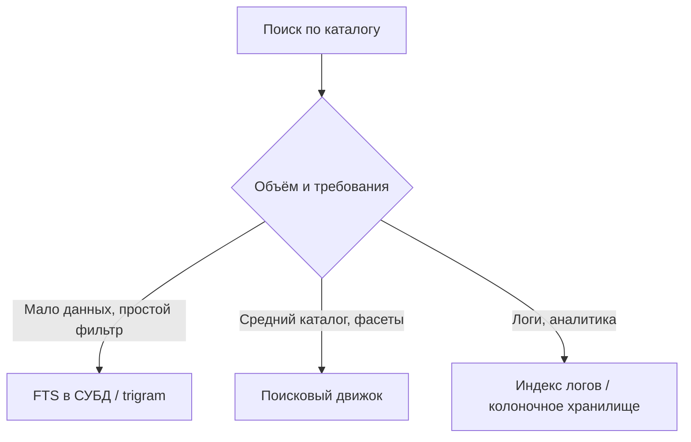

# Полнотекстовый поиск для приложений

  ОБЯЗАТЕЛЬНО
  ДЛЯ НОВИЧКОВ

Разработчику
Архитектору

Пользователь вводит «ноутбук леново» — ожидает релевантные результаты за миллисекунды. **`LIKE '%ноутбук%'`** в SQL на миллионах строк — не решение. Для текста, ранжирования и опечаток нужен **полнотекстовый поиск (FTS)**.

---

## Уровни решения

| Подход | Когда достаточно | Ограничения |
|--------|------------------|-------------|
| **B-tree + префикс** | Автодополнение по коду | Не полнотекст |
| **FTS в PostgreSQL / MySQL** | Один источник правды, умеренная нагрузка | Сложная кластеризация, меньше фасетов «из коробки» |
| **Elasticsearch / OpenSearch** | Большой каталог, агрегации, гибкий scoring | Отдельный кластер, синхронизация с БД |
| **Meilisearch / Manticore** | Быстрый старт, typo-tolerance | Меньше экосистема enterprise |
| **MongoDB text index** | Уже на документной модели | Слабее аналитика чем ES |

Справочник по стеку ELK в эксплуатации: [DevOps — Elasticsearch](/encyclopedia/8-infra-security/8-04-devops-ci-cd/3117).

---

## Базовые понятия

| Термин | Смысл |
|--------|--------|
| **Документ** | Единица индексации (товар, статья, тикет) |
| **Индекс** | Именованный набор документов |
| **Анализатор** | Токенизация, стемминг, стоп-слова («и», «в») |
| **Inverted index** | Слово → список document id |
| **Score / BM25** | Релевантность выдачи |
| **Facet / aggregation** | Фильтры «бренд», «цена» в боковой панели |

**Морфология** для русского: формы «ноутбук», «ноутбуки» должны находиться одним запросом — настраивается анализатором.

---

## Поток данных

1. **Запись в БД** — источник истины.
2. **Синхронизация** в поисковый индекс:
   - синхронно при записи (просто, риск задержки API);
   - асинхронно через очередь (**рекомендуется**);
   - CDC (change data capture) из WAL.
3. **Поисковый запрос** — только в движок, ID → обогащение из БД при необходимости.

**Идемпотентность индексации:** повторное событие `product_updated` не должно ломать документ.

---

## Запросы и bulk

- Поиск: query string, match phrase, fuzzy для опечаток.
- **Bulk API** — пачковая индексация при реиндексации каталога.
- **Alias** — переключение `products_v2` → `products` без даунтайма.

Не индексируйте в поиск **пароли и PII**, если нет юридической необходимости.

---

## Операционные риски

| Риск | Митигация |
|------|-----------|
| Расхождение БД и индекса | Периодическая сверка, dead-letter очередь |
| Рост индекса | TTL, архив, отдельные индексы по годам |
| Медленный агрессивный fuzzy | Лимиты, min score |
| Split-brain в кластере | Кворум, мониторинг ([PACELC](/encyclopedia/8-infra-security/8-05-mikroservisy-i-integratsiya/124)) |

---

## Критерии выбора (чек-лист)

1. Нужны ли **фасеты** и сложный scoring?
2. Объём документов &gt; 1–10 млн?
3. Допустима ли **eventual consistency** в выдаче?
4. Есть ли команда для **кластера** поиска?
5. Достаточно ли **PostgreSQL `tsvector`** на первые 2 года?

Если пункты 1–2 «нет» — начните с FTS в основной БД, не с Elasticsearch.

---

## Связанные темы

- [Поиск информации](/encyclopedia/1-basics/1-21-poisk-informatsii/1)
- [MongoDB text index](/encyclopedia/3-data-markup/3-06-nosql/4)
- [Наблюдаемость](/encyclopedia/1-basics/1-23-frontend-i-bekend/9)
- [Компетенции бэкенда](/encyclopedia/1-basics/1-23-frontend-i-bekend/4)

---
