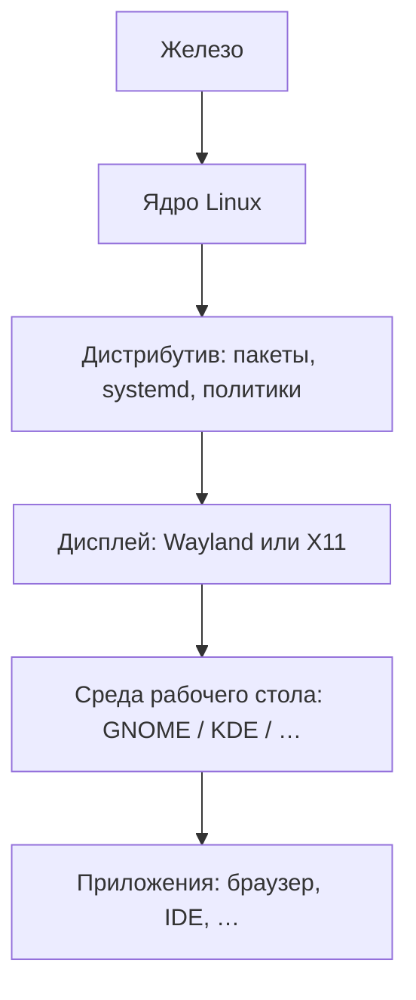
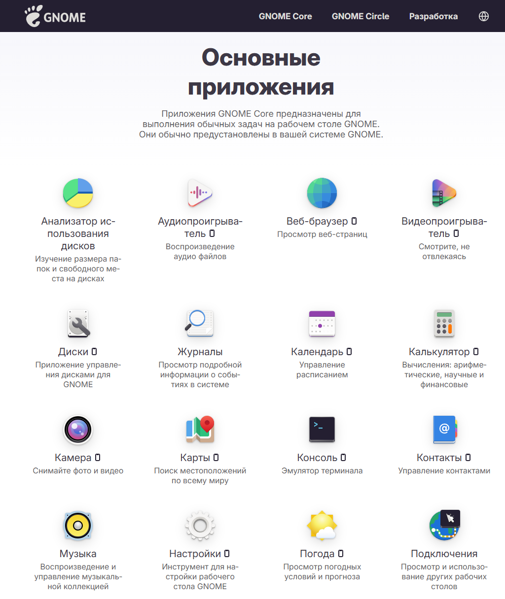

# GNU/Linux — рабочие столы и споры окружений

  НЕ ОБЯЗАТЕЛЬНО
  ДЛЯ НОВИЧКОВ

Всем

---

GNU/Linux — это полноценная, свободная операционная система с открытым исходным кодом, созданная путем объединения системных утилит проекта GNU и ядра Linux. В повседневной речи эту систему часто называют просто «Linux», однако технически это не совсем верно, Linux отвечает только за управление «железом» компьютера, тогда как программы GNU формируют рабочую среду пользователя. GNU включает набор базовых программ и утилит командной строки, созданный Ричардом Столлманом. Сюда входят компилятор кода (GCC), текстовые редакторы, командная оболочка Bash и библиотеки, необходимые для работы любых приложений. Когда Линус Торвальдс в 1991 году создал ядро Linux, он объединил его с уже готовыми утилитами проекта GNU. Так появилась работоспособная ОС, которую мы знаем сегодня.

Код системы полностью открыт. Любой человек может бесплатно скачать её, изучить, изменить под себя или легально поделиться с другими, и поскольку компоненты системы бесплатны, разные разработчики собирают их по-своему, добавляя графические оболочки и менеджеры приложений. Такие сборки называют дистрибутивами. Самые известные из них — Ubuntu, Debian, Fedora, Mint и Arch Linux.  Система работает везде — от суперкомпьютеров и серверов до смартфонов (Android тоже основан на ядре Linux, но без утилит GNU) и умных чайников.

На сервере Linux часто **без графики** — SSH, сервисы, контейнеры — см. [Администрирование Linux-систем](./93). На рабочей станции пользователь видит **среду рабочего стола** (desktop environment, **DE**) — панели, файловый менеджер, настройки, набор приложений.

Почему серверы работают без графики? Графическая оболочка потребляет много оперативной памяти (RAM) и нагружает процессор. На сервере эти ресурсы отдаются сайтам, базам данных и бизнес-приложениям. Кроме этого, чем меньше программ установлено в системе, тем меньше вероятность сбоев и ошибок. Графика — это миллионы строк лишнего кода. 

Серверами управляют через текстовые скрипты, да и графические окна невозможно эффективно автоматизировать. Вместо мыши и рабочего стола администраторы используют текстовый терминал (консоль) и интерфейс командной строки (CLI). Администратор подключается к серверу по протоколу Secure Shell со своего рабочего компьютера с помощью командной строки или программ вроде PuTTY.

Все действия выполняются вводом команд. Например, `cd` для перехода по папкам, `nano` для редактирования файлов или `systemctl restart` для перезапуска сервисов. Такой вот режим работы с Linux.

В рунете десятилетиями идут **"войны окружений"** — GNOME против KDE, минимализм против "все настраивается", Wayland против "верните X11". Для админа и разработчика важнее понять **слои системы**, чем победить в споре в комментариях.

---

## Слои: ядро, дистрибутив, DE

| Слой | Примеры | Меняется когда |
|------|---------|----------------|
| Дистрибутив | Ubuntu, Fedora, Debian, Arch | Переустановка или смена ветки |
| DE | GNOME, KDE Plasma, Xfce | Пакет `ubuntu-desktop` vs `kubuntu-desktop`, или ручной выбор |
| Приложение | Firefox, VS Code | Отдельно от DE, но зависит от Qt/GTK |

Ядро - фундамент системы на самом низком уровне, напрямую общается с аппаратным обеспечением (процессор, оперативная память, жесткие диски, видеокарта), распределяет ресурсы между программами, управляет драйверами устройств и обеспечивает безопасность на уровне процессов. Работает всегда. Это критически важный слой, без которого компьютер не запустится.

Дистрибутив (ОС + Системное окружение GNU) - это надстройка над ядром, превращающая его в полноценную операционную систему, которая объединяет ядро Linux, базовые утилиты GNU (командную оболочку, компиляторы) и системные службы (например, systemd). Ключевой компонент - это менеджер пакетов (`apt`, `yum`, `pacman`). Он отвечает за установку, обновление и удаление программ. Именно на этом слое останавливается настройка серверных систем (Ubuntu Server, Debian, Rocky Linux). Администратор получает готовую ОС, но управляет ей только текстом через консоль.

DE (Desktop Environment / Графическая оболочка) - это самый верхний, пользовательский слой интерфейса, который превращает текстовую систему в привычный графический рабочий стол. Сюда входят оконный менеджер, панели задач, меню «Пуск», проводник файлов, виджеты и набор базовых графических программ (калькулятор, просмотрщик картинок). Самые популярные как раз-таки GNOME (стандарт в Ubuntu), KDE Plasma (очень гибкая и похожая на Windows), XFCE (легковесная для слабых ПК). На сервере этот слой полностью отсутствует. Его не устанавливают, чтобы не тратить ресурсы сервера на отрисовку окон.

Подробнее про дистрибутивы и установку — [Администрирование Linux-систем](./93), [Установка и первоначальная настройка ОС — установка ОС](./2).

---

## Основные среды рабочего стола

| DE | Ориентир | Типичные дистрибутивы |
|----|----------|------------------------|
| **GNOME** | Минималистичный shell, сильная интеграция настроек | Fedora Workstation, Ubuntu по умолчанию |
| **KDE Plasma** | Гибкая настройка, Qt-приложения | KDE Neon, Kubuntu, openSUSE |
| **Xfce** | Легче по ресурсам, классический "рабочий стол" | Xubuntu, многие "легкие" сборки |
| **Cinnamon / MATE** | Ближе к привычному "меню Пуск" | Linux Mint и др. |

**KDE 2** (начало 2000-х) — предшественник современного **KDE Plasma**; в мемах фигурирует в формуле ["как пропатчить KDE2 под FreeBSD?"](/encyclopedia/9-spinoff/9-10-internet-kultura/131) — ирония над устаревшим или раздутым вопросом, а не инструкция ([Основы интернет-культуры — основы интернет-культуры](/encyclopedia/9-spinoff/9-10-internet-kultura/1)).

Карточки: [GNOME](/glossary/G#gnome), [KDE](/glossary/K#kde).

---

## Wayland и X11

**X11** (X Window System) десятилетиями был стандартом графики в Unix. **Wayland** — более современный протокол compositor'а; в новых релизах GNOME и KDE Wayland часто **по умолчанию**, с fallback на X11 для старых приложений.

Для админа на практике:

- "Не работает экран после обновления" — проверить сессию Wayland/X11, драйвер GPU, логи `journalctl`.
- Удалённый доступ к GUI — отдельная тема (RDP, VNC, X11 forwarding); на серверах GUI обычно не ставят.

---

## Почему спорят в рунете

| Явление | Что за этим | Как отвечать по делу |
|---------|-------------|----------------------|
| "Только Arch / только Ubuntu" | Идентичность дистрибутива | Задача: сервер, desktop, CI — [выбор в 93](./93) |
| GNOME и KDE | Вкус UI и экосистема Qt/GTK | Пилот на VM, политика компании |
| [Линуксоид](/glossary/Л#линуксоид) | Карикатура на фанатичный тон | Не путать с профессией админа |
| "Собери ядро" | Маркер "настоящего" пользователя | Нужно ли — только под железо/драйвер |

Форумная лексика и этика тона — [Форумная культура Рунета](/encyclopedia/9-spinoff/9-10-internet-kultura/120). IT-формулы — [Рунетские IT-формулы](/encyclopedia/9-spinoff/9-10-internet-kultura/131).

  
Сервер vs рабочий стол

  

  В продакшене чаще **нет DE** — Docker, nginx, PostgreSQL на headless Linux. Спор "какой рабочий стол красивее" к такому хосту не относится.
  

---

## Неолурк

| Тема | Неолурк | Энциклопедия |
|------|---------|----------------|
| Linux | [Linux](https://neolurk.org/wiki/Linux) | [Администрирование Linux-систем](./93) |
| GNOME | [GNOME](https://neolurk.org/wiki/GNOME) | эта статья, [Рунетские IT-формулы](/encyclopedia/9-spinoff/9-10-internet-kultura/131) |
| Патч KDE2 | [Патчить KDE2](https://neolurk.org/wiki/%D0%9F%D0%B0%D1%82%D1%87%D0%B8%D1%82%D1%8C_KDE2_%D0%BF%D0%BE%D0%B4_FreeBSD) | [Основы интернет-культуры](/encyclopedia/9-spinoff/9-10-internet-kultura/1) |

---

## Дальше

| Цель | Материал |
|------|----------|
| Администрирование Linux | [Администрирование Linux-систем](./93) |
| Терминал и shell | [2.05](/encyclopedia/2-system-network/2-05-terminal/intro) |
| Windows на ПК (контраст) | [Windows на рабочей станции — жизненный цикл](./95) |
| Культура рунета | [9.10](/encyclopedia/9-spinoff/9-10-internet-kultura/intro) |

---
