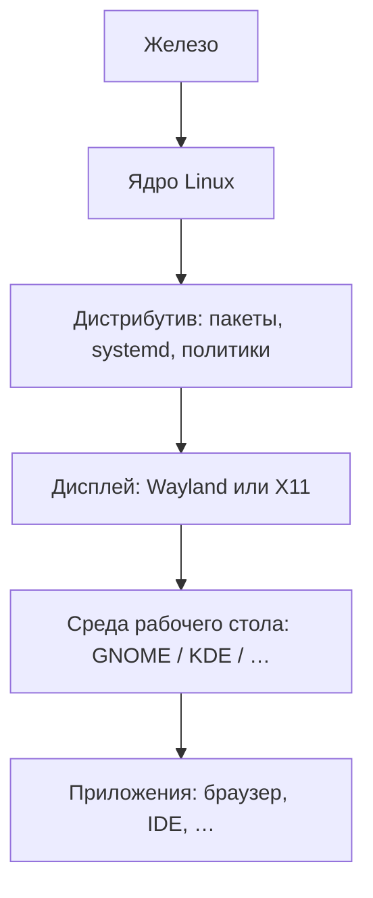

# GNU/Linux — рабочие столы и споры окружений

  НЕ ОБЯЗАТЕЛЬНО
  ДЛЯ НОВИЧКОВ

Всем

---

## Зачем эта статья

На сервере Linux часто **без графики**: SSH, сервисы, контейнеры — см. [93](./93). На рабочей станции пользователь видит **среду рабочего стола** (desktop environment, **DE**): панели, файловый менеджер, настройки, набор приложений.

В рунете десятилетиями идут **"войны окружений"**: GNOME против KDE, минимализм против "все настраивается", Wayland против "верните X11". Для админа и разработчика важнее понять **слои системы**, чем победить в споре в комментариях.

---

## Слои: ядро, дистрибутив, DE

| Слой | Примеры | Меняется когда |
|------|---------|----------------|
| Дистрибутив | Ubuntu, Fedora, Debian, Arch | Переустановка или смена ветки |
| DE | GNOME, KDE Plasma, Xfce | Пакет `ubuntu-desktop` vs `kubuntu-desktop`, или ручной выбор |
| Приложение | Firefox, VS Code | Отдельно от DE, но зависит от Qt/GTK |

Подробнее про дистрибутивы и установку — [93](./93), [2 — установка ОС](./2).

---

## Основные среды рабочего стола

| DE | Ориентир | Типичные дистрибутивы |
|----|----------|------------------------|
| **GNOME** | Минималистичный shell, сильная интеграция настроек | Fedora Workstation, Ubuntu по умолчанию |
| **KDE Plasma** | Гибкая настройка, Qt-приложения | KDE Neon, Kubuntu, openSUSE |
| **Xfce** | Легче по ресурсам, классический "рабочий стол" | Xubuntu, многие "легкие" сборки |
| **Cinnamon / MATE** | Ближе к привычному "меню Пуск" | Linux Mint и др. |

**KDE 2** (начало 2000-х) — предшественник современного **KDE Plasma**; в мемах фигурирует в формуле ["как пропатчить KDE2 под FreeBSD?"](/encyclopedia/9-spinoff/9-10-internet-kultura/131) — ирония над устаревшим или раздутым вопросом, а не инструкция ([1 — основы интернет-культуры](/encyclopedia/9-spinoff/9-10-internet-kultura/1)).

Карточки: [GNOME](/glossary/G#gnome), [KDE](/glossary/K#kde).

---

## Wayland и X11

**X11** (X Window System) десятилетиями был стандартом графики в Unix. **Wayland** — более современный протокол compositor'а; в новых релизах GNOME и KDE Wayland часто **по умолчанию**, с fallback на X11 для старых приложений.

Для админа на практике:

- "Не работает экран после обновления" — проверить сессию Wayland/X11, драйвер GPU, логи `journalctl`.
- Удалённый доступ к GUI — отдельная тема (RDP, VNC, X11 forwarding); на серверах GUI обычно не ставят.

---

## Почему спорят в рунете

| Явление | Что за этим | Как отвечать по делу |
|---------|-------------|----------------------|
| "Только Arch / только Ubuntu" | Идентичность дистрибутива | Задача: сервер, desktop, CI — [выбор в 93](./93) |
| GNOME и KDE | Вкус UI и экосистема Qt/GTK | Пилот на VM, политика компании |
| [Линуксоид](/glossary/Л#линуксоид) | Карикатура на фанатичный тон | Не путать с профессией админа |
| "Собери ядро" | Маркер "настоящего" пользователя | Нужно ли — только под железо/драйвер |

Форумная лексика и этика тона — [120](/encyclopedia/9-spinoff/9-10-internet-kultura/120). IT-формулы — [131](/encyclopedia/9-spinoff/9-10-internet-kultura/131).

  
Сервер vs рабочий стол

  В продакшене чаще **нет DE**: Docker, nginx, PostgreSQL на headless Linux. Спор "какой рабочий стол красивее" к такому хосту не относится.

---

## Неолурк

| Тема | Неолурк | Энциклопедия |
|------|---------|----------------|
| Linux | [Linux](https://neolurk.org/wiki/Linux) | [93](./93) |
| GNOME | [GNOME](https://neolurk.org/wiki/GNOME) | эта статья, [131](/encyclopedia/9-spinoff/9-10-internet-kultura/131) |
| Патч KDE2 | [Патчить KDE2](https://neolurk.org/wiki/%D0%9F%D0%B0%D1%82%D1%87%D0%B8%D1%82%D1%8C_KDE2_%D0%BF%D0%BE%D0%B4_FreeBSD) | [1](/encyclopedia/9-spinoff/9-10-internet-kultura/1) |

---

## Дальше

| Цель | Материал |
|------|----------|
| Администрирование Linux | [93](./93) |
| Терминал и shell | [2.05](/encyclopedia/2-system-network/2-05-terminal/intro) |
| Windows на ПК (контраст) | [95](./95) |
| Культура рунета | [9.10](/encyclopedia/9-spinoff/9-10-internet-kultura/intro) |

---
