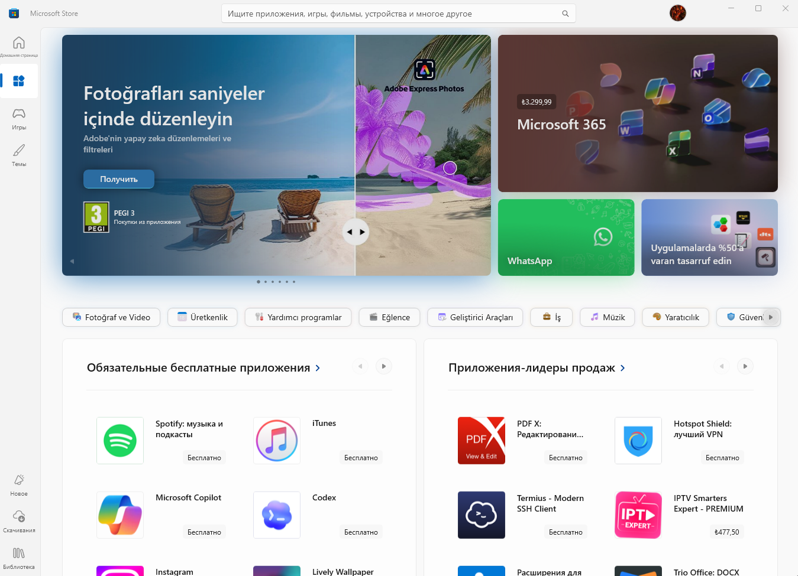
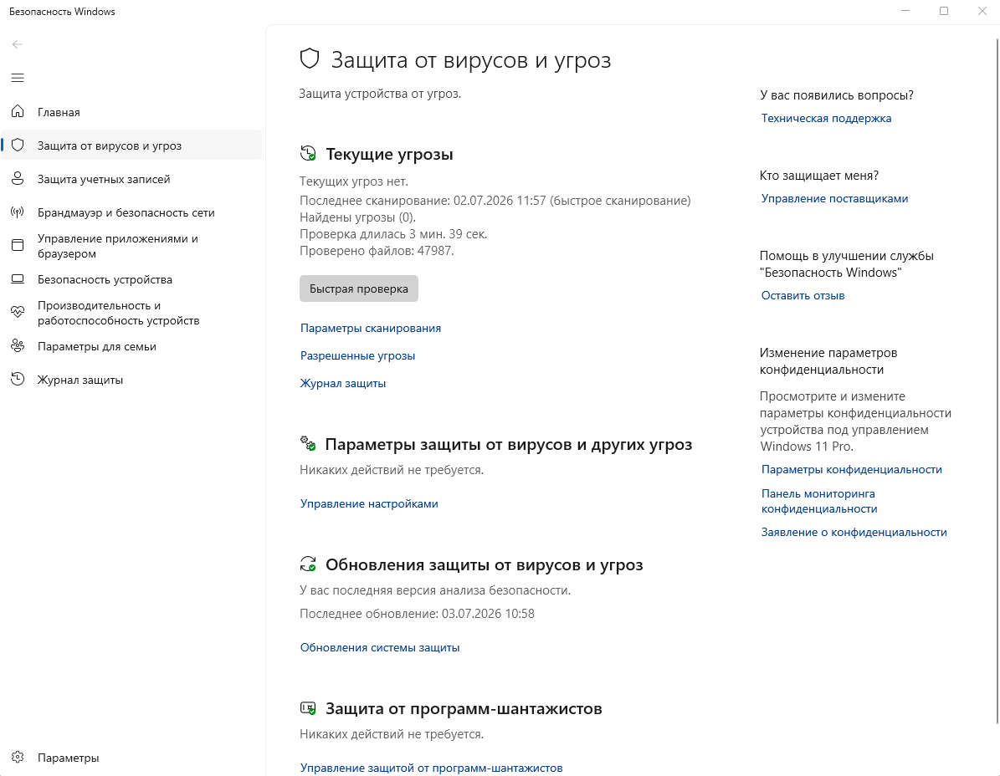
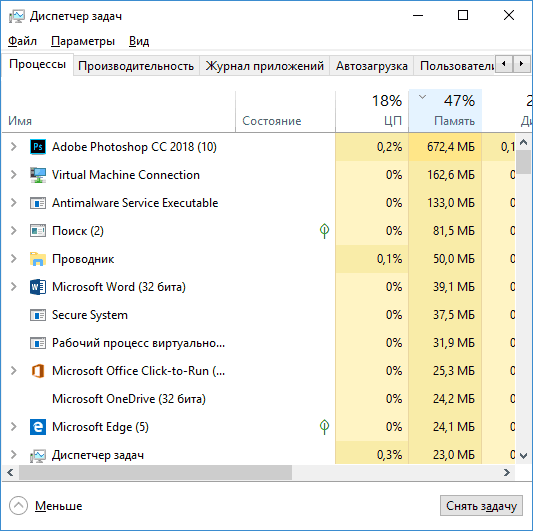

# Windows — Store, защита, диспетчер и "сборки"

<div class="article-tags">
  <span class="tag tag-notrequired">НЕ ОБЯЗАТЕЛЬНО</span>
  <span class="tag tag-beginner">ДЛЯ НОВИЧКОВ</span>
</div>

<span class="complexity-badge">Всем</span>

---

В рунете вокруг Windows много **бытовых** тем — "оптимизированная сборка", "антивирус тормозит", "диспетчер не убивает процесс", "Store не нужен". В [Рунетские IT-формулы](/encyclopedia/9-spinoff/9-10-internet-kultura/131) это часто сводят к "переустанови"; здесь разбираем, **что стоит за этими словами** и куда смотреть в энциклопедии.

Указатели Неолурка — [Microsoft Store](https://neolurk.org/wiki/Microsoft_Store), [Антивирус](https://neolurk.org/wiki/%D0%90%D0%BD%D1%82%D0%B8%D0%B2%D0%B8%D1%80%D1%83%D1%81), [Сборки Windows](https://neolurk.org/wiki/%D0%A1%D0%B1%D0%BE%D1%80%D0%BA%D0%B8_Windows), [Диспетчер задач](https://neolurk.org/wiki/%D0%94%D0%B8%D1%81%D0%BF%D0%B5%D1%82%D1%87%D0%B5%D1%80_%D0%B7%D0%B0%D0%B4%D0%B0%D1%87).

---

## Microsoft Store

**Microsoft Store** — магазин приложений UWP и современных пакетов в Windows. Через него ставятся игры (Xbox), обновления части драйверов и приложений, компоненты вроде **Gaming Services**. Это официальная платформа компании Microsoft для покупки устройств, программного обеспечения и цифрового контента.



Встроенный магазин предназначен для установки программ, игр и обновлений.
1. Как открыть? Нажмите клавишу Win на клавиатуре, введите в поиске Microsoft Store и кликните на иконку приложения (белый пакет с логотипом).
2. Используйте поисковую строку вверху экрана для ввода названия нужной программы или игры.
3. Перейдите на страницу нужного приложения. Если оно бесплатное, нажмите кнопку Получить (или Установить).
4. Нажмите на иконку Библиотека (в левом нижнем углу). Затем нажмите Получить обновления, чтобы обновить все установленные приложения.
5. Нажмите на круглую иконку профиля вверху, чтобы войти в свою учетную запись Microsoft, привязать способ оплаты или активировать подарочный код.

Веб-версия магазина используется для покупки физических товаров и подписок, доступна по официальному сайту Microsoft Store.

Удаление Store и связанных служб ломает лицензии игр, античит и обновления UWP. Разбор — [1.035 / 207 — настройка Windows](/encyclopedia/1-basics/1-035-bazovaya-informatika/207). Полное удаление Microsoft Store и связанных с ним фоновых служб (таких как ClipSVC, Gaming Services и AppX Deployment Service) критически нарушает работу операционной системы и игровых сервисов.

Служба ClipSVC (Client License Service) отвечает за проверку лицензий для всех приложений и игр из магазина, включая подписки Xbox Game Pass. Без неё купленные вами игры (или игры по подписке) просто перестанут запускаться. Система выдаст ошибку лицензирования (например, 0x803F8001) или сообщение «Приложение не может открыться».

Xbox Gaming Services (Игровые службы) связующее звено между играми, сетью Xbox Live и механизмами защиты. Многие современные игры (даже купленные в Steam или Epic Games Store, но использующие сервисы Xbox, например, Sea of Thieves или Forza) требуют эту службу. Если её удалить, то игры будут вылетать при запуске, не смогут подключиться к мультиплееру, а встроенный античит будет блокировать вход, так как не может верифицировать ваш профиль.

Microsoft Store — это не просто графическая оболочка, это менеджер пакетов для формата UWP. Удаляя её, вы полностью теряете возможность обновлять стандартные компоненты Windows. Со временем перестанут корректно работать или обновляться такие важные элементы, как Параметры, Фотографии, Калькулятор, Блокнот, драйверы звука или видеокарт, которые сейчас часто поставляются в виде UWP-панелей управления (например, Realtek Audio Console или панели управления NVIDIA/AMD из Store). Осторожнее.

Если компоненты были вырезаны с помощью сторонних оптимизаторов или скриптов, их можно вернуть штатными командами Windows.
1. Нажмите правой кнопкой мыши на пуск и выберите Терминал (Администратор) или PowerShell (Администратор).
2. Чтобы вернуть сам Microsoft Store, вставьте следующую команду и нажмите Enter:
```
Get-AppXPackage -AllUsers -Name Microsoft.WindowsStore | Foreach {Add-AppxPackage -DisableDevelopmentMode -Register "$($_.InstallLocation)\AppXManifest.xml" -Verbose}
```
3. Чтобы восстановить Игровые службы (Gaming Services), выполните команду:
```
start ms-windows-store://pdp/?ProductId=9MWPM2CQNLHN
```

Она откроет Store (если он уже восстановлен шагом ранее) прямо на странице Игровых служб, откуда их можно будет установить заново.

Если вы только планируете оптимизацию системы, крайне рекомендуется не удалять Store, а просто отключить его автозапуск или скрыть плитку из меню Пуск.

Карточка — [глоссарий](/glossary/M#microsoft-store).

---

## Антивирус и Защитник Windows

**Антивирус** — ПО, которое ищет сигнатуры и подозрительное поведение (файлы, автозагрузка, сеть). В Windows 10/11 встроен **Защитник** (Microsoft Defender).



Защитник Windows (Windows Defender) — это встроенный бесплатный антивирус от Microsoft. Он глубоко интегрирован в операционную систему Windows 10 и Windows 11. Как и в случае с Microsoft Store, бездумное отключение или вырезание Защитника может серьезно нарушить стабильность системы. Многие считают его обычной утилитой для сканирования файлов, но он выполняет фундаментальные функции безопасности ОС:
- Защитник запускается раньше всех сторонних программ. Это защищает систему от руткитов, которые пытаются заразить компьютер до загрузки Windows.
- Защитник использует виртуализацию для защиты оперативной памяти от внедрения вредоносного кода.
- SmartScreen проверяет безопасность скачиваемых файлов в браузере и блокирует фишинговые сайты.
- Функция «Контролируемый доступ к папкам» запрещает любым неизвестным программам изменять файлы в «Документах», «Изображениях» и на рабочем столе.

| Ситуация | Рекомендация |
|----------|--------------|
| Домашний ПК | обычно достаточно Защитника + обновлений |
| Корпоратив | политика ИБ, централизованный AV |
| Два AV сразу | конфликты и тормоза — оставить один |

Использование агрессивных сторонних твикеров для удаления Защитника часто приводит к следующим проблемам:
- Центр обновления Windows (Windows Update) может перестать скачивать патчи безопасности и накопительные обновления.
- Перестают работать встроенные приложения (например, «Параметры» или «Безопасность Windows» будут открывать пустое окно).
- Если службы Защитника удалены некорректно, система может непрерывно искать их, из-за чего процесс `svchost.exe` начнет загружать процессор на 100%.

Windows устроена так, что вам не нужно удалять Защитник вручную, если вы хотите установить другой антивирус (например, Kaspersky, Dr.Web, Bitdefender). При установке стороннего антивируса Windows Defender сам отключает свое сканирование в реальном времени, чтобы избежать конфликтов. Если вы удалите сторонний антивирус, Защитник Windows мгновенно включится обратно, и система ни на секунду не останется без защиты.

Сторонний антивирус имеет смысл, если это требует политика компании; отключать защиту "ради FPS" без замены — риск. Подробнее — [2.08 ИБ](/encyclopedia/2-system-network/2-08-osnovy-informatsionnoy-bezopasnosti/intro), [глоссарий: антивирус](/glossary/А#антивирус).

---

## Диспетчер задач

**Диспетчер задач** (Task Manager) — встроенная утилита — процессы, производительность (CPU, RAM, диск, сеть), автозагрузка, службы.



- **Ctrl+Shift+Esc** — прямой запуск;
- **Ctrl+Alt+Del** → диспетчер задач;
- **Завершить задачу** — принудительно остановить зависшее приложение (не замена нормального закрытия).


Для админа есть **PowerShell**, **Process Explorer** (Sysinternals). Базовое описание — [2.01 / Windows](/encyclopedia/2-system-network/2-01-operatsionnaya-sistema/4).

**Текстовый редактор** в смысле Блокнота и Notepad++ — не диспетчер; для кода см. [1.19](/encyclopedia/1-basics/1-19-programma/intro), [51 / офис vs редактор](/encyclopedia/1-basics/1-035-bazovaya-informatika/309). [Неолурк: Текстовый редактор](https://neolurk.org/wiki/%D0%A2%D0%B5%D0%BA%D1%81%D1%82%D0%BE%D0%B2%D1%8B%D0%B9_%D1%80%D0%B5%D0%B4%D0%B0%D0%BA%D1%82%D0%BE%D1%80).

---

## "Сборки Windows"

**Сборка** в разговорной речи — образ **Windows**, собранный не Microsoft, а энтузиастом — удалены компоненты, добавлены твики, иногда сомнительный софт.

астомные сборки Windows (например, от популярных авторов вроде Flibustier, ReviOS, Tiny11, Compact) создаются независимыми разработчиками. Они вырезают из оригинального образа Microsoft «лишние» компоненты ради повышения производительности и экономии места на диске. Основные типы кастомных сборок:
- Облегченные (Lite / Compact). Из них удален максимум фоновых служб, телеметрия, Защитник Windows, Кортана, а иногда и сам Microsoft Store. Они весят мало и подходят для старых ноутбуков или слабых ПК.
- Геймерские (Gaming Editions). Фокус сделан на снижении задержки (DPC latency) и отключении визуальных эффектов. Часто содержат встроенные твики для оптимизации оперативной памяти.
- Корпоративные на базе LTSC. Сборки на основе официальной версии Windows Enterprise LTSC (Long Term Servicing Channel). В них изначально нет плиточных приложений и Store от самой Microsoft, но сохранена высокая стабильность.

| Официально | "Сборка" с форумов |
|------------|-------------------|
| ISO с сайта Microsoft, цифровая лицензия | repack, "игровая", "lite" |
| Обновления через Windows Update | отключённые службы, "заморозка" обновлений |
| Предсказуемая поддержка | неизвестное происхождение, риск малвари |

В погоне за «легковесностью» авторы часто вырезают компоненты Xbox, Xbox Live, Игровые службы и Microsoft Store. В итоге вы не сможете запустить современные игры, привязанные к этим сервисам, или столкнетесь с ошибками античитов. Многие сборки намертво блокируют Центр обновления Windows. Вы не получите критические патчи безопасности и новые функции ОС. 

Вы не можете быть на 100% уверены, что автор сборки не интегрировал в систему майнер, троян или скрытый бэкдор, особенно если в сборке полностью вырезан Защитник Windows. 

Если из системы удалены «лишние» драйверы, у вас могут возникнуть проблемы при подключении редких Bluetooth-устройств, принтеров или VR-шлемов.

Если вам нужна чистая, быстрая и официальная система без «мусора», рекламы и предустановленных игр (вроде Candy Crush), лучше использовать официальный образ Windows 11 IoT Enterprise LTSC. Она официально поддерживается Microsoft, в ней нет встроенного рекламного софта и лишних UWP-приложений и она работает быстрее обычной Pro-версии, но при этом не ломает системные зависимости, обновления и лицензии игр.

Для учёбы и работы — **официальный носитель** или корпоративный образ IT-отдела. Мемы — [Рунетские IT-формулы](/encyclopedia/9-spinoff/9-10-internet-kultura/131), карточка — [глоссарий: сборки Windows](/glossary/С#сборки-windows).

---

## Связанные материалы

- [Windows на рабочей станции — жизненный цикл — жизненный цикл Windows](./95)
- [Open Source, GitHub, DevOps и веб-стек — Open Source, GitHub, DevOps](/encyclopedia/9-spinoff/9-10-internet-kultura/133)
- [Быдлодевайс](/glossary/Б#быдлодевайс) — сленг про железо

---
