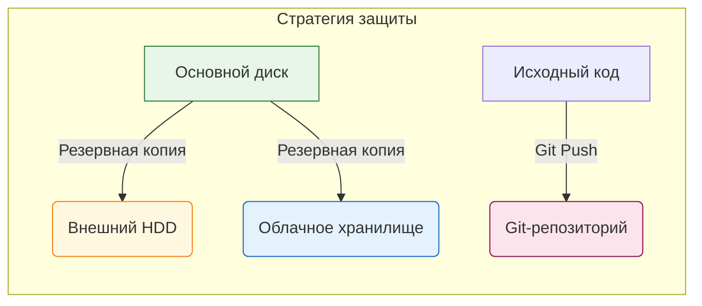

import DiskFragmentationPlay from '@site/src/components/DiskFragmentationPlay';

# Правила работы с жестким диском

<div class="article-tags">
  <span class="tag tag-required">ОБЯЗАТЕЛЬНО</span>
  <span class="tag tag-beginner">ДЛЯ НОВИЧКОВ</span>
</div>

<span class="complexity-badge">Разработчику</span>
<span class="complexity-badge">Архитектору</span>
<span class="complexity-badge">Инженеру</span>

---

## Правила работы с жестким диском

<DiskFragmentationPlay />

**Хранение данных** — это фундаментальная задача любой вычислительной системы, требующая строгого соблюдения правил эксплуатации и профилактики. Утрата информации может привести к остановке бизнес-процессов, потере интеллектуальной собственности или нарушению законодательства. Работа с накопителями требует понимания физических принципов их работы, ограничений аппаратного обеспечения и специфики программных интерфейсов.

---

## Фундаментальные принципы сохранения информации

Информация представляет собой ценный актив, требующий максимальной бережности при обработке. Хранение данных подразумевает создание условий, исключающих случайное удаление, повреждение файловых структур или физическую деградацию носителей.

---

### Стратегия резервного копирования

Создание копий критически важных данных является обязательным элементом инфраструктуры. Процесс бэкапирования должен выполняться регулярно и распределять копии по разным физическим носителям.

**Основные требования к резервированию:**
- Копии чувствительных данных размещаются на отдельных дисках, не являющихся основным носителем;
- Используется принцип 3-2-1: три копии данных, на двух разных типах носителей, одна из которых хранится в удаленном месте;
- Периодичность создания резервных копий зависит от частоты изменения информации и требований к восстановлению (RPO);
- Внешние диски и флеш-накопители используются как запасные варианты хранения, но требуют регулярного обновления содержимого.

Для разработчиков программного кода отдельным приоритетом является использование систем контроля версий. Исходный код должен автоматически отправляться в репозиторий Git после каждого значимого изменения. Это обеспечивает возможность отката к предыдущим версиям проекта и сохранение истории изменений.



---

## Специфика твердотельных накопителей (SSD)

Твердотельные накопители имеют принципиально иное устройство хранения данных по сравнению с магнитными жесткими дисками. Контроллер SSD управляет записью информации через специальные команды, влияющие на доступность удаленных файлов.

---

### Механизм работы TRIM

Команда **TRIM** предназначена для информирования контроллера диска об удаленных блоках данных, что позволяет ускорить последующую запись. Система помечает сектора как свободные, а контроллер физически очищает ячейки памяти в фоновом режиме для оптимизации производительности.

При попытке восстановления данных после удаления возникает следующая ситуация:
- Если файлы обнаруживаются в результатах сканирования, но предпросмотр показывает пустые блоки (последовательность нулей `00 00 00` в Hex-редакторе), то команда TRIM уже выполнила очистку ячеек;
- Если файлы отображаются корректно и предпросмотр работает, то данные сохранились до момента выполнения TRIM.

Программы для восстановления данных могут находить следы удаленных файлов, но отсутствие физического содержания в ячейках памяти делает восстановление невозможным.

---

### Гарантированное уничтожение данных

Стандартные методы перезаписи не гарантируют полное удаление информации с SSD из-за механизма выравнивания износа (wear leveling). Контроллер диска перенаправляет записи на другие ячейки, оставляя старые данные физически недоступными для стандартных утилит.

**Методы безопасного уничтожения данных на SSD:**
- Использование команды **ATA Secure Erase**, встроенной в прошивку диска и управляемой через BIOS или специализированные утилиты;
- Применение шифрования всего диска (например, BitLocker) с последующим удалением ключа шифрования;
- Использование специализированных утилит, поддерживающих команду Secure Erase для SSD.

Для магнитных жестких дисков применяются программы с принципом многократной перезаписи, такие как Eraser или DBAN. Эти инструменты выполняют несколько циклов записи случайных данных поверх оригинальной информации.

---

## Аппаратные ограничения и конфигурация системы

Компьютерная система имеет физические пределы подключения накопителей, которые необходимо учитывать при проектировании архитектуры хранения.

---

### Ограничения операционной системы Windows

Операционная система Windows выделяет буквы для обозначения дисков в алфавитном порядке. Система поддерживает до 26 букв латинского алфавита (A-Z), включая виртуальные диски, созданные программами виртуализации или монтирования образов. При достижении лимита новые диски не получают букву и становятся недоступны для пользователя.

---

### Ограничения материнской платы и питания

Количество доступных портов SATA на материнской плате ограничено типичными значениями от 3 до 8 штук. Превышение этого количества требует использования дополнительных контроллеров или расширения слотов PCI Express.

Питание является критическим фактором стабильности работы множества дисков. Блок питания компьютера должен обеспечивать достаточную мощность для запуска всех подключенных устройств. Недостаток мощности приводит к следующим проблемам:
- Диски не запускаются при включении системы;
- Диски отключаются во время пиковых нагрузок;
- Происходит нестабильная работа внешних накопителей.

---

### Проблемы USB-подключения

Подключение нескольких внешних дисков через один USB-хаб создает нагрузку на шину и источник питания.

**Типичные проблемы USB-подключения:**
- Перегрузка USB-шины при подключении 2-3 внешних дисков к одному хабу;
- Отключение дисков во время процесса копирования из-за недостатка тока;
- Дефицит питания: порт USB 2.0 обеспечивает 0.5 Ампера, порт USB 3.0 — 0.9 Ампера;
- Отсутствие внешнего питания у некоторых внешних дисков делает их зависимыми от тока порта.

Если внешний диск внезапно исчезает из списка томов во время копирования, наиболее вероятной причиной является недостаток питания. Обычная конфигурация без проблем поддерживает работу 6-8 дисков (комбинация SATA и USB).

---

## Программная безопасность и защита от ошибок

Разработка и эксплуатация программного обеспечения требуют внедрения механизмов защиты от случайных действий пользователя и автоматических процессов.

---

### Защита от автоматического удаления

Автоматические агенты и скрипты могут выполнять опасные операции без подтверждения пользователя. Современные системы управления разрешениями часто используют списки разрешений (Allowlist), исключая возможность использования списков запретов (Deny-list).

**Рекомендации по безопасности:**
- Отключить автоматическое выполнение команд без явного подтверждения;
- Настроить Allowlist для критических операций;
- Внимательно проверять права доступа внешних агентов и скриптов.

---

### Особенности защиты в редакторах кода

Среда разработки Cursor включает функцию **Delete File Protection**, которая предотвращает случайное удаление файлов через интерфейс редактора. Эта функция защищает только от прямых файловых операций, выполняемых внутренним механизмом редактора.

Функция защиты не срабатывает при выполнении команд терминала, таких как `Remove-Item -Force`. Пользователь должен осознавать, что команда терминала выполняет удаление без возможности восстановления через стандартные средства.

---

### Обработка ошибок в коде

Написание надежного кода требует учета всех возможных сценариев возникновения ошибок. Использование функций-оберток позволяет централизованно обрабатывать исключения и логику проверки.

**Элементы безопасной обработки ошибок:**
- Параметр `-WhatIf` позволяет проверить действие команды без её выполнения;
- Параметр `-Confirm` запрашивает подтверждение перед выполнением опасной операции;
- Конструкция `try/catch` перехватывает исключения и предотвращает аварийное завершение программы;
- Проверка возвращаемых значений функций на наличие ошибок.

```powershell
try {
    Remove-Item -Path "C:\Data\Important.txt" -WhatIf:$true -Confirm:$false
} catch {
    Write-Error "Ошибка удаления файла: $($_.Exception.Message)"
}
```

---

## Профессиональная помощь и физическая неисправность

Ситуации, когда накопитель перестает определяться системой или издает посторонние звуки, указывают на физическую поломку компонентов.

---

### Разделение ответственности

Люди с базовыми знаниями в области IT (обычные технари) могут не обладать необходимыми компетенциями для работы с поврежденными накопителями. Попытки самостоятельного ремонта или восстановления данных непрофессионалами часто приводят к необратимой потере информации.

**Критерии обращения к профессионалам:**
- Диск издает щелчки, визг или другие посторонние звуки;
- Диск не определяется в BIOS или системе;
- Видны следы физического повреждения (вмятины, ожоги, окисление контактов);
- Требуется восстановление данных с поврежденной файловой структуры.

В таких случаях требуется вмешательство инженеров-профессионалов, обладающих специальным оборудованием и чистыми комнатами для вскрытия корпусов дисков. Самостоятельное вскрытие диска в домашних условиях разрушает герметичную камеру и делает восстановление невозможным.

---

## Шифрование и управление доступом

Шифрование диска представляет собой метод защиты данных путем преобразования информации в нечитаемый формат без наличия специального ключа.

---

### Принцип работы шифрования

Программа шифрования использует алгоритм и ключ для преобразования исходных данных. При чтении файла система автоматически расшифровывает информацию на лету. При удалении ключа шифрования данные остаются на диске, но становятся недоступными для чтения даже при использовании специализированного ПО для восстановления.

**Преимущества шифрования:**
- Защита от несанкционированного доступа к данным;
- Возможность гарантированного уничтожения данных путем удаления ключа;
- Соответствие требованиям законодательства о защите персональных данных.

Для пользователей, которым требуется гарантированное уничтожение данных на SSD, рекомендуется использовать шифрование всего диска с последующим удалением ключа. Этот метод эффективнее механической перезаписи и не подвержен влиянию механизма wear leveling.

---
