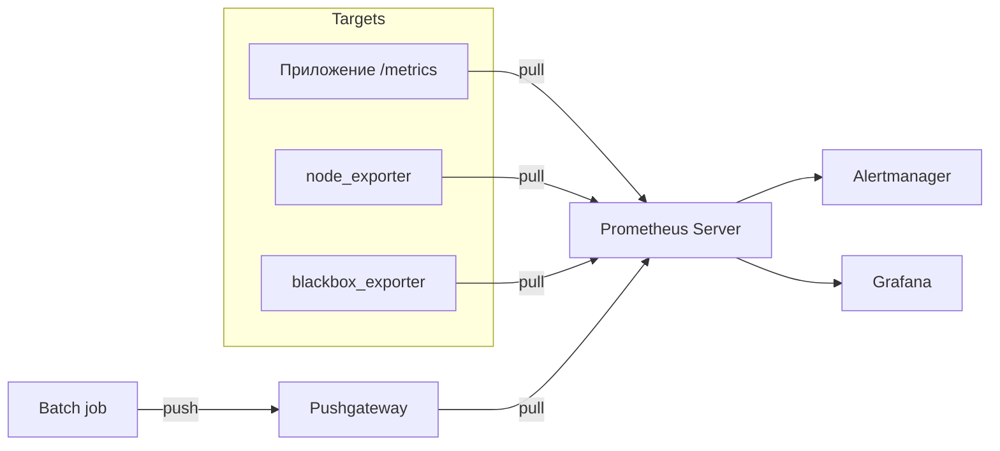

# Практикум Prometheus — архитектура и модель данных

<div class="article-tags">
  <span class="tag tag-required">ОБЯЗАТЕЛЬНО</span>
  <span class="tag tag-beginner">ДЛЯ НОВИЧКОВ</span>
</div>

<span class="complexity-badge">Инженеру</span>
<span class="complexity-badge">Разработчику</span>

> **Практикум, шаг 1 из 9.** Дальше — [установка](./2.md).

---

## Зачем Prometheus

**Prometheus** — система мониторинга и алертинга с открытым исходным кодом, де-факто стандарт для Kubernetes и cloud-native. В отличие от Zabbix с единым UI и push-агентами, Prometheus строится вокруг **pull-опроса** HTTP-эндпоинтов `/metrics` и языка запросов **PromQL**.

Цепочка работы:

1. **Scrape** — сервер Prometheus по расписанию забирает метрики с targets.
2. **Store** — значения пишутся в локальную TSDB (time series database).
3. **Query** — PromQL и HTTP API для графиков и правил.
4. **Alert** — alerting rules → Alertmanager → каналы оповещений.

Подробное сравнение с Zabbix и ELK — в [главе про мониторинг](../92.md). PromQL отработаете на [шаге 3](./3.md) и в [галерее Lab](/lab/Примеры/11114).

---

## Архитектурные компоненты



| Компонент | Назначение |
|-----------|------------|
| **Prometheus Server** | Scrape, TSDB, rule engine, web UI (:9090) |
| **Exporters** | Адаптеры для ОС, БД, SNMP — отдают текстовый exposition format |
| **Pushgateway** | Буфер для краткоживущих jobs (CI, cron), которые Prometheus не успеет опросить |
| **Alertmanager** | Группировка, inhibition, маршрутизация алертов |
| **Service discovery** | Kubernetes, Consul, DNS, file_sd — динамический список targets |

Официальный обзор — [Introduction / Overview](https://prometheus.io/docs/introduction/overview/).

---

## Pull и push

| Модель | Кто инициирует | Плюсы | Минусы |
|--------|----------------|-------|--------|
| **Pull** (Prometheus) | Сервер мониторинга | Централизованный контроль targets, проще обнаружить «мёртвый» scrape | Нужен доступ с Prometheus к каждому эндпоинту |
| **Push** (Zabbix active, OTel) | Агент или приложение | Удобно за NAT, для batch | Сложнее контролировать кардинальность |

Prometheus **по умолчанию pull**; исключение — **Pushgateway** для одноразовых задач. Телеметрия через **OpenTelemetry** часто идёт push в collector, который уже может отдавать метрики Prometheus scrape или remote_write.

---

## Модель данных

Каждая **метрика** — **временной ряд** с именем и **метками (labels)**:

```text
http_requests_total{job="api", instance="10.0.0.5:8080", method="GET", status="200"} 1024
```

- **Имя** — что измеряем (`http_requests_total`, `node_cpu_seconds_total`).
- **Labels** — измерения (job, instance, method, status).
- **Значение** — число с timestamp при каждом scrape.

<div class="callout callout--warning">
  <div class="callout-title">Кардинальность</div>

  Каждая уникальная комбинация labels — отдельный ряд в памяти. Метка `user_id` с миллионами значений «убьёт» Prometheus. Для идентификаторов запросов используйте логи и трассировки ([шаг 7](./7.md)).
</div>

---

## Что Prometheus не заменяет

| Задача | Инструмент в экосистеме |
|--------|-------------------------|
| Долгое хранение (>15–30 дней) | **Mimir**, Thanos, Cortex |
| Полнотекстовые логи | **Loki**, ELK |
| Распределённые трейсы | **Tempo**, Jaeger |
| Профили CPU/heap | **Pyroscope** |
| Единый UI корреляции | **Grafana** |

Prometheus закрывает **метрики и алерты по метрикам**; полная observability собирается вокруг него.

---

## Место в стеке Grafana Labs

Современный маршрут Grafana Labs (часто **LGTM+**):

- **L**oki — логи
- **G**rafana — визуализация и alerting
- **T**empo — трейсы
- **M**imir — долгосрочные метрики (remote storage для Prometheus)
- **Alloy** — единый агент вместо связки Prometheus Agent + Promtail + OTel Collector
- **Beyla** — eBPF-метрики без изменения кода
- **Faro** — Real User Monitoring (браузер)
- **Pyroscope** — continuous profiling

В этом практикуме Prometheus остаётся **точкой входа**; расширение — в шагах 7–9.

---

## Проверка понимания

1. Чем target отличается от job?
2. Зачем Pushgateway, если Prometheus pull?
3. Почему высокая кардинальность labels опасна?

<div class="callout callout--tip">
  <div class="callout-title">Дальше</div>

  Установите сервер и получите первый график — [шаг 2](./2.md). Ориентир — [First steps](https://prometheus.io/docs/introduction/first_steps/) и [Getting started](https://prometheus.io/docs/prometheus/latest/getting_started/).
</div>

---
