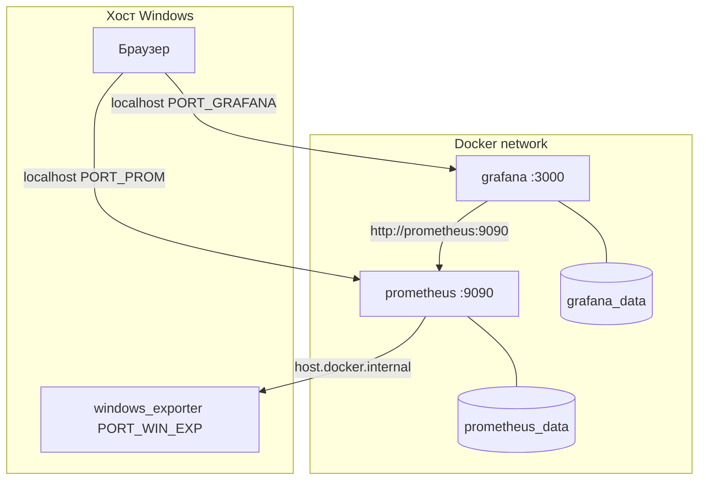

# Практикум Prometheus — установка и первые метрики

<div class="article-tags">
  <span class="tag tag-required">ОБЯЗАТЕЛЬНО</span>
</div>

<span class="complexity-badge">Инженеру</span>

> **Практикум, шаг 2 из 9.** Назад — [архитектура](./1.md). Дальше — [PromQL](./3.md). Grafana подключается здесь же; дашборды — [шаг 4](./4.md).

---

<div class="callout callout--tip">
  <div class="callout-title">После установки</div>

  <div class="callout-body">
  Стек поднят — откройте [Как пользоваться](./usage.md):

  - два URL;
  - проверка `up`;
  - добавление своего сервиса в `prometheus.yml`;
  - Explore;
  - дашборд.
  </div>
</div>

---

## Способы установки

| Способ | Когда выбирать |
|--------|----------------|
| **Docker Compose** | Практикум, Windows/macOS/Linux, быстрый перезапуск |
| **Официальный tarball** | Linux без Docker, понимание бинарников |
| **Helm / kube-prometheus-stack** | Kubernetes в проде |

Документация — [Installation](https://prometheus.io/docs/prometheus/latest/installation/).

<div class="callout callout--info">
  <div class="callout-title">Проверенный сценарий</div>

  <div class="callout-body">
  Ниже — маршрут, отработанный на **Windows 10/11 + Docker Desktop + PowerShell** — два контейнера (Prometheus + Grafana), provisioning datasource без ручной настройки в UI, нестандартные **внешние** порты, если `3000` и `9090` на хосте уже заняты. На Linux/WSL шаги те же; отличия — в health check и доступе к сервисам на хосте ([шаг 5](./5.md)).
  </div>
</div>

---

## Структура каталога проекта

Создайте отдельный каталог (имя на ваш выбор, например `observability-lab/`) и разложите файлы так:

```text
observability-lab/
  docker-compose.yml
  prometheus/
    prometheus.yml
  grafana/
    provisioning/
      datasources/
        datasource.yml
      dashboards/
        default.yml
        json/
          windows-exporter.json    # опционально, для Windows-хоста
  scripts/
    install-windows-exporter.ps1   # опционально, Windows
  tools/                         # скачанные бинарники (.gitignore)
  rules/                         # alerting rules — шаг 6
```

Все команды `docker compose` выполняйте **из корня этого каталога**.

---

## Порты — внутри контейнера и на хосте

| Где | Prometheus | Grafana |
|-----|------------|---------|
| **Внутри Docker-сети** | `prometheus:9090` | `grafana:3000` |
| **На хосте (браузер)** | `http://localhost:<PORT_PROM>` | `http://localhost:<PORT_GRAFANA>` |
| **windows_exporter** (Windows) | — | `http://localhost:<PORT_WIN_EXP>/metrics` |

Для **windows_exporter** на Windows часто выбирают отдельный порт `<PORT_WIN_EXP>` (например **9182**), чтобы не пересекаться с dev-сервисами. На рабочей машине эти порты нередко заняты (другие dev-сервисы, IDE, локальные API). В `docker-compose.yml` задайте **свободные** внешние порты, например:

```yaml
ports:
  - "<PORT_PROM>:9090"    # снаружи 9189, внутри всегда 9090
  - "<PORT_GRAFANA>:3000" # снаружи 8347, внутри всегда 3000
```

Перед запуском проверьте, что выбранные `<PORT_*>` свободны (`ss -tlnp` на Linux, `netstat -ano` или Resource Monitor на Windows).

<div class="callout callout--warning">
  <div class="callout-title">Grafana → Prometheus</div>

  <div class="callout-body">
  В provisioning datasource URL **всегда** `http://prometheus:9090` — имя **сервиса** из Compose, не `localhost`. Браузер ходит на `<PORT_GRAFANA>`, Grafana внутри сети — на `prometheus:9090`.
  </div>
</div>

---

## Предварительные требования

1. **Docker Desktop** (Windows/macOS) или Docker Engine + Compose v2 (Linux) — daemon запущен, иконка в трее "готова".
2. Два свободных порта на хосте для UI.
3. Редактор с подсветкой YAML.

Проверка окружения:

```powershell
docker --version
docker compose version
docker ps
```

```bash
docker --version && docker compose version && docker ps
```

---

## docker-compose.yml — минимальный рабочий стек

Замените `<PORT_PROM>` и `<PORT_GRAFANA>` на свои значения. Версии образов зафиксируйте тегами (не `latest`) — так проще воспроизвести стенд. Укороченный учебный вариант без provisioning — [стек №8 в галерее Compose](/lab/Примеры/11111#8-prometheus--grafana-минимум).

```yaml
services:
  prometheus:
    image: prom/prometheus:v2.53.0
    container_name: lab-prometheus
    restart: unless-stopped
    extra_hosts:
      - "host.docker.internal:host-gateway"
    ports:
      - "<PORT_PROM>:9090"
    volumes:
      - ./prometheus/prometheus.yml:/etc/prometheus/prometheus.yml:ro
      - prometheus_data:/prometheus
    command:
      - --config.file=/etc/prometheus/prometheus.yml
      - --storage.tsdb.path=/prometheus
      - --web.enable-lifecycle

  grafana:
    image: grafana/grafana:12.0.0
    container_name: lab-grafana
    restart: unless-stopped
    ports:
      - "<PORT_GRAFANA>:3000"
    environment:
      GF_SECURITY_ADMIN_USER: admin
      GF_SECURITY_ADMIN_PASSWORD: admin
      GF_USERS_ALLOW_SIGN_UP: "false"
      GF_USERS_DEFAULT_LANGUAGE: ru-RU
    volumes:
      - grafana_data:/var/lib/grafana
      - ./grafana/provisioning:/etc/grafana/provisioning:ro
    depends_on:
      - prometheus

volumes:
  prometheus_data:
  grafana_data:
```

| Параметр | Зачем |
|----------|-------|
| `extra_hosts: host.docker.internal` | Prometheus в контейнере scrape-ит exporters на **Windows-хосте** |
| `grafana/grafana:12.0.0` | В образе **12+** есть локаль `ru-RU` (в 11.2 русского нет) |
| `GF_USERS_DEFAULT_LANGUAGE` | Язык по умолчанию; **не** `GF_DEFAULT_LOCALE` (Grafana её игнорирует) |
| `restart: unless-stopped` | Контейнеры поднимаются после перезапуска Docker |
| Named volumes | Метрики TSDB и дашборды Grafana переживают `docker compose down` |
| `--web.enable-lifecycle` | Reload `prometheus.yml` без рестарта (`POST /-/reload`) |
| `depends_on` | Grafana стартует после Prometheus |
| `GF_USERS_ALLOW_SIGN_UP: "false"` | Только вход admin, без самостоятельной регистрации |

---

## prometheus/prometheus.yml

Минимальный конфиг — scrape **самого Prometheus**. Внутри контейнера он слушает `9090`, поэтому target — `localhost:9090`, а не имя сервиса.

```yaml
global:
  scrape_interval: 15s
  evaluation_interval: 15s

scrape_configs:
  - job_name: prometheus
    static_configs:
      - targets:
          - localhost:9090

  - job_name: windows
    static_configs:
      - targets:
          - host.docker.internal:<PORT_WIN_EXP>
    relabel_configs:
      - source_labels: [__address__]
        target_label: instance
        replacement: windows-host
```

Job `windows` — **опционально**, после установки [windows_exporter](./5.md#windows_exporter-на-windows). Без exporter на хосте target будет **DOWN** — это нормально до запуска агента.

Проверка синтаксиса (если установлен `promtool` локально или через временный контейнер):

```bash
promtool check config prometheus/prometheus.yml
```

---

## grafana/provisioning/datasources/datasource.yml

Datasource появится в Grafana **автоматически** при старте — ручной шаг "Add data source" не нужен.

```yaml
apiVersion: 1

datasources:
  - name: Prometheus
    type: prometheus
    uid: prometheus
    access: proxy
    url: http://prometheus:9090
    isDefault: true
    editable: false
```

Поле **`uid: prometheus`** нужно для автоподключения provisioned-дашбордов (в JSON ссылаются на datasource по UID, а не по имени).

---

## Provisioning дашбордов (опционально)

`grafana/provisioning/dashboards/default.yml`:

```yaml
apiVersion: 1

providers:
  - name: default
    orgId: 1
    folder: Windows
    type: file
    disableDeletion: false
    updateIntervalSeconds: 30
    allowUiUpdates: true
    options:
      path: /etc/grafana/provisioning/dashboards/json
```

JSON-файлы кладите в `grafana/provisioning/dashboards/json/` на хосте (в контейнере — путь из `options.path`).

Типовой дашборд для Windows — [Grafana.com ID **14694**](https://grafana.com/grafana/dashboards/14694) (Windows Exporter Dashboard). Перед сохранением в JSON:

- замените `$&#123;DS_PROMETHEUS&#125;` на `&#123;"type": "prometheus", "uid": "prometheus"&#125;`;
- уберите блоки `__inputs` и `__requires`;
- сохраните файл **UTF-8 без BOM** (см. ниже).

---

## Русский интерфейс Grafana

| Неверно | Правильно |
|---------|-----------|
| `GF_DEFAULT_LOCALE=ru-RU` | `GF_USERS_DEFAULT_LANGUAGE=ru-RU` |
| `grafana/grafana:11.2.0` | `grafana/grafana:12.0.0` или новее |

В Grafana **11.2** в образе **нет** каталога `ru-RU` в `/public/locales/` — русский не появится в списке языков. В **12.0+** локаль есть.

После `docker compose up -d grafana` откройте UI и сделайте **`Ctrl+F5`**. Меню Grafana переводится; названия панелей в импортированных JSON-дашбордах остаются на языке автора дашборда (часто английский).

Проверка:

```powershell
docker exec lab-grafana printenv GF_USERS_DEFAULT_LANGUAGE
docker exec lab-grafana ls /usr/share/grafana/public/locales/ | Select-String ru-RU
```

---

## Первый запуск

```powershell
cd <каталог-проекта>
docker compose up -d
```

```bash
cd <каталог-проекта>
docker compose up -d
```

### Если первая попытка упала

Типичная ошибка сразу после старта Docker Desktop:

```text
unable to get image 'grafana/grafana:...': Internal Server Error for API route
```

**Что делать:**

1. Дождаться полной готовности Docker (30–60 с после запуска).
2. `docker info` и `docker ps` — daemon отвечает.
3. Повторить `docker compose up -d`.

При успехе Compose создаёт сеть, volumes и контейнеры; образы скачиваются при первом запуске.

---

## Проверка после запуска

### Статус контейнеров

```powershell
docker compose ps
```

Оба сервиса — **Up**, в колонке PORTS видны ваши `<PORT_PROM>` и `<PORT_GRAFANA>`.

### Health check

**Windows (PowerShell):** `curl` — alias для `Invoke-WebRequest`, флаги GNU curl не работают. Используйте `curl.exe` или:

```powershell
curl.exe -s -o NUL -w "Prometheus: %{http_code}\n" http://localhost:<PORT_PROM>/-/healthy
curl.exe -s http://localhost:<PORT_GRAFANA>/api/health

Invoke-WebRequest -Uri http://localhost:<PORT_PROM>/-/healthy -UseBasicParsing | Select-Object StatusCode
Invoke-WebRequest -Uri http://localhost:<PORT_GRAFANA>/api/health -UseBasicParsing | Select-Object Content
```

**Linux / WSL / Git Bash:**

```bash
curl -s -o /dev/null -w "Prometheus: %{http_code}\n" http://localhost:<PORT_PROM>/-/healthy
curl -s http://localhost:<PORT_GRAFANA>/api/health
```

Ожидание:

- Prometheus `/-/healthy` → **200**
- Grafana `/api/health` → JSON с `"database":"ok"`

### UI в браузере

| Сервис | URL | Учётные данные |
|--------|-----|----------------|
| Prometheus | `http://localhost:<PORT_PROM>` | не требуются |
| Grafana | `http://localhost:<PORT_GRAFANA>` | `admin` / `admin` (смена пароля при первом входе — опционально) |

**Prometheus:** **Status → Targets** — jobs `prometheus` и (если настроен) `windows` — **UP**.

**Grafana:** **Connections → Data sources** — **Prometheus (Default)**. **Save & test** → "Successfully queried the Prometheus API". После установки windows_exporter — **Dashboards → Windows** (если настроен provisioning).


Запрос `up` в Prometheus должен показывать как минимум `up&#123;job="prometheus"&#125; 1`; при работающем windows_exporter — ещё `up&#123;job="windows"&#125; 1`. Как строить панели и импортировать дашборды — [Практикум Grafana — шаг 4](./4.md); маршрут — [о разделе](./intro.md).

---

## Схема (Windows / Docker Desktop)



---

## Изменение конфигурации Prometheus

После правки `prometheus/prometheus.yml`:

```powershell
docker compose restart prometheus
```

Или reload без рестарта (если включён `--web.enable-lifecycle`):

```powershell
curl.exe -X POST http://localhost:<PORT_PROM>/-/reload
```

```bash
curl -X POST http://localhost:<PORT_PROM>/-/reload
```

---

## Метрики Windows-хоста (кратко)

Prometheus в Docker **не видит** CPU, RAM и диски Windows без отдельного агента — **windows_exporter** на хосте.

1. В `docker-compose.yml` у Prometheus — `extra_hosts: host.docker.internal` (см. выше).
2. В `prometheus.yml` — job `windows` → `host.docker.internal:<PORT_WIN_EXP>`.
3. Установите exporter ([шаг 5](./5.md#windows_exporter-на-windows)) — скрипт с режимами **Portable** (быстро, без admin, не переживает reboot) или **Service** (Windows-сервис).
4. `curl.exe -s -o NUL -w "%&#123;http_code&#125;\n" http://localhost:<PORT_WIN_EXP>/metrics` → **200**.
5. `curl.exe -X POST http://localhost:<PORT_PROM>/-/reload` — применить конфиг.
6. **Status → Targets** — job `windows` **UP**; в Grafana — дашборд из папки **Windows** ([usage](./usage.md)).


---

## Сервис на хосте Windows (любое приложение)

Чтобы Prometheus в контейнере опрашивал API на **вашем ПК** (не в Docker), добавьте job:

```yaml
  - job_name: my-app
    static_configs:
      - targets:
          - host.docker.internal:8080
```

`host.docker.internal` — специальное DNS-имя Docker Desktop для доступа к хосту. На Linux иногда нужен `extra_hosts: ["host.docker.internal:host-gateway"]` в сервисе Prometheus. Подробнее — [шаг 5](./5.md).

---

## Ежедневные команды

```powershell
docker compose up -d              # запуск
docker compose stop               # остановка без удаления
docker compose down               # удалить контейнеры, volumes остаются
docker compose down -v            # удалить контейнеры и volumes (метрики и дашборды пропадут!)
docker compose logs -f            # все логи
docker compose logs -f prometheus
docker compose restart grafana
docker compose pull && docker compose up -d   # обновление образов
```

---

`host.docker.internal` — DNS Docker Desktop для доступа к хосту. На Linux в Compose для Prometheus обычно нужен тот же `extra_hosts`. Подробнее — [шаг 5](./5.md).

---

## Устранение неполадок

| Симптом | Вероятная причина | Действие |
|---------|-------------------|----------|
| `Bind for 0.0.0.0:... failed: port is already allocated` | Порт занят | Сменить `<PORT_*>` в compose, `docker compose down` → `up -d` |
| Internal Server Error при `pull` | Docker ещё не готов | Подождать 30–60 с, повторить `up -d` |
| `curl` в PowerShell падает | Alias `Invoke-WebRequest` | `curl.exe` или `Invoke-WebRequest` |
| Grafana "не видит" Prometheus | URL `localhost` в datasource | Должно быть `http://prometheus:9090` |
| Контейнер в restart loop | Ошибка в YAML | `docker compose logs prometheus`, `promtool check config` |
| Target **DOWN** для job на хосте | Exporter не запущен / нет `extra_hosts` | Проверить `/metrics` на хосте, `host.docker.internal` |
| Grafana на английском, нет "Русский" | Образ 11.x или `GF_DEFAULT_LOCALE` | Образ **12.0+**, `GF_USERS_DEFAULT_LANGUAGE=ru-RU`, `Ctrl+F5` |
| Папка **Windows** пустая | JSON дашборда с **UTF-8 BOM** | Пересохранить JSON без BOM, `docker compose restart grafana` |
| `invalid character 'ï'` в логах Grafana | То же (BOM) | См. [шаг 4](./4.md) |
| `windows` DOWN после reboot | Режим Portable | Снова запустить exporter или `-Mode Service` |
| Ошибка PowerShell-скрипта установки | Кодировка файла `.ps1` | Сообщения в скрипте — ASCII; UTF-8 **без BOM** |

---

## Бинарная установка (Linux, без Docker)

```bash
curl -LO https://github.com/prometheus/prometheus/releases/download/v2.55.0/prometheus-2.55.0.linux-amd64.tar.gz
tar xvfz prometheus-*.tar.gz
cd prometheus-*
./prometheus --config.file=prometheus.yml
```

UI — **http://localhost:9090**. Grafana в этом случае ставят отдельно или вторым контейнером.

---

## Первый запрос

На вкладке **Graph** в Prometheus:

```promql
up
```

Ожидание: `up&#123;job="prometheus"&#125; 1`; при windows_exporter — также `up&#123;job="windows"&#125; 1`.

Другие полезные метрики:

```promql
prometheus_tsdb_head_series
prometheus_build_info
scrape_duration_seconds
```

Больше готовых запросов с разбором — [Prometheus + Grafana — запросы](/lab/Примеры/11114).

---

## Чек-лист шага

- [ ] Каталог проекта с `docker-compose.yml`, `prometheus/`, `grafana/provisioning/`
- [ ] `docker compose up -d` завершился без ошибок
- [ ] `docker compose ps` — оба сервиса **Up**
- [ ] Health Prometheus **200**, Grafana `/api/health` — ok
- [ ] Target `prometheus` — **UP**
- [ ] Grafana: datasource Prometheus — **Save & test** успешен
- [ ] (Опционально) windows_exporter на хосте, target `windows` — **UP**
- [ ] (Опционально) Grafana **12+**, интерфейс на русском после `Ctrl+F5`
- [ ] Запрос `up` работает в Prometheus UI

Дальше — [**Как пользоваться**](./usage.md) (UI, свой сервис, дашборд), затем [PromQL](./3.md).

---
