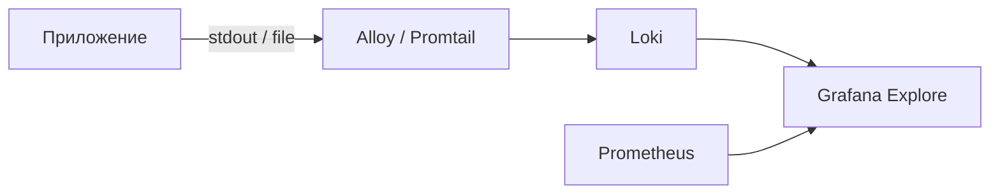

# Практикум — Loki, Tempo и Mimir

<div class="article-tags">
  <span class="tag tag-notrequired">НЕ ОБЯЗАТЕЛЬНО</span>
</div>

<span class="complexity-badge">Инженеру</span>
<span class="complexity-badge">Разработчику</span>

> **Практикум, шаг 7 из 9.** Назад — [алертинг](./6.md). Дальше — [Alloy и Beyla](./8.md).

---

## Три столпа в одном UI

Prometheus отвечает на «сколько и как быстро». Для расследования инцидента нужны ещё

- **логи** — что произошло по шагам;
- **трейсы** — путь одного запроса через сервисы.

**Grafana** связывает все три в Explore и на дашбордах. Стек Grafana Labs часто называют **LGTM** (Loki, Grafana, Tempo, Mimir). Базовые дашборды и Explore — [Практикум Grafana — шаг 4](./4.md); полный маршрут — [о разделе](./intro.md).


---

## Loki — логи как метки

**Loki** индексирует **labels** (как Prometheus), тело лога хранит в object storage или локально. Язык запросов — **LogQL**.



Минимальный фрагмент Compose:

```yaml
  loki:
    image: grafana/loki:3.2.0
    ports:
      - "3100:3100"
    command: -config.file=/etc/loki/local-config.yaml

  promtail:
    image: grafana/promtail:3.2.0
    volumes:
      - /var/log:/var/log:ro
      - ./promtail.yml:/etc/promtail/config.yml:ro
```

`promtail.yml` — scrape docker logs или `/var/log/*.log` с labels `job`, `host`.

LogQL в Grafana Explore:

```logql
{job="varlogs"} |= "error"
{container="myapp"} | json | status >= 500
```

Сравнение с ELK — в [92.md](../92.md#elk-stack).

---

## Tempo — распределённые трейсы

**Tempo** принимает spans по **OTLP** (gRPC/HTTP), Jaeger, Zipkin. Дешёвое хранение — без отдельного индекса по каждому атрибуту.

```yaml
  tempo:
    image: grafana/tempo:2.6.0
    ports:
      - "3200:3200"   # query
      - "4317:4317"   # OTLP gRPC
    command: [ "-config.file=/etc/tempo.yaml" ]
```

Приложение или **Alloy** отправляет трейсы на `tempo:4317`. В Grafana — datasource **Tempo**, поиск по `trace_id`.

**Корреляция** — из метрики с exemplars или из лога с полем `trace_id` → кнопка «View trace» в Explore.

---

## Mimir — долгосрочные метрики

Prometheus TSDB по умолчанию хранит ~15 дней. **Grafana Mimir** (форк Cortex) — горизонтально масштабируемое хранилище с **remote_write** / **remote_read**.

Prometheus → remote_write:

```yaml
remote_write:
  - url: http://mimir:9009/api/v1/push
```

Для учебного стенда Mimir **опционален** — достаточно знать, что при росте retention его подключают вместо или вместе с Thanos. Долгосрочные метрики на дашбордах Grafana настраивают так же, как Prometheus-источник — см. [шаг 4](./4.md).

| Решение | Назначение |
|---------|------------|
| **Mimir** | Grafana stack, object storage |
| **Thanos** | Sidecar к Prometheus, глобальный query |
| **Cortex** | Предшественник Mimir |

---

## Единый Explore — сценарий расследования

1. Алерт **HighErrorRate** в Grafana ([шаг 6](./6.md)).
2. Explore → Prometheus — spike на графике 5xx. PromQL для error rate и latency — [галерея](/lab/Примеры/11114).
3. Переключение на Loki — `&#123;job="myapp"&#125; |= "error"` в том же интервале.
4. Копируете `trace_id` из JSON-лога.
5. Tempo — поиск по trace → медленный span в БД.


Без `trace_id` в логах связь обрывается — см. [OpenTelemetry на шаге 9](./9.md).

---

## Datasources в Grafana

| Datasource | URL (Compose) |
|------------|---------------|
| Loki | `http://loki:3100` |
| Tempo | `http://tempo:3200` |
| Mimir | `http://mimir:9009/prometheus` |

В настройках Tempo укажите **Trace to logs** — datasource Loki и маппинг `trace_id`.

---

## Чек-лист

- [ ] Loki принимает логи, запрос `&#123;job=~".+"&#125;` в Explore
- [ ] Tempo datasource добавлен
- [ ] (Опционально) remote_write в Mimir

Дальше — [Alloy, Beyla, Faro, Pyroscope](./8.md).

---
