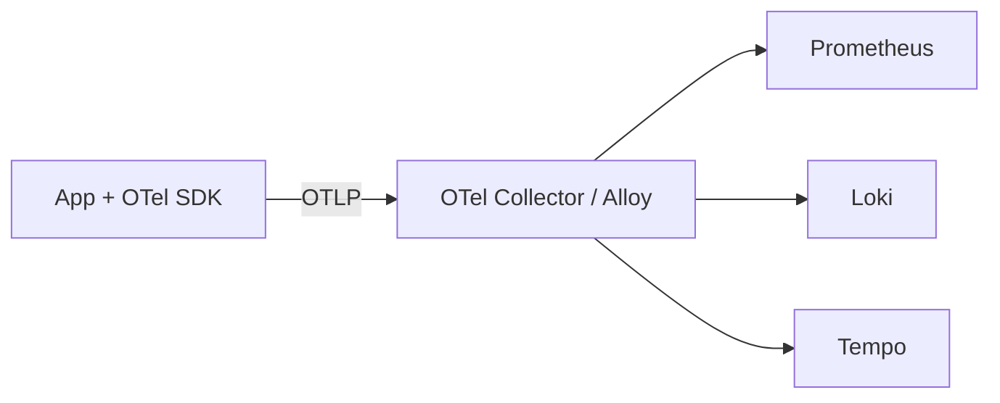

# Практикум — OpenTelemetry, k6 и итоговый стенд

<div class="article-tags">
  <span class="tag tag-notrequired">НЕ ОБЯЗАТЕЛЬНО</span>
</div>

<span class="complexity-badge">Инженеру</span>
<span class="complexity-badge">Разработчику</span>

> **Практикум, шаг 9 из 9.** Завершение маршрута. Начало — [о разделе](./intro.md).

---

## OpenTelemetry — единый стандарт

**OpenTelemetry (OTel)** — vendor-neutral API и SDK для **метрик, логов и трейсов**. Экспорт в Prometheus, Tempo, Loki, Jaeger, vendor backends через **Collector**.



Документация — [opentelemetry.io](https://opentelemetry.io/docs/).

---

## Collector — минимальный config

`otel-collector.yml`:

```yaml
receivers:
  otlp:
    protocols:
      grpc:
        endpoint: 0.0.0.0:4317

exporters:
  otlp/tempo:
    endpoint: tempo:4317
    tls:
      insecure: true
  prometheus:
    endpoint: "0.0.0.0:8889"

processors:
  batch:

service:
  pipelines:
    traces:
      receivers: [otlp]
      processors: [batch]
      exporters: [otlp/tempo]
    metrics:
      receivers: [otlp]
      processors: [batch]
      exporters: [prometheus]
```

Prometheus scrape collector `:8889/metrics`. Альтернатива — **Alloy** с блоками `otelcol.*` ([шаг 8](./8.md)).

---

## Инструментирование сервиса

**Python** (auto-instrumentation):

```bash
pip install opentelemetry-distro opentelemetry-exporter-otlp
opentelemetry-bootstrap -a install
export OTEL_EXPORTER_OTLP_ENDPOINT=http://localhost:4317
export OTEL_SERVICE_NAME=demo-api
opentelemetry-instrument python app.py
```

**Go** — `go.opentelemetry.io/otel` + OTLP exporter.

Обязательно — **структурированные логи** с `trace_id` / `span_id` для корреляции ([шаг 7](./7.md)).

---

## k6 — нагрузка и observability

**Grafana k6** — нагрузочное тестирование; метрики можно отправить в **Prometheus remote write** или **Grafana Cloud k6**.

Установка — [k6.io/docs](https://grafana.com/docs/k6/latest/).

`script.js`:

```javascript

import http from 'k6/http';
import { check, sleep } from 'k6';

export const options = {
  vus: 10,
  duration: '30s',
  thresholds: {
    http_req_duration: ['p(99)<500'],
    http_req_failed: ['rate<0.01'],
  },
};

export default function () {
  const res = http.get('http://localhost:8080/');
  check(res, { 'status is 200': (r) => r.status === 200 });
  sleep(1);
}
```

Запуск:

```bash
k6 run script.js
```

С выводом в Prometheus (k6 v0.49+):

```bash
K6_PROMetheus_RW_SERVER_URL=http://localhost:9090/api/v1/write \
K6_PROMetheus_RW_TREND_AS_NATIVE_HISTOGRAM=true \
k6 run -o experimental-prometheus-rw script.js
```

Во время теста наблюдайте в Grafana

- рост `http_requests_total` и latency histogram;
- логи ошибок в Loki;
- трейсы в Tempo при включённом OTel.

---

## Итоговый docker-compose (каркас)

Объедините шаги 2–8 в один файл (фрагмент):

```yaml
services:
  prometheus:
    image: prom/prometheus:v2.55.0
    volumes: [./prometheus.yml:/etc/prometheus/prometheus.yml:ro, ./rules:/etc/prometheus/rules:ro]
    ports: ["9090:9090"]

  alertmanager:
    image: prom/alertmanager:v0.27.0
    volumes: [./alertmanager.yml:/etc/alertmanager/alertmanager.yml:ro]
    ports: ["9093:9093"]

  grafana:
    image: grafana/grafana-oss:11.3.0
    ports: ["3000:3000"]
    volumes: [./grafana/provisioning:/etc/grafana/provisioning, grafana_data:/var/lib/grafana]

  node_exporter:
    image: prom/node-exporter:v1.8.2
    ports: ["9100:9100"]

  loki:
    image: grafana/loki:3.2.0
    ports: ["3100:3100"]

  tempo:
    image: grafana/tempo:2.6.0
    ports: ["3200:3200", "4317:4317"]

  alloy:
    image: grafana/alloy:v1.4.0
    volumes: [./alloy/config.alloy:/etc/alloy/config.alloy:ro]
    ports: ["12345:12345"]

volumes:
  grafana_data:
```

Порядок запуска — `docker compose up -d`, затем импорт дашбордов и проверка **Targets**, **Explore**, **Alerting**.

---

## Сравнение с Zabbix-практикумом

| Аспект | Zabbix | Prometheus + Grafana |
|--------|--------|----------------------|
| Конфигурация | UI, шаблоны | YAML, GitOps |
| Модель | Push/pull агент | Pull + OTel push |
| Логи | Ограниченно | Loki / ELK |
| Масштаб метрик | Вертикальный server | Sharding, Mimir |

Оба маршрута дополняют друг друга — [Практикум Zabbix](../zabbix-praktikum/intro.md) для классической инфраструктуры, этот — для cloud-native и DevOps.

---

## Финальный чек-лист практикума

- [ ] Prometheus + Grafana + Alertmanager работают
- [ ] node_exporter и PromQL-дашборд ([галерея запросов](/lab/Примеры/11114))
- [ ] Алерт HostDown или DiskSpaceLow проходит цикл Firing → Resolved
- [ ] Loki показывает логи в Explore
- [ ] Tempo показывает trace (OTel или Beyla)
- [ ] k6-тест виден на графиках latency/errors
- [ ] (Опционально) Alloy заменяет promtail + otel collector

---

## Куда дальше

- Production — [kube-prometheus-stack](https://github.com/prometheus-community/helm-charts/tree/main/charts/kube-prometheus-stack), SLO/recording rules, on-call rotation
- Теория observability — [Мониторинг, метрики и логирование систем](../92.md)
- PromQL и панели — [галерея Lab](/lab/Примеры/11114)
- Безопасность метрик и RBAC Grafana — [инфобез](/encyclopedia/2-system-network/2-08-osnovy-informatsionnoy-bezopasnosti/intro)

<div class="callout callout--tip">
  <div class="callout-title">Практикум завершён</div>

  <div class="callout-body">
  Вы прошли путь от [архитектуры Prometheus](./1.md) до полного **observability lab**. Вернитесь к [о разделе](./intro.md) для навигации по шагам.
  </div>
</div>

---
