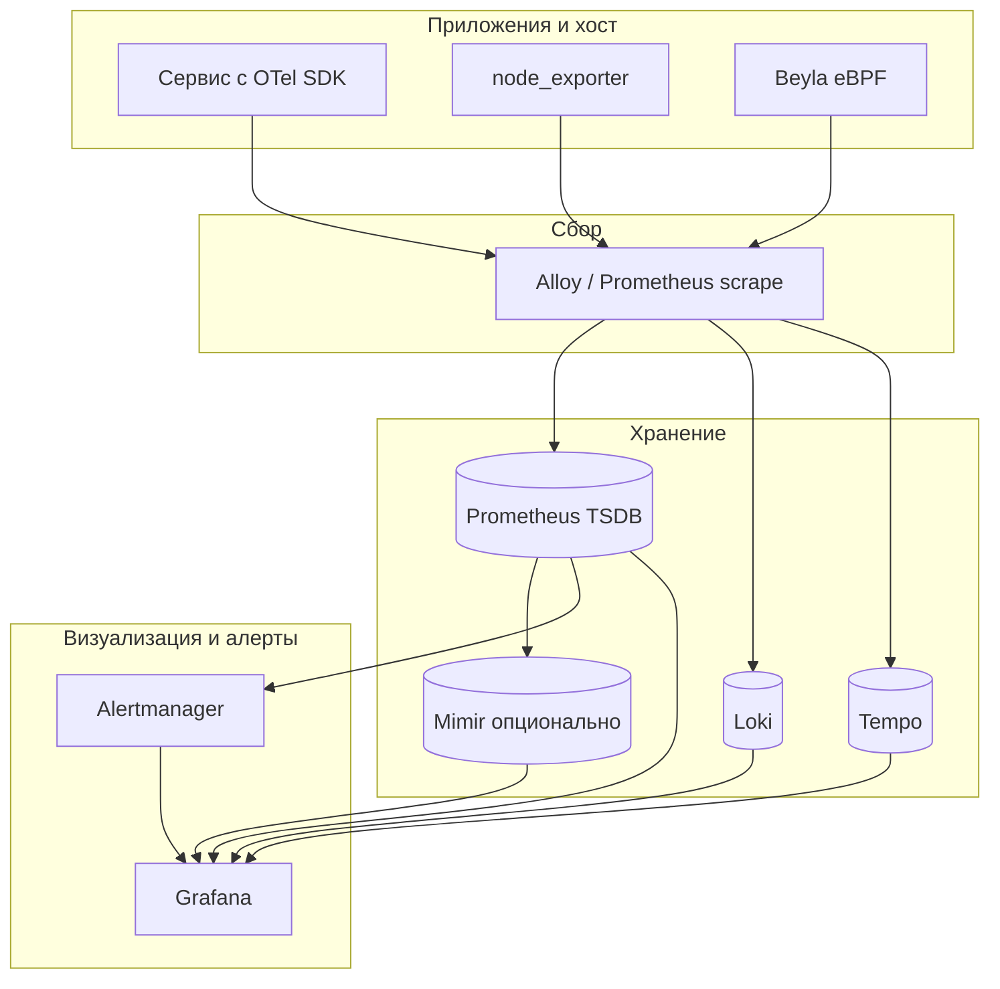

import DocCardList from '@theme/DocCardList';

# О разделе

Здесь — **практикум по Prometheus, Grafana и экосистеме наблюдаемости** для инженера и разработчика, который поднимает **cloud-native мониторинг** на учебном стенде. Маршрут ведёт от первого scrape до корреляции метрик, логов и трассировок и к нагрузочному тесту с k6.

Общая теория pull/push, PromQL и PLG-стека уже есть в [Мониторинг, метрики и логирование систем](../92.md). Этот раздел **не дублирует** сравнение Zabbix и Prometheus — он учит **руками собрать стек** по официальным гайдам Prometheus и Grafana.

Перед `docker compose up` на стенде — [Запуск и перезапуск приложений](/encyclopedia/1-basics/1-12-sovety-dlya-novichka/13) (терминал, порты, остановка).

  
Стек уже поднят?

  

  Переходите сразу к [Как пользоваться](./usage.md) — два URL, `up`, добавление своего сервиса, Explore и дашборд.
  

  
Для кого раздел

  

  Нужны понимание [HTTP и портов](../6.md) и **Docker Compose** ([контейнеризация](/encyclopedia/8-infra-security/8-06-konteynerizatsiya-i-orkestratsiya/intro), [готовые стеки](/lab/Примеры/11111)). Подойдут Linux VM, WSL2 или **Windows 10/11 + Docker Desktop** — минимальный стенд из [шага 2](./2.md) проверен на последнем: нестандартные порты, **windows_exporter**, русский UI Grafana 12, provisioning дашборда Windows.
  

---

## Сценарий учебного стенда

| Компонент | Роль | Порт внутри контейнера | Порт на хосте |
|-----------|------|------------------------|---------------|
| **Prometheus** | Сбор метрик (pull), TSDB, правила | 9090 | **свободный** `<PORT_PROM>` (часто 9090 или альтернатива, если занят) |
| **Grafana** | Дашборды, Explore, Unified Alerting | 3000 | **свободный** `<PORT_GRAFANA>`; образ **12+** для `ru-RU` |
| **windows_exporter** | Метрики Windows-хоста (вне Docker) | — | **свободный** `<PORT_WIN_EXP>` (шаг 5, Windows) |
| **Alertmanager** | Маршрутизация алертов Prometheus | 9093 | 9093 (шаг 6) |
| **node_exporter** | Метрики ОС Linux | 9100 | 9100 (шаг 5) |
| **Loki** | Хранение и запрос логов | 3100 | 3100 (шаг 7) |
| **Tempo** | Распределённые трассировки | 3200 / 4317 | по compose (шаг 7) |
| **Alloy** | Единый агент сбора | 12345 | по compose (шаг 8) |
| **Mimir** (опционально) | Долгосрочные метрики | 9009 | по compose (шаг 7) |

Схема потока данных на финальном шаге:

---

## Маршрут по шагам

| Шаг | Статья | Содержание |
|-----|--------|------------|
| 1 | [Архитектура Prometheus](./1.md) | Pull-модель, TSDB, exporters, Pushgateway, место в observability |
| 2 | [Установка и первые метрики](./2.md) | Compose (Windows/Linux), структура каталога, Prometheus + Grafana, provisioning, health check |
| — | [**Как пользоваться**](./usage.md) | UI Prometheus и Grafana, добавить target, Explore, дашборд, шпаргалка |
| 3 | [Типы метрик и PromQL](./3.md) | Counter, Gauge, Histogram, Summary, `rate()`, агрегации |
| — | [**Prometheus + Grafana — запросы**](/lab/Примеры/11114) | Галерея PromQL и панелей с построчным разбором (параллельно шагам 3–6) |
| 4 | [Grafana — источники и дашборды](./4.md) | Проверка datasource, панель `up`, Explore, импорт |
| 5 | [Экспортёры и инструментирование](./5.md) | node_exporter, blackbox, client libraries, `/metrics` |
| 6 | [Алертинг](./6.md) | Alertmanager, правила Prometheus, Grafana Alerting |
| 7 | [Loki, Tempo и Mimir](./7.md) | Логи, трейсы, долгосрочные метрики, LogQL, корреляция в Grafana |
| 8 | [Alloy, Beyla, Faro и Pyroscope](./8.md) | Единый агент, eBPF, RUM, профилирование |
| 9 | [OpenTelemetry, k6 и итоговый стенд](./9.md) | OTel Collector, нагрузочный тест, compose «всё в одном» |

---

## Что понадобится

- **Docker Desktop** (Windows/macOS) или Docker Engine + Compose v2 (Linux/WSL)
- Свободные порты на хосте для UI Prometheus и Grafana
- Каталог проекта с YAML-конфигами (структура — [шаг 2](./2.md))
- Браузер

  
Официальные материалы

  

  База — [документация Prometheus](https://prometheus.io/docs/), [Getting started](https://prometheus.io/docs/prometheus/latest/getting_started/), [First steps](https://prometheus.io/docs/introduction/first_steps/), [Grafana docs](https://grafana.com/docs/), туториалы [метрики](https://prometheus.io/docs/tutorials/understanding_metric_types/), [Grafana](https://prometheus.io/docs/tutorials/visualizing_metrics_using_grafana/), [алерты](https://prometheus.io/docs/tutorials/alerting_based_on_metrics/). Полезен обзорный [Prometheus workshop](https://github.com/juliusv/prometheus_workshop/blob/master/workshop.md).
  

---

## Как учиться по разделу

1. Прочитайте [шаг 1](./1.md) и сверьте термины с [теорией Prometheus](../92.md#prometheus).
2. Поднимите Prometheus **и Grafana** по [шагу 2](./2.md) — health check и target **UP**.
3. Пройдите [**Как пользоваться**](./usage.md) — targets, `up`, Explore, первый target своего сервиса.
4. Отработайте PromQL из [шага 3](./3.md) и дашборды из [шага 4](./4.md).
5. Добавьте `node_exporter` и `/metrics` из [шага 5](./5.md).
6. Настройте алерт в [шаге 6](./6.md).
7. Расширьте стенд Loki + Tempo по [шагу 7](./7.md).
8. Попробуйте Alloy / Beyla / Faro из [шага 8](./8.md) по желанию.
9. Закройте маршрут [шагом 9](./9.md) — OTel, k6 и единый `docker-compose`.

<DocCardList />

---

## Связь с теорией

| Тема | Материалы энциклопедии |
|------|-------------------------|
| Метрики, observability, PLG | [Мониторинг, метрики и логирование систем](../92.md) |
| Корпоративный мониторинг (Zabbix) | [Практикум Zabbix](../zabbix-praktikum/intro.md) |
| DevOps и пайплайны | [8-04 DevOps](/encyclopedia/8-infra-security/8-04-devops-ci-cd/19) |
| Kubernetes (service discovery) | [8-06 Контейнеризация](/encyclopedia/8-infra-security/8-06-konteynerizatsiya-i-orkestratsiya/intro) |
| Наблюдаемость бэкенда | [1-23 Бэкенд](/encyclopedia/1-basics/1-23-frontend-i-bekend/9) |

---
