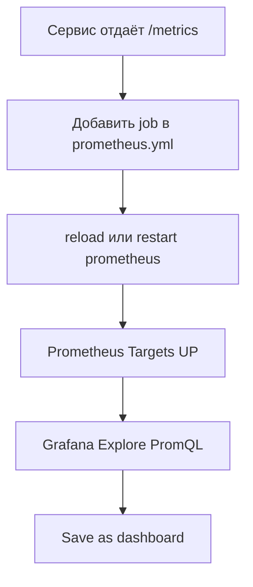

# Практикум Prometheus и Grafana — как пользоваться

<div class="article-tags">
  <span class="tag tag-required">ОБЯЗАТЕЛЬНО</span>
  <span class="tag tag-beginner">ДЛЯ НОВИЧКОВ</span>
</div>

<span class="complexity-badge">Инженеру</span>
<span class="complexity-badge">Разработчику</span>

> Стек уже поднят по [шагу 2](./2.md)? Эта статья — **первый день с UI**: куда кликать, как добавить сервис, как дойти до дашборда.

---

## Два инструмента — две роли

| Инструмент | URL (на вашем хосте) | Зачем |
|------------|----------------------|-------|
| **Prometheus** | `http://localhost:<PORT_PROM>` | Собирает и хранит метрики, PromQL, targets, алерты |
| **Grafana** | `http://localhost:<PORT_GRAFANA>` | Графики, дашборды, Explore, алерты Grafana |

Логика простая: **Prometheus** pull-ит метрики с `/metrics` (или exporters), **Grafana** рисует их и объединяет с логами и трейсами на следующих шагах практикума.

<div class="callout callout--info">
  <div class="callout-title">Пример портов</div>

  Если `9090` и `3000` на машине заняты, в Compose часто ставят другие **внешние** порты — например `9189→9090` и `8347→3000`. Внутри Docker Prometheus всё равно на `9090`, Grafana на `3000`. Конкретные `<PORT_*>` вы задавали при [установке](./2.md).
</div>

---

## С чего начать

### 1. Prometheus — проверить, что всё живо

Откройте `http://localhost:<PORT_PROM>`.

**Status → Targets**

Сейчас минимум один target — `prometheus` (сам себя). После [windows_exporter](./5.md#windows_exporter-на-windows) появится job `windows`. Все должны быть **UP**.

**Graph** (вверху)

Введите запрос и нажмите **Execute**:

```promql
up
```

Если видите `up&#123;job="prometheus"&#125; 1` — Prometheus работает. С windows_exporter также `up&#123;job="windows"&#125; 1`.

**Status → Configuration**

Здесь видно, откуда Prometheus читает конфиг (`prometheus.yml` на хосте смонтирован в контейнер).

---

### 2. Grafana — войти и проверить datasource

Откройте `http://localhost:<PORT_GRAFANA>`.

- **Логин:** `admin` / `admin` (смена пароля при первом входе — по желанию).

**Connections → Data sources**

Должен быть **Prometheus (Default)**. **Save & test** → «Successfully queried the Prometheus API».

**Explore** (иконка компаса слева)

- Datasource — **Prometheus**
- Запрос — `up`
- **Run query** — график или таблица с `up&#123;job="prometheus"&#125; 1`

Подробнее про первую панель и дашборд — [шаг 4](./4.md).

---

## Русский интерфейс Grafana

Если при [установке](./2.md) заданы `grafana/grafana:12.0.0` и `GF_USERS_DEFAULT_LANGUAGE: ru-RU`, меню Grafana («Дашборды», «Обзор», «Подключения») отображается на русском.

| Что переводится | Что остаётся на английском |
|-----------------|----------------------------|
| Меню и настройки Grafana | Prometheus UI |
| Стандартные экраны алертов | Имена метрик (`windows_cpu_time_total`, …) |
| | Заголовки панелей в импортированных JSON-дашбордах |

**Если всё ещё английский:**

1. **`Ctrl+F5`** в браузере.
2. Профиль (иконка пользователя) → **Язык** → **Русский** → сохранить.
3. Проверить образ: `curl.exe -s http://localhost:<PORT_GRAFANA>/api/health` — в JSON поле `version` должно быть **12.x** или новее.
4. Не использовать `GF_DEFAULT_LOCALE` — Grafana её не читает; нужна **`GF_USERS_DEFAULT_LANGUAGE`**.

Вернуть английский: `GF_USERS_DEFAULT_LANGUAGE: en-US` и `docker compose up -d grafana`.

---

## Метрики Windows-хоста (windows_exporter)

Prometheus и Grafana в Docker **сами не собирают** CPU, RAM, диски и сеть вашего Windows-ПК. Нужен агент на хосте — [windows_exporter](https://github.com/prometheus-community/windows_exporter).

### Быстрый путь

1. В [шаге 2](./2.md) уже должны быть `extra_hosts` у Prometheus и job `windows` в `prometheus.yml`.
2. Установите exporter ([подробно в шаге 5](./5.md#windows_exporter-на-windows)):

```powershell
cd <каталог-проекта>
.\scripts\install-windows-exporter.ps1 -Mode Portable
```

**Portable** — без прав администратора, процесс не переживает перезагрузку ПК. **Service** — Windows-сервис (PowerShell от администратора), автозапуск после reboot.

3. Проверка:

```powershell
curl.exe -s -o NUL -w "exporter: %{http_code}\n" http://localhost:<PORT_WIN_EXP>/metrics
curl.exe -X POST http://localhost:<PORT_PROM>/-/reload
```

4. **Prometheus → Status → Targets** — job `windows` → **UP** (подождите 15–30 с после scrape interval).

5. **Grafana → Dashboards → Windows → Windows Exporter Dashboard** (если настроен [provisioning](./2.md) с JSON из Grafana.com **14694**).

### Примеры PromQL для Windows

Готовые запросы с разбором (Linux и HTTP) — [галерея Lab](/lab/Примеры/11114). Ниже — фрагменты для **windows_exporter**:

```promql
up{job="windows"}
windows_cpu_time_total
windows_logical_disk_free_bytes
rate(windows_net_bytes_received_total[5m])
```

### Если папка Windows в Grafana пустая

В логах Grafana часто: `invalid character 'ï' looking for beginning of value` — JSON дашборда сохранён с **UTF-8 BOM**. Пересохраните без BOM и перезапустите Grafana:

```powershell
$path = "<каталог-проекта>\grafana\provisioning\dashboards\json\windows-exporter.json"
$content = [System.IO.File]::ReadAllText($path)
$utf8NoBom = New-Object System.Text.UTF8Encoding($false)
[System.IO.File]::WriteAllText($path, $content, $utf8NoBom)
docker compose restart grafana
```

Диагностика: `docker compose logs grafana --since 2m | Select-String "failed to load|provisioning.dashboard"`

---

### Шаг 1. Сервис отдаёт метрики

Обычно это HTTP-эндпоинт **`/metrics`** в формате Prometheus.

| Вариант | Примеры |
|---------|---------|
| Библиотека в коде | Node.js `prom-client`, Python `prometheus_client`, .NET `prometheus-net` |
| Exporter рядом с системой | `node_exporter`, `postgres_exporter`, `redis_exporter` |

Пример: приложение на хосте слушает `http://localhost:8080/metrics`.

---

### Шаг 2. Добавить target в Prometheus

Отредактируйте `prometheus/prometheus.yml`:

```yaml
scrape_configs:
  - job_name: prometheus
    static_configs:
      - targets:
          - localhost:9090

  - job_name: my-app
    static_configs:
      - targets:
          - host.docker.internal:8080
```

`host.docker.internal` — имя хоста **из контейнера** на Windows/macOS (Docker Desktop). Prometheus в Docker так достучится до сервиса на вашем ПК.

Если сервис **тоже в Compose** — используйте **имя сервиса**, не `localhost`:

```yaml
  - job_name: my-app
    static_configs:
      - targets:
          - my-app:8080
```

На Linux иногда нужен `extra_hosts: ["host.docker.internal:host-gateway"]` у сервиса `prometheus` — см. [шаг 2](./2.md).

---

### Шаг 3. Применить конфиг

Из каталога проекта:

```powershell
docker compose restart prometheus
```

Или без рестарта (если включён `--web.enable-lifecycle`):

```powershell
curl.exe -X POST http://localhost:<PORT_PROM>/-/reload
```

```bash
curl -X POST http://localhost:<PORT_PROM>/-/reload
```

---

### Шаг 4. Проверить в Prometheus

**Status → Targets** — job `my-app` должен стать **UP**.

Если **DOWN** — сервис не отвечает, неверный порт, firewall или неверный адрес (`host.docker.internal` vs имя сервиса).

---

## Как смотреть метрики в Grafana

### Быстрый просмотр (Explore)

1. **Explore** → datasource **Prometheus**
2. Запрос, например:

```promql
rate(http_requests_total[5m])
```

или имя метрики, если знаете:

```promql
process_cpu_seconds_total
```

3. **Run query** → переключайте **Graph** / **Table**

---

### Создать дашборд

1. **Dashboards → New → New dashboard**
2. **Add visualization**
3. Datasource — **Prometheus**
4. PromQL, например:

```promql
up{job="my-app"}
```

5. **Apply → Save dashboard**

---

### Импорт готового дашборда

1. **Dashboards → New → Import**
2. ID с [grafana.com/grafana/dashboards](https://grafana.com/grafana/dashboards/)

| ID | Название |
|----|----------|
| **1860** | Node Exporter Full (Linux) |
| **14694** | Windows Exporter Dashboard |
| **893** | Docker |
| **3662** | Prometheus 2.0 Overview |

3. Datasource — **Prometheus** → **Import**

---

## Шпаргалка по UI

### Prometheus — `http://localhost:<PORT_PROM>`

| Раздел | Что там |
|--------|---------|
| **Graph** | Запросы PromQL, графики |
| **Status → Targets** | Какие сервисы мониторятся, UP/DOWN |
| **Status → Configuration** | Текущий конфиг |
| **Alerts** | Алерты Prometheus (после [шага 6](./6.md)) |

### Grafana — `http://localhost:<PORT_GRAFANA>`

| Раздел | Что там |
|--------|---------|
| **Explore** | Быстрые ad-hoc запросы |
| **Dashboards** | Сохранённые дашборды |
| **Connections → Data sources** | Откуда Grafana берёт данные |
| **Alerting** | Алерты Grafana (отдельно от Prometheus) |

---

## Типичный рабочий процесс



1. Поднять сервис с `/metrics`
2. Добавить target в `prometheus.yml`
3. `reload` / `restart prometheus`
4. **Prometheus → Targets** — проверить **UP**
5. **Grafana → Explore** — написать PromQL
6. Понравилось → сохранить как dashboard

---

## Что добавить дальше

| Задача | Куда |
|--------|------|
| Метрики **Windows**-хоста (CPU, RAM, диск) | [windows_exporter](./5.md#windows_exporter-на-windows) — job `windows`, `<PORT_WIN_EXP>` |
| Метрики **Linux**-хоста | [node_exporter](./5.md) — job `node`, порт `9100` |
| PostgreSQL, Redis, nginx | Готовые exporters — отдельный `job_name` ([шаг 5](./5.md)) |
| Алерты | [Alertmanager + правила](./6.md) или Grafana Alerting |
| Логи и трейсы | [Loki, Tempo](./7.md) |

Пример job для windows_exporter (из контейнера Prometheus):

```yaml
  - job_name: windows
    static_configs:
      - targets:
          - host.docker.internal:<PORT_WIN_EXP>
```

Пример job для node_exporter на Linux-хосте:

```yaml
  - job_name: node
    static_configs:
      - targets:
          - host.docker.internal:9100
```

---

## Полезные PromQL-запросы для начала

| Запрос | Смысл |
|--------|-------|
| `up` | Кто жив (`1` = UP, `0` = DOWN) |
| `up&#123;job="my-app"&#125;` | Конкретный job приложения |
| `up&#123;job="windows"&#125;` | Windows exporter жив |
| `windows_logical_disk_free_bytes` | Свободное место на диске (Windows) |
| `rate(http_requests_total[5m])` | RPS за 5 минут |
| `process_resident_memory_bytes` | Память процесса (если метрика есть) |
| `prometheus_tsdb_head_series` | Сколько временных рядов в TSDB |

Разбор типов метрик и `rate()` — [шаг 3](./3.md).

---

## Куда дальше по практикуму

| Цель | Статья |
|------|--------|
| Установка и health check | [Шаг 2](./2.md) |
| PromQL глубже | [Шаг 3](./3.md) |
| Дашборды и переменные | [Шаг 4](./4.md) |
| Exporters и `/metrics` в коде | [Шаг 5](./5.md) |
| Алерты | [Шаг 6](./6.md) |

<div class="callout callout--tip">
  <div class="callout-title">Под свой стенд</div>

  Если мониторите конкретно **приложение на Windows**, **Docker** или **PostgreSQL** — начните с [шага 5](./5.md): там те же `prometheus.yml` jobs, но с готовыми exporters и примерами instrumentation.
</div>

---
