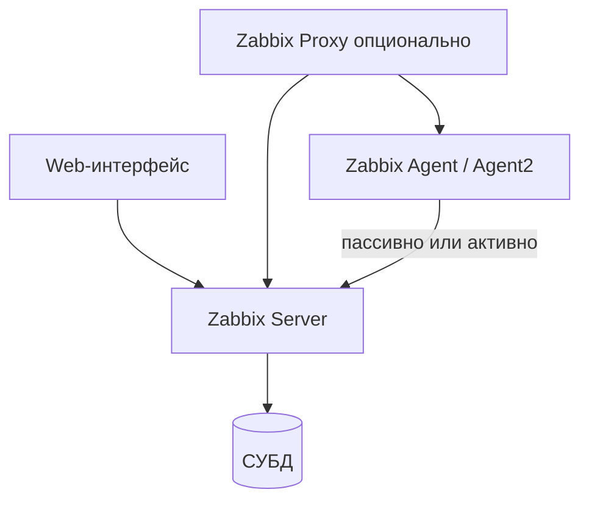

# Практикум Zabbix — что это и как работает

  ОБЯЗАТЕЛЬНО
  ДЛЯ НОВИЧКОВ

Инженеру

> **Практикум, шаг 1 из 6.** Дальше — [установка](./2.md).

---

## Зачем Zabbix

**Zabbix** — система мониторинга с открытым исходным кодом для **доступности и производительности** ИТ-инфраструктуры: серверы, сетевое оборудование, виртуализация, приложения, веб-сайты. В отличие от связки Prometheus + Grafana, Zabbix даёт **единый веб-интерфейс** для конфигурации, графиков, карт сети, SLA и оповещений — без отдельного «слоя визуализации».

Суть работы в одной цепочке:

1. **Собрать** значения (CPU, место на диске, HTTP-код, SNMP-контр).
2. **Сохранить** историю во встроенной БД (PostgreSQL, MySQL и др.).
3. **Оценить** правилами (триггеры).
4. **Сообщить** людям или ITSM при нарушении порога.

Подробное сравнение с Prometheus и Nagios — в [главе про мониторинг](../92.md#zabbix).

---

## Возможности

| Направление | Что даёт Zabbix |
|-------------|-----------------|
| **Сбор метрик** | Агенты на хостах, SNMP, IPMI, JMX, опрос API, разбор лог-файлов, выполнение скриптов на узле |
| **Оповещения** | Email, Telegram, Slack, SMS, интеграция с Jira, ServiceNow и др. через actions |
| **Визуализация** | Графики, сводные экраны (screens), карты (maps), дашборды |
| **Веб-мониторинг** | Сценарии «как пользователь» — время отклика, HTTP-статусы, проверка SSL-сертификатов |
| **Автообнаружение** | Сетевое discovery, LLD — новые диски, интерфейсы, контейнеры подхватываются шаблоном |

---

## Базовые компоненты

| Компонент | Назначение |
|-----------|------------|
| **Zabbix Server** | Ядро — расписание опросов, триггеры, actions, запись в БД |
| **Zabbix Agent / Agent 2** | Локальный сбор на узле (CPU, RAM, диски, сервисы). Agent 2 — современная ветка с плагинами |
| **Web-интерфейс** | Настройка, просмотр «Monitoring → Latest data», отчёты |
| **Zabbix Proxy** | Промежуточный узел в удалённом офисе или DMZ — буферизация и снижение нагрузки на центральный сервер |

Сервер **не заменяет** агент там, где нужны глубокие локальные метрики — он **координирует** опрос и хранит конфигурацию.

---

## Модель данных — четыре опоры

Практикум строится на четырёх сущностях. Их имена в UI совпадают с документацией:

| Сущность | Смысл | Пример |
|----------|-------|--------|
| **Host (узел)** | Объект мониторинга — сервер, коммутатор, сайт | `web-01.prod` |
| **Item (элемент данных)** | Что именно меряем и как часто | `system.cpu.util` каждые 60 с |
| **Trigger (триггер)** | Логическое условие на значениях | CPU > 90 % в течение 5 мин |
| **Template (шаблон)** | Переиспользуемый набор items, triggers, graphs | `Linux by Zabbix agent` |

Дополнительно:

- **Discovery** — правила автоматического создания items для новых объектов (диски, сетевые интерфейсы).
- **Action** — что делать при срабатывании триггера (письмо, скрипт, тикет).

---

## Пассивные и активные проверки

| Режим | Кто инициирует | Когда удобно |
|-------|----------------|--------------|
| **Пассивный** | Сервер подключается к агенту (порт 10050) | Лаборатория, DMZ с открытым портом к агенту |
| **Активный** | Агент сам отправляет данные на сервер (10051) | Фаерволы, NAT, много узлов за одним исходящим каналом |

В корпоративных сетях чаще включают **активные** проверки — см. [шаг 5](./5.md).

---

## Когда выбирать Zabbix

Zabbix уместен, если нужны:

- единая консоль для **серверов, сети и веб**;
- готовые **шаблоны** под Linux, Windows, MySQL, VMware;
- **карты** и SLA-отчёты для руководства;
- мониторинг **legacy** через SNMP и SSH без встраивания экспортёров в каждое приложение.

Для cloud-native микросервисов с PromQL и OpenTelemetry чаще берут Prometheus + Grafana — их роль в [92.md](../92.md) и [инструментах мониторинга](/tools/system/2).

---

## Что дальше

На [шаге 2](./2.md) развернём сервер и агенты по [официальному руководству по установке](https://www.zabbix.com/documentation/7.0/ru/manual/installation/getting_zabbix).

---
