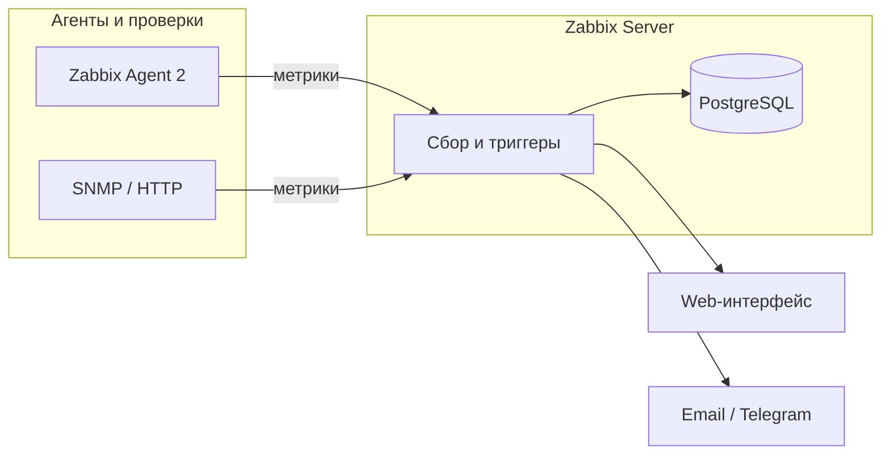

import DocCardList from '@theme/DocCardList';

# О разделе

Здесь — **практикум по Zabbix** для системного администратора и инженера, который впервые поднимает **корпоративный мониторинг** «под ключ». Вы пройдёте путь от установки сервера до рабочих графиков, триггеров и оповещений в Telegram или почту.

Общая теория метрик, Prometheus и Grafana уже разобрана в [92.md](../92.md). Этот маршрут **не повторяет** сравнение стеков — он учит **руками настроить Zabbix** по официальному quickstart Zabbix 7.0.

Службы, контейнеры и «не закрывать терминал» — [Запуск и перезапуск приложений](/encyclopedia/1-basics/1-12-sovety-dlya-novichka/13).

  
Для кого раздел

  Материал рассчитан на тех, кто знаком с [Linux](../93.md), базовой [сетью](../6.md) и понимает, зачем нужен [мониторинг](../92.md). Достаточно одной виртуальной машины с Linux (сервер Zabbix) и второй машины или контейнера под агент.

---

## Сценарий учебного стенда

| Компонент | Роль | Минимум |
|-----------|------|---------|
| **zabbix-server** | Сервер + веб-интерфейс + PostgreSQL | Ubuntu 22.04 / Debian 12, 2 vCPU, 4 GB RAM |
| **linux-host** | Узел с Zabbix Agent 2 | Любой Linux в той же сети |
| **win-host** (опционально) | Узел с агентом Windows | Windows 10/11 или Server |

Схема потока данных:

---

## Маршрут по шагам

| Шаг | Статья | Содержание |
|-----|--------|------------|
| 1 | [Что такое Zabbix и как устроен](./1.md) | Суть системы, возможности, компоненты, модель host → item → trigger |
| 2 | [Установка сервера и агентов](./2.md) | Пакеты, Docker, агенты Linux / Windows / macOS |
| 3 | [Первый хост, элемент и триггер](./3.md) | Вход в UI, регистрация узла, сбор CPU, условие срабатывания |
| 4 | [Шаблоны и оповещения](./4.md) | Готовые наборы метрик, actions, media types, Telegram |
| 5 | [Мониторинг Linux и Windows](./5.md) | Шаблоны ОС, активные проверки, журнал событий Windows |
| 6 | [Веб-проверки и автодобнаружение](./6.md) | HTTP-сценарии, LLD, дашборды, карты |

---

## Что понадобится

- Виртуальная машина или VPS с **Ubuntu 22.04 LTS** или **Debian 12** (для сервера)
- Доступ по SSH и права `sudo`
- Второй хост или контейнер для проверки агента
- Браузер для веб-интерфейса Zabbix

  
Официальная документация

  Весь практикум опирается на [руководство Zabbix 7.0 (RU)](https://www.zabbix.com/documentation/7.0/ru/manual). Блок [Быстрый старт — базовая настройка](https://www.zabbix.com/documentation/7.0/ru/manual/quickstart/basic_config/login) — главный ориентир для шагов 3–4.

---

## Как учиться по разделу

1. Прочитайте [шаг 1](./1.md) и сверьте термины с [теорией мониторинга](../92.md#zabbix).
2. Разверните сервер по [шагу 2](./2.md) — пакеты или Docker, как удобнее.
3. Пройдите [шаг 3](./3.md) на чистой установке: один хост, один item, один trigger.
4. Подключите шаблоны и оповещения из [шага 4](./4.md).
5. Добавьте Linux- и Windows-узлы по [шагу 5](./5.md).
6. Закройте маршрут веб-проверками и дашбордами из [шага 6](./6.md).

<DocCardList />

---

## Связь с теорией

| Тема | Материалы энциклопедии |
|------|-------------------------|
| Метрики, алерты, observability | [92.md](../92.md), [DevOps 19](/encyclopedia/8-infra-security/8-04-devops-ci-cd/19), [Практикум Prometheus и Grafana](../prometheus-grafana-praktikum/intro.md), [PromQL — галерея](/lab/Примеры/11114) |
| Linux, systemd, логи | [93.md](../93.md), [9.md](../9.md) |
| SNMP, сеть | [6.md](../6.md) |
| Инциденты из мониторинга | [Техподдержка 118](/encyclopedia/2-system-network/2-07-tehnicheskaya-podderzhka/118) |
| Справочник термина | [Zabbix в глоссарии](/glossary/Z#zabbix) |

---
