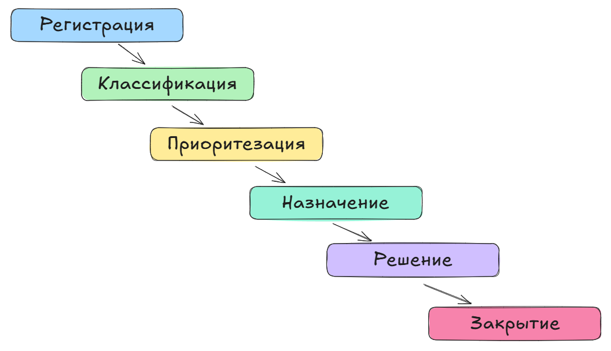

# Приём и обработка пользовательских обращений

<div class="article-tags">
  <span class="tag tag-required">ОБЯЗАТЕЛЬНО</span>
  <span class="tag tag-beginner">ДЛЯ НОВИЧКОВ</span>
</div>

<span class="complexity-badge">Разработчику</span>
<span class="complexity-badge">Архитектору</span>
<span class="complexity-badge">Инженеру</span>


## Обработка обращений

### Что такое обработка обращений

**Обработка обращений** — это централизованный процесс приёма, учёта, анализа и разрешения запросов от пользователей, связанных с нарушением или ухудшением работы ИТ-услуг. Он является ядром операционной деятельности технической поддержки и напрямую входит в состав дисциплины управления инцидентами (Incident Management) в рамках методологии ITSM (IT Service Management).

Ключевая цель обработки обращений — восстановить нормальное функционирование сервиса в кратчайшие сроки при минимальном воздействии на бизнес-деятельность. Для достижения этой цели используется структурированный подход, основанный на управлении полным жизненным циклом обращения.

**Жизненный цикл обращения** — это последовательность контролируемых этапов, через которые проходит каждый зарегистрированный запрос пользователя, начиная с момента его поступления и заканчивая финальным закрытием и, при необходимости, оценкой эффективности проведённых действий. Данный цикл обеспечивает прозрачность, прослеживаемость и управляемость процесса поддержки.

В рамках стандартизированных практик ITSM (в частности, ITIL) жизненный цикл инцидента традиционно включает следующие этапы:
	- Создание (Creation)
	- Классификация (Classification)
	- Приоритизация (Prioritization)
	- Назначение (Assignment)
	- Диагностика (Diagnosis)
	- Решение (Resolution)
	- Закрытие (Closure)
	- Оценка (Post-Incident Review / Evaluation)

Эта модель позволяет оперативно реагировать на инциденты и анализировать их причины, выявлять системные проблемы и предотвращать повторные сбои.

Однако на практике, особенно в организациях со средним уровнем зрелости процессов, диагностика часто интегрируется в этап решения, а фаза оценки — применяется выборочно, в случае критических инцидентов. В целях упрощения и концентрации на основных управленческих вехах в данном материале рассматривается адаптированная последовательность:
```
Регистрация → Классификация → Приоритезация → Назначение → Решение → Закрытие
```



---

Теперь рассмотрим каждый из них.

### 1. Регистрация

**Регистрация**. Цель - фиксация обращения клиента и сбор базовой информации.

Действия:
	- Создание записи в системе (тикета).
	- Указание контактных данных клиента (имя, email, номер телефона).
	- Описание проблемы или запроса.
	- Прикрепление дополнительных материалов (скриншоты, файлы, логи).

Регистрация позволяет отслеживать историю взаимодействия с клиентом, избежать потери данных и обеспечить прозрачность процесса. К примеру, клиент сообщает о проблеме с входом в систему. Специалист регистрирует обращение, указывая дату, время и описание: «Ошибка 'Неверный логин или пароль' при попытке авторизации».

Цель этапа регистрации — формализованная фиксация обращения пользователя в единой системе учёта, обеспечение его прослеживаемости и сбор достаточного объёма информации для последующей обработки. Это первый и обязательный шаг жизненного цикла любого инцидента или запроса в рамках ITSM. Без корректной регистрации невозможно обеспечить контроль за выполнением, соблюдение SLA, анализ нагрузки или восстановление истории взаимодействия.

Регистрация осуществляется вне зависимости от канала поступления обращения: будь то телефонный звонок, электронная почта, чат (в том числе через веб-портал или мессенджер), форма на сайте, API-интеграция или автоматическое оповещение от системы мониторинга. Несмотря на разнообразие каналов, принципы регистрации остаются унифицированными — каждое обращение должно быть представлено в виде структурированной записи, называемой тикетом (ticket), независимо от источника. Сейчас системы позволяют всё сводить в «единое окно» с разных каналов подачи.
Чтобы процесс поддержки был управляемым, на этапе регистрации необходимо собрать минимальный, но достаточный набор данных.

Идентификация пользователя: ФИО, идентификатор в системе (например, ID клиента или логин), должность, подразделение (для внутренних пользователей). Это позволяет проверить права доступа, уровень обслуживания (SLA) и историю предыдущих обращений.

Контактные данные: email, номер телефона, альтернативные каналы связи. Необходимы для обратной коммуникации, особенно если решение требует дополнительных уточнений или не может быть предоставлено немедленно.

Описание проблемы или запроса: чёткое, информативное изложение сути вопроса. Желательно в форме, близкой к шаблону: «что делал пользователь», «что произошло», «когда впервые возникло», «воспроизводится ли регулярно». Например: «При попытке входа в CRM-систему по ссылке https://crm.example.com появляется ошибка "403 Forbidden". Проблема возникла сегодня в 10:15. Повторяется на всех устройствах».
На практике, конечно, они всегда нечёткие.

Система или сервис, к которому относится обращение: указание конкретного приложения, платформы, модуля или устройства. Это критично для правильной маршрутизации.

Дополнительные материалы: скриншоты, видео, файлы конфигурации, логи, HTTP-заголовки, коды ошибок. Особенно важны при диагностике технических сбоев.

Наверняка вы обращались в поддержку хоть раз. Указывали ли вы всё это? Разумеется, нет. Поэтому надо стараться, чтобы сбор был автоматизированным, и не вынуждал пользователя всё это заполнять.

В современных условиях пользователи могут обращаться через различные каналы, и система поддержки должна обеспечивать канально-независимую регистрацию.

При звонке специалист Helpdesk открывает тикет вручную, заполняя все поля на основе устной информации. Важно сразу уточнить контактные данные и суть проблемы до завершения разговора.

При электронной почте система автоматически создаёт тикет на основе входящего письма, присваивает уникальный ID и сохраняет переписку как часть истории. Ответы пользователя будут добавляться к тому же тикету, что обеспечивает непрерывность диалога.

В случае чат-поддержки (веб-чат, мессенджер, Slack-бот) сообщения автоматически ассоциируются с тикетом в реальном времени. Диалог становится частью карточки обращения, а после передачи в ручную обработку — продолжается в той же системе.

Через самообслуживание (self-service portal) пользователь сам заполняет форму, прикрепляет файлы и получает номер тикета — это снижает нагрузку на операторов и повышает точность данных.

На этапе регистрации также определяется дальнейшая стратегия взаимодействия:
	- Мгновенное решение (immediate resolution). Некоторые запросы могут быть закрыты сразу: например, консультация по функционалу, сброс пароля через автоматизированную форму, направление на документацию. Если проблема решена в ходе первого контакта, тикет всё равно регистрируется и закрывается с пометкой «решено» — это важно для аналитики и учёта нагрузки.
	- Передача на разбор (escalation or investigation). Более сложные случаи требуют времени: диагностики, взаимодействия с другими командами, анализа логов. В этом случае тикет создаётся с пониманием, что ответ будет дан позже. Канал связи (email, чат) служит средством получения запроса и каналом обратной доставки решения. Именно поэтому регистрация включает обязательное указание способа связи — чтобы знать, куда и как вернуться к пользователю.
	
Таким образом, регистрация исключает потерю обращений, обеспечивает единое информационное пространство и позволяет строить отчёты по нагрузке, типам инцидентов, эффективности поддержки.

---

### 2. Классификация

Цель этапа классификации — однозначное отнесение зарегистрированного обращения к одной или нескольким категориям на основе его содержания, характера проблемы и контекста. Это ключевой шаг для обеспечения корректной маршрутизации, эффективного распределения нагрузки между командами и последующего анализа инцидентов.

Действия:
	- Разделение обращений по типам (например, технические ошибки, вопросы по функционалу, запросы на обучение).
	- Использование заранее определенных меток или тегов (например, «Ошибка сервера», «Проблема с интерфейсом»).

Классификация помогает направлять запросы к правильным специалистам и ускоряет процесс решения. К примеру, запрос «Не работает кнопка отправки формы» классифицируется как «UI/UX-проблема».

Без точной классификации невозможно автоматизировать процессы, построить осмысленную аналитику или выявить системные слабые места в ИТ-инфраструктуре. Ошибочная или отсутствующая категоризация приводит к задержкам, передазначению тикетов и увеличению времени восстановления сервиса (MTTR).

Классификация осуществляется на основе заранее утверждённой таксономии — набора категорий, подкатегорий и тегов, унифицированных по всей службе поддержки. Эти метки должны быть:
	- исчерпывающими (охватывать все типичные случаи),
	- непересекающимися (минимизировать двусмысленность),
	- понятными для всех уровней поддержки,
	- масштабируемыми (с возможностью добавления новых категорий).

В большинстве ITSM-систем классификация реализуется через комбинацию полей и тегов, позволяющих описать обращение с разных сторон.

Для комплексного описания обращения используется многомерная классификация — то есть каждый тикет может быть помечен по нескольким независимым осям:

По типу обращения
	- Инцидент (Incident) — любое событие, приводящее к нарушению или потенциальному нарушению нормального функционирования ИТ-услуги. Пример: «Сайт недоступен», «Приложение зависает при загрузке файла».
	- Запрос на обслуживание (Service Request / ЗНО) — запрос на предоставление стандартной услуги, не связанной с отказом. Пример: «Выдать доступ к папке», «Установить ПО», «Сменить пароль».
	- Вопрос / Консультация — запрос информации, не требующий изменения конфигурации или вмешательства в систему. Пример: «Как экспортировать отчёт?», «Есть ли мобильное приложение?»

По области воздействия (техническая доменная зона):
	- Сервер — проблемы с физическими или виртуальными серверами, хостингом, ОС.
	- Сеть — сбои в маршрутизации, доступе к ресурсам, DNS, VPN, пропускной способности.
	- Программное обеспечение (ПО) — ошибки в работе приложений, баги интерфейса, логики.
	- Безопасность — подозрительная активность, блокировка аккаунта, запросы на аудит.
	- Клиентское устройство — проблемы на стороне пользователя: ПК, телефон, браузер, версия ОС.
	- Интеграция — сбои между системами, API-ошибки, форматы данных.

По источнику поступления:
	- Пользователь — обращение инициировано конечным пользователем (вручную).
	- Система мониторинга — автоматическое создание тикета на основе алерта (например, из Zabbix, Prometheus, Datadog).
	- Автоматизированная система — интеграция с CI/CD, SIEM, EDR и другими платформами, генерирующая события без участия человека.

Также бывает и по уровню специализации - Frontend, Backend, Базы данных, Аутентификация, Отчёты и др. — используется для глубокой маршрутизации внутри технических команд.

Пример: пользователь сообщает, что «не может отправить форму заявки — кнопка не реагирует».

На этапе классификации это обращение будет помечено как:
	- Тип: Инцидент
	- Область: ПО → Веб-интерфейс
	- Подкатегория: UI/UX-проблема
	- Источник: Пользователь

Такая разметка позволяет системе автоматически направить тикет в команду фронтенд-разработчиков или L2-поддержки, отвечающей за клиентский слой.

На практике часть обращений изначально не может быть однозначно отнесена к категории — например, при недостатке информации или неоднозначной формулировке. Такие тикеты временно помещаются в состояние «Неклассифицировано» (Unclassified). Это допустимая промежуточная стадия. Однако длительное нахождение в этой категории свидетельствует о проблемах с качеством первичного сбора данных, компетенцией регистратора и нехваткой категории в таксономии.

Рекомендуется устанавливать SLA на классификацию (например, в течение 15–30 минут после регистрации), чтобы минимизировать время простоя в «серой зоне».

Правильно выполненная классификация ускоряет маршрутизацию за счёт автоматических правил (routing rules), повышает точность распределения нагрузки, позволяет строить аналитику по доменам (например, «70% инцидентов за месяц — по безопасности»), выявляет «узкие места» в архитектуре или процессах, служит основой для обучения моделей AIOps и чат-ботов.

---

### 3. Приоритизация

Цель этапа приоритизации — объективная оценка значимости обращения для бизнеса с целью определения очередности его обработки. В условиях ограниченных ресурсов и одновременного поступления множества запросов служба поддержки не может решать всё «сразу и одинаково». Приоритизация позволяет выстроить иерархию задач, направив усилия на устранение тех проблем, которые оказывают наибольшее негативное воздействие на деятельность пользователей или организацию в целом.

Действия:
	- Оценка влияния проблемы на бизнес клиента (например, критическая ошибка, блокирующая работу системы, или незначительный баг).
	- Учет контекста (например, количество затронутых пользователей, важность функционала).
	- Присвоение уровня приоритета (высокий, средний, низкий).

Приоритизация позволяет сосредоточить усилия на наиболее важных задачах и минимизировать негативное влияние на клиентов. Например, проблема с входом в систему для всех пользователей получает высокий приоритет, а запрос на изменение цвета кнопки — низкий.

Этот этап является ключевым для соблюдения SLA (Service Level Agreement) — договорённостей о сроках реакции и решения, а также для управления ожиданиями клиентов и внутренних стейкхолдеров.

Перед тем как перейти к методике, необходимо чётко разграничить три часто путаемых, но принципиально разных понятия - влияние, критичность и приоритет.

**Влияние (Impact)**, степень, в которой инцидент затрагивает бизнес-процессы, пользователей или сервисы. Оценивается по масштабу и глубине последствий. Пример: Полный простой CRM-системы влияет на всех менеджеров по продажам — высокое влияние. Ошибка в отображении аватара одного пользователя — низкое влияние.

**Критичность (Urgency / Severity)**, скорость, с которой необходимо решить проблему. Определяется тем, насколько быстро её устранение предотвратит дальнейшие потери. Пример: Утечка данных требует немедленного вмешательства — высокая критичность. Незначительная опечатка в интерфейсе может быть исправлена в рамках планового релиза — низкая критичность.

**Приоритет (Priority)**, результирующее значение, определяющее очерёдность обработки обращения. Формируется на основе комбинации влияния и критичности. Приоритет напрямую задаёт требования к SLA: срок первого ответа (First Response Time) и полного решения (Resolution Time).

Формула приоритизации: `Приоритет=Влияние×Критичность`.

Чем выше оба фактора, тем выше приоритет. Эта модель используется в большинстве ITSM-практик, включая ITIL.

Для стандартизации процесса применяются унифицированные шкалы. Наиболее распространённая — трёхуровневая:
	- низкий - единичный случай, некритичный функционал, и требуется решить в ближайшее время;
	- средний - группа пользователей, частичное нарушение функционала, желательно решить в течение дня;
	- высокий - все пользователи, критический сервис, остановка бизнес-процесса, и требуется решить немедленно.

ITSM определяет большее количество приоритетов - четыре.
	- P1 (Критический / Очень высокий). Сервис полностью недоступен, массовый сбой, угроза безопасности. Требует немедленного вмешательства. Пример: Падение основного сервера, блокировка всех учётных записей.
	- P2 (Высокий). Значительное нарушение работы, затрагивающее группу пользователей или ключевой функционал. Пример: Ошибка в расчёте зарплаты, сбой в отправке email-рассылок.
	- P3 (Средний). Локальная проблема, не блокирующая основную работу. Пример: Не отображается изображение в документе, зависание модуля при редком сценарии.
	- P4 (Низкий). Эстетические замечания, предложения по улучшению, консультации. Пример: «Можно ли изменить цвет кнопки?», «Где найти справку по экспорту?».
	
Уровень приоритета напрямую определяет SLA-метрики — согласованные сроки обслуживания, допустим 7 рабочих дней на P4 или 2 часа на P1. Эти значения могут варьироваться в зависимости от политики компании, типа сервиса и контрактных обязательств перед клиентами.

Рекомендуется проводить периодический пересмотр приоритетов, особенно при получении дополнительной информации или изменении обстановки.

Правильная приоритизация минимизирует простои критически важных сервисов, оптимизирует загрузку команд, обеспечивает прозрачность процесса для клиентов, позволяет контролировать выполнение SLA, формирует основу для отчётности и улучшения качества поддержки.


---

### 4. Назначение 

Цель этапа назначения — передача зарегистрированного и классифицированного обращения в руки ответственного исполнителя или команды, обладающей необходимыми компетенциями для его решения. Этот этап завершает процесс маршрутизации и открывает фазу активной работы над инцидентом или запросом.

Действия:
	- Назначение задачи конкретному сотруднику на основе его компетенций (например, фронтенд-разработчику, системному администратору или консультанту).
	- Использование автоматизированных систем для распределения задач.
	
Правильное назначение сокращает время на передачу запроса между специалистами и повышает эффективность решения. К примеру, техническая ошибка в API передается разработчику, а вопрос по настройке программы — консультанту службы поддержки.

Назначение является критическим звеном в цепочке обработки: даже при идеальной регистрации и классификации задержка на этом этапе напрямую увеличивает время реакции (First Response Time) и общее время устранения проблемы (MTTR). Ошибочное или несвоевременное назначение приводит к «пинг-понгу» тикетов между специалистами, дублированию усилий и снижению доверия пользователей к службе поддержки.

Рабочая группа (Working Group, WG) — это функционально выделенная команда специалистов, отвечающих за определённую область ИТ-инфраструктуры, сервиса или бизнес-процесса. Рабочие группы формируются по принципу технической или предметной экспертизы.

Каждая рабочая группа имеет чётко определённую зону ответственности (Service Ownership), внутренние SLA на обработку тикетов, доступ к соответствующим системам и документации, возможность эскалации к более высоким уровням (L3/L4).

Для корректного понимания механизма назначения необходимо уточнить ключевые элементы, с которыми работает система: тикет, теги и история тикета.

**Тикет (Ticket)** — уникальная запись в системе учёта обращений, представляющая собой полный жизненный цикл одного инцидента или запроса. Является основной единицей работы в ITSM.

**Теги (Tags)** — метки, присвоенные тикету на этапе классификации (например, api-error, authentication, high-priority). Используются для фильтрации, автоматизации и аналитики.

**История тикета (Audit Trail)** — хронологическая запись всех действий: изменений статуса, комментариев, переназначений, вложений. Обеспечивает прозрачность и аудируемость процесса.

Эти данные используются как при автоматическом, так и при ручном назначении.

**Автоназначение** — механизм, при котором ITSM-система автоматически направляет тикет в нужную рабочую группу или конкретному исполнителю на основе заранее заданных правил. Правила автоназначения могут быть основаны на категории, тегах, истории, нагрузке или графику дежурств. Автоназначение позволяет сократить время на ручную сортировку, минимизировать ошибки маршрутизации, обеспечить соблюдение SLA на первое назначение, масштабировать поддержку без пропорционального роста координирующего персонала.

Несмотря на развитие автоматизации, ручное назначение остаётся необходимым в ряде случаев при сложных или смешанных инцидентах, затрагивающих несколько областей, при отсутствии однозначной классификации, при необходимости координации между командами, в организациях с низкой зрелостью ITSM-процессов.

Часто ручное назначение выполняет координатор поддержки (аналог Service Desk Analyst или Team Lead), который анализирует содержание тикета, учитывает текущую нагрузку в командах, проверяет наличие свободных специалистов с нужной экспертизой, при необходимости создаёт мультидисциплинарные задачи или временные рабочие группы.

Также используется распределение по очереди (round-robin) или по графику дежурств, особенно в круглосуточных службах. Например, каждый день ответственность за входящие тикеты переходит к следующему инженеру в списке — это обеспечивает равномерную нагрузку.
В современных условиях некоторые тикеты требуют участия нескольких специалистов. В таких случаях возможно назначение основного исполнителя (Primary Assignee), отвечающего за прогресс и коммуникацию, добавление соисполнителей (CC, Watchers, Participants), создание связанных задач в других системах (например, Jira для разработки, Confluence для документации). Это особенно актуально при работе с инцидентами, затрагивающими несколько уровней стека (фронтенд, бэкенд, база данных, сеть).

Эффективное назначение сокращает время до первого контакта с ответственным, снижает количество переназначений (reassignments), повышает качество решения за счёт вовлечения профильных специалистов, упрощает отчётность и оценку нагрузки по командам, способствует соблюдению SLA и удовлетворённости клиентов.


---

### 5. Решение 

Цель этапа решения — устранить причину или следствие инцидента и восстановить нормальное функционирование ИТ-услуги в рамках согласованного уровня качества. Это ключевой операционный этап жизненного цикла обращения, на котором реализуется техническая экспертиза, координация действий и контроль результатов.

Действия:
	- Диагностика причины проблемы.
	- Выполнение необходимых действий (например, исправление кода, перезапуск сервера, предоставление инструкций клиенту).
	- Тестирование решения для проверки его корректности.

Этот этап напрямую влияет на удовлетворенность клиента и качество сервиса. После анализа логов выясняется, что проблема вызвана сбоем в базе данных. Специалист восстанавливает подключение и проверяет работу системы.

Решение не ограничивается простым «починить и закрыть». Оно включает диагностику, выполнение корректирующих действий, проверку их эффективности и, при необходимости, информирование пользователя. От качества этого этапа напрямую зависит удовлетворённость клиента (CSAT), время простоя сервиса (downtime) и уровень доверия к ИТ-службе.

Перед тем как применять исправления, необходимо понять источник сбоя. Диагностика может включать анализ логов (application logs, Система logs, audit trails), проверку метрик производительности (CPU, memory, latency, error rates), воспроизведение сценария у пользователя, использование отладочных инструментов (debuggers, packet analyzers, profilers), консультации с другими специалистами или командами. Цель — определить, является ли проблема единичной (например, ошибка конфигурации) или системной (например, дефект архитектуры или недостаток масштабируемости).

На основе диагностики применяется одно или несколько решений, зависящих от характера инцидента:
	- Операционные действия: перезапуск сервиса, переключение на резервный узел, очистка кэша, восстановление из резервной копии.
	- Изменение конфигурации: правка параметров сервера, обновление политик доступа, настройка таймаутов.
	- Исправление кода: если проблема вызвана багом, разрабатывается и внедряется патч (hotfix).
	- Консультация пользователя: предоставление пошаговой инструкции, изменение поведения со стороны клиента (например, обновление браузера).
	- Обходное решение (workaround): временное исправление, позволяющее восстановить работоспособность до выпуска постоянного фикса.

После применения решения обязательно проводится проверка, работает ли сервис в штатном режиме, устранена ли ошибка у пользователя, не появились ли побочные эффекты.

Тестирование может выполняться автоматически (через smoke-тесты, health-checks), вручную (инженер проходит сценарий), с участием пользователя («Проверьте, пожалуйста, доступ сейчас»).

На этапе решения важно поддерживать прозрачность, информировать пользователя о ходе работ («Мы выявили проблему, работаем над исправлением»), не обещать сроки, если они не гарантированы, по завершении — кратко объяснить, что было сделано. Это снижает уровень тревожности и формирует доверие к службе поддержки.

Только после подтверждения работоспособности можно переходить к закрытию тикета.


---

### 6. Закрытие 

Цель этапа закрытия — формальное завершение жизненного цикла обращения после подтверждения устранения проблемы, фиксация результата и инициация обратной связи. Этот этап не является технически сложным, однако он принципиально важен с точки зрения дисциплины процесса, управления качеством и накопления организационной памяти.

Действия:
	- Уведомление клиента о решении проблемы.
	- Запрос обратной связи (например, через оценку качества обслуживания).
	- Архивирование данных о запросе для анализа и статистики.

Закрытие обращения завершает цикл взаимодействия и позволяет оценить эффективность работы техподдержки. К примеру, клиент получает письмо: «Проблема с входом в систему устранена. Спасибо, что сообщили о ней!».

Закрытие означает подтверждённое восстановление сервиса в согласованном объёме. Неправильно или преждевременно закрытый тикет создаёт ложное впечатление эффективности, маскирует реальные проблемы и нарушает целостность аналитики.
Перед закрытием необходимо информировать пользователя о том, что проблема устранена. Сообщение должно бытьчётким, без излишнего технического жаргона, содержать краткое описание выполненных действий (при необходимости). Уведомление отправляется через тот же канал, которым пользовался клиент (email, чат, портал), и становится частью истории тикета.

В идеальном процессе закрытие происходит только после подтверждения от клиента, что проблема действительно решена. Это может быть прямой ответ: «Да, всё работает», автоматическое подтверждение по истечении времени без повторного обращения (в случае SLA), оценка через опрос. Отсутствие подтверждения — основание для отложенного закрытия или перевода тикета в статус «Ожидание ответа клиента».

После решения система может автоматически отправить пользователю запрос на оценку по шкале CSAT (Customer Satisfaction Score): например, «Оцените качество поддержки по шкале от 1 до 5», через NPS (Net Promoter Score): «Насколько вероятно, что вы порекомендуете нашу службу поддержки коллеге?», с возможностью оставить комментарий. Эти данные используются для анализа эффективности работы поддержки, выявления слабых мест и повышения качества сервиса.

При закрытии тикета фиксируется причина инцидента (если установлена), применённое решение, затраченное время, использованные ресурсы, ссылки на связанные задачи (например, патч в Jira, обновление документации). Данные сохраняются в системе учёта и становятся доступными для анализа повторяющихся инцидентов, аудита, обучения новых сотрудников, подготовки отчётности перед руководством. Если решение представляет типовой случай, оно может быть оформлено как статья в базе знаний. Это позволяет снизить нагрузку на поддержку за счёт самообслуживания, ускорить решение аналогичных обращений в будущем.

В некоторых системах реализуется автоматическое закрытие тикетов через заданный интервал (например, 72 часа) после последнего сообщения от пользователя. Это допустимо только при соблюдении условий, допустим, что нет активных возражений. Автоматизация помогает избежать скопления «висячих» тикетов, но требует чётких правил и мониторинга.

---
