import AuthenticationFlow from '@site/src/components/AuthenticationFlow';

# Аутентификация и авторизация

<div class="article-tags">
  <span class="tag tag-required">ОБЯЗАТЕЛЬНО</span>
  <span class="tag tag-beginner">ДЛЯ НОВИЧКОВ</span>
</div>

<span class="complexity-badge">Всем</span>

## Аутентификация и авторизация  

<AuthenticationFlow />

### Аутентификация

**Аутентификация** — процесс подтверждения подлинности субъекта. Это ответ на вопрос *«Кто вы?»*. Минимальный уровень — логин и пароль. Более надёжные методы используют дополнительные факторы:  
— **знание** — пароль, PIN-код, контрольный вопрос;  
— **владение** — аппаратный ключ (YubiKey), одноразовый код из приложения (TOTP), SMS;  
— **принадлежность** — биометрические данные (отпечаток пальца, сканирование лица, голосовой шаблон).

Современные системы всё чаще отказываются от SMS как второго фактора из-за уязвимостей, связанных с перехватом SIM-карт (SIM-swap). На смену приходят приложения на основе стандарта **TOTP (Time-Based One-Time Password)**, такие как Google Authenticator или Authy, а также **FIDO2/U2F** — протоколы, поддерживающие аппаратные ключи и биометрию без передачи биометрических шаблонов на сервер.

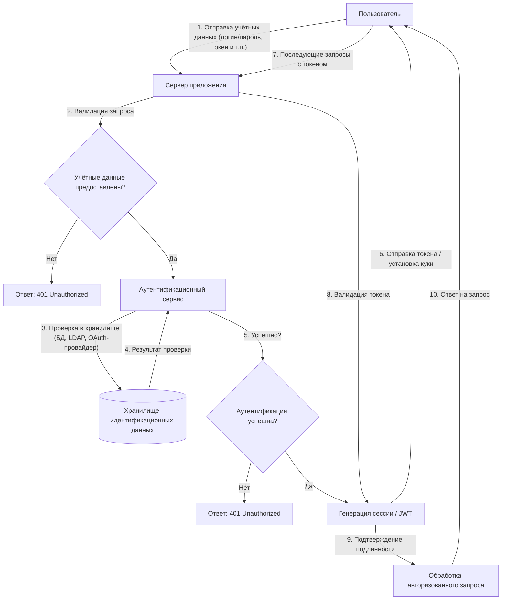

Схема выше отражает типовой поток аутентификации:
- Инициализация запроса пользователем;
- Валидацию входных данных на сервере;
- Обращение к аутентификационному сервису;
- Проверку учётных данных в хранилище;
- Генерацию и выдачу учётных данных сессии (токен, куки);
- Использование этих данных в последующих запросах.

---

### Инструменты и методы аутентификации

**Пароль** — это секретная последовательность символов, которую пользователь предоставляет системе для подтверждения своей личности. Пароль может состоять из букв, цифр, знаков препинания и других допустимых символов. Он хранится в защищённом виде, чаще всего в виде хеша, и используется как основной фактор аутентификации при входе в учётную запись. Надёжный пароль обладает достаточной длиной, содержит разнообразные символы и не совпадает с легко угадываемыми данными, такими как имя, дата рождения или слово из словаря.

Примеры:
1. Лёгкие:
```
qwerty123
password
iloveyou
123456
admin
test
user
```
2. Сложные:
```
G&7k!mP9#2sQ@4
C0ffee#Tea&2026
8f$Gt9!mQp#2kL&5jR@7xVz*4wY
```

**PIN-код** (Personal Identification Number) — это числовой код фиксированной длины, обычно от четырёх до шести цифр, предназначенный для подтверждения личности пользователя в ограниченных контекстах. PIN-коды часто применяются в банковских картах, мобильных устройствах, SIM-картах и системах физического доступа. В отличие от паролей, PIN-коды не содержат букв или специальных символов и рассчитаны на быстрый ввод с цифровой клавиатуры. Их безопасность зависит от конфиденциальности и ограничения числа попыток ввода.

Пример плохого:
```
1234
```
Пример хорошего:
```
7049
```

**Контрольный вопрос** — это заранее заданный пользователем или системой вопрос, на который известен только правильный ответ. Контрольные вопросы используются как вспомогательный механизм восстановления доступа к учётной записи или подтверждения личности. Примеры таких вопросов: «В каком городе вы родились?» или «Как звали вашего первого питомца?». Ответ на контрольный вопрос должен быть трудно угадываемым для посторонних, но легко воспроизводимым самим пользователем. Современные системы всё реже полагаются на контрольные вопросы из-за их низкой устойчивости к социальной инженерии.

Пример плохого:
```
Девичья фамилия матери?
Иванова
```
Пример хорошего (нестандартный или выдуманный):
```
Как звали вашего первого питомца?
Т-800 (модель Terminator)
```

**Аппаратный ключ** — это физическое устройство, предназначенное для подтверждения личности пользователя при аутентификации. Аппаратные ключи реализуют стандарты, такие как FIDO2 или U2F, и взаимодействуют с компьютером или смартфоном через USB, NFC или Bluetooth. При запросе аутентификации система отправляет вызов, на который аппаратный ключ отвечает криптографически подписанным подтверждением. Такой ключ невозможно скопировать программно, и его наличие служит надёжным доказательством владения учётной записью. Примеры аппаратных ключей — YubiKey, Google Titan Безопасность Key.

**Одноразовый код из приложения** — это временный числовой код, генерируемый специализированным мобильным приложением для подтверждения личности пользователя. Такой код действителен в течение короткого промежутка времени, обычно 30–60 секунд, и меняется автоматически. Генерация основана на общем секрете, синхронизированном между сервером и приложением, и текущем времени. Одноразовые коды используются как второй фактор аутентификации и обеспечивают защиту даже в случае компрометации основного пароля. Примеры приложений — Google Authenticator, Microsoft Authenticator, Authy.

Пример:
```
382 049
```

**SMS** (Short Message Service) — это протокол передачи коротких текстовых сообщений между мобильными устройствами. В контексте аутентификации SMS используется для доставки одноразового кода, отправляемого пользователю на зарегистрированный номер телефона. Полученный код вводится в интерфейсе системы для подтверждения личности. Этот метод удобен благодаря широкой доступности мобильной связи, но считается менее безопасным из-за рисков перехвата через SIM-свопинг, прослушку или уязвимости в сетях сотовой связи.

**Двухфакторная аутентификация** — это метод подтверждения личности, при котором требуется предоставить два разных типа подтверждения. Эти типы называются факторами: что-то, что вы знаете (например, пароль), что-то, что у вас есть (например, телефон или аппаратный ключ), или что-то, что вы являетесь (биометрические данные). Двухфакторная аутентификация значительно повышает уровень защиты учётной записи, поскольку злоумышленнику недостаточно украсть только пароль — ему также необходимо получить доступ ко второму фактору. Распространённые комбинации: пароль + SMS, пароль + одноразовый код из приложения, пароль + аппаратный ключ.

**Аутентификатор** — это программное приложение, предназначенное для генерации одноразовых кодов в рамках двухфакторной аутентификации. Аутентификатор использует алгоритмы TOTP (Time-based One-Time Password) или HOTP (HMAC-based One-Time Password), основанные на общем секрете и времени или счётчике событий. При первом подключении сервис предоставляет пользователю QR-код или секретный ключ, который сохраняется в приложении. После этого приложение самостоятельно генерирует коды без необходимости подключения к интернету. Аутентификаторы не зависят от оператора связи и работают автономно на устройстве пользователя. Примеры — Google Authenticator, Microsoft Authenticator, 1Password, Aegis.

---

### Авторизация

**Авторизация** — процесс определения прав субъекта после успешной аутентификации. Это ответ на вопрос *«Что вы можете делать?»*. Она строится на основе:  
— ролей (RBAC);  
— атрибутов (ABAC);  
— политик, привязанных к контексту (время, место, устройство).

Современные протоколы, такие как **OAuth 2.0** и **OpenID Connect**, разделяют аутентификацию и авторизацию. Пользователь проходит аутентификацию в единой системе (Identity Provider), а приложения запрашивают только необходимые права через токены. Это снижает количество учётных данных и упрощает отзыв доступа.

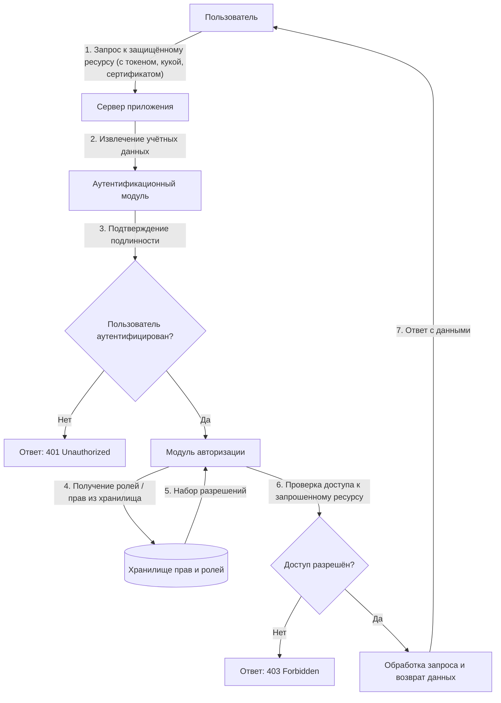

Схема вышедемонстрирует процесс авторизации после успешной аутентификации:
- Пользователь обращается к защищённому ресурсу с действительными учётными данными;
- Система проверяет наличие необходимых прав или ролей;
- Принимается решение о предоставлении или отказе в доступе;
- В случае отказа возвращается статус 403 Forbidden, при успехе — запрошенные данные.


**Подлинность субъекта** — это свойство, подтверждающее, что субъект (пользователь, система или процесс) действительно является тем, за кого себя выдаёт. Подлинность устанавливается в ходе процедуры аутентификации, когда субъект предоставляет доказательства своей идентичности: пароль, биометрические данные, аппаратный ключ или другой фактор. Без подтверждения подлинности невозможно гарантировать, что последующие действия субъекта выполняются им самим, а не злоумышленником. Подлинность лежит в основе всех механизмов контроля доступа и защиты информации.

**Право субъекта** — это разрешение на выполнение определённого действия над объектом в информационной системе. Право формируется из сочетания субъекта, объекта и операции: например, «пользователь А может читать файл X». Права назначаются администратором или автоматически на основе ролей, атрибутов или политик. Они ограничивают действия субъекта в рамках его полномочий и предотвращают несанкционированный доступ к ресурсам. Совокупность прав определяет, какие функции доступны пользователю в системе.

**Роль** — это логическая группировка прав, соответствующая функциональной позиции субъекта в системе или организации. Роли упрощают управление доступом: вместо назначения отдельных прав каждому пользователю, права присваиваются роли, а пользователи получают одну или несколько ролей. Примеры ролей: «администратор», «менеджер по продажам», «аналитик». Роль не привязана к конкретному человеку — она описывает набор обязанностей и разрешений, которые могут быть делегированы любому подходящему субъекту.

**Атрибут** — это характеристика субъекта, объекта или контекста, используемая для принятия решений о доступе. Атрибуты могут быть статическими (например, должность, отдел, тип устройства) или динамическими (время суток, географическое местоположение, уровень угрозы). В отличие от ролей, атрибуты не группируют права напрямую, а служат входными данными для политик. Примеры атрибутов: «статус сотрудника — активен», «устройство — корпоративное», «время запроса — рабочие часы».

---

### Инструменты и средства авторизации

**RBAC (Role-Based Access Control)** — это модель управления доступом, основанная на ролях. В RBAC права назначаются ролям, а роли — пользователям. Доступ к ресурсам предоставляется только в том случае, если у пользователя есть роль, включающая необходимое право. Модель поддерживает иерархию ролей, разделение обязанностей и централизованное управление. RBAC широко применяется в корпоративных системах благодаря простоте администрирования и соответствию организационной структуре.

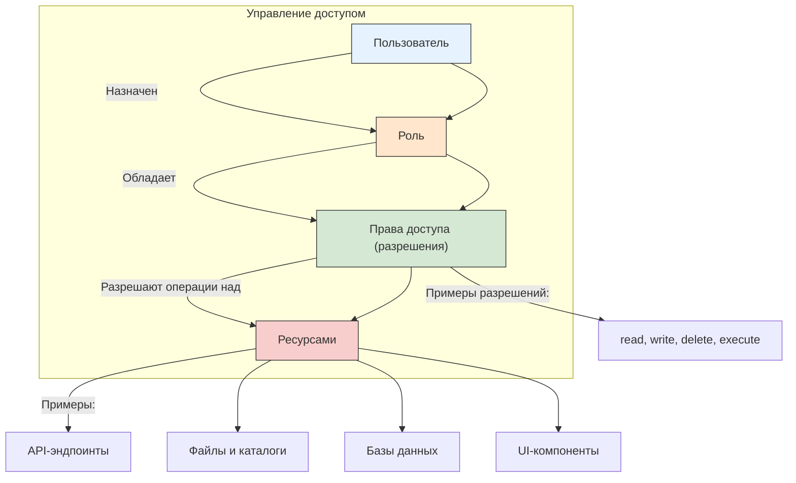

Схема выше отражает основные принципы RBAC:
- Пользователи не получают права напрямую.
- Права назначаются ролям.
- Пользователи связываются с одной или несколькими ролями.
- Роли определяют набор разрешений (permissions).
- Разрешения управляют доступом к ресурсам.


**ABAC (Attribute-Based Access Control)** — это модель управления доступом, основанная на атрибутах. В ABAC решение о предоставлении доступа принимается на основе правил, которые анализируют атрибуты субъекта, объекта, действия и окружающего контекста. Например, доступ к документу может быть разрешён, только если пользователь работает в отделе финансов, запрашивает информацию в рабочее время и использует защищённое устройство. ABAC обеспечивает гибкость и точность, но требует более сложной настройки и обработки политик.

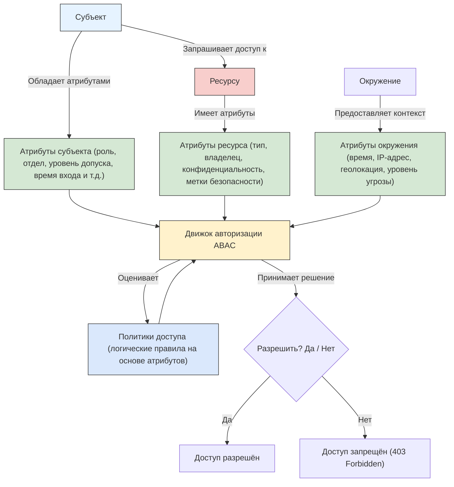

Схема выше демонстрирует принцип работы ABAC:
- Решение о доступе принимается динамически на основе атрибутов:
	- Субъекта (пользователь, система),
	- Ресурса (документ, API, запись в БД),
	- Окружения (время суток, сетевой контекст и др.).
- Все атрибуты передаются в движок авторизации, который применяет политики — формализованные правила (например, в XACML или Rego).
- В отличие от RBAC, связи между пользователями и правами не фиксированы, а вычисляются в момент запроса.

**Политики безопасности** — это формализованные правила, определяющие, какие действия разрешены или запрещены в информационной системе. Политики описывают условия, при которых субъект может взаимодействовать с объектом, и могут включать временные ограничения, географические рамки, требования к устройству и другие параметры. Политики реализуются в рамках моделей вроде ABAC или используются как основа для аудита и мониторинга. Они обеспечивают единообразие и соответствие требованиям регуляторов, внутренних стандартов или отраслевых норм.

**Протокол авторизации** — это стандартизированный набор правил и процедур, позволяющий одной системе запрашивать и получать разрешение на доступ к ресурсам от имени пользователя в другой системе. Протокол определяет формат сообщений, методы аутентификации участников, способы передачи токенов и обработку ошибок. Протоколы авторизации не подтверждают личность пользователя — они передают уже подтверждённые права между сервисами. Примеры: OAuth 2.0, OpenID Connect, SAML.

**OAuth** — это открытый протокол делегированной авторизации, позволяющий приложению получать ограниченный доступ к ресурсам пользователя в другом сервисе без передачи учётных данных. OAuth использует токены, выдаваемые авторизующим сервером, чтобы подтвердить право на выполнение определённых действий. Например, мобильное приложение может запросить доступ к списку контактов в Google, и пользователь подтверждает это через интерфейс Google, не вводя логин и пароль в приложение. OAuth 2.0 — наиболее распространённая версия протокола, лежащая в основе множества современных интеграций.

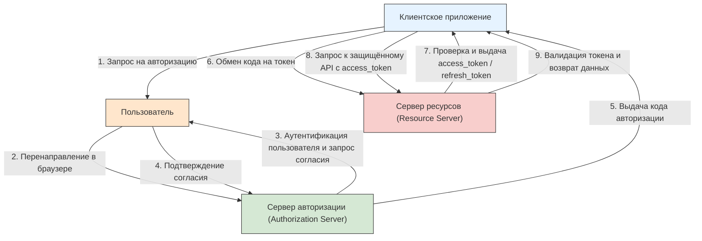

Схема отражает типовой поток `Authorization Code Grant` в OAuth 2.0:
- Пользователь взаимодействует с клиентским приложением.
- Приложение перенаправляет пользователя на сервер авторизации.
- После аутентификации и согласия сервер выдаёт временный код авторизации.
- Клиент обменивает этот код на `access_token` (и опционально `refresh_token`) напрямую с сервером авторизации.
- Полученный `access_token` используется для доступа к защищённым ресурсам.

OAuth 2.0 реализует делегированную авторизацию: пользователь разрешает приложению действовать от его имени без передачи учётных данных.


**Единая система авторизации и аутентификации** — это централизованная платформа, которая управляет идентификацией пользователей и их правами доступа ко всем сервисам в рамках организации или экосистемы. Такая система позволяет пользователю входить один раз (Single Sign-On) и получать доступ ко всем связанным приложениям без повторного ввода учётных данных. Она обеспечивает согласованность политик, упрощает управление жизненным циклом учётных записей и повышает безопасность за счёт централизованного контроля. Примеры: Microsoft Entra ID (ранее Azure AD), Keycloak, Auth0.

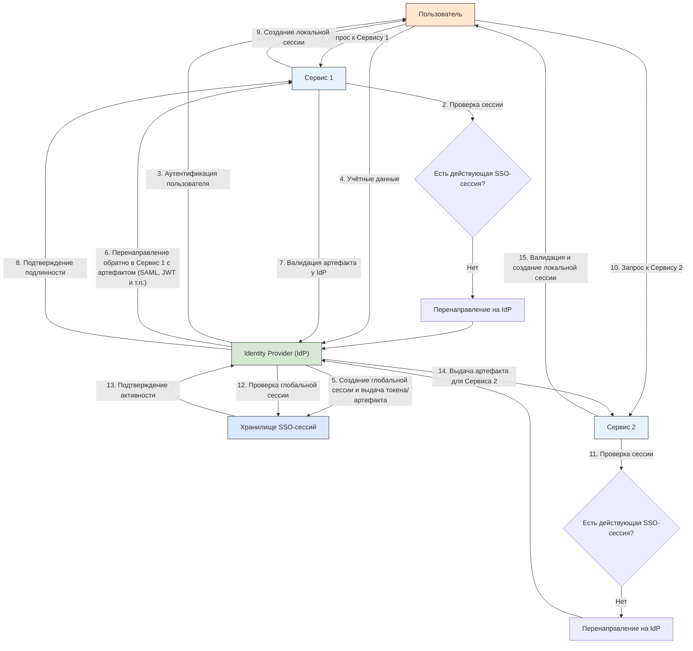

Схема демонстрирует принцип работы централизованного SSO:
- Пользователь проходит аутентификацию один раз в Identity Provider (IdP).
- IdP создаёт глобальную сессию и хранит её состояние.
- При обращении к любому участвующему сервису (Service Provider) проверяется наличие этой глобальной сессии.
- Если сессия активна, пользователь получает доступ без повторного ввода учётных данных.
- Локальные сессии в каждом сервисе управляются независимо, но инициируются на основе единой аутентификации.

Поддерживает протоколы: SAML, OpenID Connect, Kerberos, CAS и др.

**Учётные данные** — это информация, используемая для подтверждения личности субъекта при аутентификации. Учётные данные могут включать логин и пароль, сертификат, биометрический шаблон, секретный ключ или одноразовый код. Они должны храниться и передаваться с соблюдением мер защиты: хеширование, шифрование, изоляция. Учётные данные являются критически важным элементом безопасности — их компрометация позволяет злоумышленнику выдать себя за легитимного пользователя и получить несанкционированный доступ к системе.

---

## Реализация

### Как работает вход в систему

Процесс авторизации начинается с определения модели доверия: какие действия пользователь может выполнять после подтверждения своей личности. 

На этапе проектирования разработчики выбирают факторы аутентификации — пароль, биометрия, аппаратный ключ, одноразовый код — и комбинируют их в соответствии с требованиями безопасности и удобства. 

Проектирование включает:
- выбор модели управления доступом (RBAC, ABAC), 
- определение ролей или атрибутов, 
- формирование политик и настройку интеграции с внешними системами, такими как OAuth-провайдеры или корпоративные каталоги. 

Особое внимание уделяется пользовательскому потоку: экраны ввода, обработка ошибок, восстановление доступа и поведение при истечении сессии.

Подключение к системе аутентификации настраивается через **конфигурационные файлы**, **переменные окружения** или **административные интерфейсы**. 

Внутри приложения указывают **адрес сервера идентификации** (например, OpenID Connect Provider), идентификатор клиента, секрет клиента, URI перенаправления и список запрашиваемых прав (scopes).

Для корпоративных решений подключение часто осуществляется через LDAP, SAML или Kerberos. При использовании облачных сервисов (Auth0, Firebase Auth, Microsoft Entra ID) настройка сводится к регистрации приложения в панели управления провайдера и внедрению SDK или библиотеки для обработки токенов. Все параметры подключения хранятся вне исходного кода и защищаются от несанкционированного доступа.

Данные аутентификации **хранятся раздельно** по типу и уровню чувствительности:
- Пароли никогда не сохраняются в открытом виде — они преобразуются с помощью криптографических хеш-функций с солью (например, bcrypt, scrypt, Argon2). 
- Учётные записи пользователей (логины, email, метаданные) размещаются в базах данных с контролем доступа. 
- Токены сессии или refresh-токены могут храниться в зашифрованных cookie, secure storage мобильного устройства или в распределённом хранилище сессий (Redis, Memcached). 
- Ключи подписи, сертификаты и клиентские секреты размещаются в защищённых хранилищах (Vault, AWS Secrets Manager, Azure Key Vault). 

Все операции записи и чтения логируются для аудита.

Безопасность входа обеспечивается многоуровнево:
- На **транспортном уровне** используется HTTPS с современными протоколами шифрования (TLS 1.2/1.3). 
- На **уровне приложения** реализуются защита от перебора (rate limiting, CAPTCHA), блокировка после множества неудачных попыток, обязательная двухфакторная аутентификация для привилегированных аккаунтов. 

Сессии имеют ограниченный срок действия, привязку к IP-адресу или устройству, и поддерживают принудительное завершение. Все токены подписываются и проверяются на подлинность. Регулярно проводятся аудиты, сканирование уязвимостей и пентесты. Пользователям предоставляется панель активности с историей входов и возможностью отзыва сессий.

**Временные данные** включают:
- access-токены, 
- сессионные cookie,
- одноразовые коды,
- nonce и временные состояния OAuth-запросов. 

Они действуют от нескольких секунд до нескольких часов и автоматически уничтожаются после истечения срока или явного выхода. 

**Постоянные данные** — это:
- учётная запись пользователя, 
- хеш пароля, 
- настройки двухфакторной аутентификации, 
- привязанные устройства, 
- refresh-токены (если разрешены), 
- история входов и аудит-логи. 

Эти данные сохраняются до удаления аккаунта или выполнения запроса на забвение. Некоторые системы хранят refresh-токены с возможностью отзыва, что позволяет сохранять долгосрочный доступ без повторного ввода пароля, но с контролем со стороны пользователя.

---

### Реализация протоколов в системах

#### Keycloak

**Keycloak** разворачивается как отдельный сервер идентификации, обычно в виде Docker-контейнера, Java-приложения на WildFly или в облаке. 

После установки администратор создаёт `realm` — изолированное пространство для пользователей, клиентов и политик. Внутри `realm` регистрируются клиентские приложения (веб, мобильные, API), указываются URI перенаправления, типы грантов и запрашиваемые scopes. 

Пользователи могут быть добавлены вручную, синхронизированы из LDAP или зарегистрированы через форму. 

Keycloak поддерживает OpenID Connect и SAML, предоставляет готовые страницы входа, восстановления пароля и двухфакторной аутентификации. 

Интеграция с приложением осуществляется через библиотеки (например, Spring Security OAuth2, Passport.js) или напрямую посредством проверки JWT-токенов. 

Административный интерфейс позволяет настраивать темы, политики согласия, условия входа и правила маппинга ролей.

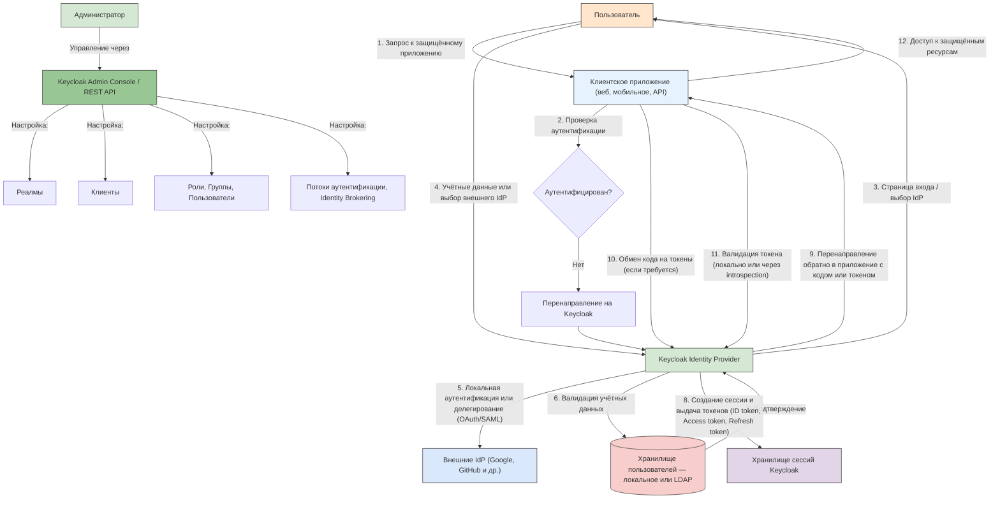

Схема отражает архитектуру и основные компоненты Keycloak:
- Keycloak выступает в роли централизованного сервера идентификации (Identity and Access Management).
- Поддерживает как локальную аутентификацию, так и делегирование через внешние провайдеры (Identity Brokering).
- Использует стандартные протоколы: OpenID Connect, OAuth 2.0, SAML.
- Все данные пользователей, клиентов, ролей и политик организованы в реалмах (изолированных пространствах).
- Администрирование осуществляется через веб-консоль или REST API.
- Приложения (клиенты) интегрируются с Keycloak для делегирования задач аутентификации и авторизации.

Keycloak обеспечивает единый вход (SSO), управление пользователями, многофакторную аутентификацию и гибкие политики безопасности.

#### SSO

**Единый вход (SSO)** реализуется через централизованный **Identity Provider (IdP)**, который управляет сессией пользователя. 

При первом обращении к любому сервису пользователь перенаправляется на IdP, где проходит аутентификацию. После успешного входа IdP выдаёт токен или устанавливает cookie, подтверждающий сессию. 

Последующие запросы к другим сервисам автоматически проверяют наличие активной сессии в IdP и не требуют повторного ввода учётных данных. 

Для веб-приложений используется протокол **OpenID Connect** с перенаправлением через браузер; для внутренних сервисов — обмен токенами по защищённым каналам. 

SSO может быть реализован на базе Keycloak, Auth0, Microsoft Entra ID, Okta или собственного решения с поддержкой OAuth 2.0 и OpenID Connect.

#### Auth0

**Auth0** подключается как облачный сервис через регистрацию приложения в панели управления. Разработчик указывает тип приложения (Single Page App, Regular Web App, Machine to Machine), домены, URI перенаправления и настраивает правила (Rules) или действия (Actions) для кастомной логики. 

Auth0 предоставляет универсальный экран входа с поддержкой социальных провайдеров (Google, Facebook), корпоративных каталогов (LDAP, Active Directory) и многофакторной аутентификации. 

После аутентификации клиент получает **ID-токен** и **access-токен** в формате JWT. Эти токены проверяются на стороне бэкенда с помощью публичного ключа или эндпоинта интроспекции. Auth0 также поддерживает кастомные домены, брендинг, логирование всех событий и интеграцию с SIEM-системами.

#### OAuth 2.0

**OAuth 2.0** реализуется через четыре основных роли: 
- ресурсный владелец, 
- клиент, 
- сервер авторизации?
- сервер ресурсов. 

На практике разработчик регистрирует клиент в сервере авторизации, получает `client_id` и `client_secret`. 

При запросе доступа клиент перенаправляет пользователя на эндпоинт `/authorize` с указанием `scope`, `response_type` и `state`. 

После согласия пользователь возвращается на `redirect_uri` с кодом авторизации. Клиент обменивает этот код на access-токен, отправляя запрос на `/token` с `client credentials`. 

Полученный токен используется для вызова защищённых API. Для конфиденциальных клиентов (backend) используется Authorization Code Flow; для публичных (SPA, мобильные) — Authorization Code Flow с PKCE. Refresh-токены позволяют продлевать доступ без повторного входа.

---

### Примеры реализации

#### Пример 1: Вход через Google с использованием OAuth 2.0 и OpenID Connect
  
1. Веб-приложение регистрируется в Google Cloud Console. 
2. Пользователь нажимает «Войти через Google», браузер перенаправляется на `accounts.google.com` с параметрами `client_id`, `redirect_uri`, `scope=openid email profile`. 
3. После подтверждения Google возвращает `authorization code`. 
4. Backend приложения отправляет этот код на `https://oauth2.googleapis.com/token` вместе с `client_secret` и получает ID-токен и access-токен. 
5. ID-токен декодируется и проверяется подпись — в нём содержатся email и имя пользователя. 
6. Доступ к Google API (например, Gmail) осуществляется с передачей access-токена в заголовке `Authorization`.

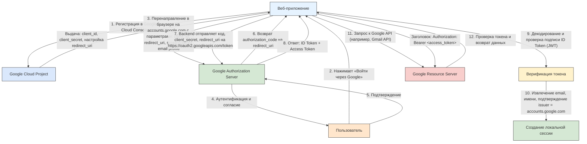

#### Пример 2: Защита REST API с Keycloak
  
1. Сервис на Spring Boot подключает зависимость `spring-boot-starter-oauth2-resource-server`. 
2. В `application.yml` указывается `issuer-uri: http://keycloak:8080/realms/my-realm`. 
3. Все входящие запросы должны содержать заголовок `Authorization: Bearer <access_token>`. 
4. Spring автоматически проверяет подпись JWT, срок действия и `audience`. 
5. Роли из токена маппируются на `Spring Security Authorities`. 
6. Администратор в Keycloak настраивает `client scope` с `mapper`’ом для ролей.

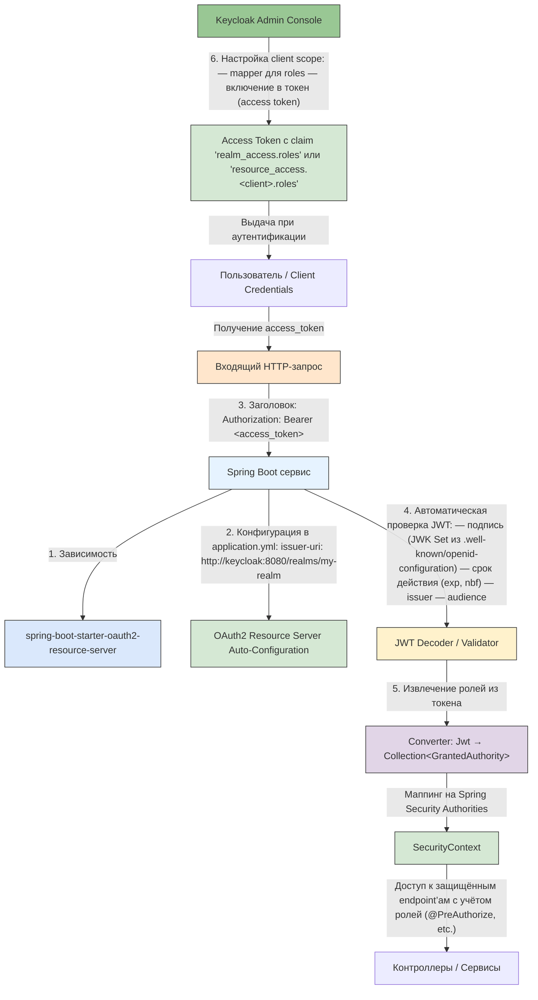

#### Пример 3: Единый вход в корпоративной сети через SAML
  
1. Пользователь открывает внутренний портал, тот перенаправляет его на IdP (например, ADFS или Shibboleth). 
2. Браузер отправляет `SAML AuthnRequest`. 
3. IdP проверяет сессию или запрашивает учётные данные, затем формирует `SAML Response` с утверждениями о пользователе и подписывает его. 
4. Портал проверяет подпись, извлекает email и роли, создаёт локальную сессию. 
5. Все последующие сервисы принимают эту сессию без повторной аутентификации.

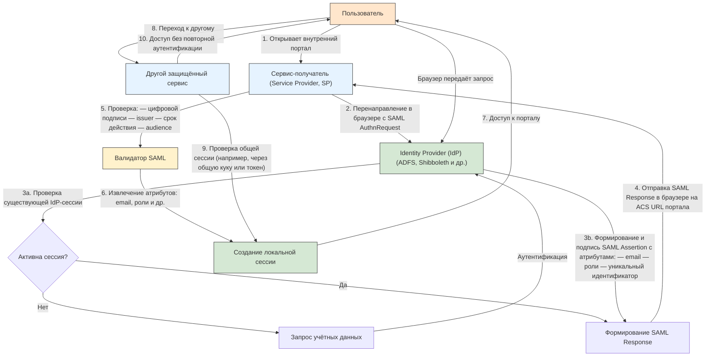

#### Пример 4: Мобильное приложение с Auth0 и PKCE
  
1. Приложение генерирует `code_verifier` и `code_challenge`. 
2. Открывает браузер с запросом на `/authorize`, включая `code_challenge` и `code_challenge_method=S256`. 
3. После входа Auth0 возвращает `code`. 
4. Приложение отправляет `code` и `code_verifier` на `/token`. 
5. Auth0 проверяет соответствие и выдаёт токены. 
6. Access-токен хранится в `secure storage`, refresh-токен — в зашифрованном хранилище. 
7. При истечении access-токена приложение запрашивает новый с помощью refresh-токена.

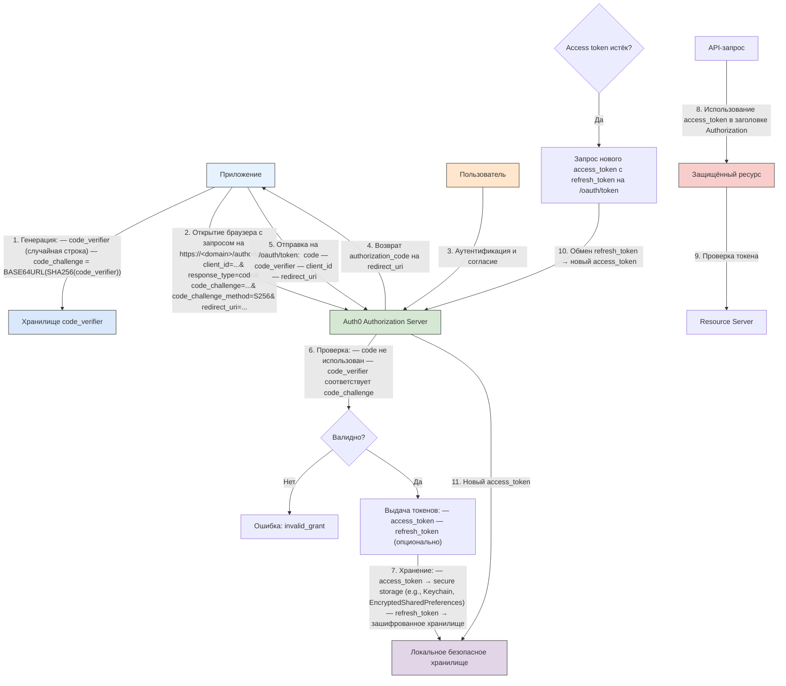


#### Пример 5: Machine-to-Machine авторизация через OAuth 2.0 Client Credentials Flow
  
1. Сервис A должен вызвать API сервиса B. 
2. Оба зарегистрированы в центральном OAuth-сервере. 
3. Сервис A отправляет POST-запрос на `/token` с `grant_type=client_credentials`, `client_id` и `client_secret`. 
4. Сервер выдаёт access-токен с ограниченными правами (например, только чтение логов). 
5. Сервис A включает токен в заголовок `Authorization` при вызове B. 

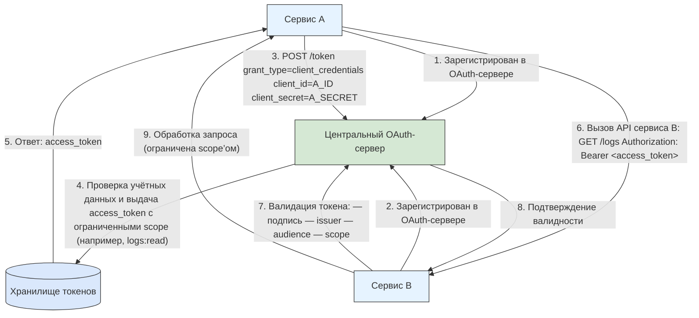

Такой подход исключает участие пользователя и подходит для фоновых задач и микросервисов.

---

## Сессии

### Основы сессий

**Сессия** — это временный интервал взаимодействия между пользователем и системой, в течение которого система сохраняет состояние пользователя. 

После успешной аутентификации сервер создаёт сессию, присваивает ей **уникальный идентификатор** и использует его для распознавания последующих запросов от того же пользователя. 

Сессия завершается по истечении времени неактивности, при явном выходе или по решению администратора. Сессии позволяют веб-приложениям поддерживать контекст между HTTP-запросами, которые по своей природе безсостоятельны.

Ключевые понятия, связанные с сессиями:  
- **Идентификатор сессии** — уникальная строка, выдаваемая сервером при создании сессии.  
- **Состояние сессии** — данные, хранящиеся на сервере или клиенте, описывающие текущее положение пользователя (роли, права, предпочтения).  
- **Время жизни** — период, в течение которого сессия считается действительной.  
- **Привязка** — ограничение сессии к определённому IP-адресу, устройству или браузеру для повышения безопасности.  
- **Отзыв** — принудительное завершение сессии администратором или пользователем.

Сессия начинается после *аутентификации*. Сервер генерирует идентификатор, сохраняет **метаданные сессии** (время создания, время последнего доступа, права) и отправляет идентификатор клиенту. 

Клиент включает этот идентификатор в каждый последующий запрос — обычно через cookie, заголовок Authorization или параметр URL. Сервер извлекает идентификатор, проверяет его подлинность и срок действия, затем восстанавливает состояние пользователя. При выходе клиент отправляет запрос на завершение сессии, и сервер удаляет соответствующую запись.

Существуют два основных подхода к реализации сессий:  
- **Серверные сессии**: данные хранятся на сервере (в памяти, базе данных или кэше), клиент получает только идентификатор. Этот подход обеспечивает полный контроль над состоянием и безопасность, но требует масштабируемого хранилища.  
- **Клиентские сессии (stateless)**: все данные сессии кодируются и подписываются, затем передаются клиенту (например, в JWT). Сервер не хранит состояние, что упрощает горизонтальное масштабирование, но усложняет отзыв токенов и увеличивает объём передаваемых данных.

---

### Токены

**Токен** — это цифровой объект, подтверждающий право на выполнение определённых действий. В контексте сессий токены заменяют или дополняют традиционные идентификаторы сессий. Они могут быть одноразовыми, временными или долгоживущими. 

Токены передаются в заголовках HTTP, cookie или теле запроса и проверяются на подлинность, срок действия и соответствие запрашиваемому ресурсу.

**JWT (JSON Web Token)** — это открытый стандарт (RFC 7519) для представления утверждений в виде компактного, самодостаточного JSON-объекта. 

JWT состоит из трёх частей: 
- заголовка (header), 
- полезной нагрузки (payload),
- подписи (signature). 

Полезная нагрузка содержит утверждения о пользователе (sub, email, roles) и метаданные (exp, iat, iss). Подпись гарантирует целостность токена. 

JWT используется в stateless-архитектурах, где сервер не хранит сессионные данные, а извлекает их из самого токена.

**ID-токен** — это JWT, выдаваемый в рамках протокола OpenID Connect для подтверждения личности пользователя. Он содержит минимальный набор утверждений: идентификатор субъекта (sub), имя, email, время выдачи (iat) и срок действия (exp). 

ID-токен предназначен исключительно для клиента (обычно фронтенда) и не используется для доступа к API. Его основная цель — информировать приложение о том, что пользователь успешно прошёл аутентификацию.

**Access-токен** — это учётная запись, предоставляющая право на доступ к защищённым ресурсам. Он выдаётся после аутентификации и авторизации и содержит информацию о разрешённых действиях (scopes) и ресурсах. 

Access-токены обычно короткоживущие (от нескольких минут до часа) и передаются в заголовке `Authorization: Bearer <token>`. Сервер проверяет подпись, срок действия и соответствие scopes запрашиваемой операции. Использование короткого срока действия снижает риск при компрометации токена.

**Refresh-токен** — это долгоживущий токен, предназначенный для получения новых access-токенов без повторного ввода учётных данных. Он выдаётся вместе с access-токеном и хранится в защищённом месте (secure storage, HttpOnly cookie). 

При истечении access-токена клиент отправляет refresh-токен на эндпоинт `/token`, и сервер выдаёт новую пару токенов. Refresh-токены могут быть отозваны, имеют ограниченное число использований и часто привязаны к устройству. Они позволяют поддерживать длительные сессии при сохранении высокого уровня безопасности.

---

### Хранение данных

Сессионные cookie — это небольшие фрагменты данных, сохраняемые браузером и автоматически отправляемые на сервер с каждым запросом. Они содержат идентификатор сессии или токен и удаляются при закрытии браузера. 

Для защиты используются флаги:  
- **HttpOnly** — запрещает доступ к cookie через JavaScript, предотвращая XSS-атаки.  
- **Secure** — разрешает передачу cookie только по HTTPS.  
- **SameSite** — ограничивает отправку cookie в межсайтовых запросах, защищая от CSRF.

**Шифрование cookie** применяется, когда в них хранятся чувствительные данные (например, в stateless-сессиях). Данные сериализуются, шифруются симметричным алгоритмом (AES) и подписываются (HMAC). Сервер использует общий секретный ключ для расшифровки и проверки целостности. Шифрование предотвращает чтение и подделку содержимого cookie злоумышленником, даже если он перехватит его.

**Secure storage** — это защищённые механизмы хранения данных на клиентском устройстве. В мобильных приложениях это Keychain (iOS) и Keystore (Android). В веб-приложениях — зашифрованные localStorage/IndexedDB с дополнительной защитой через CSP и Content Безопасность Policy. Secure storage используется для хранения refresh-токенов, ключей шифрования и других конфиденциальных данных. Доступ к нему ограничен операционной системой и недоступен другим приложениям.

Для масштабируемых систем сессии хранятся в **распределённых кэшах**, таких как Redis или Memcached. 

Сервер при создании сессии сохраняет её данные в хранилище по ключу — идентификатору сессии. Любой экземпляр приложения может получить доступ к этим данным, что позволяет балансировать нагрузку между серверами без привязки пользователя к конкретному узлу. 

Redis предпочтительнее благодаря поддержке TTL (автоматического удаления по истечении срока), persistence и атомарных операций. Memcached проще и быстрее, но менее функционален.

---