import AuthenticationFlow from '@site/src/components/AuthenticationFlow';
import WebAttackSimulatorPlay from '@site/src/components/WebAttackSimulatorPlay';

# Аутентификация и авторизация

<div class="article-tags">
  <span class="tag tag-required">ОБЯЗАТЕЛЬНО</span>
  <span class="tag tag-beginner">ДЛЯ НОВИЧКОВ</span>
</div>

<span class="complexity-badge">Всем</span>

---

## Аутентификация и авторизация  

### Плавный старт: где тут чаще всего путаются

На практике две ошибки встречаются постоянно:

- "Пользователь вошел, значит ему можно всё."  
  На самом деле вход в систему (аутентификация) и права внутри системы (авторизация) - это разные этапы.
- "Проверка пароля есть, значит уже безопасно."  
  Без разграничения прав, журналирования и 2FA компрометация одного аккаунта приводит к широкому доступу.

Удобная формула для запоминания:

- **Идентификация** - "Я пользователь `ivanov`".
- **Аутентификация** - "Доказываю, что это действительно `ivanov`".
- **Авторизация** - "Получаю только те действия, которые разрешены `ivanov`".
- **Аудит** - "Система фиксирует, что именно сделал `ivanov`".

Если разделять эти этапы с самого начала проектирования, система становится значительно устойчивее и проще в сопровождении.

---

<span id="antipatterny-i-kak-pravilno"></span>

### Антипаттерны и как правильно

- **Антипаттерн: "Один вход = полный доступ ко всему".**  
  **Как правильно:** после аутентификации применять принцип минимальных привилегий: выдавать только нужные права под конкретную роль и задачу.
- **Антипаттерн: "Роль admin на всякий случай".**  
  **Как правильно:** разделять роли по операциям (`read`, `write`, `approve`, `delete`) и вводить временные повышенные привилегии через отдельный процесс.
- **Антипаттерн: "Проверяем только логин/пароль, логи не нужны".**  
  **Как правильно:** фиксировать попытки входа, смену факторов, выдачу/отзыв токенов и отказ в доступе для расследований и аудита.
- **Антипаттерн: "2FA только для админов".**  
  **Как правильно:** обязательно включать 2FA и для критичных бизнес-ролей: финансы, HR, владельцы интеграций, пользователи с доступом к персональным данным.

Эти улучшения почти всегда дают больший эффект, чем "усложнение пароля без пересмотра модели доступа".

---

<AuthenticationFlow />

<div class="callout callout--info">
  <div class="callout-title">Словарь главы</div>

  <div class="callout-body">
  <table>
    <thead>
      <tr><th>Этап</th><th>Вопрос</th><th>Пример</th></tr>
    </thead>
    <tbody>
      <tr><td><strong>Идентификация</strong></td><td>Кто заявляет, что он такой-то?</td><td>Логин, email</td></tr>
      <tr><td><strong>Аутентификация</strong></td><td>Доказательство, что это действительно он</td><td>Пароль, TOTP, ключ FIDO2</td></tr>
      <tr><td><strong>Авторизация</strong></td><td>Что ему разрешено делать?</td><td>Роль, scope в токене, политика ABAC</td></tr>
      <tr><td><strong>Учёт (аудит)</strong></td><td>Что он сделал?</td><td>Журнал входов, логи API</td></tr>
    </tbody>
  </table>
  <strong>OAuth 2.0</strong> — делегирование <em>прав</em> приложению без передачи пароля. <strong>OpenID Connect</strong> — слой поверх OAuth для подтверждения <em>личности</em> (ID Token). Эволюция способов входа — в <a href="#evolyutsiya-sposobov-vhoda">разделе ниже</a>. Пароли и хеши — в <a href="./114">статье про пароли</a>.
</div>
  </div>


---

<span id="evolyutsiya-sposobov-vhoda"></span>

### Эволюция способов входа в вебе

Ниже — типичная цепочка, которую проходят продукты по мере роста требований к масштабу, единому входу и доступу сторонних приложений. Каждый шаг решает узкое место предыдущего; на практике в одной экосистеме часто соседствуют несколько механизмов (сессия в админке, JWT в API, OAuth для интеграций).

| Этап | Суть | Где хранится состояние | Типичная причина перехода |
|------|------|------------------------|---------------------------|
| **WWW-Authenticate** | Браузер или клиент передаёт логин и пароль при каждом запросе (`Basic`, `Digest`) | На клиенте — учётные данные; сервер проверяет их заново | Нужен контроль жизненного цикла входа, выход и отзыв сессии |
| **Session cookie** | После входа сервер выдаёт **Session ID** в cookie; данные сессии — на сервере | Session Store (память, Redis, БД) | Масштабирование API и микросервисов, единая проверка токена |
| **Token-based (opaque)** | Клиент хранит непрозрачный токен; сервер при каждом запросе сверяет его с **сервисом валидации** | Центральное хранилище или auth-сервис | Снизить стоимость обращения к хранилищу на каждый запрос |
| **JWT** | Токен = `header.payload.signature`; сервер проверяет подпись и claims локально | В самом токене (stateless); отзыв — через blacklist или короткий `exp` | Единый вход между доменами и приложениями |
| **SSO** | Один **Identity Provider** (CAS, Keycloak, Entra ID) аутентифицирует пользователя для `a.com`, `b.com` и др. | Глобальная SSO-сессия у IdP + локальные сессии сервисов | Доступ сторонним приложениям без передачи пароля |
| **OAuth 2.0** | Делегирование **прав** (scopes); пароль остаётся у провайдера | Authorization Server + токены доступа | |

Схемы `WWW-Authenticate`, заголовка `Authorization: Bearer` и атрибутов cookie — в [справочнике по HTTP](/encyclopedia/2-system-network/2-03-set-i-internet/611#аутентификация-схемы-и-безопасность). Пошаговые диаграммы Session ID и cookie — в [хранении данных в браузере](/encyclopedia/2-system-network/2-04-kak-rabotayut-sayty-i-veb-sayty/116#cookies-and-sessions). Сводное сравнение cookie, session, JWT и PASETO — в [разделе «Сессии»](#cookies-sessions-jwt-paseto).

#### WWW-Authenticate и HTTP Basic

Сервер отвечает `401 Unauthorized` и заголовком `WWW-Authenticate` с указанием схемы (`Basic`, `Digest`). Браузер показывает встроенную форму или клиент сам добавляет `Authorization: Basic base64(user:password)` к каждому запросу. Подходит для внутренних API и dev-сред **только поверх HTTPS**; в production чаще заменяют сессией или токеном, чтобы управлять временем жизни входа, принудительным выходом и аудитом без повторной передачи пароля.

#### Session cookie (server-side)

После успешной проверки логина и пароля сервер создаёт запись в **Session Store**, генерирует случайный **Session ID** и отправляет его в `Set-Cookie`. Браузер автоматически прикладывает cookie к следующим запросам; сервер по ID поднимает состояние (роли, корзина, время входа). Плюсы — мгновенный отзыв сессии и минимум секретов у клиента. Минус — общее хранилище при нескольких инстансах приложения (обычно Redis). Подробнее — в разделе [Сессии](#сессии) и в статье про [cookie и Session Store](/encyclopedia/2-system-network/2-04-kak-rabotayut-sayty-i-veb-sayty/116#cookies-and-sessions).

#### Token-based auth с внешней валидацией

Клиент хранит **opaque token** (строка без раскрытой структуры). Прикладной сервер при каждом запросе обращается к отдельному **Token Validation Service** или к introspection endpoint (`POST /token/introspect`), чтобы узнать, действителен ли токен и какие у него scopes. Централизация упрощает отзыв и единые политики, но добавляет сетевой round-trip на каждый вызов API — отсюда переход к самопроверяемым JWT там, где допустим stateless.

#### JWT — проверка без хранилища сессии

**JWT** (RFC 7519) — три сегмента в Base64URL, разделённые точкой:

- **header** — алгоритм подписи (`alg`) и тип (`typ`);
- **payload** — claims (`sub`, `exp`, `roles`, `scope`);
- **signature** — подпись header и payload.

Resource server проверяет подпись (JWK с `/.well-known/openid-configuration` или общий секрет), срок `exp` и при необходимости `aud` **без запроса в БД сессий**. Удобно для горизонтального масштабирования и микросервисов; отзыв до истечения `exp` требует blacklist, короткого access-токена или пары access + refresh — практическая схема в [безопасном потоке входа](#bezopasnyy-potok-vhoda). Разбор конфигурации — в [JWT и проверка на API](#jwt-и-проверка-на-api-кратко) и в разделе [Токены](#токены). Сводка слоя «безопасность» в MSA (JWT, OAuth, TLS, авторизация API) — [экосистема MSA](/encyclopedia/7-project/7-06-proektirovanie-i-arhitektura/design/118#ekosistema-msa).

#### SSO — единый вход между сайтами

Пользователь один раз проходит аутентификацию у **Identity Provider** (`sso.example.com`, CAS, SAML IdP, OIDC-провайдер). Сервисы `a.com` и `b.com` перенаправляют браузер на IdP, получают подписанный артефакт (SAML Assertion, JWT, код OAuth) и создают **локальную** сессию. Глобальная SSO-сессия живёт у IdP — повторный ввод пароля при переходе между доверенными приложениями обычно не нужен. Схема IdP и сервисов — [ниже в статье](#sso-shema); практическая реализация — в [разделе SSO](#sso).

#### OAuth 2.0 — grant flows (типы выдачи токена)

OAuth 2.0 отвечает на вопрос *«какому приложению какие права выдать»*, а OpenID Connect добавляет **идентификацию** (ID Token). Основные **grant** (потоки), которые встречаются в документации и на схемах:

| Grant | Кто участвует | Назначение | Статус в новых проектах |
|-------|---------------|------------|-------------------------|
| **Authorization Code** | Браузер + backend приложения | Веб и мобильные приложения с секретом или PKCE | Основной выбор |
| **Authorization Code + PKCE** | Публичный клиент (SPA, native) | Тот же код, без `client_secret` на устройстве | Рекомендуется для SPA и мобильных |
| **Client Credentials** | Только серверы | M2M, фоновые задачи, сервис-сервис | Актуален |
| **Resource Owner Password** | Клиент получает логин/пароль пользователя | Наследие; пароль проходит через приложение | Не использовать в новых интеграциях |
| **Implicit** | Токен в URL фрагменте для native/SPA | Упрощённый поток без backend | Устарел; заменяют Code + PKCE |

Пошаговые примеры: [вход через Google](#пример-1--вход-через-google-с-использованием-oauth-20-и-openid-connect), [мобильное приложение с PKCE](#пример-4--мобильное-приложение-с-auth0-и-pkce), [Client Credentials](#пример-5--machine-to-machine-авторизация-через-oauth-20-client-credentials-flow). Интеграционный контекст (сравнение JWT и API-ключей, M2M, mTLS) — в [авторизации в интеграционных сценариях](/encyclopedia/2-system-network/2-09-osnovy-integratsionnogo-vzaimodeystviya/1121#tokens-i-api-keys).

<div class="callout callout--tip">
  <div class="callout-title">Как запомнить разницу</div>

  <div class="callout-body">
  <strong>Session cookie</strong> — на клиенте только идентификатор, состояние на сервере. <strong>JWT</strong> — состояние и права в подписанном токене, сервер проверяет подпись без своей таблицы сессий. <strong>OAuth 2.0</strong> — выдача прав приложению; пароль пользователя остаётся у провайдера (Google, корпоративный IdP). Сравнение cookie, session, JWT и PASETO — в [разделе «Сессии»](#cookies-sessions-jwt-paseto).
</div>
</div>

---

### Аутентификация

**Аутентификация** — процесс подтверждения подлинности субъекта. Это ответ на вопрос *"Кто вы?"*. Минимальный уровень — логин и пароль. Более надёжные методы используют дополнительные факторы:  
— **знание** — пароль, PIN-код, контрольный вопрос;  
— **владение** — аппаратный ключ (YubiKey), одноразовый код из приложения (TOTP), SMS;  
— **принадлежность** — биометрические данные (отпечаток пальца, сканирование лица, голосовой шаблон).

Современные системы всё чаще отказываются от SMS как второго фактора из-за уязвимостей, связанных с перехватом SIM-карт (SIM-swap). На смену приходят приложения на основе стандарта **TOTP (Time-Based One-Time Password)**, такие как Google Authenticator или Authy, а также **FIDO2/U2F** — протоколы, поддерживающие аппаратные ключи и биометрию без передачи биометрических шаблонов на сервер.

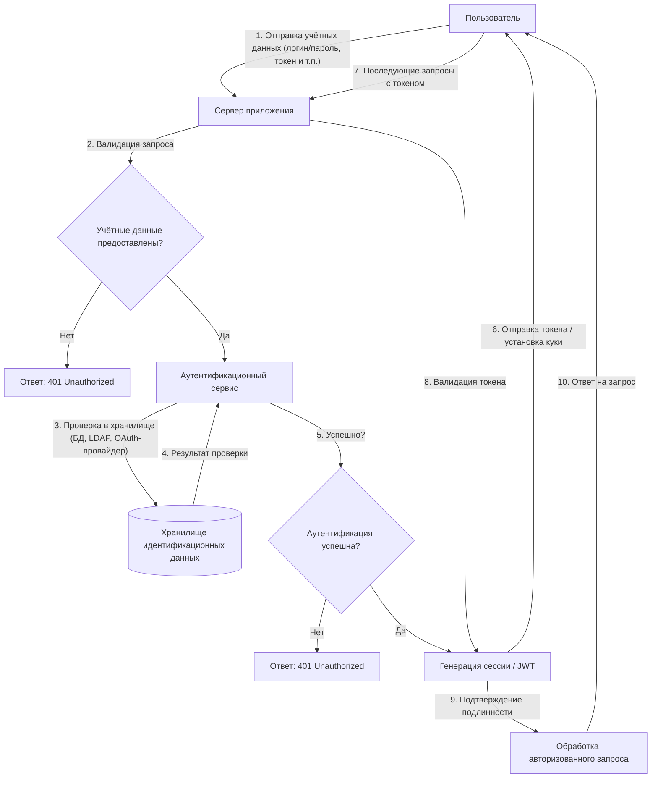

Схема выше отражает типовой поток аутентификации:
- Инициализация запроса пользователем;
- Валидацию входных данных на сервере;
- Обращение к аутентификационному сервису;
- Проверку учётных данных в хранилище;
- Генерацию и выдачу учётных данных сессии (токен, куки);
- Использование этих данных в последующих запросах.

Практический смысл потока в том, что он разделяет ответственность между компонентами: UI собирает данные, auth-сервис подтверждает личность, а бизнес-сервис доверяет только проверенному контексту сессии. Такое разделение уменьшает риск логических ошибок, когда проверка "размазана" по разным местам кода.

---

### Инструменты и методы аутентификации

#### Практический минимум для продакшена

Для большинства веб-сервисов базовый набор выглядит так:

1. Пароль хранится только как хеш (`Argon2`/`bcrypt`) + соль.
2. Для входа в административные и финансовые контуры включена 2FA.
3. Включены ограничения на попытки входа и защита от автоматизированного перебора (<a href="./114#tipy-atak-na-paroli">brute force, password spraying</a>) — см. также <a href="#bezopasnyy-potok-vhoda">безопасный поток входа</a>.
4. Все события входа и смены факторов пишутся в аудит-лог.

Это не "максимальная безопасность", но уже хороший рабочий стандарт для реальных проектов.

**Пароль** — это секретная последовательность символов, которую пользователь предоставляет системе для подтверждения своей личности. Пароль может состоять из букв, цифр, знаков препинания и других допустимых символов. Он хранится в защищённом виде, чаще всего в виде хеша, и используется как основной фактор аутентификации при входе в учётную запись. Надёжный пароль обладает достаточной длиной, содержит разнообразные символы и не совпадает с легко угадываемыми данными, такими как имя, дата рождения или слово из словаря.

Примеры:
1. Лёгкие:
```
qwerty123
password
iloveyou
123456
admin
test
user
```
2. Сложные:
```
G&7k!mP9#2sQ@4
C0ffee#Tea&2026
8f$Gt9!mQp#2kL&5jR@7xVz*4wY
```

**PIN-код** (Personal Identification Number) — это числовой код фиксированной длины, обычно от четырёх до шести цифр, предназначенный для подтверждения личности пользователя в ограниченных контекстах. PIN-коды часто применяются в банковских картах, мобильных устройствах, SIM-картах и системах физического доступа. В отличие от паролей, PIN-коды не содержат букв или специальных символов и рассчитаны на быстрый ввод с цифровой клавиатуры. Их безопасность зависит от конфиденциальности и ограничения числа попыток ввода.

Пример плохого:
```
1234
```
Пример хорошего:
```
7049
```

**Контрольный вопрос** — это заранее заданный пользователем или системой вопрос, на который известен только правильный ответ. Контрольные вопросы используются как вспомогательный механизм восстановления доступа к учётной записи или подтверждения личности. Примеры таких вопросов: "В каком городе вы родились?" или "Как звали вашего первого питомца?". Ответ на контрольный вопрос должен быть трудно угадываемым для посторонних, но легко воспроизводимым самим пользователем. Современные системы всё реже полагаются на контрольные вопросы из-за их низкой устойчивости к социальной инженерии.

Пример плохого:
```
Девичья фамилия матери?
Иванова
```
Пример хорошего (нестандартный или выдуманный):
```
Как звали вашего первого питомца?
Т-800 (модель Terminator)
```

**Аппаратный ключ** — это физическое устройство, предназначенное для подтверждения личности пользователя при аутентификации. Аппаратные ключи реализуют стандарты, такие как FIDO2 или U2F, и взаимодействуют с компьютером или смартфоном через USB, NFC или Bluetooth. При запросе аутентификации система отправляет вызов, на который аппаратный ключ отвечает криптографически подписанным подтверждением. Такой ключ невозможно скопировать программно, и его наличие служит надёжным доказательством владения учётной записью. Примеры аппаратных ключей — YubiKey, Google Titan Security Key.

**Одноразовый код из приложения** — это временный числовой код, генерируемый специализированным мобильным приложением для подтверждения личности пользователя. Такой код действителен в течение короткого промежутка времени, обычно 30–60 секунд, и меняется автоматически. Генерация основана на общем секрете, синхронизированном между сервером и приложением, и текущем времени. Одноразовые коды используются как второй фактор аутентификации и обеспечивают защиту даже в случае компрометации основного пароля. Примеры приложений — Google Authenticator, Microsoft Authenticator, Authy.

Пример:
```
382 049
```

**SMS** (Short Message Service) — это протокол передачи коротких текстовых сообщений между мобильными устройствами. В контексте аутентификации SMS используется для доставки одноразового кода, отправляемого пользователю на зарегистрированный номер телефона. Полученный код вводится в интерфейсе системы для подтверждения личности. Этот метод удобен благодаря широкой доступности мобильной связи, но считается менее безопасным из-за рисков перехвата через SIM-свопинг, прослушку или уязвимости в сетях сотовой связи.

**Двухфакторная аутентификация** — это метод подтверждения личности, при котором требуется предоставить два разных типа подтверждения. Эти типы называются факторами: что-то, что вы знаете (например, пароль), что-то, что у вас есть (например, телефон или аппаратный ключ), или что-то, что вы являетесь (биометрические данные). Двухфакторная аутентификация значительно повышает уровень защиты учётной записи, поскольку злоумышленнику недостаточно украсть только пароль — ему также необходимо получить доступ ко второму фактору. Распространённые комбинации: пароль + SMS, пароль + одноразовый код из приложения, пароль + аппаратный ключ.

**Аутентификатор** — это программное приложение, предназначенное для генерации одноразовых кодов в рамках двухфакторной аутентификации. Аутентификатор использует алгоритмы TOTP (Time-based One-Time Password) или HOTP (HMAC-based One-Time Password), основанные на общем секрете и времени или счётчике событий. При первом подключении сервис предоставляет пользователю QR-код или секретный ключ, который сохраняется в приложении. После этого приложение самостоятельно генерирует коды без необходимости подключения к интернету. Аутентификаторы не зависят от оператора связи и работают автономно на устройстве пользователя. Примеры — Google Authenticator, Microsoft Authenticator, 1Password, Aegis.

#### В рунет-дискурсе

В чатах **2FA** называют «двухфакторкой»; в мемах её сводят к SMS-коду или к фразе «включи 2FA и пароль не украдут». Реальная модель шире: TOTP, push, аппаратный ключ (FIDO2), резервные коды; SMS — слабее из‑за SIM-swap.

Отдельный пласт шуток — «зашифровал диск, забыл пароль» (путают шифрование данных и второй фактор входа). Для точных терминов — раздел [шифрование](./116.md#в-рунет-дискурсе). Указатель иронии — [Неолурк (двухфакторная авторизация)](https://neolurk.org/wiki/%D0%94%D0%B2%D1%83%D1%85%D1%84%D0%B0%D0%BA%D1%82%D0%BE%D1%80%D0%BD%D0%B0%D1%8F_%D0%B0%D0%B2%D1%82%D0%BE%D1%80%D0%B8%D0%B7%D0%B0%D1%86%D0%B8%D1%8F); контекст общения — [120](/encyclopedia/9-spinoff/9-10-internet-kultura/120).

---

### Авторизация

**Авторизация** — процесс определения прав субъекта после успешной аутентификации. Это ответ на вопрос *"Что вы можете делать?"*. Она строится на основе:  
— ролей (RBAC);  
— атрибутов (ABAC);  
— политик, привязанных к контексту (время, место, устройство).

Современные протоколы, такие как **OAuth 2.0** и **OpenID Connect**, разделяют аутентификацию и авторизацию. Пользователь проходит аутентификацию в единой системе (Identity Provider), а приложения запрашивают только необходимые права через токены. Это снижает количество учётных данных и упрощает отзыв доступа.

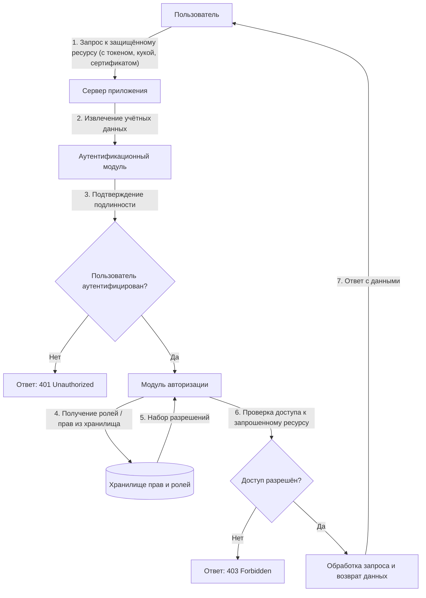

Схема выше демонстрирует процесс авторизации после успешной аутентификации:
- Пользователь обращается к защищённому ресурсу с действительными учётными данными;
- Система проверяет наличие необходимых прав или ролей;
- Принимается решение о предоставлении или отказе в доступе;
- В случае отказа возвращается статус 403 Forbidden, при успехе — запрошенные данные.

**Подлинность субъекта** — это свойство, подтверждающее, что субъект (пользователь, система или процесс) действительно является тем, за кого себя выдаёт. Подлинность устанавливается в ходе процедуры аутентификации, когда субъект предоставляет доказательства своей идентичности: пароль, биометрические данные, аппаратный ключ или другой фактор. Без подтверждения подлинности невозможно гарантировать, что последующие действия субъекта выполняются им самим, а не злоумышленником. Подлинность лежит в основе всех механизмов контроля доступа и защиты информации.

**Право субъекта** — это разрешение на выполнение определённого действия над объектом в информационной системе. Право формируется из сочетания субъекта, объекта и операции: например, "пользователь А может читать файл X". Права назначаются администратором или автоматически на основе ролей, атрибутов или политик. Они ограничивают действия субъекта в рамках его полномочий и предотвращают несанкционированный доступ к ресурсам. Совокупность прав определяет, какие функции доступны пользователю в системе.

**Роль** — это логическая группировка прав, соответствующая функциональной позиции субъекта в системе или организации. Роли упрощают управление доступом: вместо назначения отдельных прав каждому пользователю, права присваиваются роли, а пользователи получают одну или несколько ролей. Примеры ролей: "администратор", "менеджер по продажам", "аналитик". Роль не привязана к конкретному человеку — она описывает набор обязанностей и разрешений, которые могут быть делегированы любому подходящему субъекту.

**Атрибут** — это характеристика субъекта, объекта или контекста, используемая для принятия решений о доступе. Атрибуты могут быть статическими (например, должность, отдел, тип устройства) или динамическими (время суток, географическое местоположение, уровень угрозы). В отличие от ролей, атрибуты не группируют права напрямую, а служат входными данными для политик. Примеры атрибутов: "статус сотрудника — активен", "устройство — корпоративное", "время запроса — рабочие часы".

---

### Инструменты и средства авторизации

**RBAC (Role-Based Access Control)** — это модель управления доступом, основанная на ролях. В RBAC права назначаются ролям, а роли — пользователям. Доступ к ресурсам предоставляется только в том случае, если у пользователя есть роль, включающая необходимое право. Модель поддерживает иерархию ролей, разделение обязанностей и централизованное управление. RBAC широко применяется в корпоративных системах благодаря простоте администрирования и соответствию организационной структуре.

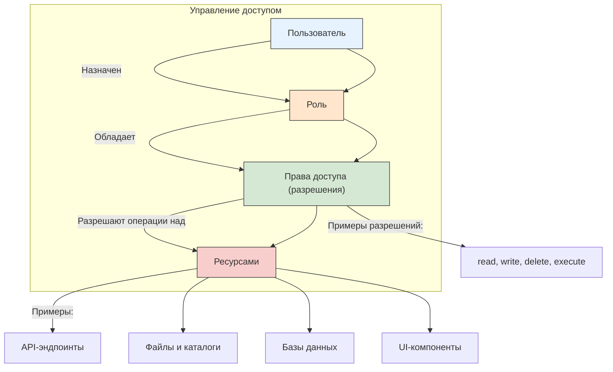

Схема выше отражает основные принципы RBAC:
- Пользователи не получают права напрямую.
- Права назначаются ролям.
- Пользователи связываются с одной или несколькими ролями.
- Роли определяют набор разрешений (permissions).
- Разрешения управляют доступом к ресурсам.

**ABAC (Attribute-Based Access Control)** — это модель управления доступом, основанная на атрибутах. В ABAC решение о предоставлении доступа принимается на основе правил, которые анализируют атрибуты субъекта, объекта, действия и окружающего контекста. Например, доступ к документу может быть разрешён, только если пользователь работает в отделе финансов, запрашивает информацию в рабочее время и использует защищённое устройство. ABAC обеспечивает гибкость и точность, но требует более сложной настройки и обработки политик.

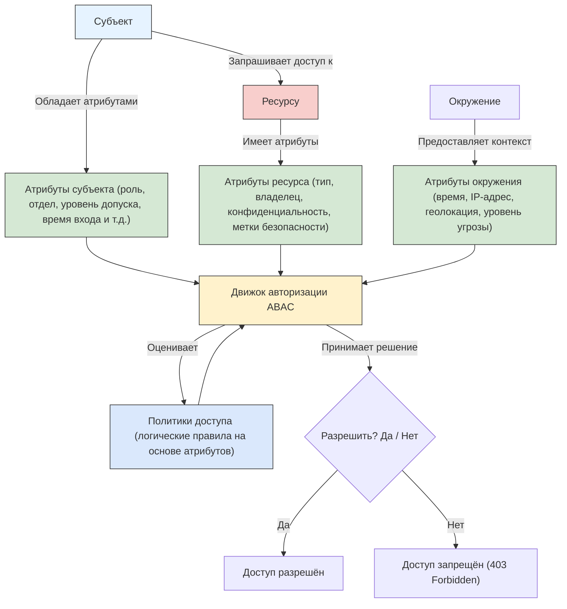

Схема выше демонстрирует принцип работы ABAC:
- Решение о доступе принимается динамически на основе атрибутов:
	- Субъекта (пользователь, система),
	- Ресурса (документ, API, запись в БД),
	- Окружения (время суток, сетевой контекст и др.).
- Все атрибуты передаются в движок авторизации, который применяет политики — формализованные правила (например, в XACML или Rego).
- В отличие от RBAC, связи между пользователями и правами не фиксированы, а вычисляются в момент запроса.

Когда выбирают между RBAC и ABAC, часто применяют гибрид: RBAC - как базовый слой "кто в какой роли", ABAC - как точные ограничения по контексту (время, устройство, география, уровень риска). Это дает баланс между управляемостью и гибкостью.

**Политики безопасности** — это формализованные правила, определяющие, какие действия разрешены или запрещены в информационной системе. Политики описывают условия, при которых субъект может взаимодействовать с объектом, и могут включать временные ограничения, географические рамки, требования к устройству и другие параметры. Политики реализуются в рамках моделей вроде ABAC или используются как основа для аудита и мониторинга. Они обеспечивают единообразие и соответствие требованиям регуляторов, внутренних стандартов или отраслевых норм.

**Протокол авторизации** — это стандартизированный набор правил и процедур, позволяющий одной системе запрашивать и получать разрешение на доступ к ресурсам от имени пользователя в другой системе. Протокол определяет формат сообщений, методы аутентификации участников, способы передачи токенов и обработку ошибок. Протоколы авторизации не подтверждают личность пользователя — они передают уже подтверждённые права между сервисами. Примеры: OAuth 2.0, OpenID Connect, SAML.

**OAuth** — это открытый протокол делегированной авторизации, позволяющий приложению получать ограниченный доступ к ресурсам пользователя в другом сервисе без передачи учётных данных. OAuth использует токены, выдаваемые авторизующим сервером, чтобы подтвердить право на выполнение определённых действий. Например, мобильное приложение может запросить доступ к списку контактов в Google, и пользователь подтверждает это через интерфейс Google, не вводя логин и пароль в приложение. OAuth 2.0 — наиболее распространённая версия протокола, лежащая в основе множества современных интеграций.

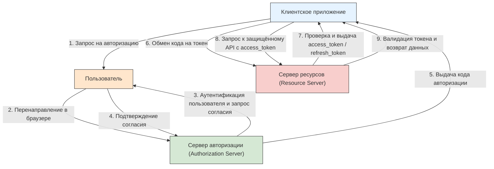

Схема отражает типовой поток `Authorization Code Grant` в OAuth 2.0:
- Пользователь взаимодействует с клиентским приложением.
- Приложение перенаправляет пользователя на сервер авторизации.
- После аутентификации и согласия сервер выдаёт временный код авторизации.
- Клиент обменивает этот код на `access_token` (и опционально `refresh_token`) напрямую с сервером авторизации.
- Полученный `access_token` используется для доступа к защищённым ресурсам.

OAuth 2.0 реализует делегированную авторизацию: пользователь разрешает приложению действовать от его имени без передачи учётных данных.

**Единая система авторизации и аутентификации** — это централизованная платформа, которая управляет идентификацией пользователей и их правами доступа ко всем сервисам в рамках организации или экосистемы. Такая система позволяет пользователю входить один раз (Single Sign-On) и получать доступ ко всем связанным приложениям без повторного ввода учётных данных. Она обеспечивает согласованность политик, упрощает управление жизненным циклом учётных записей и повышает безопасность за счёт централизованного контроля. Примеры: Microsoft Entra ID (ранее Azure AD), Keycloak, Auth0.

<span id="sso-shema"></span>

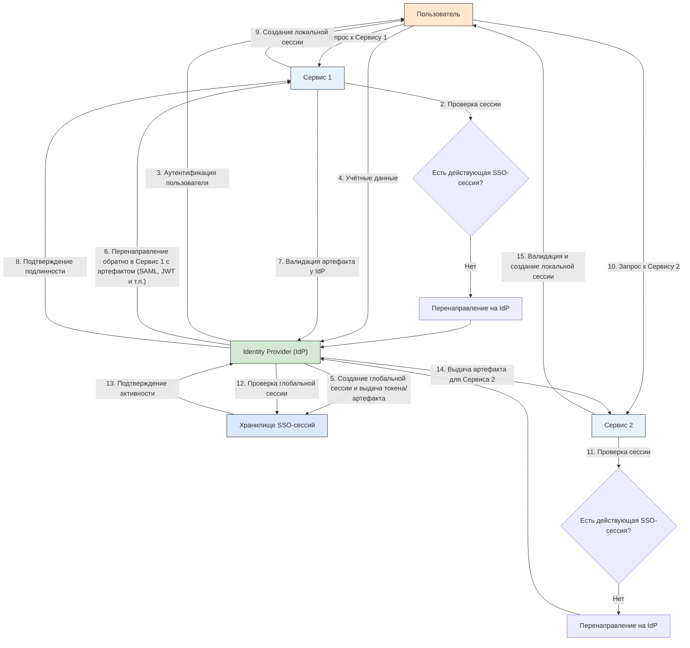

Схема демонстрирует принцип работы централизованного SSO:
- Пользователь проходит аутентификацию один раз в Identity Provider (IdP).
- IdP создаёт глобальную сессию и хранит её состояние.
- При обращении к любому участвующему сервису (Service Provider) проверяется наличие этой глобальной сессии.
- Если сессия активна, пользователь получает доступ без повторного ввода учётных данных.
- Локальные сессии в каждом сервисе управляются независимо, но инициируются на основе единой аутентификации.

Поддерживает протоколы: SAML, OpenID Connect, Kerberos, CAS и др.

**Учётные данные** — это информация, используемая для подтверждения личности субъекта при аутентификации. Учётные данные могут включать логин и пароль, сертификат, биометрический шаблон, секретный ключ или одноразовый код. Они должны храниться и передаваться с соблюдением мер защиты: хеширование, шифрование, изоляция. Учётные данные являются критически важным элементом безопасности — их компрометация позволяет злоумышленнику выдать себя за легитимного пользователя и получить несанкционированный доступ к системе.

---

## Реализация

### Как работает вход в систему

Процесс авторизации начинается с определения модели доверия: какие действия пользователь может выполнять после подтверждения своей личности. 

На этапе проектирования разработчики выбирают факторы аутентификации — пароль, биометрия, аппаратный ключ, одноразовый код — и комбинируют их в соответствии с требованиями безопасности и удобства. 

Проектирование включает:
- выбор модели управления доступом (RBAC, ABAC), 
- определение ролей или атрибутов, 
- формирование политик и настройку интеграции с внешними системами, такими как OAuth-провайдеры или корпоративные каталоги. 

Особое внимание уделяется пользовательскому потоку: экраны ввода, обработка ошибок, восстановление доступа и поведение при истечении сессии.

Подключение к системе аутентификации настраивается через **конфигурационные файлы**, **переменные окружения** или **административные интерфейсы**. 

Внутри приложения указывают **адрес сервера идентификации** (например, OpenID Connect Provider), идентификатор клиента, секрет клиента, URI перенаправления и список запрашиваемых прав (scopes).

Для корпоративных решений подключение часто осуществляется через LDAP, SAML или Kerberos. При использовании облачных сервисов (Auth0, Firebase Auth, Microsoft Entra ID) настройка сводится к регистрации приложения в панели управления провайдера и внедрению SDK или библиотеки для обработки токенов. Все параметры подключения хранятся вне исходного кода и защищаются от несанкционированного доступа.

Данные аутентификации **хранятся раздельно** по типу и уровню чувствительности:
- Пароли никогда не сохраняются в открытом виде — они преобразуются с помощью криптографических хеш-функций с солью (например, bcrypt, scrypt, Argon2). 
- Учётные записи пользователей (логины, email, метаданные) размещаются в базах данных с контролем доступа. 
- Токены сессии или refresh-токены могут храниться в зашифрованных cookie, secure storage мобильного устройства или в распределённом хранилище сессий (Redis, Memcached). 
- Ключи подписи, сертификаты и клиентские секреты размещаются в защищённых хранилищах (Vault, AWS Secrets Manager, Azure Key Vault). 

Все операции записи и чтения логируются для аудита.

Безопасность входа обеспечивается многоуровнево:
- На **транспортном уровне** используется HTTPS с современными протоколами шифрования (TLS 1.2/1.3). 
- На **уровне приложения** реализуются защита от перебора (rate limiting, CAPTCHA), блокировка после множества неудачных попыток, обязательная двухфакторная аутентификация для привилегированных аккаунтов. 

Сессии имеют ограниченный срок действия, привязку к IP-адресу или устройству, и поддерживают принудительное завершение. Все токены подписываются и проверяются на подлинность. Регулярно проводятся аудиты, сканирование уязвимостей и пентесты. Пользователям предоставляется панель активности с историей входов и возможностью отзыва сессий.

**Временные данные** включают:
- access-токены, 
- сессионные cookie,
- одноразовые коды,
- nonce и временные состояния OAuth-запросов. 

Они действуют от нескольких секунд до нескольких часов и автоматически уничтожаются после истечения срока или явного выхода. 

**Постоянные данные** — это:
- учётная запись пользователя, 
- хеш пароля, 
- настройки двухфакторной аутентификации, 
- привязанные устройства, 
- refresh-токены (если разрешены), 
- история входов и аудит-логи. 

Эти данные сохраняются до удаления аккаунта или выполнения запроса на забвение. Некоторые системы хранят refresh-токены с возможностью отзыва, что позволяет сохранять долгосрочный доступ без повторного ввода пароля, но с контролем со стороны пользователя.

---

### Реализация протоколов в системах

#### Keycloak

**Keycloak** разворачивается как отдельный сервер идентификации, обычно в виде Docker-контейнера, Java-приложения на WildFly или в облаке. 

После установки администратор создаёт `realm` — изолированное пространство для пользователей, клиентов и политик. Внутри `realm` регистрируются клиентские приложения (веб, мобильные, API), указываются URI перенаправления, типы грантов и запрашиваемые scopes. 

Пользователи могут быть добавлены вручную, синхронизированы из LDAP или зарегистрированы через форму. 

Keycloak поддерживает OpenID Connect и SAML, предоставляет готовые страницы входа, восстановления пароля и двухфакторной аутентификации. 

Интеграция с приложением осуществляется через библиотеки (например, Spring Security OAuth2, Passport.js) или напрямую посредством проверки JWT-токенов. 

Административный интерфейс позволяет настраивать темы, политики согласия, условия входа и правила маппинга ролей.

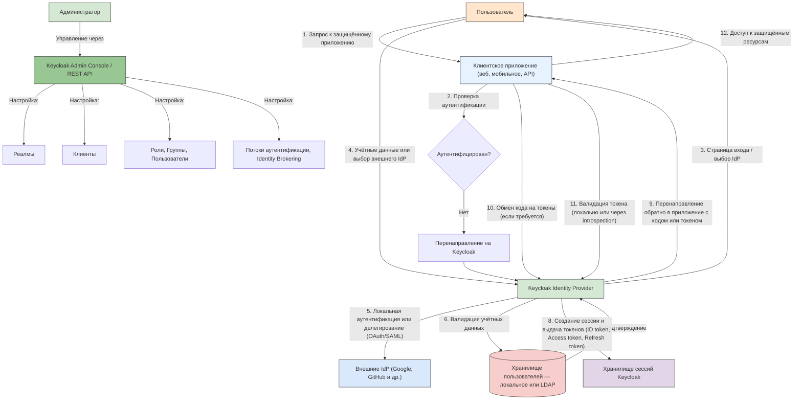

Схема отражает архитектуру и основные компоненты Keycloak:
- Keycloak выступает в роли централизованного сервера идентификации (Identity and Access Management).
- Поддерживает как локальную аутентификацию, так и делегирование через внешние провайдеры (Identity Brokering).
- Использует стандартные протоколы: OpenID Connect, OAuth 2.0, SAML.
- Все данные пользователей, клиентов, ролей и политик организованы в реалмах (изолированных пространствах).
- Администрирование осуществляется через веб-консоль или REST API.
- Приложения (клиенты) интегрируются с Keycloak для делегирования задач аутентификации и авторизации.

Keycloak обеспечивает единый вход (SSO), управление пользователями, многофакторную аутентификацию и гибкие политики безопасности.

---

#### SSO

**Единый вход (SSO)** реализуется через централизованный **Identity Provider (IdP)**, который управляет сессией пользователя. 

При первом обращении к любому сервису пользователь перенаправляется на IdP, где проходит аутентификацию. После успешного входа IdP выдаёт токен или устанавливает cookie, подтверждающий сессию. 

Последующие запросы к другим сервисам автоматически проверяют наличие активной сессии в IdP и не требуют повторного ввода учётных данных. 

Для веб-приложений используется протокол **OpenID Connect** с перенаправлением через браузер; для внутренних сервисов — обмен токенами по защищённым каналам. 

SSO может быть реализован на базе Keycloak, Auth0, Microsoft Entra ID, Okta или собственного решения с поддержкой OAuth 2.0 и OpenID Connect.

---

#### Auth0

**Auth0** подключается как облачный сервис через регистрацию приложения в панели управления. Разработчик указывает тип приложения (Single Page App, Regular Web App, Machine to Machine), домены, URI перенаправления и настраивает правила (Rules) или действия (Actions) для кастомной логики. 

Auth0 предоставляет универсальный экран входа с поддержкой социальных провайдеров (Google, Facebook), корпоративных каталогов (LDAP, Active Directory) и многофакторной аутентификации. 

После аутентификации клиент получает **ID-токен** и **access-токен** в формате JWT. Эти токены проверяются на стороне бэкенда с помощью публичного ключа или эндпоинта интроспекции. Auth0 также поддерживает кастомные домены, брендинг, логирование всех событий и интеграцию с SIEM-системами.

---

#### OAuth 2.0

**OAuth 2.0** реализуется через четыре основных роли: 
- ресурсный владелец, 
- клиент, 
- сервер авторизации;
- сервер ресурсов. 

На практике разработчик регистрирует клиент в сервере авторизации, получает `client_id` и `client_secret`. 

При запросе доступа клиент перенаправляет пользователя на эндпоинт `/authorize` с указанием `scope`, `response_type` и `state`. 

После согласия пользователь возвращается на `redirect_uri` с кодом авторизации. Клиент обменивает этот код на access-токен, отправляя запрос на `/token` с `client credentials`. 

Полученный токен используется для вызова защищённых API. Для конфиденциальных клиентов (backend) используется Authorization Code Flow; для публичных (SPA, мобильные) — Authorization Code Flow с PKCE. Refresh-токены позволяют продлевать доступ без повторного входа.

---

#### JWT и проверка на API

**JWT** состоит из трёх частей в Base64URL, разделённых точкой: `заголовок.полезная_нагрузка.подпись`. Resource server проверяет подпись (по JWK с `/.well-known/openid-configuration` или общему секрету), срок `exp` и при необходимости `aud` (для кого выдан токен).

Фрагмент конфигурации Spring Boot (resource server):

```yaml
spring:
  security:
    oauth2:
      resourceserver:
        jwt:
          issuer-uri: https://keycloak.example.com/realms/my-realm
```

Обмен кода на токен (серверная сторона, упрощённо):

```bash
curl -s -X POST https://auth.example.com/oauth/token \
  -d grant_type=authorization_code \
  -d code="$AUTH_CODE" \
  -d redirect_uri=https://app.example.com/callback \
  -d client_id=my-client \
  -d client_secret="$CLIENT_SECRET"
```

Примеры OAuth-запросов через CLI — [утилита curl](/encyclopedia/2-system-network/2-05-terminal/1133).

Machine-to-machine без участия пользователя — `grant_type=client_credentials` (см. пример 5 ниже).

---

### Примеры реализации

#### Пример 1 — Вход через Google с использованием OAuth 2.0 и OpenID Connect
  
1. Веб-приложение регистрируется в Google Cloud Console. 
2. Пользователь нажимает "Войти через Google", браузер перенаправляется на `accounts.google.com` с параметрами `client_id`, `redirect_uri`, `scope=openid email profile`. 
3. После подтверждения Google возвращает `authorization code`. 
4. Backend приложения отправляет этот код на `https://oauth2.googleapis.com/token` вместе с `client_secret` и получает ID-токен и access-токен. 
5. ID-токен декодируется и проверяется подпись — в нём содержатся email и имя пользователя. 
6. Доступ к Google API (например, Gmail) осуществляется с передачей access-токена в заголовке `Authorization`.


---

#### Пример 2 — Защита REST API с Keycloak

Чеклист Spring Boot для production (HTTPS, CSRF, CSP, секреты, SCA) — [275](/encyclopedia/5-languages/5-03-java/275).
  
1. Сервис на Spring Boot подключает зависимость `spring-boot-starter-oauth2-resource-server`. 
2. В `application.yml` указывается `issuer-uri: http://keycloak:8080/realms/my-realm`. 
3. Все входящие запросы должны содержать заголовок `Authorization: Bearer <access_token>`. 
4. Spring автоматически проверяет подпись JWT, срок действия и `audience`. 
5. Роли из токена маппируются на `Spring Security Authorities`. 
6. Администратор в Keycloak настраивает `client scope` с `mapper`’ом для ролей.

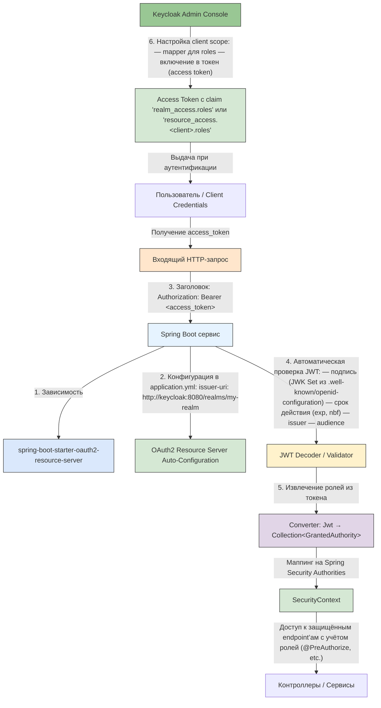

---

#### Пример 3 — Единый вход в корпоративной сети через SAML
  
1. Пользователь открывает внутренний портал, тот перенаправляет его на IdP (например, ADFS или Shibboleth). 
2. Браузер отправляет `SAML AuthnRequest`. 
3. IdP проверяет сессию или запрашивает учётные данные, затем формирует `SAML Response` с утверждениями о пользователе и подписывает его. 
4. Портал проверяет подпись, извлекает email и роли, создаёт локальную сессию. 
5. Все последующие сервисы принимают эту сессию без повторной аутентификации.

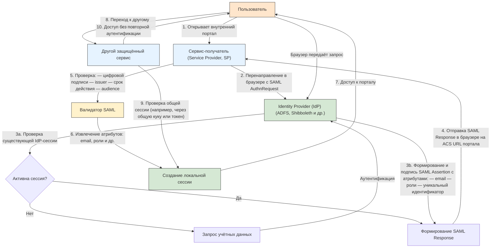

---

#### Пример 4 — Мобильное приложение с Auth0 и PKCE
  
1. Приложение генерирует `code_verifier` и `code_challenge`. 
2. Открывает браузер с запросом на `/authorize`, включая `code_challenge` и `code_challenge_method=S256`. 
3. После входа Auth0 возвращает `code`. 
4. Приложение отправляет `code` и `code_verifier` на `/token`. 
5. Auth0 проверяет соответствие и выдаёт токены. 
6. Access-токен хранится в `secure storage`, refresh-токен — в зашифрованном хранилище. 
7. При истечении access-токена приложение запрашивает новый с помощью refresh-токена.

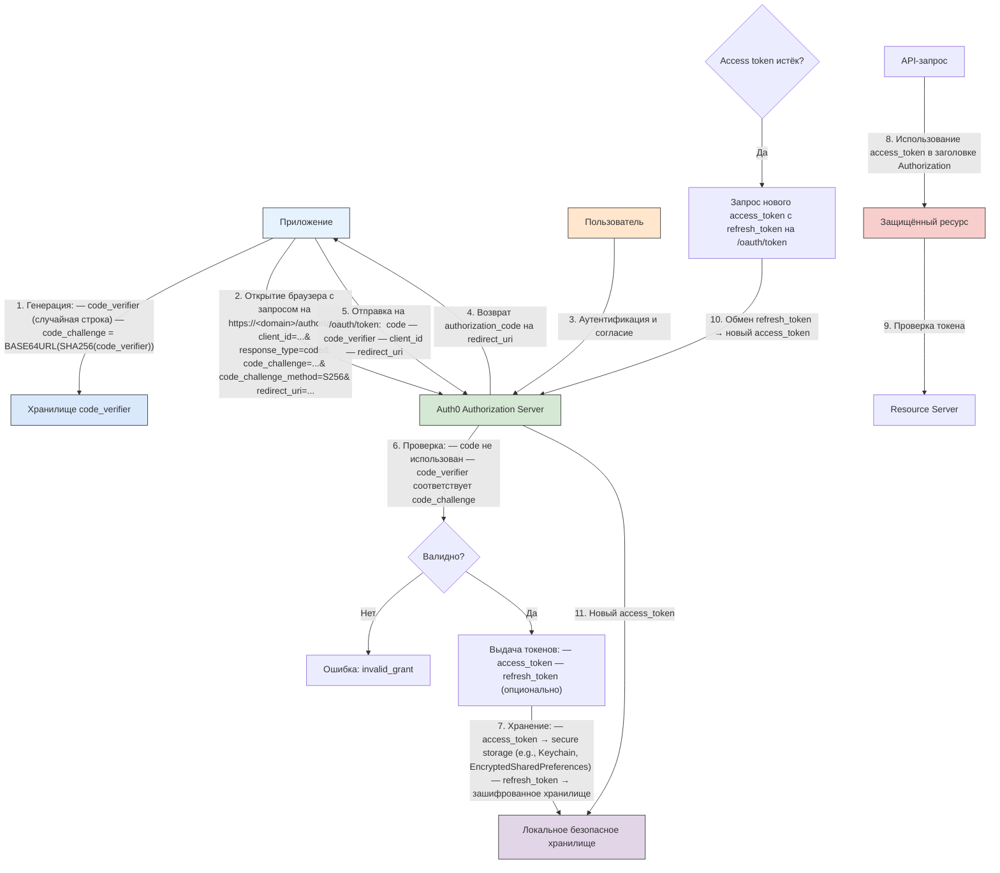

---

#### Пример 5 — Machine-to-Machine авторизация через OAuth 2.0 Client Credentials Flow
  
1. Сервис A должен вызвать API сервиса B. 
2. Оба зарегистрированы в центральном OAuth-сервере. 
3. Сервис A отправляет POST-запрос на `/token` с `grant_type=client_credentials`, `client_id` и `client_secret`. 
4. Сервер выдаёт access-токен с ограниченными правами (например, только чтение логов). 
5. Сервис A включает токен в заголовок `Authorization` при вызове B. 

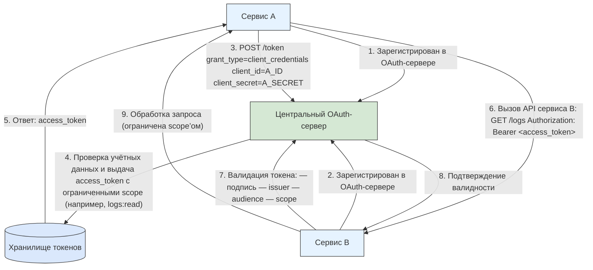

Такой подход исключает участие пользователя и подходит для фоновых задач и микросервисов.

---

## Сессии

<span id="cookies-sessions-jwt-paseto"></span>

### Cookies, sessions, JWT и PASETO

Аутентификация отвечает на вопрос *«Кто вы?»*. Протокол HTTP сам по себе **stateless** — каждый запрос изначально не связан с предыдущими. После успешного входа нужен способ **предъявлять доказательство личности** в следующих обращениях. Ниже четыре понятия, которые в статьях и на схемах часто смешивают:

- **Cookie** — механизм HTTP: браузер хранит пару «имя=значение» и автоматически отправляет её серверу.
- **Session** — паттерн: состояние пользователя лежит на **сервере**, клиенту выдают только **Session ID** (часто в cookie).
- **JWT** — формат **stateless**-токена: claims и подпись в одной строке, сервер проверяет локально.
- **PASETO** — альтернативный формат токена с **фиксированными версиями** криптографии вместо выбора алгоритма в заголовке.

| | Cookie | Session (server-side) | JWT | PASETO |
|---|--------|----------------------|-----|--------|
| **Роль** | Транспорт и локальное хранение на клиенте | Модель «память на сервере» | Самодостаточный токен | Самодостаточный токен (более жёсткие правила) |
| **Stateful / stateless** | Зависит от содержимого | **Stateful** — нужен Session Store | **Stateless** — store сессий не обязателен | **Stateless** |
| **Что уходит в запросе** | Значение cookie (ID, токен, настройки) | Короткий Session ID | `Authorization: Bearer …` или cookie с JWT | То же, что JWT |
| **Отзыв до истечения срока** | Удалить cookie / инвалидировать значение | Удалить запись в Session Store | Blacklist, короткий `exp`, rotation refresh | Аналогично JWT |
| **Типичное применение** | Session ID, CSRF-токен, тема UI | Классический вход в веб-приложение | REST API, микросервисы, OAuth access token | Проекты, где важны безопасные дефолты вместо «alg» в JWT |

Пошаговые схемы cookie и Session ID — в [хранении данных в браузере](/encyclopedia/2-system-network/2-04-kak-rabotayut-sayty-i-veb-sayty/116#cookies-and-sessions). Эволюция от Basic до OAuth — в [разделе выше](#evolyutsiya-sposobov-vhoda).

#### Cookie — данные на клиенте

**Cookie** (HTTP cookie) — заголовки `Set-Cookie` / `Cookie`: сервер задаёт небольшой фрагмент данных, браузер прикладывает его к следующим запросам на тот же origin. Cookie **сам по себе** описывает только доставку; внутри может лежать Session ID, JWT, язык интерфейса или идентификатор A/B-теста.

*Типичный поток (cookie как носитель идентификатора):*

1. Клиент отправляет логин и пароль.
2. Сервер аутентифицирует пользователя.
3. Сервер отвечает `Set-Cookie` с нужным значением.
4. Клиент сохраняет cookie в браузере.
5. При запросе данных браузер **автоматически** добавляет cookie.
6. Сервер читает значение и принимает решение о доступе.

Флаги `HttpOnly`, `Secure`, `SameSite` — в [разделе про хранение](#хранение-данных) и в [HTTP-справочнике](/encyclopedia/2-system-network/2-03-set-i-internet/611#сессии--углублённый-разбор-set-cookie).

#### Session — stateful-логика на сервере

**Session** (серверная сессия) — запись в **Session Store** (память процесса, Redis, Memcached, таблица в БД) плюс **Session ID** у клиента. Секреты (роли, корзина, время входа) **не покидают сервер**; cookie несёт только случайный ключ.

*Вход:*

1. Логин и пароль → сервер.
2. Сервер проверяет учётные данные.
3. Сервер **создаёт запись** в Session Store.
4. Клиент получает cookie с **Session ID**.

*Следующий запрос:*

5. Браузер отправляет cookie с Session ID.
6. Сервер **ищет запись** в Session Store и проверяет срок действия.
7. Сервер возвращает данные с учётом состояния сессии.

Такой **stateful**-подход упрощает выход из аккаунта и принудительный отзыв, но требует общего или реплицируемого хранилища при нескольких инстансах приложения.

#### JWT — stateless-аутентификация

**JWT** (JSON Web Token, RFC 7519) — три сегмента в Base64URL через точку: **header.payload.signature**.

**Header** — метаданные токена, например:

```json
{"typ": "JWT", "alg": "HS256"}
```

**Payload** — claims (утверждения о субъекте и сроке):

```json
{"sub": "78954", "userId": "John", "email": "john@test.com", "exp": 1427321171}
```

**Signature** — результат криптографической операции над закодированными header и payload (HMAC с секретом или асимметричная подпись). Сервер **пересчитывает подпись** или проверяет её публичным ключом; обращение к Session Store для самой сессии **не требуется**.

*Типичный поток:*

1. `POST /login` с логином и паролем.
2. Сервер проверяет credentials.
3. Сервер **создаёт и подписывает** JWT.
4. Клиент **хранит** JWT (HttpOnly cookie, secure storage мобильного приложения; хранение access-токена в `localStorage` уязвимо к XSS).
5. `GET /user` с заголовком `Authorization: Bearer <token>`.
6. Сервер **проверяет подпись**, `exp`, при необходимости `aud` и `iss`.
7. Сервер возвращает данные.

JWT удобен для горизонтального масштабирования API и стека OAuth 2.0 / OpenID Connect. Слабое место — гибкость поля `alg` в header (ошибки конфигурации, атаки с подменой алгоритма); payload по умолчанию **не шифруется**, только подписывается — не кладите в JWT то, что нельзя показывать клиенту.

<span id="jwt-i-api-keys"></span>

#### JWT и API-ключи — разные задачи

**JWT** и **API-ключ** оба могут ехать в заголовке `Authorization: Bearer …`, но решают разные задачи.

| | JWT | API-ключ |
|---|-----|----------|
| **Назначение** | Сессия пользователя, OAuth access token, claims о ролях и сроке | Идентификация приложения или интеграции без контекста человека |
| **Срок** | Истекает по `exp`, продлевается через refresh или новый OAuth-обмен | Действует до отзыва вручную |
| **Проверка** | Подпись и claims на API без Session Store | Сверка строки с реестром ключей в БД |
| **Где уместен** | Веб-приложения, мобильные клиенты, единый вход, микросервисы с IdP | Публичный API для разработчиков, простые скрипты, ранний MVP |

Для **пользовательского входа** после `POST /login` почти всегда выбирают JWT (или серверную session + cookie). Для **сервис-сервис** и партнёрских интеграций API-ключ проще внедрить, но в production чаще переходят на OAuth Client Credentials или mTLS. Пошаговые потоки, сравнительные таблицы и предупреждения про утечку ключей — в [авторизации в интеграционных сценариях](/encyclopedia/2-system-network/2-09-osnovy-integratsionnogo-vzaimodeystviya/1121#tokens-i-api-keys).

#### PASETO — Platform-Agnostic Security Tokens

**PASETO** (Platform-Agnostic SEcurity TOkens) — формат токена, который сознательно **не даёт разработчику выбирать алгоритм** в каждом токене. Вместо JSON-header с `alg`, как у JWT, используется **версия** и **назначение** (purpose):

| Часть | Пример | Смысл |
|-------|--------|--------|
| **Version** | `v2` | Набор криптографии зафиксирован стандартом (v1/v2/v3/v4) |
| **Purpose** | `local` или `public` | `local` — симметричное шифрование payload; `public` — асимметричная подпись (Ed25519) |
| **Payload** | зашифрованный или подписанный блок | Claims внутри; для `local` без ключа прочитать нельзя |

Пример строки: `v2.public.eyJ...` — публичный (подписанный) токен версии 2; `v2.local.…` — локальный (зашифрованный) токен.

*Типичный поток (public-токен):*

1. Клиент отправляет credentials на **Authorization Server**.
2. Сервер возвращает PASETO (в теле ответа, cookie или параметре redirect).
3. Resource server **разбирает** версию и purpose, **проверяет** подпись **публичным ключом** (для `public`) или расшифровывает симметричным ключом (для `local`).
4. При успехе создаётся контекст пользователя или локальная сессия приложения.

PASETO снижает риск misconfiguration вроде `alg: none` или HMAC с публичным ключом RSA. В индустрии **де-факто** стандарт остаётся JWT — его требуют OAuth 2.0, большинство IdP и библиотек; PASETO уместен в greenfield-проектах и там, где команда хочет opinionated crypto out of the box. Библиотеки — [paseto.io](https://paseto.io/).

<div class="callout callout--tip">
  <div class="callout-title">Кратко</div>

  <div class="callout-body">
  <strong>Cookie</strong> — как доставить идентификатор или настройку в каждый запрос. <strong>Session</strong> — сервер помнит пользователя в Session Store, клиент держит только ID. <strong>JWT</strong> — подписанный payload, сервер проверяет токен без своей таблицы сессий. <strong>PASETO</strong> — тот же класс задач, что JWT, с версиями и purpose вместо свободного выбора <code>alg</code>.
</div>
</div>

<span id="bezopasnyy-potok-vhoda"></span>

### Безопасный поток входа — login, session, refresh, logout

Ниже — эталонная схема для SPA и REST API с парой **access** + **refresh**: короткий access-токен для запросов к API, долгий refresh — только в **HttpOnly**-cookie. Тот же каркас лежит в основе OAuth 2.0 / OpenID Connect, только выдачу токенов выполняет Authorization Server. Сравнение форматов — в [разделе выше](#cookies-sessions-jwt-paseto); хеши паролей и атаки на перебор — в [статье про пароли](./114).

#### Где хранить токены на клиенте

| Токен | Срок жизни (типично) | Где держит клиент | Зачем так |
|-------|----------------------|-------------------|-----------|
| **Access** | 5–15 минут | Память процесса (переменная приложения, closure; для мобильных — secure storage) | Короткий срок снижает ущерб при утечке; в `localStorage` access попадает в зону XSS |
| **Refresh** | дни–недели | **HttpOnly** + **Secure** + **SameSite** cookie | JavaScript не читает cookie — основная защита refresh от кражи через XSS |

Access передают в `Authorization: Bearer …` или в отдельной HttpOnly-cookie, если API и фронт на одном site. Refresh **никогда** не кладут в `localStorage`, URL или логи.

#### 1. Вход (login)

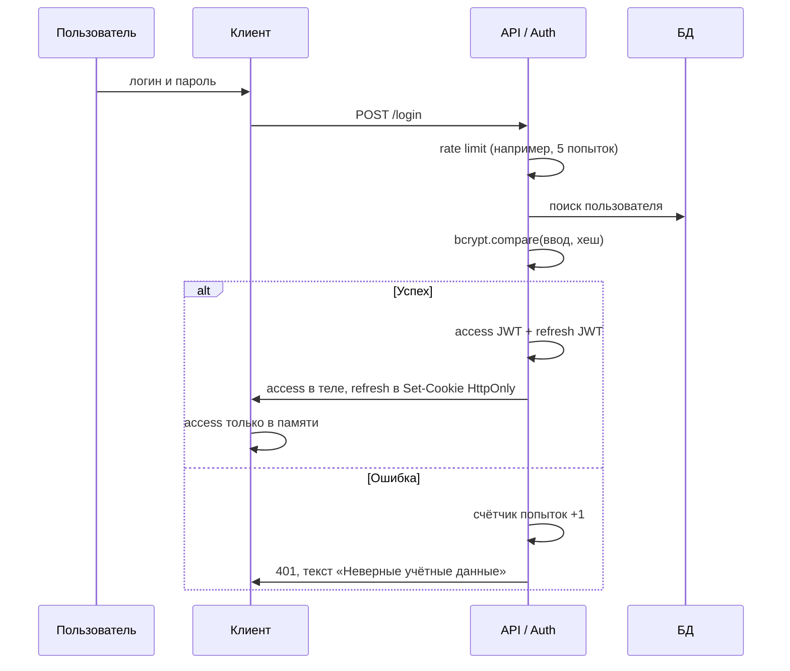

Пошагово:

1. **Валидация ввода** на сервере (формат email/логина, длина пароля) — без доверия данным с клиента.
2. **Rate limiting** на `/login` и `/refresh` — отдельно от общего лимита API; на входе лимит **строже** ([rate limit на API](/encyclopedia/7-project/7-06-proektirovanie-i-arhitektura/141#10-rate-limiting), [безопасность API](/encyclopedia/8-infra-security/8-07-informatsionnaya-bezopasnost/128#rate-limiting)).
3. **Поиск пользователя** и проверка пароля через `bcrypt.compare` (или Argon2) с хешем из БД — пароль в открытом виде не хранят и не сравнивают напрямую ([хеширование](./114)).
4. При успехе — **access-токен** (короткий `exp`) и **refresh-токен** (длинный `exp`); refresh уходит в `Set-Cookie` с `HttpOnly; Secure; SameSite=Lax` (или `Strict` при жёсткой политике CSRF).
5. При ошибке — **одно и то же сообщение** («Неверные учётные данные»), без подсказок «пользователь не найден» / «неверный пароль» (защита от перечисления учёток). Желательно выровнять **время ответа** при успехе и неудаче, чтобы по задержке нельзя было угадать существование логина.

События входа (успех, отказ, блокировка по rate limit) пишут в **аудит** — см. [антипаттерны](#antipatterny-i-kak-pravilno) в начале статьи.

#### 2. Поддержание сессии (refresh)

Когда access истекает, клиент **автоматически** вызывает, например, `POST /auth/refresh`. Браузер прикладывает refresh-cookie; JavaScript к ней доступа не имеет.

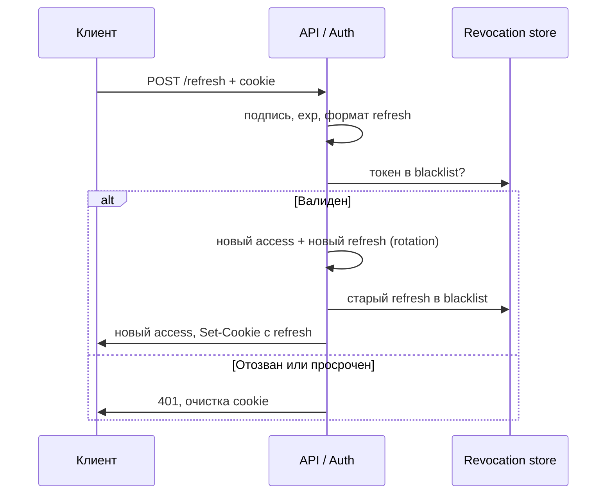

**Ротация refresh** — при каждом обмене выдают новый refresh и **инвалидируют предыдущий** (запись в Redis/БД или blacklist). Украденный refresh действует один раз или до первого легитимного обновления.

Проверки на refresh: подпись, `exp`, привязка к устройству или `jti` (идентификатор токена), отсутствие в **списке отозванных**.

#### 3. Выход (logout)

1. Клиент вызывает `POST /logout`.
2. Сервер помещает текущий refresh в **revocation list** (blacklist) до истечения его `exp`.
3. Ответ с `Set-Cookie`, **очищающим** refresh-cookie (`Max-Age=0`).
4. Клиент удаляет access из памяти и сбрасывает состояние UI.

**Глобальный выход** (опционально) — удалить все refresh-сессии пользователя в store: смена пароля, подозрение на взлом, кнопка «выйти на всех устройствах».

#### Принципы и угрозы

| Принцип | Что даёт |
|---------|----------|
| HTTPS везде | Защита пароля и cookie от перехвата в сети |
| HttpOnly + Secure + SameSite на refresh | XSS не вычитывает долгий токен; CSRF режется `SameSite` и отдельным CSRF-токеном на state-changing запросах |
| Короткий access + rotation refresh | Окно компрометации минимально; утечка refresh быстро гасится |
| Blacklist / session store для refresh | Выход и отзыв до истечения срока |
| Rate limit на login | Brute force, credential stuffing, password spraying ([типы атак](./114#tipy-atak-na-paroli)) |
| Аудит безопасности | Расследование инцидентов; логи только на сервере |

<div class="callout callout--warning">
  <div class="callout-title">Типичные ошибки</div>

  <div class="callout-body">
  <ul>
    <li>Refresh в <code>localStorage</code> — при XSS злоумышленник забирает долгоживущий токен.</li>
    <li>Один refresh без ротации — украденный токен живёт до <code>exp</code>.</li>
    <li>Logout только на клиенте — refresh остаётся валидным для API.</li>
    <li>Разные тексты ошибок для «нет пользователя» и «неверный пароль» — перечисление учёток.</li>
  </ul>
  </div>
</div>

Практика хранения cookie и запрет токенов в `localStorage` — в [хранении данных в браузере](/encyclopedia/2-system-network/2-04-kak-rabotayut-sayty-i-veb-sayty/116#cookies-and-sessions). Флаги `Set-Cookie` — в [HTTP-справочнике](/encyclopedia/2-system-network/2-03-set-i-internet/611#сессии--углублённый-разбор-set-cookie).

---

### Основы сессий

**Сессия** — это временный интервал взаимодействия между пользователем и системой, в течение которого система сохраняет состояние пользователя. 

После успешной аутентификации сервер создаёт сессию, присваивает ей **уникальный идентификатор** и использует его для распознавания последующих запросов от того же пользователя. 

Сессия завершается по истечении времени неактивности, при явном выходе или по решению администратора. Сессии позволяют веб-приложениям поддерживать контекст между HTTP-запросами, которые по своей природе безсостоятельны.

Ключевые понятия, связанные с сессиями:  
- **Идентификатор сессии** — уникальная строка, выдаваемая сервером при создании сессии.  
- **Состояние сессии** — данные, хранящиеся на сервере или клиенте, описывающие текущее положение пользователя (роли, права, предпочтения).  
- **Время жизни** — период, в течение которого сессия считается действительной.  
- **Привязка** — ограничение сессии к определённому IP-адресу, устройству или браузеру для повышения безопасности.  
- **Отзыв** — принудительное завершение сессии администратором или пользователем.

Сессия начинается после *аутентификации*. Сервер генерирует идентификатор, сохраняет **метаданные сессии** (время создания, время последнего доступа, права) и отправляет идентификатор клиенту. 

Клиент включает этот идентификатор в каждый последующий запрос — обычно через cookie, заголовок Authorization или параметр URL. Сервер извлекает идентификатор, проверяет его подлинность и срок действия, затем восстанавливает состояние пользователя. При выходе клиент отправляет запрос на завершение сессии, и сервер удаляет соответствующую запись.

Существуют два основных подхода к реализации сессий:  
- **Серверные сессии**: данные хранятся на сервере (в памяти, базе данных или кэше), клиент получает только идентификатор. Этот подход обеспечивает полный контроль над состоянием и безопасность, но требует масштабируемого хранилища.  
- **Клиентские сессии (stateless)**: все данные сессии кодируются и подписываются, затем передаются клиенту (например, в JWT). Сервер не хранит состояние, что упрощает горизонтальное масштабирование, но усложняет отзыв токенов и увеличивает объём передаваемых данных.

На практике оба подхода используют cookie, но **несут разную нагрузку**. В первом случае cookie содержит только Session ID, а сервер при каждом запросе читает состояние из **Session Store** (Redis, Memcached, БД). Во втором cookie несёт токен или подписанный payload — браузер автоматически отправляет его с каждым запросом, и сервер восстанавливает контекст без обращения к хранилищу. Первый вариант надёжнее для чувствительных данных и мгновенного выхода из аккаунта; второй проще развернуть без общего store между инстансами приложения. Пошаговые схемы входа и запроса страницы — в [хранении данных в браузере](/encyclopedia/2-system-network/2-04-kak-rabotayut-sayty-i-veb-sayty/116#cookies-and-sessions).

---

### Токены

**Токен** — это цифровой объект, подтверждающий право на выполнение определённых действий. В контексте сессий токены заменяют или дополняют традиционные идентификаторы сессий. Они могут быть одноразовыми, временными или долгоживущими. 

Токены передаются в заголовках HTTP, cookie или теле запроса и проверяются на подлинность, срок действия и соответствие запрашиваемому ресурсу.

**JWT (JSON Web Token)** — это открытый стандарт (RFC 7519) для представления утверждений в виде компактного, самодостаточного JSON-объекта. 

JWT состоит из трёх частей: 
- заголовка (header), 
- полезной нагрузки (payload),
- подписи (signature). 

Полезная нагрузка содержит утверждения о пользователе (sub, email, roles) и метаданные (exp, iat, iss). Подпись гарантирует целостность токена. 

JWT используется в stateless-архитектурах, где сервер не хранит сессионные данные, а извлекает их из самого токена. Структура, поток входа и сравнение с session cookie и PASETO — в [разделе выше](#cookies-sessions-jwt-paseto).

**PASETO** (Platform-Agnostic SEcurity TOkens) — формат токена с фиксированными версиями криптографии (`v2.local`, `v2.public` и др.) вместо поля `alg` в JWT. Подходит там, где нужны более строгие дефолты; в экосистеме OAuth/OIDC по-прежнему доминирует JWT. Подробнее — [Cookies, sessions, JWT и PASETO](#cookies-sessions-jwt-paseto).

**ID-токен** — это JWT, выдаваемый в рамках протокола OpenID Connect для подтверждения личности пользователя. Он содержит минимальный набор утверждений: идентификатор субъекта (sub), имя, email, время выдачи (iat) и срок действия (exp). 

ID-токен предназначен исключительно для клиента (обычно фронтенда) и не используется для доступа к API. Его основная цель — информировать приложение о том, что пользователь успешно прошёл аутентификацию.

**Access-токен** — это учётная запись, предоставляющая право на доступ к защищённым ресурсам. Он выдаётся после аутентификации и авторизации и содержит информацию о разрешённых действиях (scopes) и ресурсах. 

Access-токены обычно короткоживущие (от нескольких минут до часа) и передаются в заголовке `Authorization: Bearer <token>`. Сервер проверяет подпись, срок действия и соответствие scopes запрашиваемой операции. Использование короткого срока действия снижает риск при компрометации токена.

**Refresh-токен** — это долгоживущий токен, предназначенный для получения новых access-токенов без повторного ввода учётных данных. Он выдаётся вместе с access-токеном и хранится в защищённом месте (secure storage, HttpOnly cookie). 

При истечении access-токена клиент отправляет refresh-токен на эндпоинт `/token` (или `/auth/refresh`), и сервер выдаёт новую пару токенов. Refresh-токены могут быть отозваны, имеют ограниченное число использований и часто привязаны к устройству. На практике включают **ротацию** (новый refresh при каждом обновлении) и **blacklist** при logout — пошагово в [безопасном потоке входа](#bezopasnyy-potok-vhoda).

---

### Хранение данных

Сессионные cookie — это небольшие фрагменты данных, сохраняемые браузером и автоматически отправляемые на сервер с каждым запросом. Они содержат идентификатор сессии или токен и удаляются при закрытии браузера. 

Для защиты используются флаги:  
- **HttpOnly** — запрещает доступ к cookie через JavaScript, предотвращая XSS-атаки.  
- **Secure** — разрешает передачу cookie только по HTTPS.  
- **SameSite** — ограничивает отправку cookie в межсайтовых запросах, защищая от CSRF.

<WebAttackSimulatorPlay initialTab="csrf" />

<div class="callout callout--info">
  <div class="callout-title">CSRF и cookie</div>

  <div class="callout-body">
  <strong>CSRF</strong> (подделка межсайтового запроса) — атака, при которой браузер жертвы отправляет запрос на сайт, где она уже авторизована. Защита: флаг cookie <code>SameSite</code>, CSRF-токены в формах, проверка заголовка <code>Origin</code>. Симулятор выше показывает типичный сценарий.
</div>
  </div>


**Шифрование cookie** применяется, когда в них хранятся чувствительные данные (например, в stateless-сессиях). Данные сериализуются, шифруются симметричным алгоритмом (AES) и подписываются (HMAC). Сервер использует общий секретный ключ для расшифровки и проверки целостности. Шифрование предотвращает чтение и подделку содержимого cookie злоумышленником, даже если он перехватит его.

**Secure storage** — это защищённые механизмы хранения данных на клиентском устройстве. В мобильных приложениях это Keychain (iOS) и Keystore (Android). В веб-приложениях — зашифрованные localStorage/IndexedDB с дополнительной защитой через CSP и Content Security Policy. Secure storage используется для хранения refresh-токенов, ключей шифрования и других конфиденциальных данных. Доступ к нему ограничен операционной системой и недоступен другим приложениям.

Для масштабируемых систем сессии хранятся в **распределённых кэшах**, таких как Redis или Memcached. 

Сервер при создании сессии сохраняет её данные в хранилище по ключу — идентификатору сессии. Любой экземпляр приложения может получить доступ к этим данным, что позволяет балансировать нагрузку между серверами без привязки пользователя к конкретному узлу. 

Redis предпочтительнее благодаря поддержке TTL (автоматического удаления по истечении срока), persistence и атомарных операций. Memcached проще и быстрее, но менее функционален.

{/* sidebar-collections */}

---

## В подборках

Статья входит в тематические маршруты из меню **Подборки** и блока "С чего начать?" на главной. Соседние шаги того же маршрута:

**Бэкенд и серверная разработка** — [Системное администрирование — о разделе](/encyclopedia/2-system-network/2-06-sistemnoe-administrirovanie/intro), [ORM и работа с данными — о разделе](/encyclopedia/4-code-dev/4-10-orm-i-rabota-s-dannymi/intro), [Терминал — о разделе](/encyclopedia/2-system-network/2-05-terminal/intro), [Low-code и No-code платформы](/encyclopedia/8-infra-security/8-02-low-code-no-code/1), [Архитектура персонального компьютера](/encyclopedia/1-basics/1-08-kak-rabotaet-kompyuter/7), [Методы защиты пользовательских и корпоративных данных](/encyclopedia/8-infra-security/8-03-zabota-o-kode-i-dannyh/117).

**Архитектура и проектирование ПО** — [Low-code и No-code платформы](/encyclopedia/8-infra-security/8-02-low-code-no-code/1), [Основы интеграционного взаимодействия — о разделе](/encyclopedia/2-system-network/2-09-osnovy-integratsionnogo-vzaimodeystviya/intro), [Программные платформы](/encyclopedia/2-system-network/2-02-platformy/3), [Архитектура выполнения — о разделе](/encyclopedia/4-code-dev/4-06-arhitektura-vypolneniya/intro), [Платформы в IT](/encyclopedia/2-system-network/2-02-platformy/1), [Архитектура десктопных приложений](/encyclopedia/4-code-dev/4-11-desktopnye-prilozheniya/1).

**Системная аналитика** — [Основы архитектуры](/encyclopedia/4-code-dev/4-04-proekt-i-freymvorki/112), [Основы интеграционного взаимодействия — о разделе](/encyclopedia/2-system-network/2-09-osnovy-integratsionnogo-vzaimodeystviya/intro), [Платформенные решения в бизнесе](/encyclopedia/2-system-network/2-02-platformy/3002), [Техническое письмо — о разделе](/encyclopedia/7-project/7-08-tehnicheskoe-pismo/intro), [Корпоративное ПО](/encyclopedia/2-system-network/2-02-platformy/3001), [Low-code и No-code платформы](/encyclopedia/8-infra-security/8-02-low-code-no-code/1).

**Тестирование ПО** — [Платформенные решения в бизнесе](/encyclopedia/2-system-network/2-02-platformy/3002), [Основы интеграционного взаимодействия — о разделе](/encyclopedia/2-system-network/2-09-osnovy-integratsionnogo-vzaimodeystviya/intro), [Корпоративное ПО](/encyclopedia/2-system-network/2-02-platformy/3001), [Техническое письмо](/encyclopedia/7-project/7-08-tehnicheskoe-pismo/1), [Программные платформы](/encyclopedia/2-system-network/2-02-platformy/3), [Low-code и No-code платформы](/encyclopedia/8-infra-security/8-02-low-code-no-code/1).

{/* /sidebar-collections */}

---

{/* http-basics-link  */}
<div class="callout callout--tip">
  <div class="callout-title">Основа по протоколу</div>

  <div class="callout-body">
  Базовый разбор HTTP и HTTPS находится в отдельной статье — [HTTP как основа веб-интеграций](/encyclopedia/2-system-network/2-09-osnovy-integratsionnogo-vzaimodeystviya/118).
</div>
  </div>


