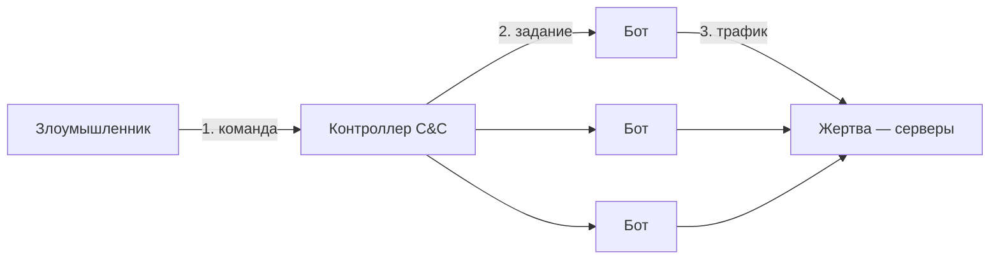
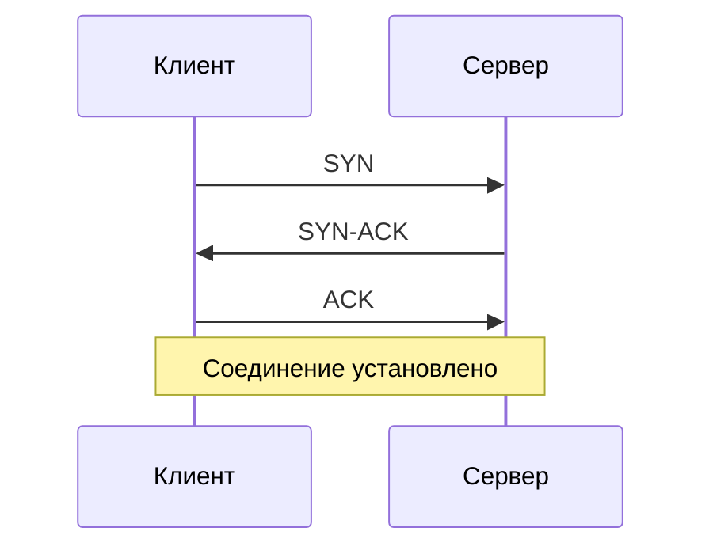
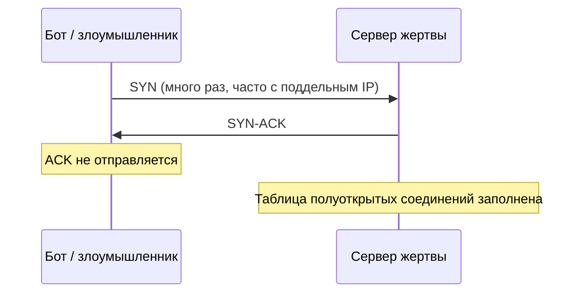

# DDoS и отказ в обслуживании

  ОБЯЗАТЕЛЬНО
  ДЛЯ НОВИЧКОВ

Всем

**DDoS** (Distributed Denial of Service, распределённый отказ в обслуживании) — атака, при которой на сервер или канал связи направляют огромный поток запросов или пакетов. Ресурсы исчерпываются, и **реальные пользователи** перестают получать ответ в разумное время — сайт "лежит", API отвечает таймаутом, игра отключается.

Это удар по свойству **доступности** из триады CIA — см. [основы информационной безопасности](./1). Отдельно от взлома данных — цель часто — остановить сервис, вымогательство или отвлечение внимания, пока идёт другая атака.

См. также [глоссарий — DDoS](/glossary/D#ddos), [ботнет](/glossary/Б#ботнет), [фаерволы](./115), [угрозы доступности в сети](/encyclopedia/2-system-network/2-03-set-i-internet/616#ugrozy-ot-kotoryh-zaschischayutsya-seti).

---

## DoS и DDoS — в чём разница

| | **DoS** | **DDoS** |
|---|---------|----------|
| Источник трафика | Один узел (или небольшая группа) | Много узлов одновременно |
| Масштаб | Проще отфильтровать по IP | Трафик "размазан" по тысячам адресов |
| Типичный сценарий | Ошибка в коде, один злоумышленник с мощной машиной | [Ботнет](/glossary/Б#ботнет) под управлением оператора |

**DoS** (Denial of Service) — любой сценарий, когда система перестаёт обслуживать добросовестных клиентов — и злонамеренный флуд, и легитимный всплеск ("эффект Slashdot"), и баг, который открывает миллион соединений. **DDoS** — частный случай DoS с **распределённым** источником.

---

## Как устроена DDoS-атака

Классическая схема — цепочка управления:

1. **Злоумышленник** задаёт цель (IP, домен, порт) и тип атаки.
2. **Контроллер** (command-and-control, C&C) рассылает команды заражённым машинам — **ботам** или **zombie** ("зомби" в жаргоне ИБ).
3. **Боты** одновременно шлют трафик на **жертву**. С точки зрения сервера это тысячи "клиентов" по всему миру.

Ботом может стать любое устройство с уязвимостью или трояном — ПК, роутер, камера, NAS. Червь в таблице вредоносного ПО часто **создаёт ботнеты** — см. [вирусы и угрозы](./1#malware-i-botnety). Участие вашего устройства в ботнете снижают [фаервол](./115.md), обновления ОС и контроль исходящего трафика.

---

## Уровни атаки (L3, L4, L7)

Атаки классифицируют по тому, **на каком уровне** давят на жертву:

| Уровень | Что перегружают | Примеры |
|---------|-----------------|---------|
| **L3 (сеть)** | Канал, маршрутизатор | UDP-flood, ICMP-flood, огромный объём "мусорных" пакетов |
| **L4 (транспорт)** | Таблицу TCP-соединений, сокеты | **SYN-flood**, ACK-flood |
| **L7 (приложение)** | HTTP-воркеры, БД, CPU на разбор запросов | Массовые `GET`/`POST`, тяжёлые URL, медленные POST |

На периметре и у CDN чаще всего фильтруют L3–L4; для L7 нужны WAF, rate limiting и кэш на edge — см. [реверс-прокси и DDoS](/encyclopedia/2-system-network/2-03-set-i-internet/614.md), [CDN и Cloudflare](/encyclopedia/2-system-network/2-03-set-i-internet/212.md).

---

## Пример — SYN-flood и TCP handshake

Чтобы понять **SYN-flood**, сначала — нормальное установление TCP-соединения (**three-way handshake**). Подробнее в цепочке загрузки сайта — [шаг 2, TCP](/encyclopedia/2-system-network/2-03-set-i-internet/5#shag-2-tcp-handshake).

**Обычный клиент и сервер**

1. Клиент шлёт **SYN** ("хочу соединение").
2. Сервер отвечает **SYN-ACK** и **резервирует** место в таблице полуоткрытых соединений.
3. Клиент подтверждает **ACK** — соединение готово к обмену данными.

**SYN-flood (атака)**

Бот рассылает **массу SYN** и **не завершает** рукопожатие финальным ACK (или адрес источника подделан — **spoofing**, ответы уходят "в никуда"). Сервер держит тысячи **half-open** (полуоткрытых) записей, ждёт ACK, исчерпывает память или лимит соединений — **легитимный** клиент получает отказ или таймаут.

Это атака **уровня L4**: эксплуатирует механизм TCP, а не баг в коде сайта.

  
Защита на стороне сервера

  

  На Linux и в балансировщиках применяют <strong>SYN cookies</strong>, лимиты на полуоткрытые соединения, фильтрацию на провайдере и scrubbing-центрах. Домашний роутер от SYN-flood крупного сайта сам не защитит — это задача хостинга, CDN и сети оператора.
  

---

## Другие распространённые приёмы

- **UDP-flood** — поток датаграмм на открытый порт без установления сессии; сервис тратит CPU на разбор.
- **HTTP-flood (L7)** — тысячи обычных на вид `GET` к тяжёлой странице или поиску; сложнее отличить от реальной нагрузки без анализа поведения.
- **Slowloris / slow POST** — соединения держат открытыми, отправляя данные по байту — исчерпывают пул воркеров веб-сервера.
- **Амплификация** — маленький запрос провоцирует большой ответ (например, через открытые UDP-сервисы); жертвой часто становится **подставленный** IP.

---

## Признаки и что делать

**Симптомы для пользователя:** сайт не открывается, таймауты, 502/503 от прокси, "сервер недоступен" при том, что у провайдера всё в порядке.

**Симптомы для администратора:** резкий рост входящего трафика, заполненная таблица `ESTABLISHED`/`SYN_RECV`, рост CPU на балансировщике, алерты CDN.

**Базовые меры**

- Подключить **CDN / anti-DDoS** у провайдера (Cloudflare, защита у хостера, scrubbing).
- **Rate limiting** и лимит размера тела запроса на API — см. [лимит запросов](/encyclopedia/7-project/7-06-proektirovanie-i-arhitektura/141#10-rate-limiting).
- **Мониторинг** трафика и аномалий (всплеск RPS, география, один User-Agent).
- Не держать лишние порты открытыми в интернет — [фаервол](./115.md).
- План реагирования — контакт хостера, переключение на "режим под атакой", коммуникация с пользователями.

Целенаправленная DDoS без согласия владельца ресурса — **преступление** в большинстве юрисдикций (в РФ — статьи о неправомерном воздействии на компьютерную информацию; точную квалификацию определяет следствие).

---

## Связанные материалы

| Тема | Статья |
|------|--------|
| TCP handshake при открытии сайта | [2.03 / 5 — загрузка страницы](/encyclopedia/2-system-network/2-03-set-i-internet/5.md) |
| "Сервер упал", edge, CDN | [2.04 / 112 — серверы](/encyclopedia/2-system-network/2-04-kak-rabotayut-sayty-i-veb-sayty/112.md) |
| Угрозы доступности в сети | [2.03 / 616](/encyclopedia/2-system-network/2-03-set-i-internet/616.md) |
| DoS в API | [8.07 / 128 — каталог угроз](/encyclopedia/8-infra-security/8-07-informatsionnaya-bezopasnost/128.md) |

---
