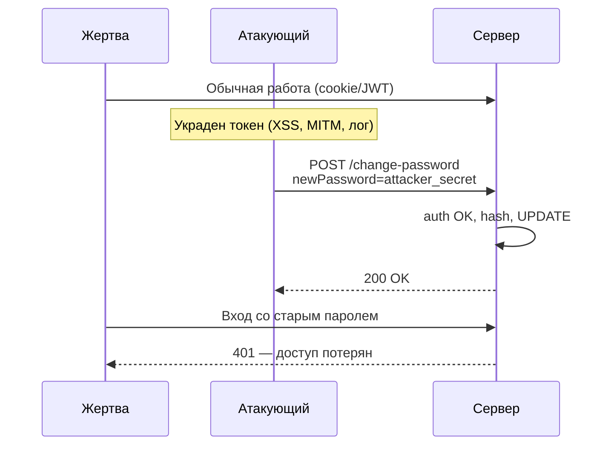

# Смена пароля — пропущенный шаг re-auth

<div class="article-tags">
  <span class="tag tag-required">ОБЯЗАТЕЛЬНО</span>
  <span class="tag tag-beginner">ДЛЯ НОВИЧКОВ</span>
</div>

<span class="complexity-badge">Разработчикам API</span>

Типичная реализация «смены пароля» от джуна:

```javascript
app.post('/change-password', auth, async (req, res) => {
  const { newPassword } = req.body;

  await db.query(
    'UPDATE users SET password = ? WHERE id = ?',
    [hash(newPassword), req.user.id]
  );

  res.json({ message: 'Password changed successfully' });
});
```

На ревью всё выглядит правильно:

- есть middleware **`auth`** — пользователь аутентифицирован;
- пароль **хешируется** перед записью в БД;
- SQL через **плейсхолдеры** — injection закрыт;
- обновляется только **`req.user.id`** — чужой аккаунт не тронут.

Критический шаг всё же **пропущен** — сервер **не проверяет текущий пароль** (и не требует второй фактор). Достаточно **действующей сессии или токена**, чтобы навсегда сменить пароль и выбить владельца из аккаунта.

Хеши, соль и атаки на пароли — [устройство и надёжность паролей](./114). Сессии, JWT и отзыв токенов — [аутентификация и авторизация](./111).

---

<span id="chto-otsutstvuet"></span>

## Что отсутствует

**Re-authentication** — повторное подтверждение личности **перед чувствительной операцией**.

Для смены пароля клиент должен прислать минимум:

- **`currentPassword`** (или `oldPassword`) — строка, которую знает только владелец;
- **`newPassword`** — новое значение.

Сервер сравнивает `currentPassword` с хешем в БД (`bcrypt.compare`, `argon2.verify`). Только после успеха — `UPDATE`.

| Проверка | Есть в коде джуна | Зачем |
|----------|-------------------|--------|
| Пользователь залогинен (`auth`) | Да | Базовый барьер |
| Новый пароль хешируется | Да | Защита at rest |
| **Текущий пароль верен** | **Нет** | Доказательство, что это владелец, а не украденная сессия |
| CSRF-токен (cookie-auth) | Нет | Защита от подделки запроса из браузера |
| Инвалидация других сессий | Нет | Старый украденный токен остаётся валидным |

<div class="callout callout--danger">
  <div class="callout-title">Итог</div>

  Middleware `auth` отвечает на вопрос «**кто** делает запрос по токену?», но **не** на «**владелец ли** аккаунта прямо сейчас?». Украденная сессия для этого эндпоинта равносильна знанию пароля.
</div>

---

<span id="session-hijacking"></span>

## Атака — захват аккаунта через сессию

Сценарий **session hijacking** (перехват сессии):

1. Жертва залогинена в сервисе.
2. Атакующий получает **session cookie** или **JWT** — XSS на том же origin, вредонсное расширение, malware, утечка токена в лог, HTTP без TLS на публичном Wi‑Fi.
3. Атакующий шлёт `POST /change-password` с **своим** `newPassword`. Знание **старого** пароля **не нужно**.
4. Пароль в БД меняется. Жертва не может войти со старым паролем.
5. Атакующий входит с новым паролем (или продолжает пользоваться украденным токеном, если сессии не отозваны).



Это **полный захват аккаунта** (account takeover): не «прочитал профиль», а **закрепил** контроль сменой секрета.

См. также [JWT — семь строк, которые обходят авторизацию](./118) — компрометированный bearer-токен даёт тот же эффект на stateless API.

---

<span id="csrf"></span>

## Вторая дыра — CSRF при cookie-сессии

Если `auth` держится на **cookie** (`sessionId`, HttpOnly), браузер **сам** прикладывает cookie к `POST /change-password` с **любого** сайта, пока жертва залогинена.

Вредоносная страница:

```html
<form action="https://bank.example/change-password" method="POST">
  <input type="hidden" name="newPassword" value="pwned123!" />
</form>
<script>document.forms[0].submit();</script>
```

Жертва открыла вкладку — форма ушла с её cookie. Сервер видит валидную сессию и меняет пароль **без** текущего пароля и **без** CSRF-токена.

Митигация CSRF — [в статье о безопасности приложений](/encyclopedia/8-infra-security/8-07-informatsionnaya-bezopasnost/113#csrf-cross-site-request-forgery): `SameSite`, anti-CSRF token, для API — не полагаться только на cookie без дополнительных мер.

Проверка **текущего пароля** CSRF **не заменяет** (атакующий может подставить и его, если знает — но при hijack сценарии пароль как раз неизвестен). Нужны **оба** слоя там, где применимо.

---

<span id="bezopasnaya-realizatsiya"></span>

## Безопасная реализация

Минимальный каркас:

```javascript
app.post('/change-password', auth, csrf, async (req, res) => {
  const { currentPassword, newPassword } = req.body;

  const user = await db.query('SELECT password_hash FROM users WHERE id = ?', [
    req.user.id,
  ]);

  const ok = await verifyPassword(currentPassword, user.password_hash);
  if (!ok) {
    return res.status(403).json({ error: 'Invalid current password' });
  }

  if (!isStrongEnough(newPassword)) {
    return res.status(400).json({ error: 'Password too weak' });
  }

  await db.query('UPDATE users SET password = ? WHERE id = ?', [
    hash(newPassword),
    req.user.id,
  ]);

  await revokeAllSessionsExcept(req.user.id, req.session.id);
  res.json({ message: 'Password changed' });
});
```

**Дополнительно** (production):

- **Письмо** «пароль изменён» — пользователь заметит взлом;
- **Rate limit** на эндпоинт — против перебора `currentPassword`;
- **2FA / WebAuthn** для смены пароля в чувствительных продуктах;
- **Единый стиль ошибок** — не раскрывать, существует ли email на `/reset-password` (отдельная тема).

<div class="callout callout--tip">
  <div class="callout-title">OAuth и «смена пароля»</div>

  У аккаунтов «Войти через Google» локального пароля может не быть — тогда re-auth это redirect на IdP (`prompt=login`) или проверка свежести сессии (`auth_time`, `max_age` в OIDC).
</div>

---

<span id="chek-list"></span>

## Чек-лист

- [ ] Запрос содержит **`currentPassword`**; сервер сверяет с хешем в БД.
- [ ] При cookie-auth — **CSRF-токен** или `SameSite=Strict`/`Lax` + не GET для смены.
- [ ] После смены — **отзыв** остальных сессий и refresh-токенов.
- [ ] Уведомление по **email/SMS**.
- [ ] **Rate limiting** на `/change-password` и `/login`.
- [ ] Новый пароль проходит **политику сложности** и не совпадает с текущим.
- [ ] Логирование события без записи паролей в plain text.

---

## Связанные материалы

| Тема | Статья |
|------|--------|
| Хеширование и атаки на пароли | [Устройство и надёжность паролей](./114) |
| Отзыв JWT и «выйти везде» | [Аутентификация и авторизация](./111) |
| CSRF | [8.07 / 113 — CSRF](/encyclopedia/8-infra-security/8-07-informatsionnaya-bezopasnost/113#csrf-cross-site-request-forgery) |
| Каталог угроз API | [8.07 / 128](/encyclopedia/8-infra-security/8-07-informatsionnaya-bezopasnost/128) |
| Регресс «смена пароля» | [7.05 / 128 — тест-кейсы](/encyclopedia/7-project/7-05-testirovanie/128) |

---
