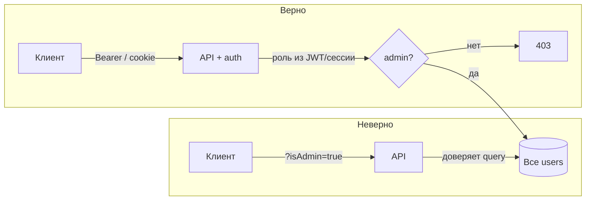

# Админка по ?isAdmin=true

<div class="article-tags">
  <span class="tag tag-required">ОБЯЗАТЕЛЬНО</span>
  <span class="tag tag-beginner">ДЛЯ НОВИЧКОВ</span>
</div>

<span class="complexity-badge">Разработчикам API</span>

«Админка готова, доступ только у админов»:

```javascript
app.get('/admin/users', async (req, res) => {
  if (req.query.isAdmin === 'true') {
    return res.json(await getAllUsers());
  }
  return res.status(403).json({ error: 'Forbidden' });
});
```

На стенде с `?isAdmin=true` в ссылке из фронта **всё работает**. Джун делает вывод: «каждый админ имеет доступ».

Уязвимость — **Broken Access Control** (OWASP Top 10, #1): **права решаются данными с клиента**, а не ролью в сессии, JWT или записью в БД на сервере. Любой пользователь (и аноним, если маршрут открыт) может подставить тот же параметр.

RBAC и различие AuthN / AuthZ — [аутентификация и авторизация](./111). Каталог IDOR и API-угроз — [8.07 / 128](/encyclopedia/8-infra-security/8-07-informatsionnaya-bezopasnost/128).

---

<span id="ekspluatatsiya"></span>

## Эксплуатация за пять секунд

```http
GET /admin/users?isAdmin=true HTTP/1.1
Host: api.example.com
```

В браузере:

```text
https://api.example.com/admin/users?isAdmin=true
```

Ответ — полный список пользователей из `getAllUsers()`: email, id, внутренние поля. **Без логина**, если эндпоинт не закрыт middleware `auth`.

В `curl`:

```bash
curl -s "https://api.example.com/admin/users?isAdmin=true"
```

<div class="callout callout--danger">
  <div class="callout-title">Почему 403 «не спасает»</div>

  <div class="callout-body">
  Сервер честно отдаёт 403 **без** параметра — это создаёт иллюзию защиты. Проверка «есть ли флаг админа» и проверка «**кто** этот админ по данным сервера» — разные задачи. Здесь реализована только первая, и флаг контролирует клиент.
  </div>
</div>

---

<span id="pochemu-tak-delayut"></span>

## Откуда берётся ошибка

Частые варианты той же логики:

| «Проверка» на сервере | Что подставляет атакующий |
|----------------------|---------------------------|
| `req.query.isAdmin === 'true'` | `?isAdmin=true` |
| `req.body.role === 'admin'` | `{"role":"admin"}` в JSON |
| `req.cookies.admin === '1'` | Cookie `admin=1` в DevTools |
| `req.headers['x-admin']` | `X-Admin: true` |
| Фронт: `if (user.isAdmin) fetch(...)` | Прямой вызов API без фронта |

Фронтенд **может** прятать кнопку «Админка». API **обязан** проверять права сам — по **серверному** контексту после `auth`.



---

<span id="pravilnaya-proverka"></span>

## Как должно быть

1. **Аутентификация** — middleware `auth`: есть `req.user` / `req.userId`.
2. **Авторизация** — роль из **подписанного** источника (JWT claim `roles`, поле в сессии после login, lookup в БД), **не** из query.

```javascript
app.get('/admin/users', auth, requireRole('admin'), async (req, res) => {
  return res.json(await getAllUsers());
});

function requireRole(role) {
  return (req, res, next) => {
    const roles = req.user.roles ?? [];
    if (!roles.includes(role)) {
      return res.status(403).json({ error: 'Forbidden' });
    }
    next();
  };
}
```

Для JWT — claim `realm_access.roles` / `groups` после проверки подписи (см. [JWT — семь строк](./118)). Для сессии — роль записана на сервере при входе, клиент её **не присылает** заново.

**Тест:** обычный пользователь с валидным токеном вызывает `/admin/users` **без** query — только 403. Подстановка `?isAdmin=true` **ничего не меняет**.

---

<span id="rodstvennye-oshibki"></span>

## Родственные промахи

- **IDOR** — `GET /users/123` отдаёт чужой профиль, если не проверять `owner_id === req.user.id`. Тот же класс: «есть токен» ≠ «можно этот объект».
- **Mass assignment** — `PATCH /profile` с `{"isAdmin":true}` обновляет роль, если сервер не фильтрует поля.
- **Путь только на фронте** — `/admin` в React Router без guard на API.

Все они лечатся **единой политикой на сервере** для каждого эндпоинта.

---

<span id="chek-list"></span>

## Чек-лист

- [ ] Ни один query, body, cookie или header **не** выступает источником прав.
- [ ] Админские маршруты за `auth` + проверка роли / permission.
- [ ] Роль в JWT подписана IdP; подделка payload без ключа невозможна.
- [ ] Интеграционные тесты: user и admin, **без** подстановки «секретных» параметров.
- [ ] Сканер/Burp по чек-листу OWASP API — [каталог угроз](/encyclopedia/8-infra-security/8-07-informatsionnaya-bezopasnost/128#katalog-ugroz).

---

## Связанные материалы

| Тема | Статья |
|------|--------|
| RBAC, ABAC | [Аутентификация и авторизация](./111) |
| IDOR и Broken Access Control | [8.07 / 128](/encyclopedia/8-infra-security/8-07-informatsionnaya-bezopasnost/128#idor-razbor-tipichnogo-promaha) |
| Подделка роли в JWT | [JWT — семь строк](./118) |
| Mass assignment | [8.07 / 128 — каталог](/encyclopedia/8-infra-security/8-07-informatsionnaya-bezopasnost/128#katalog-ugroz) |

---
