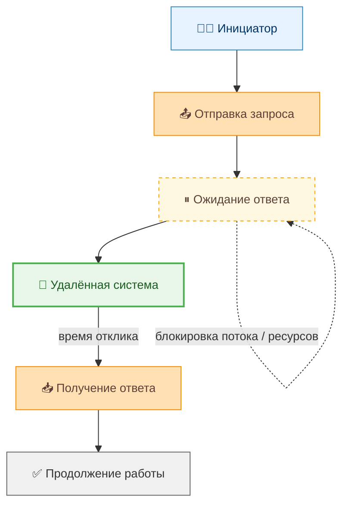
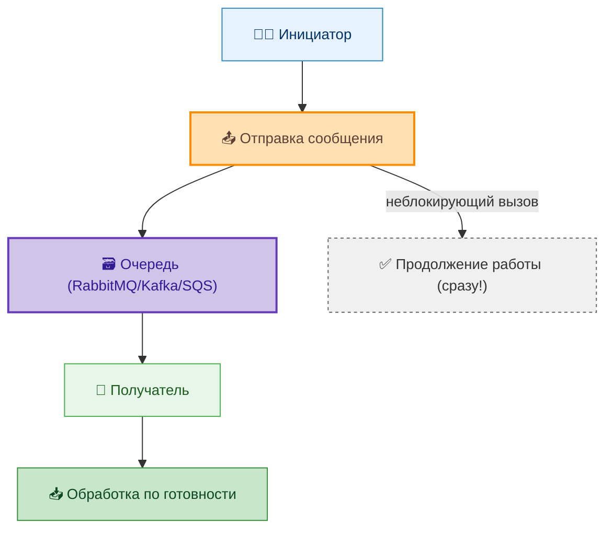
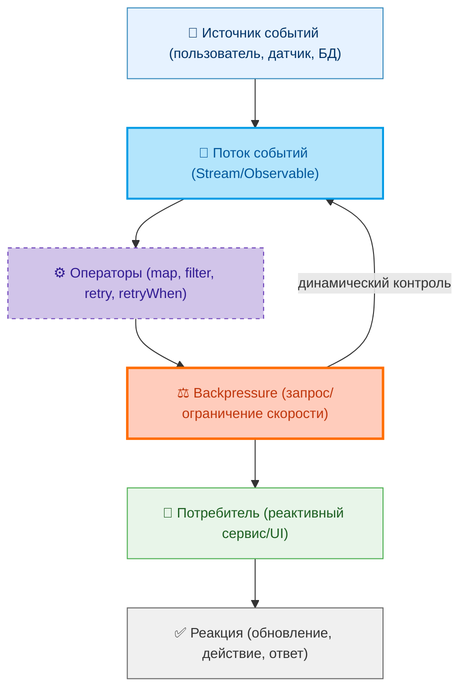
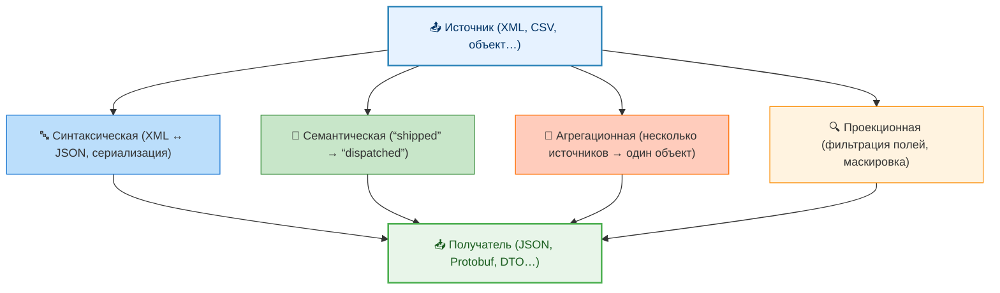

import SynchronousInteraction from '@site/src/components/SynchronousInteraction';
import AsynchronousInteraction from '@site/src/components/AsynchronousInteraction';
import ReactiveInteraction from '@site/src/components/ReactiveInteraction';

# Типы взаимодействия между системами

<div class="article-tags">
  <span class="tag tag-required">ОБЯЗАТЕЛЬНО</span>
  <span class="tag tag-beginner">ДЛЯ НОВИЧКОВ</span>
</div>

<span class="complexity-badge">Всем</span>

---

## Типы взаимодействия между системами

Мы отправляем запрос на другой сервер:
```
GET /user/123
```

И ждём, пока сервер не ответит. Если сервер упал, то и наш сайт тоже зависнет. Если сервер думает 5 секунд - наш сайт крутит загрузку 5 секунд и ничего не делает.

Так и работает синхронка.

---

### Синхронное взаимодействие

Выбор модели взаимодействия определяет архитектурные свойства системы: отзывчивость, устойчивость к сбоям, сложность отладки и масштабируемость.

**Синхронное взаимодействие** предполагает, что инициатор запроса ждёт ответа до продолжения своей работы. Классический пример — HTTP-запрос к REST API. Пока ответ не получен, вызывающая система блокирована (или работает в режиме ожидания). 

<SynchronousInteraction />


Преимущества: простота логики, предсказуемость последовательности операций. Недостатки: блокировка ресурсов, зависимость от времени отклика удалённой системы, низкая устойчивость к сбоям.



---

### Асинхронное взаимодействие

**Асинхронное взаимодействие** разрывает прямую связь во времени между отправкой сообщения и его обработкой. Инициатор не ждёт ответа и продолжает работу. Сообщение помещается в промежуточную очередь (например, RabbitMQ, Kafka, AWS SQS), из которой его забирает получатель, когда будет готов. 

<AsynchronousInteraction />

Преимущества: декуплинг компонентов, устойчивость к кратковременным сбоям, масштабируемость. Недостатки: усложнение логики обработки ошибок, необходимость отслеживания состояния, потенциальная несогласованность данных.



---

### Реактивное взаимодействие

**Реактивное взаимодействие** — эволюция асинхронной модели: системы обмениваются **потоками событий**, реагируют на изменения по мере поступления, при высокой нагрузке применяют **backpressure** (потребитель сигнализирует производителю "замедлись"). Сюда относят WebSocket, gRPC-стримы, Rx/Reactor, обработку в Kafka Streams.

Не путайте с формулировкой "реактивная система" из **Reactive Manifesto** (отзывчивость, устойчивость, эластичность) — это про свойства архитектуры в целом; поток событий может быть лишь одним из механизмов. Подробнее о терминах и транспорте — в главе [Реактивные системы и потоки данных](/encyclopedia/2-system-network/2-09-osnovy-integratsionnogo-vzaimodeystviya/120). 

<ReactiveInteraction />

Примеры: WebSocket-каналы, стриминг через gRPC, реактивные фреймворки (Project Reactor, RxJava). Реактивность позволяет строить высоконагруженные, отзывчивые системы, но требует переосмысления традиционных подходов к обработке данных и ошибок.



Эти модели не являются взаимоисключающими. В одной системе могут сосуществовать синхронные вызовы для пользовательского интерфейса, асинхронные события для внутренней обработки и реактивные потоки для аналитики.

---

### Концепция автономности систем и трансформация данных

Фундаментальный принцип распределённых систем заключается в том, что каждая из них существует и функционирует **автономно**. Это означает, что:

- система обладает собственной логикой обработки данных;
- управляет собственным состоянием (часто — через локальную или выделенную базу данных);
- имеет независимый жизненный цикл разработки, развертывания и масштабирования;
- не зависит от внутреннего устройства других систем.

Автономность — условие устойчивости и гибкости архитектуры. Однако она порождает новую проблему: данные, необходимые для выполнения сквозного бизнес-процесса, физически и логически распределены. Чтобы координировать действия, системы должны обмениваться информацией, но эта информация редко бывает совместимой "из коробки".

Здесь возникает необходимость **трансформации данных** — преобразования структуры, семантики и формата информации из представления, понятного отправителю, в представление, пригодное для получателя.



Трансформация может происходить на нескольких уровнях:

1. **Синтаксическая трансформация**: изменение формата данных без изменения смысла. Например, преобразование XML в JSON, или сериализация объекта в Protocol Buffers. Такие преобразования часто выполняются шлюзами (API Gateway), адаптерами (в паттерне Enterprise Integration Patterns) или ETL-процессами.

2. **Семантическая трансформация**: приведение значений к общему смысловому контексту. Пример: система А передаёт статус заказа как `“shipped”`, а система Б понимает только `“dispatched”`. Здесь требуется маппинг значений, возможно — с использованием справочников или онтологий.

3. **Агрегационная трансформация**: сборка данных из нескольких источников в единое сообщение. Например, для формирования единого карточки клиента может потребоваться информация из CRM, биллинг-системы и службы поддержки. Такая трансформация часто реализуется в оркестраторах (BPM-движки, Saga-оркестрация) или через композитные API.

4. **Проекционная трансформация**: отбор только тех полей или сущностей, которые необходимы получателю. Это снижает объём передаваемых данных и повышает безопасность (принцип минимальных привилегий).

Трансформация — неотъемлемая часть интеграционного слоя. Она может быть реализована программно (в коде микросервиса), декларативно (через правила в интеграционной платформе, например, Apache Camel), или с помощью специализированных сервисов (Data Transformation Service в облаке).

---
