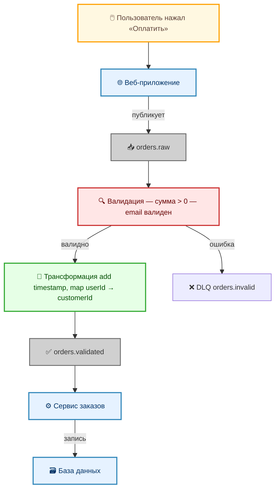

# Интеграционные потоки данных

  ОБЯЗАТЕЛЬНО
  ДЛЯ НОВИЧКОВ

Всем

## Интеграционные потоки данных

### Что такое интеграционные потоки?

Путь, который проходят данные от системы А до системы Б, со всеми остановками, проверками и перекладываниями по дороге, называют интеграционным потоком:
- отправка;
- постановка в очередь;
- валидация;
- трансформация;
- роутинг (маршрутизация);
- доставка.

Это лишь пример. Этапы могут быть разными. Без потока мы бы просто отправляли запросы и надеялись, что данные дойдут. А с потоком мы:
- можем проверить данные, прежде чем отдавать их другой системе;
- можем изменить формат;
- можем разослать одни и те же данные в 3 разных места;
- можем повторить отправку, если система временно недоступна;
- можем посмотреть, где именно зависли данные (по логам).

Основные типы потоков включают:
- однонаправленный (отправил и забыл, не ждём ответа);
- синхронный (спросили - ждём, пока не придёт ответ);
- асинхронный с подтверждением (отправили, занимаемся делами, потом приходит статус "ок" или "ошибка);
- ETL-поток (достали, почистили, преобразовали, разослали);
- сага (цепочка с откатом, несколько шагов, и если один упал, отменяем предыдущие).

Любой поток состоит из некоего конвейера:
- триггер (кто запустил - кнопка, расписание, письмо пришло);
- очередь (место, где данные ждут своей очереди);
- валидатор (проверка, нормальные ли данные по весу, формату, наличию полей);
- трансформер (перекладывание из одной коробки в другую, например из XML в JSON);
- роутер (решает, кому это отправить);
- логгер (пишет в журнал время, событие, подробности);
- повтор (если система Б не ответила, повторить через 5 секунд, 10 секунд, 30 секунд);
- компенсатор (если всё упало, откатить изменения).

Такой вот маршрут.

Интеграционный поток — это последовательность шагов, через которые проходят данные при перемещении между системами. Поток отражает логику обработки: от приёма сообщения до его доставки, включая возможные трансформации, проверки, маршрутизацию и реакцию на ошибки.

Поток описывает маршрут, триггеры, преобразования и точки принятия решений — от момента возникновения события до завершения обработки во всех задействованных компонентах.

Ключевые характеристики интеграционного потока:

- **Направленность**: поток может быть однонаправленным (отправка уведомления), двунаправленным (запрос-ответ) или многоточечным (публикация в шину событий с несколькими подписчиками).
- **Оркестрация vs хореография**: в оркестрованном потоке существует центральный координатор, управляющий последовательностью вызовов (например, BPM-движок). В хореографии каждая система реагирует на события независимо, без централизованного контроля.
- **Идемпотентность и атомарность**: качественно спроектированный поток должен учитывать возможность повторной отправки сообщений (идемпотентность) и обеспечивать согласованность данных при частичных сбоях (через Saga-паттерн или компенсирующие транзакции).
- **Наблюдаемость**: поток должен быть инструментирован — логирование, трассировка (distributed tracing), метрики — для диагностики и аудита.

Интеграционные потоки часто визуализируются в виде диаграмм последовательностей (sequence diagrams) или BPMN-схем. В промышленных платформах (например, BPMSoft, ELMA365, Apache NiFi) такие потоки могут конфигурироваться декларативно, без написания кода, что упрощает сопровождение и версионирование.

---

### Основные типы интеграционных потоков

#### 1. **Однонаправленный поток (Fire-and-Forget)**  
Самый простой сценарий:  
> *Событие произошло → данные отправлены → отправитель не ждёт подтверждения.*

Пример:  
- Пользователь нажал «Заказать» → система учёта публикует событие `order.created` в шину → аналитическая система получает его и логирует.  
- Отправка логов в централизованное хранилище (например, через Fluentd → Kafka → Elasticsearch).

**Особенности**:  
- Минимальная задержка, высокая пропускная способность.  
- Нет гарантии доставки — если получатель недоступен, сообщение теряется (если не настроено сохранение на брокере).  
- Часто используется в *event-driven* архитектурах.

#### 2. **Синхронный запрос-ответ (Request-Response)**  
Классический REST- или gRPC-обмен:  
> *Система А делает вызов → Система Б обрабатывает → возвращает результат → Система А продолжает работу только после ответа.*

Пример:  
- Веб-приложение запрашивает баланс у платёжного сервиса (`GET /balance?userId=123`) → ждёт ответ `{"amount": 49900}` → показывает пользователю.

**Особенности**:  
- Простота отладки и понимания.  
- Блокирующая природа: если Б отвечает 5 секунд — А «висит».  
- Требует строгого SLA по времени ответа.

#### 3. **Асинхронный поток с подтверждением (Reliable Async)**  
Гибрид: данные уходят асинхронно, но с гарантией и обратной связью.  
> *Отправитель → брокер сообщений → получатель обрабатывает → публикует ack/nack → отправитель реагирует.*

Пример:  
- Создание заказа → запись в очередь `orders.new` → сервис обработки резервирует товар → при успехе публикует `order.confirmed`, при ошибке — `order.failed` → триггер уведомлений реагирует на `confirmed`, а служба поддержки — на `failed`.

**Особенности**:  
- Гарантированная доставка (при durable-очередях).  
- Возможность масштабировать обработку (много воркеров на одну очередь).  
- Поддержка идемпотентности и retry без дублирования.

#### 4. **Поток с трансформацией и маршрутизацией (ETL / ESB-стиль)**  
Данные проходят через «интеграционный конвейер»:  
> *Источник → извлечение → очистка → преобразование → маршрутизация → несколько получателей.*

Пример:  
- CRM выгружает контакты в CSV → интеграционный адаптер парсит, нормализует телефоны, обогащает геоданными → отправляет:  
  - в рассылку (Mailchimp) — email и имя,  
  - в аналитику (ClickHouse) — полный профиль,  
  - в ERP (1С) — только ИНН и реквизиты.

**Особенности**:  
- Часто реализуется через iPaaS (например, Apache Camel, n8n, Node-RED) или ETL-инструменты (Talend, Airbyte).  
- Централизованное управление логикой потока.  
- Точка отказа и узкое место, если конвейер монолитный.

#### 5. **Цепочка компенсируемых транзакций (Saga)**  
Для распределённых операций, где ACID невозможен:  
> *Шаг 1 → Шаг 2 → … → Шаг N*  
> *Если шаг K падает → запускаются компенсирующие действия: отмена K-1, отмена K-2, …*

Пример бронирования путешествия:  
1. Забронировать рейс (`flight.reserve`) → получаем `bookingId`  
2. Забронировать отель (`hotel.reserve`)  
3. Списать деньги (`payment.charge`)  
→ Если шаг 3 падает:  
 → `payment.refund` (если деньги уже списаны)  
 → `hotel.cancel`  
 → `flight.cancel`

**Особенности**:  
- Сохраняет согласованность без блокировок.  
- Требует реализации *обратных операций* для каждого шага.  
- Используется в микросервисных системах, где распределённые транзакции невозможны.

---

### Обязательные компоненты любого интеграционного потока

| Компонент | Роль в потоке | Примеры реализации |
|---------|----------------|---------------------|
| **Триггер** | Источник запуска потока | API-вызов, cron, событие в БД (`INSERT`), webhook, изменение файла в S3 |
| **Очередь / шина** | Буферизация, декуплинг | RabbitMQ, Apache Kafka, AWS SQS, Redis Streams |
| **Трансформер** | Приведение формата | JSON → XML, добавление заголовков, маппинг полей (`userId` → `customer_id`) |
| **Роутер** | Условная маршрутизация | Если `country == "RU"` → в 1С; иначе → в SAP |
| **Валидатор** | Проверка корректности | JSON Schema, кастомные правила («сумма > 0», «email валиден») |
| **Логгер / трейсер** | Наблюдаемость | OpenTelemetry, Jaeger, логи в Loki, метрики в Prometheus |
| **Retry-механизм** | Устойчивость | Экспоненциальная задержка, circuit breaker (Hystrix, Resilience4j) |
| **Компенсатор** | Откат при ошибке | Отмена брони, возврат средств, удаление временных записей |

---
