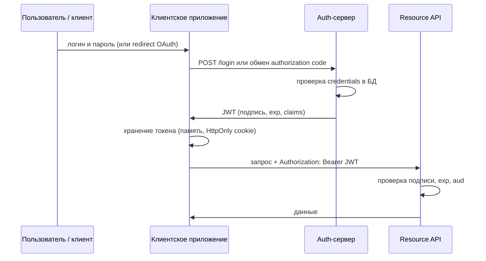
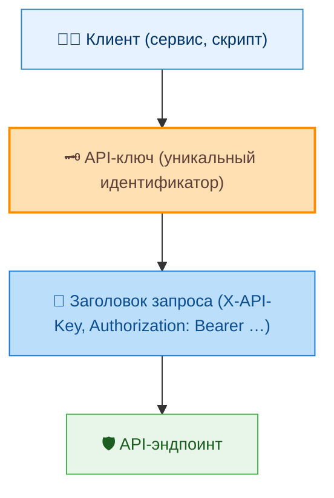
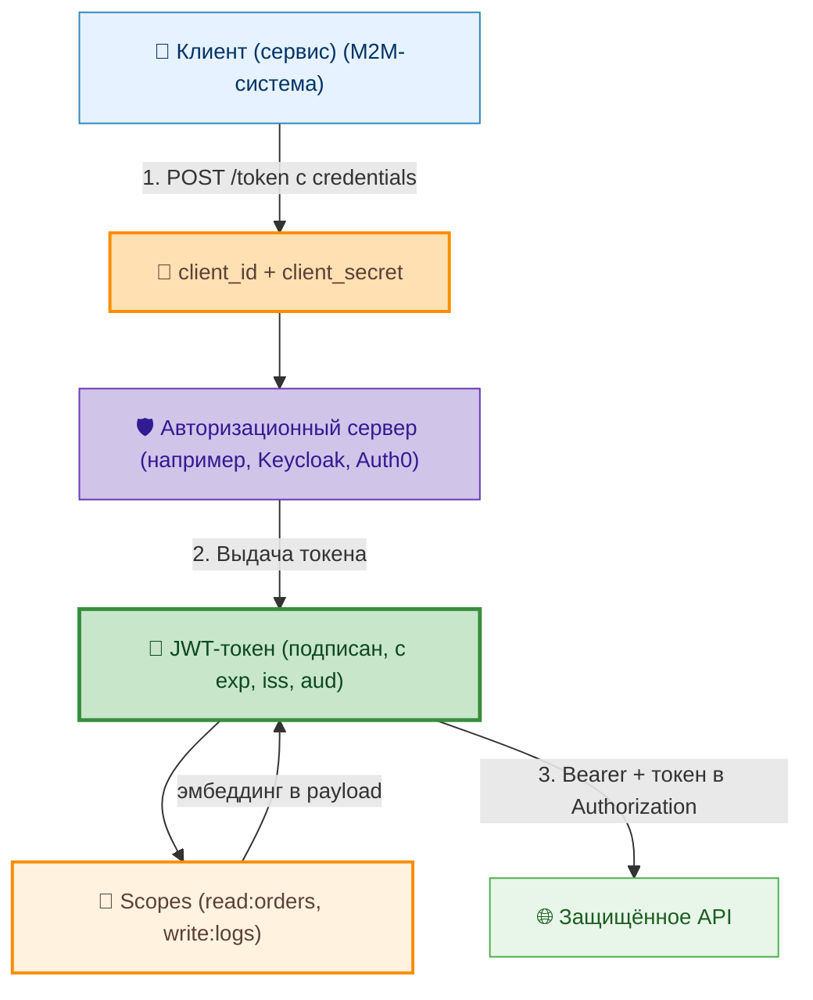
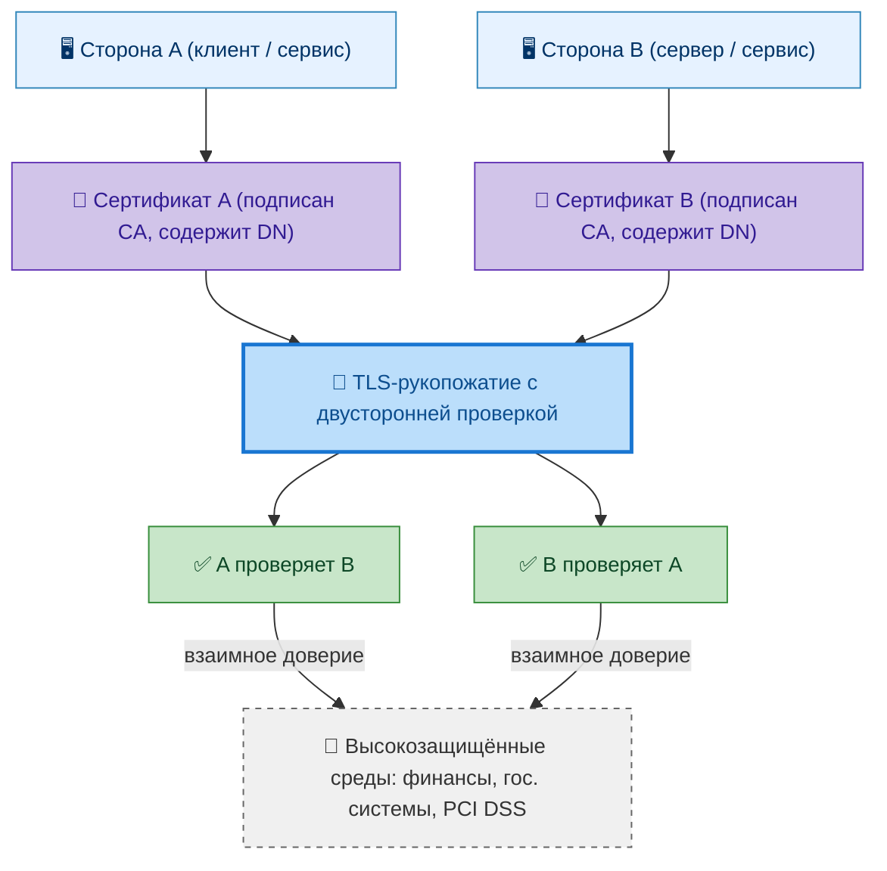
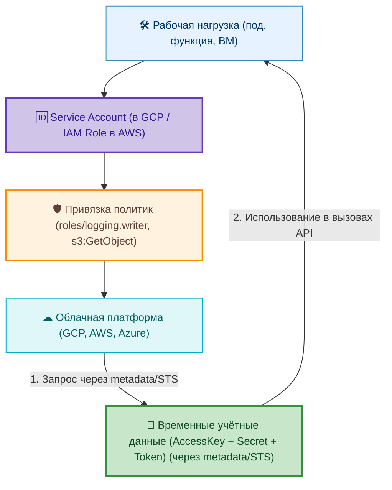

# Авторизация в интеграционных сценариях

<div class="article-tags">
  <span class="tag tag-required">ОБЯЗАТЕЛЬНО</span>
  <span class="tag tag-beginner">ДЛЯ НОВИЧКОВ</span>
</div>

<span class="complexity-badge">Всем</span>

---

## Авторизация в интеграционных сценариях

### Что такое интеграционная авторизация?

Интеграционная авторизация — это механизм, посредством которого одна система получает право выполнять определённые действия в другой системе в рамках интеграционного взаимодействия.

В отличие от пользовательской авторизации, где субъект — человек с ролью или правами, в интеграционном контексте субъектом выступает **система** (или её компонент: микросервис, функция, шлюз). Поэтому применяются специфические модели доверия.

Общая картина для пользовательского входа (сессия, JWT, SSO, grant flows OAuth 2.0) — в [аутентификации и авторизации](/encyclopedia/2-system-network/2-08-osnovy-informatsionnoy-bezopasnosti/111#evolyutsiya-sposobov-vhoda). Ниже — то, что чаще всего встречается именно в **машинных** интеграциях.

---

<span id="tokens-i-api-keys"></span>

### Токены (JWT) и API-ключи

В документации и на схемах архитектуры оба механизма часто попадают в один заголовок `Authorization`. На практике это **разные классы учётных данных** с разной моделью жизненного цикла и проверки.

| | **Токен (JWT)** | **API-ключ** |
|---|-----------------|--------------|
| **Суть** | Временные, самодостаточные учётные данные: внутри — claims о субъекте, снаружи — подпись и срок `exp` | Долгоживущая простая строка-идентификатор приложения или интеграции |
| **Аналогия** | Билет в кино с номером места и временем сеанса — данные напечатаны на билете, касса сверяет подпись | Ключ от подъезда — один секрет, пока его не сменили |
| **Кто идентифицируется** | Пользователь (через OAuth) или сервис (Client Credentials) — claims в payload | Приложение, проект разработчика, внутренний скрипт |
| **Срок действия** | Автоматически истекает (`exp`, refresh-ротация) | Действует до ручного отзыва в портале или БД |
| **Проверка на API** | Подпись и claims **локально** (stateless), без обязательного запроса в БД на каждый вызов | Поиск ключа в хранилище (БД, Redis) — **stateful** lookup |
| **Масштабирование** | Удобно горизонтально масштабировать resource server | Каждый запрос может требовать обращения к реестру ключей |
| **Сложность внедрения** | Выше — нужен auth-сервер, подпись, refresh, JWKS | Ниже — сгенерировать строку и проверить в middleware |
| **Типичный контекст** | Пользовательские сессии, OAuth 2.0, микросервисы с единым IdP | Публичные API для разработчиков, webhooks, внутренние cron-задачи |

**JWT** уместен, когда нужны **данные о субъекте в самом токене** (роли, `tenant_id`, scopes) и предсказуемый **автоматический отзыв по времени**. **API-ключ** уместен, когда интеграторов немного, права задаются на уровне «этому ключу — доступ к API v2», а полноценный OAuth пока избыточен.

Структура JWT, cookie/session и безопасный login → refresh — в [аутентификации и авторизации](/encyclopedia/2-system-network/2-08-osnovy-informatsionnoy-bezopasnosti/111#cookies-sessions-jwt-paseto). Типичные ошибки `jwt.verify` — в [JWT — семь строк, которые обходят авторизацию](/encyclopedia/2-system-network/2-08-osnovy-informatsionnoy-bezopasnosti/118).

#### Поток с JWT (пользователь или OAuth)



Шаги в общем виде:

1. Субъект проходит аутентификацию (пароль, соцсеть, Client Credentials для M2M).
2. Auth-сервер **создаёт и подписывает** JWT.
3. Клиент сохраняет токен и прикладывает его к каждому запросу.
4. API **проверяет подпись и срок** без обязательного чтения сессии из БД (stateless).

#### Поток с API-ключом (сервис или разработчик)

```mermaid
sequenceDiagram
    participant D as Разработчик / сервис
    participant P as Портал провайдера
    participant S as Хранилище ключей
    participant API as API

    D->>P: регистрация приложения
    P->>S: запись нового ключа (хеш, права, квоты)
    P->>D: выдача ключа (один раз в UI или email)
    D->>D: конфигурация ключа в приложении
    D->>API: запрос + X-API-Key или Authorization: Bearer &lt;key&gt;
    API->>S: ключ существует и активен?
    S->>API: да + лимиты
    API->>D: ответ
```

Шаги в общем виде:

1. Интегратор регистрирует приложение у провайдера API.
2. Система **генерирует ключ** и сохраняет его (часто только хеш) в БД.
3. Ключ передаётся разработчику **один раз** — в портале или по защищённому каналу.
4. Приложение подставляет ключ в заголовок или query-параметр.
5. API на **каждый запрос** сверяет ключ с реестром и проверяет квоты.

<div class="callout callout--warning">
  <div class="callout-title">Безопасность API-ключей</div>

  <div class="callout-body">
  Ключ, попавший в репозиторий или лог, действует до отзыва. Храните его в секрет-хранилище или переменных окружения, ограничивайте IP и scope, ведите аудит вызовов. Утечку JWT с коротким <code>exp</code> проще пережить, чем компрометацию бессрочного ключа.
</div>
</div>

| Критерий | JWT | API-ключ |
|----------|-----|----------|
| **Безопасность при утечке** | Выше при коротком `exp` и rotation refresh | Средняя — ключ живёт до отзыва |
| **Контекст пользователя** | Есть (`sub`, роли, scopes) | Только уровень приложения |
| **Масштабирование API** | Stateless-проверка подписи | Lookup в БД на запрос |
| **Внедрение** | Сложнее (auth flow, JWKS) | Проще |

Для production между сервисами чаще выбирают **OAuth 2.0 Client Credentials** (JWT access token) или **mTLS** — см. разделы ниже. API-ключи остаются на старте продукта и в B2B-интеграциях с малым числом партнёров.

---

### API-ключи

**API-ключи** — простой, но ограниченный метод. Ключ передаётся в заголовке запроса (`X-API-Key`, `Authorization: Bearer …` или query-параметр — последний хуже из‑за логов и Referer) и идентифицирует **вызывающую систему**, а не конкретного человека. Подробное сравнение с JWT — [выше](#tokens-i-api-keys).



---

### OAuth 2.0

**OAuth 2.0 Client Credentials Flow** — стандартный способ авторизации машина-машина (M2M): на выходе тот же класс **Bearer-токена**, что и у пользовательского JWT, но выдача идёт без участия человека. Сравнение с «голым» API-ключом — в [разделе про токены и ключи](#tokens-i-api-keys). Система (клиент) аутентифицируется в авторизационном сервере с помощью `client_id` и `client_secret`, получает JWT-токен и использует его для доступа к API. Токен может содержать права (scopes), ограничивающие доступ.



---

### mTLS

**mTLS (mutual TLS)** — двусторонняя аутентификация на уровне транспорта. Каждая сторона предоставляет сертификат, подтверждающий её подлинность. Применяется в высокозащищённых средах (финансы, государственные системы).



---

### Service Accounts

**Service Accounts** — в облачных платформах (Google Cloud, AWS IAM Roles) компоненты могут получать временные учётные данные с точно определёнными привилегиями. Это соответствует принципу наименьших привилегий и автоматическому ротированию ключей.



Интеграционная авторизация должна быть строго привязана к контексту: какая система, зачем, какие действия, на какие ресурсы. Отсутствие такой привязки приводит к избыточным правам и росту поверхности атаки.

См. также [12 советов по безопасности API](/encyclopedia/2-system-network/2-09-osnovy-integratsionnogo-vzaimodeystviya/132) и [уязвимости и атаки на API](/encyclopedia/8-infra-security/8-07-informatsionnaya-bezopasnost/128).

---
