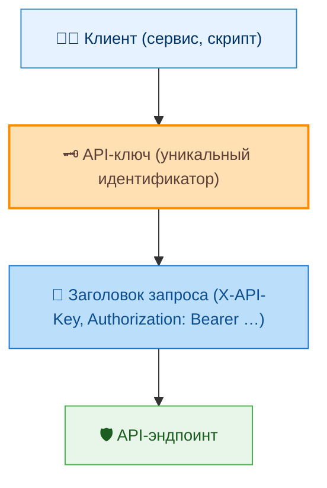
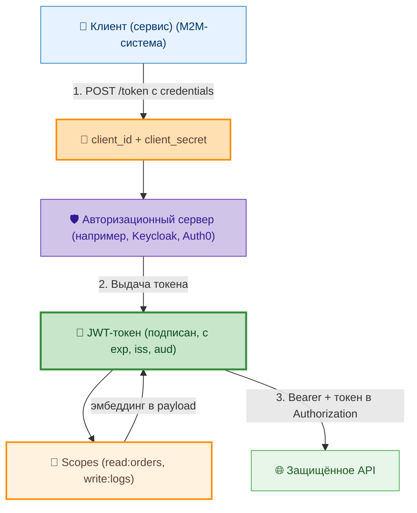
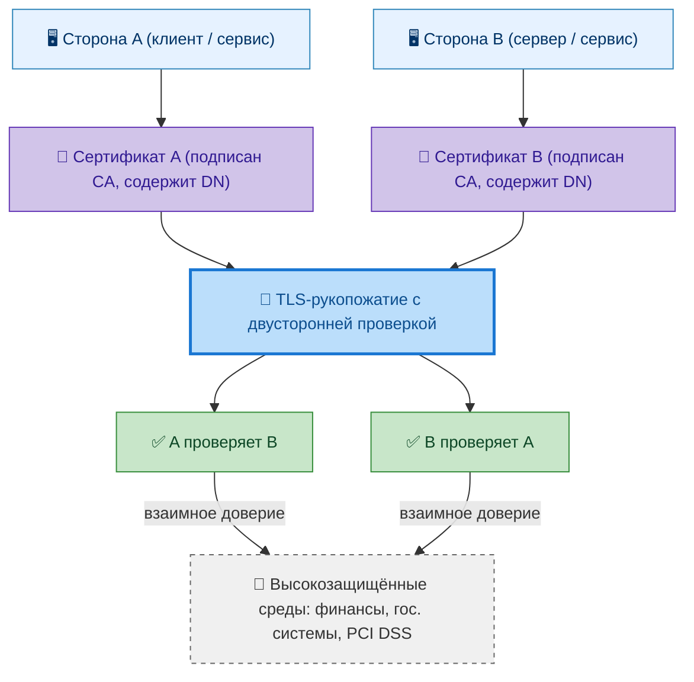
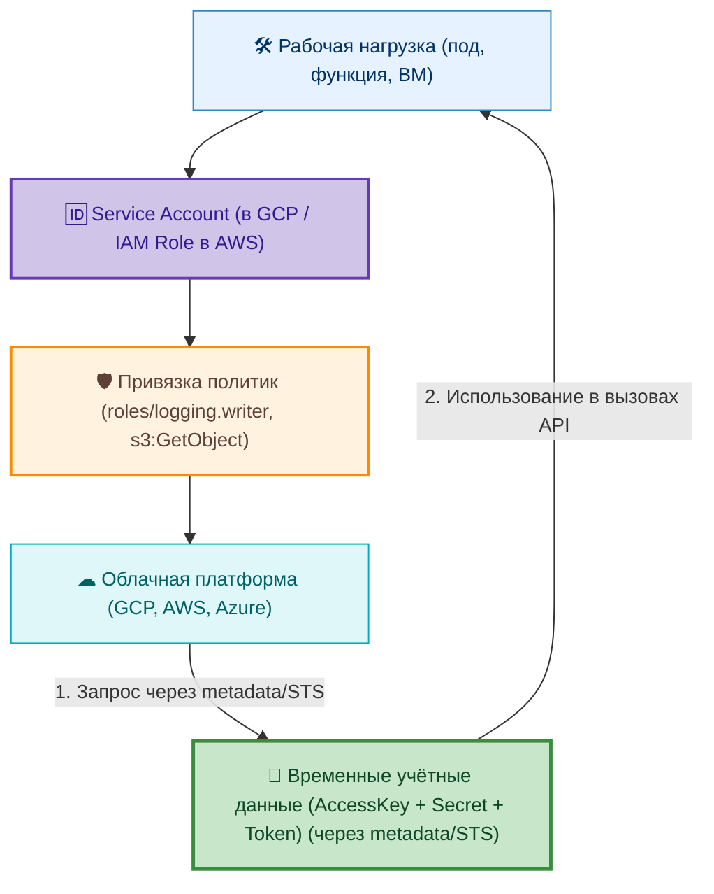

# Авторизация в интеграционных сценариях

  ОБЯЗАТЕЛЬНО
  ДЛЯ НОВИЧКОВ

Всем

---

## Авторизация в интеграционных сценариях

### Что такое интеграционная авторизация?

Интеграционная авторизация — это механизм, посредством которого одна система получает право выполнять определённые действия в другой системе в рамках интеграционного взаимодействия.

В отличие от пользовательской авторизации, где субъект — человек с ролью или правами, в интеграционном контексте субъектом выступает **система** (или её компонент: микросервис, функция, шлюз). Поэтому применяются специфические модели доверия.

---

### API-ключи

**API-ключи** — простой, но ограниченный метод. Ключ передаётся в заголовке запроса и идентифицирует вызывающую систему. Однако ключ не обеспечивает аутентификацию личности (только идентификацию источника) и уязвим при утечке.

---

### OAuth 2.0

**OAuth 2.0 Client Credentials Flow** — стандартный способ авторизации машина-машина (M2M). Система (клиент) аутентифицируется в авторизационном сервере с помощью `client_id` и `client_secret`, получает JWT-токен и использует его для доступа к API. Токен может содержать права (scopes), ограничивающие доступ.

---

### mTLS

**mTLS (mutual TLS)** — двусторонняя аутентификация на уровне транспорта. Каждая сторона предоставляет сертификат, подтверждающий её подлинность. Применяется в высокозащищённых средах (финансы, государственные системы).

---

### Service Accounts

**Service Accounts** — в облачных платформах (Google Cloud, AWS IAM Roles) компоненты могут получать временные учётные данные с точно определёнными привилегиями. Это соответствует принципу наименьших привилегий и автоматическому ротированию ключей.

Интеграционная авторизация должна быть строго привязана к контексту: какая система, зачем, какие действия, на какие ресурсы. Отсутствие такой привязки приводит к избыточным правам и росту поверхности атаки.

---
