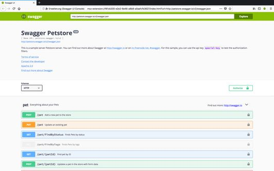

import SwaggerApiExplorer from '@site/src/components/SwaggerApiExplorer.jsx';

# API - интерфейсы прикладного программирования

<div class="article-tags">
  <span class="tag tag-required">ОБЯЗАТЕЛЬНО</span>
  <span class="tag tag-beginner">ДЛЯ НОВИЧКОВ</span>
</div>

<span class="complexity-badge">Всем</span>

---

## API

### API

Человек общается с компьютером через ввод и вывод - соответствующие устройства. А устройство, точнее, его компоненты между собой, общаются через череду сигналов. Эти сигналы структурируются в наборы данных, которые отправляются пакетами по протоколам. Но как программы друг друга понимают? Ответ - при помощи единообразия, в виде API.


Приложение А отправляет запросы в Приложение Б, получает на них ответы. Аналогично и Приложение Б шлёт запросы, получая ответы. Они оба общаются на едином языке и придерживаются определённых правил. Эти правила - API.

**API (Application Programming Interface)** — это набор правил, методов и инструментов, позволяющих различным программам или сервисам взаимодействовать друг с другом. Можно привести в пример реальную жизнь - когда вы приходите в ресторан, вы не говорите напрямую поварам свои пожелания - к вам подходит официант, предоставляет меню с возможным ассортиментом, вы выбираете нужный, даёте указания официанту, который и действует аналогично API - посредник между вами и кухней.

API обычно состоит из:
	- Точек доступа (endpoints, эндпоинты) — URL, по которым можно обращаться.
	- Методов HTTP — GET, POST, PUT, PATCH, DELETE и др.
	- Параметров запроса — пути, строка запроса (query string), заголовки, тело.
	- Формата данных — JSON, XML, Protobuf и т.д.
	- Документации — описание возможностей, примеры использования, ограничения.

---

### Контракт интерфейса

**Контракт интерфейса** — это формальное соглашение между разработчиками клиента и сервера. Он описывает, как сервисы взаимодействуют друг с другом.

Контракт определяет доступные методы, адреса ресурсов, форматы входных и выходных данных, возможные коды ответов. Он служит основой для разработки, тестирования и документирования.

С точки зрения разработки одну операцию API удобно сравнить с **функцией**: есть входные данные, преобразование (логика на стороне владельца API) и результат на выходе — полезные данные или описание ошибки. Набор таких операций и есть API; его можно группировать по доменам (авторизация, отчёты, платежи) или объединять в одно общее API, а специфичные сценарии выносить отдельно.

**Contract-first** — сначала фиксируют контракт (OpenAPI, WSDL), затем пишут или генерируют код. **Code-first** — сначала реализуют код, затем выводят или дополняют описание контракта. Оба подхода встречаются в проектах; выбор зависит от зрелости команды и требований к согласованию с внешними потребителями.

---

### Как вызывается API

Вызов может быть **прямым** или **косвенным**.

| Прямой вызов | Кто инициирует | Зачем |
|--------------|----------------|-------|
| Внутри приложения | модули одной программы | разделение слоёв без сети |
| Между системами | сервис A → API сервиса B | интеграции, платежи, справочники |
| Человек или скрипт | Postman, curl | отладка, подготовка тестовых данных |
| Автотесты | тестовый раннер | быстрая проверка логики без UI |

**Косвенный вызов** — пользователь работает с GUI (кнопка, форма), а клиентское приложение уже обращается к backend API. Оплата на сайте, подсказки в поле адреса, построение отчёта по кнопке — для человека это "интерфейс сайта", под капотом идут те же HTTP- или RPC-вызовы, что и при ручной проверке в Postman.

Проверка через API полезна, когда UI ещё не готов, форма громоздкая, нужно локализовать дефект (ошибка во фронте или в серверной логике) или поднять тестовую базу пакетом запросов. Подробнее об инструментах: [Работа с Postman и curl](/encyclopedia/2-system-network/2-09-osnovy-integratsionnogo-vzaimodeystviya/2), [Тестирование и анализ API](/encyclopedia/7-project/7-05-testirovanie/2).

---

### Local API и Remote API

| | **Local API** (in-process) | **Remote API** (по сети) |
|--|---------------------------|--------------------------|
| Где | модули одного процесса, библиотеки | разные хосты, микросервисы |
| Транспорт | вызов функции, shared memory | HTTP, gRPC, очереди, SOAP |
| В вакансиях "тестирование API" | реже как отдельный фокус | чаще всего (REST, SOAP) |

Когда говорят "интеграция по API", обычно имеют в виду **remote**-взаимодействие. Внутренний API у монолита тоже важен разработчикам, но тестировщик чаще видит его через HTTP-шлюз или публичные эндпоинты.

---

## OpenAPI

### Что такое Open API

**OpenAPI** — это стандарт для описания веб-API. Ранее стандарт назывался **Swagger**. Спецификация позволяет описать интерфейс в формате YAML или JSON.

<SwaggerApiExplorer />



Преимущества использования спецификации:
- Автоматическая генерация документации
- Создание клиентских библиотек для разных языков
- Генерация серверного кода
- Валидация запросов и ответов
- Визуализация через инструменты вроде Swagger UI

Базовая структура документа в формате YAML:

```yaml
openapi: 3.1.0
info:
  title: API для управления задачами
  description: Сервис для создания, чтения, обновления и удаления задач
  version: 1.0.0
servers:
  - url: https://api.example.com/v1
    description: Продуктивный сервер
  - url: https://dev-api.example.com/v1
    description: Тестовый сервер
```

---

### Описание путей и методов

Раздел `paths` содержит описание всех доступных адресов и методов.

> В примерах ниже пути `/Задачи` и `/Задачи/{taskId}` даны **на русском** для наглядности в учебной спецификации. В реальных публичных API почти всегда используют **латиницу** (`/tasks`, `/tasks/{taskId}`): так проще кодировать URL, читать логи и генерировать клиенты. Смысл контракта (методы, схемы, коды ответов) от языка пути не меняется.

```yaml
paths:
  /Задачи:
    get:
      summary: Получить список всех задач
      description: Возвращает массив задач с возможностью фильтрации
      parameters:
        - name: status
          in: query
          description: Фильтр по статусу задачи
          required: false
          schema:
            type: string
            enum: [pending, completed, cancelled]
        - name: limit
          in: query
          description: Максимальное количество задач в ответе
          required: false
          schema:
            type: integer
            default: 20
            minimum: 1
            maximum: 100
      responses:
        '200':
          description: Успешный ответ
          content:
            application/json:
              schema:
                type: array
                items:
                  $ref: '#/components/schemas/Task'
        '401':
          description: Неавторизованный доступ
    post:
      summary: Создать новую задачу
      description: Добавляет задачу в систему
      requestBody:
        required: true
        content:
          application/json:
            schema:
              $ref: '#/components/schemas/TaskCreate'
      responses:
        '201':
          description: Задача создана
          content:
            application/json:
              schema:
                $ref: '#/components/schemas/Task'
        '400':
          description: Некорректные данные
        '401':
          description: Неавторизованный доступ
  /Задачи/{taskId}:
    get:
      summary: Получить задачу по идентификатору
      parameters:
        - name: taskId
          in: path
          description: Уникальный идентификатор задачи
          required: true
          schema:
            type: integer
            minimum: 1
      responses:
        '200':
          description: Задача найдена
          content:
            application/json:
              schema:
                $ref: '#/components/schemas/Task'
        '404':
          description: Задача не найдена
    put:
      summary: Обновить задачу полностью
      parameters:
        - name: taskId
          in: path
          required: true
          schema:
            type: integer
      requestBody:
        required: true
        content:
          application/json:
            schema:
              $ref: '#/components/schemas/TaskUpdate'
      responses:
        '200':
          description: Задача обновлена
          content:
            application/json:
              schema:
                $ref: '#/components/schemas/Task'
        '404':
          description: Задача не найдена
    patch:
      summary: Частично обновить задачу
      parameters:
        - name: taskId
          in: path
          required: true
          schema:
            type: integer
      requestBody:
        required: true
        content:
          application/json:
            schema:
              $ref: '#/components/schemas/TaskPatch'
      responses:
        '200':
          description: Задача обновлена
          content:
            application/json:
              schema:
                $ref: '#/components/schemas/Task'
    delete:
      summary: Удалить задачу
      parameters:
        - name: taskId
          in: path
          required: true
          schema:
            type: integer
      responses:
        '204':
          description: Задача удалена
        '404':
          description: Задача не найдена
```

---

### Описание схем данных

Раздел `components/schemas` содержит определения моделей данных:

```yaml
components:
  schemas:
    Task:
      type: object
      required:
        - id
        - title
        - status
        - createdAt
      properties:
        id:
          type: integer
          description: Уникальный идентификатор задачи
          example: 123
        title:
          type: string
          description: Заголовок задачи
          maxLength: 200
          example: "Подготовить отчет"
        description:
          type: string
          description: Подробное описание задачи
          nullable: true
          example: "Собрать данные за квартал и оформить презентацию"
        status:
          type: string
          description: Текущий статус задачи
          enum: [pending, completed, cancelled]
          example: "pending"
        priority:
          type: string
          description: Приоритет задачи
          enum: [low, medium, high]
          default: "medium"
          example: "high"
        dueDate:
          type: string
          format: date-time
          description: Срок выполнения задачи
          nullable: true
          example: "2026-03-15T18:00:00Z"
        createdAt:
          type: string
          format: date-time
          description: Дата и время создания задачи
          example: "2026-02-26T10:30:00Z"
        updatedAt:
          type: string
          format: date-time
          description: Дата и время последнего обновления
          nullable: true
          example: "2026-02-26T14:45:00Z"
    
    TaskCreate:
      type: object
      required:
        - title
      properties:
        title:
          type: string
          maxLength: 200
        description:
          type: string
          nullable: true
        status:
          type: string
          enum: [pending, completed, cancelled]
          default: "pending"
        priority:
          type: string
          enum: [low, medium, high]
          default: "medium"
        dueDate:
          type: string
          format: date-time
          nullable: true
    
    TaskUpdate:
      type: object
      required:
        - title
        - description
        - status
        - priority
        - dueDate
      properties:
        title:
          type: string
          maxLength: 200
        description:
          type: string
          nullable: true
        status:
          type: string
          enum: [pending, completed, cancelled]
        priority:
          type: string
          enum: [low, medium, high]
        dueDate:
          type: string
          format: date-time
          nullable: true
    
    TaskPatch:
      type: object
      properties:
        title:
          type: string
          maxLength: 200
        description:
          type: string
          nullable: true
        status:
          type: string
          enum: [pending, completed, cancelled]
        priority:
          type: string
          enum: [low, medium, high]
        dueDate:
          type: string
          format: date-time
          nullable: true
```

---

### Типы данных в схемах

В схемах можно использовать следующие типы:

- `string` — текстовая строка
- `integer` — целое число
- `number` — число с плавающей точкой
- `boolean` — логическое значение
- `array` — массив значений
- `object` — объект с полями

Для строковых полей доступны форматы:

- `date` — дата в формате `YYYY-MM-DD`
- `date-time` — дата и время в формате ISO 8601
- `email` — адрес электронной почты
- `uuid` — универсальный уникальный идентификатор
- `uri` — универсальный идентификатор ресурса

---

### Обязательность полей

Ключевое слово `required` определяет, какие поля обязательны для заполнения. Список обязательных полей указывается в виде массива строк с именами полей.

Поле `nullable: true` разрешает передавать значение `null` для опциональных полей.

---

### Ограничения значений

Для числовых полей можно задать ограничения:

- `minimum` — минимальное значение
- `maximum` — максимальное значение
- `exclusiveMinimum` — строгое ограничение снизу
- `exclusiveMaximum` — строгое ограничение сверху

Для строковых полей:

- `minLength` — минимальная длина строки
- `maxLength` — максимальная длина строки
- `pattern` — регулярное выражение для валидации

Для массивов:

- `minItems` — минимальное количество элементов
- `maxItems` — максимальное количество элементов
- `uniqueItems` — требование уникальности элементов

---

### Примеры данных

Ключевое слово `example` или `Примеры` позволяет привести образцы данных. Это помогает понять формат запросов и ответов без дополнительных пояснений.

---

### Коды ответов HTTP

Стандартные коды состояния:

- `200` — успешный запрос
- `201` — ресурс создан
- `204` — успешный запрос без тела ответа
- `400` — некорректный запрос
- `401` — неавторизованный доступ
- `403` — запрещенный доступ
- `404` — ресурс не найден
- `409` — конфликт при создании или обновлении
- `422` — ошибки валидации данных
- `500` — внутренняя ошибка сервера

---

### Версионирование API

Версионирование позволяет вносить изменения в интерфейс без нарушения работы существующих клиентов.

Способы указания версии:

**В пути:**
```
GET /v1/Задачи
GET /v2/Задачи
```

**В заголовке:**
```
GET /Задачи
Accept: application/vnd.example.v1+json
```

**В параметре запроса:**
```
GET /Задачи?version=1
```

Рекомендуемый подход — указание версии в пути. Это делает версию явной и упрощает маршрутизацию запросов.

---

### Параметры запроса

Параметры могут передаваться разными способами:

**В пути (path):**
```
GET /Задачи/123
```

**В строке запроса (query):**
```
GET /Задачи?status=pending&limit=10
```

**В заголовках (header):**
```
Authorization: Bearer token123
```

**В теле запроса (body):**
```json
{
  "title": "Новая задача",
  "priority": "high"
}
```

---

### Форматы содержимого

Наиболее распространенные форматы:

- `application/json` — данные в формате JSON
- `application/xml` — данные в формате XML
- `multipart/form-data` — передача файлов
- `application/x-www-form-urlencoded` — форма в кодировке URL

---

### Документирование

Поля `summary` и `description` содержат краткое и подробное описание операции. Поле `description` поддерживает форматирование Markdown для создания структурированной документации.

---

### Валидация данных

Спецификация позволяет описать правила валидации для входных данных. Это обеспечивает согласованность формата запросов и ответов между клиентом и сервером.

---

### Автоматизация

На основе спецификации можно генерировать:

- Документацию в формате HTML
- Клиентские библиотеки для различных языков программирования
- Серверный код с заглушками для обработчиков
- Тесты для проверки соответствия реализации спецификации

---

## SDK

**SDK (Software Development Kit)** — набор готовых библиотек, инструментов и примеров кода для работы с определённым API (по-русски часто говорят "набор средств разработки"). Используется тогда, когда хочется не писать HTTP-запросы вручную, а использовать удобный интерфейс на своём языке. 

К примеру, Telegram предоставляет такой набор инструментов, благодаря чему на стороне сервера нужно лишь подключить библиотеку, указать токен и использовать готовые методы для работы без необходимости расписывать логику базовых действий, к примеру, отправки сообщений. SDK скрывает сетевые детали и предоставляет простой интерфейс.

---

## REST

### Формат, протокол и транспорт

Перед разбором REST полезно разделить уровни, которые в разговоре часто смешивают:

| Уровень | Примеры | Роль |
|---------|---------|------|
| **Формат представления** | JSON, XML, Protobuf | как сериализованы данные в теле сообщения |
| **Протокол прикладного обмена** | HTTP, AMQP | правила запроса, ответа, кодов ошибок |
| **Транспорт** | TCP/IP | доставка байтов по сети |

На практике говорят, например, **JSON over HTTP** или **XML over MQ**: один и тот же JSON может ехать по HTTP, а XML — через очередь. **REST** относится к **архитектурному стилю** распределённой системы, а не к формату JSON и не к протоколу HTTP, хотя в веб-разработке их почти всегда сочетают.

---

### Что такое REST

**REST (Representational State Transfer)** — архитектурный **стиль** взаимодействия компонентов в сети, описанный Роем Филдингом. Это набор согласованных **ограничений** (constraints), а не протокол вроде HTTP или SOAP. Цель стиля — свойства, важные для крупных систем: масштабируемость, производительность, простота сопровождения, устойчивость к изменениям, отказоустойчивость — то есть типичные **нефункциональные** требования.

На практике REST чаще всего реализуют поверх **HTTP**: ресурсы по URL, семантика методов GET/POST/PUT/PATCH/DELETE, коды состояния, заголовки кэширования. Документация по HTTP — хорошая опора для такого API; детали протокола — в главе [HTTP как основа веб-интеграций](/encyclopedia/2-system-network/2-09-osnovy-integratsionnogo-vzaimodeystviya/118).

Стандартные методы HTTP в ресурс-ориентированном API:

- **GET** — получение представления ресурса (без изменения состояния на сервере).
- **POST** — создание ресурса или операция с побочным эффектом.
- **PUT** — полная замена состояния ресурса (клиент передаёт целое представление).
- **PATCH** — частичное обновление: меняются только указанные поля.
- **DELETE** — удаление ресурса.

Подход удобен для CRUD и веб/mobile-клиентов; для жёстких корпоративных контрактов и транзакций по-прежнему встречают SOAP — см. [Веб-сервисы](/encyclopedia/2-system-network/2-09-osnovy-integratsionnogo-vzaimodeystviya/115).

---

### REST, RESTful и "REST API"

В проектах эти термины используют по-разному — на старте работ полезно уточнить, что имеет в виду команда.

| Термин | Смысл |
|--------|--------|
| **REST** | стиль и шесть ограничений Филдинга; при нарушении ограничений (кроме code on demand) систему в строгом смысле уже не называют REST |
| **RESTful** | сервис **стремится** соблюдать ограничения REST |
| **REST API** | разговорное название HTTP API с ресурсами и методами; технически чаще соответствует [уровню 2 модели Ричардсона](/encyclopedia/7-project/7-06-proektirovanie-i-arhitektura/design/212), а не полному REST |
| **HTTP API** | нейтральное имя для того же уровня 2 без споров о "настоящем REST" |

Частые трактовки на работе: "REST" = любой **JSON over HTTP** (часто уровень 0 по Ричардсону); или "REST" = отдельные URI + правильные **HTTP-глаголы** (уровень 2). Обе версии живут параллельно — важно договориться в ТЗ и ревью.

---

### Шесть ограничений REST

| Ограничение | Зачем (НФТ) | Минусы и нюансы |
|-------------|-------------|-----------------|
| **Клиент–сервер** | UI отдельно от данных и интеграций; проще менять клиентов | сервер — точка отказа; больше сетевых round-trip |
| **Stateless** | любой узел кластера может обработать запрос; проще кэш и логи | весь контекст в каждом запросе; тяжелее клиент |
| **Кэширование** | меньше нагрузки на origin и смежные системы | риск устаревших данных; сложная инвалидация |
| **Единообразие интерфейса** | предсказуемые URI, методы, форматы; в т.ч. **HATEOAS** на уровне 3 | HATEOAS усложняет клиента; в проде часто опускают |
| **Слоистая система** | proxy, балансировщики, CDN без переделки клиента | задержка, цепочка посредников |
| **Code on demand** | сервер отдаёт исполняемый код (типично JS в браузере) | **единственное необязательное** ограничение по Филдингу |

**Stateless и stateful на примере.** Сервис прогноза погоды в stateless-варианте: `GET /forecast?city=Moscow&date=2026-06-20` — город и дата в каждом запросе. В stateful-варианте клиент мог бы спросить "а завтра?", опираясь на сессию на сервере (как в классическом FTP). REST требует stateless: сервер не обязан помнить предыдущий диалог. Подробнее о сессиях в интеграциях: [Управление сессиями](/encyclopedia/2-system-network/2-09-osnovy-integratsionnogo-vzaimodeystviya/113).

**HATEOAS** (Hypermedia as the Engine of Application State): в ответе на `GET /accounts/12345` сервер возвращает не только баланс, но и ссылки на допустимые действия (`deposit`, `transfer`) и связанные ресурсы. Клиент меньше зашит на жёсткие URL; цена — сложнее клиент и генерация ответов. Уровни зрелости и POX — в [модели Ричардсона](/encyclopedia/7-project/7-06-proektirovanie-i-arhitektura/design/212).

---

### Распространённые заблуждения

1. **"Ограничения REST по желанию"** — нет: обязательны все, кроме code on demand.
2. **"REST — протокол"** — нет: протокол передачи — HTTP, SOAP и т.д.; REST задаёт архитектурные правила.
3. **"REST = HTTP"** — REST не привязан к HTTP, но HTTP спроектирован с учётом REST (Филдинг — соавтор HTTP); поэтому связка почти стандарт индустрии.
4. **"REST = JSON"** — формат произвольный; JSON популярен как лёгкая альтернатива XML в эпоху отхода от SOAP.
5. **"Наш REST на 100%"** — чаще всего имеют в виду HTTP API уровня 2; полный REST с HATEOAS (уровень 3) встречается редко.

---

### RESTful

**RESTful** (или **RESTful API**) — сервис, спроектированный с опорой на ограничения REST: ресурсы с URI, осмысленные HTTP-методы, коды ответа, по возможности stateless и кэшируемые GET. На практике это синоним "хорошо спроектированного HTTP API", а не гарантия всех шести ограничений в полном объёме.

---

### Создание REST API

**Как создать свой REST API?**

1. Определить, какие данные будут передаваться.
2. Определить, какие операции нужно поддерживать (CRUD: Create, Read, Update, Delete).
3. Определить, кто будет использовать API (фронтенд, мобильное приложение, другие сервисы).
4. Выбрать и определить базовый путь, например, /api/v1.
5. Для каждого типа данных определить URL-пути:
	- GET /users – получить список пользователей
	- GET /users/123 – получить пользователя с ID 123
	- POST /users – создать нового пользователя
	- PUT /users/123 – обновить пользователя
	- DELETE /users/123 – удалить пользователя
6. Определить необходимость и добавить параметры запроса - фильтрация, сортировка, пагинация.
7. Определить формат обмена данными (обычно JSON).
8. Определить структуру запросов и ответов, к примеру:

```
// Пример запроса
{
  "name": "John",
  "email": "john@example.com"
}

// Пример ответа
{
  "id": 123,
  "name": "John",
  "created_at": "2025-04-05T10:00:00Z"
}

```
9. Настроить маршруты (роутинг) - сопоставить URL + HTTP-метод → обработчик.
10. В обработчиках нужно написать возможности:
	- чтения входящих данных из заголовков, строки запроса или тела;
	- проверку данных (валидацию);
	- обращение к БД или другому источнику данных (например, файл);
	- формирование ответа - статус, заголовки, тело;
	- обработка ошибок.

Обычно в готовых SDK уже имеются некоторые написанные решения, порой можно просто пользоваться имеющимися свойствами и методами объектов.

11. Добавить авторизацию (если нужна, но очевидно она всегда нужна для безопасности) - JWT, OAuth, API ключи. По возможности, кстати, нужно придерживаться и иных мер безопасности - использование HTTPS, ограничение доступа по CORS, валидация данных и логирование действий.
12. Задокументировать, указав описание всех эндпоинтов, примеры запросов и ответов, описание кодов и ошибок. Для этого можно использовать Open API / Swagger.
13. Проверять работу всех методов можно через Postman, curl, Swagger UI.
14. После тестирования, сервис разворачивается на бэкенд-сервере, допустим на хостинге, и когда будет определен хост, можно будет уже отправлять запросы. До этого момента, на этапе тестирования, его можно выполнять на локальной машине.
Итого:
	- клиент отправляет HTTP-запрос на конкретный URL;
	- сервер определяет маршрут и вызывает функцию-обработчик;
	- обработчик получает данные, может взаимодействовать с БД или даже другими API;
	- сервер формирует HTTP-ответ и отправляет его обратно клиенту.


REST — это стиль, а не строгий протокол, может быть реализован на любом языке программирования, легко масштабируется, хорошо документируется. 


---

## Другие API

А как же другие API?

GraphQL API запрашивает только нужные данные, гибко управляя структурой ответа, используется для SPA, микросервисов, сложных данных.

SOAP API более старый протокол с жёсткой структурой, основанный на XML. Его можно встретить в устаревших корпоративных системах.

gRPC API высокопроизводительный (ведь там RPC-протокол), работает поверх HTTP/2, использует Protobuf. В высоконагруженных системах с микросервисами можно часто встретить такой стиль.

WebSocket API, как мы уже не раз отметили, использует двустороннее постоянное соединение.

SSE (Server-Sent Events) использует одностороннюю передачу данных от сервера к клиенту - новости, уведомления, мониторинг.

OAuth 2.0 API — это протокол авторизации, который позволяет приложениям получать ограниченный доступ к ресурсам пользователя без необходимости знать его пароль. К примеру, это авторизация через Google/Facebook, подключение к Google Drive или Dropbox, работа с банковскими API. OAuth 2.0 использует токены , такие как:
	- access_token — временный ключ для доступа к ресурсам
	- refresh_token — для получения нового access_token

Front API — это не общепринятый термин, но его можно интерпретировать как API, которое используется для взаимодействия с фронтендом (клиентской частью) приложения. В более широком смысле это может означать:
	- API для клиентских приложений - предоставление данных и функциональности для веб-приложений, мобильных приложений или десктопных клиентов.
	- REST/GraphQL API - часто такие API используются для передачи данных между сервером и клиентом.

Кстати говоря о фронте, следует отметить, что как раз для работы с API в JavaScript используют метод fetch():

```javascript
fetch('/api/user/profile', {
  method: 'GET',
  headers: { Authorization: 'Bearer <token>' }
})
  .then((response) => {
    if (!response.ok) throw new Error(`HTTP ${response.status}`);
    return response.json();
  })
  .then((profile) => console.log(profile))
  .catch((err) => console.error(err));
```

`fetch()` — встроенный в браузер метод, позволяющий отправлять HTTP-запросы к серверу и получать данные без перезагрузки страницы. Он возвращает `Promise`, который разрешается в объект `Response`, а затем можно обработать тело ответа (например, как JSON или текст).

Синтаксис прост: `fetch(input, init)`. `input` — URL (строка) или объект `Request`; `init` (необязательный) — настройки запроса: метод, заголовки, тело и т.д.

После вызова fetch(), вы получаете объект Response.

Основные свойства Response:
	- .ok — возвращает true, если статус 200–299.
	- .status — HTTP-статус ответа (например, 200, 404).
	- .statusText — текстовое описание статуса (например, "OK", "Not Found").
	- .headers — объект Headers, содержащий заголовки ответа.
	- .url — фактический URL ответа (может отличаться от запрошенного при редиректах).

Методы для получения тела:
	- .json() — парсит тело как JSON.
	- .text() — возвращает тело как строку.
	- .blob() — возвращает как Blob (например, изображения).
	- .formData() — возвращает как FormData.
	- .arrayBuffer() — возвращает как массив ArrayBuffer.

fetch() подчиняется политике CORS (Cross-Origin Resource Sharing), если сервер не разрешает кросс-доменные запросы, браузер блокирует их, а для авторизации может потребоваться установка заголовков или использование credentials.

Web API — это общий термин, обозначающий API, доступные через веб-интерфейс. Это могут быть как серверные API (например, REST, GraphQL), так и клиентские API (например, браузерные API).

Основные типы Web API:

Серверные API :
	- RESTful API: стандартный подход к созданию веб-сервисов.
	- GraphQL API: гибкий запрос данных с возможностью выбора полей.
	- SOAP API: устаревший протокол для веб-сервисов.

Клиентские API :
	- DOM API: управление HTML-документами в браузере.
	- Fetch API: выполнение HTTP-запросов из браузера.
	- Geolocation API: получение географических данных пользователя.

Fluent API — это стиль программирования, при котором методы возвращают объект, позволяя "цеплять" вызовы методов друг за другом. Используется в ORM, билдерах SQL, тестовых фреймворках. Этот подход часто используется для создания удобного и читаемого кода.

FastAPI — это современный веб-фреймворк для создания API на Python. Он известен своей высокой производительностью, простотой использования и поддержкой асинхронного программирования. Основан на на Starlette и Pydantic, что делает его одним из самых быстрых фреймворков.

Чит-лист FastAPI - https://cheatsheets.zip/fastapi

Starlette — это лёгкий и быстрый веб-фреймворк для Python, предназначенный для создания асинхронных веб-приложений и API. Он является основой таких проектов, как FastAPI , и известен своей производительностью и гибкостью.

Pydantic — это библиотека Python для валидации данных и управления конфигурацией с использованием аннотаций типов. Она автоматически проверяет данные на соответствие ожидаемым типам и структурам.

SignalR — это библиотека для ASP.NET Core, которая позволяет реализовать реальное взаимодействие между клиентом и сервером. Она поддерживает двустороннюю связь через WebSocket, Server-Sent Events (SSE) и Long Polling. Именно оно используется для чатов, онлайн-игр, обновлений.

Long Polling — это техника для реализации асинхронного взаимодействия между клиентом и сервером в веб-приложениях. Она позволяет клиенту ожидать новые данные от сервера, не отправляя постоянные запросы.

Как работает:
	- Клиент отправляет HTTP-запрос на сервер.
	- Сервер держит соединение открытым до тех пор, пока не появятся новые данные или истечет таймаут.
	- Как только данные доступны, сервер отправляет ответ, и клиент сразу же отправляет новый запрос.

Каждая программа, которая поддерживает какой-то свой метод взаимодействия, может предоставлять свой интерфейс, и как правило, он будет характерен именно для взаимодействия соответствующего продукта - Kubernetes API, Telegram API, Windows API, WhatsApp API, Google Maps API, Twitter/X API и прочие.

---

## См. также

Продолжение темы в разделе «Инфраструктура и безопасность» — [REST](/encyclopedia/8-infra-security/8-05-mikroservisy-i-integratsiya/1151) и [проектирование API](/encyclopedia/8-infra-security/8-05-mikroservisy-i-integratsiya/122).

---

## Проектирование и смежные главы

Ввод по API — здесь; **проектирование контракта для внешних потребителей** разобрано по шагам с примерами HTTP и OpenAPI в [Проектирование API и интеграций](/encyclopedia/7-project/7-06-proektirovanie-i-arhitektura/design/117) (сквозной пример партнёрского API заказов).

| Этап | Куда читать |
|------|-------------|
| HTTP, коды, заголовки | [HTTP как основа веб-интеграций](/encyclopedia/2-system-network/2-09-osnovy-integratsionnogo-vzaimodeystviya/118) |
| Зрелость REST (уровни 0–3) | [Модель Ричардсона](/encyclopedia/7-project/7-06-proektirovanie-i-arhitektura/design/212) |
| Идемпотентность, `Idempotency-Key` | [Методы и ключ идемпотентности](/encyclopedia/7-project/7-06-proektirovanie-i-arhitektura/design/213) |
| OpenAPI, Swagger UI | [Документирование API](/encyclopedia/7-project/7-08-tehnicheskoe-pismo/3) |
| REST на практике | [8.05. REST](/encyclopedia/8-infra-security/8-05-mikroservisy-i-integratsiya/1151) |
| Углублённое API design | [8.05. Проектирование API](/encyclopedia/8-infra-security/8-05-mikroservisy-i-integratsiya/122) |
| Публичный API, OAuth, webhooks | [7.06.1171](/encyclopedia/7-project/7-06-proektirovanie-i-arhitektura/design/1171) |
| mTLS, JWS, AsyncAPI, outbox | [7.06.1172](/encyclopedia/7-project/7-06-proektirovanie-i-arhitektura/design/1172) |
| Проверка запросов | [Postman и curl](/encyclopedia/2-system-network/2-09-osnovy-integratsionnogo-vzaimodeystviya/2), [Тестирование API](/encyclopedia/7-project/7-05-testirovanie/2) |

Полный список ссылок — таблица «Маршрут по материалам API» в [design/117](/encyclopedia/7-project/7-06-proektirovanie-i-arhitektura/design/117).

---
