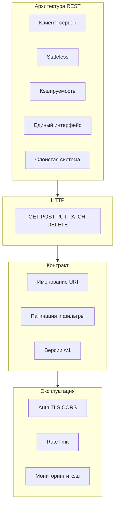

import ExternalPlayEmbed from '@site/src/components/ExternalPlayEmbed';


# API - интерфейсы прикладного программирования

<div class="article-tags">
  <span class="tag tag-required">ОБЯЗАТЕЛЬНО</span>
  <span class="tag tag-beginner">ДЛЯ НОВИЧКОВ</span>
</div>

<span class="complexity-badge">Всем</span>

---

## API

### API

Человек общается с компьютером через ввод и вывод - соответствующие устройства. А устройство, точнее, его компоненты между собой, общаются через череду сигналов. Эти сигналы структурируются в наборы данных, которые отправляются пакетами по протоколам. Но как программы друг друга понимают? Ответ - при помощи единообразия, в виде API.


Приложение А отправляет запросы в Приложение Б, получает на них ответы. Аналогично и Приложение Б шлёт запросы, получая ответы. Они оба общаются на едином языке и придерживаются определённых правил. Эти правила - API.

**API (Application Programming Interface)** — это набор правил, методов и инструментов, позволяющих различным программам или сервисам взаимодействовать друг с другом. Можно привести в пример реальную жизнь - когда вы приходите в ресторан, вы не говорите напрямую поварам свои пожелания - к вам подходит официант, предоставляет меню с возможным ассортиментом, вы выбираете нужный, даёте указания официанту, который и действует аналогично API - посредник между вами и кухней.

API обычно состоит из:
	- Точек доступа (endpoints, эндпоинты) — URL, по которым можно обращаться.
	- Методов HTTP — GET, POST, PUT, PATCH, DELETE и др.
	- Параметров запроса — пути, строка запроса (query string), заголовки, тело.
	- Формата данных — JSON, XML, Protobuf и т.д.
	- Документации — описание возможностей, примеры использования, ограничения.

---

### Контракт интерфейса

**Контракт интерфейса** — это формальное соглашение между разработчиками клиента и сервера. Он описывает, как сервисы взаимодействуют друг с другом.

Контракт определяет доступные методы, адреса ресурсов, форматы входных и выходных данных, возможные коды ответов. Он служит основой для разработки, тестирования и документирования.

С точки зрения разработки одну операцию API удобно сравнить с **функцией**: есть входные данные, преобразование (логика на стороне владельца API) и результат на выходе — полезные данные или описание ошибки. Набор таких операций и есть API; его можно группировать по доменам (авторизация, отчёты, платежи) или объединять в одно общее API, а специфичные сценарии выносить отдельно.

**Contract-first** — сначала фиксируют контракт (OpenAPI, WSDL), затем пишут или генерируют код. **Code-first** — сначала реализуют код, затем выводят или дополняют описание контракта. Оба подхода встречаются в проектах; выбор зависит от зрелости команды и требований к согласованию с внешними потребителями.

---

### Как вызывается API

Вызов может быть **прямым** или **косвенным**.

| Прямой вызов | Кто инициирует | Зачем |
|--------------|----------------|-------|
| Внутри приложения | модули одной программы | разделение слоёв без сети |
| Между системами | сервис A → API сервиса B | интеграции, платежи, справочники |
| Человек или скрипт | Postman, curl | отладка, подготовка тестовых данных |
| Автотесты | тестовый раннер | быстрая проверка логики без UI |

**Косвенный вызов** — пользователь работает с GUI (кнопка, форма), а клиентское приложение уже обращается к backend API. Оплата на сайте, подсказки в поле адреса, построение отчёта по кнопке — для человека это "интерфейс сайта", под капотом идут те же HTTP- или RPC-вызовы, что и при ручной проверке в Postman.

Проверка через API полезна, когда UI ещё не готов, форма громоздкая, нужно локализовать дефект (ошибка во фронте или в серверной логике) или поднять тестовую базу пакетом запросов. Подробнее об инструментах — [Работа с Postman и curl](/encyclopedia/2-system-network/2-09-osnovy-integratsionnogo-vzaimodeystviya/2), [утилита curl](/encyclopedia/2-system-network/2-05-terminal/1133), [curl / fetch — примеры](/lab/Примеры/1133), [Fetch / axios — типовые запросы](/lab/Примеры/1145), [Тестирование и анализ API](/encyclopedia/7-project/7-05-testirovanie/2).

---

### Local API и Remote API

| | **Local API** (in-process) | **Remote API** (по сети) |
|--|---------------------------|--------------------------|
| Где | модули одного процесса, библиотеки | разные хосты, микросервисы |
| Транспорт | вызов функции, shared memory | HTTP, gRPC, очереди, SOAP |
| В вакансиях "тестирование API" | реже как отдельный фокус | чаще всего (REST, SOAP) |

Когда говорят "интеграция по API", обычно имеют в виду **remote**-взаимодействие. Внутренний API у монолита тоже важен разработчикам, но тестировщик чаще видит его через HTTP-шлюз или публичные эндпоинты.

---

### Структура HTTP-запроса к веб-API

Удалённый **веб-API** чаще всего вызывают по HTTP. Один вызов собирают из нескольких частей; их удобно разложить по [шпаргалке REST URL](#rest-url-breakdown) перед чтением OpenAPI или Postman.

| Часть | Роль | Пример |
|-------|------|--------|
| **HTTP-метод** | что сделать с ресурсом | `GET`, `POST`, `PUT`, `PATCH`, `DELETE` |
| **Endpoint (эндпоинт)** | адрес API на сервере | `https://maps.example.com/v1/geocode` |
| **Query-параметры** | уточнение запроса в строке URL | `?address=Moscow&key=APP_API_KEY` |
| **Заголовки** | метаданные, авторизация, формат | `Authorization: Bearer …`, `Accept: application/json` |
| **Тело (body)** | данные для `POST`/`PUT`/`PATCH` | JSON с полями заказа или формы |

**Пример.** Приложение доставки хочет показать адрес на карте. Клиент отправляет запрос к **Maps API** поставщика карт; тот обращается к своему хранилищу координат и возвращает ответ.

```http
GET https://maps.example.com/v1/geocode?address=Lenina+10+Moscow&key=APP_API_KEY
Accept: application/json
```

**Ответ** тоже структурирован:

| Часть | Роль | Пример |
|-------|------|--------|
| **Код состояния (status code)** | итог обработки | `200 OK`, `400 Bad Request`, `401 Unauthorized` |
| **Заголовки ответа** | тип содержимого, кэш | `Content-Type: application/json` |
| **Тело ответа** | полезные данные | JSON или XML с координатами, списком объектов, ошибкой |

```json
{
  "lat": 55.75,
  "lon": 37.62,
  "formatted_address": "ул. Ленина, 10, Москва"
}
```

Ключ `APP_API_KEY` в query или заголовке — типичный способ **аутентификации клиента** у публичных API; у продакшен-сервисов ключи хранят в переменных окружения или секрет-хранилищах, а не в исходниках. Подробнее о способах передачи параметров — в разделе [OpenAPI](#openapi) ниже; о проверке запросов вручную — [Postman и curl](/encyclopedia/2-system-network/2-09-osnovy-integratsionnogo-vzaimodeystviya/2).

---

## OpenAPI

### Что такое Open API

**OpenAPI** — это стандарт для описания веб-API. Ранее стандарт назывался **Swagger**. Спецификация позволяет описать интерфейс в формате YAML или JSON.

<ExternalPlayEmbed example="system-network/swagger-api-explorer" title="Swagger API Explorer" minHeight={520} />


Преимущества использования спецификации:
- Автоматическая генерация документации
- Создание клиентских библиотек для разных языков
- Генерация серверного кода
- Валидация запросов и ответов
- Визуализация через инструменты вроде Swagger UI

Базовая структура документа в формате YAML:

```yaml
openapi: 3.1.0
info:
  title: API для управления задачами
  description: Сервис для создания, чтения, обновления и удаления задач
  version: 1.0.0
servers:
  - url: https://api.example.com/v1
    description: Продуктивный сервер
  - url: https://dev-api.example.com/v1
    description: Тестовый сервер
```

---

### Описание путей и методов

Раздел `paths` содержит описание всех доступных адресов и методов.

> В примерах ниже пути `/Задачи` и `/Задачи/&#123;taskId&#125;` даны **на русском** для наглядности в учебной спецификации. В реальных публичных API почти всегда используют **латиницу** (`/tasks`, `/tasks/&#123;taskId&#125;`): так проще кодировать URL, читать логи и генерировать клиенты. Смысл контракта (методы, схемы, коды ответов) от языка пути не меняется.

```yaml
paths:
  /Задачи:
    get:
      summary: Получить список всех задач
      description: Возвращает массив задач с возможностью фильтрации
      parameters:
        - name: status
          in: query
          description: Фильтр по статусу задачи
          required: false
          schema:
            type: string
            enum: [pending, completed, cancelled]
        - name: limit
          in: query
          description: Максимальное количество задач в ответе
          required: false
          schema:
            type: integer
            default: 20
            minimum: 1
            maximum: 100
      responses:
        '200':
          description: Успешный ответ
          content:
            application/json:
              schema:
                type: array
                items:
                  $ref: '#/components/schemas/Task'
        '401':
          description: Неавторизованный доступ
    post:
      summary: Создать новую задачу
      description: Добавляет задачу в систему
      requestBody:
        required: true
        content:
          application/json:
            schema:
              $ref: '#/components/schemas/TaskCreate'
      responses:
        '201':
          description: Задача создана
          content:
            application/json:
              schema:
                $ref: '#/components/schemas/Task'
        '400':
          description: Некорректные данные
        '401':
          description: Неавторизованный доступ
  /Задачи/{taskId}:
    get:
      summary: Получить задачу по идентификатору
      parameters:
        - name: taskId
          in: path
          description: Уникальный идентификатор задачи
          required: true
          schema:
            type: integer
            minimum: 1
      responses:
        '200':
          description: Задача найдена
          content:
            application/json:
              schema:
                $ref: '#/components/schemas/Task'
        '404':
          description: Задача не найдена
    put:
      summary: Обновить задачу полностью
      parameters:
        - name: taskId
          in: path
          required: true
          schema:
            type: integer
      requestBody:
        required: true
        content:
          application/json:
            schema:
              $ref: '#/components/schemas/TaskUpdate'
      responses:
        '200':
          description: Задача обновлена
          content:
            application/json:
              schema:
                $ref: '#/components/schemas/Task'
        '404':
          description: Задача не найдена
    patch:
      summary: Частично обновить задачу
      parameters:
        - name: taskId
          in: path
          required: true
          schema:
            type: integer
      requestBody:
        required: true
        content:
          application/json:
            schema:
              $ref: '#/components/schemas/TaskPatch'
      responses:
        '200':
          description: Задача обновлена
          content:
            application/json:
              schema:
                $ref: '#/components/schemas/Task'
    delete:
      summary: Удалить задачу
      parameters:
        - name: taskId
          in: path
          required: true
          schema:
            type: integer
      responses:
        '204':
          description: Задача удалена
        '404':
          description: Задача не найдена
```

---

### Описание схем данных

Раздел `components/schemas` содержит определения моделей данных:

```yaml
components:
  schemas:
    Task:
      type: object
      required:
        - id
        - title
        - status
        - createdAt
      properties:
        id:
          type: integer
          description: Уникальный идентификатор задачи
          example: 123
        title:
          type: string
          description: Заголовок задачи
          maxLength: 200
          example: "Подготовить отчет"
        description:
          type: string
          description: Подробное описание задачи
          nullable: true
          example: "Собрать данные за квартал и оформить презентацию"
        status:
          type: string
          description: Текущий статус задачи
          enum: [pending, completed, cancelled]
          example: "pending"
        priority:
          type: string
          description: Приоритет задачи
          enum: [low, medium, high]
          default: "medium"
          example: "high"
        dueDate:
          type: string
          format: date-time
          description: Срок выполнения задачи
          nullable: true
          example: "2026-03-15T18:00:00Z"
        createdAt:
          type: string
          format: date-time
          description: Дата и время создания задачи
          example: "2026-02-26T10:30:00Z"
        updatedAt:
          type: string
          format: date-time
          description: Дата и время последнего обновления
          nullable: true
          example: "2026-02-26T14:45:00Z"
    
    TaskCreate:
      type: object
      required:
        - title
      properties:
        title:
          type: string
          maxLength: 200
        description:
          type: string
          nullable: true
        status:
          type: string
          enum: [pending, completed, cancelled]
          default: "pending"
        priority:
          type: string
          enum: [low, medium, high]
          default: "medium"
        dueDate:
          type: string
          format: date-time
          nullable: true
    
    TaskUpdate:
      type: object
      required:
        - title
        - description
        - status
        - priority
        - dueDate
      properties:
        title:
          type: string
          maxLength: 200
        description:
          type: string
          nullable: true
        status:
          type: string
          enum: [pending, completed, cancelled]
        priority:
          type: string
          enum: [low, medium, high]
        dueDate:
          type: string
          format: date-time
          nullable: true
    
    TaskPatch:
      type: object
      properties:
        title:
          type: string
          maxLength: 200
        description:
          type: string
          nullable: true
        status:
          type: string
          enum: [pending, completed, cancelled]
        priority:
          type: string
          enum: [low, medium, high]
        dueDate:
          type: string
          format: date-time
          nullable: true
```

---

### Типы данных в схемах

В схемах можно использовать следующие типы:

- `string` — текстовая строка
- `integer` — целое число
- `number` — число с плавающей точкой
- `boolean` — логическое значение
- `array` — массив значений
- `object` — объект с полями

Для строковых полей доступны форматы:

- `date` — дата в формате `YYYY-MM-DD`
- `date-time` — дата и время в формате ISO 8601
- `email` — адрес электронной почты
- `uuid` — универсальный уникальный идентификатор
- `uri` — универсальный идентификатор ресурса

---

### Обязательность полей

Ключевое слово `required` определяет, какие поля обязательны для заполнения. Список обязательных полей указывается в виде массива строк с именами полей.

Поле `nullable: true` разрешает передавать значение `null` для опциональных полей.

---

### Ограничения значений

Для числовых полей можно задать ограничения:

- `minimum` — минимальное значение
- `maximum` — максимальное значение
- `exclusiveMinimum` — строгое ограничение снизу
- `exclusiveMaximum` — строгое ограничение сверху

Для строковых полей:

- `minLength` — минимальная длина строки
- `maxLength` — максимальная длина строки
- `pattern` — регулярное выражение для валидации

Для массивов:

- `minItems` — минимальное количество элементов
- `maxItems` — максимальное количество элементов
- `uniqueItems` — требование уникальности элементов

---

### Примеры данных

Ключевое слово `example` или `Примеры` позволяет привести образцы данных. Это помогает понять формат запросов и ответов без дополнительных пояснений.

---

### Коды ответов HTTP

Стандартные коды состояния:

- `200` — успешный запрос
- `201` — ресурс создан
- `204` — успешный запрос без тела ответа
- `400` — некорректный запрос
- `401` — неавторизованный доступ
- `403` — запрещенный доступ
- `404` — ресурс не найден
- `409` — конфликт при создании или обновлении
- `422` — ошибки валидации данных
- `500` — внутренняя ошибка сервера

---

### Версионирование API

Версионирование позволяет вносить изменения в интерфейс без нарушения работы существующих клиентов.

Способы указания версии:

**В пути:**
```
GET /v1/Задачи
GET /v2/Задачи
```

**В заголовке:**
```
GET /Задачи
Accept: application/vnd.example.v1+json
```

**В параметре запроса:**
```
GET /Задачи?version=1
```

Рекомендуемый подход — указание версии в пути. Это делает версию явной и упрощает маршрутизацию запросов.

---

### Параметры запроса

Параметры могут передаваться разными способами:

**В пути (path):**
```
GET /Задачи/123
```

**В строке запроса (query):**
```
GET /Задачи?status=pending&limit=10
```

**В заголовках (header):**
```
Authorization: Bearer token123
```

**В теле запроса (body):**
```json
{
  "title": "Новая задача",
  "priority": "high"
}
```

---

### Форматы содержимого

Наиболее распространенные форматы:

- `application/json` — данные в формате JSON
- `application/xml` — данные в формате XML
- `multipart/form-data` — передача файлов
- `application/x-www-form-urlencoded` — форма в кодировке URL

---

### Документирование

Поля `summary` и `description` содержат краткое и подробное описание операции. Поле `description` поддерживает форматирование Markdown для создания структурированной документации.

---

### Валидация данных

Спецификация позволяет описать правила валидации для входных данных. Это обеспечивает согласованность формата запросов и ответов между клиентом и сервером.

---

### Автоматизация

На основе спецификации можно генерировать:

- Документацию в формате HTML
- Клиентские библиотеки для различных языков программирования
- Серверный код с заглушками для обработчиков
- Тесты для проверки соответствия реализации спецификации

---

## SDK

**SDK (Software Development Kit)** — комплект для разработки под конкретную **платформу**, **язык** или **продукт** (по-русски часто говорят "набор средств разработки"). В одном пакете обычно лежат библиотеки, документация, примеры, иногда CLI, эмуляторы и отладочные утилиты. Цель — быстрее собрать приложение под нужную среду, а не собирать каждый HTTP-вызов вручную.

---

### API и SDK — в чём разница

Оба термина связаны с программным взаимодействием, но отвечают на разные вопросы.

| | **API** | **SDK** |
|---|---------|---------|
| **Вопрос** | *как* две программы или сервиса обмениваются данными? | *чем* удобно разрабатывать под платформу или продукт? |
| **Уровень** | контракт и протокол (правила запроса и ответа) | инструменты и библиотеки вокруг этого контракта |
| **Кто использует** | любое приложение, сервис, скрипт, браузер | разработчик на этапе создания приложения |
| **Типичный результат** | JSON/XML по HTTP, вызов функции ОС, gRPC | готовое мобильное или десктопное приложение, бот, интеграция |
| **Пример** | `GET /geocode?address=…` у Maps API | Android SDK, [.NET SDK](/encyclopedia/5-languages/5-04-platforma-dotnet/11), клиентская библиотека Telegram Bot API |

**API** помогает **отправить запрос на сервер и получить данные** (или выполнить операцию) по согласованным правилам. **SDK** даёт **готовый набор инструментов**, чтобы быстрее собрать приложение под нужную платформу или язык — компилятор, библиотеки UI, обёртки над популярными API, шаблоны проектов.

Готовое приложение, собранное с SDK, на этапе работы **всё равно ходит во внешние веб-API** — те же HTTP-запросы из таблицы выше, только вызываются через методы библиотеки (`mapsClient.geocode("…")` вместо ручной сборки URL).

---

### Что обычно входит в SDK

Состав зависит от вендора, но типичный "ящик инструментов" включает:

- **Библиотеки (libs)** — готовый код для UI, сети, хранения, доступа к камере, GPS и т.д.
- **Обёртки над API** — клиенты к REST, gRPC или SDK облака (S3, Firebase, Telegram).
- **Документация и примеры** — quick start, sample-проекты.
- **Инструменты сборки и отладки** — CLI (`dotnet`, `sdkmanager`), эмуляторы, профайлеры.
- **Иногда IDE или плагины** — Android Studio для Android SDK, Xcode для iOS SDK.

Платформенный SDK (Java **JDK**, **.NET SDK**, Android SDK) задаёт среду **создания** приложения. Клиентский SDK конкретного сервиса (Stripe, AWS, Telegram) упрощает **интеграцию** с его API.

---

### Типичный путь разработчика


1. Выбирают **язык** и целевую **платформу** (веб, Android, Windows, сервер).
2. Устанавливают **SDK** этой платформы и подключают нужные библиотеки.
3. В коде вызывают **методы SDK** (в том числе клиенты к внешним API).
4. Собирают, тестируют и **публикуют** приложение.
5. У пользователя приложение **обращается к веб-API** поставщиков услуг — карт, платежей, мессенджеров.

---

### Пример — клиентский SDK поверх веб-API

**Telegram Bot API** можно вызывать вручную: `POST https://api.telegram.org/bot<token>/sendMessage` с JSON в теле. **SDK или клиентская библиотека** (например, для Python или Node.js) скрывает URL, сериализацию и разбор ответа — остаётся `bot.send_message(chat_id, text)`.

Тот же принцип у **Google Maps**, **Stripe**, **AWS**: контракт остаётся HTTP/REST (или gRPC), а SDK экономит время на типовых операциях. У **OpenAI** — клиент `openai` и метод `chat.completions.create`; пошаговый разбор — [OpenAI / API — готовые промпты и вызовы](/lab/Примеры/1149). Для отладки контракта без SDK по-прежнему полезны [Postman и curl](/encyclopedia/2-system-network/2-09-osnovy-integratsionnogo-vzaimodeystviya/2) и спецификация OpenAPI выше.

<div class="callout callout--info">
  <div class="callout-title">Когда SDK, когда "голый" API</div>

  <div class="callout-body">
  SDK уместен для регулярной разработки и продакшена. Прямые HTTP-запросы — для разового теста, изучения контракта, автотестов и ситуаций, когда официальной библиотеки нет или она устарела.
  </div>
</div>

---

## REST

### Формат, протокол и транспорт

Перед разбором REST полезно разделить уровни, которые в разговоре часто смешивают:

| Уровень | Примеры | Роль |
|---------|---------|------|
| **Формат представления** | JSON, XML, Protobuf | как сериализованы данные в теле сообщения |
| **Протокол прикладного обмена** | HTTP, AMQP | правила запроса, ответа, кодов ошибок |
| **Транспорт** | TCP/IP | доставка байтов по сети |

На практике говорят, например, **JSON over HTTP** или **XML over MQ**: один и тот же JSON может ехать по HTTP, а XML — через очередь. **REST** относится к **архитектурному стилю** распределённой системы, а не к формату JSON и не к протоколу HTTP, хотя в веб-разработке их почти всегда сочетают.

---

### Что такое REST

**REST (Representational State Transfer)** — архитектурный **стиль** взаимодействия компонентов в сети, описанный Роем Филдингом. Это набор согласованных **ограничений** (constraints), а не протокол вроде HTTP или SOAP. Цель стиля — свойства, важные для крупных систем — масштабируемость, производительность, простота сопровождения, устойчивость к изменениям, отказоустойчивость — то есть типичные **нефункциональные** требования.

В таком API **ресурсы** (сущности предметной области) получают **понятные URI**, а **операции** над ними выражаются **стандартными HTTP-методами** (`GET`, `POST`, `PUT`, `PATCH`, `DELETE`). Хороший дизайн дополняет это соглашениями об **именовании** путей, **пагинации** и **фильтрации** коллекций, **версионировании** контракта и мерах **безопасности** на периметре. Карта тем ниже — [обзор дизайна REST API](#rest-design-overview); чек-лист из восьми блоков — [восемь принципов RESTful API](#rest-api-design-principles).

На практике REST чаще всего реализуют поверх **HTTP** — ресурсы по URL, семантика методов GET/POST/PUT/PATCH/DELETE, коды состояния, заголовки кэширования. Документация по HTTP — хорошая опора для такого API; детали протокола — в главе [HTTP как основа веб-интеграций](/encyclopedia/2-system-network/2-09-osnovy-integratsionnogo-vzaimodeystviya/118).

Стандартные методы HTTP в ресурс-ориентированном API:

- **GET** — получение представления ресурса (без изменения состояния на сервере).
- **POST** — создание ресурса или операция с побочным эффектом.
- **PUT** — полная замена состояния ресурса (клиент передаёт целое представление).
- **PATCH** — частичное обновление: меняются только указанные поля.
- **DELETE** — удаление ресурса.

Подход удобен для CRUD и веб/mobile-клиентов; для жёстких корпоративных контрактов и транзакций по-прежнему встречают SOAP — см. [Веб-сервисы](/encyclopedia/2-system-network/2-09-osnovy-integratsionnogo-vzaimodeystviya/115).

---

### REST, RESTful и "REST API"

В проектах эти термины используют по-разному — на старте работ полезно уточнить, что имеет в виду команда.

| Термин | Смысл |
|--------|--------|
| **REST** | стиль и шесть ограничений Филдинга; при нарушении ограничений (кроме code on demand) систему в строгом смысле уже не называют REST |
| **RESTful** | сервис **стремится** соблюдать ограничения REST |
| **REST API** | разговорное название HTTP API с ресурсами и методами; технически чаще соответствует [уровню 2 модели Ричардсона](/encyclopedia/7-project/7-06-proektirovanie-i-arhitektura/design/212), а не полному REST |
| **HTTP API** | нейтральное имя для того же уровня 2 без споров о "настоящем REST" |

Частые трактовки на работе: "REST" = любой **JSON over HTTP** (часто уровень 0 по Ричардсону); или "REST" = отдельные URI + правильные **HTTP-глаголы** (уровень 2). Обе версии живут параллельно — важно договориться в ТЗ и ревью.

---

<span id="rest-six-constraints"></span>

### Шесть ограничений REST

| Ограничение | Зачем (НФТ) | Минусы и нюансы |
|-------------|-------------|-----------------|
| **Клиент–сервер** | UI отдельно от данных и интеграций; проще менять клиентов и масштабировать backend | сервер — точка отказа; больше сетевых round-trip |
| **Stateless** | каждый запрос содержит всю информацию для обработки; любой узел кластера может его принять | весь контекст в каждом запросе; тяжелее клиент |
| **Кэширование** | ответы явно помечаются как кэшируемые или нет; меньше нагрузки на origin | риск устаревших данных; сложная инвалидация |
| **Единообразие интерфейса** | единый стандарт URI, методов и форматов; в т.ч. **HATEOAS** на уровне 3 | HATEOAS усложняет клиента; в проде часто опускают |
| **Слоистая система** | proxy, балансировщики, CDN — клиент не знает, с конечным ли сервером говорит | задержка, цепочка посредников |
| **Code on demand** | сервер отдаёт исполняемый код (типично JS в браузере) | **единственное необязательное** ограничение по Филдингу |

**Stateless и stateful на примере.** Сервис прогноза погоды в stateless-варианте: `GET /forecast?city=Moscow&date=2026-06-20` — город и дата в каждом запросе. В stateful-варианте клиент мог бы спросить "а завтра?", опираясь на сессию на сервере (как в классическом FTP). REST требует stateless: сервер не обязан помнить предыдущий диалог. Подробнее о сессиях в интеграциях: [Управление сессиями](/encyclopedia/2-system-network/2-09-osnovy-integratsionnogo-vzaimodeystviya/113).

**HATEOAS** (Hypermedia as the Engine of Application State) — в ответе на `GET /accounts/12345` сервер возвращает не только баланс, но и ссылки на допустимые действия (`deposit`, `transfer`) и связанные ресурсы. Клиент меньше зашит на жёсткие URL; цена — сложнее клиент и генерация ответов. Уровни зрелости и POX — в [модели Ричардсона](/encyclopedia/7-project/7-06-proektirovanie-i-arhitektura/design/212).

#### Единообразный интерфейс — четыре правила

Ограничение **"единообразие интерфейса"** в диссертации Филдинга раскладывают на четыре правила. Они задают, как клиент и сервер договариваются без знания внутренней реализации друг друга.

| Правило | Смысл | На практике |
| --- | --- | --- |
| **Ресурсная адресация** | Каждый ресурс идентифицируется в запросе (обычно URI) | `/v1/orders/42`, `/v1/users?page=1` |
| **Управление через представления** | Клиент оперирует **представлением** ресурса (JSON, XML), а не "живым" объектом в памяти сервера | тело `PUT` заменяет целое состояние; `PATCH` — часть полей |
| **Самоописываемые сообщения** | В сообщении достаточно метаданных, чтобы его обработать | `Content-Type`, `Accept`, коды HTTP, заголовки кэша |
| **HATEOAS** | Состояние приложения переводится **гиперссылками** в ответе | `_links`, заголовок `Link` с `rel="next"` — [пагинация](./131.md) |

Вместе эти правила дают предсказуемый контракт: один и тот же `GET /v1/products` ведёт себя одинаково у всех клиентов, если версия и права доступа совпадают.

---

<span id="rest-design-overview"></span>

### Обзор дизайна REST API

Удобно держать в голове четыре слоя — от архитектуры до эксплуатации. Ниже сводка; детали разобраны в подразделах этой главы и в связанных материалах.

| Слой | О чём | Где углубиться |
| --- | --- | --- |
| **Архитектура** | шесть ограничений REST (клиент–сервер, stateless, кэш, единый интерфейс, слои, code on demand) | [Шесть ограничений REST](#rest-six-constraints) |
| **HTTP-семантика** | методы, коды ответа, идемпотентность | [HTTP-методы на практике](/encyclopedia/2-system-network/2-09-osnovy-integratsionnogo-vzaimodeystviya/118#http-methods-practical), [восемь принципов](#rest-api-design-principles) |
| **Контракт ресурсов** | именование, пагинация, фильтрация, сортировка, версии | [разбор URL](#rest-url-breakdown), [практики дизайна](#rest-api-design-practices), [пагинация](./131.md) |
| **Безопасность и эксплуатация** | TLS, auth, CORS, rate limit, валидация, логи, мониторинг | [безопасность REST API](#rest-api-security-ops), [12 советов](./132.md) |



---

<span id="rest-url-breakdown"></span>

### Разбор URL REST-запроса

Типовой GET-запрос к коллекции ресурсов собирает сразу несколько соглашений — метод, безопасность, версию, имя ресурса, фильтры и пагинацию. Удобный эталон для разбора:

```http
GET https://api.example.com/v1/users?age=25&gender=male&page=2&limit=10
```

| Часть URL | Пример | Назначение |
|-----------|--------|------------|
| **HTTP-метод** | `GET` | Тип действия над ресурсом |
| **Протокол** | `https://` | Шифрованное соединение; для публичных API — обязательный минимум |
| **Поддомен** | `api.` | Отдельный хост для программного доступа: сайт на `www.example.com`, API на `api.example.com` |
| **Версия** | `/v1` | Номер контракта; при несовместимых изменениях — `/v2`, `/v3` |
| **Эндпоинт (ресурс)** | `/users` | Сущность предметной области; в пути — **существительные**, без глаголов (`/users`, а не `/getUsers`) |
| **Фильтрация** | `?age=25&gender=male` | Query-параметры сужают выборку — по полям, статусу, диапазону дат |
| **Пагинация** | `&page=2&limit=10` | Разбиение больших коллекций; альтернатива — `offset`/`limit`, `cursor`, keyset — [шесть схем](./131.md) |

Семантика основных HTTP-методов в REST API:

| Метод | Действие | Типичный сценарий |
|-------|----------|-------------------|
| `GET` | получение | список или один объект по id |
| `POST` | создание | новая запись или операция с побочным эффектом |
| `PUT` | полная замена | клиент передаёт целое представление ресурса |
| `PATCH` | частичное обновление | меняются только указанные поля |
| `DELETE` | удаление | ресурс больше не нужен |

Примеры запросов, коды ответа и нюансы идемпотентности — в [HTTP как основа веб-интеграций](/encyclopedia/2-system-network/2-09-osnovy-integratsionnogo-vzaimodeystviya/118#http-methods-practical). Пагинация коллекций — [шесть схем](./131.md); углублённое проектирование контракта, фильтрацию и версии — в [8.05. Проектирование API](/encyclopedia/8-infra-security/8-05-mikroservisy-i-integratsiya/122).

<span id="rest-api-design-practices"></span>

### Практики дизайна REST API

Помимо шести архитектурных ограничений, в индустрии закрепились **практики контракта** — то, что отличает удобный HTTP API от набора случайных URL.

**Простые и детализированные ресурсы.** Один URI — одна ответственность: `GET /v1/orders/42` возвращает заказ, позиции — `GET /v1/orders/42/items`. Крупные "комбайны" вроде `/v1/dashboardEverything` усложняют кэш, права и версионирование. Связанные сущности выносят в вложенные коллекции или отдельные ресурсы с явной фильтрацией (`GET /v1/items?orderId=42`).

**Именование ресурсов.** В пути — **существительные** во множественном числе (`/users`, `/orders`), **без глаголов** (`/createUser`). Действия вне CRUD — подресурс (`POST /orders/42/cancel`) или ресурс-операция. Единый стиль во всей версии API облегчает OpenAPI и SDK.

**Пагинация.** Большие коллекции отдают порциями; клиенту нужны признаки "есть ещё данные" и ссылки на соседние страницы. В query — `page`/`limit`, `offset`/`limit` или `cursor`; в ответе — метаданные (`total`, `hasMore`, `nextCursor`) или заголовок **`Link`** с отношениями `first`, `last`, `next`, `prev` (RFC 5988). Сравнение шести схем — [Пагинация в API](./131.md).

**Фильтрация и сортировка.** Параметры query сужают выборку и задают порядок (`?status=active&sort=createdAt:desc`). Имена параметров и операторы (`eq`, `gt`, `match`) фиксируют в документации; произвольные выражения в query без whitelist опасны для производительности и безопасности.

**Версионирование.** Несовместимые изменения контракта выносят в новую версию (`/v2/users`), старую помечают deprecated с датой отключения. Подробнее — принцип 5 в [восьми принципах](#rest-api-design-principles) и [проектирование API](/encyclopedia/8-infra-security/8-05-mikroservisy-i-integratsiya/122).

**Мониторинг и кэширование.** Метрики (латентность, доля 4xx/5xx, RPS по маршруту) и трассировка (`trace_id` в логах и ответах об ошибках) нужны до инцидента. Для **безопасных** `GET` и идемпотентных ответов задают `Cache-Control`, `ETag`, `Last-Modified` — это снижает нагрузку на origin и согласуется с ограничением REST про **кэшируемость**. Инвалидация кэша при изменении данных — отдельная политика (CDN, reverse proxy, клиент).

<span id="rest-api-security-ops"></span>

### Безопасность и сопровождение REST API

Публичный и партнёрский API — периметр системы. Минимальный набор тем, который проверяют на ревью контракта:

| Тема | Задача | Подробнее |
| --- | --- | --- |
| **Аутентификация и авторизация** | кто вызывает API и что ему разрешено | [авторизация в интеграциях](/encyclopedia/8-infra-security/8-05-mikroservisy-i-integratsiya/1121), [12 советов](./132.md) §5 |
| **TLS (HTTPS)** | шифрование данных в пути | [12 советов](./132.md) §1, [HTTP-экосистема](/encyclopedia/2-system-network/2-09-osnovy-integratsionnogo-vzaimodeystviya/118#http-ecosystem) |
| **CORS** | какие origin браузеру разрешено для cross-origin запросов | [браузер и CORS](/encyclopedia/2-system-network/2-04-kak-rabotayut-sayty-i-veb-sayty/111), [HTTP](/encyclopedia/2-system-network/2-09-osnovy-integratsionnogo-vzaimodeystviya/118) |
| **Rate limiting** | защита от перегрузки и перебора | [12 советов](./132.md) §6, [rate limiting в архитектуре](/encyclopedia/7-project/7-06-proektirovanie-i-arhitektura/141#10-rate-limiting) |
| **Идемпотентность** | повтор запроса без лишних побочных эффектов | [принцип 3](#rest-api-design-principles), [Idempotency-Key](/encyclopedia/7-project/7-06-proektirovanie-i-arhitektura/design/213) |
| **Валидация входа** | отклонение некорректных тел и параметров до бизнес-логики | `400`/`422`, whitelist полей — [12 советов](./132.md) §8–9 |
| **Логирование и аудит** | разбор инцидентов без утечки секретов | correlation id, маскирование токенов — [атаки на API](/encyclopedia/8-infra-security/8-07-informatsionnaya-bezopasnost/128) |

CORS защищает **пользователя в браузере**; серверную авторизацию он **заменить** не может — прямой вызов API в обход браузера всё равно возможен.

<span id="rest-api-design-principles"></span>

#### Восемь принципов проектирования RESTful API

Ниже — практический чек-лист, который связывает доменную модель, HTTP-семантику и удобство интеграции. Он дополняет [шпаргалку URL](#rest-url-breakdown) и [модель Ричардсона](/encyclopedia/7-project/7-06-proektirovanie-i-arhitektura/design/212) — предсказуемый API начинается с ресурсов и методов, а зрелость наращивается через коды ответа, версии и единый язык запросов.

**1. Опора на доменную модель**

Пути отражают сущности и связи предметной области, а не внутреннюю схему БД "как есть". Если заказ содержит позиции (связь 1:N), коллекция позиций логично живёт под заказом:

```http
GET  /v1/orders/{orderId}/items
POST /v1/orders/{orderId}/items
```

Клиент видит ту же иерархию, что и в модели `Order` → `OrderItem`. Плоский `/getOrderItems?orderId=…` скрывает структуру и усложняет права доступа.

**2. Осмысленные HTTP-методы**

| Метод | Назначение | Типичное использование |
|-------|------------|------------------------|
| `GET` | чтение | список или один объект |
| `POST` | создание, неидемпотентное действие | новая запись, запуск процесса |
| `PUT` | полная замена ресурса | клиент передаёт целое представление |
| `DELETE` | удаление | ресурс больше не нужен |

`PATCH` допустим для частичного обновления, если команда договорилась о семантике полей; в публичных API чаще держат ядро из `GET` / `POST` / `PUT` / `DELETE`, чтобы интеграторам было проще. Действия вне CRUD оформляют как подресурс или отдельный ресурс-операцию (`POST /orders/&#123;id&#125;/cancel`), а не как новый "глагол" в корне пути.

**3. Идемпотентность по смыслу и по протоколу**

| Метод | Идемпотентность |
|-------|-----------------|
| `GET` | естественная: повтор не меняет состояние |
| `PUT`, `DELETE` | проектируют так, чтобы повтор давал тот же эффект (второй `DELETE` → `404` или `204`) |
| `POST` | по умолчанию каждый вызов может создать новый объект; для платежей и заказов — [ключ идемпотентности](/encyclopedia/7-project/7-06-proektirovanie-i-arhitektura/design/213) (`Idempotency-Key`) |

Подробнее — [HTTP-методы на практике](/encyclopedia/2-system-network/2-09-osnovy-integratsionnogo-vzaimodeystviya/118#http-methods-practical) и глава [Методы и ключ идемпотентности](/encyclopedia/7-project/7-06-proektirovanie-i-arhitektura/design/213).

**4. Понятные коды состояния HTTP**

Статус — первый сигнал для клиента и мониторинга; тело ошибки уточняет детали (RFC 7807, `error_id` в логах).

| Код | Когда возвращать |
|-----|------------------|
| `200` | успешное чтение или обновление с телом ответа |
| `201` | ресурс создан; желателен заголовок `Location` |
| `400` | ошибка валидации входных данных |
| `401` | нет или неверна аутентификация |
| `403` | аутентификация есть, прав на операцию нет |
| `404` | ресурс не найден (или клиенту нельзя знать о его существовании) |
| `405` | метод не поддерживается для этого URI |
| `409` | конфликт бизнес-правил (дубликат, гонка версий) |
| `415` | неподдерживаемый `Content-Type` |
| `500` | внутренняя ошибка сервера |

Полный разбор и `422` / `429` — в [проектировании API](/encyclopedia/8-infra-security/8-05-mikroservisy-i-integratsiya/122) (раздел про обработку ошибок).

**5. Версионирование**

| Способ | Пример | Плюсы | Минусы |
|--------|--------|-------|--------|
| **Путь** | `GET /v1/users` | наглядно в URL, логах, Postman | несколько URI на один логический ресурс |
| **Query** | `GET /users?version=1` | URI ресурса "чистый" | кэши и прокси могут путать версии |
| **Заголовок** | `GET /users` + `Accept: application/vnd.example.v1+json` | ближе к content negotiation | сложнее отладка без явного заголовка |

Для партнёрских и мобильных API чаще выбирают **версию в пути** (`/v1/…`); заголовки удобны для внутренних сервисов. Политика deprecation и SemVer — в [8.05. Проектирование API](/encyclopedia/8-infra-security/8-05-mikroservisy-i-integratsiya/122) и [версионировании OpenAPI](#версионирование-api) выше.

**6. Семантические пути**

- **Существительные, без глаголов в пути** — `POST /v1/users`, а не `POST /v1/createUser`; вход в систему — `POST /v1/sessions` или `POST /v1/auth/tokens`, а не `POST /v1/users/login`.
- **Множественное число для коллекций** — `GET /v1/orders/&#123;id&#125;/items`, а не `GET /v1/order/&#123;id&#125;/item`.
- **Единый стиль** во всём API: смешение `/user` и `/orders` в одной версии путает генераторы SDK и ревью контракта.

**7. Пакетные операции (batch)**

Одиночные операции остаются на стандартных маршрутах; массовые сценарии выносят **явно**, чтобы не множить round-trip и не ломать семантику `POST` на коллекции:

| Задача | Подход |
|--------|--------|
| Создать несколько записей | `POST /v1/users/batch` с массивом в теле |
| Обновить / удалить пакетом | `PATCH /v1/users/batch` или `POST /v1/users:batchUpdate` |
| Прочитать по списку id | `GET /v1/users?ids=1,2,3` (короткий список) или `POST /v1/users:batchGet` с телом `&#123; "ids": [1,2,3] &#125;` (длинный список — не перегружать URL) |

**Контракт batch API (минимум для production):**

| Тема | Практика |
|------|----------|
| **Лимит размера** | `max_items` в документации и `413` / `422`, если превышен; для очень больших объёмов — [асинхронная операция](/encyclopedia/7-project/7-06-proektirovanie-i-arhitektura/design/117#long-running-operations) (`202` + `Location`) |
| **Идемпотентность** | `Idempotency-Key` на весь пакет или на каждый элемент — зафиксировать в OpenAPI; см. [методы и ключ идемпотентности](/encyclopedia/7-project/7-06-proektirovanie-i-arhitektura/design/213) |
| **Частичный успех** | Ответ с массивом результатов: `&#123; "id": "…", "status": "ok" &#125;` / `&#123; "id": "…", "status": "error", "code": "…" &#125;`; не смешивать "весь пакет упал" с "упала одна строка" |
| **`207 Multi-Status`** | Только если клиенты и прокси согласовали поддержку; иначе предпочтительнее `200`/`422` с телом-отчётом по элементам |
| **Таймаут и нагрузка** | Отдельный rate limit на batch; тяжёлые пакеты — в очередь, а не в синхронный HTTP-поток |
| **Порядок** | Явно: обработка строго по порядку массива или независимо; при зависимостях между строками — отклонять пакет целиком |

В OpenAPI batch-эндпоинты описывают **отдельной операцией** (не "тот же POST, но массив" без схемы). Теория batch, bulk, chunk, транзакций и checkpoint — [Пакетная работа с данными](/encyclopedia/3-data-markup/3-11-analiz-dannyh/433). Сквозные сценарии ETL и **пакетная загрузка** в хранилище (watermark, batch-окно) — в [интеграционных потоках](./112.md#batch-etl-load) и [проектировании API](/encyclopedia/7-project/7-06-proektirovanie-i-arhitektura/design/117#batch-transfer); импорт с checkpoint — [C#: интеграции](/encyclopedia/5-languages/5-05-csharp/45).

**8. Единый язык запросов (query)**

Параметры строки запроса стандартизируют для всех коллекций:

```http
GET /v1/users?page=1&size=20
GET /v1/users?sort=name:asc,age:desc
GET /v1/users?age=gt:20,lt:50&name=match:lisa&gender=eq:male
```

- **Пагинация** — в одном API одна основная схема — `page`/`size`, `limit`/`offset`, `cursor`, keyset (`after_id`), time-based или гибрид; сравнение — [Пагинация в API — шесть схем](./131.md).
- **Сортировка** — один параметр `sort` с перечислением полей и направления.
- **Фильтрация** — префиксы операторов (`eq`, `gt`, `lt`, `match`) или фиксированный набор имён параметров; произвольные выражения в query без whitelist опасны (инъекции, тяжёлые запросы).

Фильтрация, сортировка, поиск и метаданные ответа — в [8.05. Проектирование API](/encyclopedia/8-infra-security/8-05-mikroservisy-i-integratsiya/122); `POST /search` для сложных условий — там же.

**Краткий чек-лист перед публикацией**

- HTTPS; секреты в заголовках, не в query.
- Версия зафиксирована (`/v1/…` или согласованный заголовок).
- Списки с пагинацией по умолчанию; навигация `next`/`prev` или курсор — [шесть схем](./131.md).
- Фильтры и сортировка — по whitelist; тяжёлый поиск — отдельный эндпоинт при необходимости.
- Ошибки — по HTTP-статусу, не "`200` + `success: false`".
- Auth, rate limit, валидация и логи — [безопасность REST API](#rest-api-security-ops), [12 советов](./132.md).
- Контракт в OpenAPI; проверка — [Postman и curl](/encyclopedia/2-system-network/2-09-osnovy-integratsionnogo-vzaimodeystviya/2).

<div class="callout callout--tip">
  <div class="callout-title">Связь с шестью ограничениями REST</div>

  <div class="callout-body">
  Принципы выше — практика URL, методов и контракта. Архитектурные ограничения (клиент–сервер, stateless, кэширование, единообразный интерфейс, слоистость, code on demand) перечислены в подразделе "Шесть ограничений REST" выше: они объясняют, зачем API проектируют именно так. Сводная карта — [обзор дизайна REST API](#rest-design-overview).
  </div>
</div>

---

### Распространённые заблуждения

1. **"Ограничения REST по желанию"** — нет: обязательны все, кроме code on demand.
2. **"REST — протокол"** — нет: протокол передачи — HTTP, SOAP и т.д.; REST задаёт архитектурные правила.
3. **"REST = HTTP"** — REST не привязан к HTTP, но HTTP спроектирован с учётом REST (Филдинг — соавтор HTTP); поэтому связка почти стандарт индустрии.
4. **"REST = JSON"** — формат произвольный; JSON популярен как лёгкая альтернатива XML в эпоху отхода от SOAP.
5. **"Наш REST на 100%"** — чаще всего имеют в виду HTTP API уровня 2; полный REST с HATEOAS (уровень 3) встречается редко.

---

### RESTful

**RESTful** (или **RESTful API**) — сервис, спроектированный с опорой на ограничения REST — ресурсы с URI, осмысленные HTTP-методы, коды ответа, по возможности stateless и кэшируемые GET. На практике это синоним "хорошо спроектированного HTTP API", а не гарантия всех шести ограничений в полном объёме.

---

### Создание REST API

**Как создать свой REST API?**

1. Определить, какие данные будут передаваться.
2. Определить, какие операции нужно поддерживать (CRUD — Create, Read, Update, Delete).
3. Определить, кто будет использовать API (фронтенд, мобильное приложение, другие сервисы).
4. Выбрать и определить базовый путь, например, /api/v1.
5. Для каждого типа данных определить URL-пути:
	- GET /users – получить список пользователей
	- GET /users/123 – получить пользователя с ID 123
	- POST /users – создать нового пользователя
	- PUT /users/123 – обновить пользователя
	- DELETE /users/123 – удалить пользователя
6. Определить необходимость и добавить параметры запроса - фильтрация, сортировка, пагинация.
7. Определить формат обмена данными (обычно JSON).
8. Определить структуру запросов и ответов, к примеру:

```
// Пример запроса
{
  "name": "John",
  "email": "john@example.com"
}

// Пример ответа
{
  "id": 123,
  "name": "John",
  "created_at": "2025-04-05T10:00:00Z"
}

```
9. Настроить маршруты (роутинг) - сопоставить URL + HTTP-метод → обработчик.
10. В обработчиках нужно написать возможности:
	- чтения входящих данных из заголовков, строки запроса или тела;
	- проверку данных (валидацию);
	- обращение к БД или другому источнику данных (например, файл);
	- формирование ответа - статус, заголовки, тело;
	- обработка ошибок.

Обычно в готовых SDK уже имеются некоторые написанные решения, порой можно просто пользоваться имеющимися свойствами и методами объектов.

11. Добавить авторизацию — JWT, OAuth, API-ключи; полный чек-лист (HTTPS, rate limit, gateway, OWASP) — [12 советов по безопасности API](/encyclopedia/2-system-network/2-09-osnovy-integratsionnogo-vzaimodeystviya/132). Детали JWT и ключей — [интеграционная авторизация](/encyclopedia/8-infra-security/8-05-mikroservisy-i-integratsiya/1121).
12. Задокументировать, указав описание всех эндпоинтов, примеры запросов и ответов, описание кодов и ошибок. Для этого можно использовать Open API / Swagger.
13. Проверять работу всех методов можно через Postman, curl, Swagger UI.
14. После тестирования, сервис разворачивается на бэкенд-сервере, допустим на хостинге, и когда будет определен хост, можно будет уже отправлять запросы. До этого момента, на этапе тестирования, его можно выполнять на локальной машине.
Итого:
	- клиент отправляет HTTP-запрос на конкретный URL;
	- сервер определяет маршрут и вызывает функцию-обработчик;
	- обработчик получает данные, может взаимодействовать с БД или даже другими API;
	- сервер формирует HTTP-ответ и отправляет его обратно клиенту.


REST — это стиль, а не строгий протокол, может быть реализован на любом языке программирования, легко масштабируется, хорошо документируется. 


---

## Другие API

А как же другие API?

### MCP для агентов и IDE

**Model Context Protocol (MCP)** — открытый протокол для подключения внешних данных и инструментов к **хосту с языковой моделью** (IDE-агент, Claude Desktop, автономный агент).$1это MCP-сервер может быть обёрткой над тем же GitHub API, PostgreSQL или файловой системой — но объявляет возможности в едином виде (ресурсы, tools, prompts), удобном для LLM.

Сравнение архитектур MCP и классического API Gateway — в [MCP-серверы](/encyclopedia/6-ai/6-04-modeli-i-instrumenty/114#mcp-i-api). Для агентских сценариев см. также [Агенты ИИ](/encyclopedia/6-ai/6-04-modeli-i-instrumenty/116).

---

### REST, GraphQL и gRPC

Три распространённых стиля **удалённого** API на одном примере (пользователь + заказы из разных сервисов) разобраны в отдельной статье — [REST, GraphQL и gRPC — стили API](./130.md) — цепочка REST-запросов, один GraphQL-query, вызов gRPC через `.proto` и таблица выбора под задачу.

Кратко:

- **GraphQL** — клиент задаёт форму ответа; удобен для SPA и сложных экранов, один эндпоинт `/graphql`.
- **gRPC** — RPC поверх HTTP/2 и Protobuf; типичен для **внутренних** микросервисов с жёстким контрактом.
- **REST** — ресурсы по URL и JSON; базовый выбор для публичного CRUD и партнёрских API.

Справочники по синтаксису — [GraphQL](/encyclopedia/8-infra-security/8-05-mikroservisy-i-integratsiya/1203), [gRPC](/encyclopedia/8-infra-security/8-05-mikroservisy-i-integratsiya/1202).

---

### Другие стили API — SOAP, WebSocket, webhook, очереди

Полная **обзорная карта из восьми архитектурных стилей** (SOAP, REST, GraphQL, gRPC, WebSocket, webhook, MQTT, AMQP) с таблицей и схемой — в статье [REST, GraphQL и gRPC — стили API](./130.md#eight-api-styles). Ниже — кратко о том, что не вошло в сравнение REST / GraphQL / gRPC выше.

| Стиль | Суть | Когда выбирают |
| :--- | :--- | :--- |
| **SOAP** | XML-конверты, контракт WSDL, строгая типизация | Корпоративные и legacy B2B, банки, ERP |
| **WebSocket** | Постоянный двунаправленный канал после HTTP Upgrade | Чаты, игры, биржевые котировки, live-данные |
| **Webhook** | Сервер шлёт HTTP POST на URL клиента при событии | Платежи, CRM, CI/CD, интеграции без polling |
| **MQTT** | Лёгкий pub/sub через брокер | IoT, датчики, нестабильный канал |
| **AMQP** | Очереди и exchange в брокере (RabbitMQ) | Фоновые задачи, надёжная асинхронная доставка |

**SOAP** — протокол с жёсткой структурой на XML; подробнее — [Протокол SOAP](./126.md).

**WebSocket** — двустороннее постоянное соединение поверх HTTP Upgrade; разбор — [сетевые протоколы, WebSocket](/encyclopedia/2-system-network/2-03-set-i-internet/4.md#websocket).

**Webhook** — обратный HTTP-вызов при событии; см. [Polling, SSE, Webhook](/encyclopedia/2-system-network/2-04-kak-rabotayut-sayty-i-veb-sayty/129).

**MQTT и AMQP** — асинхронный обмен через брокер; см. [асинхронная коммуникация](./119.md) и [брокеры сообщений](./121.md).

**SSE** (Server-Sent Events) — односторонняя передача от сервера к клиенту (новости, уведомления, мониторинг); см. [Polling, Long Polling, SSE и Webhook](/encyclopedia/2-system-network/2-04-kak-rabotayut-sayty-i-veb-sayty/129).

OAuth 2.0 API — это протокол авторизации, который позволяет приложениям получать ограниченный доступ к ресурсам пользователя без необходимости знать его пароль. К примеру, это авторизация через Google/Facebook, подключение к Google Drive или Dropbox, работа с банковскими API. OAuth 2.0 использует токены , такие как:
	- access_token — временный ключ для доступа к ресурсам
	- refresh_token — для получения нового access_token

Front API — это не общепринятый термин, но его можно интерпретировать как API, которое используется для взаимодействия с фронтендом (клиентской частью) приложения. В более широком смысле это может означать:
	- API для клиентских приложений - предоставление данных и функциональности для веб-приложений, мобильных приложений или десктопных клиентов.
	- REST/GraphQL API - часто такие API используются для передачи данных между сервером и клиентом.

Кстати говоря о фронте, следует отметить, что как раз для работы с API в JavaScript используют метод fetch():

```javascript
fetch('/api/user/profile', {
  method: 'GET',
  headers: { Authorization: 'Bearer <token>' }
})
  .then((response) => {
    if (!response.ok) throw new Error(`HTTP ${response.status}`);
    return response.json();
  })
  .then((profile) => console.log(profile))
  .catch((err) => console.error(err));
```

`fetch()` — встроенный в браузер метод, позволяющий отправлять HTTP-запросы к серверу и получать данные без перезагрузки страницы. Он возвращает `Promise`, который разрешается в объект `Response`, а затем можно обработать тело ответа (например, как JSON или текст).

Синтаксис прост: `fetch(input, init)`. `input` — URL (строка) или объект `Request`; `init` (необязательный) — настройки запроса — метод, заголовки, тело и т.д.

После вызова fetch(), вы получаете объект Response.

Основные свойства Response:
	- .ok — возвращает true, если статус 200–299.
	- .status — HTTP-статус ответа (например, 200, 404).
	- .statusText — текстовое описание статуса (например, "OK", "Not Found").
	- .headers — объект Headers, содержащий заголовки ответа.
	- .url — фактический URL ответа (может отличаться от запрошенного при редиректах).

Методы для получения тела:
	- .json() — парсит тело как JSON.
	- .text() — возвращает тело как строку.
	- .blob() — возвращает как Blob (например, изображения).
	- .formData() — возвращает как FormData.
	- .arrayBuffer() — возвращает как массив ArrayBuffer.

fetch() подчиняется политике CORS (Cross-Origin Resource Sharing), если сервер не разрешает кросс-доменные запросы, браузер блокирует их, а для авторизации может потребоваться установка заголовков или использование credentials.

Готовые примеры `fetch` и curl с разбором POST, токена и ошибок HTTP — [curl / fetch — API-запросы](/lab/Примеры/1133) (терминал и Python) и [Fetch / axios — типовые запросы](/lab/Примеры/1145) (JavaScript в браузере и Node); теория CLI — [утилита curl](/encyclopedia/2-system-network/2-05-terminal/1133).

Web API — это общий термин, обозначающий API, доступные через веб-интерфейс. Это могут быть как серверные API (например, REST, GraphQL), так и клиентские API (например, браузерные API).

Основные типы Web API:

Серверные API :
	- RESTful API: стандартный подход к созданию веб-сервисов.
	- GraphQL API: гибкий запрос данных с возможностью выбора полей.
	- SOAP API: устаревший протокол для веб-сервисов.

Клиентские API :
	- DOM API: управление HTML-документами в браузере.
	- Fetch API: выполнение HTTP-запросов из браузера.
	- Geolocation API: получение географических данных пользователя.

Fluent API — это стиль программирования, при котором методы возвращают объект, позволяя "цеплять" вызовы методов друг за другом. Используется в ORM, билдерах SQL, тестовых фреймворках. Этот подход часто используется для создания удобного и читаемого кода.

FastAPI — это современный веб-фреймворк для создания API на Python. Он известен своей высокой производительностью, простотой использования и поддержкой асинхронного программирования. Основан на на Starlette и Pydantic, что делает его одним из самых быстрых фреймворков.

Чит-лист FastAPI - https://cheatsheets.zip/fastapi

Starlette — это лёгкий и быстрый веб-фреймворк для Python, предназначенный для создания асинхронных веб-приложений и API. Он является основой таких проектов, как FastAPI , и известен своей производительностью и гибкостью.

Pydantic — это библиотека Python для валидации данных и управления конфигурацией с использованием аннотаций типов. Она автоматически проверяет данные на соответствие ожидаемым типам и структурам.

[SignalR](/encyclopedia/5-languages/5-04-platforma-dotnet/2) — библиотека для ASP.NET Core с двусторонней связью (WebSocket, SSE, long polling с автоматическим fallback). Типичные сценарии — чаты, онлайн-игры, дашборды и push-уведомления в браузере.

Long Polling — это техника для реализации асинхронного взаимодействия между клиентом и сервером в веб-приложениях. Она позволяет клиенту ожидать новые данные от сервера, не отправляя постоянные запросы.

Как работает:
	- Клиент отправляет HTTP-запрос на сервер.
	- Сервер держит соединение открытым до тех пор, пока не появятся новые данные или истечет таймаут.
	- Как только данные доступны, сервер отправляет ответ, и клиент сразу же отправляет новый запрос.

Каждая программа, которая поддерживает какой-то свой метод взаимодействия, может предоставлять свой интерфейс, и как правило, он будет характерен именно для взаимодействия соответствующего продукта - Kubernetes API, Telegram API, Windows API, WhatsApp API, Google Maps API, Twitter/X API и прочие.

---

## См. также

Продолжение темы в разделе "Инфраструктура и безопасность" — [REST](/encyclopedia/8-infra-security/8-05-mikroservisy-i-integratsiya/1151) и [проектирование API](/encyclopedia/8-infra-security/8-05-mikroservisy-i-integratsiya/122).

---

## Проектирование и смежные главы

Ввод по API — здесь; **проектирование контракта для внешних потребителей** разобрано по шагам с примерами HTTP и OpenAPI в [Проектирование API и интеграций](/encyclopedia/7-project/7-06-proektirovanie-i-arhitektura/design/117) (сквозной пример партнёрского API заказов).

| Этап | Куда читать |
|------|-------------|
| HTTP, коды, заголовки | [HTTP как основа веб-интеграций](/encyclopedia/2-system-network/2-09-osnovy-integratsionnogo-vzaimodeystviya/118) |
| Шпаргалка REST URL | [Разбор URL REST-запроса](#rest-url-breakdown) |
| 8 принципов RESTful API | [Восемь принципов проектирования](#rest-api-design-principles) |
| Зрелость REST (уровни 0–3) | [Модель Ричардсона](/encyclopedia/7-project/7-06-proektirovanie-i-arhitektura/design/212) |
| Идемпотентность, `Idempotency-Key` | [Методы и ключ идемпотентности](/encyclopedia/7-project/7-06-proektirovanie-i-arhitektura/design/213) |
| OpenAPI, Swagger UI | [Документирование API](/encyclopedia/7-project/7-08-tehnicheskoe-pismo/3) |
| REST, GraphQL, gRPC — сравнение | [Стили API](./130.md) |
| Восемь архитектурных стилей API | [Карта стилей](./130.md#eight-api-styles) |
| Пагинация (offset, cursor, keyset…) | [Шесть схем пагинации](./131.md) |
| REST на практике | [8.05. REST](/encyclopedia/8-infra-security/8-05-mikroservisy-i-integratsiya/1151) |
| Углублённое API design | [8.05. Проектирование API](/encyclopedia/8-infra-security/8-05-mikroservisy-i-integratsiya/122) |
| Публичный API, OAuth, webhooks | [7.06.1171](/encyclopedia/7-project/7-06-proektirovanie-i-arhitektura/design/1171) |
| mTLS, JWS, AsyncAPI, outbox | [7.06.1172](/encyclopedia/7-project/7-06-proektirovanie-i-arhitektura/design/1172) |
| Проверка запросов | [Postman и curl](/encyclopedia/2-system-network/2-09-osnovy-integratsionnogo-vzaimodeystviya/2), [Тестирование API](/encyclopedia/7-project/7-05-testirovanie/2) |

Полный список ссылок — таблица "Маршрут по материалам API" в [design/117](/encyclopedia/7-project/7-06-proektirovanie-i-arhitektura/design/117).

---
