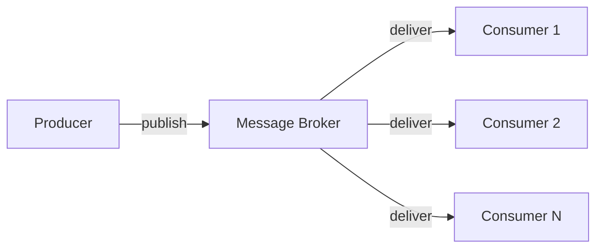
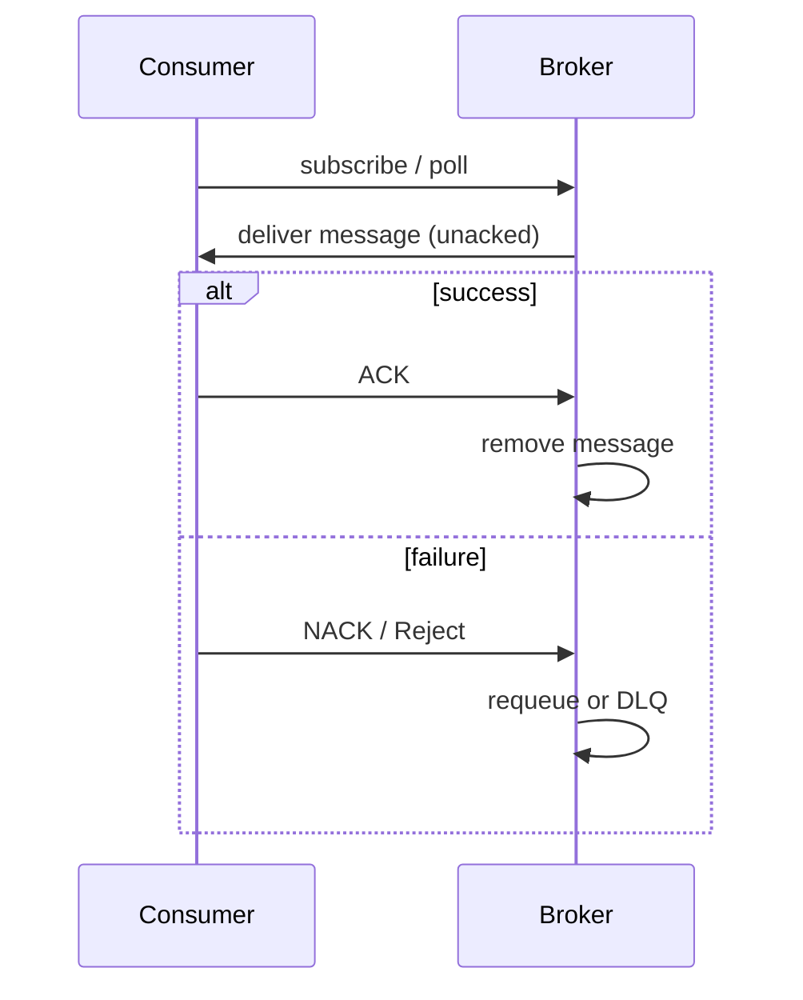

import ExternalPlayEmbed from '@site/src/components/ExternalPlayEmbed';


# Брокеры сообщений

<div class="article-tags">
  <span class="tag tag-required">ОБЯЗАТЕЛЬНО</span>
  <span class="tag tag-beginner">ДЛЯ НОВИЧКОВ</span>
</div>

<span class="complexity-badge">Всем</span>

---

## Зачем нужны очереди сообщений

**Очередь сообщений (Message Queue, MQ)** — способ связать части распределённой системы **асинхронно**: отправитель кладёт задачу в буфер и сразу продолжает работу, а обработчик забирает её, когда готов. Брокер сообщений — программа, которая хранит эти задачи, следит за порядком и доставкой.

Переход от синхронной [пакетной обработки](/encyclopedia/3-data-markup/3-11-analiz-dannyh/433) к очередям — эволюция от **монолитного batch-процессинга** к **распределённой асинхронной архитектуре**. Раньше один скрипт сам читал файл, трансформировал данные и писал результат; при сбое на 4-м часе из 5 приходилось перезапускать весь прогон. С MQ тяжёлая операция **нарезается на миллионы изолированных сообщений**, каждое обрабатывается независимо, а масштабирование — запуском дополнительных воркеров.

**Когда читать эту статью:** после [асинхронной коммуникации](/encyclopedia/2-system-network/2-09-osnovy-integratsionnogo-vzaimodeystviya/119) — здесь теория очередей и брокеров; дальше — [идемпотентность и семантика доставки](/encyclopedia/2-system-network/2-09-osnovy-integratsionnogo-vzaimodeystviya/133), [RabbitMQ](/encyclopedia/2-system-network/2-09-osnovy-integratsionnogo-vzaimodeystviya/122) и [Kafka](/encyclopedia/2-system-network/2-09-osnovy-integratsionnogo-vzaimodeystviya/123).

| Проблема синхронной связи | Как помогает MQ |
|---------------------------|-----------------|
| Потребитель недоступен | Сообщение ждёт в очереди |
| Пиковая нагрузка | Буфер сглаживает всплеск |
| Долгая операция блокирует API | Producer отвечает сразу, работа идёт в фоне |
| Один сбой останавливает весь batch | Изолированные задачи, retry, DLQ |

---

## Брокер как посредник

Брокер сообщений — почтальон между программами.

<ExternalPlayEmbed example="system-network/message-broker-overview-play" title="Обзор брокеров сообщений" minHeight={480} />

Одна программа отдаёт ему письмо (сообщение), брокер хранит его, а потом отдаёт другой программе, когда она будет готова.

Представим себе почтовое отделение:

- мы приходим на почту, отдаём письмо (мы — **producer**);
- почта (брокер) кладёт его в ячейку;
- наш друг (**consumer**) заходит на почту, когда у него есть время, и забирает письмо.

Упрощённо:

```python
# Программа А (producer)
broker.send("order_queue", {"order_id": 123, "amount": 5000})

# Программа Б (consumer)
message = broker.receive("order_queue")
process_order(message)
```

---

<span id="producer-broker-consumer"></span>

## Архитектурная модель Producer — Broker — Consumer

Вместо одного скрипта, который сам читает, трансформирует и пишет, система делится на **три независимых компонента**:

```text
[ Producer ] ──(создаёт задачи)──> [ Message Broker ] ──(распределяет)──> [ Consumers / Workers ]
(инициатор)                          (очередь)                              (группа обработчиков)
```



**Producer (продюсер, издатель)** — инициатор процесса. Его задача — быстро нарезать тяжёлую операцию на множество мелких изолированных сообщений и «вытолкнуть» их в брокер. Producer тратит на это миллисекунды и свободен: HTTP-ответ пользователю уже отправлен, а обработка идёт в фоне.

**Message Broker (брокер сообщений)** — умное хранилище (RabbitMQ, Apache Kafka, Apache Pulsar, Amazon SQS). Принимает сообщения, **гарантирует сохранность** на диске или в памяти и следит за очередностью и маршрутизацией.

**Consumer / Worker (потребитель, воркер)** — изолированный процесс-обработчик. Берёт из брокера **ровно столько сообщений, сколько может переварить** (prefetch, batch size), обрабатывает и отправляет отчёт о выполнении (ACK). Несколько воркеров на одной очереди работают как **конкурирующие потребители** — каждое сообщение достаётся только одному из них.

Связь с [интеграционными потоками](/encyclopedia/2-system-network/2-09-osnovy-integratsionnogo-vzaimodeystviya/112): outbox, saga и event-driven строятся поверх той же модели «событие → брокер → обработчик».

---

<span id="what-is-queue"></span>

## Что такое очередь

**Очередь** — структура данных **FIFO** (*First-In, First-Out*): первым вошёл — первым вышел. В жизни это очередь в кассу; в коде — операции **enqueue** (добавить в хвост) и **dequeue** (извлечь из головы).

Голова → `[A] → [B] → [C]` ← хвост. После `dequeue()` первым уйдёт `A`, затем `B`, затем `C`.

<ExternalPlayEmbed example="system-network/data-structure-queue" title="Очередь (структура данных)" playProps={{ defaultLang: 'js' }} />

Брокер сообщений использует ту же идею, но на уровне **распределённой системы**: сообщения — это элементы очереди, а enqueue/dequeue выполняют producer и consumer через сеть. Полная теория структуры (связный список, кольцевой буфер, сложность операций) — в разделе [Структуры данных — очередь](/encyclopedia/3-data-markup/3-02-struktury-dannyh/1#очередь).

<div class="callout callout--tip">
  <div class="callout-title">Очередь в памяти vs очередь в брокере</div>

  <div class="callout-body">
  <code>ArrayDeque</code> или <code>collections.deque</code> живут в одном процессе. Message Queue переживает рестарт сервиса, масштабируется на несколько машин и задаёт <strong>гарантии доставки</strong> — это уже инфраструктурный слой, а не локальная коллекция.
  </div>
</div>

---

<span id="batch-and-queues"></span>

## Пакетная обработка и очереди

[Пакетная обработка (batch)](/encyclopedia/3-data-markup/3-11-analiz-dannyh/433) и очереди сообщений решают схожую задачу — **отложить тяжёлую работу от интерактивного пути** — но разными способами.

| Аспект | Batch-job на одном сервере | Очередь + воркеры |
|--------|---------------------------|-------------------|
| Масштаб | Вертикальный + [чанки](/encyclopedia/3-data-markup/3-11-analiz-dannyh/433#terminology) | Горизонтальный (N consumers) |
| Сбой | Checkpoint в job | Offset в Kafka, ACK в RabbitMQ |
| Порядок | Проще в одном процессе | Партиции Kafka, один consumer на очередь |
| Типичный сценарий | Ночной ETL, расчёт зарплаты | Рендер видео, импорт 10 000 файлов, email-рассылка |

**Как это стыкуется на практике:**

1. **Producer нарезает batch на сообщения** — вместо «обработать 1 000 000 строк в одном процессе» каждая строка (или [chunk](/encyclopedia/3-data-markup/3-11-analiz-dannyh/433#terminology) из 1000 строк) становится отдельным сообщением.
2. **Воркеры забирают с ограниченным prefetch** — не перегружают память, обрабатывают со стабильной скоростью ([backpressure](/encyclopedia/3-data-markup/3-11-analiz-dannyh/433#backpressure)).
3. **Checkpoint смещается на уровень сообщения** — упал один воркер, остальные продолжают; при at-least-once задача может повториться → нужна [идемпотентность](/encyclopedia/2-system-network/2-09-osnovy-integratsionnogo-vzaimodeystviya/133).

Пакетная загрузка в интеграциях (batch-окно, расхождение с продом) — [112#batch-etl-load](/encyclopedia/2-system-network/2-09-osnovy-integratsionnogo-vzaimodeystviya/112#batch-etl-load). Оркестрация нескольких шагов batch-конвейера — [ETL и оркестрация](/encyclopedia/3-data-markup/3-11-analiz-dannyh/425).

---

<span id="mq-concepts"></span>

## Главные теоретические концепции MQ

При проектировании пакетной обработки через очереди важно понимать три фундаментальных параметра брокеров.

### Топология доставки Queue vs Pub/Sub

| Модель | Поведение | Когда использовать |
|--------|-----------|-------------------|
| **Очередь (Point-to-Point)** | Одно сообщение обрабатывает **строго один** воркер. Если воркер A взял задачу №1, воркер B её уже не увидит | Пакетная обработка, фоновые job: конкурирующие consumers делят работу |
| **Pub/Sub (издатель / подписчик)** | Одно сообщение **копируется** и доставляется всем подписанным системам | Событие «заказ оплачен» → бухгалтерия, склад и доставка получают по копии |

В RabbitMQ point-to-point — это очередь с несколькими consumers; pub/sub — **fanout** или **topic exchange**. В Kafka pub/sub — подписка consumer group на топик; point-to-point достигают одной группой с несколькими members.

### Гарантии доставки (Delivery Guarantees)

В распределённых системах из-за сетевых сбоев невозможно получить идеальную доставку без накладных расходов. Существует три режима:

| Режим | Смысл | Плюсы | Минусы |
|-------|-------|-------|--------|
| **At-most-once** | Сообщение отправляется, получение **не подтверждается** | Максимальная скорость | Воркер упал — задача **потеряна** |
| **At-least-once** | Брокер не удалит сообщение, пока воркер не пришлёт **ACK** | Стандарт для тяжёлых пакетов | Задача может выполниться **дважды** → нужна идемпотентность |
| **Exactly-once** | Задача выполнится **ровно один раз**, даже при падении сети | Нет дубликатов на уровне пайплайна | Сложно и дорого: транзакции брокер + БД, EOS в Kafka |

На практике устойчивые системы строят на **at-least-once + идемпотентный consumer**. Подробнее — [hub-статья по идемпотентности](/encyclopedia/2-system-network/2-09-osnovy-integratsionnogo-vzaimodeystviya/133).

### Подтверждение сообщений (ACK / NACK)

Когда воркер забирает задачу, брокер **не удаляет её сразу**, а помечает как «в процессе» (*unacknowledged*):

1. Обработка успешна → воркер шлёт **ACK** → брокер удаляет сообщение.
2. Ошибка → **NACK** или **Reject** → брокер возвращает задачу в очередь (**retry**) или перенаправляет в [DLQ](#dlq).



Prefetch (сколько unacked сообщений consumer держит одновременно) и timeout обработки — частые причины «зависших» сообщений; см. [FAQ по интеграциям](/encyclopedia/2-system-network/2-09-osnovy-integratsionnogo-vzaimodeystviya/998).

---

<span id="mq-benefits"></span>

## Как очереди решают проблемы тяжёлых операций

### Горизонтальное масштабирование

Если в очереди скопилось 5 000 000 тяжёлых задач, не нужно увеличивать мощность одного сервера. Запускают ещё 10 или 50 воркеров (Docker, [Kubernetes](/encyclopedia/8-infra-security/8-06-konteynerizatsiya-i-orkestratsiya/117)). Они подключаются к тому же брокеру и параллельно разбирают очередь — время обработки сокращается в разы.

### Сглаживание пиковых нагрузок

10 000 пользователей одновременно загрузили тяжёлые Excel-файлы — синхронный API может упасть от перегрузки CPU. С MQ producer закидывает 10 000 задач в очередь за секунду, а воркеры разбирают их со **стабильной скоростью** (например, 50 файлов в минуту). Система не падает — она временно становится асинхронной. Это тот же принцип, что [rate limiting](/encyclopedia/7-project/7-06-proektirovanie-i-arhitektura/141) на входе, но на стороне обработки.

### Изоляция сбоев и Dead Letter Queue \{#dlq\}

Одна «битая» задача из миллиона не должна останавливать весь пакет:

1. Воркер пытается обработать сообщение **N раз** (retry с backoff).
2. Все попытки неудачны → брокер переносит «токсичное» сообщение в **Dead Letter Queue (DLQ)** — изолированную очередь для ручного разбора.
3. Основной поток продолжает работать; разработчик позже смотрит DLQ и чинит данные или код.

Паттерн связан с [circuit breaker](/encyclopedia/7-project/7-06-proektirovanie-i-arhitektura/design/2136) и [инженерией устойчивости](/encyclopedia/7-project/7-06-proektirovanie-i-arhitektura/design/2136): изолировать сбой, не ронять весь контур.

---

## Что такое брокер сообщений

Вы наверняка сталкивались с термином «брокер» на бирже? Между системами нужна **асинхронная доставка** большого количества сообщений через посредника-агента.

**Брокер сообщений** — программное обеспечение или система, которая управляет обменом данными между приложениями. Основная задача: принять сообщение от producer, сохранить или маршрутизировать его и доставить consumer (иногда с преобразованием формата по правилам интеграции).

Producer отправляет сообщение и продолжает работу, не дожидаясь ответа. Брокер гарантирует доставку при сбоях (очереди, подтверждения, репликация) и распределяет нагрузку между несколькими consumers.

Среди брокеров различают **RabbitMQ** (модель очередей и AMQP), **Apache Kafka** (лог топиков и партиций), **ActiveMQ** (классический JMS-брокер), **IBM MQ**. **Redis** чаще — кэш, но для интеграций иногда используют **Pub/Sub** или **Streams** — это ближе к лёгкой очереди, чем к enterprise-шине с тем же набором гарантий, что у RabbitMQ или Kafka. Практика Redis — [Redis в интеграции и кэшировании](/encyclopedia/2-system-network/2-09-osnovy-integratsionnogo-vzaimodeystviya/129).

Единица обмена — **сообщение** (запись, event). В RabbitMQ / IBM MQ / ActiveMQ сообщения лежат в **очередях**; в Kafka пишут в **топик**, разбитый на **партиции** (топик — канал, а не одно сообщение).

---

<span id="rabbitmq-vs-kafka"></span>

## RabbitMQ и Kafka в контексте пакетов

Оба инструмента работают с сообщениями, но **внутренняя теория принципиально отличается**:

| Подход | RabbitMQ | Kafka |
|--------|----------|-------|
| Формула | **Smart Broker, Dumb Consumer** | **Dumb Broker, Smart Consumer** |
| Хранение | Сообщение удаляется после успешного ACK | Сообщения хранятся на диске днями — это **лог**, не transient-очередь |
| Кто помнит прогресс | Брокер (очередь опустошается) | Consumer хранит **offset** — где читает в партиции |
| Сильная сторона | Классические задачи: email, рендер, заказы | Пакетная аналитика, Big Data, стриминг миллионов событий/с |

**RabbitMQ** сам следит, кому какое сообщение дать, считает подтверждения и удаляет после ACK. Отлично подходит для «отрендерить видео», «отправить письмо», «обработать заказ».

**Kafka** — распределённый непрерывный лог записей. Чтение — последовательное сканирование диска; несколько consumer group могут читать один топик независимо. Идеальна для [потоковой аналитики](/encyclopedia/3-data-markup/3-11-analiz-dannyh/423) и event log.

### Сравнительная таблица

| Критерий | RabbitMQ | Kafka |
| :--- | :---: | ---: |
| Архитектура | Очереди (queues) | Топики (topics) с партициями (partitions) |
| Модель работы | Producer → Exchange → Queue → Consumer | Producer → Topic → Partition → Consumer |
| Упорядоченность | Порядок в пределах одной очереди | Порядок только внутри одной партиции |
| Состояние данных | До доставки или TTL | На диске заданное время (например, 7 дней) |
| Производительность | До десятков тысяч msg/s | До миллионов msg/s |
| Задержки | Низкие (прямая передача через очереди) | Выше (партиционирование, commit offset) |
| Ресурсы | Меньше для небольших нагрузок | Больше памяти и диска |
| Масштабируемость | Кластер сложнее настроить | Легко: брокеры + партиции |
| Гарантия доставки | At-least-once при ACK и durable-очередях | At-least-once; exactly-once при согласованной настройке |
| Маршрутизация | Сложные правила через exchanges | Топики и партиции |
| Сценарии | Фоновые задачи, микросервисы, уведомления | Логирование, мониторинг, IoT, аналитика |

Постановка «отправить письмо» в очередь — только первый шаг; доставка, bounces и отписки — отдельный контур: [email-рассылка как распределённая система](/encyclopedia/7-project/7-06-proektirovanie-i-arhitektura/144).

---

## Как выбрать технологию под задачу

Выбор зависит от бизнес-сценария и требований к доставке:

- **RabbitMQ** — фоновые задачи, сложная маршрутизация через exchange, классические job-очереди;
- **Kafka** — потоковая аналитика, event log, долгое хранение событий, replay;
- **Redis** — быстрый слой для кэша, rate limit и лёгких очередей без жёстких гарантий.

В реальной архитектуре инструменты часто **работают вместе**: Kafka переносит события между доменами, RabbitMQ — короткие task-очереди, Redis ускоряет чтение. Сквозной пример — [практика 134](/encyclopedia/2-system-network/2-09-osnovy-integratsionnogo-vzaimodeystviya/134).

---

## См. также

- [Пакетная обработка — теоретический хаб](/encyclopedia/3-data-markup/3-11-analiz-dannyh/433) — batch, chunk, fan-out через очереди.
- [Идемпотентность и семантика доставки](/encyclopedia/2-system-network/2-09-osnovy-integratsionnogo-vzaimodeystviya/133) — at-least-once, effectively exactly-once, dedup.
- [Асинхронная коммуникация](/encyclopedia/2-system-network/2-09-osnovy-integratsionnogo-vzaimodeystviya/119) — зачем развязывать сервисы по времени.
- [12 концепций распределённой архитектуры](/encyclopedia/7-project/7-06-proektirovanie-i-arhitektura/141) — очереди, pub/sub, API Gateway в одной таблице.

Продолжение в разделе «Инфраструктура и безопасность» — [брокеры сообщений](/encyclopedia/8-infra-security/8-05-mikroservisy-i-integratsiya/117), [RabbitMQ](/encyclopedia/8-infra-security/8-05-mikroservisy-i-integratsiya/118) и [Kafka](/encyclopedia/8-infra-security/8-05-mikroservisy-i-integratsiya/119). Брокеры в [экосистеме MSA](/encyclopedia/7-project/7-06-proektirovanie-i-arhitektura/design/118#ekosistema-msa) — вместе с БД, контейнерами и мониторингом.
