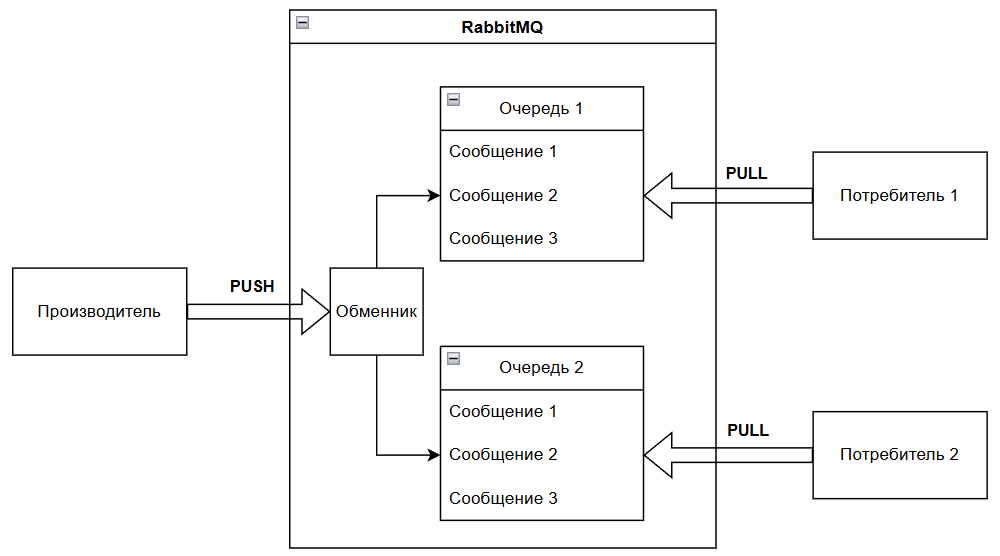

import RabbitMQSimulation from '@site/src/components/RabbitMQSimulation';

# RabbitMQ - работа с очередями сообщений

<div class="article-tags">
  <span class="tag tag-required">ОБЯЗАТЕЛЬНО</span>
  <span class="tag tag-beginner">ДЛЯ НОВИЧКОВ</span>
</div>

<span class="complexity-badge">Всем</span>

> **Справочник:** команды `rabbitmqctl`, типы exchange, свойства AMQP и политики — [Справочник по RabbitMQ](/encyclopedia/8-infra-security/8-05-mikroservisy-i-integratsiya/1204).

## RabbitMQ

### Что такое RabbitMQ?

RabbitMQ — это популярный брокер сообщений (Message Broker), который реализует протокол AMQP. Он используется для асинхронного обмена данными между приложениями через очереди. RabbitMQ обеспечивает надёжную доставку сообщений, масштабируемость и гибкость. Как почтовое отделение, точно доставляющее по адресам.

Официальный сайт - https://www.rabbitmq.com/

Сообщения хранятся в очередях до тех пор, пока не будут обработаны. Производитель отправляет сообщение в очередь, а потребитель забирает его позже. 


Порой сервисы нужно отделить друг от друга, обеспечить доставку сообщений между ними даже при падении системы, и при этом управлять нагрузкой и очередями задач. Для этого «кролик» использует простой принцип:
1. Производитель отправляет сообщение.
2. Обменник получает сообщение и решает, куда его направить.
3. Сообщение помещается в очередь.
4. Потребитель забирает сообщение из очереди.

Сообщение гарантированно не потеряется: оно остаётся в очереди, пока не будет подтверждено потребителем.

RabbitMQ использует модель «производитель-потребитель» с промежуточным хранилищем — очередью:
	- Producer (Производитель) отправляет сообщения в RabbitMQ, может быть любым приложением или системой;
	- Exchange (Обменник) принимает сообщения от производителя и определяет, в какую очередь поместить сообщение, исходя из правил маршрутизации;
	- Queue (Очередь) хранит сообщения до тех пор, пока они не будут обработаны потребителем.
	- Consumer (Потребитель) забирает сообщения из очереди и обрабатывает их согласно логике приложения.



Производителем может быть веб-сервер, сервис оплаты, IoT-устройство - это приложение, которое отправляет сообщения в RabbitMQ.

<RabbitMQSimulation />

---

### Основы RabbitMQ

**Сообщение** - это набор данных. Оно не попадает сразу в очередь, оно проходит через обменник, и именно он решает, в какую именно очередь поместить сообщение.

**Queue (Очередь)** представляет собой буфер, который хранит сообщения. Очереди очень надёжны, и сообщения можно сделать устойчивыми к перезагрузкам (durable), чтобы не потеряться при падении брокера.

**Binding (Привязка)** - правило, которое связывает обменник с очередью, указывая, какие сообщения нужно направлять в какую очередь. Может использовать routing key или шаблоны (в случае topic exchange).

**Routing Key (Ключ маршрутизации)** - это метка, которую производитель добавляет к сообщению. Обменник использует её, чтобы решить, куда направить сообщение.

**Брокером в RabbitMQ** называется сам сервер, который принимает, хранит и доставляет сообщения. Фактически, всю эту систему целиком можно называть RabbitMQ.

**Exchange (Обменник)** является точкой входа для сообщений от производителя. Обменник сам решает, куда отправить сообщение дальше, на основе правил привязки (binding), ключа маршрутизации (routing key) и типа обменника.

RabbitMQ поддерживает несколько типов обменников (exchanges), которые определяют правила маршрутизации сообщений:
	- **Direct** - сообщение отправляется в очередь, которая соответствует ключу маршрутизации;
	- **Fanout** - сообщение рассылается во все очереди, связанные с этим обменником;
	- **Topic** - сообщение отправляется в очереди, соответствующие шаблону ключа маршрутизации;
	
**Headers** - маршрутизация основана на заголовках сообщения, а не на ключе.

**Message Acknowledgment (ACK)** - механизм подтверждения: потребитель говорит «я обработал», и сообщение удаляется. Если не подтвердил — оно возвращается в очередь.

**Quorum Queues** - современный тип очереди, обеспечивающий высокую доступность и отказоустойчивость за счёт репликации и согласованности (как в распределённых системах).

**Streams** - новый режим работы RabbitMQ (начиная с версии 3.9), позволяющий работать с данными как с логами событий (похоже на Kafka). Подходит для потоковой передачи (streaming), когда нужно читать историю сообщений.


**Virtual Host** — это изолированное пространство внутри RabbitMQ, которое позволяет разделять ресурсы (очереди, обменники, пользователи) между различными проектами или командами. Каждый Virtual Host имеет свои собственные очереди, обменники и разрешения.

Создать Virtual Host можно через консоль или веб-интерфейс. RabbitMQ предоставляет встроенный веб-интерфейс для мониторинга и управления брокером. Этот интерфейс называется RabbitMQ Management, который представляет собой плагин rabbitmq_management.

RabbitMQ Management по умолчанию доступен по адресу http://localhost:15672 под учётными данными guest/guest (логин/пароль). Интерфейс позволяет просматривать статистику (количество сообщений, скорость обработки, использование памяти), состояние очередей, обменников и соединений, создавать и удалять очереди, обменники.

Имеются и расширения функциональности (плагины). Например:
	- rabbitmq_management — веб-интерфейс,
	- rabbitmq_shovel — пересылка сообщений между брокерами,
	- rabbitmq_federation — объединение нескольких RabbitMQ в сеть.
	
---

### Как настроить RabbitMQ?

#### Установка Erlang

Установка Erlang на сервер — это зависимость для RabbitMQ (он работает поверх Erlang). Пример:
```
sudo apt update
sudo apt install erlang

```

#### Установка RabbitMQ

Сначала нужно добавить официальный репозиторий RabbitMQ:

```
sudo apt-get install curl gnupg
curl -fsSL https://github.com/rabbitmq/signing-keys/releases/download/2.0/rabbitmq-release-signing-key.asc  | sudo gpg --dearmor > /usr/share/keyrings/rabbitmq-archive-keyring.gpg
echo "deb [signed-by=/usr/share/keyrings/rabbitmq-archive-keyring.gpg] https://dl.cloudsmith.io/public/rabbitmq/rabbitmq-server/deb/ubuntu  $(lsb_release -cs) main" | sudo tee /etc/apt/sources.list.d/rabbitmq.list
sudo apt update

```

А затем установить RabbitMQ:

```
sudo apt install rabbitmq-server
```

#### Запуск RabbitMQ

Для этого нужно запустить службу RabbitMQ:
```
sudo systemctl start rabbitmq-server
```

Желательно также включить автозапуск RabbitMQ при загрузке системы:
```
sudo systemctl enable rabbitmq-server
```

Чтобы убедиться в корректности запуска, можно проверить статус:
```
sudo systemctl status rabbitmq-server
```

#### Создание виртуального хоста

Создание виртуального хоста для изоляции проектов:
```
sudo rabbitmqctl add_vhost my_vhost
```

#### Настройка прав доступа

Настройка прав доступа к виртуальному хосту.

Создание пользователя:

```
sudo rabbitmqctl add_user my_user my_password
```

Назначение прав на виртуальный хост:
```
sudo rabbitmqctl set_permissions -p my_vhost my_user ".*" ".*" ".*"
```

#### Включение плагина управления

Активировать веб-интерфейс:
```
sudo rabbitmq-plugins enable rabbitmq_management
```

Веб-интерфейс будет доступен по адресу http://localhost:15672

#### Подключение к RabbitMQ.

В разных языках программирования используются соответствующие клиентские библиотеки. Нужно добавить к проекту программы библиотеку, а затем:
	- создать соединение с RabbitMQ, указав хост, порт и учётные данные;
	- создать канал (логическое соединение внутри физического соединения - все операции выполняются через канал);
	- создать обменник с указанием типа;
	- создать очередь с уникальным именем;
	- связать обменник с очередью, указав ключ маршрутизации.

##### C# - библиотека RabbitMQ.Client

Пример использования:
```
using RabbitMQ.Client;
using System.Text;

var factory = new ConnectionFactory() { HostName = "localhost" };
using (var connection = factory.CreateConnection())
using (var channel = connection.CreateModel())
{
    // Создание очереди
    channel.QueueDeclare(queue: "my_queue", durable: false, exclusive: false, autoDelete: false, arguments: null);
    // Отправка сообщения
    string message = "Hello, RabbitMQ!";
    var body = Encoding.UTF8.GetBytes(message);
    channel.BasicPublish(exchange: "", routingKey: "my_queue", basicProperties: null, body: body);
    Console.WriteLine("Message sent");
}

```

##### Java - библиотека amqp-client

Пример использования:

```

import com.rabbitmq.client.ConnectionFactory;
import com.rabbitmq.client.Connection;
import com.rabbitmq.client.Channel;

public class RabbitMQExample {
    public static void main(String[] args) throws Exception {
        ConnectionFactory factory = new ConnectionFactory();
        factory.setHost("localhost");
        try (Connection connection = factory.newConnection();
             Channel channel = connection.createChannel()) {
            // Создание очереди
            channel.queueDeclare("my_queue", false, false, false, null);
            // Отправка сообщения
            String message = "Hello, RabbitMQ!";
            channel.basicPublish("", "my_queue", null, message.getBytes());
            System.out.println("Message sent");
        }
    }
}

```

##### Python - библиотека pika

Пример использования:

```

import pika

# Подключение к RabbitMQ
connection = pika.BlockingConnection(pika.ConnectionParameters('localhost'))
channel = connection.channel()
# Создание очереди
channel.queue_declare(queue='my_queue')
# Отправка сообщения
channel.basic_publish(exchange='', routing_key='my_queue', body='Hello, RabbitMQ!')
print("Message sent")
connection.close()

```

##### JavaScript (Node.js) - библиотека amqplib

Пример использования:
```
const amqp = require('amqplib');
async function sendMessage() {
    const connection = await amqp.connect('amqp://localhost');
    const channel = await connection.createChannel();
    // Создание очереди
    const queue = 'my_queue';
    await channel.assertQueue(queue, { durable: false });
    // Отправка сообщения
    const message = 'Hello, RabbitMQ!';
    channel.sendToQueue(queue, Buffer.from(message));
    console.log("Message sent");
    setTimeout(() => {
        connection.close();
    }, 500);
}
sendMessage();

```

##### PHP - библиотека php-amqplib

Пример использования:

```
require_once __DIR__ . '/vendor/autoload.php';
use PhpAmqpLib\Connection\AMQPStreamConnection;
use PhpAmqpLib\Message\AMQPMessage;
$connection = new AMQPStreamConnection('localhost', 5672, 'guest', 'guest');
$channel = $connection->channel();
// Создание очереди
$channel->queue_declare('my_queue', false, false, false, false);
// Отправка сообщения
$msg = new AMQPMessage('Hello, RabbitMQ!');
$channel->basic_publish($msg, '', 'my_queue');
echo "Message sent\n";
$channel->close();
$connection->close();

```

#### Отправка и получение сообщений

Отправка сообщения (Producer) выполняется через обменник.

Получение сообщения (Consumer) выполняется из очереди. Нужно подписаться на очередь и получить сообщение.

#### Мониторинг

В веб-интерфейсе можно анализировать список очередей и статистику, а в разделе Exchanges можно увидеть обменники и их привязки.

#### Масштабирование

Для масштабирования можно настроить кластер RabbitMQ. Но важно убедиться, что все узлы кластера имеют одинаковую версию RabbitMQ и Erlang.

---

## Основные операции

### Создание и удаление очередей

Очереди могут быть объявлены (declare) как durable (устойчивые к перезапуску сервера), exclusive (доступны только одному соединению), auto-delete (удаляются после отключения последнего потребителя) или transient (временные).

### Публикация сообщений

Сообщение публикуется в exchange с указанием routing key. Exchange использует этот ключ для определения, в какие очереди направить сообщение.

### Подтверждение получения (Acknowledgements)

Потребитель может подтвердить получение сообщения (ack), что приводит к его удалению из очереди. Если подтверждение не получено (например, при аварийном завершении), сообщение возвращается в очередь или переходит в dead-letter queue.

### Отклонение и повторная очередь

Сообщение может быть отклонено (reject) или отложено (nack). В зависимости от настроек, оно либо удаляется, либо возвращается в очередь.

### Dead Letter Exchange (DLX)

Если сообщение не может быть доставлено или обработано, оно может быть перенаправлено в специальную очередь через DLX для анализа или повторной обработки.

---

## Конфигурация, настройка механизмов и обработка

### Установка и запуск

RabbitMQ обычно устанавливается через пакетные менеджеры (apt, yum, brew) или Docker. Требуется наличие Erlang/OTP, так как RabbitMQ написан на языке Erlang.

Пример запуска через Docker:

```bash
docker run -d --hostname my-rabbit --name rabbitmq -p 5672:5672 -p 15672:15672 rabbitmq:3-management
```

Порт `5672` — для клиентских соединений, `15672` — для веб-интерфейса управления.

### Конфигурационные файлы

Основные файлы:

- `rabbitmq.conf` — основные настройки (порты, логирование, политики).
- `advanced.config` — расширенные параметры на Erlang-термах.
- `enabled_plugins` — список активированных плагинов (например, `rabbitmq_management`).

### Плагины

Часто используемые плагины:

- `rabbitmq_management` — веб-интерфейс.
- `rabbitmq_shovel` — пересылка сообщений между кластерами.
- `rabbitmq_federation` — федерация очередей между узлами.
- `rabbitmq_delayed_message_exchange` — поддержка отложенных сообщений.

### Политики

Политики применяются к очередям и exchanges и управляют:

- зеркалированием (mirroring),
- TTL (временем жизни сообщений),
- максимальным размером очереди,
- dead-lettering.

Пример политики через CLI:

```bash
rabbitmqctl set_policy ha-all ".*" '{"ha-mode":"all"}'
```

---

## Подключение приложений (кода)

### На каких языках можно подключать

RabbitMQ поддерживает широкий спектр языков программирования благодаря официальным и сообщественным клиентским библиотекам. Основные языки:

- Python
- Java
- C#
- JavaScript / TypeScript (Node.js)
- Go
- Ruby
- PHP
- Rust
- Kotlin
- Scala

### Какие библиотеки используются

#### Python

Библиотека: `pika`

Установка:
```bash
pip install pika
```

Пример подключения:
```python

import pika

connection = pika.BlockingConnection(pika.ConnectionParameters('localhost'))
channel = connection.channel()
```

#### Java

Библиотека: `com.rabbitmq:amqp-client`

Maven:
```xml
<dependency>
    <groupId>com.rabbitmq</groupId>
    <artifactId>amqp-client</artifactId>
    <version>5.20.0</version>
</dependency>
```

Пример:
```java
ConnectionFactory factory = new ConnectionFactory();
factory.setHost("localhost");
Connection connection = factory.newConnection();
Channel channel = connection.createChannel();
```

#### C#

Библиотека: `RabbitMQ.Client`

NuGet:
```bash
Install-Package RabbitMQ.Client
```

Пример:
```csharp
var factory = new ConnectionFactory() { HostName = "localhost" };
using var connection = factory.CreateConnection();
using var channel = connection.CreateModel();
```

#### Node.js (JavaScript/TypeScript)

Библиотека: `amqplib`

Установка:
```bash
npm install amqplib
```

Пример:
```javascript
const amqp = require('amqplib');

const connection = await amqp.connect('amqp://localhost');
const channel = await connection.createChannel();
```

---

## Отправка сообщений — методы, свойства, возможности

### Методы отправки

Основной метод — `basic_publish` (или аналог в других языках). Он принимает:

- exchange,
- routing key,
- тело сообщения,
- свойства сообщения (headers, delivery mode, priority и др.).

### Свойства сообщения

Сообщение может содержать метаданные:

- `content_type` — MIME-тип (например, `application/json`).
- `delivery_mode` — 1 (non-persistent) или 2 (persistent).
- `priority` — приоритет (0–9).
- `correlation_id` — идентификатор для сопоставления запроса и ответа.
- `reply_to` — очередь для ответа.
- `expiration` — время жизни в миллисекундах.
- `headers` — произвольные пары ключ-значение.

### Возможности

- **Надёжная доставка**: использование persistent-сообщений и подтверждений (publisher confirms).
- **Маршрутизация**: выбор exchange типа direct, topic, fanout, headers.
- **Транзакции**: поддержка AMQP-транзакций (редко используется из-за накладных расходов).
- **Publisher Confirms**: механизм подтверждения получения сообщения брокером без использования транзакций.

Пример отправки в Python:
```python
channel.basic_publish(
    exchange='logs',
    routing_key='info',
    body='Hello World!',
    properties=pika.BasicProperties(
        delivery_mode=2,  # persistent
        content_type='text/plain'
    )
)
```

---

## Получение сообщений — методы, свойства, возможности

### Методы получения

Два основных подхода:

1. **Pull-модель** — явный запрос сообщения (`basic_get`). Редко используется в продакшене.
2. **Push-модель** — регистрация callback-функции через `basic_consume`. Это стандартный способ.

### Подтверждение обработки

После получения сообщения потребитель должен отправить `ack` (подтверждение). Если этого не сделать, сообщение останется в очереди и будет повторно доставлено при переподключении.

### Возможности

- **QoS (Quality of Service)** — ограничение количества неподтверждённых сообщений на одного потребителя (`basic_qos`).
- **Отказ от обработки** — `basic_nack` или `basic_reject` с возможностью возврата в очередь.
- **Dead-lettering** — автоматическое перенаправление недоставленных сообщений.
- **Параллельная обработка** — несколько потребителей могут читать из одной очереди (round-robin).

Пример потребителя на Java:
```java
DeliverCallback deliverCallback = (consumerTag, delivery) -> {
    String message = new String(delivery.getBody(), StandardCharsets.UTF_8);
    System.out.println("Received: " + message);
    channel.basicAck(delivery.getEnvelope().getDeliveryTag(), false);
};

channel.basicConsume("task_queue", false, deliverCallback, consumerTag -> {});
```

Пример на C#:
```csharp
var consumer = new EventingBasicConsumer(channel);
consumer.Received += (model, ea) =>
{
    var body = ea.Body.ToArray();
    var message = Encoding.UTF8.GetString(body);
    Console.WriteLine($"Received: {message}");
    channel.BasicAck(ea.DeliveryTag, multiple: false);
};
channel.BasicConsume(queue: "task_queue", autoAck: false, consumer: consumer);
```

Пример на Node.js:
```javascript
channel.consume('task_queue', (msg) => {
    if (msg !== null) {
        console.log('Received:', msg.content.toString());
        channel.ack(msg);
    }
}, { noAck: false });
```

---
