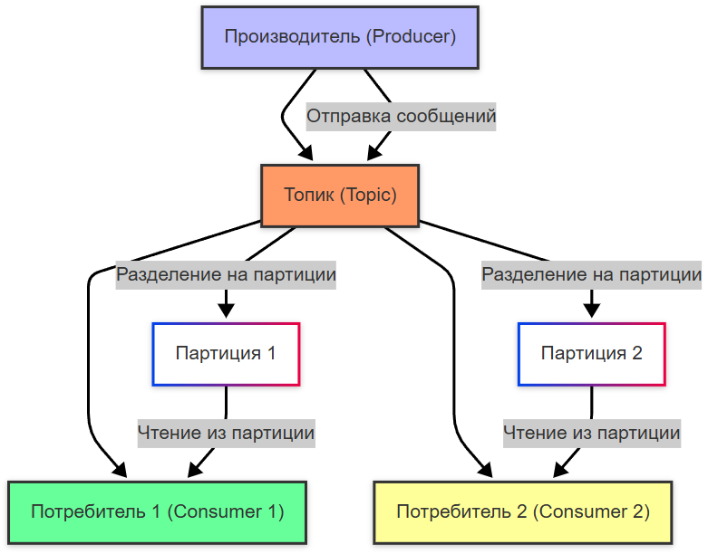

import KafkaSimulation from '@site/src/components/KafkaSimulation';

# Apache Kafka - потоковая обработка данных

<div class="article-tags">
  <span class="tag tag-required">ОБЯЗАТЕЛЬНО</span>
  <span class="tag tag-beginner">ДЛЯ НОВИЧКОВ</span>
</div>

<span class="complexity-badge">Всем</span>

## Kafka

### Что такое Kafka?

Apache Kafka — это распределённая потоковая платформа (streaming platform), которая предназначена для обработки больших объёмов данных в реальном времени. Kafka часто используется для построения систем, где требуется высокая производительность, масштабируемость и надёжность.

Официальный сайт - https://kafka.apache.org/

<KafkaSimulation />

Kafka работает в кластере, поддерживает обработку данных в реальном времени и может обрабатывать миллионы сообщений в секунду.



Это работает так:
1. Определяются продюсеры (отправляют данные) и консьюмеры (получают данные).
2. Создаётся кластер Kafka — группа серверов, называемых брокерами.
3. Для потока данных создаётся топик — это как лог событий, куда можно только добавлять записи.
4. Продюсеры отправляют сообщения в топик (режим PUSH).
5. Консьюмеры сами забирают данные из топика (режим PULL), когда готовы их обработать.
6. Каждый топик делится на партиции — это позволяет обрабатывать данные параллельно и масштабироваться.
7. Партиции распределяются между брокерами кластера для равномерной нагрузки.
8. Каждая партиция реплицируется на несколько брокеров — это обеспечивает отказоустойчивость.
9. В каждой репликации одна копия — лидер, она обрабатывает все запросы. Остальные — следят за синхронизацией. Если лидер падает, один из них автоматически становится новым лидером.

---

### Основы Kafka

Теперь давайте разберём чуть подробнее.

Когда имеется много сервисов, БД, монолитов и прочих источников данных, часто возникает ситуация, когда одни и те же данные нужны многим сервисам, но формат хранения разный. Kafka выступает в качестве масштабируемого и отказоустойчивого инструмента, который может пропускать большие объёмы данных (миллионы!), 

Как мы обозначили ранее, в Kafka сообщения называются топиками.

Топики, можно сказать, просто собирают данные, добавляя их снова и снова, не изменяясь и используются только для чтения. Продюсеры (отправители) отправляют данные в топики, а консюмеры (потребители) читают топики. К примеру, это сбор активности с различных систем, потоковая обработка большого количества событий, логирование.

Масштабируемость достигуется за счёт архитектуры кластера и системы партиций. Продюсеры группируются, отправляют сообщения в кластер кафки, а потребители «вытягивают» их. Это классическая модель PUSH (толкать, отправлять)/PULL (вытягивать).


Топики разделяются на партиции, которые распределяются между брокерами в кластере. Поэтому кластер Kafka можно считать группой брокеров, используемых для масштабируемости.

Для надёжности, кластеры используют технику репликации - партиции не просто раскидываются между брокерами, а используют репликацию. Это непростой механизм, который похож на копирование - представьте себе четыре папки и 10 файлов. Каждая папка - брокер, а файл - партиция. Для оптимизации нагрузки, вы закидываете файл №1 в папку №1, файл №2 в папку №2, файл №3 в папку №3, а все остальные файлы (4-10) в папку №4. Это простое перемещение, распределение. Но репликация подразумевает, что во всех четырёх папках будут все 10 файлов, как копии. Зачем это используется? Для распределения нагрузки, чтобы брокер №1 работал с сообщением №1, брокер №2 с сообщением №2, и т.д.

Таким образом, для каждой партиции мы получаем экземпляр реплики. Одна из реплик считается «оригиналом», и называется лидером. Все запросы на запись и чтение проходят через лидера - это гарантирует согласованность. А другие реплики, не являющиеся лидерами, не обслуживают запросы клиентов, а только копируют сообщения от лидера, как бы «синхронизируясь». Если реплика считается синхронизированной, то она может быть избрана в качестве лидера раздела. Смена лидера происходит тогда, когда существующий лидер вышел из строя.

Администратор может настроить максимальные размеры сообщений (к примеру, 1 МБ), а также время хранения данных и уровень репликации.

### Компоненты

Основные компоненты Kafka:
1. **Брокер (Broker)** — это узел (сервер) в Kafka-кластере, который отвечает за хранение и управление данными. Каждый брокер хранит часть данных (топиков) и обрабатывает запросы от продюсеров и консьюмеров. В кластере может быть несколько брокеров для обеспечения отказоустойчивости и масштабируемости.
2. **Кластер (Cluster)** — это группа брокеров, которые работают вместе для обработки данных. Kafka использует ZooKeeper (или Raft в новых версиях) для координации работы брокеров в кластере.
3. **Координатор (Coordinator)** — это специальный брокер, который отвечает за управление группами консьюмеров. Он отслеживает, какие консьюмеры читают данные из каких партиций, и управляет оффсетами.
4. **Топик (Topic)** — это логический канал, через который передаются сообщения. Каждый топик разделяется на партиции (partitions) для параллельной обработки данных. 
5. **Партиция (Partition)** — это упорядоченный лог данных внутри топика. Каждая партиция хранится на одном брокере, но может реплицироваться на другие брокеры для отказоустойчивости. Сообщения в партиции имеют строгий порядок, что позволяет гарантировать последовательность обработки.
6. **Оффсет (Offset)** — это уникальный идентификатор сообщения в партиции. Консьюмеры используют оффсеты для отслеживания своего прогресса при чтении данных. Оффсеты сохраняются либо на стороне консьюмера, либо в Kafka.
7. **Продюсер (Producer)** — это приложение или сервис, которое отправляет сообщения в Kafka. Продюсер выбирает топик и партицию для отправки сообщений.
8. **Консьюмер (Consumer)** — это приложение или сервис, которое читает сообщения из Kafka. Консьюмеры организованы в группы (consumer groups), чтобы распределить нагрузку между несколькими экземплярами.

Kafka использует модель «продюсер-брокер-консьюмер» для обработки данных. 

Вот как это работает:
	- продюсер отправляет сообщения, пишет их в определённый топик;
	- сообщения автоматически распределяются по партициям топика;
	- каждый брокер хранит данные в партициях - данные сохраняются в течение заданного времени (например, неделя);
	- консьюмер подключается к топику и начинает читать сообщения;
	- каждый консьюмер в группе получает данные из одной или нескольких партиций;
	- координатор следит за тем, какие консьюмеры читают данные и из каких партиций, если консьюмер выходит из строя, его партиции переназначаются другим консьюмерам.
	
---

### Как настроить Kafka?

#### Установка Java

Kafka работает поверх Java, поэтому сначала нужно установить Java Разработка Kit (JDK).


#### Установка ZooKeeper

ZooKeeper — это координатор, который управляет кластером Kafka. В новых версиях Kafka (например, 3.x) ZooKeeper заменяется на Raft, но для старых версий он всё ещё обязателен.

1. Скачайте и распакуйте ZooKeeper;
2. Настройте конфигурацию. Создайте файл zoo.cfg в папке conf.
3. Запустите ZooKeeper

#### Установка Kafka

1. Скачайте и распакуйте Kafka.
2. Настройте конфигурацию. Файл конфигурации находится в config/server.properties. Основные параметры:

```
broker.id=1
listeners=PLAINTEXT://localhost:9092
log.dirs=/tmp/kafka-logs
num.partitions=3

```

3. Запустите Kafka:
```
bin/kafka-server-start.sh config/server.properties
```

4. Чтобы Kafka запускался автоматически при загрузке системы, добавьте скрипт в автозагрузку или используйте systemd.

#### Создание топика

Топик — это логический канал для передачи сообщений.

Создайте топик:

```
bin/kafka-topics.sh --create --topic my_topic --bootstrap-server localhost:9092 --partitions 3 --replication-factor 1
```

Проверьте список топиков:
```
bin/kafka-topics.sh --list --bootstrap-server localhost:9092
```

#### Отправка и получение сообщений

Пример отправки сообщения:

```
bin/kafka-console-producer.sh --topic my_topic --bootstrap-server localhost:9092
```

Пример получения сообщения:
```
bin/kafka-console-consumer.sh --topic my_topic --from-beginning --bootstrap-server localhost:9092
```

#### Подключение Kafka к программам

В разных языках программирования испольхуются соответствующие библиотеки.

##### Java - библиотека org.apache.kafka:kafka-clients

Пример использования:

```
import org.apache.kafka.clients.producer.*;
import java.util.Properties;

public class KafkaExample {
    public static void main(String[] args) {
        Properties props = new Properties();
        props.put("bootstrap.servers", "localhost:9092");
        props.put("key.serializer", "org.apache.kafka.common.serialization.StringSerializer");
        props.put("value.serializer", "org.apache.kafka.common.serialization.StringSerializer");
        Producer<String, String> producer = new KafkaProducer<>(props);
        producer.send(new ProducerRecord<>("my_topic", "key", "Hello, Kafka!"));
        producer.close();
    }
}

```

##### Python- библиотека kafka-python

Пример использования:

```
from kafka import KafkaProducer

producer = KafkaProducer(bootstrap_servers='localhost:9092')
producer.send('my_topic', value=b'Hello, Kafka!')
producer.flush()

```

##### JavaScript (Node.js)- библиотека kafkajs

Пример использования:

```
const { Kafka } = require('kafkajs');
const kafka = new Kafka({ brokers: ['localhost:9092'] });
const producer = kafka.producer();
await producer.connect();
await producer.send({
    topic: 'my_topic',
    messages: [{ value: 'Hello, Kafka!' }],
});
await producer.disconnect();

```

##### PHP - библиотека php-rdkafka

Пример использования:

```
<?php
$rk = new RdKafka\Producer();
$rk->addBrokers("localhost:9092");

$topic = $rk->newTopic("my_topic");
$topic->produce(RD_KAFKA_PARTITION_UA, 0, "Hello, Kafka!");
$rk->poll(0);
?>

```

#### Мониторинг

Мониторинг предоставляет инструмент для управления кластерами - Kafka Manager. 

Пример установки:

```
docker run -it --rm -p 9000:9000 -e ZK_HOSTS="localhost:2181" sheepkiller/kafka-manager
```

Для визуализации можно использовать Grafana, а Prometheus для сбора метрик.

---

## Основные операции

### Создание и удаление топиков

Топики создаются с указанием количества партиций и фактора репликации. Удаление возможно, если включена соответствующая настройка (`delete.topic.enable=true`).

Команда через CLI:
```bash
kafka-topics.sh --create --topic events --partitions 6 --replication-factor 2 --bootstrap-server localhost:9092
```

### Публикация и чтение записей

Производители отправляют записи в топик, указывая (опционально) ключ, значение и заголовки. Потребители подписываются на топик и получают записи партиями.

### Управление смещениями (offsets)

Потребители могут фиксировать своё текущее смещение вручную или автоматически. Это позволяет возобновлять чтение с любого места — с начала, с конца или с конкретного offset.

### Репликация и отказоустойчивость

Каждая партиция имеет одну **лидирующую** (leader) и несколько **следящих** (follower) реплик. При сбое лидера одна из реплик становится новым лидером.

### Компакция (log compaction)

Для топиков с ключами можно включить режим компакции, при котором Kafka сохраняет только последнюю запись по каждому ключу. Это полезно для хранения текущего состояния (например, профилей пользователей).

---

## Конфигурация, настройка механизмов и обработка

### Установка и запуск

Kafka требует Java (обычно OpenJDK 8–17). Запуск возможен вручную, через Docker или в управляемых сервисах (Confluent Cloud, AWS MSK, Azure Event Hubs).

Пример запуска через Docker Compose:
```yaml
version: '3'
services:
  kafka:
    image: confluentinc/cp-kafka:latest
    ports:
      - "9092:9092"
    environment:
      KAFKA_BROKER_ID: 1
      KAFKA_ZOOKEEPER_CONNECT: zookeeper:2181
      KAFKA_ADVERTISED_LISTENERS: PLAINTEXT://localhost:9092
      KAFKA_OFFSETS_TOPIC_REPLICATION_FACTOR: 1
  zookeeper:
    image: confluentinc/cp-zookeeper:latest
    ports:
      - "2181:2181"
    environment:
      ZOOKEEPER_CLIENT_PORT: 2181
```

### Конфигурационные файлы

Основные файлы:
- `server.properties` — настройки брокера.
- `producer.properties` — параметры производителя.
- `consumer.properties` — параметры потребителя.

Часто используемые параметры:
- `num.partitions` — число партиций по умолчанию.
- `log.retention.hours` — время хранения данных.
- `auto.create.topics.enable` — автоматическое создание топиков.
- `group.id` — идентификатор consumer group.

### Механизмы обработки

- **Exactly-once semantics** — гарантия однократной обработки через транзакции и idempotent producers.
- **Stream processing** — с помощью Kafka Streams или ksqlDB можно строить сложные потоковые трансформации.
- **Connect** — фреймворк для интеграции с внешними системами (БД, S3, Elasticsearch и др.).

---

## Подключение приложений (кода)

### На каких языках можно подключать

Kafka поддерживает множество языков благодаря протоколу поверх TCP и широкому экосистемному покрытию. Основные языки:
- Java
- Python
- C#
- Go
- JavaScript / TypeScript (Node.js)
- Rust
- PHP
- Ruby
- Scala (нативный язык Kafka)

### Какие библиотеки используются

#### Java

Официальный клиент от Apache:
```xml
<dependency>
    <groupId>org.apache.kafka</groupId>
    <artifactId>kafka-clients</artifactId>
    <version>3.7.0</version>
</dependency>
```

#### Python

Библиотека: `confluent-kafka` (на основе librdkafka) или `kafka-python`.

Установка:
```bash
pip install confluent-kafka
```

#### C#

Библиотека: `Confluent.Kafka`

NuGet:
```bash
Install-Package Confluent.Kafka
```

#### Node.js

Библиотека: `kafkajs`

Установка:
```bash
npm install kafkajs
```

#### Go

Библиотека: `github.com/segmentio/kafka-go` или `github.com/confluentinc/confluent-kafka-go/v2`

---

## Отправка сообщений — методы, свойства, возможности

### Методы отправки

Основной метод — `send()` (или аналог). Сообщение состоит из:

- **Key** — опциональный, используется для определения партиции.
- **Value** — основное содержимое (обычно сериализовано в JSON, Avro, Protobuf).
- **Headers** — дополнительные метаданные (произвольные пары ключ-значение).
- **Timestamp** — время создания (можно задать вручную).

### Свойства сообщения

- **Idempotency** — включается через `enable.idempotence=true`, предотвращает дублирование при повторных отправках.
- **Acks** — уровень подтверждения: `0` (без подтверждения), `1` (лидер принял), `all` (все реплики подтвердили).
- **Retries** — количество попыток повторной отправки при ошибках.
- **Compression** — поддержка сжатия (gzip, snappy, lz4, zstd).

### Возможности

- **Партиционирование по ключу** — все сообщения с одинаковым ключом попадают в одну партицию.
- **Транзакции** — для согласованной отправки в несколько топиков.
- **Сериализация** — гибкая поддержка форматов через интерфейсы `Serializer`/`Deserializer`.

Пример на Java:
```java
Properties props = new Properties();
props.put("bootstrap.servers", "localhost:9092");
props.put("key.serializer", "org.apache.kafka.common.serialization.StringSerializer");
props.put("value.serializer", "org.apache.kafka.common.serialization.StringSerializer");

Producer<String, String> producer = new KafkaProducer<>(props);
ProducerRecord<String, String> record = new ProducerRecord<>("events", "user123", "login");
producer.send(record);
producer.close();
```

Пример на Python:
```python
from confluent_kafka import Producer

p = Producer({'bootstrap.servers': 'localhost:9092'})
p.produce('events', key='user123', value='login')
p.flush()
```

---

## Получение сообщений — методы, свойства, возможности

### Методы получения

Потребитель подписывается на один или несколько топиков и вызывает `poll()` для получения пакета записей. Чтение происходит партиями, а не по одной записи.

### Свойства потребителя

- **group.id** — обязательный параметр, определяет группу.
- **auto.offset.reset** — поведение при отсутствии смещения: `earliest`, `latest`, `none`.
- **enable.auto.commit** — автоматическое подтверждение смещений.
- **max.poll.records** — максимальное число записей за один poll.
- **isolation.level** — `read_committed` для чтения только подтверждённых транзакционных записей.

### Возможности

- **Параллельное чтение** — каждый потребитель в группе читает свои партиции.
- **Ручное управление смещениями** — через `commitSync()` или `commitAsync()`.
- **Перебалансировка** — при добавлении/удалении потребителей Kafka перераспределяет партиции.
- **Seek** — возможность переместиться к любому offset вручную.

Пример на Java:
```java
Properties props = new Properties();
props.put("bootstrap.servers", "localhost:9092");
props.put("group.id", "my-group");
props.put("key.deserializer", "org.apache.kafka.common.serialization.StringDeserializer");
props.put("value.deserializer", "org.apache.kafka.common.serialization.StringDeserializer");

KafkaConsumer<String, String> consumer = new KafkaConsumer<>(props);
consumer.subscribe(List.of("events"));

while (true) {
    ConsumerRecords<String, String> records = consumer.poll(Duration.ofMillis(100));
    for (ConsumerRecord<String, String> record : records) {
        System.out.printf("key=%s value=%s%n", record.key(), record.value());
    }
    consumer.commitSync();
}
```

Пример на C#:
```csharp
var config = new ConsumerConfig
{
    BootstrapServers = "localhost:9092",
    GroupId = "my-group",
    AutoOffsetReset = AutoOffsetReset.Earliest
};

using var consumer = new ConsumerBuilder<string, string>(config).Build();
consumer.Subscribe("events");

while (true)
{
    var result = consumer.Consume();
    Console.WriteLine($"Key: {result.Message.Key}, Value: {result.Message.Value}");
}
```

Пример на Node.js:
```javascript
const { Kafka } = require('kafkajs');

const kafka = new Kafka({ brokers: ['localhost:9092'] });
const consumer = kafka.consumer({ groupId: 'my-group' });

await consumer.connect();
await consumer.subscribe({ topic: 'events' });

await consumer.run({
  eachMessage: async ({ topic, partition, message }) => {
    console.log({
      key: message.key?.toString(),
      value: message.value?.toString(),
    });
  },
});
```

---