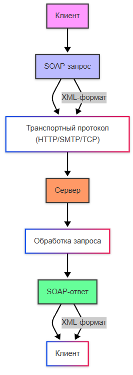
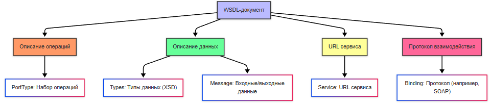

import SOAPTrainer from '@site/src/components/SOAPTrainer';

# Протокол SOAP

<div class="article-tags">
  <span class="tag tag-required">ОБЯЗАТЕЛЬНО</span>
  <span class="tag tag-beginner">ДЛЯ НОВИЧКОВ</span>
</div>

<span class="complexity-badge">Всем</span>

---

## SOAP

### Что такое SOAP?

**SOAP** (Simple Object Access Protocol) — это **протокол**, а не архитектурный стиль. Правила формата сообщений зафиксированы в спецификации: клиент и сервер обязаны соблюдать структуру XML-конверта, набор обязательных элементов и соглашения об ошибках.

SOAP появился в конце 1990-х и был стандартизирован консорциумом W3C. Изначально его позиционировали как универсальный способ **удалённого вызова операций** между приложениями разных платформ — в духе RPC, но через текстовые сообщения и повсеместный транспорт HTTP.

Сегодня для новых публичных API чаще выбирают REST с JSON, GraphQL или gRPC. SOAP остаётся востребованным там, где контракт зафиксирован годами, важна формальная схема данных и корпоративные расширения безопасности.

<SOAPTrainer />



SOAP не привязан к языку программирования и ОС, поддерживает сценарии с подписью сообщений, маршрутизацией и распределёнными транзакциями (семейство стандартов WS-*). Цена — объём XML и более тяжёлый цикл согласования изменений контракта.

---

### SOAP и REST — в чём разница

Оба подхода часто идут поверх **HTTP**, но модель вызова разная.

| Аспект | REST (типично) | SOAP (RPC-стиль) |
| :--- | :--- | :--- |
| Адресация | Много URL — отдельный путь на ресурс или сценарий | Часто **один URL** сервиса на все операции |
| Действие | HTTP-метод (GET, POST, PUT, DELETE) + путь | Имя **операции** внутри тела SOAP (Body) |
| Формат тела | Чаще JSON, реже XML | Всегда XML в конверте SOAP |
| Контракт | OpenAPI, описание в репозитории | **WSDL** + XSD как формальная схема |
| Ошибки | Код HTTP + тело ответа | Элемент **Fault** внутри SOAP |
| Изменения API | Новый путь или версия в URL | Новая операция или версия в WSDL |

**REST:** клиент обращается к конкретному ресурсу по URI, например `GET /accounts/42/balance` — смысл запроса виден из метода и пути.

**SOAP:** клиент шлёт POST на единую точку, например `/ws/QuotesService`, а в XML указывает операцию `GetTickerPrice` и параметры. Сервер по содержимому Body понимает, какую процедуру выполнить.

Оба варианта — веб-сервисы. Различие в том, **где зашито имя операции**: в URL и методе HTTP или внутри XML-конверта.

---

### Где SOAP используют сейчас

SOAP встречается не в каждом новом продукте, но регулярно в:

- **Legacy и долгоживущих ИС** — банки, страхование, телеком, госсектор, ERP;
- **B2B-интеграциях** — обмен по жёстко согласованному WSDL между контрагентами;
- **Платформах с WS-Security** — подпись, шифрование, единая политика в заголовках SOAP;
- **Системах, где клиент генерируют из WSDL** — меньше ручных ошибок в структуре XML.

Для мобильных приложений, публичных JSON API и микросервисов "с нуля" SOAP выбирают редко. Для сопровождения существующего контура и проектирования ТЗ на интеграцию знание SOAP по-прежнему полезно аналитику и архитектору.

---

### Стек протоколов

При работе через интернет обычно складывается такая цепочка:

```text
TCP/IP          — доставка пакетов по сети
    ↓
HTTP(S)         — транспорт: метод, заголовки, код ответа
    ↓
SOAP Envelope   — XML-конверт с Body (и опционально Header)
    ↓
WSDL + XSD      — контракт: какие операции, типы полей, адрес сервиса
```

HTTP здесь **не описывает бизнес-операцию** — он несёт байты. Смысл запроса (какая процедура, какие аргументы) живёт в XML внутри SOAP. WSDL говорит клиенту и серверу, какие теги и типы допустимы.

Типичный вызов — **HTTP POST** с заголовком `Content-Type: application/soap+xml` (или устаревший `text/xml`) и телом — XML-документ SOAP.

---

### Цепочка вызовов — витрина и внешний сервис

Частая схема в корпоративных системах — не прямой вызов внешнего SOAP из браузера, а посредник.

1. Пользователь открывает веб-страницу (браузер — HTTP-клиент).
2. **HTTP-сервер** витрины отдаёт страницу или JSON для фронта.
3. Сервер приложения сам выступает **SOAP-клиентом**: по HTTP POST отправляет SOAP-запрос на **внешний SOAP-сервер** (поставщик котировок, справочник, шина партнёра).
4. Внешний сервис возвращает SOAP-ответ; витрина преобразует данные и отдаёт пользователю удобный формат (HTML, JSON).

Пользователь не видит XML — он видит результат. SOAP остаётся протоколом **между серверами**. Это важно при описании интеграции в ТЗ: указать оба контура (публичный HTTP API витрины и внутренний SOAP к контрагенту).

---

### SOAP-сообщение

SOAP-сообщение — **один XML-документ** со строгой структурой:

| Часть | Обязательность | Назначение |
| :--- | :--- | :--- |
| **Envelope** | обязателен | Корень сообщения, границы конверта, пространства имён SOAP |
| **Header** | опционален | Метаданные: токен, маршрут, идентификатор транзакции |
| **Body** | обязателен | Вызов операции или данные ответа |
| **Fault** | при ошибке | Структурированное описание сбоя вместо успешного Body |


Пространство имён вроде `xmlns:soap="http://www.w3.org/2003/05/soap-envelope"` отделяет **служебные** теги протокола от **прикладных** тегов операции. Имена операций и параметров задаёт WSDL поставщика сервиса, не стандарт SOAP.

Пример запроса с аутентификацией в Header:

```xml
<soap:Envelope xmlns:soap="http://www.w3.org/2003/05/soap-envelope">
  <soap:Header>
    <auth:Authentication xmlns:auth="http://example.com/auth">
      <auth:Token>12345</auth:Token>
    </auth:Authentication>
  </soap:Header>
  <soap:Body>
    <getUserRequest xmlns="http://example.com/user">
      <userId>1</userId>
    </getUserRequest>
  </soap:Body>
</soap:Envelope>
```

Без корректного XML (закрытые теги, один корень, согласованные пространства имён) сообщение отклонят на разборе ещё до бизнес-логики.

---

### Пример операции — котировка по тикеру

Ниже — учебный RPC-вызов: одна операция, один строковый параметр, строковый результат. Имена пространств условные.

**Запрос** — в Body вложена операция `GetTickerPrice`, параметр `Ticker`:

```xml
<?xml version="1.0" encoding="UTF-8"?>
<soap:Envelope xmlns:soap="http://www.w3.org/2003/05/soap-envelope">
  <soap:Body>
    <q:GetTickerPrice xmlns:q="http://example.com/quotes">
      <q:Ticker>SBER</q:Ticker>
    </q:GetTickerPrice>
  </soap:Body>
</soap:Envelope>
```

**Ответ** — имя операции в прошедшем времени или с суффиксом `Response`, результат в дочернем элементе:

```xml
<?xml version="1.0" encoding="UTF-8"?>
<soap:Envelope xmlns:soap="http://www.w3.org/2003/05/soap-envelope">
  <soap:Body>
    <q:GetTickerPriceResponse xmlns:q="http://example.com/quotes">
      <q:Price>285.40</q:Price>
    </q:GetTickerPriceResponse>
  </soap:Body>
</soap:Envelope>
```

Для передачи "тикер → цена" в JSON хватило бы нескольких байт в теле. В SOAP те же данные оборачиваются в Envelope, пространства имён и имена операций — отсюда типичный **объём сообщения** и время парсинга.

---

### Порядок работы SOAP

Синхронный сценарий по шагам:

1. Клиент загружает **WSDL** (или получает его из артефакта сборки) и узнаёт список операций, типы параметров и URL endpoint.
2. Клиент формирует XML: `Envelope` → `Body` → элемент операции → параметры.
3. Сообщение отправляется транспортом (обычно **HTTP POST**).
4. Сервер валидирует XML, вызывает реализацию операции, формирует ответный `Envelope` или `Fault`.
5. Клиент разбирает ответ и извлекает поля из элементов, описанных в WSDL.

Генераторы кода (Java, C#, и др.) строят классы-обёртки по WSDL, чтобы не собирать XML вручную. В ТЗ аналитик описывает **операции, поля и типы**; разработчик сверяет это с WSDL и XSD.

---

### WSDL

**WSDL** (Web Services Description Language) — машиночитаемое описание сервиса: что можно вызвать, чем обмениваться и куда слать запрос.



| Элемент WSDL | Роль |
| :--- | :--- |
| **types** | Типы данных (часто через XSD) |
| **message** | Именованные наборы частей сообщения (вход/выход) |
| **portType** | Логический интерфейс: список операций |
| **binding** | Как операция привязана к SOAP и HTTP (стиль, кодировка) |
| **service** | Адрес endpoint, где слушает сервис |


Внутри **portType** каждая **operation** задаёт одну бизнес-функцию. У операции есть:

- **input** — структура запроса (ссылка на `message` или встроенное описание);
- **output** — структура успешного ответа;
- при необходимости **fault** — типы ошибок.

Пример логики для операции `GetTickerPrice`:

- input: одно поле `Ticker`, тип `string`;
- output: одно поле `Price`, тип `string` или `decimal`.

Клиент по WSDL знает точные имена элементов в Body. Поставщик сервиса публикует WSDL; потребитель интеграции **читает** его. Раздел **binding** в WSDL настраивает разработчик сервиса — в требованиях к интеграции аналитик указывает ссылку на актуальный WSDL и версию, а не составляет binding вручную.

Типичный жизненный цикл SOAP + WSDL:

1. Потребитель получает WSDL.
2. По WSDL генерируется или пишется клиентский код.
3. Вызывается операция с параметрами в XML.
4. Сервер выполняет логику и возвращает SOAP-ответ или Fault.
5. Клиент обрабатывает результат или ошибку по схеме.

---

### Объём сообщений и ограничения

Главный практический минус SOAP в интеграциях "в лоб" — **избыточность XML**. Короткий бизнес-ответ обрастает оболочкой протокола; на высокой частоте вызовов растут трафик и нагрузка на парсеры.

| Критерий | SOAP | REST + JSON (типично) |
| :--- | :--- | :--- |
| Размер тела на простой запрос | Больше | Меньше |
| Человекочитаемость без инструментов | Средняя (многословный XML) | Высокая |
| Формальный контракт | WSDL/XSD | OpenAPI, часто неполный |
| Кэширование HTTP | Ограничено (обычно POST) | GET удобен для кэша |
| Скорость внесения изменений | Версионирование WSDL, согласование | Новые поля/пути проще |

SOAP **консервативен**: изменение контракта затрагивает всех потребителей WSDL. Это плюс для стабильности в регулируемых отраслях и минус для быстрых итераций продукта.

---

### Асинхронное взаимодействие

Сам протокол SOAP чаще используют в **синхронном** режиме: клиент отправил POST и ждёт HTTP-ответ с SOAP в теле.

Долгая обработка на стороне сервера (минуты) не решается "магией" SOAP. Возможные подходы на уровне **дизайна сервиса**:

- отдельная операция "принять заявку" с немедленным ID, а статус и результат — другой операцией или callback;
- обмен через очередь сообщений с SOAP только на входе шины;
- парный стандарт WS-Addressing для ответа на другой endpoint.

Будет ли промежуточное подтверждение "запрос принят в работу", зависит от реализации поставщика, а не от базовой спецификации SOAP. Это нужно явно прописывать в требованиях к интеграции.

---

### Что запомнить

- SOAP — **протокол XML-сообщений**, не стиль REST.
- Часто один **endpoint**, операция задаётся в **Body**.
- Контракт — **WSDL** и XSD; ошибки — элемент **Fault**.
- Транспорт чаще всего **HTTP POST**; смысл запроса в XML, не в пути URL.
- Актуален для **legacy и формальных B2B**; для новых лёгких API обычно выбирают REST или gRPC.
- В ТЗ фиксируют **операции, параметры, типы, endpoint и версию WSDL**; binding и реализацию сервиса делает команда поставщика.

---

## См. также

Справочник в разделе «Инфраструктура и безопасность» — [Справочник по SOAP](/encyclopedia/8-infra-security/8-05-mikroservisy-i-integratsiya/1201).

---
---

<!-- http-basics-link -->
:::tip Основа по протоколу
Базовый разбор HTTP и HTTPS находится в отдельной статье — [HTTP как основа веб-интеграций](/encyclopedia/2-system-network/2-09-osnovy-integratsionnogo-vzaimodeystviya/118).
:::

