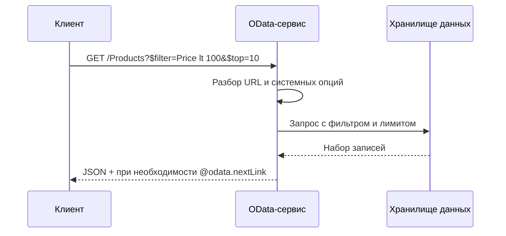

# OData — протокол открытых данных

<div class="article-tags">
  <span class="tag tag-required">ОБЯЗАТЕЛЬНО</span>
  <span class="tag tag-beginner">ДЛЯ НОВИЧКОВ</span>
</div>

<span class="complexity-badge">Всем</span>

---

## OData

### Что такое OData?

**OData** (Open Data Protocol, "протокол открытых данных") — это открытый стандарт для создания и использования **RESTful API**, ориентированных на работу со **структурированными данными** как с единой моделью сущностей. Клиент обращается к ресурсам по HTTP, а сервер может **на лету** отфильтровать, отсортировать, развернуть связи и вернуть только нужные поля — без того, чтобы для каждой комбинации параметров проектировать отдельный эндпоинт.

OData не заменяет HTTP и не конкурирует с JSON как форматом: он **надстраивается** над REST, добавляя согласованные правила адресации ресурсов, описания модели данных (метаданные) и **системных опций запроса** — `$filter`, `$select`, `$expand` и других.

Официальная документация и экосистема Microsoft: [OData на Microsoft Learn](https://learn.microsoft.com/ru-ru/odata/). Спецификация поддерживается консорциумом **OASIS**; актуальные версии протокола — **OData 4.0** и **4.01**.

Простая аналогия: обычный REST API — это меню с фиксированными блюдами ("список пользователей", "пользователь по id", "активные пользователи за месяц" — три разных URL). OData ближе к **SQL поверх HTTP**: один ресурс `Users`, а "нарезка" данных задаётся в строке запроса.

---

### OData - стандарт запросов к REST-данным

В середине 2000-х корпоративным системам нужен был способ отдавать данные множеству клиентов (веб, десктоп, отчёты, интеграции) **без взрыва числа методов API**. Microsoft предложила протокол в **2007** году; с **2012** года OData развивается как **открытый стандарт OASIS**, а не как закрытая технология одного вендора.

Идея: описать **модель данных** (сущности, свойства, связи, операции) один раз, опубликовать **сервисный корень** (service root) и позволить клиентам комбинировать стандартные опции запроса. Так снижается дублирование контрактов и упрощается интеграция между продуктами разных команд.

---

### Где OData используется

| Область | Примеры |
|--------|---------|
| **Корпоративные ERP/CRM** | Microsoft Dynamics 365, SAP (OData-сервисы), интеграции с учётными системами |
| **Платформа Microsoft** | SharePoint REST/OData, Azure API Management, отчётность Power BI к OData-источникам |
| **Разработка на .NET** | ASP.NET Core OData, `Microsoft.OData.Client`, Web API с пакетом `Microsoft.AspNetCore.OData` |
| **Отечественные продукты** | Публикация данных из **1С** через OData для витрин и внешних систем |
| **Универсальные клиенты** | Excel Power Query, Postman, браузерные REST-клиенты, генераторы кода по `$metadata` |

OData особенно уместен, когда потребителей много, набор полей и фильтров **непредсказуем**, а данные уже лежат в реляционной или объектной модели (таблицы, сущности EF, справочники конфигурации).

---

### Как устроен OData-сервис

#### Сервисный корень и наборы сущностей

OData-сервис публикуется с **корневого URL** (service root), например:

```
https://services.example.com/odata/v1/
```

По этому адресу клиент получает описание **наборов сущностей** (entity sets) — коллекций, с которыми можно работать, по смыслу близких к таблицам или ресурсам REST:

```
GET https://services.example.com/odata/v1/
```

Типичные пути к данным:

```
GET .../odata/v1/Products          — коллекция
GET .../odata/v1/Products(42)      — одна сущность по ключу
GET .../odata/v1/Categories(3)/Products — связанная коллекция
```

Идентификация сущности в URL может быть в скобках `Products(42)` или в сегменте пути — в зависимости от версии и настроек сервиса; смысл один: **стабильный адрес ресурса** в терминах модели, а не произвольное имя метода.

---

#### Метаданные модели (`$metadata`)

Ключевое отличие от "голого" REST — документ **метаданных** (Conceptual Schema Definition Language, CSDL), обычно доступный по:

```
GET .../odata/v1/$metadata
```

В нём описаны:

- типы сущностей и сложных типов;
- свойства, ключи, обязательность;
- **навигационные свойства** (связи "один-ко-многим", "многие-ко-многим");
- **действия** (actions) и **функции** (functions).

Клиенты и инструменты (Power Query, генераторы прокси) читают `$metadata` и **понимают модель без отдельного PDF-контракта**. Для человека это XML; для машины — основа типобезопасных клиентов.

---

#### HTTP и форматы представления

OData опирается на **HTTP**:

| Операция | HTTP | Пример смысла |
|----------|------|----------------|
| Чтение коллекции или сущности | `GET` | Список заказов, заказ по id |
| Создание | `POST` | Новая запись в наборе |
| Полная замена | `PUT` | Обновление всех полей |
| Частичное обновление | `PATCH` | Изменение отдельных полей |
| Удаление | `DELETE` | Удаление сущности |

Тело запросов и ответов чаще всего в **JSON** (`application/json`); в спецификации также предусмотрен **Atom/XML**. Заголовок `Accept` и опция `$format` уточняют представление.

Поток обработки запроса:



---

### Системные опции запроса (query options)

**Системные опции** — параметры строки запроса, которые управляют **объёмом, составом и порядком** возвращаемых данных. В OData 4.x имена опций **могут** начинаться с `$` (в 4.01 поддерживается и без префикса, регистронезависимо для совместимости).

| Опция | Назначение |
|-------|------------|
| `$filter` | Фильтрация коллекции (предикат по полям и связям) |
| `$select` | Выбор только указанных свойств |
| `$expand` | "Подгрузка" связанных сущностей в одном ответе |
| `$orderby` | Сортировка |
| `$top` / `$skip` | Постраничная выборка (лимит и смещение) |
| `$count` | Включить или запросить только количество элементов |
| `$search` | Полнотекстовый поиск (семантика зависит от реализации сервиса) |
| `$compute` | Вычисляемые поля в проекции (OData 4.01) |

Подробные правила и примеры: [Обзор опций запроса](https://learn.microsoft.com/ru-ru/odata/concepts/queryoptions-overview), [Использование опций](https://learn.microsoft.com/ru-ru/odata/concepts/queryoptions-usage).

---

#### `$filter` — фильтрация на сервере

Вместо эндпоинта `GET /users?status=active&minAge=18` клиент пишет единый ресурс и выражение:

```
GET .../People?$filter=FirstName eq 'Иван' and Age ge 18
```

Поддерживаются сравнения (`eq`, `ne`, `gt`, `ge`, …), логика (`and`, `or`, `not`), функции (`contains`, `startswith`, `year`, …), обход связей (`Department/Name eq 'IT'`). Сервер **обязан** интерпретировать фильтр по модели; необоснованные поля отклоняются или игнорируются согласно политике безопасности.

---

#### `$select` и `$expand` — экономия трафика

Только нужные поля:

```
GET .../Products?$select=Name,Price
```

Связанные сущности "в одном заходе":

```
GET .../Orders(1001)?$expand=Customer,Lines
```

Комбинация: развернуть заказчика, но у него взять только имя и город:

```
GET .../Orders?$expand=Customer($select=Name,City)
```

Это прямой аналог **JOIN + проекции** в SQL, но выраженный в URL — удобно для UI, которому на списке нужны разные "срезы" данных.

---

#### Пагинация

```
GET .../Products?$orderby=Name&$top=20&$skip=40
```

Сервис может вернуть **`@odata.nextLink`** — URL следующей страницы, чтобы клиент не собирал смещения вручную при больших объёмах.

---

#### `$count`

```
GET .../Products/$count
GET .../Products?$count=true&$filter=Price gt 1000
```

Позволяет получить число элементов без полной выгрузки коллекции.

---

### Действия и функции

Помимо CRUD над сущностями, OData описывает:

- **Functions** — операции **без побочных эффектов** (как чистые функции), вызываются через `GET`, могут участвовать в `$filter` / `$orderby`.
- **Actions** — операции **с побочными эффектами** (списание, утверждение документа, массовая операция), обычно через `POST`.

Пример вызова функции (схематично):

```
GET .../Products/Model.GetFeaturedProducts()
```

Action может принимать параметры в теле POST. Так протокол совмещает **ресурсную модель** и **бизнес-операции**, не ломая REST-транспорт.

---

### Версии протокола

| Версия | Заметки |
|--------|---------|
| **OData 2.0 / 3.0** | Широко в legacy (SharePoint, старые .NET-сервисы); опции вроде `$inlinecount` |
| **OData 4.0 / 4.01** | Текущая основа; улучшенная типизация, `$compute`, уточнённые правила URL |
| **OData 4.02** | Развитие стандарта OASIS; при внедрении сверяйтесь с [документом протокола](https://docs.oasis-open.org/odata/odata/v4.02/odata-v4.02-part1-protocol.pdf) |

При интеграции всегда уточняйте **версию сервиса** и набор поддерживаемых опций: сервер может не реализовать `$search` или `$expand` на глубину больше N.

---

### OData и "обычный" REST

| Критерий | REST (типичный) | OData |
|----------|-----------------|-------|
| Контракт | OpenAPI/Swagger, описание вручную | `$metadata` + соглашения протокола |
| Фильтрация | Отдельные query-параметры на каждый сценарий | Единый язык `$filter` |
| Связи | Несколько запросов или специальные DTO | `$expand` по навигационным свойствам |
| Сложность сервера | Ниже, полный контроль эндпоинтов | Выше: парсер запросов, безопасность, производительность |
| Кэширование | Проще для простых GET | Сложнее из-за комбинаций опций |
| Клиенты | Универсальны | Выигрывают типизированные OData-клиенты |

OData **не обязателен** для каждого API. Его выбирают, когда много **ад hoc** запросов к одной модели данных (отчёты, интеграции, админки). Для узкого мобильного API с фиксированными экранами чаще достаточно **простого REST** или **GraphQL**.

---

### Безопасность и эксплуатация

Свободный `$filter` и `$orderby` — это по сути **пользовательский запрос к данным**. Риски:

- **Производительность** — тяжёлые фильтры без индексов нагружают СУБД;
- **Утечка полей** — `$select` не должен обходить права на свойства;
- **Инъекции** — реализация должна параметризовать запросы к БД, а не склеивать SQL из строки URL.

На практике ограничивают глубину `$expand`, белый список полей в `$filter`, лимиты `$top`, аутентификацию (OAuth 2.0, API keys) и авторизацию на уровне строк. Подробнее про развёртывание и hardening: раздел [Security](https://learn.microsoft.com/ru-ru/odata/concepts/security) на Microsoft Learn.

---

### Пример на C# (клиент)

Для .NET существует клиентская библиотека, работающая с `IQueryable`-подобным API:

```csharp
var context = new Container(new Uri("https://services.example.com/odata/v1/"));
var query = context.Products
    .Where(p => p.Price < 100)
    .OrderBy(p => p.Name)
    .Take(10);

foreach (var product in query)
{
    Console.WriteLine($"{product.Name}: {product.Price}");
}
```

На сервере ASP.NET Core OData подключает те же опции к контроллерам или minimal API, транслируя `$filter` в **LINQ** и далее в SQL через EF Core.

Связанные материалы энциклопедии: [API](/encyclopedia/2-system-network/2-09-osnovy-integratsionnogo-vzaimodeystviya/117), [HTTP](/encyclopedia/2-system-network/2-09-osnovy-integratsionnogo-vzaimodeystviya/118), [Веб-сервисы](/encyclopedia/2-system-network/2-09-osnovy-integratsionnogo-vzaimodeystviya/115), [SOAP](/encyclopedia/2-system-network/2-09-osnovy-integratsionnogo-vzaimodeystviya/126), [1С: интеграция](/encyclopedia/5-languages/5-27-1s/120).

---

### Полезные ссылки

- [Документация OData (Microsoft Learn, RU)](https://learn.microsoft.com/ru-ru/odata/)
- [Что такое OData?](https://learn.microsoft.com/ru-ru/odata/concepts/what-is-odata)
- [Модель данных OData](https://learn.microsoft.com/ru-ru/odata/concepts/data-model)
- [Опции запроса — обзор](https://learn.microsoft.com/ru-ru/odata/concepts/queryoptions-overview)
- [OData на ASP.NET Core](https://learn.microsoft.com/ru-ru/odata/webapi/getting-started)
- [Спецификация OASIS OData 4.01](https://docs.oasis-open.org/odata/odata/v4.01/odata-v4.01-part1-protocol.html)

---
