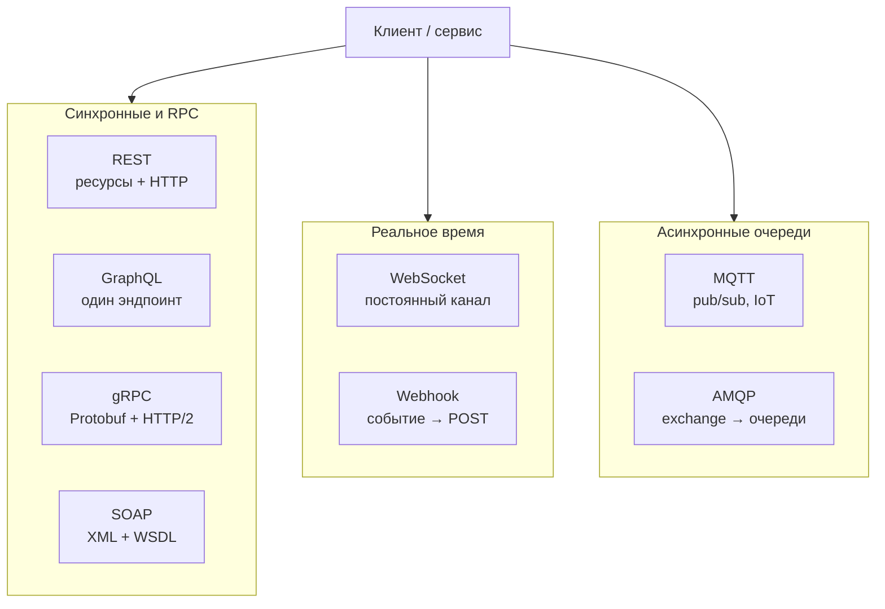
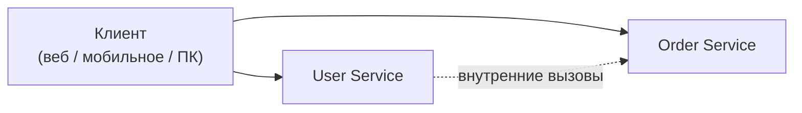
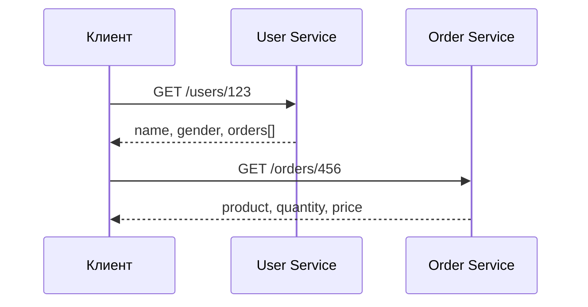
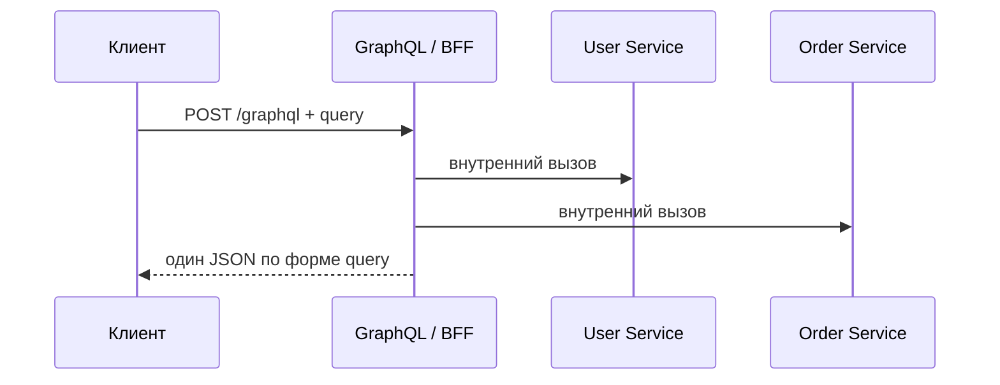

# REST, GraphQL и gRPC — стили API

<div class="article-tags">
  <span class="tag tag-required">ОБЯЗАТЕЛЬНО</span>
  <span class="tag tag-beginner">ДЛЯ НОВИЧКОВ</span>
</div>

<span class="complexity-badge">Всем</span>

> **Контекст:** [API](/encyclopedia/2-system-network/2-09-osnovy-integratsionnogo-vzaimodeystviya/117), [HTTP](/encyclopedia/2-system-network/2-09-osnovy-integratsionnogo-vzaimodeystviya/118). **Углубление в MSA:** [Синхронная коммуникация](/encyclopedia/8-infra-security/8-05-mikroservisy-i-integratsiya/115), [REST](/encyclopedia/8-infra-security/8-05-mikroservisy-i-integratsiya/1151). **Справочники:** [GraphQL](/encyclopedia/8-infra-security/8-05-mikroservisy-i-integratsiya/1203), [gRPC](/encyclopedia/8-infra-security/8-05-mikroservisy-i-integratsiya/1202).

---

<span id="eight-api-styles"></span>

## Восемь архитектурных стилей API — обзорная карта

Программы обмениваются данными по **разным правилам**: синхронно или асинхронно, текстом или бинарным форматом, «запрос–ответ» или через посредника. Ниже — восемь распространённых **архитектурных стилей** (и близких к ним протоколов), которые встречаются в веб-разработке, корпоративных интеграциях и IoT.

| Стиль | Суть | Модель обмена | Где применяют |
| :--- | :--- | :--- | :--- |
| **SOAP** | XML-конверты, жёсткий контракт (WSDL) | Запрос–ответ по HTTP или другому транспорту | Банки, ERP, legacy B2B, гос-системы |
| **REST** | Ресурсы по URL, операции через HTTP-методы | Клиент запрашивает ресурс — сервер отвечает | Публичные HTTP API, CRUD, мобильные и веб-клиенты |
| **GraphQL** | Язык запросов к API | Клиент описывает **нужные поля** — сервер собирает ответ | SPA, мобильные экраны со сложной вложенностью данных |
| **gRPC** | Высокопроизводительный RPC | Вызов удалённой процедуры как локальной функции | Микросервисы внутри периметра, HTTP/2 + Protobuf |
| **WebSocket** | Постоянный двунаправленный канал | Соединение после HTTP Upgrade; push в обе стороны | Чаты, игры, биржевые котировки, live-обновления |
| **Webhook** | HTTP-callback при событии | Сервер A **асинхронно** шлёт POST на URL сервера B | Платежи, CRM, CI/CD, уведомления партнёрам |
| **MQTT** | Лёгкий pub/sub для ограниченных устройств | Издатель → **брокер** → подписчики по темам | IoT, датчики, телеметрия, умный дом |
| **AMQP** | Надёжная очередь сообщений | Producer → **exchange** → очереди → consumers | RabbitMQ, корпоративная шина, фоновые задачи |



### Как читать карту

**Синхронный блок** — клиент ждёт ответ в том же сеансе. **REST** и **GraphQL** обычно идут поверх HTTP; **gRPC** — бинарный RPC для сервис ↔ сервис; **SOAP** — строгий XML-контракт, типичен в enterprise.

**Реальное время** — канал живёт дольше одного запроса. **WebSocket** держит постоянное соединение; **webhook** — «обратный» HTTP: инициатор события сам стучится на заранее зарегистрированный URL.

**Очереди** — отправитель кладёт сообщение в **брокер** и продолжает работу. **MQTT** минимален по трафику (IoT); **AMQP** даёт маршрутизацию через exchange и гарантии доставки (RabbitMQ).

<div class="callout callout--tip">
  <div class="callout-title">Куда копать дальше</div>

  **SOAP** — [протокол SOAP](./126.md). **WebSocket** — [сетевые протоколы, WebSocket](/encyclopedia/2-system-network/2-03-set-i-internet/4.md#websocket). **Webhook** — [Polling, SSE, Webhook](/encyclopedia/2-system-network/2-04-kak-rabotayut-sayty-i-veb-sayty/129), [проектирование OAuth и webhooks](/encyclopedia/7-project/7-06-proektirovanie-i-arhitektura/design/1171). **MQTT и AMQP** — [асинхронная коммуникация](./119.md), [брокеры сообщений](./121.md), [RabbitMQ](./122.md). Ниже в этой статье **REST, GraphQL и gRPC** разобраны на одном сценарии.
</div>

---

## Зачем три разных подхода

Веб-приложение, мобильный клиент или другой сервис часто должны получить данные из **нескольких** backend-сервисов. Один и тот же бизнес-сценарий можно реализовать по-разному:

| Стиль | Идея в одной фразе | Типичный потребитель |
| --- | --- | --- |
| **REST** | Ресурсы по URL, операции через HTTP-методы, тело чаще JSON | Публичные API, простой CRUD, интеграции партнёров |
| **GraphQL** | Один эндпоинт, клиент описывает **форму** ответа запросом | SPA, мобильные приложения со сложными экранами |
| **gRPC** | Вызов удалённой процедуры как локальной функции, контракт в `.proto` | Взаимодействие **микросервисов** внутри периметра |

Ни один стиль не «лучше во всём». В продакшене их **сочетают**: наружу — REST или GraphQL, между сервисами — gRPC, тяжёлую фоновую работу — [очереди](/encyclopedia/2-system-network/2-09-osnovy-integratsionnogo-vzaimodeystviya/121).

---

## Общий сценарий

Клиенту нужен профиль пользователя **и** детали его заказа. В системе два сервиса:

- **User Service** — имя, пол, ссылки на заказы;
- **Order Service** — товар, количество, цена.



Дальше — как меняется работа клиента при REST, GraphQL и gRPC.

---

## REST — ресурсы и несколько round-trip

**REST** (Representational State Transfer) — архитектурный **стиль** поверх [HTTP](/encyclopedia/2-system-network/2-09-osnovy-integratsionnogo-vzaimodeystviya/118): идентификаторы ресурсов в URL, семантика через `GET`, `POST`, `PUT`, `PATCH`, `DELETE`, представление в JSON или XML.

### Как выглядит цепочка запросов

1. Клиент вызывает `GET /users/123` у User Service.
2. Сервер возвращает, например:

```json
{
  "name": "Bob",
  "gender": "male",
  "orders": ["/orders/456"]
}
```

3. Чтобы получить детали заказа, клиент делает **второй** запрос: `GET /orders/456` у Order Service.
4. Ответ Order Service:

```json
{
  "product": "abc",
  "quantity": 2,
  "price": "100.00"
}
```



### Плюсы и ограничения

**Плюсы:** простая модель, кэширование `GET`, широкая поддержка инструментов (`curl`, Postman, OpenAPI; см. [утилита curl](/encyclopedia/2-system-network/2-05-terminal/1133), [curl / fetch — примеры](/lab/Примеры/1133)), понятен внешним интеграторам.

**Ограничения:**

- **Несколько round-trip** — клиент сам «склеивает» данные из разных ответов.
- **Over-fetching** — в ответе есть поля, которые экрану не нужны.
- **Under-fetching** — для полной картины не хватает одного ответа, нужны дополнительные вызовы.

REST отлично подходит для **простых CRUD API**, публичных контрактов и случаев, когда один ресурс = один запрос.

Подробнее — [REST в разделе 8](/encyclopedia/8-infra-security/8-05-mikroservisy-i-integratsiya/1151) и блок REST в [статье про API](./117.md).

---

## GraphQL — один запрос, форма ответа на клиенте

**GraphQL** — язык запросов и среда выполнения для API. Клиент обращается к **одному** эндпоинту (часто `POST /graphql`) и передаёт **query** — дерево полей, которое хочет получить.

### Как выглядит один запрос

Клиент отправляет, например:

```graphql
query {
  user(id: 123) {
    name
    gender
    orders {
      product
      quantity
      price
    }
  }
}
```

Сервер GraphQL (или **BFF** — backend for frontend) по **схеме** знает типы `User` и `Order`, сам обращается к User Service и Order Service и возвращает JSON **ровно той формы**, которую запросил клиент:

```json
{
  "data": {
    "user": {
      "name": "Bob",
      "gender": "male",
      "orders": [
        { "product": "abc", "quantity": 2, "price": "100.00" }
      ]
    }
  }
}
```



### Плюсы и ограничения

**Плюсы:** один round-trip для экрана; клиент не тянет лишние поля; схема документирует API и поддерживает introspection.

**Ограничения:** сложнее кэшировать на уровне HTTP; тяжёлые запросы без лимитов глубины/стоимости могут перегрузить backend; для публичных партнёрских API REST/OpenAPI всё ещё привычнее.

GraphQL уместен, когда у **фронтенда** много разных экранов и нужна гибкая выборка полей без взрыва числа REST-эндпоинтов.

Синтаксис и директивы — [Справочник по GraphQL](/encyclopedia/8-infra-security/8-05-mikroservisy-i-integratsiya/1203).

---

<span id="grpc-protobuf"></span>

## gRPC — RPC между сервисами по HTTP/2

**gRPC** (Google Remote Procedure Call) — фреймворк для **высокопроизводительных** RPC. Контракт задаётся в файле **Protocol Buffers** (`.proto`); из него генерируются **stubs** на клиенте и сервере. Передача идёт по **HTTP/2** в **бинарном** Protobuf, с мультиплексированием потоков на одном соединении.

### Как это ощущается разработчику

Сервис A вызывает сгенерированный stub — почти как локальную функцию:

```text
user = getUser(123)
```

Под капотом — HTTP/2, сериализация Protobuf, строгие типы из общего `user.proto`:

```protobuf
service UserService {
  rpc GetUser(UserRequest) returns (UserResponse);
}
```

Сервис B реализует обработчик `GetUser`. Клиенту-браузеру gRPC напрямую обычно **не отдают** — для веба чаще REST/GraphQL или gRPC-Web через прокси.

### Режимы обмена (streaming)

| Режим | Кто шлёт | Кто получает |
| --- | --- | --- |
| **Unary** | 1 запрос | 1 ответ |
| **Server streaming** | 1 запрос | поток ответов |
| **Client streaming** | поток запросов | 1 ответ |
| **Bidirectional** | поток | поток |

### Плюсы и ограничения

**Плюсы:** низкая задержка, компактные сообщения, жёсткий контракт и кодогенерация, стриминг «из коробки».

**Ограничения:** бинарный протокол сложнее отлаживать «глазами», чем JSON; для внешних потребителей без SDK менее удобен, чем REST.

gRPC — типичный выбор для **внутренних** вызовов микросервисов, когда важны скорость и согласованность типов.

Детали `.proto` и команд — [Справочник по gRPC](/encyclopedia/8-infra-security/8-05-mikroservisy-i-integratsiya/1202). Практический разбор в MSA — [Синхронная коммуникация](/encyclopedia/8-infra-security/8-05-mikroservisy-i-integratsiya/115#grpc-graphql).

---

## Сводная таблица

| Критерий | REST | GraphQL | gRPC |
| --- | --- | --- | --- |
| **Модель** | Ресурсы (URL) | Запрос по схеме | Вызов процедуры |
| **Формат данных** | Чаще JSON (текст) | JSON (текст) | Protobuf (бинарный) |
| **Транспорт** | HTTP/1.1–2 | Обычно HTTP POST | HTTP/2 |
| **Контракт** | OpenAPI, соглашения | GraphQL Schema | `.proto`, кодогенерация |
| **Round-trip для «user + orders»** | Несколько | Один (при BFF/шлюзе) | Один unary-вызов (если метод агрегирует) |
| **Гибкость полей** | Фиксированные DTO ресурса | Клиент выбирает поля | Фиксированные сообщения |
| **Типичная зона** | Публичный API, CRUD | UI, агрегация для клиента | Сервис ↔ сервис |

---

## Как выбирать на практике

| Задача | Разумный первый выбор |
| --- | --- |
| Партнёрский HTTP API, документация для всех | REST + OpenAPI |
| Мобильное/веб-приложение, много экранов и вложенных данных | GraphQL (часто через BFF) |
| Десятки тысяч RPS между сервисами в Kubernetes | gRPC |
| Долгая обработка, события, слабая связанность | [Очередь или Kafka](./121.md), не синхронный RPC |

В одной системе часто видят схему **«REST наружу, gRPC внутри»**: браузер бьёт в API Gateway по REST, gateway или BFF общается с микросервисами по gRPC. GraphQL ставят **перед** набором REST-микросервисов, чтобы клиент не делал N запросов сам.

<div class="callout callout--info">
  <div class="callout-title">Связь с HTTP-экосистемой</div>

  Версии HTTP, TLS, API Gateway и место gRPC на карте стека — в блоке [«Современная HTTP-экосистема»](./118.md#http-ecosystem). Порты и роли служб — [Сетевые сервисы по ролям](/encyclopedia/2-system-network/2-03-set-i-internet/618#setevye-servisy-po-rolyam).
</div>

---

## См. также

| Тема | Статья |
| --- | --- |
| Общие понятия API | [API](./117.md) |
| Проектирование контракта | [Проектирование API и интеграций](/encyclopedia/7-project/7-06-proektirovanie-i-arhitektura/design/117) |
| Практикум REST | [8.08 Практикум REST и WebSocket](/encyclopedia/8-infra-security/8-08-praktikum-rest-i-websocket/intro) |
| MCP и классический API | [MCP-серверы](/encyclopedia/6-ai/6-04-modeli-i-instrumenty/114#mcp-i-api) |

---
