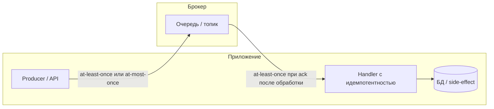
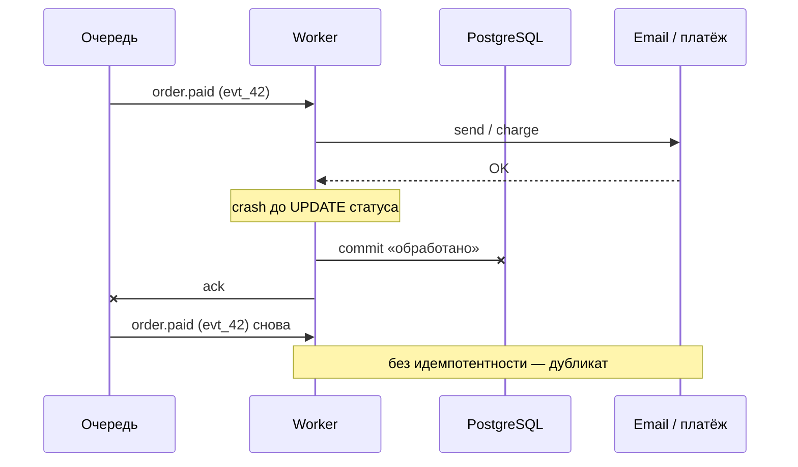

# Идемпотентность и семантика доставки

<div class="article-tags">
  <span class="tag tag-required">ОБЯЗАТЕЛЬНО</span>
  <span class="tag tag-beginner">ДЛЯ НОВИЧКОВ</span>
</div>

<span class="complexity-badge">Всем</span>

---

Инженеры часто формулируют требование как «доставку exactly-once». На практике устойчивые системы строят на **at-least-once** и компенсируют дубликаты **идемпотентной** бизнес-логикой. Эта статья связывает HTTP, очереди и Kafka в одну модель: где заканчиваются гарантии брокера и начинается ответственность приложения.

**Когда читать:** после [асинхронной коммуникации](/encyclopedia/2-system-network/2-09-osnovy-integratsionnogo-vzaimodeystviya/119) и [брокеров сообщений](/encyclopedia/2-system-network/2-09-osnovy-integratsionnogo-vzaimodeystviya/121), до углубления в [RabbitMQ](/encyclopedia/2-system-network/2-09-osnovy-integratsionnogo-vzaimodeystviya/122) и [Kafka](/encyclopedia/2-system-network/2-09-osnovy-integratsionnogo-vzaimodeystviya/123).

---

<span id="idempotentnost"></span>

## Идемпотентность

**Идемпотентность** — свойство операции: повторное выполнение с теми же входными данными даёт тот же результат, что и первый успешный вызов. Формально операция `f` идемпотентна, если `∀x: f(f(x)) = f(x)`.

В распределённых системах повторы неизбежны: таймаут сети, retry клиента, повторная доставка из очереди, рестарт воркера между side-effect и commit в БД. Идемпотентность — **гарантия на уровне приложения**: «второй раз обработать то же событие — безопасно».

| Контекст | Пример | Что считается «тем же результатом» |
|----------|--------|-------------------------------------|
| HTTP | `PUT /orders/123` с телом `{ "status": "paid" }` | Состояние заказа 123 — `paid`, без второго списания |
| HTTP | `POST /orders` без ключа | Каждый вызов может создать новый заказ — **не** идемпотентно |
| Очередь | Consumer получил `order.paid` с `eventId=evt_42` | Повторная обработка `evt_42` не меняет баланс и не шлёт второе письмо |
| Side-effect | Вызов платёжного шлюза | Повтор с тем же `idempotencyKey` возвращает тот же `paymentId` |

### Идемпотентность и дедупликация

**Дедупликация** — механизм «уже видели этот ключ — пропускаем». **Идемпотентность** — свойство операции «повтор безопасен». На практике дедуп-таблица или `Idempotency-Key` **реализуют** идемпотентность; без них handler может быть идемпотентным по задумке, но не по факту (например, `PUT`, который каждый раз вызывает charge).

<div class="callout callout--caution">
  <div class="callout-title">Метод PUT и реализация handler</div>
  В REST методы <code>PUT</code> и <code>DELETE</code> считаются идемпотентными по контракту HTTP, но handler может списать деньги дважды, если внутри нет проверки «уже выполнено». Контракт метода и идемпотентность реализации — разные вещи.
</div>

Подробнее про HTTP-методы и заголовок `Idempotency-Key` — в [методах и ключе идемпотентности](/encyclopedia/7-project/7-06-proektirovanie-i-arhitektura/design/213), [HTTP](/encyclopedia/2-system-network/2-09-osnovy-integratsionnogo-vzaimodeystviya/118) и [проектировании API](/encyclopedia/7-project/7-06-proektirovanie-i-arhitektura/design/117).

---

<span id="istochiki-povtorov"></span>

## Откуда берутся повторы

Дубликаты появляются на каждом hop. Брокер с EOS снимает только часть из них.

| Источник | Что происходит | Кто должен защититься |
|----------|----------------|------------------------|
| **Клиент HTTP** | Таймаут → retry того же `POST` | API с `Idempotency-Key` или идемпотентный `PUT` |
| **Producer** | Retry после `acks` timeout; повторная публикация «логически того же» события с новым ключом | Идемпотентный producer (Kafka), стабильный `messageId` в payload |
| **Брокер** | Redelivery после nack или expiry lock | At-least-once по дизайну; consumer идемпотентен |
| **Consumer** | Обработка прошла, ack / commit offset **не** успел | Идемпотентный handler + запись «обработано» **до** или **вместе с** side-effect |
| **Несколько инстансов** | Два воркера взяли одну задачу (race) | Lease, `SELECT … FOR UPDATE`, partition key |
| **Relay / outbox** | Два инстанса relay отправили одну строку outbox | `FOR UPDATE SKIP LOCKED`, `published_at` |

<div class="callout callout--info">
  <div class="callout-title">Неопределённость ответа</div>
  Клиент не может отличить «запрос не дошёл» от «запрос выполнился, ответ потерялся». Любой retry без идемпотентности на сервере создаёт риск второго заказа или второго списания. Поэтому retry на клиенте и идемпотентность на сервере проектируют <strong>парой</strong>.
</div>

---

<span id="semantika-dostavki"></span>

## Семантика доставки

Три базовые модели описывают, **сколько раз сообщение может попасть к consumer** (или быть потеряно). Это гарантии **транспорта и брокера**, а не бизнес-эффекта.

| Семантика | Гарантия | Как обычно получают | Где уместна |
|-----------|----------|---------------------|-------------|
| **At-most-once** | Доставлено ≤ 1 раза; возможна **потеря** | Ack / commit offset **до** обработки; fire-and-forget | Телеметрия, метрики, некритичная аналитика |
| **At-least-once** | **Не теряется**; возможны **дубликаты** | Ack / commit **после** успешной обработки; retry producer | Большинство prod-сценариев + идемпотентный consumer |
| **Exactly-once** (EOS) | Запись/offset один раз **внутри контура брокера** | Kafka: `enable.idempotence`, транзакции, `read_committed` | Stream processing; сквозной эффект — outbox + idempotent sink |

<div class="callout callout--info">
  <div class="callout-title">Платежи и заказы</div>
  Финансовые операции обычно строят на <strong>at-least-once</strong> плюс идемпотентный handler (ключ операции, таблица «уже обработано», upsert). Включение EOS в Kafka снимает дубликаты на стороне брокера, но не отменяет идемпотентность для записи в PostgreSQL, HTTP-вызова или отправки email.
</div>

Сквозная доставка «ровно один раз от кнопки до банка» в реальных системах не встречается: на каждом hop остаётся at-most-once или at-least-once, а целостность эффекта достигается паттернами на более высоком уровне.

### Как выбрать семантику

| Требование | Рекомендация |
|------------|--------------|
| Потеря 1% событий допустима | At-most-once |
| Потеря недопустима, дубликат переживаем идемпотентностью | **At-least-once** (базовый выбор) |
| Дубликат на wire внутри Kafka ломает агрегацию | EOS Kafka **+** идемпотентный sink в БД |
| Side-effect вне Kafka (email, HTTP, 1С) | Идемпотентность handler; EOS брокера недостаточен |

---

<span id="tri-sloya"></span>

## Три слоя гарантий

Надёжность интеграции удобно мыслить слоями. На каждом слое свои границы ответственности.



| Слой | Что контролирует | Типичная семантика |
|------|------------------|-------------------|
| **Сеть и клиент** | TCP, HTTP retry, таймауты | Повтор запроса без знания, выполнился ли предыдущий |
| **Брокер** | Персистентность, ack, EOS producer/consumer | At-least-once; EOS — в пределах кластера Kafka |
| **Приложение** | Бизнес-логика, БД, внешние API | **Идемпотентность** — единственная сквозная защита эффекта |

### Сбой между side-effect и ack

Типичный инцидент, который брокер сам не закрывает:



Consumer успешно списал деньги или отправил письмо, упал **до** commit offset или обновления статуса в БД — при рестарте сообщение придёт снова. Разбор на примере email — [рассылка как распределённая система](/encyclopedia/7-project/7-06-proektirovanie-i-arhitektura/144#idempotentnost).

**Порядок операций в handler:**

1. Проверить dedup-ключ (`eventId`, `Idempotency-Key`) — если уже обработано, вернуть сохранённый результат или no-op.
2. Выполнить side-effect (charge, email, webhook).
3. Зафиксировать «обработано» и ack / commit offset **в одной транзакции**, где это возможно; иначе — outbox или idempotency key у внешней системы.

---

<span id="skvoznoy-primer"></span>

## Сквозной пример — оплата заказа

Цепочка: **API → outbox → Kafka → payment-service → платёжный шлюз**.

1. Клиент шлёт `POST /orders` с `Idempotency-Key: uuid-1`. API создаёт заказ и строку outbox в одной транзакции PostgreSQL.
2. Relay читает outbox, публикует `order.created` в Kafka (at-least-once при retry relay).
3. Payment-service consumer получает событие с `eventId=evt_abc`. Проверяет `processed_events` — пусто.
4. Вызывает шлюз с тем же `idempotencyKey=evt_abc`. Шлюз списывает деньги один раз.
5. Consumer пишет в `processed_events` и commit offset.

**Повтор на шаге 4** (crash после charge, до commit): Kafka отдаёт `evt_abc` снова → шаг 3 находит запись в `processed_events` → charge не повторяется → effectively exactly-once для бизнеса.

**Повтор на шаге 1** (клиент retry `POST`): API находит `uuid-1` в store → возвращает тот же `orderId` без второго заказа.

Без ключей на шагах 1 и 4 любой retry даёт второй заказ или второе списание, даже при EOS в Kafka.

---

<span id="effectively-exactly-once"></span>

## Effectively exactly-once

**Effectively exactly-once** (иногда «semantic exactly-once») — практическая цель системы: **каждое бизнес-событие влияет на состояние ровно один раз**, хотя транспорт работает как at-least-once.

> **Effectively exactly-once = at-least-once + идемпотентная обработка**

| | **EOS (Kafka)** | **Effectively exactly-once** |
|--|-----------------|------------------------------|
| **Область** | Кластер Kafka, stream job | Бизнес-состояние, БД, внешние API |
| **От чего защищает** | Retry producer, дубликат offset в job | Любой повтор того же `eventId` / ключа |
| **Чего не закрывает** | Запись в PostgreSQL, HTTP, email | Дубликат с **новым** ключом при повторной публикации |
| **Типичные инструменты** | `enable.idempotence`, транзакции | Dedup-таблица, `Idempotency-Key`, upsert, outbox |

Kafka **EOS** (`enable.idempotence`, транзакционный producer, `read_committed`) — механизм **инфраструктурного** слоя. Ограничения и outbox для связки с БД — [семантика exactly-once в Kafka](/encyclopedia/8-infra-security/8-05-mikroservisy-i-integratsiya/119#kafka-exactly-once).

---

<span id="patterny"></span>

## Паттерны идемпотентности

| Паттерн | Суть | Когда применять |
|---------|------|-----------------|
| **Idempotency-Key** (HTTP) | Клиент передаёт UUID; сервер сохраняет результат первого вызова | `POST` с риском retry (оформление заказа, платёж) |
| **Natural key / upsert** | `INSERT … ON CONFLICT` или «обновить, если версия совпала» | Синхронизация сущностей по `orderId`, `externalId` |
| **Таблица обработанных событий** | `processed_events(event_id)` с уникальным индексом | Consumer очереди или Kafka |
| **Lease / lock на строку** | Один воркер держит lock на задачу до TTL | Долгая обработка, recovery после падения |
| **Transactional outbox** | Событие пишется в ту же транзакцию, что и изменение агрегата | «Commit в БД» и «опубликовать в broker» атомарно |

### Таблица `processed_events`

Минимальная схема для consumer:

```sql
CREATE TABLE processed_events (
  event_id   TEXT PRIMARY KEY,
  handled_at TIMESTAMPTZ NOT NULL DEFAULT now()
);
```

Handler: сначала попытка занять слот события, затем бизнес-логика только при успехе:

```sql
-- Шаг 1: атомарно «забронировать» event_id (0 строк → уже обработано)
INSERT INTO processed_events (event_id) VALUES ('evt_42')
  ON CONFLICT (event_id) DO NOTHING
  RETURNING event_id;

-- Шаг 2: если RETURNING вернул строку — side-effect и UPDATE заказа
BEGIN;
UPDATE orders SET status = 'paid' WHERE id = 123 AND status = 'pending';
-- charge у платёжного API с idempotencyKey = evt_42
COMMIT;
-- Шаг 3: ack / commit offset
```

Для HTTP-store ключей и TTL 24–72 ч — пример на C# в [методах и ключе идемпотентности](/encyclopedia/7-project/7-06-proektirovanie-i-arhitektura/design/213).

Пример outbox и webhook — [mTLS, JWS и AsyncAPI с outbox](/encyclopedia/7-project/7-06-proektirovanie-i-arhitektura/design/1172). Saga и компенсации — [Saga / Outbox](/encyclopedia/7-project/7-06-proektirovanie-i-arhitektura/design/2124).

---

<span id="oshibki"></span>

## Типичные ошибки

| Ошибка | Последствие | Что делать |
|--------|-------------|------------|
| Ack **до** обработки при «надёжной» очереди | At-most-once, потеря сообщений при crash | Ack после успеха; осознанный выбор семантики |
| Dedup **после** charge / email | Дубликат side-effect при redelivery | Проверка ключа **до** необратимого действия |
| EOS Kafka «вместо» идемпотентности в сервисе | Двойная запись в PostgreSQL или двойной webhook | Outbox + idempotent sink |
| Новый UUID на каждый retry producer | EOS не видит дубликат | Стабильный `eventId` в payload или idempotency key |
| Dedup без TTL и без архивации | Рост таблицы, деградация индекса | TTL, партиционирование, «вечные» ключи только для финансов |
| «PUT идемпотентен» без проверки в коде | Два списания при retry клиента | Upsert статуса + idempotency у платёжки |

<div class="callout callout--danger">
  <div class="callout-title">Необратимый side-effect без ключа</div>
  Отправка SMS, списание с карты, выпуск билета без idempotency key у провайдера — зона, где at-least-once превращается в <strong>at-least-twice charged</strong>. Либо ключ у внешней системы, либо outbox + строгий порядок «записали факт → потом необратимое действие» с dedup до вызова.
</div>

---

## Правило проектирования

<div class="callout callout--tip">
  <div class="callout-title">С чего начинать</div>
  Если бизнес-логика под вашим контролем — закладывайте идемпотентность в handler <strong>до</strong> выбора брокера и до обсуждения «включим EOS». Гарантии транспорта уменьшают число дубликатов на wire; они не заменяют защиту от двойного списания, второго письма или повторного HTTP-вызова.
</div>

**Чек-лист перед prod:**

- [ ] У каждой операции с деньгами или irreversible side-effect есть стабильный ключ (`eventId`, `Idempotency-Key`, `(campaign_id, recipient_id)`).
- [ ] Consumer делает ack / commit offset **после** успешной обработки (at-least-once осознанно).
- [ ] Dedup-проверка выполняется **до** charge, email, webhook.
- [ ] Повторная обработка с тем же ключом возвращает тот же результат или no-op.
- [ ] Внешние вызовы идемпотентны или идут через outbox + relay с `SKIP LOCKED`.
- [ ] DLQ и метрика «повторная доставка того же eventId» — на случай багов в dedup.

---

## См. также

| Тема | Где углубиться |
|------|----------------|
| Асинхронность и retry | [Асинхронная коммуникация](/encyclopedia/2-system-network/2-09-osnovy-integratsionnogo-vzaimodeystviya/119), [гарантии доставки](/encyclopedia/4-code-dev/4-05-asinhronnost/13) |
| Брокеры и дедупликация | [Брокеры сообщений](/encyclopedia/2-system-network/2-09-osnovy-integratsionnogo-vzaimodeystviya/121), [микросервисы — брокеры](/encyclopedia/8-infra-security/8-05-mikroservisy-i-integratsiya/117) |
| Kafka EOS | [Kafka в разделе 2](/encyclopedia/2-system-network/2-09-osnovy-integratsionnogo-vzaimodeystviya/123), [Kafka в разделе 8](/encyclopedia/8-infra-security/8-05-mikroservisy-i-integratsiya/119#kafka-exactly-once) |
| HTTP и REST | [HTTP](/encyclopedia/2-system-network/2-09-osnovy-integratsionnogo-vzaimodeystviya/118), [методы и Idempotency-Key](/encyclopedia/7-project/7-06-proektirovanie-i-arhitektura/design/213) |
| Термины | [Идемпотентность](/glossary/И#идемпотентность), [At-least-once](/glossary/A#at-least-once-delivery), [Effectively exactly-once](/glossary/E#effectively-exactly-once) |
| Самопроверка | [Вопросы по брокерам](/lab/questions/158) |
