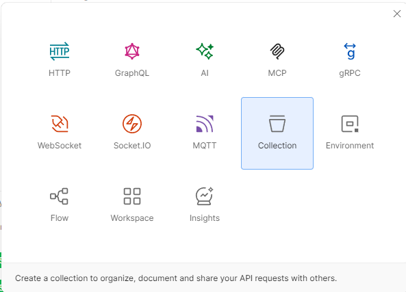
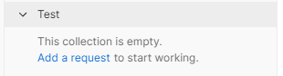
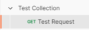
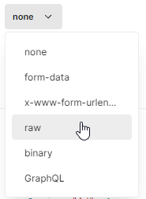
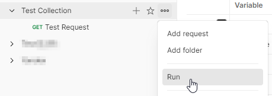
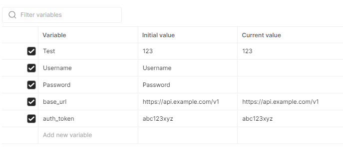
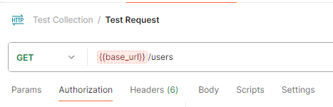
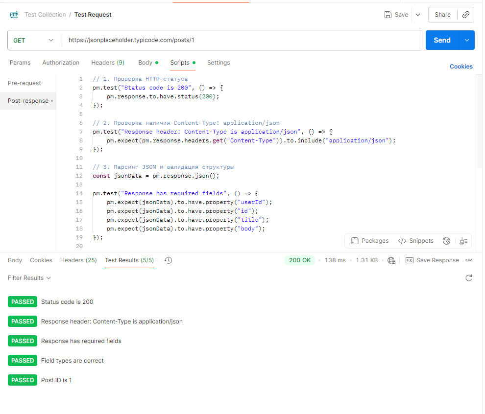
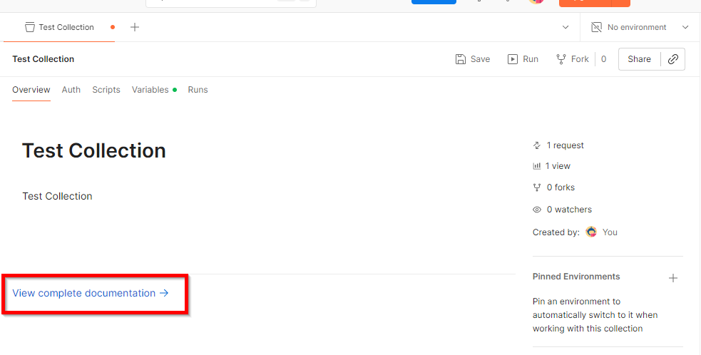
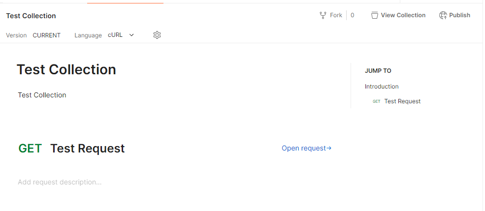

# Работа с Postman и curl для тестирования API

<div class="article-tags">
  <span class="tag tag-required">ОБЯЗАТЕЛЬНО</span>
  <span class="tag tag-beginner">ДЛЯ НОВИЧКОВ</span>
</div>

<span class="complexity-badge">Всем</span>

---

## Работа с Postman и curl для тестирования API

Postman — это программа, в которой можно отправить любой HTTP-запрос на любой сервер и посмотреть, что тебе ответят.

Например, мы написали API (сайт или бэкенд для приложения). Нам надо проверить, работает ли он. В браузере можно проверить только GET-запросы. А чтобы проверить POST, PUT, DELETE, отправить JSON, посмотреть заголовки и коды ответов, нужен Postman.

Это как браузер для разработчиков, но для любых запросов:
1. Мы выбираем метод (GET, POST, PUT, DELETE);
2. Вводим URL (например, `http://localhost:8080/users`);
3. Если надо - добавляю заголовки, JSON-тело, токен авторизации;
4. Нажимаем Send;
5. Смотрим ответ - статус, данные, заголовки.

Всё. Он просто отправляет запросы и показывает ответы.

Разработчики проверяют свои API, тестировщики прогоняют коллекции запросов (проверяя что всё работает), аналитики смотрят, какие данные отдаёт сервер.

<div class="callout callout--tip">
  <div class="callout-title">Скопировать и запустить</div>

  <div class="callout-body">
  Галерея команд curl и примеров `fetch` с разбором для лабораторных — [curl / fetch — API-запросы](/lab/Примеры/1133) (терминал, Python).

  Типовые запросы `fetch` и axios для фронтенда — [Fetch / axios — типовые запросы](/lab/Примеры/1145).

  Вызов **Chat Completions** (OpenAI и совместимые API) — [OpenAI / API — готовые промпты и вызовы](/lab/Примеры/1149); текст для полей `messages` — [Prompt engineering — библиотека промптов](/lab/Примеры/1150).

  Полный справочник флагов — [утилита curl](/encyclopedia/2-system-network/2-05-terminal/1133).
</div>
</div>

---

### О Postman

**Postman** — это платформа для работы с API, которая позволяет отправлять HTTP-запросы вручную, писать автотесты для проверки ответов, создавать коллекции запросов, документировать API, запускать mock-серверы и устанавливать мониторинг, работать в команде через облачное хранилище.

Основные сценарии применения:  
- валидация поведения эндпоинтов на этапе разработки;  
- функциональное и регрессионное тестирование;  
- генерация документации и OpenAPI/Swagger-спецификаций;  
- интеграция в CI/CD-конвейеры через Newman (CLI-версия Postman).

Postman доступен в виде десктопного приложения (Electron), веб-интерфейса и CLI-утилиты Newman. Поддерживает OAuth2, JWT, API keys, базовую и дайджест-аутентификацию, а также работу с переменными окружения и предварительными/пост-скриптами на JavaScript. Когда в коллекции уместен API-ключ, а когда Bearer JWT — [сравнение в интеграционной авторизации](/encyclopedia/8-infra-security/8-05-mikroservisy-i-integratsiya/1121#tokens-i-api-keys).

HTTP-клиент поддерживает все HTTP-методы (GET, POST, PUT, PATCH, DELETE и др.). Работа с заголовками и телом в Postman включает возможность полной настройки для запроса всех деталей. Вообще, возможностей в Postman очень много, однако для начала важно научиться именно работать с API и запросами.

В интерфейсе есть боковая панель с коллекциями, историей запросов, рабочими пространствами, а также главное окно с URL, методом, вкладками параметров, заголовков, тела, авторизации. Там же есть область просмотра ответа и кнопка отправки запросов.

---

| Компонент | Назначение |
|----------|------------|
| **Request Builder** | Конструктор HTTP-запроса: метод, URL, заголовки, тело, параметры. |
| **Params / Authorization / Headers / Body / Pre-request Script / Tests** | Вкладки для настройки параметров запроса. |
| **Collections** | Группировка запросов в иерархические структуры с поддержкой папок и порядка выполнения. |
| **Environments** | Наборы переменных (`&#123;&#123;variable&#125;&#125;`) для различных контекстов (dev, stage, prod). |
| **History** | Лог выполненных запросов (локальный или синхронизированный при использовании учётной записи). |

---

### Основа корректной работы с API

API строится на HTTP и использует семантику методов и кодов ответа. В основном работа ведётся с архитектурным стилем REST, но можно работать и с многими другими протоколами:



Часть мы изучили, часть изучим позднее - но здесь повторим обязательный минимум.

| Метод | Семантика | Idempotent | Safe | Тело запроса | Ожидаемый код ответа при успехе |
|-------|-----------|------------|------|--------------|----------------------------------|
| `GET` | Чтение ресурса | ✅ | ✅ | ❌ (не рекомендуется) | `200 OK`, `204 No Content` |
| `POST` | Создание ресурса или операция с побочным эффектом | ❌ | ❌ | ✅ | `201 Created` (предпочтительно), иногда `200 OK` |
| `PUT` | Полная замена ресурса по известному ID | ✅ | ❌ | ✅ | `200 OK`, `201 Created`, `204 No Content` |
| `PATCH` | Частичное обновление ресурса | ⚖️ | ❌ | ✅ | `200 OK`, `204 No Content` |
| `DELETE` | Удаление ресурса | ✅ | ❌ | ❌ (не рекомендуется) | `200 OK`, `204 No Content`, повторно часто `404 Not Found` |
 
**Idempotent** — повторный идентичный запрос не меняет **состояние** сервера (результат тот же: ресурс уже удалён, поля уже такие же).  
**Safe** — не изменяет состояние сервера вообще ("read-only").

После таймаута клиент, прокси или SDK часто **повторяют** запрос автоматически. Повтор `GET`/`PUT`/`DELETE` с теми же параметрами обычно безопасен; повтор `POST` без `Idempotency-Key` может создать второй заказ или второе списание. Цепочка «таймаут → retry → дубль» и ключ — в [методы и ключ идемпотентности](/encyclopedia/7-project/7-06-proektirovanie-i-arhitektura/design/213#idempotentnost-i-retry); заголовок в запросе — в [HTTP](/encyclopedia/2-system-network/2-09-osnovy-integratsionnogo-vzaimodeystviya/118).

**Нюансы:** `PATCH` по RFC **не гарантирует** идемпотентность — зависит от семантики тела. Установка поля идемпотентна, инкремент — нет:

```json
{"status": "paid"}
```

Повтор с тем же телом снова ставит `paid` — побочного эффекта нет. Другой контракт:

```json
{"op": "increment", "field": "views"}
```

Каждый повтор увеличивает счётчик. Форматы patch-документа (JSON Patch, merge-patch) — в [справочнике HTTP](/encyclopedia/2-system-network/2-03-set-i-internet/611#http-methods-rfc). Повторный `DELETE` обычно идемпотентен по смыслу ("ресурса нет"), хотя код ответа может отличаться от первого вызова (`204` и затем `404`).

Пять методов выше покрывают большинство REST API. Ещё три полезно знать на уровне протокола: `HEAD` (метаданные без тела, как `GET`), `OPTIONS` (список разрешённых методов, CORS) и реже — `CONNECT` (HTTPS-туннель через прокси), `TRACE` (диагностика). Примеры запросов и ответов для всех девяти методов — в [HTTP как основа веб-интеграций](/encyclopedia/2-system-network/2-09-osnovy-integratsionnogo-vzaimodeystviya/118#http-methods-practical).

<span id="rest-url-cheatsheet"></span>

### Разбор URL REST API

Типовой запрос для чтения списка с фильтрами и пагинацией:

```http
GET https://api.example.com/v1/users?age=25&gender=male&page=2&limit=10
```

| Часть | Значение |
|-------|----------|
| `GET` | чтение; для создания — `POST`, обновления — `PUT`/`PATCH`, удаления — `DELETE` |
| `https://` | шифрование — обязательный минимум для продакшена |
| `api.` | отдельный хост для программного доступа |
| `/v1` | версия контракта API |
| `/users` | ресурс — существительное, без глаголов в пути |
| `?age=…&gender=…` | фильтрация выборки |
| `&page=…&limit=…` | пагинация больших коллекций (также `offset`, `cursor`, keyset — [шесть схем](./131.md)) |

Полный разбор, шесть ограничений REST и практики проектирования — в [API — интерфейсы прикладного программирования](/encyclopedia/2-system-network/2-09-osnovy-integratsionnogo-vzaimodeystviya/117#rest-url-breakdown).
 
Наиболее часто используемые статус-коды:
- `200 OK` — успешный ответ с телом  
- `201 Created` — ресурс успешно создан (в теле — данные или `Location` в заголовке)  
- `204 No Content` — операция успешна, но тело не возвращается  
- `400 Bad Request` — клиент отправил некорректные данные  
- `401 Unauthorized` — отсутствует или неверна аутентификация  
- `403 Forbidden` — аутентификация прошла, но нет прав доступа  
- `404 Not Found` — запрашиваемый ресурс не существует  
- `422 Unprocessable Entity` — данные валидны по формату, но семантически недопустимы (например, email занят)  
- `500 Internal Server Error` — ошибка на стороне сервера (не связанная с запросом клиента)
 
Проверка статус-кода — первая и обязательная проверка в любом тесте.


---

### Как работать с Postman?

При тестировании через Postman нужно иметь какой-то сервис, который умеет обрабатывать запросы и отвечать на них. Для обучения можно использовать бесплатные песочницы или игровые стенды, которые как раз распространяются для студентов на открытых условиях.

Если же у вас есть развёрнутый сервис, то самое сложное - разобраться с авторизацией. Если вы написали простенький проект без авторизации - то просто пишете URL, шлёте запрос и получаете ответ. Но в некоторых случаях, к примеру, с авторизацией с помощью Cookie, нужно сначала отправлять авторизационный запрос (скорее всего POST, отправляющий логин-пароль и получающий Cookie), потом сохранять себе значение ключа авторизации, и в дальнейших запросах использовать его в параметрах (это заголовок с токеном авторизации).

Если проще, то при работе с защищёнными API требуется настроить авторизацию: выбрать схему (Bearer, Basic, OAuth2), указать токен или учётные данные, и убедиться, что запросы содержат необходимые заголовки.

Главное - знать, какой метод, адрес и данные вы хотите использовать для вашего запроса. Метод выбирается через выпадающий список, а формат данных для JSON, как правило, выбирается в Body - raw.

Можем попробовать научиться:

---

#### Шаг 1

Скачайте себе Postman или откройте веб-версию, авторизуйтесь.

Десктопное приложение: [https://www.postman.com/downloads/](https://www.postman.com/downloads/)  

Чтобы использовать веб-версию через учётную запись Postman, требуется регистрация. 

Для автоматизации в CI — установить Newman глобально:  
```bash
npm install -g newman
```

После регистрации или входа система предлагает:
   - создать рабочую область (*Workspace*);  
   - импортировать существующую коллекцию;  
   - начать с нового запроса.
   
Рекомендуется использовать персональную *Workspace* в режиме *Private* при работе с непубличными API.

В Postman существует **четыре уровня видимости**:

| Уровень | Где создаётся | Область видимости | Где изменяется динамически | Хранится в облаке? |
|--------|---------------|-------------------|----------------------------|--------------------|
| **Данные** | CSV/JSON при запуске коллекции | Только в рамках одного выполнения итерации | `pm.iterationData.get("key")` | ❌ |
| **Environment** | Вкладка *Environments* | Весь workspace, если окружение выбрано | `pm.environment.set()` | ✅ (если сохранено) |
| **Collection** | Вкладка *Variables* в коллекции | Только внутри коллекции | `pm.collectionVariables.set()` | ✅ (в составе коллекции) |
| **Global** | Вкладка *Globals* | Все коллекции в workspace | `pm.globals.set()` | ✅ |


---

#### Шаг 2

Создайте коллекцию:


---

#### Шаг 3

Создайте запрос в этой коллекции:




---

#### Шаг 4

Простой GET-запрос - добавьте URL, укажите метод GET и нажмите Send:

```
https://jsonplaceholder.typicode.com/posts/1

```

URL указывается в поле адресной строки. Если вы тестируете какой-то локальный сервис, развёрнутый на вашем компьютере/сервере, то можно указать `http://localhost:порт/путь`.

В нижней части будет результат.


По такой же аналогии можно такой URL вставить в браузер и получить аналогичный JSON.

Для интереса можете поискать открытые API и попробовать поэкспериментировать с ними через Postman.

---

#### Шаг 5

POST-запрос с JSON немного другой, нужно будет указать метод POST, URL, заголовки и в Body выбрать raw - JSON:

```
https://jsonplaceholder.typicode.com/posts
```

добавить в Content-Type: `application/json`





```
{
  "title": "testtitle",
  "body": "test body",
  "userId": 1
}

```

---

Отправьте запрос и убедитесь, что сервер вернул статус 201 Created.


---

### Коллекции

Коллекции - это группы связанных запросов. Вы можете группировать их, распределять как удобно, делиться с коллегами. По сути, они хранятся в JSON-файле, который можно выгрузить или загрузить для упрощения процесса тестирования API.

**Коллекция** — упорядоченный набор запросов с возможностью:
- экспорта в JSON (в т.ч. для OpenAPI);  
- запуска вручную или через Runner;  
- описания запросов (Markdown-поддержка);  
- версионирования (требуется Team/Enterprise-аккаунт или Git-интеграция).

А всю коллекцию можно запустить целиком:



**Запуск коллекции (Collection Runner):**  
- Позволяет задать итерации, задержки, окружение.  
- Формирует отчёт по тестам (пройдено/не пройдено).  
- Экспорт отчёта в JSON или HTML.

---

Postman можно использовать в терминале или CI/CD через Newman — CLI-утилиту.

**Интеграция с CI (через Newman):**  
```bash
newman run my-collection.json -e dev-env.json --reporters cli,html --reporter-html-export report.html
```
Поддерживает те же тесты, что и GUI-версия.


---

### curl

**curl** — утилита командной строки для HTTP и других протоколов; её используют в скриптах, CI/CD и для быстрой проверки API без GUI. Полный разбор флагов, методов, TLS, cookies и типовых сценариев — в разделе [Терминал — утилита curl](/encyclopedia/2-system-network/2-05-terminal/1133); готовые команды curl — в [галерее Lab](/lab/Примеры/1133); типовые `fetch` и axios для JavaScript — в [Fetch / axios — типовые запросы](/lab/Примеры/1145). Ниже — кратко в контексте Postman:

---


---

Открывается командная строка, пишется команда curl, и указывается адрес - тогда выполняется GET запрос. Кстати говоря, в PowerShell старых Windows curl всего лишь псевдоним для Invoke-WebRequest, и он не использует тот же синтаксис, что и настоящий curl в Linux/macOS или Windows Terminal. Поэтому можно наткнуться на ошибки если пытаться работать с curl в Windows.

В Windows 10/11 `curl.exe` — это **настоящий curl** из пакета `curl for Windows`, поставляемый Microsoft и доступный по умолчанию. Он совместим с Linux-версией. В PowerShell надёжнее вызывать **`curl.exe`**, а не `curl` (иначе может подставиться alias на `Invoke-WebRequest`). Если нужен cmdlet PowerShell — пишите **`Invoke-WebRequest`** или **`Invoke-RestMethod`** явно.

Пример POST через настоящий curl в Windows:

```bash
curl.exe -X POST "https://jsonplaceholder.typicode.com/posts" ^
  -H "Content-Type: application/json" ^
  -d "{\"title\":\"testtitle\",\"body\":\"test body\",\"userId\":1}"
```

К примеру, в Linux GET выполняется через curl -X GET:

```
curl -X GET "https://jsonplaceholder.typicode.com/posts/1" 
```

PowerShell пытается найти параметр -X, но у командлета Invoke-WebRequest такого параметра нет, поэтому вы получите ошибку. В Windows лучше использовать явно Invoke-WebRequest, ведь к примеру, с POST уже это не прокатит:

```
Invoke-WebRequest -Uri "https://jsonplaceholder.typicode.com/posts"  `
                  -Method Post `
                  -ContentType "application/json" `
                  -Body '{"title":"testtitle","body":"test body","userId":1}'

```
Такой запрос аналогичен предыдущему в Postman, и при успехе будет 201.

curl-скрипт можно создать и запускать, что позволит экспериментировать с нагрузками, планировать задачи и выполнять работу без использования кода и разработки полноценных веб-служб.

Postman позволяет экспортировать любой запрос в виде команды `curl`, именно для этого в запросе есть `cURL`. Эту команду можно вставить в CI-скрипт, Dockerfile или `.sh`-файл. Обратное преобразование (curl → Postman) поддерживается через *Import → Raw text*.

---

### Переменные окружения и глобальные переменные

Переменные позволяют избежать дублирования значений (например, базового URL или токена).  

**Создание окружения:**

1. Кнопка *Environments* → *Create new*.  
2. Добавить переменную, например:  
   - `base_url` → `https://api.example.com/v1`  
   - `auth_token` → `abc123xyz`  
3. Сохранить.

`Initial Value` коллекции/глобальных переменных — это *значение по умолчанию* для команды; `Current Value` — локальное переопределение.

У меня переменные называются Variables - это вкладка в коллекции. Можно создать их прямо здесь, указывая имя и значение.

---



В скриптах, `pm.variables.get()` ищет по цепочке: Данные → Environment → Collection → Global.

Для чувствительных данных (токены, пароли) рекомендуется использовать **environment variables** с `Current Value` (не `Initial Value`) — они не синхронизируются в облако.  

Переменные уровня коллекции — для настроек конкретного API. Переменные окружения — для значений, меняющихся в зависимости от контекста (dev/stage/prod). Глобальные переменные — только для значений, общих для нескольких независимых API (например, `default_timeout_ms`)*.


---

**Использование в запросе:** 

Поскольку в коллекции создаются переменные, то во вложенных в коллекцию запросах можно использовать переменные, используя `{{}}`. К примеру, можно поместить их в значение адреса или поля.
 
URL: `&#123;&#123;base_url&#125;&#125;/users`
  
Header: `Authorization: Bearer &#123;&#123;auth_token&#125;&#125;`

---




Для временных значений (например, ID, полученный из предыдущего ответа) — использовать `pm.environment.set("key", value)` в скриптах.

---

### Автоматизация через скрипты

Postman поддерживает два типа скриптов на JavaScript (движок — Node.js-подобный, без DOM):

- **Pre-request Script**: выполняется перед отправкой запроса.  
  Пример: генерация временной метки  
```javascript
  const ts = Date.now();
  pm.environment.set("timestamp", ts);
```

- **Tests**, или **Post-response Script**: выполняется после получения ответа. Используется для проверки статуса, структуры тела, извлечения значений.

При написании теста рекомендуется следовать порядку:  
1. ✅ **HTTP-статус** (`200`, `201`, `400` и т. д.) — первая линия диагностики.  
2. ✅ **Заголовки** (`Content-Type`, `Location`, `ETag`) — подтверждают контракт уровня протокола.  
3. ✅ **Структура тела** (наличие ключей, вложенность) — гарантирует совместимость с клиентом.  
4. ✅ **Типы полей** (`number`, `string`, `boolean`) — предотвращает ошибки десериализации.  
5. ⚖️ **Значения полей** (валидность email, даты, диапазоны) — бизнес-логика.  
 
Проверки 1–4 достаточно для smoke-тестов; 5 — для регрессионного покрытия.

У меня, кстати, вкладки Tests нет, но есть вкладка Scripts - технически, это то же самое.
  
  Примеры:
```javascript
  // Проверка статуса
  pm.test("Status code is 200", () => pm.response.to.have.status(200));

  // Проверка JSON-поля
  const jsonData = pm.response.json();
  pm.test("Response has 'id'", () => pm.expect(jsonData.id).to.exist);

  // Сохранение значения для последующих запросов
  pm.environment.set("user_id", jsonData.id);
```

Доступные объекты: `pm`, `pm.request`, `pm.response`, `pm.environment`, `pm.globals`.

> **Примечание:** `pm.*` — это Postman API, а не стандартный JavaScript. Он не доступен за пределами Postman.

Давайте попробуем сделать скрипт для нашего Test Request - `GET https://jsonplaceholder.typicode.com/posts/1`



Во вкладке Scripts разместите следующий код:
```javascript
// 1. Проверка HTTP-статуса
pm.test("Status code is 200", () => {
    pm.response.to.have.status(200);
});

// 2. Проверка наличия Content-Type: application/json
pm.test("Response header: Content-Type is application/json", () => {
    pm.expect(pm.response.headers.get("Content-Type")).to.include("application/json");
});

// 3. Парсинг JSON и валидация структуры
const jsonData = pm.response.json();

pm.test("Response has required fields", () => {
    pm.expect(jsonData).to.have.property("userId");
    pm.expect(jsonData).to.have.property("id");
    pm.expect(jsonData).to.have.property("title");
    pm.expect(jsonData).to.have.property("body");
});

// 4. Валидация типов
pm.test("Field types are correct", () => {
    pm.expect(jsonData.userId).to.be.a("number");
    pm.expect(jsonData.id).to.be.a("number");
    pm.expect(jsonData.title).to.be.a("string");
    pm.expect(jsonData.body).to.be.a("string");
});

// 5. Проверка конкретного значения (опционально)
pm.test("Post ID is 1", () => {
    pm.expect(jsonData.id).to.eql(1);
});

// 6. Сохранение значения для последующих запросов (например, POST с этим userId)
pm.environment.set("last_post_id", jsonData.id);
pm.environment.set("last_user_id", jsonData.userId);
```

Здесь, как можно заметить, выполняется несколько этапов:

1. Подтверждается, что сервер отвечает нам ожидаемым статусом и заголовками;
2. Проверяется минимальная контрактная структура ответа;
3. Валидируются типы (это важно при интеграциях);
4. Сохраняются id и userId во внешнюю переменную окружения, чтобы использовать в следующих запросах.

Теперь можно выполнить такое:

```
{
  "title": "Reply to post {{last_post_id}}",
  "body": "Automatically linked via test script",
  "userId": {{last_user_id}}
}
```

Такой подход превращает ручное тестирование в воспроизводимый сценарий и закладывает основу для CI-тестов. К примеру, тот же токен авторизации можно записывать в переменную скриптом, и подставлять при каждом запросе. Это сэкономит вам время.

> В POST-теле для `userId` число из переменной Postman подставляется без кавычек: `"userId": &#123;&#123;last_user_id&#125;&#125;`. Если API ожидает строку — оберните в кавычки: `"userId": "&#123;&#123;last_user_id&#125;&#125;"`.

Если в вашей коллекции есть последовательность запросов (GET → POST → GET), можно добавить аналогичные скрипты и в POST-запросе — например, сохранить id созданного поста и проверить его в финальном GET.


---

### Генерация документации

#### Шаг 1

Открыть коллекцию.  

---

#### Шаг 2

Кнопка *View complete Документация*.  



Чтобы получить готовый документ, используется *Publish*.

---

#### Шаг 3

Настроить версию, язык, добавить описание для соответствующих запросов.



---

#### Шаг 4

Postman генерирует интерактивную документацию с возможностью выполнения запросов прямо из браузера.

Можно экспортировать спецификацию в формате OpenAPI 3.0 (*Collection → Export → Schema*), что упрощает интеграцию с инструментами вроде Swagger UI или Redoc.


---

### Альтернативный GET-запрос
 
```http
GET https://reqres.in/api/users/2
```
 
В ответе (реальный API [reqres.in](https://reqres.in) — полезная нагрузка в ключе **`data`**, как в большинстве REST API):
```json
{
  "data": {
    "id": 2,
    "email": "janet.weaver@reqres.in",
    "first_name": "Janet",
    "last_name": "Weaver",
    "avatar": "https://reqres.in/img/faces/2-image.jpg"
  },
  "support": {
    "url": "https://reqres.in/#support-heading",
    "text": "To keep ReqRes free, contributions towards server costs are appreciated!"
  }
}
```
 
Тест-скрипт:
```javascript
const user = pm.response.json().data;

pm.test("User email is valid", () => {
  pm.expect(user.email).to.match(/.+@.+\..+/);
});
pm.test("Avatar URL is present and absolute", () => {
  pm.expect(user.avatar).to.match(/^https?:\/\//);
});
pm.environment.set("user_email", user.email);
```

---

Перед ручной проверкой полезно иметь согласованный контракт: [Проектирование API и интеграций](/encyclopedia/7-project/7-06-proektirovanie-i-arhitektura/design/117) (примеры HTTP из сквозного сценария), [Тестирование и анализ API](/encyclopedia/7-project/7-05-testirovanie/2). Все главы трека — [маршрут по API](/encyclopedia/7-project/7-06-proektirovanie-i-arhitektura/design/117#маршрут-по-материалам-api).

---

{/* http-basics-link  */}
<div class="callout callout--tip">
  <div class="callout-title">Основа по протоколу</div>

  <div class="callout-body">
  Базовый разбор HTTP и HTTPS находится в отдельной статье — [HTTP как основа веб-интеграций](/encyclopedia/2-system-network/2-09-osnovy-integratsionnogo-vzaimodeystviya/118).
</div>
  </div>


