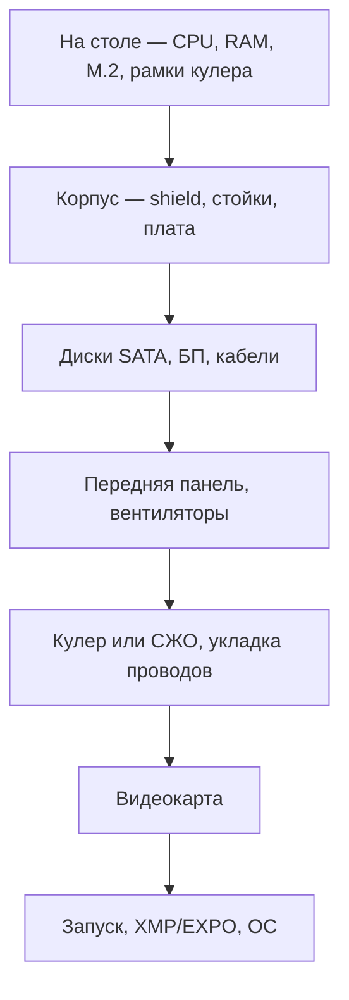
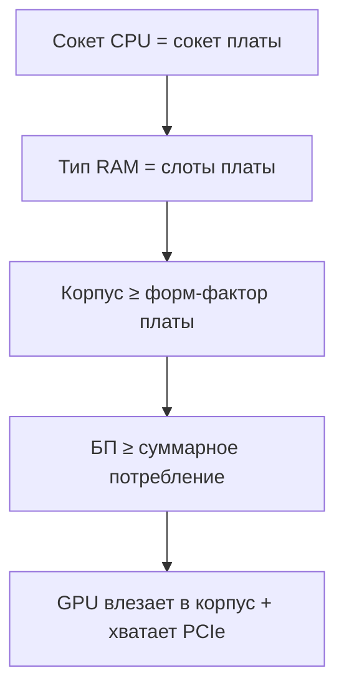
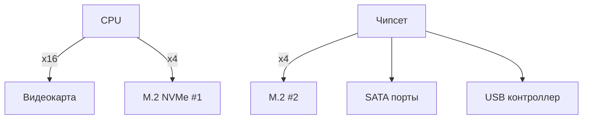

import ExternalPlayEmbed from '@site/src/components/ExternalPlayEmbed';

# Последовательность сборки компьютера

  ОБЯЗАТЕЛЬНО
  ДЛЯ НОВИЧКОВ

Всем

Сборка настольного ПК — это установка совместимых деталей в корпус, подключение кабелей и первый запуск. С 2010-х годов порядок работ для офисного и игрового компьютера один и тот же; меняется только набор комплектующих.

Перед покупкой деталей сверьте [чек-лист совместимости](#совместимость-компонентов--чек-лист-сборки). Обзор ролей CPU, RAM, накопителей и видеокарты — в разделе [Как работает компьютер](/encyclopedia/1-basics/1-08-kak-rabotaet-kompyuter/intro).

<ExternalPlayEmbed example="system-network/pc-component-matcher-play" title="Подбор совместимости ПК" minHeight={520} />

<ExternalPlayEmbed example="system-network/pc-assembly-play" title="Визуальная сборка ПК" minHeight={520} />

  
Порядок сборки (кратко)

  

  <ol>
    <li>На столе — <a href="/glossary/C#cpu">CPU</a>, <a href="/glossary/R#ram">RAM</a>, <a href="/glossary/N#nvme">M.2 SSD</a>, крепёжные рамки кулера (радиатор позже).</li>
    <li>В корпусе — заглушка портов, стойки, плата, SATA-диски, блок питания, кабели 24-pin и CPU.</li>
    <li>Передняя панель, вентиляторы, охлаждение, укладка проводов.</li>
    <li>Видеокарта в верхний слот PCIe x16 и её питание.</li>
    <li>Первый запуск — <a href="/glossary/B#bios">BIOS/UEFI</a>, профиль <a href="/glossary/X#xmp">XMP</a> или <a href="/glossary/E#expo">EXPO</a>, установка ОС и драйверов.</li>
  </ol>
  
Без кабеля питания CPU (8-pin) часто крутятся вентиляторы, а экран остаётся чёрным. Подсветка ARGB (5 В) и RGB (12 В) подключаются к разным разъёмам — перепутать опасно.

  

---

## Три этапа сборки

| Этап | Содержание |
|------|------------|
| Подготовка | Подбор деталей, проверка совместимости, инструменты, рабочее место |
| Монтаж | Установка компонентов в корпус и прокладка кабелей |
| Запуск | [POST](/glossary/P#post), настройка BIOS/UEFI, профиль памяти, ОС и драйверы |

### Совместимость перед покупкой

| Пара | Что проверить |
|------|---------------|
| CPU и материнская плата | Сокет (AM5, LGA1700 и т.д.) и список поддерживаемых процессоров на сайте производителя |
| RAM | Тип DDR4/DDR5, объём и частота из QVL (список проверенных модулей) |
| Корпус | Форм-фактор платы (ATX, mATX, ITX), длина видеокарты, высота кулера |
| Блок питания | Запас по ваттам (CPU + GPU + 20–30 %), разъёмы PCIe и EPS |
| Несколько M.2 или PCIe | См. [раздел про слоты M.2](#несколько-накопителей-m2) и [PCIe — линии и совместимость](#pcie--линии-и-совместимость) |

---

## Подготовка к сборке

### Комплектующие

- **Материнская плата** — основа системы; задаёт сокет CPU, тип RAM, число слотов M.2 и PCIe. Подробнее — [Компоненты ПК](/encyclopedia/1-basics/1-08-kak-rabotaet-kompyuter/2).
- **Процессор (CPU)** — должен подходить к сокету платы (например, AM5 для Ryzen 7000, LGA1700 для Intel 12–14-го поколений).
- **Оперативная память (RAM)** — модули [DIMM](/glossary/D#dimm); тип DDR4/DDR5 и частота — по спецификации платы.
- **Блок питания (PSU, БП)** — мощность с запасом, сертификат 80 PLUS, нужные разъёмы. См. [Периферия и питание](/encyclopedia/1-basics/1-08-kak-rabotaet-kompyuter/5).
- **Накопители** — [NVMe](/glossary/N#nvme) M.2 и/или SATA SSD/HDD. См. [Накопители](/encyclopedia/1-basics/1-08-kak-rabotaet-kompyuter/3).
- **Видеокарта (GPU)** — нужна, если у CPU нет встроенной графики или нужна дискретная мощность. См. [Видеокарта](/encyclopedia/1-basics/1-08-kak-rabotaet-kompyuter/4).
- **Охлаждение CPU** — воздушный кулер или СЖО (система жидкостного охлаждения, AIO); по сокету и по высоте под корпус.
- **Корпус** — под форм-фактор платы и габариты GPU.

### Инструменты и расходники

| Инструмент | Назначение |
|------------|------------|
| Крестовая отвёртка с длинным стержнем (~15 см) | Винты кулера через радиатор |
| Маленькая отвёртка PH0 / PZ0 | Винты M.2 при отсутствии безвинтового зажима |
| Кусачки или ножницы | Обрезка хвостов пластиковых стяжек |
| Нейлоновые стяжки или тканевые липучки (15 см, 2,5–3 мм) | Укладка проводов |
| Антистатический браслет | Защита от статики; правила — [Безопасная работа с компонентами](./101.md) |
| Термопаста | Если на кулере нет заводского слоя |
| Фонарик или настольная лампа | Подсветка разъёмов |
| Пинцет | Провода передней панели, мелкие детали |

**В комплекте с деталями обычно идут**

- блок питания — силовые кабели (24-pin, CPU, PCIe, SATA power);
- корпус и кулер — винты, стойки, прокладки;
- материнская плата — SATA-кабели данных, иногда Wi-Fi-антенна.

> **💡 Совет**  
> Распакуйте всё заранее, откройте руководство к материнской плате (manual) и проверьте комплект на повреждения.

---

## Рекомендуемый порядок сборки

| № | Где | Действия |
|---|-----|----------|
| 1 | На столе | CPU, RAM, M.2, крепёжные рамки кулера |
| 2 | В корпусе | I/O shield, материнская плата, SATA-диски |
| 3 | В корпусе | БП, 24-pin, питание CPU, SATA power |
| 4 | В корпусе | Передняя панель, USB, аудио, вентиляторы |
| 5 | В корпусе | Кулер или радиатор СЖО, термопаста |
| 6 | В корпусе | Укладка проводов, затем GPU |
| 7 | — | Первый запуск, BIOS, драйверы |

  
Сборка на столе без корпуса

  

  Запуск системы вне корпуса иногда делают опытные сборщики для проверки деталей. Новичкам лучше сразу собирать в корпус: на открытой плате легко задеть кулер, пролить жидкость или замкнуть дорожки. Коробку от материнской платы или плотный коврик используйте только как подставку при монтаже.

---

## Этап 1. Сборка на столе

Положите материнскую плату на **родную картонную коробку** или плотный коврик, чтобы обратная сторона не царапалась о стол. Сейчас ставят CPU, RAM, M.2 и **только крепёжные рамки** кулера. Радиатор монтируют позже — он закрывает доступ к разъёмам.

### Установка процессора

Держите CPU **за боковые грани**. Контактную площадку не трогайте.

**AMD AM5** (контакты на процессоре)

1. Откройте зажимную лапку, поднимите рамку сокета.
2. Совместите треугольные метки на CPU и сокете и выемки по краям.
3. Опустите процессор — он садится сам, без нажима.
4. Опустите рамку и закройте лапку; защитная крышка сокета отскочит.

**Intel LGA 1700 / LGA 1851** (контакты в сокете на плате)

1. Откройте лапку и рамку, совместите метки, опустите CPU.
2. При закрытии лапки удерживайте её до щелчка — отпружинивание может погнуть контакты в гнезде.

**AMD AM4** (контакты-ножки на CPU)

1. Поднимите лапку строго вверх.
2. Опустите CPU по меткам-треугольникам под собственным весом.
3. Закройте лапку.

> **📌 Внимание**  
> У AMD контакты на процессоре, у Intel — в сокете. Если CPU не садится сам, проверьте ориентацию; давить силой нельзя.

### Установка оперативной памяти

1. Откройте защёлки на слотах [DIMM](/glossary/D#dimm).
2. Совместите прорезь на модуле с выступом в слоте — ключ не даст вставить планку задом наперёд.
3. Надавите равномерно вниз до щелчка защёлок.

**Куда ставить планки** (четыре слота A1, A2, B1, B2)

| Сколько планок | Слоты |
|----------------|-------|
| Одна | **A2** |
| Две (двухканальный режим, dual channel) | **A2** и **B2** |

Двухканальный режим даёт большую пропускную способность, чем одна планка. Подробнее о RAM — [Компоненты ПК](/encyclopedia/1-basics/1-08-kak-rabotaet-kompyuter/2).

> **⚠️ Предупреждение**  
> DDR4 и DDR5 имеют разные ключи на разъёме — планка одного типа физически не войдёт в слот другого.

### Установка M.2 SSD

[M.2](/glossary/N#nvme) — плоский накопитель, который крепится прямо на плату; для [NVMe](/glossary/N#nvme) нужен соответствующий слот.

1. Снимите радиатор M.2 (если есть) и **снимите плёнку** с термопрокладки.
2. Вкрутите стойку-пенёк под длину платы (чаще маркировка **2280** — 22 мм ширина, 80 мм длина).
3. Вставьте SSD под углом 30–40°, прижмите к стойке, зафиксируйте винтом или поворотным зажимом.
4. Верните радиатор.
5. **Наклейку на SSD не снимайте** — на ней серийный номер для гарантии.

### Крепёжные рамки охлаждения

По инструкции кулера или СЖО установите на плату стойки и заднюю пластину. Радиатор и вентиляторы — после монтажа платы в корпусе и подключения основных кабелей.

---

## Этап 2. Монтаж в корпус

### Подготовка корпуса

1. Снимите боковые панели; при необходимости — верхнюю и переднюю.
2. Вставьте **заглушку портов (I/O shield)** изнутри заднего проёма, если она отдельная от платы. Отверстия для звука смотрят **вниз**.
3. Проверьте **стойки (standoffs)** — металлические винты-пеньки, на которые ложится плата. Оставьте только те, что совпадают с отверстиями вашего форм-фактора. **Лишние стойки выкрутите** — они могут замкнуть дорожки с обратной стороны платы.

### Установка материнской платы

1. Наденьте плату на центральную направляющую стойку-шип (если есть).
2. Совместите порты USB, сети и звука с вырезами в shield.
3. Закрепите **6–9 винтами** с плоской головкой, затягивая по диагонали.

### Накопители 3,5" HDD и 2,5" SATA SSD

**HDD 3,5"**

- Закрепите в салазках платой вниз, разъёмами наружу.
- Задвиньте салазки в корзину внизу или сбоку корпуса.

**SSD 2,5" (SATA)**

- Прикрутите к салазкам или к корпусу винтами с плоской шляпкой.

### Установка блока питания

1. Чаще всего БП ставят **внизу вентилятором к полу** — холодный воздух идёт через нижнюю решётку.
2. У **модульного** БП подключите нужные кабели **до** установки в корпус.
3. Закрепите четырьмя винтами; переключатель сети — `230V` (для РФ и большинства стран СНГ).

---

## Этап 3. Основные силовые кабели

| Кабель | Разъём на плате | Как проложить |
|--------|-----------------|---------------|
| CPU (4+4 pin) | `CPU_PWR`, верхний угол | Через отверстие за задней стенкой |
| 24-pin ATX | `MAIN_POWER`, правый край | Через кабель-канал сзади |
| SATA power | К HDD и 2,5" SSD | От БП, плоские Г-образные штекеры |
| SATA data | К дискам | От портов платы; кабель в комплекте с платой |

> **⚠️ Предупреждение**  
> Пропущенный кабель питания CPU — частая причина ситуации "вентиляторы крутятся, экран чёрный". См. [Диагностика первого запуска](./1012.md).

---

## Этап 4. Передняя панель и порты

| Разъём | Обычное место на плате | Как узнать |
|--------|------------------------|------------|
| HD Audio | Нижний угол, `AAFP` или `AUDIO` | 9 контактов, одно отверстие заглушено |
| USB 2.0 | Нижние колодки | 9 pin |
| USB 3.0 | Правый край | Длинный разъём с боковым пазом |
| USB Type-C | Отдельный разъём | Форма буквы "Н" |
| F_PANEL | `JFP1` и аналоги | Кнопки и светодиоды |

**Провода F_PANEL** (если идут по одному, а не шлейфом)

| Контакт | Где на колодке | Полярность |
|---------|----------------|------------|
| Power SW | Контакты 3–4 верхнего ряда | Любая |
| Reset SW | Под Power SW | Любая |
| Power LED | Контакты 1–2 верхнего ряда | Плюс на 1-й, минус на 2-й |
| HDD LED | Нижний ряд | Плюс и минус важны |

Точная раскладка — только в manual **вашей** платы.

---

## Этап 5. Вентиляторы и подсветка

### Направление воздуха

| Тип вентилятора | Поток |
|-----------------|-------|
| Обычный | В сторону рамки (от себя) — забор |
| Реверсивный | На себя — часто снизу или сбоку корпуса |

**Типичная схема**

- спереди и снизу — забор холодного воздуха;
- сверху и сзади — выдув нагретого.

### Разъёмы на плате

| Разъём | Для чего |
|--------|----------|
| `CPU_FAN` | Вентилятор кулера CPU |
| `PUMP_FAN` / `AIO_PUMP` | Помпа СЖО |
| `SYS_FAN` / `CHA_FAN` | Корпусные вентиляторы |

На один разъём платы цепочкой можно повесить **3–4** обычных вентилятора (лимит около 1 А). Больше — через **хаб** с питанием от SATA или Molex. Регулировка скорости по шине [PWM](/glossary/P#pwm) — через 4-pin разъём.

### Подсветка ARGB и RGB

| Тип | Напряжение | Разъём | Поведение |
|-----|------------|--------|-----------|
| ARGB (aRGB) | 5 В | 3 pin | Каждый светодиод управляется отдельно |
| RGB | 12 В | 4 pin | Все LED одного цвета |

  
Разные разъёмы подсветки

  

  ARGB и RGB подключаются к <strong>разным</strong> гнёздам на плате. Перепутанное напряжение (5 В на 12 В или наоборот) повреждает светодиоды и может вывести из строя материнскую плату. Сверьте маркировку на кабеле и в manual.

---

## Этап 6. Термопаста и охлаждение

### Термопаста

Термопаста заполняет микрозазор между крышкой CPU (IHS — Integrated Heat Spreader) и радиатором кулера.

1. Поверхность IHS должна быть чистой и сухой.
2. Нанесите каплю и размажьте тонким слоем (через целлофан на палец) **или** оставьте "горошину" по центру — кулер распределит пасту при затяжке.
3. У боксовых кулеров Intel слой часто уже нанесён.

> **💡 Совет**  
> Небольшой избыток допустим — при затяжке крепление выдавит лишнюю пасту по краям. Главное, чтобы слой не был слишком тонким.

### Воздушный кулер

1. Снимите вентиляторы со скоб, снимите защитный стикер с подошвы радиатора.
2. Установите радиатор с зазором до высоких модулей RAM.
3. Наживите винты с двух сторон, затяните **крест-накрест** поочерёдно.
4. Верните вентиляторы на выдув к задней стенке.
5. Подключите 4-pin PWM к `CPU_FAN`.

### Система жидкостного охлаждения (AIO)

1. Вентиляторы к радиатору — **комплектными длинными** винтами.
2. Радиатор к корпусу — короткими винтами; при боковом монтаже трубки направьте **вверх**.
3. Водоблок затягивайте **крест-накрест**, по паре оборотов за проход.
4. Помпу — в `PUMP_FAN` или `CPU_FAN` по инструкции производителя.

---

## Этап 7. Укладка проводов

Перед видеокартой:

1. Стяните кабели стяжками или липучками вдоль кабель-каналов за платой.
2. Лишние провода немодульного БП спрячьте между блоком и корзиной HDD.
3. Хвосты стяжек обрежьте кусачками.

Ровная укладка улучшает обдув и упрощает замену деталей.

---

## Этап 8. Видеокарта

1. Используйте **верхний** слот **PCIe x16**, напрямую связанный с CPU (см. [PCIe — линии и совместимость](#pcie--линии-и-совместимость)).
2. Снимите металлические заглушки на задней стенке корпуса.
3. Снимите пластиковую заглушку с разъёма, вставьте карту до щелчка, прикрутите к корпусу.
4. Подключите питание
   - классические карты — один или два кабеля **6+2 pin PCIe** отдельными жилами от БП;
   - современные Nvidia — **12VHPWR (12V-2x6)** или переходник из комплекта.
5. Штекер вставляйте до упора; у разъёма не загибайте кабель резко.
6. Тяжёлую длинную карту поддержите **кронштейном** (GPU bracket), чтобы слот PCIe не прогнулся.

---

## Этап 9. Первый запуск

1. Закройте панели, включите тумблер БП (`I`), нажмите Power на корпусе.
2. Монитор подключите к **разъёму видеокарты** при установленной дискретной GPU.
3. При загрузке нажимайте `Del` или `F2`, чтобы войти в BIOS/UEFI.
4. Включите профиль **[XMP](/glossary/X#xmp)** (Intel) или **[EXPO](/glossary/E#expo)** (AMD) — тогда RAM заработает на частоте с упаковки (например, DDR5-6000), а на базовой JEDEC (например, DDR5-4800).
5. Сохраните настройки (`F10`).
6. Установите Windows с флешки (если диск новый) и скачайте драйверы chipset, LAN, аудио с сайта производителя **материнской платы**.

Если система не стартует — [Диагностика первого запуска](./1012.md).

### Проверка перед включением

- все детали закреплены;
- подключены 24-pin и питание CPU;
- видеокарта получает питание (если требуется);
- внутри корпуса нет лишних винтов;
- лопасти вентиляторов ничем не задеты.

---

## Несколько накопителей M.2

При двух и более M.2 откройте раздел Storage в manual платы.

| Правило | Пояснение |
|---------|-----------|
| Самый быстрый SSD | В **верхний** слот ближе к CPU — обычно полные PCIe 4.0/5.0 x4 |
| Нижние слоты | Могут работать на PCIe 4.0 вместо 5.0 или на 2 линиях вместо 4 |
| Разделение линий | Один занятый M.2 может отключить SATA-порт или урезать нижний PCIe x16 |

Схема зависит от чипсета и модели CPU — смотрите таблицу именно для вашей платы. Общий обзор — [PCIe — линии и совместимость](#pcie--линии-и-совместимость).

---

## Совместимость компонентов — чек-лист сборки

Перед покупкой деталей проверьте **пять обязательных пар**:

| Проверка | Как убедиться | Типичная ошибка |
|----------|---------------|-----------------|
| CPU + плата | Сайт производителя, PCPartPicker | Купили AM5 CPU к плате AM4 |
| RAM + плата | Спецификация "DDR5-5600, max 128GB" | DDR4 в слот DDR5 |
| БП + GPU | TDP GPU + CPU + 20% запас | Блок 450 Вт с RTX 4070 |
| Корпус + GPU | Max GPU length в спеках корпуса | Карта на 5 см длиннее корпуса |
| Охлаждение + CPU | TDP кулера ≥ TDP процессора | Стоковый кулер на разогнанный CPU |
| BIOS | Список поддерживаемых CPU на сайте платы | Новый CPU без обновления BIOS |

  
Инструменты подбора

  

  Сайты вроде <strong>PCPartPicker</strong> и конфигураторы магазинов автоматически отмечают несовместимые пары. Перед заказом сверьте список с официальной страницей материнской платы — особенно для новых поколений CPU.

---

## PCIe — линии и совместимость

**PCI Express** — шина для видеокарт, NVMe SSD, сетевых и звуковых карт.

| Версия | Пропускная способность x16 (теор.) | Поколение |
|--------|-----------------------------------|-----------|
| PCIe 3.0 | ~16 ГБ/с | До Ryzen 3000, Intel 9–10 |
| PCIe 4.0 | ~32 ГБ/с | Ryzen 5000+, Intel 11+ |
| PCIe 5.0 | ~64 ГБ/с | Ryzen 7000, Intel 12+ |

| Слот | Линии | Типичное устройство |
|------|-------|---------------------|
| PCIe x16 | 16 | Видеокарта |
| PCIe x4 (M.2) | 4 | NVMe SSD |
| PCIe x1 | 1 | Wi-Fi, звук, захват |

**Важно:** при установке второго M.2 SSD некоторые платы **отключают** SATA-порты или делят PCIe-линии с GPU — читайте мануал платы (раздел Storage).

---
