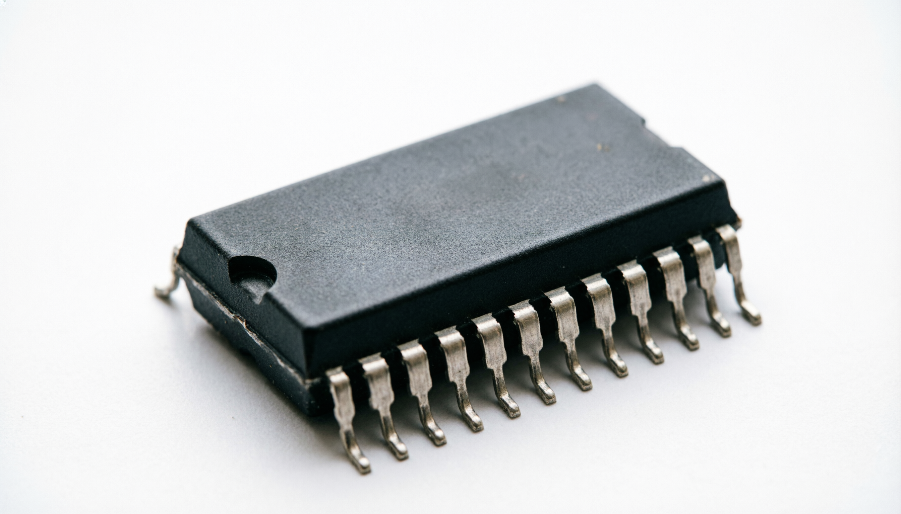

# Микросхемы и интегральные схемы

  ОБЯЗАТЕЛЬНО
  ДЛЯ НОВИЧКОВ

Всем

## Микросхемы и чипы

Микросхемы — это фундаментальные компоненты, лежащие в основе всей современной электроники. Их называют также интегральными схемами или чипами. Эти термины обозначают одно и то же устройство: миниатюрную электронную конструкцию, в которой множество функциональных элементов размещено на одном кусочке полупроводникового материала. Благодаря микросхемам стало возможным создание компактных, надёжных и мощных устройств — от карманных смартфонов до суперкомпьютеров.

| Термин | Кратко |
|--------|--------|
| **Интегральная схема (ИС)** | Много элементов на одном кристалле |
| **Кристалл (die)** | Сам чип до упаковки в корпус |
| **Корпус** | Выводы, защита, отвод тепла (DIP, QFP, BGA…) |
| **Техпроцесс (нм)** | Толщина минимальных элементов на кристалле; меньше — обычно плотнее и экономичнее |
| **ASIC** | Схема под одну задачу (майнинг, кодек, контроллер диска) |

---

### Что такое микросхема

Микросхема представляет собой электронное устройство, изготовленное на основе полупроводниковой подложки, чаще всего из кремния. На этой подложке создаются транзисторы, резисторы, конденсаторы и другие компоненты, соединённые между собой сложной системой проводников. Вся эта структура формирует законченную электрическую схему, способную выполнять определённые функции: усиливать сигнал, хранить данные, обрабатывать информацию, управлять другими устройствами.

Основная идея микросхемы заключается в интеграции множества отдельных электронных компонентов в единый монолитный блок. Это позволяет достичь высокой плотности компоновки, уменьшить размеры устройств, повысить их надёжность и снизить стоимость производства. Современные микросхемы могут содержать миллиарды транзисторов на площади меньше ногтя человека.

---

### История появления микросхем

Идея объединения множества электронных компонентов на одном кристалле была впервые высказана британским инженером Джеффри Даммером в 1952 году. Однако практическая реализация этой идеи стала возможной только в конце 1950-х годов, когда технологии производства полупроводников достигли необходимого уровня.

В 1958 году Джек Килби из компании Texas Instruments создал первую работоспособную интегральную схему. Она состояла из нескольких компонентов, расположенных на одном кусочке германия. Почти одновременно Роберт Нойс из Fairchild Semiconductor предложил альтернативный подход, основанный на планарной технологии и использовании алюминиевой металлизации для соединения компонентов. Эти два изобретения заложили основу современной микроэлектроники.

В СССР первая микросхема была разработана в 1961 году в Таганрогском радиотехническом институте под руководством Л. Н. Колесова. В последующие годы советская промышленность освоила выпуск как гибридных, так и полупроводниковых интегральных схем, ориентированных в первую очередь на оборонные и промышленные нужды.

---

### Основа микросхемы

Большинство микросхем изготавливается на основе кремния — полупроводника, который обладает уникальными свойствами. Он легко поддаётся легированию, что позволяет создавать области с разными электрическими характеристиками: n-типа (с избытком электронов) и p-типа (с избытком «дырок»). Соединение таких областей образует p-n-переходы, лежащие в основе транзисторов и диодов.

Помимо кремния, в специализированных микросхемах используются и другие материалы: германий, арсенид галлия, карбид кремния. Арсенид галлия применяется в высокочастотных устройствах, например в радиопередатчиках и спутниковой связи, благодаря своей способности работать на больших частотах с меньшими потерями.

---

### Компоненты внутри микросхемы

На кремниевой подложке формируются активные и пассивные элементы:

- **Транзисторы** — ключевые элементы, выполняющие функции переключателей или усилителей. В цифровых микросхемах они работают в режиме «включено/выключено», представляя двоичные значения.
- **Резисторы** — ограничивают ток и формируют делители напряжения.
- **Конденсаторы** — накапливают заряд и фильтруют сигналы.
- **Диоды** — пропускают ток в одном направлении.

Эти компоненты не являются отдельными деталями, как в классической электронике. Они создаются непосредственно в объёме полупроводника с помощью процессов диффузии, ионной имплантации и фотолитографии. Это обеспечивает исключительную компактность и стабильность характеристик.

---

### Функциональность микросхем

Микросхемы выполняют самые разные задачи. Некоторые из них предназначены для обработки данных — это центральные процессоры, графические процессоры, микроконтроллеры. Другие хранят информацию — оперативная память (RAM), постоянная память (ROM, флэш). Есть микросхемы, управляющие питанием устройства, передачей данных по Wi-Fi или Bluetooth, работой камеры, сенсоров, дисплея.

Особую категорию составляют специализированные микросхемы — ASIC (Application-Specific Integrated Circuit). Они разрабатываются под конкретную задачу и отличаются высокой эффективностью. Например, ASIC-чипы используются в оборудовании для майнинга криптовалют или в системах распознавания изображений.

---

### Классификация микросхем

Микросхемы можно классифицировать по нескольким признакам.

#### По степени интеграции

- **Малая интегральная схема (МИС)** — содержит до 100 элементов.
- **Средняя интегральная схема (СИС)** — до 1000 элементов.
- **Большая интегральная схема (БИС)** — до 10 000 элементов.
- **Сверхбольшая интегральная схема (СБИС)** — более 10 000 элементов.

Современные процессоры и память относятся к классу СБИС и содержат миллиарды транзисторов.

#### По технологии изготовления

- **Полупроводниковые микросхемы** — все компоненты созданы на одном кристалле. Это самый распространённый тип.
- **Плёночные микросхемы** — компоненты наносятся в виде тонких или толстых плёнок на изоляционную подложку.
- **Гибридные микросхемы (микросборки)** — сочетают бескорпусные кристаллы и дискретные компоненты на общей подложке.
- **Совмещённые микросхемы** — комбинируют полупроводниковый кристалл и плёночные элементы.

#### По виду обрабатываемого сигнала

- **Аналоговые микросхемы** работают с непрерывными сигналами. Они используются в усилителях, фильтрах, стабилизаторах напряжения, радиоприёмниках.
- **Цифровые микросхемы** обрабатывают дискретные сигналы — последовательности нулей и единиц. Это основа компьютеров, телефонов, цифровой техники.
- **Аналого-цифровые микросхемы** совмещают оба типа обработки. Примеры — аналого-цифровые преобразователи (АЦП), цифро-аналоговые преобразователи (ЦАП), модемы.

#### По применению

- **Универсальные микросхемы** выпускаются сериями и используются в самых разных устройствах.
- **Специализированные микросхемы** создаются под заказ для конкретного применения.

### Преимущества микросхем

Миниатюризация электронных компонентов принесла огромные преимущества:

- **Компактность** — устройства стали значительно меньше и легче.
- **Надёжность** — отсутствие механических соединений между отдельными компонентами снижает вероятность отказов.
- **Энергоэффективность** — особенно в цифровых схемах, где транзисторы потребляют энергию только в момент переключения.
- **Массовое производство** — технология фотолитографии позволяет изготавливать тысячи одинаковых микросхем на одной пластине кремния, что резко снижает стоимость каждой единицы.
- **Высокая скорость работы** — короткие внутренние соединения позволяют сигналам проходить через микросхему за минимальное время.

---

### Производственный процесс

Изготовление микросхем — это многоступенчатый технологический цикл, требующий чрезвычайной точности и чистоты. Основные этапы:

1. **Подготовка кремниевой пластины** — выращивание монокристалла кремния, его нарезка на тонкие диски (пластины).
2. **Формирование структур** — с помощью фотолитографии на пластине создаются маски, определяющие расположение компонентов.
3. **Легирование** — внесение примесей для создания областей с нужными электрическими свойствами.
4. **Нанесение слоёв** — напыление металлов для межсоединений, оксидов для изоляции.
5. **Тестирование** — проверка работоспособности каждого кристалла на пластине.
6. **Упаковка** — кристалл помещается в защитный корпус с выводами для подключения к печатной плате.

Характеристикой технологического процесса является минимальный размер элемента, который можно воспроизвести на кристалле. Этот параметр измеряется в нанометрах. В 2020-х годах ведущие производители освоили техпроцессы 5 нм и 3 нм, что позволяет размещать на одном кристалле десятки миллиардов транзисторов.

---

### Корпуса микросхем

Готовый кристалл обычно помещается в корпус, защищающий его от влаги, пыли и механических повреждений. Корпус также обеспечивает электрическое соединение с внешней схемой через выводы. Существуют десятки типов корпусов, различающихся по количеству выводов, способу монтажа (в отверстия или на поверхность платы), тепловым характеристикам.

В некоторых случаях микросхемы используются без корпуса — такие кристаллы напрямую монтируются на плату или в гибридные сборки. Это позволяет ещё больше уменьшить размеры устройства и улучшить теплопередачу.

---

### Роль микросхем в современном мире

Микросхемы стали невидимым двигателем цифровой эпохи. Они присутствуют в каждом электронном устройстве: в компьютерах, телефонах, автомобилях, бытовой технике, медицинском оборудовании, промышленных станках. Без них невозможны интернет, мобильная связь, искусственный интеллект, космические исследования.

Развитие микроэлектроники продолжается. Инженеры и учёные работают над новыми материалами, трёхмерной компоновкой, квантовыми эффектами, чтобы преодолеть физические ограничения текущих технологий. Микросхемы остаются центральным элементом технологического прогресса, определяя возможности будущего.

---

### Архитектура микросхем

Внутренняя структура микросхемы определяется её назначением. В цифровых микросхемах базовым строительным блоком является **логический элемент** — устройство, реализующее одну из булевых функций: И, ИЛИ, НЕ, И-НЕ, ИЛИ-НЕ и другие. Эти элементы собираются в более сложные узлы: триггеры (для хранения одного бита информации), регистры (для временного хранения данных), сумматоры (для выполнения арифметических операций), мультиплексоры (для выбора одного из нескольких сигналов).

На следующем уровне иерархии формируются **функциональные блоки**: арифметико-логическое устройство (АЛУ), блок управления, кэш-память, контроллеры шин. В процессоре эти блоки работают совместно, выполняя последовательности команд, заданные программой.

В аналоговых микросхемах вместо логических элементов используются **усилительные каскады**, **фильтры**, **стабилизаторы**, **генераторы**. Например, операционный усилитель — это универсальный аналоговый компонент, способный усиливать разность напряжений на своих входах с очень высоким коэффициентом усиления. На его основе строятся схемы сложения, интегрирования, фильтрации и даже простейших вычислений.

---

### Логические семейства

Цифровые микросхемы изготавливаются по разным технологическим принципам, которые определяют их характеристики: скорость, энергопотребление, устойчивость к помехам, совместимость.

#### ТТЛ — транзисторно-транзисторная логика

Эта технология, появившаяся в 1960-х годах, использует биполярные транзисторы. ТТЛ-микросхемы отличаются высоким быстродействием и хорошей нагрузочной способностью, но потребляют сравнительно много энергии. Они широко применялись в компьютерах и промышленной электронике до конца 1980-х годов. Пример — советская серия К155, аналог американской серии 7400.

#### КМОП — комплементарная металл-оксид-полупроводниковая логика

Современная доминирующая технология. КМОП-микросхемы используют пары полевых транзисторов: один открывается при подаче высокого уровня сигнала, другой — при низком. Это обеспечивает крайне низкое энергопотребление в статическом режиме (когда сигнал не меняется). Именно по технологии КМОП изготавливаются все современные процессоры, память и системные чипы.

КМОП обладает высокой помехоустойчивостью и позволяет размещать огромное количество транзисторов на одном кристалле. Однако такие микросхемы чувствительны к электростатическому разряду, поэтому требуют аккуратного обращения при монтаже.

#### ЭСЛ — эмиттерно-связанная логика

Это самая быстрая, но и самая энергозатратная технология. Транзисторы в ЭСЛ никогда не переходят в режим насыщения, что позволяет им переключаться за доли наносекунды. ЭСЛ использовалась в суперкомпьютерах и высокопроизводительных системах, где критична скорость. Сегодня эта технология почти не применяется из-за высокой стоимости и сложности охлаждения.

#### БиКМОП — гибридная технология

Объединяет преимущества биполярных и полевых транзисторов. Биполярные элементы обеспечивают высокую скорость и выходную мощность, а полевые — низкое энергопотребление. БиКМОП используется в специализированных микросхемах, например в интерфейсах высокоскоростной передачи данных.

---

### Примеры применения микросхем

Микросхемы окружают человека повсюду. Рассмотрим несколько типичных примеров:

- **Центральный процессор (CPU)** — «мозг» компьютера. Современный CPU содержит ядра для выполнения программ, кэш-память, контроллеры оперативной памяти, шин, видеовыхода. Всё это размещено на одном кристалле размером с почтовую марку.
  
- **Оперативная память (DRAM)** — хранит данные, с которыми работает процессор. Каждый бит представлен конденсатором и транзистором. Миллиарды таких ячеек организованы в матрицу, обеспечивая гигабайты объёма.

- **Микроконтроллер** — автономный компьютер на одном чипе. Содержит процессор, память, таймеры, аналогово-цифровые преобразователи, интерфейсы (UART, SPI, I2C). Используется в бытовой технике, автомобилях, датчиках.

- **Чипсет** — набор микросхем, обеспечивающих взаимодействие между процессором, памятью, дисками, сетью. В современных системах многие функции чипсета интегрированы прямо в процессор.

- **Аудиокодек** — микросхема, преобразующая цифровой звук в аналоговый сигнал для наушников и обратно. Обеспечивает воспроизведение музыки и запись голоса.

- **Драйвер дисплея** — управляет пикселями экрана, преобразуя цифровые данные в управляющие сигналы для жидкокристаллической или OLED-матрицы.

- **Радиочастотный тракт** — в смартфоне отдельные микросхемы отвечают за работу сотовой связи, Wi-Fi, Bluetooth, GPS. Они принимают и передают радиосигналы, модулируют и демодулируют их, усиливают.

---

### Проектирование микросхем

Создание микросхемы — это многоуровневый процесс, сочетающий инженерное творчество и строгую дисциплину.

1. **Спецификация** — определение функций, производительности, энергопотребления, интерфейсов.
2. **Архитектурное проектирование** — выбор структуры: сколько ядер, какой объём кэша, какие блоки нужны.
3. **Логическое проектирование** — описание поведения на языках описания аппаратуры (Verilog, VHDL).
4. **Синтез** — преобразование логического описания в структуру из стандартных ячеек (библиотечных элементов).
5. **Размещение и трассировка** — физическое расположение элементов на кристалле и проведение соединений между ними.
6. **Верификация** — проверка корректности работы на всех этапах.
7. **Генерация фотошаблонов** — создание масок для фотолитографии.
8. **Производство** — изготовление на фабрике (фабе).

Современные проекты могут занимать годы и стоить сотни миллионов долларов. Для ускорения разработки используются **стандартные ячейки**, **IP-блоки** (готовые модули, например, процессорные ядра ARM), **программируемые логические схемы (ПЛИС)** для прототипирования.

---

### Будущее микросхем

По мере приближения к физическим пределам миниатюризации (атомный масштаб) инженеры ищут новые пути развития:

- **Трёхмерная интеграция** — укладка кристаллов друг на друга с вертикальными соединениями (TSV). Это увеличивает плотность без уменьшения размера транзистора.
- **Новые материалы** — переход от кремния к графену, дихалькогенидам переходных металлов, которые позволяют создавать ещё более тонкие и быстрые транзисторы.
- **Квантовые эффекты** — использование туннелирования, спинтроники для создания новых типов логики.
- **Нейроморфные чипы** — микросхемы, имитирующие структуру мозга, эффективные для задач искусственного интеллекта.
- **Фотонные микросхемы** — передача данных с помощью света вместо электричества, что обещает огромную пропускную способность и низкие потери.

Микросхемы остаются сердцем цифрового мира. Их эволюция напрямую определяет, насколько умными, быстрыми и доступными будут технологии завтрашнего дня.

---
