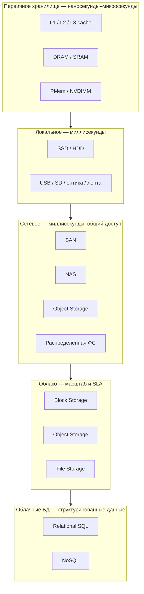

# Современные системы хранения данных

  ОБЯЗАТЕЛЬНО
  ДЛЯ НОВИЧКОВ

Всем

---

## Зачем нужна классификация

В любой IT-системе данные лежат на **разных уровнях** — от кэша внутри процессора до распределённого объектного хранилища в облаке. У каждого уровня свой баланс **скорости**, **объёма**, **стоимости** и **долговечности.

CPU cache и RAM дают минимальную задержку и нужны для быстрых вычислений «здесь и сейчас». Локальные диски и сетевые массивы — для постоянного хранения на стороне организации. Облачные сервисы и managed-базы данных — для масштабирования, отказоустойчивости и эксплуатации без собственного ЦОД.

Ниже — пять основных групп, которые встречаются в современных архитектурах.

---

## Первичное хранилище (Primary Storage)

Самый быстрый слой — память, к которой процессор обращается напрямую.

| Компонент | Суть | Типичное применение |
|-----------|------|---------------------|
| **CPU Cache** (L1, L2, L3) | Микроскопические буферы на кристалле процессора | Инструкции и горячие данные текущего потока |
| **DRAM** (Dynamic RAM) | Основная оперативная память ПК и серверов | Код, стек, heap, буферы ОС |
| **SRAM** (Static RAM) | Быстрее DRAM, дороже; часть кэша и регистров | Кэш процессора, буферы контроллеров |
| **PMem / NVDIMM** (Persistent Memory) | Байт-адресуемая память с сохранением после отключения питания | Ускорение БД, большие in-memory кэши с persistence |

  
Связь с железом ПК

  Подробнее про роли CPU и RAM в настольном компьютере — в статье [Аппаратное обеспечение](./1.md). Классификация RAM, ROM, SRAM, DRAM и бытовых накопителей — в [главе для новичка](/encyclopedia/1-basics/1-08-kak-rabotaet-kompyuter/12). Когда RAM не хватает, ОС использует **swap** — часть данных выгружается на диск ([глоссарий](/glossary/С#своп)).

**Ключевой признак:** данные здесь **volatile** (кроме PMem) — при обесточивании содержимое DRAM теряется.

### Коды исправления ошибок (ECC)

В DRAM из‑за всплесков напряжения и космических частиц иногда **портится бит**. На десктопах это редко заметно; на серверах с большими объёмами RAM — статистически неизбежно.

| Механизм | Суть | Где встречается |
|----------|------|-----------------|
| **Parity** | Один контрольный бит на слово — **обнаружение** одиночной ошибки | Старые модули, часть embedded |
| **ECC** (Error-Correcting Code) | Дополнительные биты по алгоритму Хэмминга — **исправление** 1 бита, обнаружение 2 | Серверная RAM (DDR4/5 ECC), некоторые workstation |

К **кодовому слову** из *m* бит данных добавляют *r* контрольных бит; при чтении контроллер проверяет допустимость комбинации. **Интервал Хэмминга** между кодовыми словами задаёт, сколько ошибок можно обнаружить или исправить: для исправления *d* однобитовых ошибок нужен интервал не меньше *2d + 1*.

На HDD и SSD ECC встроен на уровне **сектора** (вместе с преамбулой и служебными полями) — контроллер диска прозрачно восстанавливает или помечает bad block. Это другой слой, чем ECC в RAM, но идея та же: **избыточность для надёжности**.

  
ECC в ПК vs сервер

  Обычный ноутбук с «non-ECC» RAM полагается на редкость сбоев. Сервер с терабайтами памяти и критичными БД — ECC и логирование corrected errors в BMC.

---

## Локальное хранилище (Local Storage)

Физические носители, подключённые к одному компьютеру или серверу.

| Тип | Технология | Когда уместен |
|-----|------------|---------------|
| **HDD** | Магнитные пластины, механика | Архив, медиатека, холодные копии — большой объём за меньшие деньги |
| **SSD** | Флэш-память (NAND) | ОС, приложения, рабочие проекты — высокие IOPS и низкая latency |
| **USB-накопитель** | Флэш в переносном корпусе | Перенос файлов, загрузочные флешки |
| **SD-карта** | Компактная флэш-память | Камеры, одноплатники, мобильные устройства |
| **Оптический диск** | CD / DVD / Blu-ray | Долговременный архив, дистрибутивы (реже в 2020-х) |
| **Магнитная лента** | Ленточные накопители (LTO) | Корпоративный backup и архив — дёшево за ТБ, медленный random access |

Сравнение HDD и SSD в контексте сборки ПК — в разделе [Постоянные носители](./1.md#постоянные-носители-данных--хранилище-информации) статьи про аппаратное обеспечение.

### Компромиссы иерархии памяти

Классическая **пирамида** (регистры → кэш → RAM → SSD → HDD → лента) отражает три оси одновременно:

| Ось | Вверх пирамиды (к CPU) | Вниз пирамиды |
|-----|------------------------|---------------|
| **Скорость / latency** | Выше | Ниже (механика, сеть) |
| **Стоимость за ГБ** | Дороже | Дешевле |
| **Объём** | Меньше | Больше |

Процессоры за десятилетия ускорились сильнее дисков: random seek на HDD остаётся порядка миллисекунд, тогда как кэш — наносекунды. Поэтому **последовательное чтение** с одного цилиндра HDD даёт высокую мегабайтную скорость, а **случайные мелкие запросы** — узкое место. SSD снимает механику, но дороже за ТБ; лента — почти бесплатна за объём, но без random access.

Подробнее про кэш и locality — [Память и накопители для новичка](/encyclopedia/1-basics/1-08-kak-rabotaet-kompyuter/12#kesh-protsessora).

### RAID — массивы дисков

**RAID** (Redundant Array of Independent Disks) — несколько физических дисков, которые ОС или контроллер видит как **один логический том**. Идея: параллелить I/O и/или добавить избыточность без переписывания приложений.

| Уровень | Идея | Производительность | Отказоустойчивость |
|---------|------|--------------------|--------------------|
| **RAID 0** | **Striping** — полосы секторов по кругу на N дисках | Высокая на больших последовательных запросах | **Нет** — отказ одного диска = потеря всего массива |
| **RAID 1** | **Зеркало** — каждая полоса на двух дисках | Чтение быстрее (параллельные копии) | Выдерживает отказ одного диска |
| **RAID 5** | Striping + **распределённая чётность** по дискам | Хороший баланс | Один диск может выйти из строя |
| **RAID 10** | RAID 1 + RAID 0 (зеркалированные пары, затем striping) | Часто в production | Высокая, ценой 50% дисков |

**RAID 0** не даёт redundancy — это чистый striping. **RAID 1** удвоение ёмкости не даёт, зато проще восстановление. На практике аппаратный RAID-контроллер или **ZFS/mdadm** в Linux скрывают геометрию от приложения.

  
RAID — это не backup

  RAID защищает от <strong>отказа диска</strong>, но не от удаления файла, ransomware или пожара в ЦОД. Резервные копии — отдельный слой (NAS, object storage, лента).

---

## Сетевое хранилище (Networked Storage)

Данные доступны по сети — нескольким серверам или рабочим станциям одновременно.

| Тип | Уровень доступа | Протоколы / примеры | Типичные задачи |
|-----|----------------|---------------------|-----------------|
| **SAN** (Storage Area Network) | **Блочный** — сервер видит «локальный диск» | Fibre Channel, iSCSI, NVMe-oF | Кластеры виртуализации, СУБД с высокими IOPS |
| **NAS** (Network Attached Storage) | **Файловый** — каталоги и права | SMB/CIFS, NFS | Общие папки, backup, медиафайлы |
| **Object Storage** | **Объектный** — ключ + метаданные + тело | S3 API, MinIO, Ceph RGW | Архивы, логи, статика, backup |
| **Distributed File System** | Файловый, распределённый по узлам | HDFS, GlusterFS, CephFS | Big Data, общие тома в кластере |

  
Блочное и файловое

  **SAN** отдаёт «сырой» том — поверх него ОС создаёт разделы и файловую систему. **NAS** сразу предоставляет готовые каталоги по сетевому протоколу. Выбор зависит от того, нужен ли серверу «свой диск» или «общая шара».

Подробнее про SAN, NAS и объектное хранилище в корпоративной инфраструктуре — в главе [ИТ-инфраструктура](/encyclopedia/2-system-network/2-06-sistemnoe-administrirovanie/3.md#хранилища).

---

## Облачное хранилище (Cloud Storage)

Управляемые сервисы провайдеров (AWS, Azure, Google Cloud, Yandex Cloud и др.). Пользователь платит за объём, операции и исходящий трафик; масштабирование и репликация — на стороне облака.

### Блочное хранилище (Block Storage)

Отдельные тома, которые монтируются к виртуальной машине как диски.

| Провайдер | Сервис |
|-----------|--------|
| AWS | **EBS** (Elastic Block Store) |
| Azure | **Managed Disks** |
| Google Cloud | **Persistent Disk (PD)** |

Подходит для системных дисков ВМ, СУБД, приложений с произвольным чтением/записью блоков.

### Объектное хранилище (Object Storage)

Неограниченно масштабируемое хранилище неструктурированных данных по HTTP API.

| Провайдер | Сервис |
|-----------|--------|
| AWS | **S3** |
| Azure | **Blob Storage** |
| Google Cloud | **Cloud Storage** |

Типичные сценарии — бэкапы, статика сайтов, data lake, версионирование файлов.

### Файловое хранилище (File Storage)

Управляемые сетевые файловые шары.

| Провайдер | Сервис |
|-----------|--------|
| AWS | **EFS** (Elastic File System) |
| Azure | **Azure Files** |
| Google Cloud | **Filestore** |

Удобно, когда нескольким ВМ нужен **общий каталог** по NFS или SMB без собственного NAS.

---

## Облачные базы данных (Cloud Databases)

Managed-сервисы: провайдер берёт на себя патчи, репликацию, backup и масштабирование. Приложение подключается по сети через драйвер или API.

### Реляционные (SQL)

| Провайдер | Примеры сервисов |
|-----------|------------------|
| AWS | **RDS** (PostgreSQL, MySQL, MariaDB, SQL Server, Oracle) |
| Azure | **Azure SQL**, **Azure Database for PostgreSQL/MySQL** |
| Google Cloud | **Cloud SQL** |

ACID-транзакции, строгая схема, JOIN — классика для учёта, заказов, профилей пользователей.

### NoSQL

| Провайдер | Примеры сервисов |
|-----------|------------------|
| AWS | **DynamoDB** (ключ-значение / документы) |
| Google Cloud | **Bigtable** (ширококолоночная) |
| Azure | **Cosmos DB** (мультимодельная) |

Горизонтальное масштабирование, гибкая схема, высокая пропускная способность — логи, сессии, каталоги с миллионами SKU, IoT-потоки.

  
Storage и база данных — разные слои

  Объектное хранилище (S3) держит **файлы и blob'ы**. Managed SQL/NoSQL — **структурированные записи** с индексами и запросами. В веб-приложении часто сочетают оба слоя: PostgreSQL для транзакций, S3 для вложений ([архитектура веб-приложения](/encyclopedia/2-system-network/2-04-kak-rabotayut-sayty-i-veb-sayty/1.md)).

Эволюция **моделей данных** (файлы → иерархия → SQL → NoSQL) — отдельная тема в [Эволюция систем хранения данных](/encyclopedia/3-data-markup/3-07-sql/102.md).

---

## Как выбирать уровень

| Критерий | Ближе к CPU/RAM | Ближе к облаку |
|----------|-----------------|----------------|
| **Latency** | Наносекунды – микросекунды | Миллисекунды – десятки мс (сеть) |
| **Объём на единицу стоимости** | Меньше, дороже за ГБ | Больше, дешевле за ТБ |
| **Долговечность** | Volatile (RAM) или локальный диск | Репликация, geo-redundancy, SLA |
| **Масштабирование** | Ограничено железом одной машины | Горизонтально, по запросу |
| **Эксплуатация** | Админ сервера / пользователь ПК | Managed-сервис провайдера |

Практическое правило: **горячие** данные — ближе к процессору (кэш, RAM, локальный NVMe); **холодные** архивы и shared-контент — object storage или лента; **транзакционные** записи — СУБД (своё железо или managed).

---

## Краткая шпаргалка

| Группа | Примеры | Главный вопрос |
|--------|---------|----------------|
| Первичное | L1–L3, DRAM, PMem | «Что процессор читает прямо сейчас?» |
| Локальное | SSD, HDD, USB, SD | «Где лежат файлы на этом компьютере?» |
| Сетевое | SAN, NAS, Ceph, MinIO | «Как серверы делят диски и каталоги?» |
| Облачное | EBS, S3, EFS | «Какой managed-том или bucket нужен ВМ?» |
| Облачные БД | RDS, DynamoDB, Cosmos DB | «Где хранятся строки с запросами и индексами?» |

---

## Куда читать дальше

- [Аппаратное обеспечение](./1.md) — CPU, RAM, SSD/HDD в составе ПК
- [ИТ-инфраструктура](/encyclopedia/2-system-network/2-06-sistemnoe-administrirovanie/3.md) — SAN, NAS, RAID, окружения DEV/PROD
- [Эволюция систем хранения данных](/encyclopedia/3-data-markup/3-07-sql/102.md) — от файлов к SQL и NoSQL
- [Хранение данных в браузере и на сервере](/encyclopedia/2-system-network/2-04-kak-rabotayut-sayty-i-veb-sayty/116.md) — localStorage, IndexedDB, backend
- [NoSQL — о разделе](/encyclopedia/3-data-markup/3-06-nosql/intro) — Redis, MongoDB, Cassandra в коде
