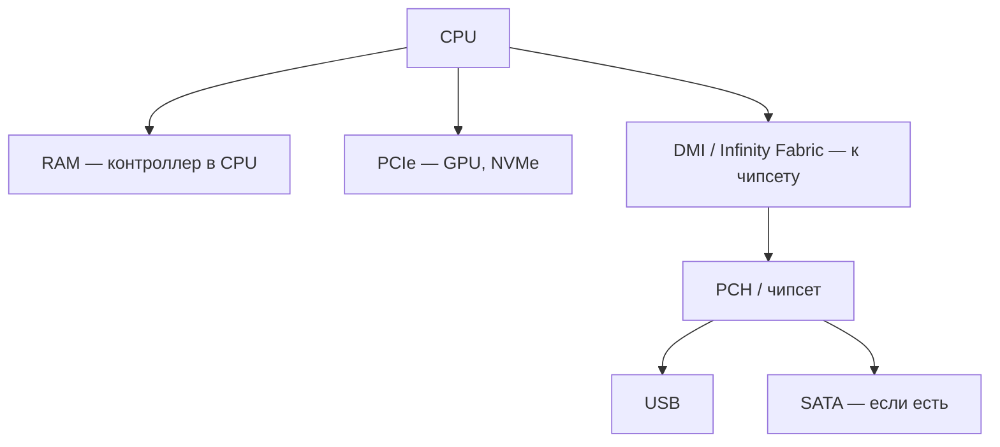

---
tags:
  - all
  - engineer
title: Шины компьютера — обзор
description: >-
  Шина данных, адреса и управления; синхронные и последовательные шины; арбитраж
  и иерархия от системной шины до PCIe и USB.
related:
  - title: "Архитектура фон Неймана"
    doc: encyclopedia/2-system-network/2-10-zhelezo/11
  - title: "Компоненты железа"
    doc: encyclopedia/1-basics/1-08-kak-rabotaet-kompyuter/2
  - title: "Аппаратное обеспечение"
    doc: encyclopedia/2-system-network/2-10-zhelezo/1
  - title: "Порядок байтов — endianness"
    doc: encyclopedia/2-system-network/2-10-zhelezo/123
---

# Шины компьютера — обзор

  ОБЯЗАТЕЛЬНО

Инженеру

**Шина** — общий набор линий, по которым CPU, память и устройства обмениваются **адресами**, **данными** и **управляющими сигналами**. Без шины каждое устройство потребовало бы отдельного кабеля к процессору — так не масштабируется. В [архитектуре фон Неймана](/encyclopedia/2-system-network/2-10-zhelezo/11) шина — связующее звено между функциональными блоками.

Подробная таблица PCIe и M.2 — в [Компонентах железа](/encyclopedia/1-basics/1-08-kak-rabotaet-kompyuter/2); здесь — общая модель, пригодная и для ПК, и для встраиваемых AMBA/APB.

---

## Три составляющие классической шины

| Линии | Назначение |
|-------|------------|
| **Шина адреса** | Куда обращаемся — номер ячейки RAM или регистра устройства |
| **Шина данных** | Что передаём — слово данных (8, 16, 32, 64 бита за такт) |
| **Шина управления** | Чтение или запись, готовность, прерывание, такт |

Один цикл обмена: CPU выставляет **адрес** и сигнал **read/write**; устройство-источник или приёмник кладёт байты на **линии данных**. Разрядность адресной шины задаёт максимум RAM (32 бита → 4 ГБ без расширений; 64 бита → теоретически эксабайты).

---

## Параллельные и последовательные шины

| Тип | Идея | Примеры |
|-----|------|---------|
| **Параллельная** | Много бит одновременно по отдельным проводам | Старая ISA, параллельный ATA |
| **Последовательная** | Поток бит по одной или нескольким дифф-парам | **PCIe**, **USB**, SATA |

Последовательные шины выигрывают на высоких частотах: меньше проблем синхронизации длинных параллельных шлейфов. Современный ПК почти полностью на PCIe и USB; параллельная шина осталась в истории и в обзорных курсах по архитектуре.

---

## Иерархия шин в ПК

**Быстрые** устройства (видеокарта, NVMe) часто сидят на линиях **CPU**. **Медленные** (USB-контроллер, аудио, SATA через чипсет) — за **DMI** с ограниченной пропускной способностью. Поэтому NVMe в слоте M.2 «от чипсета» может уступать слоту «от CPU» — это не маркетинг, а топология шины.

---

## Синхронизация и такт

**Синхронная шина** работает от общего **тактового сигнала** — передача привязана к фронтам clock. **Асинхронная** использует handshaking (REQ/ACK): медленное устройство само сообщает «готово».

PCIe — последовательная с встроенным кодированием и ACK на уровне пакетов; USB — host-driven с опросом или прерываниями. Принцип тот же: **инициатор** (master) начинает транзакцию, **цель** (slave) отвечает.

---

## Арбитраж — кто говорит первым

Если к одной шине подключено несколько **master**-устройств (CPU, DMA-контроллер, иногда GPU), нужен **арбитр** — схема, которая выдаёт право на шину одному претенденту за раз.

| Механизм | Суть |
|----------|------|
| **Fixed priority** | CPU всегда важнее DMA или наоборот |
| **Round-robin** | Очередь по кругу |
| **Burst** | Устройство держит шину несколько тактов подряд (важно для DMA) |

**DMA** (Direct Memory Access) позволяет диску или сетевой карте писать в RAM **без участия CPU** на каждый байт — арбитраж и DMA описаны подробнее в [ОС — ввод-вывод](/encyclopedia/2-system-network/2-01-operatsionnaya-sistema/5120).

---

## Шины во встраиваемых системах

На одноплатниках и MCU та же модель, другие имена:

| Шина | Роль |
|------|------|
| **AXI** | Высокоскоростная — CPU, память, DMA |
| **AHB** | Средний уровень |
| **APB** | Медленная периферия — UART, GPIO, I²C |

Подробнее — [Встраиваемые системы](/encyclopedia/2-system-network/2-10-zhelezo/112) (Memory-Mapped I/O и RK3328).

---

## Куда читать дальше

- [Архитектура фон Неймана](/encyclopedia/2-system-network/2-10-zhelezo/11) — системная шина в классической модели
- [Компоненты железа](/encyclopedia/1-basics/1-08-kak-rabotaet-kompyuter/2) — PCIe, M.2, версии и скорости
- [Многоуровневая организация](/encyclopedia/1-basics/1-08-kak-rabotaet-kompyuter/13) — цифровой и микроархитектурный уровни
