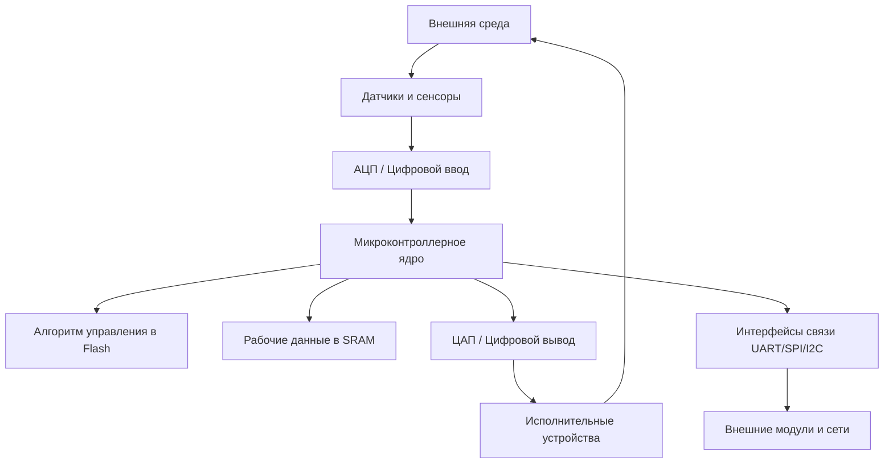

# Микроконтроллерные системы и платформы

<div class="article-tags">
  <span class="tag tag-required">ОБЯЗАТЕЛЬНО</span>
  <span class="tag tag-beginner">ДЛЯ НОВИЧКОВ</span>
</div>

<span class="complexity-badge">Всем</span>

---

## Микроконтроллерные системы и платформы

### Определение и базовые принципы микроконтроллерных систем

Представьте, что микроконтроллер — это мозг, но не человека, а, скажем, робота-пылесоса или стиральной машинки. Это крошечная микросхема, внутри которой есть всё, чтобы думать (процессор), помнить (память) и общаться с внешним миром (входы-выходы).

В отличие от мощного процессора в вашем компьютере (который может тормозить и подвисать, когда вы открываете 100 вкладок браузера), микроконтроллер обязан работать как часы. Если он чуть задумается, то, например, подушка безопасности в машине не сработает вовремя. Его главная задача — делать одно и то же действие с идеальной точностью каждую миллисекунду и тратить при этом минимум энергии (работать годами от одной батарейки).

Микроконтроллерная система представляет собой специализированное вычислительное устройство, объединяющее процессорное ядро, память программ, память данных и периферийные интерфейсы в едином кристалле для выполнения задач управления в реальном времени. Разберем его на части, как конструктор:
- Управляющее ядро (Мозг): Это "диспетчер". Он читает инструкцию, которую вы ему написали (программу), и решает, что делать дальше: сложить два числа, включить мотор или подождать.
- Память программ (Flash): Это "книга инструкций". Туда один раз записывают вашу программу, и она остается там даже после выключения питания.
- Память данных (SRAM): Это "листок для заметок". Пока устройство работает, сюда он записывает текущие показания датчиков (например, "сейчас температура 25 градусов") и промежуточные результаты.
- Порты ввода-вывода (Ноги/Контакты): Это "руки и глаза" микроконтроллера. Через одни ножки он слушает мир (получает сигналы от датчиков), через другие — командует (включает светодиоды, крутит моторы).

Принципиальное отличие микроконтроллерных систем от универсальных процессоров заключается в ориентации на детерминированное выполнение алгоритмов управления с гарантированными временными характеристиками, минимальном энергопотреблении и непосредственном взаимодействии с физической средой через порты ввода-вывода.

- **Управляющее ядро** микроконтроллера выполняет функции центрального процессора, обрабатывая инструкции программы, хранящейся во встроенной flash-памяти, и осуществляя арифметико-логические операции над данными в оперативной памяти SRAM. 
- **Входные устройства**, представленные датчиками температуры, давления, освещённости, акселерометрами и другими преобразователями физических величин в электрические сигналы, обеспечивают поступление информации о состоянии внешней среды в цифровом формате. 
- **Выходные устройства**, включающие реле, сервоприводы, светодиодные индикаторы, дисплеи и исполнительные механизмы, реализуют управляющие воздействия на основе результатов вычислений. 
- **Интерфейсы связи**, такие как UART, SPI, I2C, CAN и беспроводные протоколы, обеспечивают обмен данными между микроконтроллером и внешними устройствами, сенсорами или сетевыми узлами.



Представьте, что микроконтроллер — это начальник, а датчик влажности — это подчиненный. Чтобы спросить данные, начальник может использовать разные манеры общения:
- либо громко крикнуть через всю комнату (SPI — быстро, но много проводов),
- либо тихо перешептываться по двум проводам (I2C — медленнее, но экономит место на плате).

Давайте представим, что микроконтроллер стоит в умном утюге. Его работа — это бесконечный зацикленный процесс, который длится, пока утюг включен в розетку. Он делает три шага снова и снова:
- Сбор данных (Посмотреть): Микроконтроллер смотрит на датчик температуры подошвы утюга. Он видит: "Сейчас `180` градусов".
- Обработка (Подумать): Он заглядывает в свою "инструкцию" (Flash) и видит правило: "Если меньше `190` градусов — включить ТЭН (нагреватель)". Он понимает, что `180 < 190`, значит, надо греть.
- Воздействие (Сделать): Он подает напряжение (сигнал) на выходную ножку, к которой подключен нагреватель. ТЭН включается.

Через долю секунды цикл повторяется:
- Посмотрел — стало `185` градусов.
- Подумал — всё равно меньше `190`.
- Нагреваем дальше.

И так до бесконечности, пока вы не выдерните вилку. Это и есть "**детерминированное выполнение**" — он никогда не забывает проверить температуру, даже если вы нажали на кнопку, он сначала сделает цикл, а потом обработает нажатие кнопки.

Если нарисовать его работу просто, получится так:

```mermaid
graph LR
    A[Реальный мир (Комната)] --> B[Датчики (Термометр, кнопка)]
    B --> C[Микроконтроллер (Смотрит + Думает)]
    C --> D[Исполнители (Нагреватель, лампочка)]
    D --> A[Реальный мир (Стало теплее/светлее)]
    
    C -.-> E[Модуль Bluetooth (Передает статистику в телефон)]
```

Принцип работы микроконтроллерной системы основан на непрерывном цикле выполнения, называемом циклом реального времени, который включает последовательные этапы сбора данных, обработки информации и формирования управляющих воздействий. Микроконтроллер выполняет опрос подключённых датчиков с заданной периодичностью, фиксируя изменения контролируемых параметров физической среды. 

Микроконтроллерная система — это маленький вечный надзиратель, который смотрит на показатели с датчиков, сверяет их с вашими командами (программой) и дергает за нужные "веревочки" (моторы/реле), чтобы поддерживать порядок в устройстве, пока у него есть питание.

Процессорное ядро сопоставляет полученные значения с алгоритмом, загруженным в память программ, осуществляя проверку условий, вычисление управляющих сигналов и принятие решений согласно заложенной логике. 

Система формирует выходные сигналы для исполнительных устройств, обеспечивая требуемое воздействие на управляемый объект с соблюдением временных ограничений, заданных требованиями реального времени.

---

### Сравнительный анализ архитектурных платформ

| Характеристика | AVR (ATmega328P) | ESP32 (базовая серия) | Raspberry Pi Pico (RP2040) |
|---------------|-----------------|---------------------|---------------------------|
| Разрядность | 8 бит | 32 бита | 32 бита |
| Архитектура ядра | Harvard RISC (собственная) | Harvard RISC (Xtensa LX6 / RISC-V) | ARM Cortex-M0+ |
| Количество ядер | 1 ядро | 2 ядра (в большинстве моделей) | 2 ядра |
| Тактовая частота | до 16–20 МГц | до 240 МГц | до 133 МГц (стабильно разгоняется) |
| Объём ОЗУ (SRAM) | 2 КБ | 520 КБ | 264 КБ |
| Связь (Wi-Fi/BT) | Нет | Встроены (Wi-Fi 4 + BLE) | Нет (есть в версии Pico W) |
| Главная особенность | Максимальная простота, предсказуемость | Беспроводная связь, высокая скорость | Блоки PIO (программируемый ввод-вывод) |

---

### Архитектурные особенности платформы AVR

AVR — это марка (тип) микроконтроллера, придуманная фирмой Atmel. Если микроконтроллер — это «мозг», то AVR — это конкретная модель этого мозга. Он сделан по определенным правилам (Гарвардская архитектура, 8 бит — это как размер его «мыслей»).

Платформа **AVR** представляет собой классическую архитектуру микроконтроллеров, разработанную компанией **Atmel** (в настоящее время Microchip Technology), на базе которой построены устройства серии Arduino Uno и другие популярные платформы для встраиваемых систем. 

Восьмибитная организация процессора обеспечивает обработку данных блоками по восемь бит, что определяет эффективность выполнения простых арифметических и логических операций при ограниченной производительности в задачах с плавающей запятой и сложными математическими вычислениями. 

AVR очень быстрый и честный. Если вы дали команду «включи свет», он включит свет ровно через 0,000001 секунды (за 1 такт), и всегда будет включать за одно и то же время. Это важно для роботов, чтобы они не дергались.

Регистры - это его личные «карманы» для данных. Это значит, что вы можете ткнуть пальцем в конкретную ячейку памяти внутри микросхемы и грубо сказать: «Ножка номер 5 — работай!». Это быстро, но сложно.

**Arduino** — это НЕ микроконтроллер. Это готовая плата (или целая экосистема), в которую этот микроконтроллер AVR впаян. Есть микрочип AVR размером с ноготь. Чтобы он заработал, ему нужно дать питание, припаять кварцевый резонатор (для тактов), вывести провода для прошивки... Это сложно.

Arduino берет этот чип AVR, припаивает его на свою плату, добавляет все необходимые «обвязки» (стабилизатор питания, USB-разъем, кнопку сброса) и, самое главное, выводит все нужные ножки в удобные разъемы.
- Вы берете плату Arduino Uno. Внутри нее сидит микроконтроллер ATmega328P — это как раз представитель семейства AVR.
- Если AVR — это голый двигатель, то Arduino — это готовый автомобиль, в который вы садитесь и едете.


Гарвардская архитектура реализует физическое разделение памяти программ (Flash) и памяти данных (SRAM), позволяя микроконтроллеру одновременно осуществлять выборку инструкции и доступ к данным, что повышает пропускную способность системы команд.

Аппаратная предсказуемость платформы AVR проявляется в детерминированном времени выполнения большинства инструкций, составляющем ровно один такт тактовой частоты, что обеспечивает возможность реализации систем жёсткого реального времени с точностью управления до микросекундного диапазона. 

Прямое управление регистрами периферийных модулей позволяет разработчику осуществлять конфигурацию портов ввода-вывода, таймеров, последовательных интерфейсов и других компонентов через запись значений в 8-битные регистры специального назначения, минуя уровни абстракции высокоуровневых библиотек. 

Средство разработки **Arduino IDE** предоставляет интегрированную среду для написания, компиляции и загрузки программ на микроконтроллеры AVR, используя упрощённый синтаксис языка C++ и набор готовых библиотек для работы с периферией.

Чтобы заставить микроконтроллер работать, ему нужно написать программу. Но микроконтроллер AVR понимает только сложный машинный код (*Ассемблер*). Писать на нем — это как забивать гвозди микроскопом.

Arduino IDE — это простая программа для компьютера (редактор кода), которая позволяет вам писать команды на упрощенном языке (почти как C++), а затем она сама переводит ваши простые слова в тот сложный язык, который поймет чип AVR, и заливает (прошивает) его через USB-кабель.

Как это работает на практике:
- Вместо того чтобы копаться в регистрах (как в том сложном тексте: «записать значение 0b00100000 в регистр DDRB»), вы пишете простую фразу: `digitalWrite(13, HIGH);` (что означает: «Включи светодиод на 13-й ножке»).
- Arduino IDE берет эту вашу фразу, переводит в понятный AVR код и загружает в память микроконтроллера.

---

### Архитектурные особенности платформы ESP32

AVR (Arduino Uno) — это маленькая мастерская, где вы руками управляете одной лампочкой. ESP32 — это смартфон, у которого есть вайфай, два мозга, он сам следит за батарейкой и шифрует данные, чтобы их не украли.

Платформа **ESP32**, разработанная компанией **Espressif Systems**, ориентирована на применение в устройствах интернета вещей и системах умного дома, где требуется сочетание вычислительной производительности, энергоэффективности и встроенных средств беспроводной связи.

В ESP32 внутри не одно ядро, как в AVR, а целых два. Представьте, что вы управляете роботом-пылесосом:
- Ядро 1 постоянно «болтает» с вашим роутером по Wi-Fi, чтобы вы могли видеть карту комнаты в приложении.
- Ядро 2 в это же время спокойно объезжает диван и собирает пыль.

Если бы это делал старый AVR, ему пришлось бы делать это по очереди: то чуть-чуть убраться, то остановиться, чтобы отправить сигнал по Wi-Fi. Пылесос бы дергался. Здесь же все делается **одновременно** (параллельно). Это и есть "распределение нагрузки".

Двухъядерная структура процессора на базе архитектуры Xtensa LX6 (или RISC-V в новых модификациях) позволяет распределять вычислительную нагрузку между ядрами, при этом одно ядро часто выделяется для обслуживания стека сетевых протоколов Wi-Fi и Bluetooth Low Energy, а второе ядро выполняет пользовательский код приложения, что исключает блокировки основного потока при сетевой активности.

Сопроцессор Ultra Low Power представляет собой специализированное микроядро с минимальным энергопотреблением, способное выполнять периодический опрос датчиков и обработку простых условий пробуждения основных ядер из режима глубокого сна, что обеспечивает существенную экономию заряда батареи в автономных устройствах. 

Представьте, что основные ядра (два повара) — это мощные, но очень прожорливые двигатели. Если они работают постоянно, батарейка сядет за час. Вы ставите датчик температуры на улице, который работает от одной батарейки год. Основные ядра спят (выключены). А есть маленькое микро-ядрышко (ULP), которое потребляет крохи энергии. Оно только одно умеет: раз в минуту просыпаться, тыкать палочкой в термометр и проверять: «Не стало ли холоднее -10 градусов?».
- Если НЕТ — он снова засыпает, большие ядра не просыпаются.
- Если ДА (стало холодно) — он стучит по большим ядрам: «Просыпайтесь, хозяин, пора включать подогрев!». Это позволяет устройствам работать годами от батарейки.

AVR умеет мигать лампочкой, а ESP32 умеет общаться с интернетом. Но в интернете данные могут перехватить хакеры.

На AVR, если бы вы вздумали шифровать данные, процессор бы тупил несколько секунд. На ESP32 шифрование происходит мгновенно и бесплатно для производительности. Поэтому ваш умный чайник не взломают, и пароль от Wi-Fi не утечет.

Аппаратные ускорители криптографических алгоритмов, включая модули AES, SHA-2 и RSA, реализованы на уровне кремния и позволяют выполнять операции шифрования и цифровой подписи без нагрузки на основные вычислительные ядра, обеспечивая безопасную передачу данных по протоколам HTTPS и MQTT. 

Матричная система коммутации ввода-вывода (Matrix IO) предоставляет возможность программного назначения сигналов внутренней периферии, таких как UART, SPI, I2C и ШИМ, на произвольные физические выводы микроконтроллера, что повышает гибкость проектирования печатных плат и упрощает трассировку соединений.

На AVR каждая ножка микросхемы жестко привязана к своей функции. Например, если вы захотели подключить дисплей к ножке №5, но дорожки на плате так легли, что удобнее подключить к ножке №7 — вам не повезло. Придется переделывать плату. У ESP32 ножки *гибкие*. Вы можете в программе сказать: «Хочу, чтобы сигнал ШИМ (управление яркостью) шел через ножку №12», а потом передумать и сказать: «Нет, пусть идет через №15». Это как гибкий шланг, который можно переставить куда угодно. Это сильно упрощает создание плат (трассировку).

ESP32 берут тогда, когда ваше устройство должно общаться с интернетом (умный дом, метеостанция с графиками, управление роботом через телефон) и при этом не разряжать батарейку за час. Если вам нужно просто помигать светодиодом или почитать кнопку — берите AVR. Если нужен «интернет вещей» — ваш выбор только ESP32.

---

### Архитектурные особенности платформы Raspberry Pi Pico

Raspberry Pi Pico — это плата, а внутри нее стоит микросхема (чип) с названием RP2040. Его сделала та же британская компания, которая делает знаменитые мини-компьютеры Raspberry Pi (малинки). Но, в отличие от них, Pico — это не компьютер, а именно микроконтроллер (как AVR или ESP32). Он нужен, чтобы дергать проводами и управлять железом.

Микроконтроллер **RP2040**, разработанный командой **Raspberry Pi** для платформы **Raspberry Pi Pico**, представляет собой современное решение на базе двух симметричных ядер ARM Cortex-M0+, работающих с тактовой частотой до 133 МГц и обладающих идентичной архитектурой, что позволяет разработчику гибко распределять задачи между ядрами без ограничений асимметричных мультипроцессорных систем. 

У ESP32 тоже два ядра, но там они разные по назначению (одно для Wi-Fi, другое для кода). У RP2040 ядра симметричные (абсолютно одинаковые и мощные). Это как два абсолютно равных грузчика. Вы можете сказать: «Петя, ты считай математику, а Вася, ты в это время опрашивай 10 датчиков». Или вы можете сказать: «Ребята, давайте вдвоем считать одну очень сложную задачу». У вас полная свобода, как делить работу. При этом они работают очень шустро (133 МГц — это в 10 раз быстрее старого AVR).

Уникальная особенность архитектуры RP2040 заключается в наличии программируемых блоков ввода-вывода PIO (Programmable I/O), представляющих собой независимые микропроцессоры с собственными инструкциями, предназначенные для аппаратной реализации произвольных протоколов обмена данными и управления сигналами на выводах без участия основных вычислительных ядер.

Представьте, что главные ядра (Петя и Вася) — это великие математики. Вы просите их помигать светодиодом в строгом ритме. Пока они мигают, они не могут решать сложные задачи — они заняты.

**PIO** — это маленькие тупые, но очень быстрые «микророботы», которые припаяны рядом с ножками. Вы можете запрограммировать их всего одной короткой инструкцией и сказать: «Так, ребята, пока главные мозги решают уравнение, вы, PIO-шки, сами моргайте этой ножкой с точностью до наносекунды или имитируйте сигнал от старого дисковода».

Это позволяет:
- Генерировать сложные сигналы для светодиодных лент (WS2812) без тормозов.
- Эмулировать старые компьютерные порты.
- Считывать данные с энкодеров с бешеной скоростью.

Главные ядра вообще не отвлекаются на эту ерунду!

Отсутствие встроенной flash-памяти в кристалле RP2040 определяет архитектуру системы, в которой программа хранится во внешней микросхеме QSPI Flash на печатной плате, а микроконтроллер осуществляет выборку инструкций через высокоскоростной кэш-интерфейс, что обеспечивает гибкость в выборе объёма памяти программ и упрощает обновление прошивки. 

У AVR и ESP32 программа хранится внутри самого чипа. У RP2040 — нет. Это звучит как минус, но на деле это плюс. Память (Flash) в RP2040 находится снаружи, как флешка, припаянная рядом на плате.

Развитая система прямого доступа к памяти (DMA) позволяет периферийным модулям осуществлять передачу данных непосредственно в оперативную память SRAM или из неё, минуя процессорное ядро, что снижает нагрузку на вычислительные ресурсы и повышает пропускную способность каналов ввода-вывода при работе с большими объёмами данных, такими как аудиопотоки или данные с высокоскоростных сенсоров.

DMA — это такой аппаратный «почтальон». Вы говорите процессору: «Отдыхай, я сам». Процессор настраивает маршрут, а DMA-контроллер сам перегоняет огромные куски данных из памяти в динамик (или с датчика в память), пока процессор занимается своими делами. Это очень ускоряет работу с графикой, звуком или видеопотоками.

Этот микроконтроллер создан для любителей модифицировать все вокруг. Если ESP32 хорош, когда нужно уметь подключаться к интернету, то Pico хорош, когда нужно выжать максимум производительности из каждой ножки.

Если у вас есть странный китайский дисплей, для которого нет готовой библиотеки, вы можете на PIO запрограммировать протокол передачи данных под него за 5 минут, и работать он будет идеально. Это выбор инженера, который любит контролировать процесс до последнего микросекундного импульса.

---