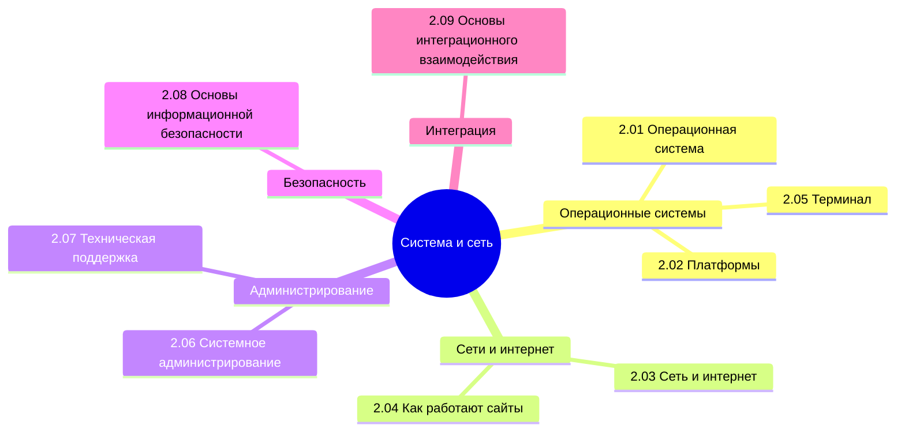

  ОБЯЗАТЕЛЬНО
  ДЛЯ НОВИЧКОВ
  В РАЗРАБОТКЕ

import DocCardList from '@theme/DocCardList';

## О разделе

<DocCardList />

Приветствую! Надеюсь, вы ознакомились с первыми шагами и готовы продвигаться дальше. Если поначалу мы только разгонялись, с целью разобраться, как вообще всё устроено - от устройства компьютера до особенностей ведения бизнеса в сфере информационных технологий, то сейчас мы уже считаемся продвинутыми пользователями. Теперь мы переходим к более сложным и специализированным темам, и поэтому придётся думать и работать, и конечно много учить.

---
