---
title: 2.01. Виды операционных систем
---

# 2.01. Виды операционных систем

  ОБЯЗАТЕЛЬНО
  ДЛЯ НОВИЧКОВ
  НЕ ДЛЯ НОВИЧКОВ
  В РАЗРАБОТКЕ

Разработчику
Архитектору
Инженеру

## Виды операционных систем

  
Внимание

  Приготовьтесь!
Страшные слова	
На самом деле, знать все системы не обязательно, и можно ограничиться Windows и Linux. Но для общего развития, мы вкратце пробежимся по самым разным видам ОС.

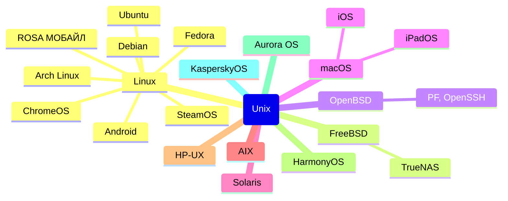

---

### ★ **Windows**

Разработчик: Microsoft.

Тип: Проприетарная (закрытый код).

Архитектуры: x86, x64, ARM64.

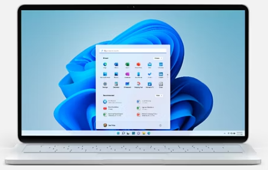

Windows – универсальная и распространённая система, которая подходит для дома, офиса, игр и разработки. Отличается удобным графическим интерфейсом, поддержкой большинства программ и игр. Есть основная версия (10, 11) и Windows Server с более широким набором инструментов администрирования (Active Directory, Hyper-V, SQL-серверы).

---

### ★ **Unix**

Разработчик: AT&T.

Тип: Проприетарная (но благодаря ей появились открытые системы).

Архитектуры: x86, x64, ARM

В основном Unix рассматривается как семейство систем – к примеру, Solaris (Oracle) для серверов, AIX (IBM) для мейнфреймов и HP-UX (Hewlett-Packard) для корпоративных решений.

---

### ★ **Linux**

Разработчик: Сообщество (автор ядра – Линус Торвальдс).

Тип: Открытый исходный код (Open Source).

Архитектуры: x86, x64, ARM64.

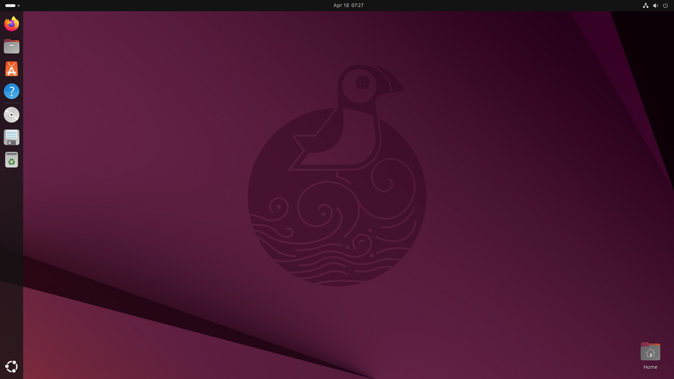

Это бесплатная ОС, которая не такая дружелюбная для новичка, как Windows, да и не весь софт работает по умолчанию, но пользуется популярностью благодаря своей гибкости, безопасности и свободы дистрибутивов. 

Популярные дистрибутивы (сборки-вариации Linux):
	- Ubuntu – для новичков;
	- Debian – стабильная основа для серверов;
	- Arch Linux – для продвинутых пользователей;
	- Fedora – тестовая площадка для новых технологий.
	
Их на самом деле довольно много, но мы ещё не раз поговорим о Linux, так что пойдёмте дальше.

---

### ★ **MacOS (пишется как macOS)**

Разработчик: Apple.

Тип: Проприетарная (кстати, на базе Unix).

Архитектуры: ARM64.

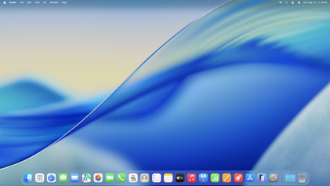

Это ОС, оптимизированная под железо Apple, элегантная, безопасная и интегрированная в экосистему iPhone, iPad. Закрытая, а совместимость довольно ограничена.

---

### ★ **Android**

Разработчик: Google (на базе Linux).

Тип: Открытый исходный код (потому так много смартфонов с этой ОС).

Архитектуры: ARM (мобильные устройства).

Самая популярная мобильная ОС, гибкая и с огромным набором совместимых приложений, однако имеет большое количество разных версий и модификаций от производителей смартфонов.

---

### ★ **iOS, iPadOS**

Разработчик: Apple.

Тип: Проприетарная (на базе Unix).

Архитектуры: ARM64.

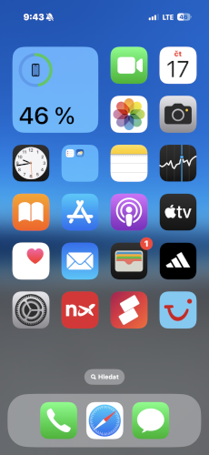

Как и macOS, закрытая, оптимизированная под экосистему Apple. iOS – для iPhone, iPad OS – для iPad.

---

### ★ **FreeBSD**

Разработчик: Сообщество FreeBSD

Тип: Открытая.

Архитектуры: x86, x86_64 (основная), ARM, PowerPC, SPARC.

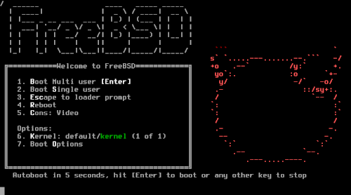

Произошла от BSD. Часто выступает и в качестве основы для других ОС, таких как TrueNAS. Поддерживает файловую систему с продвинутыми возможностями - ZFS, изоляцию процессов (jails) и систему управления пакетами (ports). Известна своей надёжностью и стабильностью. Применяется для серверов, встраиваемых систем.

---

### ★ **OpenBSD**

Разработчик: Тео де Раадт и сообщество OpenBSD.

Тип: Открытая.

Архитектуры: x86, x86_64 (основная), ARM, SPARC, MIPS.

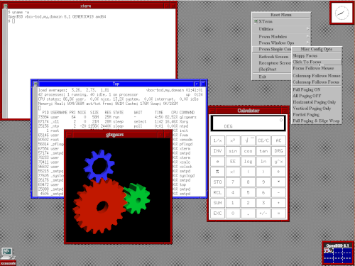

Произошла от NetBSD, но с акцентом на безопасность. Считается одной из самых безопасных ОС в мире благодаря строгому кодированию, постоянному аудиту безопасности и интеграции механизмов защиты. Включает встроенный брандмауэр PF (Packet Filter), применяется для создания защищённых серверов, маршрутизаторов и файрволов.

---

### ★ **HarmonyOS**

Разработчик: Huawei

Тип: Проприетарная (с элементами открытого кода).

Архитектуры: ARM (основная).

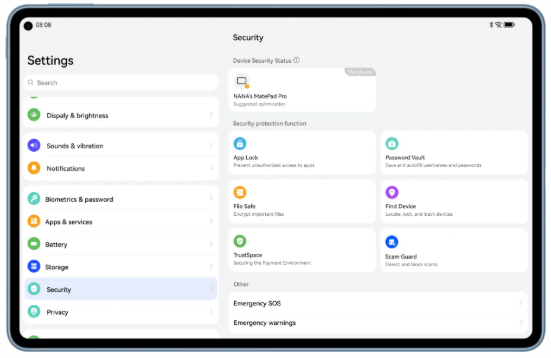

Разработана как альтернатива Android после санкций США против Huawei. Оптимизирована для IoT-устройств, смартфонов и планшетов. Включает поддержку распределённных вычислений (например, связь между устройствами в экосистеме).

---

### ★ **ChromeOS**

Разработчик: Google.

Тип: Открытая (основанная на Linux, но с проприетарными компонентами).

Архитектуры: x86, x86_64 (основная), ARM.

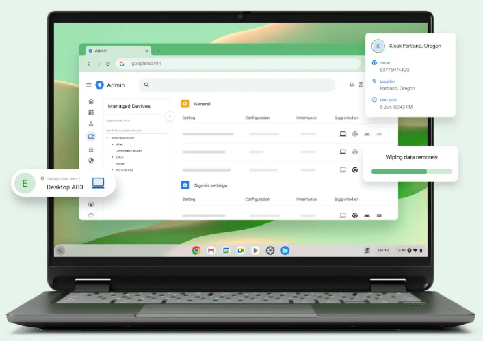

Основана на Linux, построена вокруг браузера Chrome и облачных сервисов. Поддерживает приложения Android и Linux через контейнеры. Используется в образовательных учреждениях и для повседневных задач.

---

### ★ **SteamOS**

Разработчик: Valve Corporation

Тип: Открытая.

Архитектуры: x86_64 (основная).

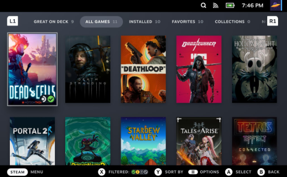

Создана для игровой консоли Steam Deck и других устройств, вроде Steam Machine. Основана на Linux, оптимизирована для игр, поддерживает Proton, который обеспечивает совместимость с Windows-играми. Бесплатная и доступная для установки на любые совместимые устройства.

---

### ★ **Aurora OS**

Разработчик: ООО «Открытая мобильная платформа»

Тип: Проприетарная.

Архитектуры: ARM (мобильные устройства).

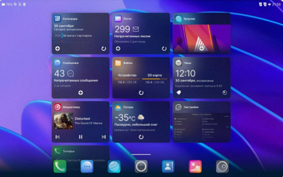

Российская адаптация Sailfish OS с добавлением локализации, поддержки отечественных сервисов и усиленной безопасностью. Sailfish OS изначально была создана финской компанией Jolla. Используется для мобильных устройств (смартфонов и планшетов).

---

### ★ **РОСА МОБАЙЛ**

Разработчик: РОСА Лабс.

Тип: Проприетарная.

Архитектуры: ARM (мобильные устройства).

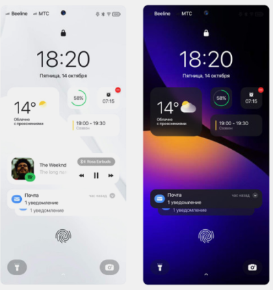

Полностью российская разработка с акцентом на импортозамещение и безопасность. Имеется поддержка традиционных рабочих сред Linux, поддержка контейнеризации, интеграция с отечественными СУБД, офисными пакетами. Предназначена для мобильных устройств, но также может использоваться на десктопах.

---

### ★ **KasperskyOS**

Разработчик: Лаборатория Касперского.

Тип: Проприетарная.

Архитектуры: ARM, x86, x86_64.

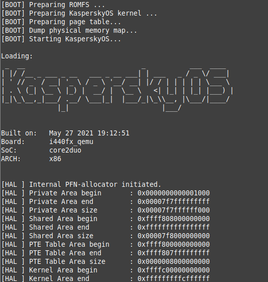

ОС с акцентом на безопасность и защиту от кибератак. Ядро выполняет только базовые функции (управление процессами и памятью), все остальные компоненты - изолированные модули. Включает строгий контроль безопасности (например, защищённый загрузчик и мандатное управление доступом). Применяется в сетевых устройствах, IoT-устройствах и других системах, требующих высокой защиты от кибератак.

Есть и другие виды операционных систем, к примеру, Haiku, ReactOS, TempleOS и многие другие, но они менее популярны.

---

## Игровые ОС

Игровые консоли являются отдельными устройствами по своей целевой направленности, но их природа является такой же - это компьютеры с процессором, жёстким диском / твёрдотельным накопителем, видеокартой и оперативной памятью. Всё их отличие в том, что архитектура и операционная система формируются строго под единственное требование пользователя - запускать игры.

---

### **Xbox**

Все поколения Xbox (Xbox Series X|S, Xbox One, оригинальный Xbox) разработаны Microsoft, используют операционную систему на основе Windows NT, адаптированную под игровые задачи. 

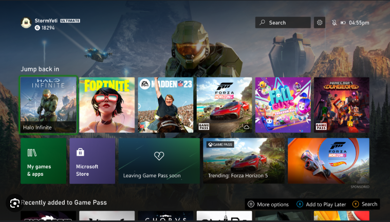

Ядро: модифицированная версия ядра Windows NT. В частности, Xbox Series X|S и Xbox One работают на гипервизоре, запускающем несколько изолированных сред - *Main OS*, основанный на Windows 10 Core (или Windows 11 в более новых ревизиях), и *System OS*, микроядерная среда для управления системными функциями (сеть, обновления, безопасность).

Гипервизор обеспечивает разделение между игровой средой, фоновыми процессами и системными службами. Он активируется сразу после загрузки и контролирует распределение ресурсов.

DirectX (особенно Direct3D) является основным графическим интерфейсом. Это позволяет использовать общие инструменты разработки с ПК.

---

### **PlayStation**

PlayStation (PS4, PS5) являются продуктами Sony и используют Orbit OS.

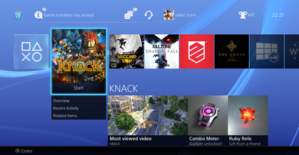

**Orbis OS** — это модифицированная версия FreeBSD, открытой Unix-подобной операционной системы, адаптированная Sony для использования на игровых приставках.

Ядро основано на FreeBSD 9/10 (в PS4), с глубокими изменениями в планировщике, управлении памятью и драйверах. Пользовательский режим содержит собственные компоненты для работы с графикой (GNM, GNP — низкоуровневые API), аудио, сетью и DRM.

Графический стек предоставляет доступ к GPU напрямую через библиотеки, что минимизирует накладные расходы. Поддерживается Vulkan-подобный уровень абстракции.

Архитектура PS5 сохраняет совместимость с PS4, включая ядро и основные системные вызовы, но добавляет новые возможности для SSD и 3D-аудио. Теоретически, последующие поколения будут развивать эту тему.

**PlayStation 1 (PS1)** не имеет полноценной операционной системы в классическом понимании. Вместо этого используется микроядерный системный слой, прошиваемый в BIOS консоли. Тогда ещё всё было настолько хардкорно - приложения загружаются напрямую в оперативную память (2 Мб DRAM) и выполняются без абстракции ОС: разработчики работают почти на уровне железа. BIOS PlayStation (в объёме 512 Кб) содержит базовую систему ввода-вывода, драйверы CD-ROM, графики, звука, контроллеров, функции загрузки игр с диска, библиотеки для работы с графикой (GTE — Geometry Transformation Engine), математические ускорители. И буквально - игра полностью контролирует систему. PS1 использует прошивочную модель выполнения, где «ОС» сводится к набору низкоуровневых подпрограмм, вызываемых напрямую из игры.

**PlayStation 2 (PS2)** также не имеет традиционной ОС. Вместо этого используется загрузочный образ ядра, называемый **IOP RPROM** (Input/Output Processor ROM), и **EE Kernel** (Execution Environment Kernel). Архитектура разделена на два процессора - Emotion Engine (EE), основной CPU, отвечает за логику игры, графику, и IOP (Input/Output Processor), модифицированный процессор MIPS R3051, работающий как отдельный микроконтроллер, управляющий сетью (Ethernet), USB, картриджами памяти, контроллерами, звуком. PS2 поддерживает установку Linux (официальный комплект "Linux for PlayStation 2"), который заменяет стандартное ядро и предоставляет полноценную Unix-подобную среду с ядром на основе Red Hat Linux 7.1 и модифицированными драйверами.

**PlayStation 3 (PS3)** первая приставка Sony с настоящей многозадачной, защищённой операционной системой. Архитектура основана на гипервизоре и микроядерных принципах. Имеет три уровня - LV1 Hypervisor (Microkernel), LV2 OS (на каждом игровом процессе) и XMB (XrossMediaBar, пользовательский интерфейс).

---

### **Nintendo Switch**

Как можно понять из названия, Switch 1-2 исходят от Nintendo. Switch использует операционную систему Horizon OS.

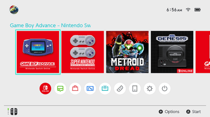

Horizon OS — это проприетарная операционная система, разработанная Nintendo совместно с NVIDIA. Она построена на микроядерной архитектуре.

Ядро: микроядро, написанное с нуля, ориентированное на низкое энергопотребление и быстрый отклик. Не основана на Linux или BSD, хотя часть пользовательских сервисов может использовать компоненты с открытым исходным кодом. Микроядро управляет планированием потоков, межпроцессным взаимодействием (IPC), виртуальной памятью, прерываниями. Драйверы и сервисы выполняются в пользовательском режиме, что повышает стабильность: сбой драйвера не приводит к падению всей системы.

Horizon OS оптимизирована под гибридный режим (портативный и домашний), включая быстрое переключение состояний питания и управление термальным режимом.

В Nintendo 3DS использовалась операционная система CTR-OS (Custom Nintendo 3DS OS) для работы с двумя экранами.

---