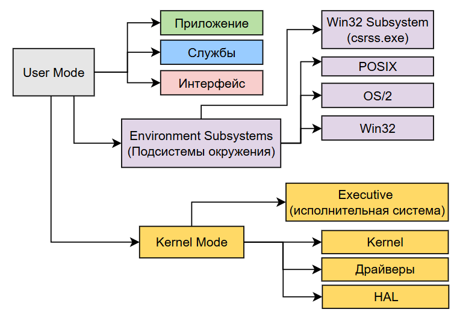
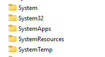

---
title: Windows
tags: [beginner, advanced, required, engineer, developer, architector]
---

# Windows

  ОБЯЗАТЕЛЬНО
  ДЛЯ НОВИЧКОВ
  НЕ ДЛЯ НОВИЧКОВ
  В РАЗРАБОТКЕ

Разработчику
Архитектору
Инженеру

## Windows

  
Внимание

  Приготовьтесь!
Страшные слова	
Сейчас будет много новых слов, связанных с ОС. Мы плавно изучим всё, не беспокойтесь. Важно сейчас выполнить краткий обзор этой ОС, её особенностей и компонентов. По такой же аналогии мы рассмотрим и другие ОС.

## Понятие и версии

★ **Windows** – семейство проприетарных операционных систем от Microsoft, ориентированных на широкий спектр устройств: от персональных компьютеров до серверов, мобильных устройств и даже игровых приставок (Xbox). 

Наиболее известны версии:
	- Windows 95
	- Windows XP
	- Windows 7
	- Windows Vista
	- Windows 8 (а также Windows 8.1)
	- Windows 10
	- Windows 11
	- Windows Server
	- а также вполне вероятно стоит ожидать Windows 12, 13 и так далее)))

Windows поставляется в различных вариациях и модификациях.

По назначению:
	- Windows 10/11 Home – домашнее использование;
	- Pro – дополнительные возможности (BitLocker, Remote Desktop);
	- Enterprise – корпоративные функции (MDM, AppLocker);
	- Education – аналог Enterprise для образовательных учреждений;
	- IoT – специализированные версии для устройств IoT (интернет вещей);
	- S Mode – ограничения по безопасности и производительности.

По типу:
	- Windows Desktop – классические ПК;
	- Windows Server – серверные версии с ролью Active Directory, Hyper-V, DNS/DHCP и прочее;
	- Xbox OS – модифицированная версия Windows NT для игровых консолей;
	- Windows Mobile / Windows Phone – устаревшие мобильные ОС.

По Xbox тема интересная. Microsoft политику свою всё же сменили, и если с 2001 до 2026 года Xbox представляла собой архитектурно совсем другое направление, со своей операционной системой, железом и прочими особенностями, то где-то с 2020-года их система PlayAnywhere получила развитие, окончательно окончив войну консолей - в 2026 году уже все ключевые эксклюзивы Microsoft - Gears of War, Halo, Forza Horizon - выходят на PlayStation, а следующий Xbox становится полноценным ПК с предустановленной модифицированной Windows на борту. Но исторически - Xbox является отдельной платформой.

Многие начали свой путь с этой ОС, научились щёлкать мышкой, запускать программы, сохранять файлы, создавать документы, играть, общаться. Если UNIX стала основой серверов, то Windows стала народной, породив целую культуру, расширив влияние с учёных и инженеров на школы, офисы и дома. Люди играли в сапёра, любовались рабочим столом, и проклинали синий экран смерти. Но как она устроена?

---

## Компоненты

★ **Основные компоненты Windows**:

### 1. Ядро 

★ Ядро (Kernel) – NT-ядро. Windows использует микрогибридное ядро, сочетающее в себе элементы микроядра и монолитного, что позволяет гибко управлять ресурсами и обеспечивает высокую производительность.

Архитектура Windows NT (слои):
	- User Mode (пользовательский режим) – приложения, службы, интерфейс;
	- System Support Processes – службы, например, csrss.exe;
	- Wind32 subsystem (csrss.exe) – отвечает за GUI и консоль;
	- Environment subsystems – подсистемы окружения (POSIX, OS/2, Win32);
	- Kernel mode (режим ядра) – управление памятью, процессором, драйверами.
	- Hardware Abstraction Layer (HAL) – адаптация к разным аппаратным платформам.
	

**User Mode**, как можно понять из названия, ориентирован больше на более простую работу с интуитивными и понятными возможностями. В этом режиме выполняются процессы с ограниченными привилегиями, изолированные друг от друга и от критических системных ресурсов. Каждый вызов ядра из пользовательского режима осуществляется через механизм Local Procedure Call (LPC) или Advanced Local Procedure Call (ALPC), что гарантирует контроль и безопасность перехода между режимами.

Приложениями и службами в User Mode являются стандартные приложения Win32, 64-битные и 32-битные процессы, а также системные и пользовательские службы, запускаемые через Service Control Manager.

**System Support Processes** включает в себя важные процессы - вышеупомянутый csrss.exe, отвечающий за управление консольными окнами, создание процессов и потоков, а также часть обработки вызовов Win32 API, связанных с пользовательским интерфейсом.

Подсистемы окружения обеспечивают совместимость с различными API. Win32 для большинства приложений, POSIX и OS/2 для поддержки старых приложений. 

Термин **Win32** обозначает 32-битное программное API операционной системы Windows, представленное в начале 1990-х годов. Название отражает разрядность целевой архитектуры процессора, на которую была рассчитана эта версия интерфейса. Исторически первые версии Windows (1.0–3.1) были 16-битными и работали поверх MS-DOS, используя 16-битную адресацию памяти и сегментную модель. Эти системы имели ограниченный объём доступной памяти и не обеспечивали полноценной многозадачности. С пояжением 32-битных процессоров Intel (начиная с i386), стало возможным создать более производительную и стабильную операционную систему, способную использовать линейное адресное пространство до 4 Гб на процесс.

Win32 стал набором программных интерфейсов (API), позволяющих приложениям использовать преимущества 32-битной архитектуры - плоское (линейное) адресное пространство, вытесняющую многозадачность, защиту памяти между процессами, прямой доступ к аппаратным ресурсам через драйверы. Это API стало основой для Windows NT, Windows 95 и всех последующих версий Windows.

Название Win32 закрепилось как стандартное обозначение этого поколения Windows, даже после перехода на 64-битные системы. Цифра 32 указывает на размер машинного слова и ширину регистров процессора в битах. В 32-битной архитектуре указатели имеют размер 32 бита, что позволяет адресовать до 2³² байт (4 Гб) памяти, большинство операций выполняются над 32-битными данными. ABI (Application Binary Interface) определяет формат вызова функций, расположение параметров, управление стеком — всё это специфично для 32-битной модели.

Пользователи, наверное, знакомы с 32 благодаря папке **System32** - это каталог, содержащий основные системные библиотеки (DLL), исполняемые файлы (EXE) и драйверы, необходимые для работы 32-битных компонентов ОС. Она расположена в `%WINDIR%\System32`. Вопрос о её названии в 64-битных системах является распространённой темой обсуждений, так как в современных 64-битных версиях Windows папка System32 содержит 64-битные бинарники, а не 32-битные, но ответ прост - обратная совместимость. Многие приложения, написанные для 32-битных систем, жёстко ссылаются на путь `C:\Windows\System32`. Изменение имени этой папки нарушило бы работу миллионов приложений.

В 64-битной Windows реализована система перенаправления (Windows File System Redirector) - когда 32-битное приложение запрашивает доступ к System32, оно автоматически перенаправляется в папку SysWOW64 (Windows on Windows 64), где хранятся 32-битные системные файлы. Соответственно, System32 остаётся местом для 64-битных системных модулей, несмотря на название.

Kernel Mode (режим ядра) не предназначен для пользователей, так как работает на более низком уровне, обладает полным доступом к аппаратным и программным ресурсам системы. Все компоненты в этом режиме работают в едином адресном пространстве.
	- Микроядро (NT Kernel) реализует базовые функции планирования потоков, прерываний, исключений и синхронизации.
	- Hardware Abstraction Layer (HAL) абстрагирует ядро от особенностей аппаратной платформы, скрывая различия в шинах (PCI, ACPI), контроллерах прерываний (APIC, PIC) и механизмах ввода-вывода. HAL позволяет одной и той же версии ядра работать на различных конфигурациях x86, x64 и ранее — на Alpha, MIPS.
	- Диспетчер объектов (Object Manager) централизованно управляет системными ресурсами (процессы, потоки, файлы, реестр) через унифицированную модель объектов.
	- Диспетчер памяти (Memory Manager) отвечает за виртуальную память, отображение файлов, страничный обмен и защиту памяти.
	- Диспетчер безопасности (Security Reference Monitor) осуществляет проверку прав доступа на основе дескрипторов безопасности (ACL, DACL).
	- Драйверы устройств и файловых систем взаимодействуют с оборудованием через стандартные интерфейсы, определённые в архитектуре Windows Driver Model (WDM) или Windows Driver Frameworks (WDF).

Ядро же состоит из следующих компонентов:
	- Executive: управляет процессами, памятью, I/O, безопасностью;
	- Kernel: низкоуровневые функции планирования и синхронизации;
	- Device Drivers: загружаемые модули для работы с железом;
	- Windowing and Graphic System (Win32k.sys): графическая подсистема.
	
---

### 2. Интерфейс

★ **Интерфейс** может быть **графическим** (GUI – Graphic User Interface) и **командным** (Command Line Interface).

**GUI**:
	- Desktop Environment – проводник, меню «Пуск», панель задач;
	- Shell – Explorer.exe, Taskbar, Start Menu;
	- DWM (Desktop Window Manager) – отрисовка окон, эффекты Aero;
	- DirectX – API для графики и игр;
	- WinUI / UWP / WPF – современные фреймворки интерфейсов.

**CLI**:
	- Command Prompt (CMD) – старый CLI, ограниченный;
	- PowerShell – мощная оболочка с доступом к .NET и объектами;
	- Windows Terminal – современный терминал с несколькими профилями.

Графический интерфейс как раз и представляет собой тот самый «Проводник» (которые многие помнят как «Мой компьютер»), дружелюбные иконки, панели задач, меню «Пуск» и «Рабочий стол». Это основа, которая позволяет интуитивно работать с компьютером, но для работы с системой можно использовать и консоль (командный интерфейс), которая позволяет вводить команды традиционно - текстом, без использования мыши.

---

### 3. Службы 

★ **Службы (Services)** – фоновые процессы системы, которые запускаются автоматически и не требуют пользовательского интерфейса.

Управление службами:
	- `services.msc` – графический редактор служб;
	- `sc` – команда для управления из CMD;
	- `Get-Service` – PowerShell.

  
Практическое задание

1. Нажмите Win+R или Пуск - Выполнить.
2. Введите services.msc
3. Ознакомьтесь со списком служб, которые работают в данный момент.

Ключевые службы:
	- Windows Update;
	- DHCP Client;
	- DNS Client;
	- Print Spooler;
	- Background Intelligent Transfer Service (BITS);

Службы нужны для того, чтобы система функционировала в полном объёме, независимо от действий пользователя. К примеру, учитывая аудиторию Windows, это важные процессы, которые обеспечивают работу офиса - сетевые службы, службы печати, центр обновления.

---

### 4. Утилиты

★ **Утилиты** являются более профильным, и даже прикладным инструментом. Обычному пользователю они могут не пригодиться, но порой нужно настроить рабочее место (силами администратора), или исправить какие-то неполадки устройства/системы, выполнить какие-то простые задачи. Тут и приходят на помощь различные средства, которые встроены в ОС.

Стандартные:
	- Task Manager (taskmgr) – управление процессами;
	- Resource Monitor (resmon) – детали использования ресурсов;
	- Disk Management (diskmgmt.msc) – управление дисками;
	- Registry Editor (regedit) – реестр Windows;
	- Group Policy Editor (gpedit.msc) – политики.
	
	

  
Практическое задание

1. Нажмите Win+R или Пуск - Выполнить.
2. Введите regedit
3. Ничего не меняйте, но ознакомьтесь — это реестр Windows, а открывшаяся программа - редактор реестра.

Сетевые:
	- Network and Sharing Center;
	- Wi-Fi Direct;
	- Bluetooth;
	- Internet Options;
	- ipconfig;
	- ping;
	- tracert;
	- netstat;
	- nslookup;
	- Windows Firewall with Advanced Security;
	- Routing and Remote Access (RRAS) для машрутизации и VPN-сервера;
	- netsh – CLI для настройки сети.

Сетевые утилиты используются для, как можно понять, решения проблем с сетевыми неполадками - пропало соединение, нужна первичная настройка, проверка доступа к серверу, анализ и маршрутизация.

---

### 5. Файловая система

★ **Файловая система** используется в ОС для хранения файлов, поэтому под тем самым «Проводником» скрывается сложный комплекс программ, который обеспечивает корректную работу при взаимодействии с хранилищем. Здесь всё не ограничено базовым «складом» файлов, нужна оптимизация занимаемого места, ускорение доступа к диску, шифрование, индексация и многое другое.

Наиболее популярные файловые системы:
	- NTFS – современная, поддерживает шифрование, ACL, жёсткие ссылки;
	- FAT32 – устаревшая, имеет ограничение – 4 ГБ на файл;
	- exFAT – для Flash-карт (флешек), нет ограничений FAT32;
	- ReFS – надёжная файловая система для серверов (Resilient File System);
	- APFS (через WSL2) – только в эмуляции.

Инструменты по работе с файловой системой:
	- CHKDSK – проверка диска;
	- DISM / SFC – восстановление системных файлов;
	- Defragmentation Tool – дефрагментация и оптимизация дисков.

---

### 6. Менеджеры

★ **Менеджеры ресурсов и процессов** занимают место между службами и утилитами, поэтому лучше их отметить отдельно. Они нужны для управления системой.

**Диспетчер задач (Task Manager)** – позволяет работать с процессами, производительностью, запускать приложения, и просматривать сведения о пользователях.

Диспетчер задач позволяет отобразить список всех запущенных приложений, фоновых процессов и служб, показывает потребление ресурсов каждым процессом - ЦП, ОЗУ, диск, сеть. графический процессор. Самое распространённое использование диспетчера задач - завершение задачи. Когда программа «зависла» и не отвечает, диспетчер позволяет завершить задачу (End Task) - такой процесс называется kill - убийством процесса.

Горячие клавиши - Ctrl+Shift+Esc для запуска диспетчера задач.

Альтернативный способ запуска - Ctrl+Alt+Delete - и выбрать диспетчер задач.

  
Практическое задание

1. Откройте любую простую программу.
2. Запустите диспетчер задач.
3. Найдите запущенную в п.1 программу в диспетчере задач.

**Монитор ресурсов (Resource Monitor)** предоставляет более детальную информацию о потреблении ресурсов, сетевых подключениях и использовании диска. Можно детально проверить, какие процессы используют процессор, получить информацию о потоках, модулях и обработке данных, просмотреть использование оперативной памяти, проанализировать активность чтения/записи на дисках. В части сети отображаются подключения, включая IP-адреса и порты, что позволяет выявить несанкционированные или подозрительные соединения.
Перейти можно, запустив через поиск (resmon или Монитор ресурсов) либо из диспетчера задач, с вкладки «Производительность».

**Диспетчер устройств (devmgmt.msc)** управляет оборудованием и драйверами. Все устройства организованы по категориям. Можно обновлять драйвера (автоматически и вручную из файла), удалять устройства, настраивать параметры. Если устройство работает некорректно, рядом с ним появится значок предупреждения.

Запускается через поиск (devmgmt.msc или Диспетчер устройств) или через контекстное меню - Пуск - Система - Диспетчер устройств.

---

### Прочее

★ **Среда и ключевое ПО, службы, инструменты**.

Сетевые технологии:
	- SMB/CIFS – протокол для сетевых ресурсов;
	- Remote Desktop Protocol (RDP) – удалённый доступ;
	- NetBIOS/WINS – устаревший способ именования хостов;
	- IPSec – безопасные соединения;
	- VPM (PPTP, L2TP, SSTP, IKEv2).

Важные инструменты:
	- PowerShell – мощная оболочка и язык скриптования;
	- WSL (Windows Subsystem for Linux) – запуск Linux внутри Windows;
	- Sysinternals Suite – диагностические утилиты (Process Explorer, TCPView и др.);
	- ProcMon / RegMon – мониторинг файловой и реестровой активности;
	- Windows Sandbox – легковесная среда для безопасного запуска приложений;
	- Task Sheduler – планировщик расписания выполнения задач;
	- Docker Desktop – контейнеризация;
	- Hyper-V, QEMU, VirtualBox, VMware – виртуальные машины;
	- Android Emulator – эмуляция Android;
	- Cygwin, MSYS2 – Unix-подобная среда.

Разумеется, операционная система позволяет работать по разному, и могут понадобиться дополнительные возможности для продвинутых пользователей. Вышеприведённые программы, на первый взгляд, кажутся простым перечислением каких-то наименований, но если присмотреться - это возможность запуска технологий, которые изначально и не рассчитаны для работы с Windows - к примеру, Docker, Android, Linux. А это означает, что можно развернуть Linux прямо внутри Windows.

---

## Файловая система и структура каталогов Windows

Файловая система Windows построена на основе архитектуры NTFS (New Technology File System), хотя также поддерживает FAT32 и exFAT для совместимости. В отличие от Unix-подобных систем, где всё начинается с единого корня `/`, Windows использует буквенную адресацию дисков: `C:`, `D:`, `E:` и так далее. Каждый диск представляет собой независимое дерево каталогов.

Структура каталогов в Windows тесно связана с моделью безопасности, изоляцией пользователей и совместимостью с предыдущими версиями ОС. Начиная с Windows Vista, Microsoft внедрила концепцию виртуализации файловой системы и реестра для обеспечения работы устаревших приложений без прав администратора.

### `C:\` — системный диск

В большинстве случаев операционная система Windows устанавливается на диск `C:\`. Именно здесь располагаются все ключевые системные компоненты, пользовательские профили и установленные программы.

### `\Windows` — основной системный каталог

Каталог `\Windows` содержит ядро ОС, драйверы, системные утилиты и библиотеки. Это read-only область для обычных пользователей.

#### `\Windows\System32`

Центральное хранилище 64-битных системных исполняемых файлов и DLL-библиотек:
- `kernel32.dll`, `ntdll.dll` — базовые системные библиотеки;
- `cmd.exe`, `powershell.exe` — интерпретаторы командной строки;
- `notepad.exe`, `calc.exe` — стандартные приложения;
- `drivers\` — драйверы устройств;
- `config\` — системные конфигурационные файлы и hive'ы реестра.

На 64-битных системах существует также `\Windows\SysWOW64` — каталог для 32-битных библиотек, обеспечивающий обратную совместимость через механизм WoW64 (Windows on Windows 64).

#### `\Windows\Temp`

Временные файлы, создаваемые системой и приложениями. Содержимое может очищаться автоматически или вручную.

#### `\Windows\SoftwareDistribution`

Хранилище обновлений Windows Update. Содержит загруженные пакеты и метаданные об установке.

#### `\Windows\Prefetch`

Кэш данных о запуске приложений, используемый для ускорения загрузки программ (технология SuperFetch / SysMain).

### `\Program Files` и `\Program Files (x86)`

Каталоги для установки приложений:
- `\Program Files` — 64-битные приложения;
- `\Program Files (x86)` — 32-битные приложения на 64-битной системе.

Доступ к этим каталогам ограничен: обычные пользователи могут только читать файлы, но не модифицировать их без повышения привилегий.

### `\Users` — пользовательские профили

Каждый пользователь системы имеет свой подкаталог в `\Users`. Имя каталога совпадает с именем учётной записи.

#### Структура профиля пользователя

- `\Desktop` — содержимое рабочего стола;
- `\Documents` — документы (аналог "Мои документы");
- `\Downloads` — загруженные файлы из браузера;
- `\Pictures`, `\Music`, `\Videos` — медиафайлы;
- `\AppData` — данные приложений (скрытый каталог);
  - `\Roaming` — данные, синхронизируемые в домене;
  - `\Local` — локальные данные, не предназначенные для переноса;
  - `\LocalLow` — данные с пониженным уровнем целостности (например, для Internet Explorer в защищённом режиме).

Каталог `\AppData` является аналогом `~/.config`, `~/.cache` и `~/.local` в Linux, но разделён по принципу изоляции и политик безопасности.

### `\ProgramData` — общие данные приложений

Скрытый каталог, содержащий данные, общие для всех пользователей:
- настройки программ;
- кэши;
- лицензионные файлы;
- журналы (logs).

Используется приложениями, которым требуется хранить информацию вне пользовательского профиля.

### `\PerfLogs` — журналы производительности

Системные логи, создаваемые средствами мониторинга производительности Windows (Performance Monitor).

### `\Recovery` — компоненты восстановления

Содержит образы WinRE (Windows Recovery Environment) и скрипты для аварийного восстановления системы.

### `\Boot` — компоненты загрузчика

Файлы, необходимые для начальной загрузки:
- `bootmgr` — загрузчик Windows Boot Manager;
- `BCD` — база данных конфигурации загрузки (Boot Configuration Data).

Этот каталог обычно находится на отдельном скрытом разделе EFI или активном системном разделе.

---

### Дополнительные особенности

#### Буквы дисков и точки монтирования

Windows позволяет монтировать тома не только как буквы (`D:`, `E:`), но и как подкаталоги другого тома (mount points). Например, можно подключить SSD как `C:\Data`.

#### Символические ссылки и жёсткие ссылки

Начиная с Windows Vista, ОС поддерживает:
- **жёсткие ссылки** (hard links) — несколько имён для одного файла на том же томе;
- **символические ссылки** (symlinks) — указатели на файлы или каталоги, даже на других томах;
- **точки соединения** (junction points) — аналог символических ссылок для каталогов (работают только локально).

Эти механизмы используются для обеспечения совместимости и гибкого управления пространством имён.

#### Реестр как расширение файловой системы

В Windows значительная часть конфигураций хранится не в текстовых файлах, а в иерархической базе данных — **реестре** (Registry). Он состоит из разделов (hives), таких как:
- `HKEY_LOCAL_MACHINE\SOFTWARE` — глобальные настройки ПО;
- `HKEY_CURRENT_USER` — настройки текущего пользователя.

Реестр интегрирован с файловой системой: например, при установке программы она может добавлять записи в реестр вместо создания `.ini` или `.conf` файлов.

---