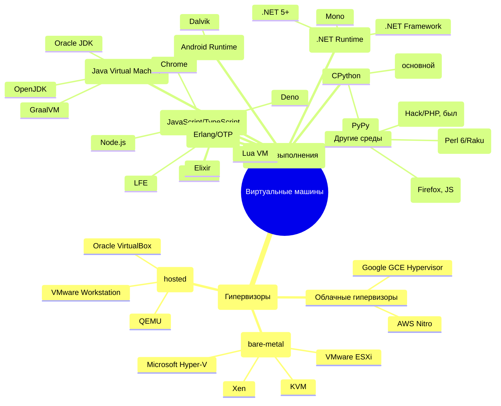

---
title: Платформы в IT
---

# Платформы в IT

  ОБЯЗАТЕЛЬНО
  ДЛЯ НОВИЧКОВ
  НЕ ДЛЯ НОВИЧКОВ
  В РАЗРАБОТКЕ

Разработчику
Архитектору
Инженеру

## Платформа

ОС является программным комплексом, который управляет ресурсами компьютера и обеспечивает взаимодействие между пользователем, приложениями и «железом». Но чтобы программа вообще могла запуститься, одного лишь присутствия ОС недостаточно.

Представим себе идеальное приложение, красивое, быстрое, удобное. Но на каком устройстве оно будет работать? На старом ноутбуке с процессором Intel Pentium? На MacBook с Apple M2? На смартфоне Samsung с процессором Snapdragon? Или на сервере в облаке? Каждое из этих устройств имеет:
	- свою архитектуру процессора (x86, x64, ARM);
	- свою операционную систему (Windows, macOS, Android);
	- свои способы взаимодействия с пользователем и оборудованием;
	- свои ограничения по энергопотреблению, памяти, драйверам.
	
Оборудование старого поколения не могут обеспечивать достаточным количеством ресурсов современные программы, так как их платформы, как и программы того же времени, создавались с расчётом на меньшую производительность.

Поэтому и существуют платформы как единый контекст, в котором приложение сможет существовать и корректно функционировать.

★ **Платформа** – сочетание аппаратной части и программной среды, на которой работает приложение. Она включает:
	- Аппаратную часть (процессор, архитектура: x86, x64, ARM);
	- Операционную систему;
	- Среды выполнения (JVM для Java, .NET для C#).
	

Платформы существуют из-за технических ограничений и бизнес-интересов компаний, ведь мир технологий не является единым монолитом, и устройства создаются разными компаниями под свои задачи:
	- настольные ПК - мощные, универсальные, но энергозатратные;
	- мобильные устройства - компактные, требуют энергоэффективности;
	- серверы в первую очередь должны быть надежными и стабильными.

Компании вроде Apple, Microsoft и Google создают собственные платформы, потому что это бизнес:
	- контроль качества обеспечит то, что программа, написанна специально под iPhone, будет работать лучше, чем портированная с Android;
	- создаётся экосистема - пользователь покупает iPhone, потом Mac, потом AirPods и всё будет работать вместе;
	- экономическая выгода - продажа устройств, подписок, сервисов внутри своей платформы.

Apple не хочет, чтобы на её чипах работала Android - потому что тогда исчезнет уникальность её платформы. Microsoft не выпускает Windows для ARM-смартфонов, потому что это не её целевой рынок. Конкуренция формирует границы платформ.

Это и есть первоочередная причина существования платформ - конкуренция. Apple первыми вышли на рынок смартфонов, представив революционный iPhone, вот и держатся. Корпораций множество - Microsoft, Apple, Google, Amazon, Nvidia, Oracle, IBM, HP, Dell, CISCO, Samsung, Xiaomi, Huawei, Sony, и прочие - все они формируют мировой рынок технологий.

Устройства представляют собой аппаратную часть - это физическая основа, процессор, память, шины, контроллеры. Архитектура определяет, какие инструкции понимает процессор, сколько данных он может обрабатывать за такт, как работает с памятью. Сейчас имеется три главные архитектуры, которые мы рассматривали ранее - x86, x64 и ARM. Современные программы не поддерживают x86, так как она даёт мало памяти и не имеет новейших инструкций. А программа, скомпилированная под x64, не запустится на ARM без специальных прослоек - Rosetta2 (Apple), QEMU, Proton (Valve). Это называется портированием.

Портирование ПО представляет собой адаптацию программы так, чтобы она работала в другой среде. Результат называется портом. Простейший пример - «DOOM», игра, разработанная для старых персональных компьютеров, модифицируется так, чтобы могла запускаться на смартфоне.
Допустим, приложение, которые было изначально под Windows, но потом воспроизведённое на Linux при помощи инструментов (Proton, например), не будет нативным – оно будет портированным. Игра из Steam, запущенная на Linux через Proton будет работать, но медленнее, так как является «не родным».

Программа, написанная изначально под определённую платформу, будет нативной - иными словами, «родной».

★ **Нативные приложения** – приложения, написанные специально для конкретной платформы на родном языке. К примеру, Microsoft Word для Windows – нативное, использует Win32 API и оптимизировано под x64.

Мультиплатформенность и кроссплатформенность – разные понятия. Мультиплатформенность подразумевает то, что программа может развернуться и запуститься на разных платформах, а кроссплатформенность – что программа работает единым кодом для разных платформ. К примеру, Telegram работает на разных устройствах отдельными клиентами, а Spotify работает по единой кодовой базе.

Если аппаратная часть предоставляет физическое «тело», то программная среда будет «душой» платформы, включая всё, что позволяет приложению получать доступ к ресурсам, взаимодействовать с пользователем, работать с оборудованием и безопасно выполнять код.

В программную среду входит:
	- ОС - ядро, драйверы, файловая система, планировщики задач;
	- API (Application Programming Interface) - интерфейсы, через которые приложение обращается к ОС (Win32 API, POSIX, Cocoa);
	- SDK (Software Development Kit) - набор инструментов для разработки (библиотеки, отладчики, документация);
	- UI-фреймворки - средства для построения пользовательского интерфейса (UIKit на iOS, SwiftUI, Android Views, Qt, GTK);
	- Стартовое ПО / системные службы - фоновые процессы, менеджеры, службы безопасности.

К примеру, чтобы приложение сохранило файл на диск, оно не пишет напрямую на жёсткий диск - оно вызывает функцию API ОС (WriteFile в Windows, write() в Linux). ОС уже через драйвер передаёт команду контроллеру диска. Так обеспечивается безопасность и совместимость.

---

## Виды платформ

Основные комбинации:

| Платформа | Аппаратная часть | Программная среда |
| :--- | :---: | ---: |
|Windows + x86/64	|Процессоры Intel/AMD	|Win32 API, .NET
|macOS + ARM/x86	|Apple Silicon/Intel	|Cocoa, SwiftUI
|Android + ARM	|Процессоры ARM	|Android SDK, NDK
|iOS + ARM	|Apple Silicon	|UIKit, Swift
|Web + JavaScript	|Любой процессор	|Браузер
|Linux + x86/ARM	|Intel/ARM	|GTK/Qt, Wayland

*Среда выполнения (runtime environment)* – программный слой, который обеспечивает работу приложения на целевой платформе. Программная среда - это всё окружение (ОС, API, драйверы, UI), среда выполнения же более узкое понятие, специфический механизм, который непосредственно выполняет код. 

Можно выделить следующие типы сред выполнения:

| Тип среды | Примеры | Особенности |
| :--- | :---: | ---: |
|Виртуальная машина	|JVM (Java), CLR (.NET)	|Исполняет байт-код
|Интерпретатор	|Python, Node.js	|Выполняет код построчно
|Нативная среда	|Android Runtime (ART)	|Компиляция в машинный код

Допустим, Java-приложение работает на любом устройстве с JVM благодаря байт-коду, а веб-приложение в браузере использует среду выполнения JavaScript. Языки программирования зачастую имеют свои виртуальные машины, которые и обеспечивают коррекность работы на конкретном языке. Мы ещё обязательно изучим их, а сейчас нам важно запомнить главное - алгоритм работы. 

Допустим, пользователь кликнул мышью по кнопке «Сохранить» в Photoshop.

1. Устройство ввода генерирует сигналы, отправленные пользователем, и драйвера в ОС их распознают.
2. ОС передаёт события ввода графической подсистеме - оконному менеджеру.
3. Оконный менеджер определяет, какое приложение под курсором, и передаёт событие ему.
4. Приложение, получает событие и вызывает свою логику сохранения.
5. Приложение обращается к API ОС, для сохранения файла в папку X.
6. ОС проверяет права, вызывает файловую систему, драйвер диска и данные записываются на жесткий диск.

Все эти шаги возможны только потому, что приложение работает в рамках платформы, знает API и имеет доступ к среде исполнения, совместимой с архитектурой. Никакого прямого доступа к железу нет, только через посредников. Именно это и обеспечивает стабильность всей системы.
