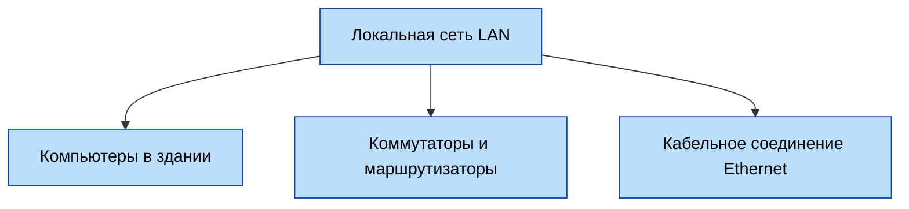
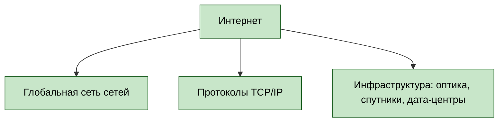
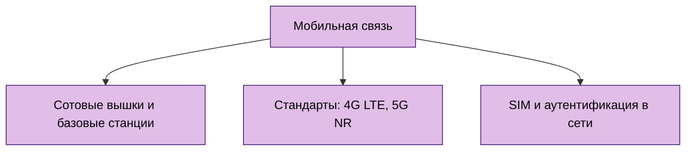
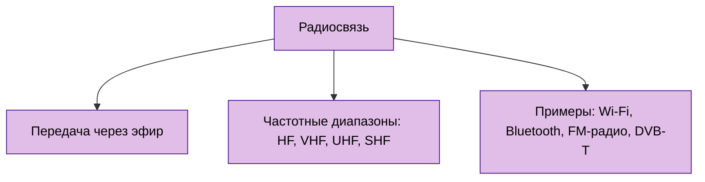

---
title: 2.03. Сеть и интернет
---

# 2.03. Сеть и интернет

  ОБЯЗАТЕЛЬНО
  ДЛЯ НОВИЧКОВ
  НЕ ДЛЯ НОВИЧКОВ
  В РАЗРАБОТКЕ

Всем

## Общее о сетях

Сейчас мы уже привыкли к такому явлению, как сеть. Мы всё время онлайн, как с телефона, так и с компьютера – работаем и играем с постоянным Интернет-соединением, общаемся и обмениваемся информацией, даже не задумываясь порой о том, какой путь прошли эти технологии, прежде чем дать нам возможность смотреть фильмы в 4K.

Люди веками искали способы передавать информацию на расстоянии (да, можно пошутить про голубиную почту – можете даже для интереса посмотреть, как это работало – приходилось действительно идти в «голубятню» и разбирать привязанные к ножкам птиц сообщения). 

★ **Сеть** – это просто система соединённых между собой устройств, которые могут обмениваться данными.

Для начала мы определим основные понятия:

★ **Локальная сеть (LAN, Local Area Network)** – когда компьютеры в одном здании связаны кабелями, допустим, в одном кабинете или офисе.

★ **Интернет** – глобальная сеть сетей, где миллиарды устройств общаются через провода, радиоволны и даже спутники.

★ **Мобильная связь** – сеть без проводов, использующая радиоволны и вышки.

★ **Радиосвязь** – передача данных через эфир (радио, телевидение и Wi-Fi).

★ **Пропускная способность** – количество данных, передаваемых за секунду, принято её называть скоростью (Dial-up – 56 Кбит/с, DSL – 10-100 Мбит/с, оптоволокно – 1-10 Гбит/с).

★ **Задержка (пинг)** – время отклика сети, измеряется в миллисекундах (телефонные линии – 50-100 мс, оптоволокно – 1-10 мс). Почему пинг? Потому что пинг-понг. Одна сторона словно отправляет «мячик» другой стороне, приговаривая «пинг!», а другая отвечает «понг!» и ударяет по мячику – именно то, сколько времени проходит между «пинг» и «понг» и будет задержкой.

★ **Протокол** – язык, на котором общаются устройства друг с другом.

★ **IP-адрес** – адрес устройства в сети (как адрес дома в городе).

★ **Порт** – числовой идентификатор (от 0 до 65535), который помогает программам на одном устройстве разделять сетевой трафик, словно номер квартиры в доме.

```mermaid
flowchart TD
    classDef osi fill:#f5f5f5,stroke:#616161,color:black;
    classDef lan fill:#bbdefb,stroke:#0d47a1,color:black;
    classDef global fill:#c8e6c9,stroke:#1b5e20,color:black;
    classDef wireless fill:#e1bee7,stroke:#4a148c,color:black;

    O[Модель OSI]:::osi

    L1[1 Физический]:::osi
    L2[2 Канальный]:::osi
    L3[3 Сетевой]:::osi
    L4[4 Транспортный]:::osi
    L5[5 Сеансовый]:::osi
    L6[6 Представительский]:::osi
    L7[7 Прикладной]:::osi

    O --> L1
    O --> L2
    O --> L3
    O --> L4
    O --> L5
    O --> L6
    O --> L7

    %% Привязка LAN
    L1 -.-> LAN1[LAN: кабель, коннекторы]:::lan
    L2 -.-> LAN2[LAN: Ethernet, MAC]:::lan
    L3 -.-> LAN3[LAN: IPv4/IPv6]:::lan

    %% Привязка Интернет
    L3 -.-> INT3[Интернет: IP, маршрутизация между сетями]:::global
    L4 -.-> INT4[Интернет: TCP, UDP]:::global
    L7 -.-> INT7[Интернет: HTTP, DNS, TLS, SMTP]:::global

    %% Привязка Мобильная связь
    L1 -.-> MOB1[Мобильная: радиоволны, антенны]:::wireless
    L2 -.-> MOB2[Мобильная: LTE RLC/MAC, 5G NR PDCP]:::wireless
    L3 -.-> MOB3[Мобильная: GTP, IP в ядре сети]:::wireless

    %% Привязка Радиосвязь
    L1 -.-> RAD1[Радиосвязь: эфир, частоты]:::wireless
    L2 -.-> RAD2[Радиосвязь: Wi-Fi, Bluetooth L2CAP]:::wireless
    L3 -.-> RAD3[Радиосвязь: IP поверх Wi-Fi / 6LoWPAN]:::wireless
```

