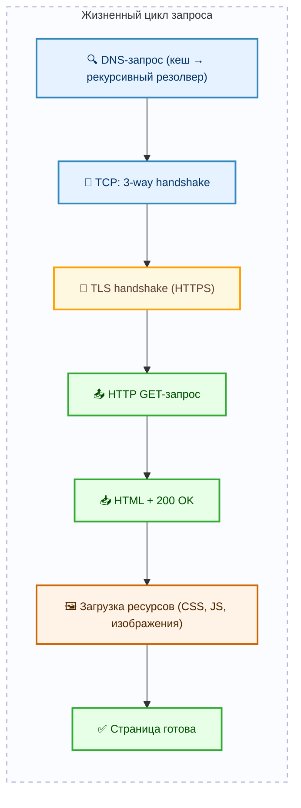
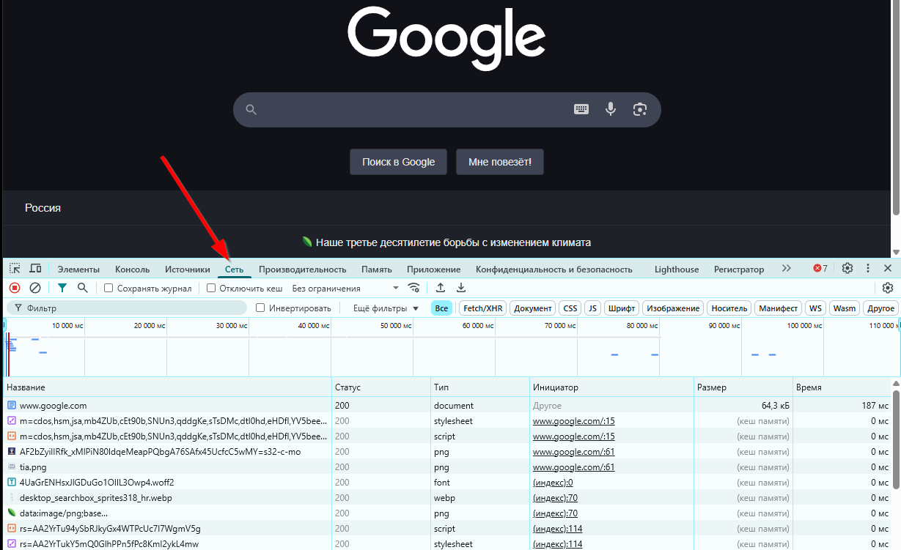

---
title: 2.03. Что происходит при загрузке сайта
---

# 2.03. Что происходит при загрузке сайта

  ОБЯЗАТЕЛЬНО
  ДЛЯ НОВИЧКОВ
  НЕ ДЛЯ НОВИЧКОВ
  В РАЗРАБОТКЕ

Всем

## Что происходит при загрузке сайта?

1. Клиент вводит https://google.com → браузер проверяет кеш DNS (чтобы найти IP-адрес сайта);
2. Устанавливается TCP-соединение (тройное рукопожатие);
3. Происходит рукопожатие защищённого соединения (HTTPS);
4. Браузер отправляет HTTP-запрос с методом GET;
5. Сервер отвечает HTML-страницей и статусом 200 OK;
6. Браузер получает HTML, обрабатывает (парсит) страницу, видит ссылки на стили, скрипты и изображения – и для каждого требуемого элемента делает дополнительный HTTP-запрос;
7. Сайт загружается полностью только после получения всех ресурсов.

  
Практическое задание

Выполните нижеследующее задание (повторите действия клиента).

Попробуйте поэкспериментировать – откройте браузер, откройте консоль разработчика (F12) и нажмите на вкладку Network (Сеть) и перейдите на google.com. Вы увидите следующее:

Мы видим целую кучу HTTP-запросов для каждого контента, видим статус, тип, инициатора, размер, и время. Именно так и происходит загрузка сайта. Пользуясь случаем, вы можете пройтись по прочим вкладкам консоли разработчика – там будет отображаться почти всё, что происходит «под капотом».

Коды статусов HTTP – результаты запроса:

| Код | Пример | Описание |
| :--- | :---: | ---: |
|1xx	|100 Continue	|Информационные
|2xx	|200 OK	|Успешный запрос
|3xx	|301 Moved Permanently	|Перенаправление
|4xx	|404 Not Found, 403 Forbidden	|Ошибка клиента (на запрашивающей стороне – страница не найдена, нет доступа или доступ запрещен)
|5xx	|500 Internal Server Error, 502 Bad Gateway	|Ошибка сервера (на получающей стороне, что-то сломалось на сервере, прокси-сервер не получил ответ от основного сервера или программа упала)
