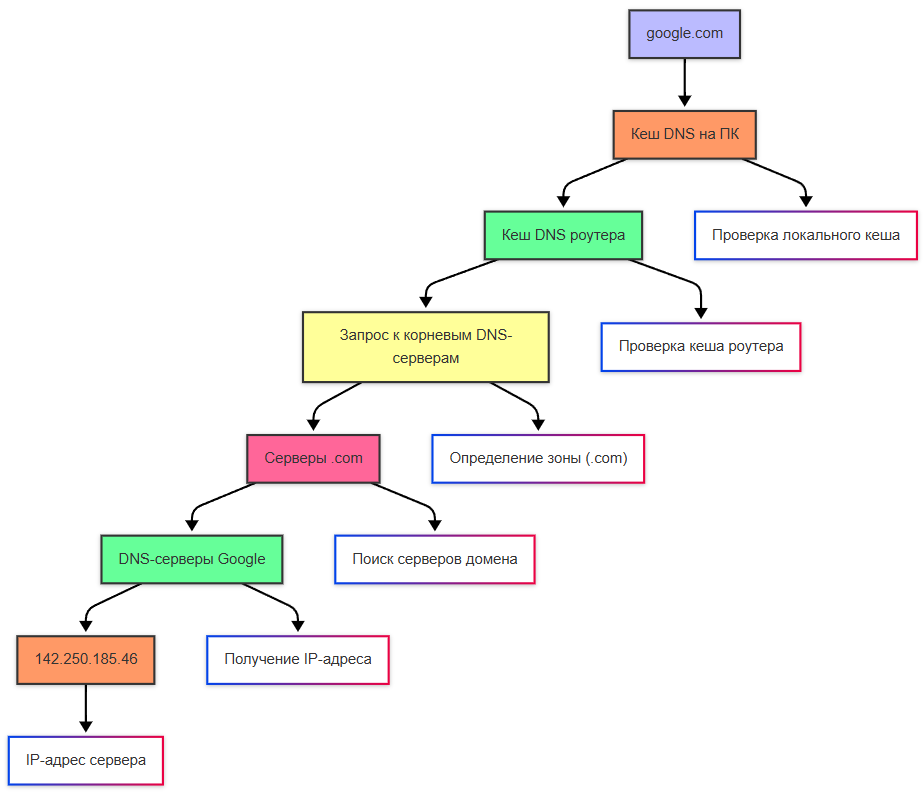
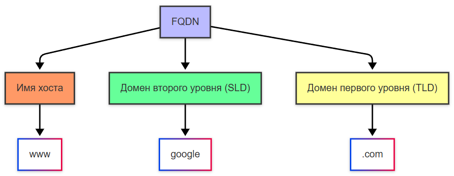
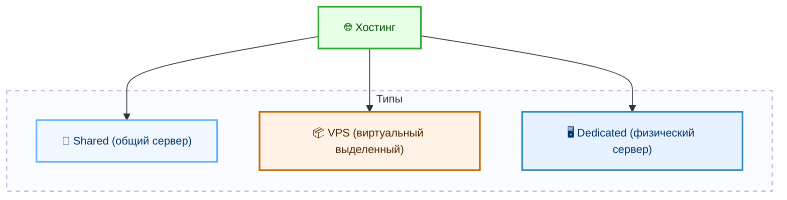
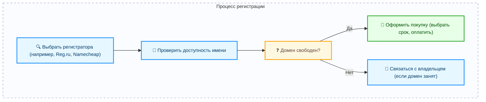

---
title: 2.03. DNS
---

# 2.03. DNS

<div class="article-tags">
  <span class="tag tag-required">ОБЯЗАТЕЛЬНО</span>
  <span class="tag tag-beginner">ДЛЯ НОВИЧКОВ</span>
  <span class="tag tag-advanced">НЕ ДЛЯ НОВИЧКОВ</span>
  <span class="tag tag-inprogress">В РАЗРАБОТКЕ</span>
</div>
<span class="complexity-badge">Всем</span>

## DNS

### Что такое DNS?

DNS (Domain Name System, Система доменных имен) — это глобальная распределённая иерархическая система преобразования имен, построенная по принципу деревьев и делегирования, сопоставляющая доменные имена сайтов c IP-адресами, чтобы устройства могли находить друг друга и обмениваться данными.

Система работает с момента появления интернета в таком виде, потому что люди гораздо лучше запоминают слова, чем наборы цифр. Представьте, если бы каждый раз при открытии почты вы набирали `95.143.192.11` вместо `mail.ru`.

Но мы набираем google.com – как он превращается в IP-адрес сервера? Как мы ранее упомянули, есть целая сеть адресов, и, разумеется, есть адресная книга, эта книга – **DNS (Domain Name System)** – именно это система переводит удобные человеку домены (google.com) в машиночитаемые IP-адреса (например, 142.250.185.46). 

DNS устроен иерархически: сверху — корневые серверы (их 13 логических групп, физически — сотни реплик по всему миру), ниже — серверы доменов первого уровня (.ru, .com, .org), ещё ниже — серверы второго и третьего уровней (например, `yandex.ru`, `mail.yandex.ru`). На каждом уровне происходит делегирование: корень говорит, *где искать информацию про .ru*, сервер .ru — *где искать информацию про yandex.ru*, и так до конца.

Вся эта структура поддерживается консорциумом ICANN (Internet Corporation for Assigned Names and Numbers) и национальными регистраторами. Данные в DNS хранятся в виде **ресурсных записей** — строгих строк определённого формата:  
— запись `A` связывает имя с IPv4-адресом,  
— запись `AAAA` — с IPv6-адресом,  
— запись `CNAME` — указывает, что одно имя является алиасом другого,  
— запись `MX` — задаёт почтовый сервер для домена,  
— запись `NS` — указывает, какие DNS-серверы управляют данным доменом,  
— запись `TXT` — содержит текстовую информацию, часто используется для подтверждения прав на домен или настройки безопасности.

Клиент (ваш браузер, приложение, ОС) никогда не взаимодействует с корневыми серверами напрямую. Он отправляет запрос одному из **рекурсивных DNS-резолверов** — серверов, которые умеют обходить всю цепочку делегирования и возвращать конечный ответ. Именно такой сервер указан в настройках вашего подключения.

При переходе на сайт, браузер проверяет **кэш DNS** на компьютере (если вы уже открывали этот адрес), затем на роутере (у которого тоже есть кэш DNS), и если адрес не найден, то запрос идёт к DNS-серверу провайдера. 

Так ведётся поиск адресата – в корневых DNS-серверах (которые покажут, где лежит .com, .net, .ru), затем к серверам домена (.com), и наконец, к DNS-серверам Google, которые и скажут – ага, сервер имеет такой IP-адрес.

```
google.com → кеш DNS на ПК → кеш DNS роутера → запрос к корневым серверам → серверы .com → DNS Google → 142.250.185.46
```




---

### Серверы DNS

В DNS участвуют два основных типа серверов:  
— **рекурсивные резолверы** (например, `8.8.8.8` от Google или `1.1.1.1` от Cloudflare),  
— **авторитативные серверы** — те, которые хранят оригинальные записи домена и отвечают за конкретную зону.

**Рекурсивный резолвер** работает от лица клиента. Он получает запрос вида *«Какой IP у `example.com`?»* и сам проходит всю цепочку:  
1. Запрашивает у корневых серверов — *«Кто отвечает за `.com`?»* → получает `NS`-записи для `.com`.  
2. Запрашивает у серверов `.com` — *«Кто отвечает за `example.com`?»* → получает `NS`-записи для `example.com`.  
3. Обращается к авторитативным серверам `example.com` и получает `A`-запись — `93.184.216.34`.  
4. Возвращает этот адрес клиенту.

Этот процесс происходит за доли секунды и почти всегда незаметен. Но если один из серверов недоступен, задержки возрастают, или запрос завершается ошибкой.

**Авторитативный сервер** — это хранилище истины для конкретного домена. Он не выполняет рекурсию и не ищет информацию в других зонах. Он знает только то, что ему поручили хранить. Например, если домен `example.com` делегирован на серверы `ns1.cloudflare.com` и `ns2.cloudflare.com`, то только эти серверы могут выдать корректную `A`-запись. Именно поэтому при смене хостинга важно обновить `A`-запись *именно в настройках DNS на авторитативных серверах* — а не в браузере и не в локальном кэше.

Авторитативные серверы часто предоставляются регистраторами (например, `ns1.reg.ru`, `ns2.reg.ru`) или сторонними провайдерами, такими как Cloudflare, AWS Route 53, Yandex DNS. Выбор таких провайдеров даёт дополнительные возможности: защита от DDoS-атак, географическое распределение ответов, автоматические проверки зоны, интеграция с CDN.

---

### Настройка DNS-серверов

Когда устройство подключается к сети — проводной или беспроводной — оно получает не только IP-адрес (например, `192.168.1.37`), но и дополнительные параметры: маску подсети, шлюз по умолчанию и **адреса DNS-серверов**. Эти параметры передаются через протокол DHCP (Dynamic Host Configuration Protocol), который автоматически выдаёт настройки клиентам в локальной сети.

По умолчанию ваш роутер предлагает в качестве DNS-сервера *свой собственный IP* (например, `192.168.1.1`). Роутер при этом сам выступает в роли промежуточного кэширующего резолвера: он принимает запрос от вашего компьютера, проверяет, нет ли ответа в собственном кэше, и если нет — пересылает запрос провайдерскому DNS-серверу.

Провайдерские DNS-серверы — это рекурсивные резолверы, входящие в инфраструктуру интернет-провайдера. Они быстры для локальных пользователей, но иногда ограничивают доступ к контенту, добавляют рекламу в ответы на несуществующие домены или логируют запросы.

Именно поэтому многие пользователи **вручную указывают альтернативные DNS-серверы** в настройках сетевого подключения:

| Сервер | Адрес IPv4 | Адрес IPv6 | Особенности |
|-------|-------------|------------|-------------|
| **Google Public DNS** | `8.8.8.8` / `8.8.4.4` | `2001:4860:4860::8888` / `::8844` | Высокая скорость, глобальное покрытие, базовая безопасность (фильтрация вредоносных доменов) |
| **Cloudflare DNS** | `1.1.1.1` / `1.0.0.1` | `2606:4700:4700::1111` / `::1001` | Акцент на приватность: заявлено, что журналы запросов удаляются в течение 24 часов |
| **Quad9** | `9.9.9.9` / `149.112.112.112` | `2620:fe::fe` / `2620:fe::9` | Встроенный фильтр угроз: блокирует домены, известные как источники фишинга или вредоносного ПО |
| **Yandex DNS** | `77.88.8.8` / `77.88.8.1` | `2a02:6b8::feed:0ff` / `::feed:1ff` | Три режима: базовый, «безопасный» (блокировка вредоносных), «семейный» (плюс блокировка 18+) |

Изменить DNS можно:
- в настройках Wi-Fi/проводного подключения в ОС (Windows, macOS, Linux, Android, iOS),
- на самом роутере — тогда *все устройства в сети* будут использовать выбранный резолвер,
- с помощью приложений (например, `NextDNS`, `AdGuard Home`), которые запускают локальный DNS-прокси с расширенными правилами фильтрации.

Смена DNS не шифрует весь ваш трафик (для этого нужен VPN или DoH/DoT), но повышает приватность по сравнению с провайдерским резолвером и часто ускоряет открытие сайтов за счёт оптимизации маршрутизации.

---

### DNS-кеширование

★ Именно благодаря **DNS-кешированию** (записи сайтов, которые вы уже посещали) ускоряется загрузка сайтов, и, если вы в первый раз посещаете сайт, он так долго открывается.

DNS-кеширование — это механизм временного хранения результатов предыдущих запросов, позволяющий избежать повторного обращения к серверам при каждом открытии страницы. Он работает на нескольких уровнях иерархии:

#### 1. Кэш приложения  
Некоторые программы (например, браузеры на основе Chromium) поддерживают *внутренний DNS-кэш*, чтобы не дергать систему при повторном открытии вкладки. Обычно он живёт несколько минут.

#### 2. Кэш операционной системы  
В Windows — это служба `DNS Client` (`dnscache`), в Linux — демон `systemd-resolved` или `nscd`. ОС хранит записи в памяти, и при повторном запросе отдаёт IP мгновенно. Время хранения (TTL, Time To Live) берётся из ресурсной записи — например, если `A`-запись имеет TTL = 300 секунд, запись останется в кэше 5 минут.

> 💡 TTL устанавливает *авторитативный сервер*. Чем ниже TTL — тем быстрее обновляются изменения (полезно при переносе сайта), но выше нагрузка на DNS. Чем выше TTL — тем стабильнее и быстрее работа, но дольше распространяются изменения.

#### 3. Кэш роутера  
Большинство бытовых роутеров кэшируют DNS-запросы локально. Это уменьшает трафик к провайдеру и ускоряет ответ для всех устройств в доме.

#### 4. Кэш провайдерского рекурсивного резолвера  
Крупные провайдеры и публичные DNS-сервисы обслуживают миллионы запросов в секунду. Без кэширования это было бы невозможно. Они хранят популярные записи (например, `vk.com`, `youtube.com`) в оперативной памяти, и до 90 % запросов обрабатываются без выхода в глобальную сеть.

#### Как очистить кэш?
- Windows: `ipconfig /flushdns`  
- macOS: `sudo dscacheutil -flushcache; sudo killall -HUP mDNSResponder`  
- Linux (systemd-resolved): `sudo systemd-resolve --flush-caches`  
- Chrome/Edge: открыть `chrome://net-internals/#dns` → кнопка *Clear host cache*

Очистка кэша полезна при диагностике — например, если сайт переехал на новый IP, а у вас он всё ещё открывается со старого адреса.

---

### Домены

Тут мы затронули домены и хостинг. Здесь всё просто – сеть распределена организованно. 

Домен — это уникальное текстовое имя, идентифицирующее ресурс в интернете. Он служит человекочитаемым адресом и заменяет числовой IP, делая сеть удобной для использования.

Домен строится по принципу *обратного дерева*: самый общий элемент — справа, самый конкретный — слева.

Пример: `docs.spirzen.ru`

| Часть | Уровень | Назначение |
|------|---------|-------------|
| `ru` | домен верхнего уровня (TLD — Top-Level Domain) | Указывает на зону: географическую (`.ru`, `.de`), общую (`.com`, `.org`), тематическую (`.edu`, `.gov`, `.io`) |
| `spirzen` | домен второго уровня (SLD — Second-Level Domain) | Уникальное имя, выбираемое владельцем при регистрации |
| `docs` | поддомен (subdomain) | Логическое разделение ресурсов внутри одного домена. Может быть многоуровневым: `lab.dev.spirzen.ru` |

Поддомены не требуют отдельной регистрации — они создаются в настройках DNS для основного домена. Именно поэтому `mail.yandex.ru`, `maps.yandex.ru` и `music.yandex.ru` управляются одним владельцем и используют одну DNS-зону.

Полное доменное имя (FQDN — Fully Qualified Domain Name) включает *всю цепочку* и завершается точкой: `docs.spirzen.ru.` — так выглядит имя внутри протокола DNS. Точка в конце — корень дерева, но в обычной жизни её опускают.

Домен — это не сайт и не хостинг. Это *лицензия на имя*, выданная на определённый срок (от 1 года и более). Пока лицензия активна, владелец может управлять DNS-записями, перенаправлять трафик, выпускать SSL-сертификаты.



---

### Регистрация домена

Домен (domain) – «имя» сайта, которое арендуется у регистратора. 

Регистрация домена — это процедура получения права использования уникального имени в определённой зоне на оговорённый срок.

Процесс включает трёх участников:

1. **ICANN** — международная организация, управляющая корневой зоной и утверждением новых TLD.  
2. **Регистратура** — организация, поддерживающая техническую инфраструктуру зоны (например, `RU-CENTER` для `.ru`, `Verisign` для `.com`).  
3. **Регистратор** — компания, через которую пользователь оформляет домен (например, `Reg.ru`, `Namecheap`, `GoDaddy`). Регистратор взаимодействует с регистратурой от имени клиента.

Этапы регистрации:
1. Выбор имени и зоны (например, `mysite.com`).  
2. Проверка доступности через регистратора — запрос к регистратуре: свободно ли имя?  
3. Указание контактных данных (WHOIS): администратор, технический контакт, платёжный контакт.  
4. Выбор срока регистрации (1–10 лет для большинства зон).  
5. Оплата и активация — домен появляется в глобальной базе, и можно настраивать DNS.

Важные аспекты:
- **Автообновление** — большинство регистраторов включают его по умолчанию. Если отключено и оплата не поступила — домен освобождается и может быть выкуплен другим.  
- **Конфиденциальность WHOIS** — в некоторых зонах (например, `.ru`) контактные данные публичны по умолчанию. В других (например, `.com`) можно приобрести услугу *приватности*, чтобы вместо ваших данных в WHOIS отображалась информация агента.  
- **Передача между регистраторами** — возможна после 60 дней с момента регистрации. Требует подтверждения по email и иногда — разблокировки домена.

Регистрация не гарантирует право на торговую марку. Если домен совпадает с зарегистрированной маркой, владелец может потребовать его передачи через UDRP-процедуру (Uniform Domain-Name Dispute-Resolution Policy).


### Хостинг

★ **Хостинг** (от английского host) – сервер, где физически хранятся файлы сайта, которые отправятся в ответ – все веб-страницы, стили, скрипты, изображения. 

Они бывают нескольких видов:
	- Shared (share – делиться), общий сервер для многих сайтов;
	- VPS – виртуальный выделенный сервер – как раз ВМ;
	- Dedicated – физический сервер, буквально самостоятельное устройство.



---


### Как развернуть сайт на домене?

То есть, чтобы сайт заработал, нужно сначала купить домен (тот самый удобный адрес), затем настроить DNS (указав IP хостинга), загрузить свои файлы сайта на хостинг. И да, всё нужно покупать.

При регистрации домена, нужно найти «регистратора» - к примеру, Reg.ru, Namecheap, GoDaddy, проверить доступность доменного имени, проверить сроки продления и оформить покупку. Если домен доступен – значит, права предоставит регистратор. Если домен занят кем-то – придётся договориться с владельцем.

Существуют сервисы DNS, которые включат в себя набор услуг по защите от DDoS – к примеру, Cloudflare, AWS Route 53.

Значит, если вы захотите развернуть свой сайт, то у вас есть два процесса.

1. Размещение сайта.

```mermaid
%%{init: {
  "theme": "default",
  "themeVariables": {
    "fontSize": "13px",
    "fontFamily": "Segoe UI, Tahoma, sans-serif"
  }
}}%%

flowchart LR
    classDef action fill:#e6ffe6,stroke:#33aa33,stroke-width:2px,color:#004d00;
    classDef infra fill:#fff2e6,stroke:#cc6600,stroke-width:2px,color:#4d2600;
    classDef note fill:#fff8e1,stroke:#FFA000,font-style:italic;

    A["🛒 Купить домен"]:::action
    B["⚙️ Настроить DNS (запись A/AAAA → IP хостинга)"]:::infra
    C["📤 Загрузить файлы на хостинг"]:::infra
    D["✅ Сайт доступен"]:::action

    A --> B --> C --> D

    N["❗ Все компоненты — платные услуги"]:::note
    A -.-> N
```



2. Регистрация домена

