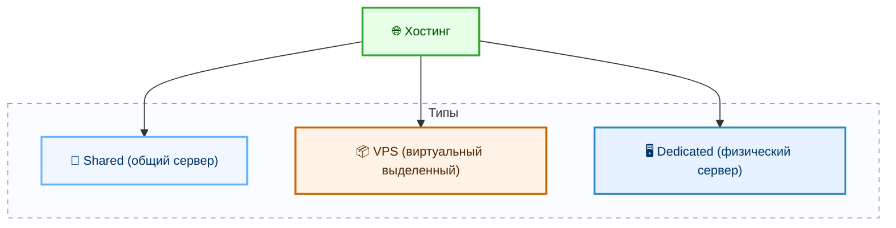
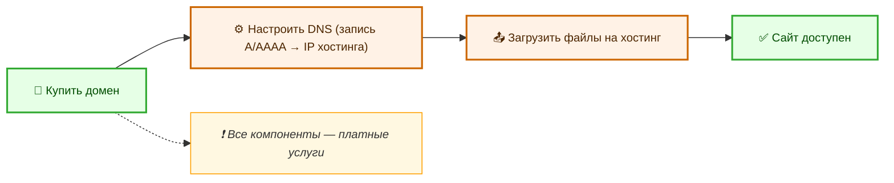
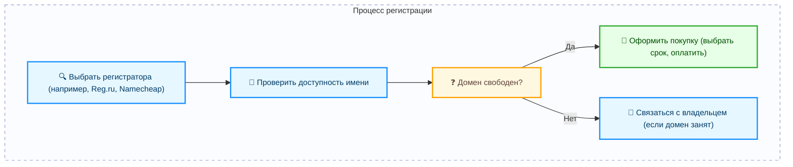

---
title: 2.03. DNS
---

# 2.03. DNS

<div class="article-tags">
  <span class="tag tag-required">ОБЯЗАТЕЛЬНО</span>
  <span class="tag tag-beginner">ДЛЯ НОВИЧКОВ</span>
  <span class="tag tag-advanced">НЕ ДЛЯ НОВИЧКОВ</span>
  <span class="tag tag-inprogress">В РАЗРАБОТКЕ</span>
</div>
<span class="complexity-badge">Всем</span>

## DNS

Но мы набираем google.com – как он превращается в IP-адрес сервера? Как мы ранее упомянули, есть целая сеть адресов, и, разумеется, есть адресная книга, эта книга – **DNS (Domain Name System)** – именно это система переводит удобные человеку домены (google.com) в машиночитаемые IP-адреса (например, 142.250.185.46). 

При переходе на сайт, браузер проверяет **кэш DNS** на компьютере (если вы уже открывали этот адрес), затем на роутере (у которого тоже есть кэш DNS), и если адрес не найден, то запрос идёт к DNS-серверу провайдера. 

Так ведётся поиск адресата – в корневых DNS-серверах (которые покажут, где лежит .com, .net, .ru), затем к серверам домена (.com), и наконец, к DNS-серверам Google, которые и скажут – ага, сервер имеет такой IP-адрес.

```
google.com → кеш DNS на ПК → кеш DNS роутера → запрос к корневым серверам → серверы .com → DNS Google → 142.250.185.46
```

---


---

★ Именно благодаря **DNS-кешированию** (записи сайтов, которые вы уже посещали) ускоряется загрузка сайтов, и, если вы в первый раз посещаете сайт, он так долго открывается.

Тут мы затронули домены и хостинг. Здесь всё просто – сеть распределена организованно. Домен (domain) – «имя» сайта, которое арендуется у регистратора. Домен состоит из уровней:
	- домен первого уровня (TLD) - .com, .org, .ru;
	- домен второго уровня (SLD) – google.
	
| google | .com |
| :--- | :---: |
|домен второго уровня	|домен первого уровня

**FQDN (Fully Qualified Domain Name)** — это полное доменное имя, которое однозначно идентифицирует хост в сети. Оно состоит из имени хоста и домена. FQDN используется в DNS для разрешения имен в IP-адреса.


---

## Хостинг

★ **Хостинг** (от английского host) – сервер, где физически хранятся файлы сайта, которые отправятся в ответ – все веб-страницы, стили, скрипты, изображения. 

Они бывают нескольких видов:
	- Shared (share – делиться), общий сервер для многих сайтов;
	- VPS – виртуальный выделенный сервер – как раз ВМ;
	- Dedicated – физический сервер, буквально самостоятельное устройство.



То есть, чтобы сайт заработал, нужно сначала купить домен (тот самый удобный адрес), затем настроить DNS (указав IP хостинга), загрузить свои файлы сайта на хостинг. И да, всё нужно покупать.

При регистрации домена, нужно найти «регистратора» - к примеру, Reg.ru, Namecheap, GoDaddy, проверить доступность доменного имени, проверить сроки продления и оформить покупку. Если домен доступен – значит, права предоставит регистратор. Если домен занят кем-то – придётся договориться с владельцем.

Существуют сервисы DNS, которые включат в себя набор услуг по защите от DDoS – к примеру, Cloudflare, AWS Route 53.

Значит, если вы захотите развернуть свой сайт, то у вас есть два процесса.

1. Размещение сайта.



2. Регистрация домена

