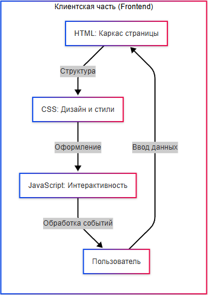
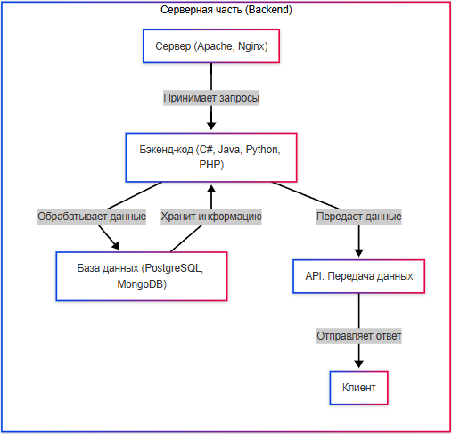

---
title: 2.04. Как работают сайты и веб-приложения
---

# 2.04. Как работают сайты и веб-приложения

  ОБЯЗАТЕЛЬНО
  ДЛЯ НОВИЧКОВ
  НЕ ДЛЯ НОВИЧКОВ
  В РАЗРАБОТКЕ

Всем

## Сайт и веб-сайт

★ **Сайт (веб-сайт)** – совокупность связанных веб-страниц, доступных в интернете через доменное имя. Работает по принципу клиент-серверного взаимодействия:

| Клиент (браузер) | Сервер (сайт) |
| :--- | :---: |
|Отправляет запрос	|Обрабатывает запрос
|Отображает страницу и содержимое	|Возвращает клиенту HTML, CSS, JS

---

## Виды сайтов

1. Статические сайты – готовые HTML-страницы без баз данных, обновляемые вручную – быстрые, простые. Примеры – сайты-визитки, блоки, лендинги.
2. Динамические сайты – генерируемые страницы «на лету» (контент подгружается из БД), с возможностями форм, авторизации, рекомендаций. Примеры – соцсети, магазины.
3. Веб-приложения – одностраничные приложения, в которых страница не требует перезагрузки – работает как десктопное приложение, и имеет быстрый отклик. Примеры – Gmail, Trello, Figma.
4. Гибриды – сочетающие в себе разные элементы первых трёх видов.

---

## Структура сайта
Сайт – не просто набор страниц, он включает в себя сложную систему.
★ **Клиентская часть (Frontend)**
	- HTML – каркас страницы (заголовки, текст, формы);
	- CSS – дизайн (цвета, шрифты, анимации);
	- JavaScript – интерактивность (кнопки, асинхронные запросы).
	

★ **Серверная часть (Backend)**
	- Сервер (Apache, Nginx), принимающий запросы;
	- Бэкенд-код (C#, Java, Python, PHP), обрабатывающий данные;
	- База данных (PostgreSQL, MongoDB) хранит информацию;
	- API – передача данных фронтенду.
	

---

## Элементы веб-страницы

1. Текст, использующий шрифты и форматирование, разделен на:
	- заголовки, структурирующие контент;
	- абзац – основной текст;
	- списки – для перечислений.
2. Кнопки – для интерактивных действий.
3. Изображения – для визуализации контента;
4. Гиперссылки – ссылки на другие страницы;
5. Виджеты – готовые блоки с функционалом, к примеру, калькулятор;
6. Вкладки для переключения контента;
7. Меню и хлебные крошки (Главная > Каталог > Ноутбуки);
8. Скрипты для динамического поведения (валидация, анимация, подгрузка);
9. Стили (оформление страницы);
10. Дополнительные ресурсы (шрифты, иконки, медиа).

  
Практическое задание

Откройте любой сайт.
Определите, какие элементы есть на странице.

---

## Этапы создания сайта

1. Проектирование (Figma, Tilda – прототипы);
2. Верстка (HTML/CSS по макету);
3. Программирование (Frontend + Backend);
4. Тестирование;
5. Деплой (развёртывание на хостинг).

---

## Состав сайта

Сайт состоит из файлов клиентского кода, адреса, контента и функционала.

**Файлы клиентского кода**

| Тип файлов | Для чего нужны | Примеры |
| :--- | :---: | :---: |
|HTML	|Разметка страницы	|`index.html`
|CSS	|Стили (цвета, шрифты)	|`styles.css`
|JavaScript	|Логика и анимации	|`script.js`
|Конфигурация	|Настройки сервера	|`.htaccess, nginx.conf`

★ **Адрес сайта**

Каждый сайт расположен на каком-то сервере (с использованием хостинга), следовательно, доменное имя – это адрес сайта в интернете (google.com).

★ **Функционал**

Базовые функции:
	- навигация (меню, ссылки);
	- поиск (особенно актуален для интернет-магазинов);
	- формы (регистрация, обратная связь).

Специальные возможности:
	- личный кабинет и персонализация;
	- корзина, оплата, каталог товаров;
	- комментарии, подписки, теги;
	- лента новостей, чаты, лайки.

★ **Веб-страница и контент**

Типы страниц:
	- Главная – лицо сайта;
	- Категории и каталог (для магазинов);
	- Статьи и новости, конкретные страницы;
	- Контакты и форма обратной связи.

Контент:
	- Текст;
	- Изображения;
	- Видео;
	- Аудио.

Важно: веб-сайт не может запускать исполняемый файл на клиенте, поэтому для этого используется ссылка для загрузки файла.

---

## Веб-приложение

★ **Веб-приложение** – интерактивная программа, работающая в браузере через интернет. В отличие от статических сайтов, имеет сложную логику работу, хранит данные пользователей и обновляет контент без перезагрузки страницы. Именно веб-приложение включает в себя фронт, бэк, базу данных и API. Работает веб-приложение в определённом порядке, к примеру:
	- пользователь открывает приложение в браузере;
	- браузер загружает HTML/CSS/JS;
	- JavaScript отправляет запросы к API;
	- сервер обрабатывает запрос и взаимодействует с БД;
	- данные возвращаются в формате JSON;
	- фронтенд динамически обновляет интерфейс.

Когда браузер получает HTML, он строит DOM-дерево, загружает CSS, и исполняет JavaScript, потом рендерит (прорисовывает) итоговую страницу. Для этого браузер использует движок JS (V8 в Chrome) и движок рендеринга (Blink в Chrome).
Браузер позволяет работать с клиентской частью не только в режиме просмотра, но и в режиме разработчика – при помощи «консоли разработчика» (DevTools) по F12. Консоль состоит из следующих вкладок:

| Вкладка | Использование |
| :--- | :---: |
|Elements	|Просмотр и редактирование HTML/CSS
|Console	|Логи ошибок, выполнение JS-кода
|Sources	|Отладка JavaScript
|Network	|Анализ запросов и скорости загрузки
|Performance	|Замер производительности
|Application	|Работа с Cookies, LocalStorage

---

## Веб-серверы и конструкторы сайтов

Как мы поняли, технически, сайт - это веб-приложение, данные и набор файлов. Но как заставить их взаимодействовать друг с другом и оживить, превратив в доступный сайт?

Есть два этапа.

**Первый этап** - оживить локально, на своём компьютере или сервере. Тогда приложение запустится, а сайт будет доступен по адресу локальной машины - localhost, с добавлением порта приложения (приложений ведь может быть много).

**Второй этап** - запуск на реальном домене в сети, когда необходимо выполнить определённые настройки, получить адрес в сети (домен) и настроить маршрутизацию адреса на свой сервер. Под сервером можно подразумевать как виртуальную машину в облаке, так и реальный сервер, а то и вовсе свой компьютер.

На своём компьютере разворачивать сайт, открытый в сеть, не рекомендуется - ведь машина будет открыта и для злоумышленников, а серверная защита намного серьёзнее, чем обычный антивирус.

И сам процесс развёртывания и настройки включает в себя подготовку конфигурации, которая содержит адрес к каталогу с приложением, адрес к главной странице, указание используемых портов, URL и конечно, настройки сертификации и авторизации. Всё это требует какой-то программы, которая бы запустила весь стек и держала запущенным, чтобы сайт работал. Для этого используются специальные менеджеры, которые и называют веб-серверами.

**Веб-сервер** — это программа или компьютер, который принимает запросы от браузеров и отдаёт им веб-страницы. Когда открывается сайт, браузер отправляет запрос по адресу сайта, сервер получает такой запрос, находит нужную страницу и возвращает её обратно в браузер. Такие серверы умеют обрабатывать запросы от множества пользователей одновременно, отдавать HTML, CSS, JavaScript, картинки, видео и другие файлы, а также запускать программы (скрипты), которые динамически создают содержимое сайтов (то есть, веб-приложения).

Настройка веб-сервера - это процесс, при котором мы говорим серверу:
	- где лежат файлы сайта;
	- на каком порту слушать запросы;
	- по какому домену к нему обращаться;
	- как обрабатывать ошибки;
	- как обеспечивать безопасность.

Большинство серверов используют текстовые файлы конфигурации, где прописаны все эти настройки. Но для новичков есть и более простые способы:
	- графический интерфейс (IIS Manager);
	- панели управления хостингом (cPanel, Plesk);
	- готовые преднастроенные пакеты (XAMPP).

**Панель управления хостингом** — это графический интерфейс (GUI), который позволяет управлять веб-сервером, сайтами, базами данных, доменами и другими элементами хостинга без знания командной строки или сложных настроек. Когда арендуется хостинг (виртуальный сервер), нужно залить файлы сайта, настроить домен, создать базу данных, установить почту, управлять доступами, SSL-сертификатами и т.д.

Панель управления позволяет сделать в одном месте, без проблем. cPanel и Plesk - самые популярные представители, с удобным управлением сайтами и доменами. В отличие от веб-сервера, здесь ориентировано всё на удобство и простоту, включая настройку почты, SSL и резервного копирования. 

Собрав сайт через конструктор, можно запустить сайт за пару кликов.

★ **IIS (Internet Information Services)** – веб-сервер от Microsoft, встроенный в Windows Server. Позволяет выполнять хостинг веб-сайтов и приложений, обрабатывать HTTP/HTTPS-запросы, работать с ASP.NET, PHP, FTP, SMTP. Можно развернуть приложение прямо в IIS, настроить всё через пользовательский интерфейс и сайт заработает. Если развернуть IIS на своём компьютере, то сайт будет работать так же, как на сервере.

**Пул приложений** – контейнер для процессов (w3wp.exe), в котором работают веб-приложения. Каждый пул изолирован от других, но используется .NET.

Сайт, развёрнутый через IIS – виртуальный хост, который:
	- слушает определённый IP-адрес и порт (80/443);
	- имеет корневую папку с файлами для сайта;
	- может использовать привязки (домены, SSL-сертификаты).

Добавление сайта в IIS:

1. IIS Manager – Сайты – Добавить веб-сайт;
2. Указать имя сайта, путь к файлам, привязать порт и адрес;
3. Указать пул приложений.

После добавления сайта, можно его запустить и перейти через IIS или открыть адрес в браузере.

★ **Apache Tomcat** – сервер приложений для запуска Java-приложений (JSP, Servlets). Сначала скачивается OpenJDK, затем скачивается Tomcat, потом развёртывается сервер.
	- порт по умолчанию: 8080, доступ по `http://сервер:8080`;
	- логи в `logs/catalina.out`;
	- настройки в `conf/server.xml`;
	- деплой приложения выполняется через копирование .war файла в `webapps/`.

★ **XAMPP** – готовый комплект для веб-разработки, который можно сразу использовать для локальной разработки и тестирования. Включает:
	- Apache (веб-сервер);
	- MySQL/MariaDB (БД);
	- PHP/Perl.

Для установки можно просто скачать с официального сайта и следовать указаниям установки. Доступ идёт через `http://localhost`.

**Nginx** (произносится «энджин-икс») – высокопроизводительный веб-сервер и обратный прокси, используемый для высоконагруженных сайтов и балансировки нагрузки. Он хорош для сайтов с большим количеством посетителей, так как очень быстро обрабатывает множество запросов. Устанавливается на Linux, чаще всего. Новичкам можно начать с готовых решений, например, можно установить контейнер Docker или использовать облачный хостинг. Но об этом ещё поговорим.

---

## Конструкторы веб-сайтов

Конструкторы же используются для более простых способов создания сайтов - когда не нужно знать языки разметки, запросов и программирования - достаточно просто перейти на сайт конструктора или скачать программу, и используя пользовательский интерфейс (редакторы, перетаскивания, кнопки), расставить нужные элементы, всё собрать и сохранить.

**Конструктор сайтов** - это онлайн-инструмент или программа, которая позволяет собирать сайт визуально, перетаскивая элементы, выбирая шаблоны и редактируя текст. Вы выбираете шаблон, добавляете элементы, нажимаете сохранить и всё. Не нужно знать HTML, CSS, JavaScript.

★ **WordPress** – конструктор для создания блогов и сайтов (использует PHP и MySQL). Для начала работы можно использовать онлайн-конструктор, или скачать WordPress и установить локально.

Есть и иные конструкторы сайтов, которые можно использовать на свой вкус и даже без знания кода – Tilda, Wix, Webflow, 1C-UMI и Google Sites. У них большие библиотеки шаблонов, даже своя интересная логика. Конструкторы подойдут для малого бизнеса, а для более сложных сайтов лучше перейти к WordPress/Nginx/Tomcat.

Все конструкторы направлены на аудиторию новичков, не имеющих опыта в веб-разработке. На биржах фрилансеров основная масса заказов от начинающих предпринимателей как раз на разработку или вёрстку сайта на платформе WordPress или Tilda. Вот их и рассмотрим.

**Шаблон** — это уже готовый дизайн сайта с определённой структурой (например, страница с заголовком, меню, блоками текста и изображений). Конструкторы предлагают сотни шаблонов, разделённых по категориям: лендинги, блоги, магазины, портфолио и т.д.

Большинство конструкторов работают по модели freemium: базовый функционал бесплатный, но с ограничениями (реклама платформы, поддомен, ограниченное место). Чтобы получить домен, убрать рекламу, добавить интернет-магазин или аналитику — нужно перейти на платный тариф.

Также доступны расширения (или приложения) — дополнительные модули (например, чат-бот, форма обратной связи, система бронирования), которые можно подключить к сайту. Многие из них платные. Как и в смартфоне есть App Store, в конструкторах есть каталог приложений. Это сторонние или внутренние сервисы, которые расширяют функциональность сайта - подключение к аналитике, интеграции, онлайн-оплата, формы сбора заявок.

Сложная логика (например, синхронизация с CRM или учётной системой) требует интеграции, которую либо делает сама платформа, либо подключает разработчик (часто за отдельную плату).

Когда вы создаёте сайт в Tilda, Wix или Webflow, вам не нужно вручную устанавливать веб-сервер, базу данных или хостинг. Всё происходит автоматически:
1. Вы редактируете сайт в браузере.
2. Конструктор сохраняет ваш контент в своей облачной базе данных.
3. При публикации **генерируются** HTML, CSS, JavaScript-файлы, именно они формируют внешний вид и поведение сайта.
4. Эти файлы размещаются на веб-серверах провайдера.
5. Сайт становится доступен по URL.

Таким образом, конструктор берёт на себя всю техническую часть: хостинг, безопасность, резервное копирование и масштабирование. Но! Если вы хотите выйти за рамки стандартных возможностей — например, добавить сложную форму обработки данных — может потребоваться кастомная интеграция через API или даже написание собственного бэкенда.

Я бы выделил три ключевых типа сайтов, разрабатываемых на конструкторах:

	- *Лендинг* (landing page) - одностраничный сайт, цель которого — побудить пользователя к действию: купить, подписаться, оставить заявку. Пример: промо-страница нового курса.
	- *Сайт-визитка* - краткая информация о человеке, компании или проекте: кто вы, чем занимаетесь, как с вами связаться. Часто используется фрилансерами и малым бизнесом.
	- *Блог* - сайт, где регулярно публикуются статьи, новости или мнения. Может быть частью большого сайта или существовать самостоятельно.

Конструкторы технически представляют собой CMS.

**CMS (Content Management System)** — система управления контентом. Это программное обеспечение, которое позволяет создавать, редактировать и управлять содержимым сайта без знания кода. Проще говоря: CMS — это «админка», где вы меняете текст, добавляете картинки и публикуете новости, как в соцсетях.

Конструкторы сайтов стараются встраивать SEO-возможности «из коробки»: автоматическое формирование метатегов, чистые URL, sitemap.xml. Но эффективность зависит от платформы и действий пользователя.

**SEO (Search Engine Optimization)** — это поисковая оптимизация. Цель — сделать сайт более заметным в результатах поиска (Google, Яндекс и др.).

Что включает SEO?
	- SEO-структура сайта: правильная организация страниц (главная → услуги → контакты), понятные URL (site.ru/uslugi/dizain), навигация.
	- SEO-оптимизация: использование ключевых слов в заголовках, мета-описаниях, атрибутах изображений, качественный контент.

Конструкторы всегда имеют визуальный редактор с *drag-and-drop*.

**Визуальный редактор** - интерфейс, в котором сайт можно редактировать «на глаз», как в графическом редакторе. Вы видите, как будет выглядеть страница, прямо во время редактирования.

**Drag and drop (перетаскивание)** - это такой метод взаимодействия, вы берёте элемент (текст, кнопку, фото) мышкой, перетаскиваете его на нужное место и отпускаете, словно собираете паззл, складывая сайт из готовых частей - блоков.

**Блоки** - это модульные элементы, из которых собирается страница: заголовок, текстовый блок, карусель изображений, видео, форма. Конструкторы (особенно Tilda и Webflow) предлагают библиотеки блоков, которые можно комбинировать.

---

### WordPress

**WordPress** — это система управления контентом (CMS) с открытым исходным кодом, позволяющая создавать сайты любой сложности: от блогов до интернет-магазинов.

Чтобы понимать, что собой представляет WordPress, проще всего сначала открыть эту ссылку - `https://wordpress.com/themes`
Там можно увидеть множество вариаций представления сайта. Можете ознакомиться и примерно представить, для чего и как можно использовать их.

На текущий момент существует два варианта:
	- `WordPress.com`, облачная платформа, не требующая хостинга. Новичкам лучше начать с неё, но здесь меньший контроль.
	- `WordPress.org`, скачиваемая программа для установки на свой хостинг. Полный контроль, но требуется немного технических знаний.

Чтобы сайт был в интернете, нужны:
	- Домен - адрес сайта (например, timur123.ru)
	- Хостинг - сервер, где будут храниться файлы сайта.

Технически, мы покупаем домен у регистратора, например, Reg.ru, выбираем хостинг и на хостинге устанавливаем WordPress через панель управления. Будто покупаем земельный участок и строим дом на нём.

WordPress предоставляет довольно дружелюбное к пользователям руководство по установке. Для установки понадобится PHP, MySQL или MariaDB.

На хостинге запускается мастер установки WordPress:
1. выбираем базу данных;
2. задаём логин и пароль администратора;
3. устанавливаем.

При этом на сервер загружаются файлы WordPress, которые включают в себя PHP, HTML, CSS, JS. Создаётся база данных, где будут храниться тексты, настройки, пользователи. И после установки можно зайти в «админку» (панель администратора) - просто перейдя по ссылке «вашсайт.ru/wp-admin».

Страницы передаются через веб-сервер, как раз Apache или Nginx.

В WordPress шаблон называется *тема* (theme). Можно сначала установить бесплатную тему, активировать её, определив внешний вид сайта - цвета, шрифты, расположение элементов.

Затем уже добавляется контент. С 2018 года WordPress использует блоковый редактор *Gutenberg* — он работает по принципу drag-and-drop. Просто добавляются страницы, а уже на них добавляются блоки. Можно начать с базового:

1. создать страницу;
2. добавить блок «Заголовок»;
3. добавить блок «Текст».

Каждый блок можно настроить по стилю, указав цвет, размер и выравнивание. Технически, это кусочек HTML/CSS/JS, который редактируется визуально.

Если устанавливать плагины (модули), можно расширить функциональность WordPress. Плагины работают на стороне сервера (PHP) и клиента (JavaScript). Они могут замедлять сайт, если их слишком много.

Итогом настройки будет публикация. Как только нажимаем кнопку «Опубликовать», контент сохраняется в базе данных, а при запросе пользователя веб-сервер (Apache/Nginx) вызывает PHP-скрипты WordPress, и HTML-страницы собираются динамически из шаблона и данных в БД. Браузеру пользователя отправляется уже готовая страница.

Это называется **динамическая генерация страниц** — в отличие от статических сайтов, где каждая страница — отдельный файл. Именно поэтому классический, «ванильный» HTML/CSS/JS набор называется **статическим**.

WordPress-сайт можно экспортировать, а производительность зависит от хостинга и оптимизации. Можно даже себе свой физический сервер выделить, и развернуть там. Помню, на моём опыте первый крупный портал для работы клиентов мы делали как раз через WordPress.

---

### Tilda

**Tilda** — облачный конструктор сайтов, ориентированный на визуальное проектирование без кода, особенно эффективен для лендингов и презентационных проектов.

Tilda — это онлайн-платформа для создания сайтов без программирования. Она не требует хостинга, домена или знания HTML. Всё происходит в браузере - аналогично, редактируется страница как макет в графическом редакторе, а Tilda сама заботится о публикации.

Есть домены `tilda.ru` и `tilda.cc` - можно зайти, зарегистрироваться и создать проект бесплатно. В принципе, это всё для начала - ни хостинга, ни базы данных, ни серверов. Tilda — это SaaS-платформа (Software as a Service), программа работает в облаке. Это модель, при которой программа работает в облаке, а пользователь получает к ней доступ через браузер.

Tilda предлагает сотни готовых шаблонов, разделённых по типам - лендинги, сайты-визитки, портфолио, онлайн-курсы.

В Tilda есть более 300 типов блоков, каждый — с настройками стиля, анимации и поведения - добавляется блок, заполняется контентом. Здесь тоже каждый блок — это HTML + CSS + JavaScript, но ты не видишь код. Всё делается визуально.

Интерфейс Tilda — это канвас (холст), на котором пользователь перетаскивает блоки, меняет их порядок, редактирует стиль. Все изменения отражаются мгновенно, результат сразу отображается в браузере. Такой визуальный редактор также называют WYSIWYG-редактор (What You See Is What You Get — «что видишь, то и получишь»).

Можете попробовать создать сайт, добавить туда страницы:
	- *Главная*;
	- *Портфолио*;
	- *Обо мне*;
	- *Контакты*.
	
*Публикация* сайта осуществляется почти полностью автоматически - генерируются статические HTML-страницы (или динамические, в зависимости от настроек), сайт размещается на веб-серверах Tilda, подключается SSL-сертификат (для HTTPS), и предоставляется ссылка. Если же купите домен, то разумеется можно привязать к нему, через DNS-настройки.

По сравнению с WordPress, гибкость ниже, некоторые вещи имеют более ограниченный контроль. Мы теряем контроль над деталями, но получаем красивый сайт быстро. К примеру, база данных скрыта от пользователя - находится в облаке на серверах Tilda. Также важно отметить, что Tilda - не CMS (как WordPress), а визуальная студия для контента, можно сказать.

При использовании Tilda ваш сайт привязан к платформе. Если Tilda изменит политику, поднимет цены или закроется — вы не сможете просто «скачать» свой сайт и перенести его. В WordPress такой проблемы нет: у вас всегда есть доступ к файлам и базе данных, можно сделать резервную копию и перенести на другой хостинг.

---

## Особенности веб-приложений

Современные веб-приложения выходят далеко за рамки простого отображения страниц. Они стремятся приблизиться по функциональности к нативным приложениям, предлагая пользователям высокую производительность, автономную работу, персонализацию и безопасность. Достигается это благодаря целому ряду технологий и API, которые расширяют возможности браузера и позволяют создавать сложные, масштабируемые и отзывчивые интерфейсы.

---

### Архитектурные и производственные особенности

Одно из ключевых преимуществ современных веб-приложений — автономная работа. Благодаря технологиям вроде Service Worker и Cache Storage, приложение может продолжать функционировать даже при отсутствии интернета. Например, вы можете читать статью, редактировать заметку или просматривать список задач, несмотря на потерю связи. Все изменения сохраняются локально и синхронизируются позже, когда соединение восстановится. Такой режим особенно важен для мобильных пользователей, путешественников или тех, кто работает в условиях нестабильного интернета.

Все данные в веб-приложении загружаются через сеть. 

Для этого используется *API Fetch* — современный способ отправки HTTP-запросов (вместо устаревшего XMLHttpRequest). С его помощью можно получать HTML-страницы, JSON-данные от сервера, изображения, шрифты, скрипты, файлы любого типа. Fetch позволяет гибко управлять запросами: добавлять заголовки, обрабатывать ошибки, кэшировать ответы и даже имитировать загрузку в офлайн-режиме. В сочетании с Service Worker он становится основой для создания быстрых и надёжных приложений.

**Фрейм (Frame)** — это часть окна браузера, которая может загружать и отображать отдельный документ. В прошлом фреймы использовались для разделения страницы на области (например, меню и контент), но из-за проблем с SEO и доступностью их использование сократилось. Сегодня термин чаще встречается в контексте iframe — встроенного фрейма, который позволяет встраивать внешние ресурсы (видео, карты, формы) в страницу без перехода по ссылке. Современные веб-приложения используют iframe с осторожностью, применяя политики безопасности (sandbox, CSP) для защиты от XSS и clickjacking.

**Спекулятивная загрузка (Speculative Loading)** — техника, при которой браузер предугадывает, какие ресурсы или страницы понадобятся пользователю дальше, и начинает их подготавливать заранее. Сюда входят:
	- *Prefetch* — предварительная загрузка ресурсов (JS, CSS, HTML);
	- *Prerender* — полная подготовка страницы в фоне, включая выполнение JavaScript;
	- *Preconnect / DNS-prefetch* — установление соединений с внешними доменами до фактического запроса.
	
Это значительно ускоряет восприятие скорости приложения, особенно при навигации между страницами.

Чтобы отслеживать проблемы, браузеры предоставляют отчёт о событиях через Reporting API.

**Reporting API** — механизм, позволяющий сайтам получать отчёт о различных событиях: ошибках, нарушениях политик безопасности (CSP), отказах загрузки ресурсов. Это помогает разработчикам диагностировать проблемы в продакшене и улучшать надёжность приложения. Отчёты отправляются асинхронно на сервер, не мешая пользователю.

**События** — это реакции на действия пользователя или системы - клик мышью, нажатие клавиши, отправка формы, загрузка страницы или потеря соединения. JavaScript «слушает» эти события и выполняет соответствующие действия. Например, при клике на кнопку может отправляться запрос к API, а при потере интернета — показываться уведомление об офлайн-режиме.

---

### Фоновые процессы и работа без интернета

**Синхронизация** — процесс согласования данных между клиентом (браузером) и сервером. Она может быть мгновенной, отложенной или двунаправленной.

Обычно веб-приложение работает в окне браузера: код выполняется только тогда, когда вкладка открыта и активна. Но есть и фоновая работа — выполнение задач, даже когда приложение закрыто или свёрнуто.

Это возможно благодаря:
	- *Service Worker* — специальный скрипт, который работает независимо от страницы. Он может перехватывать запросы, кэшировать ресурсы, получать push-уведомления и синхронизировать данные.
	- *Background Sync / Background Fetch* — позволяют выполнять действия (например, отправку сообщения) после восстановления интернета.
	
**Фоновая работа** делает приложения более надёжными и удобными, но требует согласия пользователя (особенно для уведомлений).

**Фоновая синхронизация (Background Sync)** — API, позволяющее откладывать действия (например, отправку сообщения или сохранение данных) до тех пор, пока устройство не окажется онлайн. Полезно для приложений с формами, чатами или офлайн-редакторами. Пользователь может закрыть браузер — задача всё равно будет выполнена позже.

**Фоновое извлечение (Background Fetch)** — расширение Background Sync, которое позволяет загружать большие объёмы данных (например, видео или обновления) в фоне, даже когда вкладка закрыта. Браузер показывает прогресс через уведомления, а после завершения активирует Service Worker для обработки результата.

**Возвратный кэш (Stale-While-Revalidate)** — стратегия кэширования, при которой браузер сначала показывает старую (устаревшую) версию ресурса из кэша, параллельно запрашивая обновлённую версию с сервера. Это ускоряет отклик, сохраняя актуальность данных.

---

### Хранение данных

Веб-приложения могут хранить данные на стороне клиента на разных уровнях, в зависимости от объёма, срока жизни и требований к безопасности.

Веб-приложения используют данные из разных источников:
	- *Локальные файлы* — загруженные пользователем изображения, документы.
	- *Сетевые API* — данные из JSON-эндпоинтов, REST или GraphQL.
	- *Базы данных* — как на сервере (PostgreSQL, MySQL), так и на клиенте (IndexedDB, WebSQL — устаревший).

**Локальное хранилище (LocalStorage)** — простое ключ-значное хранилище, доступное в рамках одного домена. Данные остаются после перезагрузки браузера, но ограничены ~5–10 МБ и синхронны (блокируют поток).

**Хранение сеансов (SessionStorage)** — аналогичен LocalStorage, но данные удаляются при закрытии вкладки.

**IndexedDB** — полноценная клиентская база данных с поддержкой транзакций, индексов и больших объёмов (до гигабайтов). Используется для офлайн-приложений, кэширования медиа, сложных форм.

**Хранилище кэша (Cache Storage)** — часть Service Worker API, позволяет сохранять сетевые ответы (HTML, JS, изображения) для офлайн-доступа. Ключевой элемент Progressive Web Apps (PWA).

**Общее хранилище (Storage Foundation API)** — экспериментальный API, позволяющий приложениям делиться данными между разными источниками (например, между origin'ами в рамках одной экосистемы) с явного согласия пользователя.

**Сегменты хранилища (Storage Buckets)** — новая концепция, позволяющая разделять данные в хранилище по «ведрам» с разными политиками выживания, квотами и уровнем изоляции.

**Хранилище расширения (Extension Storage)** — специфично для браузерных расширений; позволяет сохранять настройки и состояние вне контекста веб-страницы.

---

### Приватность и защита от отслеживания

**Приватность** — это право пользователя контролировать, какие данные о нём собираются, как они используются и с кем делятся. В контексте веба — это защита от слежки, профилирования и несанкционированного доступа.

**Анонимность** — состояние, при котором личность пользователя не может быть установлена. В вебе она достигается частично: IP-адрес, устройство, поведение — всё это может использоваться для идентификации. Полная анонимность возможна только с помощью Tor, VPN и других инструментов.

Сейчас браузеры поддерживают режим инкогнито (или приватный режим), при котором история посещений не сохраняется, куки удаляются после закрытия вкладки, данные форм не сохраняются.

Но: **вы не анонимны**! Сайты и ваш провайдер всё равно видят, что вы заходили. Инкогнито защищает только от других пользователей этого устройства.

**Куки (cookies)** — небольшие текстовые файлы, которые сервер отправляет браузеру для хранения состояния (например, авторизация). Как раз они хранятся локально, внутри профиля браузера и по доменам, каждая «кука» привязана к конкретному сайту. Браузер автоматически отправляет куки при каждом запросе к соответствующему домену. И вы понимаете - всё это записывается, фиксируется, что и представляет собой отслеживание.

**Трекинг** — сбор информации о поведении пользователя: какие сайты посещал, что искал, сколько времени провёл на странице.

**Трекеры** — скрипты или пиксели от рекламных сетей (Google Analytics, Facebook Pixel, Yandex.Metrica), которые следят за вами между сайтами. Они используют куки, localStorage, fingerprinting (отпечаток устройства) для построения профиля.

Браузер защищает пользователя от вредоносных действий с помощью политик безопасности:
	- *CSP (Content Security Policy)* — указывает, откуда можно загружать скрипты, стили, изображения и другие ресурсы. Помогает предотвратить XSS-атаки.
	- *Same-Origin Policy (SOP)* — запрещает скриптам одного сайта получать доступ к данным другого, если они с разных доменов.
	- *CORS (Cross-Origin Resource Sharing)* — механизм, позволяющий контролируемо нарушать SOP, если сервер явно разрешает доступ.

Эти политики создают «песочницу» вокруг веб-приложения, минимизируя риски.

Современные браузеры активно борются с трекингом и сбором данных без согласия. Для этого внедряются новые механизмы:

*Предотвращение отслеживания с переадресацией (Redirect Tracking Protection)* — блокирует передачу параметров трекинга при HTTP-перенаправлениях. Например, если ссылка ведёт через промежуточный трекер, браузер очищает URL от идентификаторов.

**Переадресация** — когда вы переходите по ссылке, но сначала попадаете на промежуточную страницу (например, `example.com/redirect?url=real-site.com`). Такие цепочки часто используются для трекинга: каждый переход фиксируется, и собирается цепочка поведения. Современные браузеры (Chrome, Safari, Firefox) начали очищать параметры трекинга при переадресации, чтобы защитить пользователей.

**Группы по интересам (Interest Cohorts)** — часть концепции FLoC (заменившейся позже на более приватные подходы), где пользователи объединяются в анонимные группы по поведению, чтобы реклама была релевантной, но без раскрытия личности.

**FLoC** — экспериментальный механизм Google (2021), призванный заменить куки в рекламе. Вместо отслеживания отдельных пользователей, браузер определял их «группу интересов» (например, «любители спорта») и показывал релевантную рекламу без раскрытия личности. Но FLoC вызвал критику из-за рисков деанонимизации и был заменён на более безопасные концепции, такие как Topics API.

**Личные токены состояния (Private State Tokens)** — механизм для борьбы с ботами и мошенничеством без использования кук. Позволяет сайту проверять легитимность пользователя, не отслеживая его между сайтами.

---

### Push-рассылка и уведомления

**Push-рассылка (Push Notifications)** — возможность отправлять уведомления пользователям даже тогда, когда они не находятся на сайте. Работает через Service Worker и Push API, интегрированный с облачными сервисами (Firebase Cloud Messaging, Mozilla Push Service). Пользователь должен дать разрешение, что обеспечивает контроль над уведомлениями.

**Service Worker** — это фоновый скрипт, который работает независимо от страницы. Он может перехватывать и кэшировать запросы, синхронизировать данные, показывать уведомления, запускаться по расписанию.

**Push API** — позволяет серверу отправлять сообщения в браузер через облачный сервис (например, Firebase). Пользователь получает уведомление, даже если сайт не открыт. Чтобы использовать Push API, нужно получить разрешение пользователя, зарегистрировать Service Worker, подписаться на push-сервер и обработать уведомление в Service Worker.

**Современное веб-приложение** — это не просто страница, а полноценная экосистема, сочетающая интерактивный интерфейс, глубокое хранение данных, фоновую обработку и уважение к приватности. Эти особенности делают возможным создание Progressive Web Apps (PWA) — приложений, которые работают как нативные: быстрые, надёжные, доступные офлайн и способные взаимодействовать с операционной системой.

Примером PWA является Google Keep, Spotify.

Что ж, интересно? Такова суть веба. В дальнейшем мы ещё не раз вернёмся к базам данных, HTML, CSS, JavaScript, облачным технологиям и развёртыванию.

