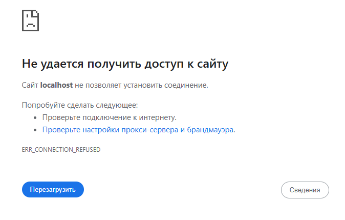

---
title: 2.04. Внутренние ошибки браузера
---

# 2.04. Внутренние ошибки браузера

  ОБЯЗАТЕЛЬНО
  ДЛЯ НОВИЧКОВ
  НЕ ДЛЯ НОВИЧКОВ
  В РАЗРАБОТКЕ

Всем

## Внутренние ошибки браузера

### Отличие ошибок клиента от HTTP-кода

Порой, когда мы пытаемся открыть какой-нибудь сайт, то при загрузке страницы можем получать сообщения в браузере:

Здесь нужно понять, что ошибки бывают двух видов:
- ошибки с кодами HTTP (4XX/5XX);
- внутренние ошибки браузера (ERR_...).

Такие ошибки сигнализируют о проблемах с загрузкой страниц, делясь на ошибки клиента (неверный адрес, нет интернета) и сервера (сбой, перегрузка). К примеру, 404 - не найдено, 403 - запрещено, 500 - внутренняя ошибка.

HTTP-ошибки возвращаются сервером. А вот внутренние ошибки браузера генерируются самим клиентским приложением, когда соединение с сервером не установлено, прервано или нарушено до получения HTTP-ответа. Да, можно делить именно так, что HTTP-ошибки на серверной части, а внутренние ошибки браузера на клиентской.

И если с кодами HTTP ещё ясно, то вот с ERR_ (к примеру, ERR_NAME_NOT_RESOLVED, когда браузер не может определить IP-адрес хоста) чуть сложнее. Такие ошибки не являются частью протокола HTTP и не зависят от серверной логики. Они возникают на уровне операционной системы, сетевого стека, TLS-библиотеки или самого браузерного движка.

Их мы и разберём.

Браузеры используют собственные системы идентификации сетевых сбоев, и каждая из них имеет свои особенности. Однако большинство современных браузеров (кроме Safari) основаны на одном из двух движков:
- Chromium — Google Chrome, Microsoft Edge, Opera, Яндекс Браузер;
- Gecko — Mozilla Firefox;
- WebKit — Safari (на macOS и iOS).

Это определяет схожесть или различие в форматах ошибок.

---

## 1. Ошибки в браузерах на базе Chromium

### Общая характеристика

Браузеры на базе **Chromium** (Chrome, Edge, Opera, Яндекс Браузер) используют общую систему ошибок, определённую в проекте **Chromium** как `net::Error`. Эти ошибки представлены в виде констант вида `ERR_*` и отображаются пользователю через понятные сообщения, но в инструментах разработчика (DevTools), логах или при программной обработке сохраняют свой оригинальный код.

> **Примечание**: Яндекс Браузер, несмотря на собственные надстройки (Turbo-режим, защита и т.п.), полностью использует Chromium-ядро и потому **идентичен Chrome** в плане сетевых ошибок.

### Формат ошибки

- Код: `net::ERR_CONNECTION_REFUSED`
- Сообщение пользователю: «Не удаётся подключиться к сайту»
- Отображение в DevTools → Network: красная строка с кодом ошибки
- Возможность перехвата в JavaScript: только через `fetch().catch()` или `XMLHttpRequest.onerror`, но без доступа к точному `ERR_`-коду

### Основные категории ERR_-ошибок

#### 1.1. DNS и разрешение имён

| Код | Описание |
|-----|--------|
| `ERR_NAME_NOT_RESOLVED` | Не удалось найти IP-адрес по доменному имени |
| `ERR_DNS_TIMED_OUT` | Превышено время ожидания ответа DNS-сервера |
| `ERR_DNS_CACHE_MISS` | Внутренняя ошибка кэша DNS (редко видима пользователю) |
| `ERR_DNS_SEARCH_EMPTY` | Не удалось выполнить поиск хоста в локальных доменах |

**Причины**:  
- Опечатка в адресе (`gogle.com`)  
- Неработающий DNS (например, при отключении интернета)  
- Блокировка домена провайдером или файрволом  

**Диагностика**:  
- Команда `nslookup example.com` или `dig example.com`  
- Проверка файла `hosts` на наличие переопределений  
- Смена DNS на `8.8.8.8` (Google) или `1.1.1.1` (Cloudflare)

---

#### 1.2. Установка TCP-соединения

| Код | Описание |
|-----|--------|
| `ERR_CONNECTION_REFUSED` | Сервер активно отклонил соединение (порт закрыт) |
| `ERR_CONNECTION_TIMED_OUT` | Сервер не ответил в течение заданного времени |
| `ERR_CONNECTION_RESET` | Соединение было неожиданно разорвано сервером |
| `ERR_CONNECTION_CLOSED` | Сервер закрыл соединение без передачи данных |
| `ERR_CONNECTION_ABORTED` | Соединение прервано по инициативе клиента или ОС |

**Причины**:  
- Веб-сервер не запущен (`localhost:3000` при отсутствии dev-сервера)  
- Фаервол/антивирус блокирует порт  
- Сервер перегружен и не принимает новые соединения  
- NAT или прокси неправильно настроены  

**Диагностика**:  
- `telnet example.com 80` — проверка открытости порта  
- `curl -v http://example.com` — детальный вывод соединения  
- Логи сервера (Nginx, Apache, Node.js и др.)

---

#### 1.3. SSL/TLS и безопасность

| Код | Описание |
|-----|--------|
| `ERR_SSL_PROTOCOL_ERROR` | Нарушена структура TLS-сессии (например, HTTP на HTTPS-порту) |
| `ERR_CERT_AUTHORITY_INVALID` | Сертификат не подписан доверенным центром |
| `ERR_CERT_DATE_INVALID` | Срок действия сертификата истёк или ещё не начался |
| `ERR_CERT_COMMON_NAME_INVALID` | Имя в сертификате не совпадает с доменом |
| `ERR_SSL_VERSION_OR_CIPHER_MISMATCH` | Нет общих версий TLS или шифров между клиентом и сервером |
| `ERR_SSL_PINNING_FAILURE` | Нарушена политика Certificate Pinning (в enterprise-средах) |

**Причины**:  
- Самоподписанный сертификат на локальном сервере  
- Устаревший сертификат Let’s Encrypt  
- Неправильная настройка reverse proxy (например, Nginx без `ssl_certificate`)  
- Атака MITM или корпоративный прокси с вставкой своего сертификата  

**Диагностика**:  
- Проверка сертификата через `openssl s_client -connect example.com:443`  
- Использование [SSL Labs Test](https://www.ssllabs.com/ssltest/)  
- Временное отключение проверки в dev-среде (только для разработки!)

---

#### 1.4. Прокси и сеть

| Код | Описание |
|-----|--------|
| `ERR_PROXY_CONNECTION_FAILED` | Не удалось подключиться к прокси-серверу |
| `ERR_TUNNEL_CONNECTION_FAILED` | Ошибка при установке HTTPS-туннеля через прокси |
| `ERR_INTERNET_DISCONNECTED` | ОС сообщает, что нет подключения к интернету |
| `ERR_NETWORK_CHANGED` | Сетевой интерфейс изменился (Wi-Fi → Ethernet и т.п.) |

**Причины**:  
- Неверные настройки прокси в системе или браузере  
- Корпоративный прокси требует аутентификации  
- Роутер перезагрузился во время загрузки страницы  

**Диагностика**:  
- Проверка настроек сети в ОС  
- Отключение прокси вручную  
- Использование режима инкогнито (часто игнорирует системные прокси)

---

#### 1.5. Прочие ошибки

| Код | Описание |
|-----|--------|
| `ERR_EMPTY_RESPONSE` | Сервер принял соединение, но не отправил ни одного байта |
| `ERR_TOO_MANY_REDIRECTS` | Бесконечная цепочка редиректов (301/302) |
| `ERR_BLOCKED_BY_CLIENT` | Запрос заблокирован расширением (AdBlock, uBlock и др.) |
| `ERR_ABORTED` | Запрос отменён (пользователь покинул страницу, скрипт вызвал `.abort()`) |
| `ERR_FILE_NOT_FOUND` | Локальный файл (`file://`) не существует |
| `ERR_ACCESS_DENIED` | Доступ к ресурсу запрещён (например, к `file:///C:/Windows/`) |

---

### Особенности Яндекс Браузера

Яндекс Браузер **не вводит новых ERR_-кодов**, но может:

- Маскировать некоторые ошибки под собственные сообщения (например, «Страница заблокирована» вместо `ERR_CONNECTION_REFUSED`)
- Добавлять предупреждения о фишинге или вредоносном контенте поверх стандартных ошибок
- В Turbo-режиме перехватывать запросы и показывать `ERR_PROXY_CONNECTION_FAILED`, если прокси Яндекса недоступен

Рекомендуется **отключать Turbo-режим** при отладке.

---

## 2. Ошибки в Mozilla Firefox (движок Gecko)

### Общая характеристика

Firefox использует собственную систему ошибок, основанную на **кодах `NS_ERROR_*`** и **`SEC_ERROR_*`**. Эти коды происходят из внутренней архитектуры Mozilla (XPCOM, NSS).

Они **не совпадают** с `ERR_`-кодами Chromium, но описывают те же классы проблем.

### Формат ошибки

- Код: `NS_ERROR_CONNECTION_REFUSED`
- Сообщение: «Firefox не может установить соединение с сервером»
- В DevTools → Network: отображается как `(failed)` с кодом в консоли
- В about:networking или about:config — можно включить расширенную диагностику

### Основные категории

#### 2.1. Сетевые ошибки (`NS_ERROR_*`)

| Код | Описание |
|-----|--------|
| `NS_ERROR_UNKNOWN_HOST` | Аналог `ERR_NAME_NOT_RESOLVED` |
| `NS_ERROR_CONNECTION_REFUSED` | Сервер отклонил соединение |
| `NS_ERROR_NET_TIMEOUT` | Таймаут соединения |
| `NS_ERROR_NET_RESET` | Соединение сброшено |
| `NS_ERROR_OFFLINE` | Режим «Работать автономно» включён |
| `NS_ERROR_PROXY_CONNECTION_REFUSED` | Прокси недоступен |

#### 2.2. Ошибки безопасности (`SEC_ERROR_*`, `SSL_ERROR_*`)

| Код | Описание |
|-----|--------|
| `SEC_ERROR_UNKNOWN_ISSUER` | Неизвестный центр сертификации |
| `SEC_ERROR_EXPIRED_CERTIFICATE` | Просроченный сертификат |
| `SSL_ERROR_BAD_CERT_DOMAIN` | Несоответствие домена |
| `SSL_ERROR_RX_RECORD_TOO_LONG` | Получен HTTP-ответ вместо TLS (аналог `ERR_SSL_PROTOCOL_ERROR`) |

### Особенности Firefox

- Firefox **более строг** к сертификатам, чем Chromium
- Поддерживает **Enterprise Roots** — корпоративные CA можно добавить через политики
- В `about:config` можно временно отключить проверку (`security.enterprise_roots.enabled`, `network.dns.disableIPv6` и др.)

---

## 3. Ошибки в Safari (движок WebKit)

### Общая характеристика

Safari — единственный из крупных браузеров, использующий движок **WebKit** (а не Chromium или Gecko). Его система ошибок отличается от других: она **менее детализирована**, часто **не показывает технические коды пользователю**, и многие сбои маскируются под общие сообщения вроде «Safari не может открыть страницу».

Тем не менее, внутри WebKit существуют собственные коды ошибок, которые можно увидеть:

- В консоли разработчика (DevTools → Console)
- В системных логах macOS (`Console.app`)
- При программной обработке через JavaScript или URLSession (в нативных приложениях)

В веб-контексте Safari **редко раскрывает точные коды**, но поведение при ошибках соответствует стандартным сетевым проблемам.

### Формат ошибки

- Пользовательское сообщение: «Safari cannot open the page because the server cannot be found»
- В консоли: `(failed)` или `Fetch API cannot load ... due to access control checks`
- Технический код (внутри): `kCFErrorDomainCFNetwork` + числовой код (например, `-1003` для DNS-ошибки)

### Основные категории ошибок (по числовым кодам CFNetwork)

Apple использует **CFNetwork Error Codes** — набор целочисленных значений из фреймворка Core Foundation. Наиболее частые:

| Числовой код | Эквивалент Chromium | Описание |
|-------------|---------------------|--------|
| `-1000` | `ERR_INTERNET_DISCONNECTED` | Не удалось установить соединение |
| `-1001` | `ERR_CONNECTION_TIMED_OUT` | Таймаут запроса |
| `-1002` | — | Неподдерживаемый URL-схема (например, `ftp://` без поддержки) |
| `-1003` | `ERR_NAME_NOT_RESOLVED` | Не удалось найти хост |
| `-1004` | `ERR_CONNECTION_REFUSED` | Соединение отклонено |
| `-1005` | `ERR_CONNECTION_CLOSED` | Соединение закрыто сервером |
| `-1006` | `ERR_CONNECTION_RESET` | Соединение сброшено |
| `-1200` – `-1209` | `ERR_SSL_*` | Ошибки SSL/TLS (сертификат, протокол, шифр) |

> **Примечание**: Safari **строже всех** применяет политику **App Transport Security (ATS)** на iOS/macOS. Даже если сертификат валиден, но не соответствует требованиям ATS (например, SHA-1 или TLS 1.0), соединение будет заблокировано с кодом `-1200`.

### Особенности Safari

- **Нет поддержки некоторых современных TLS-шифров** по умолчанию
- **Блокирует смешанный контент (HTTP на HTTPS-странице)** без возможности обхода
- **Не показывает ERR_-коды** — только общие фразы
- **Кэширует DNS агрессивно**, особенно на iOS
- **Ограничивает фоновые запросы** в мобильной версии (часто приводит к таймаутам)

### Диагностика в Safari

- Использовать **Develop → Show Web Inspector**
- Проверить вкладку **Network** на наличие красных записей
- Включить **Console** — там могут быть CORS-ошибки или блокировки безопасности
- На macOS: открыть **Console.app** → фильтр по «Safari» или «CFNetwork»

---

